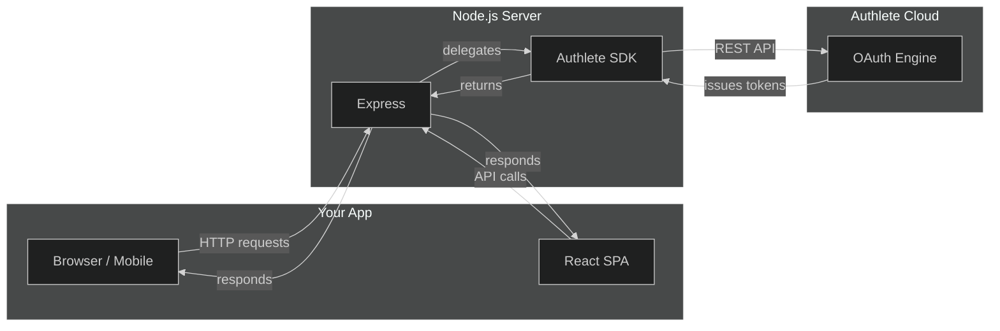

# Authlete Node.js Authorization Server

<p align="center">
  
</p>

> **The easiest way to build a production-grade OAuth 2.0 / OpenID Connect server — without building the hard parts.**

This project implements a complete OAuth 2.0 and OpenID Connect authorization server using [Express](https://expressjs.com/) and the [Authlete TypeScript SDK](https://github.com/authlete/authlete-typescript-sdk). Here's the key insight: **all the complex OAuth logic is handled by Authlete's cloud API**. This server is the "last mile" — the HTTP layer, session management, and user-facing pages that sit in front of Authlete.



## Why This Project Exists

OAuth 2.0 is powerful but complicated. The spec has dozens of extension points, each with their own security considerations. Authlete handles all of that complexity — token generation, client authentication, scope validation, PKCE verification — so you can focus on building your application.

**Think of it this way:** Authlete is the engine. This server is the car around it.

| What Authlete Handles | What This Server Handles |
|----------------------|-------------------------|
| Token generation & validation | HTTP routing & sessions |
| Client authentication | User login & consent pages |
| PKCE verification | CSRF protection |
| Scope & claim logic | Rate limiting & logging |
| DPoP & FAPI security | Prometheus metrics |
| All OAuth/OIDC spec compliance | React debugging dashboard |

## What's Inside

| Package | What It Is | Tech Stack |
|---------|-----------|------------|
| `server/` | Authorization server (Express) | TypeScript, Authlete SDK, EJS templates |
| `client/` | OAuth debugging dashboard | React, Vite, Tailwind CSS v4 |

## Getting Started

```bash
# 1. Install dependencies
npm --prefix server install && npm --prefix client install

# 2. Configure environment
cp server/.env.example server/.env
cp client/.env.example client/.env

# 3. Add your Authlete credentials to server/.env
#    Required: AUTHLETE_BEARER_TOKEN, AUTHLETE_BASE_URL, AUTHLETE_SERVICE_ID, SESSION_SECRET

# 4. Start the servers
npm --prefix server run dev    # Express on :3000
npm --prefix client run dev    # SPA on :3001 (proxies /api → :3000)
```

**That's it.** You now have a fully functional OAuth 2.0 / OpenID Connect authorization server.

## Features at a Glance

### Core OAuth 2.0 & OIDC

| Feature | Status | Documentation |
|---------|--------|---------------|
| Authorization Code (+ PKCE) | Working | [PKCE Tutorial](docs/PKCE-TUTORIAL.md) |
| Client Credentials | Working | [API Reference](docs/API.md) |
| Resource Owner Password | Working | [API Reference](docs/API.md) |
| Refresh Tokens | Working | [API Reference](docs/API.md) |
| OIDC Discovery | Working | [API Reference](docs/API.md) |
| ID Tokens (signed JWT) | Working | [API Reference](docs/API.md) |
| UserInfo Endpoint | Working | [API Reference](docs/API.md) |

### OAuth Extensions

| Feature | Status | Documentation |
|---------|--------|---------------|
| PAR (RFC 9126) | Working | [PAR Tutorial](docs/PAR-TUTORIAL.md) |
| RAR (RFC 9396) | Working | [RAR Tutorial](docs/RAR-TUTORIAL.md) |
| Device Flow (RFC 8628) | Working | [Device Flow Tutorial](docs/DEVICE-FLOW-TUTORIAL.md) |
| CIBA | Working | [CIBA Tutorial](docs/CIBA-TUTORIAL.md) |
| JWT Bearer (RFC 7523) | Working | [JWT Bearer Tutorial](docs/JWT-BEARER-TUTORIAL.md) |
| Token Exchange (RFC 8693) | Working | [Token Exchange Tutorial](docs/TOKEN-EXCHANGE-TUTORIAL.md) |
| DCR (RFC 7591/7592) | Working | [API Reference](docs/API.md) |

### Security & Logout

| Feature | Status | Documentation |
|---------|--------|---------------|
| FAPI 2.0 + DPoP | Working | [FAPI Tutorial](docs/FAPI-TUTORIAL.md) |
| Backchannel Logout | Working | [Backchannel Logout Tutorial](docs/BACKCHANNEL-LOGOUT-TUTORIAL.md) |
| Native SSO | Working | [Native SSO Tutorial](docs/NATIVE-SSO-TUTORIAL.md) |
| Grant Management | Working | [Grant Management](docs/GRANT-MANAGEMENT.md) |

### Operations

| Feature | Status | Documentation |
|---------|--------|---------------|
| Prometheus Metrics | Working | [Monitoring](docs/MONITORING.md) |
| Structured Audit Logs | Working | [Development](docs/DEVELOPMENT.md) |
| Rate Limiting & Brute-Force Protection | Working | [Development](docs/DEVELOPMENT.md) |
| Health Checks | Working | [API Reference](docs/API.md) |
| Token Management (Admin) | Working | [API Reference](docs/API.md) |

## Key Commands

```bash
# Server
npm --prefix server run dev          # Dev server (auto-reload)
npm --prefix server run test         # 287 tests (unit + integration)
npm --prefix server run test:e2e     # 100 E2E tests (needs Authlete creds)
npm --prefix server run lint         # ESLint (0 errors)
npm --prefix server run typecheck    # TypeScript (0 errors)

# Client
npm --prefix client run dev          # Vite dev server on :3001
npm --prefix client run test         # Client tests
```

## Documentation

| Document | What You'll Learn |
|----------|-------------------|
| [Architecture](docs/ARCHITECTURE.md) | How the system is designed, middleware pipeline, deployment |
| [Data Flows](docs/DATA-FLOWS.md) | OAuth flow sequences with diagrams |
| [API Reference](docs/API.md) | Every endpoint with request/response formats |
| [Development](docs/DEVELOPMENT.md) | Setup, env vars, middleware, known quirks |
| [Testing](docs/TESTING.md) | Test architecture, mock strategy, patterns |
| [CURL Tests](CURL-TEST.md) | Interactive curl test suite for every endpoint |

### Tutorials

Each tutorial explains **why** a feature exists, **how** it works, and **how to test it** with this server.

| Tutorial | What It Covers |
|----------|---------------|
| [PKCE](docs/PKCE-TUTORIAL.md) | Code interception attacks and how PKCE prevents them |
| [PAR](docs/PAR-TUTORIAL.md) | Why pushing authorization requests is more secure |
| [RAR](docs/RAR-TUTORIAL.md) | Rich authorization requests for fine-grained access |
| [Device Flow](docs/DEVICE-FLOW-TUTORIAL.md) | Authorizing on devices with no browser |
| [CIBA](docs/CIBA-TUTORIAL.md) | Backchannel authentication without redirects |
| [JWT Bearer](docs/JWT-BEARER-TUTORIAL.md) | Using JWT assertions for client authentication |
| [Token Exchange](docs/TOKEN-EXCHANGE-TUTORIAL.md) | Delegating token issuance between services |
| [Native SSO](docs/NATIVE-SSO-TUTORIAL.md) | Single sign-on across native mobile apps |
| [Backchannel Logout](docs/BACKCHANNEL-LOGOUT-TUTORIAL.md) | Coordinating logout across services |
| [Grant Management](docs/GRANT-MANAGEMENT.md) | Querying and revoking granted authorizations |
| [FAPI 2.0](docs/FAPI-TUTORIAL.md) | Financial-grade security with DPoP |

## License

Provided for educational purposes. See LICENSE for details.
