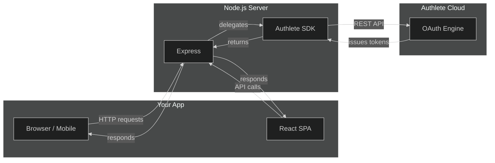

# Authlete Node.js Authorization Server

<p align="center">
  
</p>

<p align="center">
  <a href="https://github.com/blackadi/OAUTH2.0/blob/main/LICENSE"></a>
  <a href="https://github.com/blackadi/OAUTH2.0/actions/workflows/ci.yml"></a>
  <a href="https://github.com/blackadi/OAUTH2.0"></a>
  <a href="https://github.com/blackadi/OAUTH2.0"></a>
  <a href="https://github.com/blackadi/OAUTH2.0/issues"></a>
</p>

> **The easiest way to build a production-grade OAuth 2.0 / OpenID Connect server — without building the hard parts.**

This project implements a complete OAuth 2.0 and OpenID Connect authorization server using [Express](https://expressjs.com/) and the [Authlete TypeScript SDK](https://github.com/authlete/authlete-typescript-sdk). Here's the key insight: **all the complex OAuth logic is handled by Authlete's cloud API**. This server is the "last mile" — the HTTP layer, session management, and user-facing pages that sit in front of Authlete.

> ### Read this before you copy anything
>
> **The code is production-shaped. This *deployment* is deliberately not hardened, because it teaches.**
> Several settings here are the opposite of what you would ship:
>
> | Here | In production |
> |---|---|
> | ROPC and implicit grants **enabled** | both retired — OAuth 2.1, RFC 9700 §2.4 and §2.1.2 |
> | PKCE optional on **two teaching clients** | required for every client (RFC 9700 §2.1.1) |
> | Access tokens live **24 hours** | minutes |
> | Three token-exchange defects **left in on purpose** | fixed — see `AGENTS.md` → *Deliberate defects* |
>
> None of these is an oversight; each is a lab. They are listed in the feature tables below with an honest
> status, recorded in [`AGENTS.md`](AGENTS.md), and taught in the [curriculum](docs/curriculum/) — the whole
> point is that you find them yourself, and the modules show you how. **What you should copy is the request
> handling, not the service configuration.**
>
> The conformance evidence behind every status in this README lives in [`audit/`](audit/): 55 per-specification
> findings, each citing the RFC clause and the live response it was checked against.



## Why This Project Exists

OAuth 2.0 is powerful but complicated. The spec has dozens of extension points, each with their own security considerations. Authlete handles all of that complexity — token generation, client authentication, scope validation, PKCE verification — so you can focus on building your application.

**Think of it this way:** Authlete is the engine. This server is the car around it.

| What Authlete Handles | What This Server Handles |
|----------------------|-------------------------|
| Token generation & validation | HTTP routing & sessions |
| Client authentication | User login & consent pages |
| PKCE verification | CSRF protection |
| Scope & claim logic | Rate limiting & logging |
| DPoP & FAPI security | Prometheus metrics |
| All OAuth/OIDC spec compliance | React debugging dashboard |

## What's Inside

| Package | What It Is | Tech Stack |
|---------|-----------|------------|
| `server/` | Authorization server (Express) | TypeScript, Authlete SDK, EJS templates |
| `client/` | OAuth debugging dashboard | React, Vite, Tailwind CSS v4 |

## Getting Started

```bash
# 1. Install dependencies
npm --prefix server install && npm --prefix client install

# 2. Configure environment
cp server/.env.example server/.env
cp client/.env.example client/.env

# 3. Add your Authlete credentials to server/.env
#    Required: AUTHLETE_BEARER_TOKEN, AUTHLETE_BASE_URL, AUTHLETE_SERVICE_ID, SESSION_SECRET

# 4. Start the servers
npm --prefix server run dev    # Express on :3000
npm --prefix client run dev    # SPA on :3001 (proxies /api → :3000)
```

**That's it.** You now have a fully functional OAuth 2.0 / OpenID Connect authorization server.

## Features at a Glance

### Core OAuth 2.0 & OIDC

| Feature | Status | Documentation |
|---------|--------|---------------|
| Authorization Code | Working | [API Reference](docs/API.md) |
| PKCE (RFC 7636) | **Required on the application clients, deliberately optional on two teaching clients** — `pkceRequired` + `pkceS256Required` are `true` for the SPA and the `private_key_jwt` client, so a code flow without `code_challenge` is refused (`[A124301]`) and `plain` is refused (`[A124308]`). They stay `false` on the two clients Module 02 and Module 03 use, because those modules teach the plain flow *and then* what it costs — the lesson needs both states to exist. RFC 9700 §2.1.1 | [PKCE Tutorial](docs/PKCE-TUTORIAL.md) |
| Client Credentials | Working | [API Reference](docs/API.md) |
| Resource Owner Password (ROPC) | **Working, and deliberately so** — the grant is retired by OAuth 2.1 and RFC 9700 §2.4. It is enabled here *because* Modules 01 and 07 teach why it was removed, using a live transcript. Do not copy this into a real deployment | [API Reference](docs/API.md) |
| Refresh Tokens | Working | [API Reference](docs/API.md) |
| OIDC Discovery | Working | [API Reference](docs/API.md) |
| ID Tokens (signed JWT) | Working | [API Reference](docs/API.md) |
| UserInfo Endpoint | Working | [API Reference](docs/API.md) |

### OAuth Extensions

| Feature | Status | Documentation |
|---------|--------|---------------|
| PAR (RFC 9126) | Working | [PAR Tutorial](docs/PAR-TUTORIAL.md) |
| RAR (RFC 9396) | Working | [RAR Tutorial](docs/RAR-TUTORIAL.md) |
| Device Flow (RFC 8628) | Working | [Device Flow Tutorial](docs/DEVICE-FLOW-TUTORIAL.md) |
| CIBA | Working | [CIBA Tutorial](docs/CIBA-TUTORIAL.md) |
| JWT Bearer (RFC 7523) | Working | [JWT Bearer Tutorial](docs/JWT-BEARER-TUTORIAL.md) |
| Token Exchange (RFC 8693) | Working | [Token Exchange Tutorial](docs/TOKEN-EXCHANGE-TUTORIAL.md) |
| DCR (RFC 7591/7592) | Working | [API Reference](docs/API.md) |
| Step-Up Auth (RFC 9470) | Working | [Step-Up Auth Tutorial](docs/STEP-UP-AUTH-TUTORIAL.md) |

### Security & Logout

> **"Working" means the code path is exercised on this deployment** — not that the corresponding security
> control is switched on. Those are different claims, and this table used to conflate them. Three statuses
> are used below and they mean exactly what they say. **Verify any of them yourself** against the live
> service; the [curriculum](docs/curriculum/) teaches you how, and Module 09a gives you the vocabulary
> (*advertised*, *permitted but not configured*, *declined*).

| Feature | Status | Documentation |
|---------|--------|---------------|
| DPoP (RFC 9449) | **Working** — sender-constrained tokens issued and verified at both protected resources | [FAPI Tutorial](docs/FAPI-TUTORIAL.md) |
| FAPI 2.0 profile | **Not enabled** — `fapiModes` is unset on the service, so none of the profile's constraints are enforced. The code supports it; the deployment does not claim conformance | [FAPI Tutorial](docs/FAPI-TUTORIAL.md) |
| Backchannel Logout | **Partial** — *receiving* is fully validated (all 11 of §2.6's steps) and terminates the subject's sessions. `backchannel_logout_supported: true` is advertised, and client `1523514379` registers a `backchannel_logout_uri`, so *delivery* is **demonstrable but not interoperable**: the URI points back at this same deployment, because there is no third-party RP to register | [Backchannel Logout Tutorial](docs/BACKCHANNEL-LOGOUT-TUTORIAL.md) |
| Native SSO | **Enabled and verified 2026-09-03** ([DR-04](audit/05-decision-records.md#dr-04--native-sso), reversed) — both phases pass `scripts/native-sso-verify.mjs`, **15/15**, including public clients and the token-exchange allowlist, which is the client type Native SSO exists to serve. Caveat: the specification is an **OpenID 2nd Implementer's Draft**, not Final. Public-client safety depends on a refusal this server enforces and Authlete cannot express — see the tutorial before copying the configuration | [Native SSO Tutorial](docs/NATIVE-SSO-TUTORIAL.md) |
| Grant Management | **Working** — both halves verified end to end, including `grant_management_action=create` on the authorization request | [Grant Management](docs/GRANT-MANAGEMENT.md) |
| OpenID Federation | **Not enabled** — no federation JWK Set is configured, so the entity statement cannot be generated | — |
| Verifiable Credentials (OID4VCI) | **Working** — `verifiableCredentialsEnabled: true` and the credential issuer has a JWK Set, so `/vci/metadata`, `/vci/jwks` and `/vci/jwtissuer` all answer. **Issuance itself is not exercised**: it needs a wallet, and this repo does not contain one | [Module 09b](docs/curriculum/modules/09b-identity-and-credentials/README.md) |
| MCP / CIMD | **Partial** — `clientIdMetadataDocumentSupported: true`, so an HTTPS `client_id` works. **MCP end to end does not**: OAuth 2.1 requires the AS to reject `implicit` and `password`, and both are enabled here deliberately. *(The `registration_endpoint` this row used to call absent **is** advertised — `/api/client/dcr/register`, verified 2026-08-17 — but it requires admin Basic auth rather than RFC 7591 §3's initial access token, so an MCP client still cannot self-register.)* | [MCP Tutorial](docs/MCP-OAUTH-TUTORIAL.md) |

> ### These statuses are derived, and here is the command — because four of them were wrong at once
>
> **The four rows most likely to be wrong are the ones whose feature is code-complete and switched off at the
> service**, because nothing in the build, the tests or `check-docs.mjs` can see a service flag. Native SSO,
> FAPI 2.0, verifiable credentials and MCP/CIMD were **all four claimed as working while their flag was off** —
> one systemic defect, not four documentation slips. **Three of them have since been switched on** — VCI and
> CIMD on 2026-08-14, Native SSO on 2026-09-03 — which drifts the table in the *opposite* direction. It
> drifted again exactly as predicted, and `node scripts/check-discovery.mjs --live` is what caught it:
> the row said declined while `native_sso_supported` was present.
>
> **So check it rather than trusting it.** Every status above is one call away — read all 190-odd service
> properties, or the generated discovery document, and compare:
>
> ```bash
> # The flags behind the four rows above. Read-only.
> curl -s -H "Authorization: Bearer $AUTHLETE_BEARER_TOKEN" \
>   "$AUTHLETE_BASE_URL/api/$AUTHLETE_SERVICE_ID/service/get" \
>   | python3 -c "
> import sys, json
> d = json.load(sys.stdin)
> for k in ('nativeSsoSupported','fapiModes','verifiableCredentialsEnabled',
>           'credentialJwks','clientIdMetadataDocumentSupported'):
>     if k not in d:                 out = '<absent>'
>     elif k == 'credentialJwks':    out = '<set>'          # never print the key: it holds a private scalar
>     else:                          out = json.dumps(d[k]) # json.dumps, so booleans read false/true not False/True
>     print(f'{k:38} {out}')"
> ```
>
> **Values behind this table, captured 2026-08-14** against service `3693555522`: `nativeSsoSupported: false` ·
> `fapiModes: <absent>` · `verifiableCredentialsEnabled: true` · `credentialJwks: <set>` ·
> `clientIdMetadataDocumentSupported: true`. Two of the deployment's own endpoints report a subset of the same
> posture without any credential: `GET /api/fapi/config` and `GET /api/fapi/status`.
>
> **Why this is a note and not a CI check.** A service configuration change is not a reason to fail somebody's
> pull request — the same argument that puts external link checking on a weekly schedule rather than per push.
> A scheduled discovery-diff check is proposed in [`audit/04-remediation-plan.md`](audit/04-remediation-plan.md)
> §7.3 and is the only proposal in that plan that would have caught a defect *before* the audit did.

### Operations

| Feature | Status | Documentation |
|---------|--------|---------------|
| Prometheus Metrics | Working | [Monitoring](docs/MONITORING.md) |
| Structured Audit Logs | Working | [Development](docs/DEVELOPMENT.md) |
| Rate Limiting & Brute-Force Protection | Working | [Development](docs/DEVELOPMENT.md) |
| Health Checks | Working | [API Reference](docs/API.md) |
| Token Management (Admin) | Working | [API Reference](docs/API.md) |

## Key Commands

```bash
# Server
npm --prefix server run dev          # Dev server (auto-reload)
npm --prefix server run test         # 329 tests (unit + integration)
npm --prefix server run test:e2e     # 100 E2E tests (needs Authlete creds)
npm --prefix server run lint         # ESLint (0 errors)
npm --prefix server run typecheck    # TypeScript (0 errors)

# Client
npm --prefix client run dev          # Vite dev server on :3001
npm --prefix client run test         # Client tests
```

## Documentation

> **New to OAuth/OIDC? Start with the [Learning Path](docs/curriculum/README.md).** The tutorials below are
> organized by feature; the [curriculum](docs/curriculum/README.md) sequences them into a progressive, assessed
> course — from HTTP/JOSE foundations through FAPI 2.0 and a capstone — using this server as the lab.

| Document | What You'll Learn |
|----------|-------------------|
| [Architecture](docs/ARCHITECTURE.md) | How the system is designed, middleware pipeline, deployment |
| [Data Flows](docs/DATA-FLOWS.md) | OAuth flow sequences with diagrams |
| [API Reference](docs/API.md) | Every endpoint with request/response formats |
| [Development](docs/DEVELOPMENT.md) | Setup, env vars, middleware, known quirks |
| [Testing](docs/TESTING.md) | Test architecture, mock strategy, patterns |
| [CURL Tests](CURL-TEST.md) | Interactive curl test suite for every endpoint |

### Tutorials

Each tutorial explains **why** a feature exists, **how** it works, and **how to test it** with this server.

| Tutorial | What It Covers |
|----------|---------------|
| [PKCE](docs/PKCE-TUTORIAL.md) | Code interception attacks and how PKCE prevents them |
| [PAR](docs/PAR-TUTORIAL.md) | Why pushing authorization requests is more secure |
| [RAR](docs/RAR-TUTORIAL.md) | Rich authorization requests for fine-grained access |
| [Device Flow](docs/DEVICE-FLOW-TUTORIAL.md) | Authorizing on devices with no browser |
| [CIBA](docs/CIBA-TUTORIAL.md) | Backchannel authentication without redirects |
| [JWT Bearer](docs/JWT-BEARER-TUTORIAL.md) | Using JWT assertions for client authentication |
| [Token Exchange](docs/TOKEN-EXCHANGE-TUTORIAL.md) | Delegating token issuance between services |
| [Native SSO](docs/NATIVE-SSO-TUTORIAL.md) | Single sign-on across native mobile apps |
| [Backchannel Logout](docs/BACKCHANNEL-LOGOUT-TUTORIAL.md) | Coordinating logout across services |
| [Grant Management](docs/GRANT-MANAGEMENT.md) | Querying and revoking granted authorizations |
| [FAPI 2.0](docs/FAPI-TUTORIAL.md) | Financial-grade security with DPoP |
| [Step-Up Auth](docs/STEP-UP-AUTH-TUTORIAL.md) | RFC 9470 — re-authorize with stronger authentication |

## Community

| Document | Purpose |
|----------|---------|
| [Contributing Guide](CONTRIBUTING.md) | How to set up, develop, and submit changes |
| [Code of Conduct](CODE_OF_CONDUCT.md) | Community behavior standards (Contributor Covenant v2.1) |
| [Security Policy](SECURITY.md) | How to report vulnerabilities |
| [License](LICENSE) | MIT License |

## Contributing

Contributions are welcome! Please read the [Contributing Guide](CONTRIBUTING.md) first. Quick start:

```bash
git clone https://github.com/blackadi/OAUTH2.0.git
cd OAUTH2.0
npm --prefix server install && npm --prefix client install
cp server/.env.example server/.env
# Edit server/.env with your Authlete credentials
npm --prefix server run dev
```

## License

[MIT](LICENSE) — provided for educational purposes and production use.
