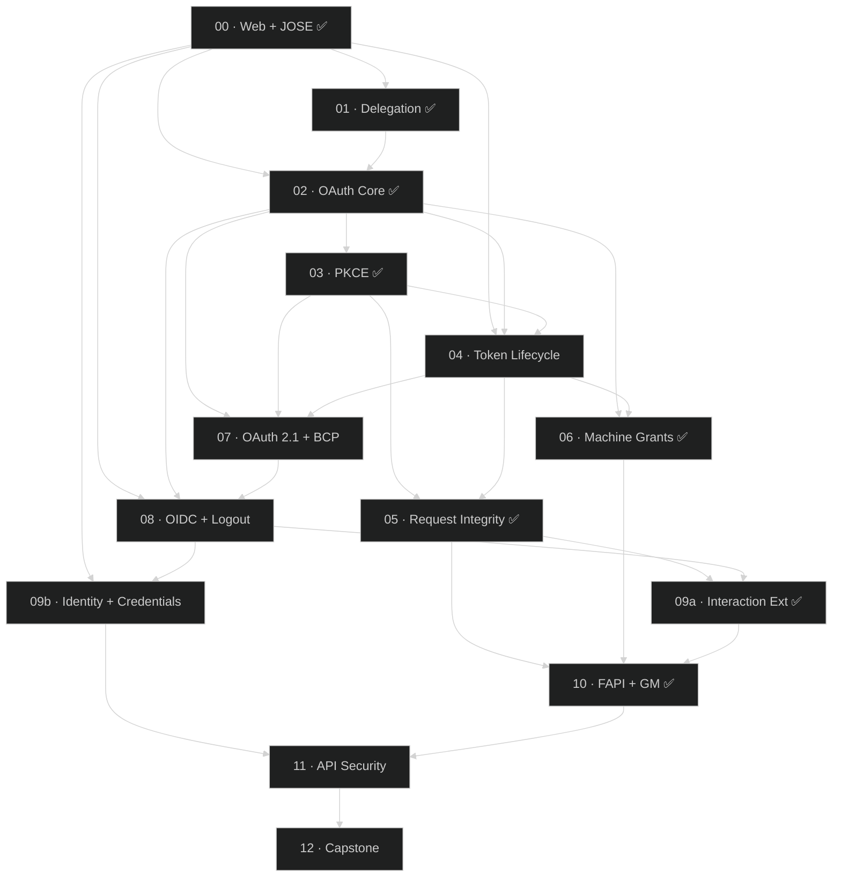

# 03 — Curriculum audit

**Phase 3.** Per-module claim tables, verified against the Phase 2 findings and against primary sources.
Verdicts and severities use the same scale as Phase 2 (`audit/02-findings/`).

- **Audit date:** 2026-08-10
- **Scope:** 14 modules × 4 files (21,226 lines) + 9 exam files (1,535) + 6 top-level curriculum files (4,132) = **25,721 lines**
- **Method:** every factual claim checked against a Phase 2 finding, a primary source fetched in this session, or the code at `path:line`. Wire-level examples checked against the response shapes the deployment actually produces.

## Batch status — this file is being written in four passes

The skill is explicit that depth must not be traded for coverage. At 25,721 lines the curriculum does not fit a
single pass alongside the Phase 2 context, so it is audited in batches with a gate between each.

**The batches were re-cut after 3a**, and this table supersedes the original module-order split. Batch 3a found
**0×S1 and 0×S2** across four modules, so auditing the remaining 21,864 lines at the same depth would have cost
roughly 300k tokens for predominantly S3/S4 yield. The remaining value is concentrated, and the re-cut follows
it. The rationale is recorded in `RESUME.md` §4.

| Batch | Target | Lines | Why this cut | Status |
|---|---|---|---|---|
| **3a** | Modules 00 · 01 · 02 · 03 | ~4,000 | Foundations; read first because everything cites them | ✅ complete |
| **3b** | Modules **05 · 06 · 09a · 10** | ~7,100 | The only four modules sitting directly on S1/S2 code findings — where a lab can teach a broken behaviour as correct | ✅ **this pass** |
| **3c** | The nine tutorials under `docs/` | ~3,500 | Phase 2 already found fabricated transcripts, a wrong challenge status and stale test claims here. Highest defect density in the repo's prose. Also closes the eight items Phase 2 deferred | pending |
| **3d** | Modules 04 · 07 · 08 · 11 · 12 · exams · top-level curriculum files | ~15,000 | **Light sweep only** — citation and claim spot-checks. 3a's evidence predicts S3/S4 | pending |

The dependency-order graph completes after 3c. Each batch records its contribution at the end of its section.

---

# Batch 3a — Modules 00–03

## Headline

**These four modules are substantially more accurate than the code and documentation they teach against.** Every
spec citation I could check is correct, including two that required arithmetic; the labs distinguish verified
transcripts from unverified ones; and in the one place where two modules appear to contradict each other, the
contradiction is deliberate, explained, and cross-linked in both directions.

The findings below are therefore mostly **forward dependencies** — places where a Phase 2 remediation would
invalidate a lab that is correct today — plus one error I introduced in my own Phase 2 entry, which this pass
caught.

## Module 00 — Web + JOSE Foundations

| # | Claim | Location | Verified against | Verdict |
|---|---|---|---|---|
| 1 | TLS 1.3 = RFC 8446 (Aug 2018) | `README.md:87` | Not re-fetched — carried from `SPEC-INVENTORY.md`, which flags this row for spot re-verification (`01-spec-matrix.md` §7) | **`NEEDS_INVESTIGATION`** / S4 — F-4 |
| 2 | HTTP Semantics = RFC 9110 (Jun 2022) | `README.md:88` | Not re-fetched | **`NEEDS_INVESTIGATION`** / S4 — F-4 |
| 3 | JWS = RFC 7515 | `README.md:89` | ✅ *"JSON Web Signature (JWS)"*, Standards Track, May 2015 — fetched | **Accurate** |
| 4 | JWK = RFC 7517, JWA = RFC 7518 | `README.md:90` | ✅ 7517 confirmed; 7518 not fetched but the `alg`-registry division is right | **Accurate** |
| 5 | JWE = RFC 7516; five segments | `README.md:91,112` | Not fetched; the 5-segment structure is correct and `decode-jwt.mjs:80,87` implements it | **Accurate** |
| 6 | `alg: "none"` is defined by **RFC 7518 §3.6** | `README.md:93`, `lab.md:160` | ✅ **correct attribution** — and *more precise than my own* `JOSE-rfc7515-7517-7519.md` F-1, which framed `none` as an RFC 7515 registry matter. §3.6 of RFC 7518 is where `none` is defined | **Accurate — corrects the audit** |
| 7 | JWT registered claims `iss/sub/aud/exp/iat/nbf` = RFC 7519 | `README.md:94` | ✅ fetched; seven claims incl. `jti` | **Accurate** |
| 8 | JWK Thumbprint = RFC 7638, used for DPoP `jkt` | `README.md:95` | ✅ consistent with `RFC9449-dpop.md` requirement 7 | **Accurate** |
| 9 | `typ` may be `JWT`, `at+jwt` (RFC 9068), `dpop+jwt` (RFC 9449) | `README.md:114` | ✅ both profiles fetched in Phase 2 | **Accurate** |
| 10 | base64url = RFC 4648 §5 | `README.md:92` | Not fetched; §5 is the URL-safe alphabet | **Accurate** |
| 11 | `dpop.service.ts` builds a JWS by hand; ES256 must be raw P1363 R‖S; the proof carries `ath` not `sub` | `README.md:130-134` | ✅ verified in B4 (`RFC9449-dpop.md` requirements 1–3) | **Accurate** |
| 12 | JWKS at `GET /api/.well-known/jwks.json`; discovery at `GET /api/.well-known/openid-configuration` | `README.md:136-139` | ✅ matches `JOSE-rfc7515-7517-7519.md` F-3 and probe 3 | **Accurate** |
| 13 | The `/api` prefix is **a non-conformance**, quoting RFC 8414 §3 and OIDC Discovery §4.3, and *"on this deployment they do not match"* | `lab.md:57-74`, `:185-187` | ✅ **confirmed** — `issuer = https://blackadi.dev` versus the fetch host (probe 2 §5). See F-1 | **Accurate — exemplary** |
| 14 | The JWKS holds **a single EC P-256 key** with `alg: ES256`, `use: sig`, `kid`, `x`, `y` | `lab.md:82-92` | ✅ consistent with `id_token_signing_alg_values_supported` containing ES256 and **no** RS256 (probe 3). **But see F-2** | **Accurate today** |
| 15 | `decode-jwt.mjs` flags the sample expired and prints a decode-≠-verify warning | `lab.md:109,175` | ✅ `decode-jwt.mjs:49,115-116` | **Accurate** |
| 16 | Break 2's `alg:none` token decodes with an empty signature | `lab.md:149-157` | ✅ trailing-dot construction is correct | **Accurate** |
| 17 | The sample token in Exercise 3 is `typ: at+jwt` | `lab.md:99-104` | ✅ and labelled a **sample**, which matters because this deployment issues opaque tokens (`RFC9068-…` F-1) | **Accurate** |

### F-1 — Module 00 states the discovery non-conformance better than the audit's own B3 entry did (positive, S4)

`lab.md:57-74` quotes RFC 8414 §3's MUST and OIDC Discovery §4.3's *"MUST be identical"* verbatim, tells the
learner to compare the printed `issuer` against the URL they fetched it from, states plainly that *"a conforming
client starting from the advertised issuer cannot find this server at all"*, and then says: **use `/api` anyway,
because every lab depends on it.** It names the habit explicitly — *"Holding 'this is what I must do to make the
lab run' and 'this is a finding I would write up' at the same time."*

That is the correct handling of a known non-conformance in teaching material, and it is the standard the rest of
the repo should be held to. Recorded as a positive because Phase 2 found the opposite pattern four times
(`FAPI-TUTORIAL.md`'s unreproducible PAR transcript, `README.md`'s four "Working" claims).

### F-2 — fixing the RS256 gap will invalidate Module 00 Exercise 2 (forward dependency, S3) — ✅ **BOTH SHIPPED 2026-08-12 (T1-2)**

> **Fixed banner.** The RSA key landed and **CUR-3a-W3 landed with it**, in the same commit, exactly as this
> finding recommended. Exercise 2 now selects by `kty === "EC"` and prints the `kty` values rather than a
> count. The prediction was right in substance and **short by two**: the same key also inverted Module 08
> §6d — a live transcript whose whole point was that RS256 was *absent* — and falsified
> `modules/11…/README.md`'s *"one EC P-256 key"*. Neither was in the register; both were caught by
> `04-remediation-plan.md` §7.4's mandatory grep, which is the argument for that checklist step existing.

`lab.md:82` tells the learner to expect **`key count: 1`** and a single EC key. `OIDC-CORE-1.0.md` F-2 and
`FAPI-1.0-PART-2-ADVANCED.md` F-2 both recommend registering an **RSA key** (work items **OIDC-W2** /
**FAPI1A-W2**) to satisfy OIDC Discovery §3's *"The algorithm RS256 MUST be included"* and FAPI's PS256
requirement.

The moment that key is registered, Exercise 2's expected output is wrong: `key count` becomes 2 and `j.keys[0]`
may be the RSA key, so the field table (`crv`, `x`, `y`) will not match what the learner sees.

**This is the first instance of a pattern Phase 4 must handle**: a lab whose correctness depends on a
configuration the audit recommends changing. It is not a defect in the lab — the lab is accurate about the
deployment as it stands. It is a **coupling** that the remediation plan has to carry, and the cheap mitigation is
for Exercise 2 to select the EC key by `kty` rather than by index.

### F-3 — `decode-jwt.mjs` is correct, with one robustness note (S4)

Audited line by line, closing one of the two script audits deferred from Phase 2 (`RFC9901-…` F-1 defers the
other):

| Check | Result |
|---|---|
| base64url → base64 conversion and padding (`:25-29`) | ✅ `padEnd(ceil(len/4)*4, '=')` is correct for all valid lengths |
| Segment-count discipline (`:80-85`) | ✅ 3 = JWS, 5 = JWE, anything else refused — **and it tells the reader to introspect an opaque token instead**, which is exactly right for this deployment |
| `exp` / `nbf` annotation (`:39-55`) | ✅ flags `← EXPIRED` and `← NOT YET VALID` |
| `--ath` = base64url(SHA-256(token)) (`:110-112`) | ✅ matches RFC 9449 §4.3. The RFC specifies the **ASCII** encoding of the token; `update(token)` defaults to utf8, which is byte-identical for an ASCII token — correct in practice, worth a one-word comment |
| Never verifies, and says so loudly (`:8-12,115-116`) | ✅ the module's thesis, enforced in the tool |
| **stdin fallback** (`:57-69`) | ⚠️ a 50 ms `setTimeout` races the `end` event; a slow pipe resolves with partial input. Argv usage (what every lab uses) is unaffected |

### F-4 — two foundational dates are carried, not verified (S4)

`README.md:87-88` dates RFC 8446 to Aug 2018 and RFC 9110 to Jun 2022. Neither was fetched in this session, and
`01-spec-matrix.md` §7 lists **RFC 9846 / RFC 8446** as the first of ten rows selected for spot re-verification
precisely because `SPEC-INVENTORY.md` records its own headline correction there. So this is a known-open item
that Phase 3 should close rather than inherit.

Marked `NEEDS_INVESTIGATION` rather than assumed correct, per the audit's rule against citing from recall. Two
fetches close it.

## Module 01 — The Delegation Problem

| # | Claim | Location | Verified against | Verdict |
|---|---|---|---|---|
| 1 | RFC 6749 §1.1 defines **four** roles, quoted verbatim | `README.md:96-99` | ✅ the four definitions match RFC 6749 §1.1 as quoted in `RFC6749-authorization-framework.md` | **Accurate** |
| 2 | User agent is **not** one of the four §1.1 roles | `README.md:100,116` | ✅ a precision most tutorials get wrong | **Accurate** |
| 3 | Endpoint table: authorization §3.1, token §3.2, redirection §3.1.2, protected resource RFC 6750 §2.1 | `README.md:136-139` | ✅ | **Accurate** |
| 4 | ROPC is RFC 6749 §4.3 and **RFC 9700 §2.4 says it MUST NOT be used** | `README.md:66,106,206` | ✅ quoted correctly; matches `RFC9700-security-bcp.md` | **Accurate** |
| 5 | The ROPC lab has **two possible outcomes**, both instructive, and the reason is a service-level flag | `lab.md:161-180` | ✅ **see F-5 — this is the most sophisticated thing in the curriculum** | **Accurate — exemplary** |
| 6 | `[A295306] The grant type ('password') is not allowed` is **Authlete vendor behavior**, not spec wording | `lab.md:164,264` | ✅ correctly attributed | **Accurate** |
| 7 | `[A088302] The access token does not exist` on an unbound token | `lab.md:217` | ✅ same code seen in `modules/05…/README.md:432-441` for the UserInfo prefix bug | **Accurate** |
| 8 | `login.ejs:18` → `action="/api/session/login"`; the form posts to the AS's own origin | `README.md:160`, `lab.md:91`, `quiz-answers.md:69` | ✅ path exists; the security point (the credential is typed only at the AS) is correct | **Accurate** |
| 9 | `session.controller.ts:72` — the authorization context is set by the authorization endpoint | `lab.md:124` | ⚠️ in-bounds and approximately right: `:70-73` is the missing-context guard, and the session is populated at `authorization.controller.ts:72-93`. The pointer is to the *reader* of the context, not its writer | **Imprecise** / S4 |
| 10 | `userinfo.routes.ts` is "the closest thing to a resource server here" | `README.md:169` | ✅ matches `RFC9728-…` and `RFC9449-dpop.md`, both of which treat UserInfo as the only protected resource | **Accurate** |

### F-5 — the ROPC double-outcome is handled better than any other variance in the repo (positive, S4)

I went looking for a contradiction and found deliberate engineering. Module 01's lab shows **both** outcomes for
`grant_type=password` — a `[A295306]` refusal and a successful token — and explains:

> **This is not a lab that has two answers because it is vague.** It has two answers because the outcome depends
> on a service-level setting that has nothing to do with the ROPC grant. When this module was first written the
> request was refused; today, on the same deployment with no code change and no client change, it returns a
> token — because a profile flag was cleared for unrelated reasons.

It then cross-links Module 07 §3c, whose verification block closes the loop: *"you can explain why Module 01
recorded the opposite result."*

**The flag is `fapiModes`**, and the audit can now say so with evidence: FAPI mode forbids ROPC, `fapiModes` is
absent on this service (probe 1 §3.4), and `PROGRESS.md:2010-2011` records the live success transcript. Neither
module names the flag — that is the one improvement available, and it is an addition rather than a correction.

**Forward dependency:** `FAPI-2.0-SECURITY-PROFILE.md` FAPI2-W5 contemplates enabling FAPI 2.0. Doing so would
flip Module 01's outcome back to the refusal **and** invalidate Module 07 §3b's headline FAIL. Second instance of
the F-2 coupling pattern, and a sharper one — here the affected material is the *point* of two exercises.

## Module 02 — OAuth Core + Threats

| # | Claim | Location | Verified against | Verdict |
|---|---|---|---|---|
| 1 | RFC 6749 sections cited across the lesson: §3.1, §3.1.1, §3.3, §3.4, §3.5, §4.1, §4.1.1, §4.1.2.1, §4.2, §4.3, §5.2, §6, §10.12 | `README.md:103,111-115,151,155,206-209,382-385,439` | ✅ every section number matches the RFC's structure as used in `RFC6749-authorization-framework.md`; §10.12 is CSRF, §4.1.2.1 the error response, §5.2 token-endpoint errors | **Accurate** |
| 2 | RFC 6750 §2.1 for `Authorization: Bearer` | `README.md:385` | ✅ | **Accurate** |
| 3 | Four vendor codes in the lab, all bracketed and attributed | `lab.md:203,226,259,329` — `[A050305]`, `[A050309]`, `[A011304]`, `[A242307]` | ✅ attribution convention is consistent with Modules 01, 05, 08, 09a | **Accurate** |
| 4 | "Access tokens are opaque here; other deployments issue JWTs (RFC 9068, Module 04)" | `lab.md:364` | ✅ matches `RFC9068-jwt-access-tokens.md` F-1 and probe 3 (`accessTokenType = Bearer`) | **Accurate** |
| 5 | No `path:line` code references anywhere in the module | grep: zero | ⚠️ unusual for this curriculum — Modules 00, 01 and 03 all anchor to code. Not a defect | **Note** / S4 |

**No findings.** Module 02's citations are dense and correct, and its vendor-versus-spec attribution is
consistent. The absence of code anchors is a stylistic gap rather than an accuracy one; the module is about the
protocol, not this implementation.

## Module 03 — PKCE + Public Clients

| # | Claim | Location | Verified against | Verdict |
|---|---|---|---|---|
| 1 | `code_verifier` is *"43…128"* unreserved characters, with the ABNF quoted | `README.md:105,116-121` | ✅ RFC 7636 §4.1, verbatim | **Accurate** |
| 2 | `code_challenge = BASE64URL-ENCODE(SHA256(ASCII(code_verifier)))` (§4.2) | `README.md:106,122` | ✅ | **Accurate** |
| 3 | `code_challenge_method` *"defaults to 'plain' if not present"* (§4.3) — "always send it explicitly" | `README.md:107,123-124` | ✅ | **Accurate** |
| 4 | AS binds the challenge to the code (§4.4); verifier presented at the token endpoint (§4.5); mismatch **MUST** be `invalid_grant` (§4.6) | `README.md:108-111,125-126` | ✅ all four section numbers correct | **Accurate** |
| 5 | PKCE downgrade mitigation is **RFC 9700 §4.8** | `README.md:112` | ✅ consistent with `RFC9700-security-bcp.md` | **Accurate** |
| 6 | `AGENTS.md` recommends `refreshTokenKept = true` citing **FAPI 2.0 §5.3.2.1**, and *"on the service backing this repo `refreshTokenKept` is currently `false`, so rotation is on; you will observe it in the lab"* | `README.md:208-213` | ✅ **both halves confirmed** — §5.3.2.1 is the AS-requirements section containing *"shall not use refresh token rotation"* (fetched), and `refreshTokenKept = False` live (probe 1 §2) | **Accurate — exemplary** |
| 7 | The rotation-versus-FAPI-2.0 tension, with both positions defended | `README.md:208-213` | ✅ the same tension `SERVICE-CONFIG-PROBE.md` §3.2 and `FAPI-2.0-SECURITY-PROFILE.md` preserve | **Accurate** |
| 8 | The XSS limit: PKCE closes a protocol gap and does nothing about a compromised client | `README.md:216-240` | ✅ correct, and the strongest statement of that limit in the repo | **Accurate** |
| 9 | The verifier lives in `sessionStorage` at **`FapiSection.tsx:134`** | `README.md:229,287` | ✅ **exact** — `sessionStorage.setItem('pkce_code_verifier', pkce.codeVerifier)` | **Accurate** |
| 10 | …and at **`ParSection.tsx:38`** | `README.md:287` | ❌ `:38` is `}, []);` — the write is at **`:43`**, the read at `:36` | `DOC_INCORRECT` / S4 — F-6 |
| 11 | The PKCE generator is at **`client/src/pkce.ts`**, *not* `client/src/services/` as `AGENTS.md` and the inventory "previously listed" | `README.md:285-286` | ✅ **correct, and the module was right to flag the drift** — see F-7 | **Accurate — corrects the audit** |
| 12 | Modulo bias: a 66-character alphabet with `% chars.length` over 256 makes **58 characters marginally more likely than the other 8**, costing ~0.005 bits/char — so a 64-char verifier carries ~386 bits instead of ~387; *"not exploitable, not worth a CVE"* | `README.md:280-284` | ✅ **arithmetically correct**: 256 mod 66 = 58; log₂(66) = 6.0443, × 64 = 386.8. The severity calibration is right | **Accurate — exemplary** |
| 13 | Six vendor codes in the lab | `lab.md:36,37,42,151,169,248` | ✅ bracketed and attributed | **Accurate** |
| 14 | "Authlete performs the §4.6 verification. This server never sees a `code_verifier` except to forward it." | `README.md:290` | ✅ matches `RFC7636-pkce.md`'s boundary table exactly | **Accurate** |

### F-6 — one line reference is five lines off (S4)

`ParSection.tsx:38` should be `:43`. `scripts/check-docs.mjs` cannot catch it: `:38` is inside the file, so the
bounds check passes while the pointer lands on a `useEffect` closing brace. Third instance in the audit of the
same class — with `AGENTS.md`'s token-exchange handler references (`RFC8693-…`) and `AGENTS.md`'s
`introspection.controller.ts:47` (`RFC9470-…`).

### F-7 — Module 03 caught a path error the audit then repeated (S3, against the audit)

`README.md:285-286` notes that `AGENTS.md` and the spec inventory *previously* placed the PKCE generator under
`client/src/services/`, and that it is actually at `client/src/pkce.ts`. Verified: the file is at
`client/src/pkce.ts`, and `SPEC-INVENTORY.md:92` now has it right.

**And my own Phase 2 entry got it wrong in a third direction.** `RFC7636-pkce.md` cited
`client/src/utils/pkce.ts` at two places and attributed the path to `SPEC-INVENTORY.md:92`, which does not say
that. **Corrected in this pass**; the entry now reads `client/src/pkce.ts` with the path confirmed.

Two lessons worth carrying to Phase 4:

1. **`check-docs.mjs` validates `file.ts:NNN` references but not bare paths.** A wrong path with no line number passes silently. That is a real gap in the drift check and it just caught the audit itself — work item below.
2. This file has now been mislocated **three times** by three different documents. It is a candidate for the kind of anchor-by-symbol rather than anchor-by-path treatment proposed in `RFC8693-…` W3.

## Batch 3a — findings summary

| ID | Finding | Sev | Type |
|---|---|---|---|
| 3a-F1 | Module 00 states the discovery non-conformance better than B3 did | S4 | **positive** |
| 3a-F2 | Registering an RSA key (OIDC-W2) invalidates Module 00 Exercise 2's expected output | S3 | forward dependency |
| 3a-F3 | `decode-jwt.mjs` is correct; one stdin-race robustness note | S4 | code |
| 3a-F4 | RFC 8446 and RFC 9110 dates carried, not verified | S4 | `NEEDS_INVESTIGATION` |
| 3a-F5 | The ROPC double-outcome is exemplary; the flag behind it (`fapiModes`) is never named | S4 | **positive** + addition |
| 3a-F6 | `ParSection.tsx:38` should be `:43` | S4 | `DOC_INCORRECT` |
| 3a-F7 | `client/src/pkce.ts` mislocated three times, including by this audit — now corrected | S3 | `DOC_INCORRECT` |

**Nothing in Modules 00–03 rises above S3**, and two entries correct the audit rather than the reverse
(3a-F1's framing, 3a-F7's path, and Module 00's `alg:none` attribution to RFC 7518 §3.6 rather than RFC 7515).

## Dependency-order contribution from batch 3a

| Module | Declares prerequisite | Forward references | Order sound? |
|---|---|---|---|
| 00 | *"None"* (`README.md:11`) | Modules 01, 02, 03, 05 named in the spec-delta table (`:252`) | ✅ true foundation |
| 01 | Module 00 | Module 07 §3c (the ROPC contradiction) | ✅ — and the forward link is **load-bearing**, not decorative |
| 02 | Module 00, 01 | Module 03 (PKCE), Module 04 (JWT ATs), Module 05 (mix-up) | ✅ |
| 03 | Module 02 | Module 05 (DPoP), Module 07 (algorithm confusion) | ✅ |

**No forward dependency on a concept introduced later, and no dependency on a server capability that does not
exist.** Module 00's only server requirement is that the process starts and serves discovery and JWKS — both
real. The one caveat: Module 03 §4's rotation observation depends on `refreshTokenKept = false`, a live
configuration value, which the module states explicitly rather than assuming.

## Work items from batch 3a

| ID | Item | Effort | Acceptance criteria |
|---|---|---|---|
| CUR-3a-W1 | **Teach `check-docs.mjs` to validate bare paths** | S | ✅ **DONE 2026-08-14** (with **CUR-3b-W5** and the `*.md:NNN` half of **T2-7**; **CUR-3c-W11** deferred — see below). **184 bare paths and 216 markdown line refs are now validated**, and the first run found **5 real hits** — three documents still citing `client/src/utils/pkce.ts` and two citing a *third* spelling, `client/src/services/pkce.ts`, after §2.5 had recorded the correction. **The criterion could not express its own success condition**, which is the finding worth keeping: *"A reference to `client/src/utils/pkce.ts` fails the check"* is satisfied by the checker — and the sentence stating it is one of the references that then fails. All five hits turned out to be paths **discussed rather than referenced** (a "Was" column, a defect description, this very criterion), so a checker validating every path mentioned cannot tell "here is a path" from "here is a path that was wrong". Handled with a three-entry `PATHS_DISCUSSED_NOT_REFERENCED` allowlist, each with its reason attached. **Two regex traps recorded in the script**: `tsx` must precede `ts` in the alternation *and* be anchored with `\b`, because `CallbackPage.tsx:72` otherwise backtracks to `.ts` and the checker hunts for a file that never existed; and the audit abbreviates paths **two** ways — an explicit ellipsis (`modules/09a…/lab.md`) and a silent prefix (`modules/05/README.md`) — both of which resolve by unique-prefix matching per segment. Verified by self-test: four deliberately broken refs in all four forms are caught, then the tree returns to clean. |
| CUR-3a-W2 | Fix `ParSection.tsx:38` → `:43` | S | 3a-F6. |
| CUR-3a-W3 | Make Module 00 Exercise 2 key-selection robust | S | ✅ **DONE 2026-08-12 (T1-2), same commit as OIDC-W2.** Selects by `kty === 'EC'`, prints the `kty` values instead of a count, and gained two sentences on *why* you never index into a JWKS — which is the lesson the count was accidentally teaching against. 3a-F2. |
| CUR-3a-W4 | Verify the RFC 8446 and RFC 9110 dates | S | Two fetches; closes 3a-F4 and one of the ten `01-spec-matrix.md` §7 spot-check rows. |
| CUR-3a-W5 | Name `fapiModes` in Modules 01 and 07 | S | Both modules explain the ROPC variance; neither names the flag. One clause each, plus a note that re-enabling FAPI reverses both transcripts. 3a-F5. |
| CUR-3a-W6 | Comment the `--ath` ASCII/utf8 equivalence in `decode-jwt.mjs` | S | One word, so a reader does not wonder whether RFC 9449 §4.3's ASCII requirement is met. 3a-F3. |
| CUR-3a-W7 | Record the lab-versus-remediation coupling for Phase 4 | S | 3a-F2 and 3a-F5 are the first two instances of "a Phase 2 fix invalidates a correct lab". Phase 4 needs a register of these, not ad-hoc handling. |

---

# Batch 3b — Modules 05, 06, 09a, 10

**Scope:** the four modules that sit directly on S1/S2 code findings — 7,124 lines across 16 files.

**Method:** every factual claim checked against a Phase 2 finding, a source fetched in an earlier session of
this audit, or the code at `path:line`. Where a module quotes a transcript, it is checked against the response
shape the deployment actually produces. Where a module cites a line number, the file was opened and the line
read.

## Headline

**3a's result holds, and for a sharper reason than 3a could show.** These four modules teach against eight S1
and twenty S2 code findings, and **not one of them teaches a broken behaviour as correct.** Every S1/S2 that
touches this material is either named by the module itself, marked `UNVERIFIED` with the responsible field
identified, or — in Module 06's case — deliberately reproduced as the exercise. Module 10 independently
identifies the repo's own S1 open redirect and its S1 FAPI-reporting failure and files both as findings, in a
module written before the audit existed.

Three defect classes came out of the pass, and only the third is new:

1. **Stale `path:line` references** — four sets, all in-bounds and therefore invisible to
   `scripts/check-docs.mjs`. Third, fourth, fifth and sixth instances of the class 3a-F6 opened.
2. **One RFC section number wrong, repeated three times**, while the same module cites it correctly three
   other times (3b-F2).
3. **Five claims made stale by remediation that landed after Phase 2 was written** (3b-F9). The two S1
   findings this audit rated *exploitable now* have been fixed in the working tree; Module 08 was rewritten to
   match and **Module 10 was not**, so it still teaches a live open redirect that no longer exists. This is
   the first time the audit has found the curriculum wrong in the *safe* direction, and it is a drift class
   Phase 4 must carry as a checklist item rather than a one-off.

The batch also **corrects the audit twice more** (3b-F5, 3b-F11) and **closes two of the eight items Phase 2
deferred** (RESUME §4 items 6 and 7).

---

## Module 05 — Request Integrity + Binding

| # | Claim | Location | Verified against | Verdict |
|---|---|---|---|---|
| 1 | PAR is RFC 9126, Standards Track, September 2021 | `README.md:112` | ✅ RESUME §2.3 | **Accurate** |
| 2 | *"MUST generate a request URI and provide it in the response with a '201' HTTP status code"* (§2.2); lifetimes *"typically… between 5 and 600 seconds"* | `README.md:114-121`, `lab.md:103` | ✅ matches `RFC9126-…`; the live 600 is the top of the range and the lab says so | **Accurate** |
| 3 | `request_uri` is single-use per §4; replay yields `[A008303]` | `lab.md:136-151` | ✅ verified transcript; `RFC9126-…` concurs | **Accurate** |
| 4 | JAR is RFC 9101, Standards Track, August 2021 | `README.md:133` | ✅ RESUME §2.3 | **Accurate** |
| 5 | The request object *"MUST be either signed using JWS … or signed and then encrypted"* — attributed to **§10.1** | `README.md:104,136`, `lab.md:219` | ⚠️ `RFC9101-…` maps this requirement to **§6.2** and never cites §10.1. Not re-fetched | **`NEEDS_INVESTIGATION`** / S4 — 3b-F1 |
| 6 | The precedence rule — *"MUST only use the parameters included in the Request Object"* — attributed to **§5** | `README.md:141`, `:468`, `quiz-answers.md:72` | ❌ it is **§6.3** (`RFC9101-…` requirement 2), and this module's own lab says §6.3 three times | `DOC_INCORRECT` / S3 — 3b-F2 |
| 7 | The canonical JAR *shape* — `client_id` + `request` on the URL — is **§5** | `README.md:269`, `lab.md:360`, `:850` | ✅ **correct** — §5 is where the request parameters are defined. The §5/§6.3 split above is a precedence-vs-shape confusion, not a blanket error | **Accurate** |
| 8 | A signed object SHOULD carry `iss` and `aud` (§4); `aud` should be the AS's issuer | `README.md:136-138` | ✅ `RFC9101-…` requirement 7; `requestObjectAudienceChecked = True` live | **Accurate** |
| 9 | §10.8 recommends explicit typing with `"typ": "oauth-authz-req+jwt"` | `README.md:146` | Not re-fetched; the media type is correct and the lab's helper uses it | **Accurate** |
| 10 | `[A006339] … skew=0`, and *"a request object must carry `nbf` and live no longer than **60 seconds**"* | `lab.md:342-347`; helper at `:183` sets `exp: now+50` | ❌ FAPI 1.0 Part 1 **§5.2.2 says 60 minutes**, both directions (`FAPI-1.0-PART-1-BASELINE.md` F-3). The `nbf`-required half is right | `DOC_INCORRECT` / = **FAPI1-W1** — 3b-F3 |
| 11 | `iss` is RFC 9207, Standards Track, March 2022; §2 requires it *"including error responses"*; §2.4 is the client's MUST; §3 advertises it | `README.md:153-164`, `lab.md:405-431` | ✅ every section number matches `RFC9207-…`; `authorization_response_iss_parameter_supported = true` live | **Accurate** |
| 12 | DPoP is RFC 9449, Standards Track, September 2023; §4.2 header `typ`/`alg`/`jwk`; payload `jti`/`htm`/`htu`/`iat`; §6.1 `cnf.jkt`; §7 `ath`; §7.1 the `DPoP` scheme | `README.md:173-198` | ✅ all six section numbers match `RFC9449-dpop.md` requirements 1–7 | **Accurate** |
| 13 | The RFC 7638 thumbprint is canonical JSON, lexicographic, no whitespace — `crv, kty, x, y` | `lab.md:485,500-502` | ✅ correct for an EC key, and the lab has the learner compute it and match `cnf.jkt` | **Accurate — exemplary** |
| 14 | `dpop.service.ts`: *"Line ~89 sets the `jwk` header member; ~81–83 computes `ath`; ~95–101 handles the raw P1363 signature"* | `README.md:253-255` | ❌ the file is **87 lines**. `jwk` header `:70`; `ath` assigned `:60` and computed by `computeAth()` at `:26`; raw signature `:76-84`. Two of the three point **past EOF** | `DOC_INCORRECT` / S3 — 3b-F4 |
| 15 | `par.service.ts` "~29–34": for `client_secret_post` the secret is merged **into `parameters`** — Authlete's contract, not RFC 9126 | `README.md:256-258` | ✅ substantively correct (`par.service.ts:28-45`, and the comment there says exactly this); the `~29-34` window is off by ~10 but lands in the same block | **Accurate**, pointer imprecise |
| 16 | `token.service.ts` (~line 74) and `par.service.ts` both pass `dpop`/`htm`/`htu`; *"the server computes `htu` from its own `Host` header"* | `README.md:259-260` | ⚠️ true and **incomplete**: both build `htu` from `req.originalUrl` (`token.service.ts:82`, `par.service.ts:63`), i.e. **with the query string** — the §4.2 violation `RFC9449-dpop.md` F-1 records at four of five call sites | **Omission** / S3, = **9449-W1** — 3b-F5 |
| 17 | The `userinfo.service.ts` fix and its three further defects, incl. the proof-replay bypass | `README.md:429-458`, `lab.md:772-807` | ✅ matches `RFC9449-dpop.md` and `AGENTS.md`'s DPoP contract exactly; `dpopHttpTarget()` at `utils/dpop.ts:157-161` does split `htu` from `targetUri` as described | **Accurate — exemplary** |
| 18 | Break 5: `Bearer <bound token>` → 401 `[A089311]`, challenge carries the `DPoP` scheme and `algs`; §7.2 MUST | `lab.md:678-702` | ✅ matches `RFC9449-dpop.md` and `AGENTS.md`'s verified-2026-08-04 note | **Accurate** |
| 19 | Break 8: `Bearer` + a `DPoP` header → **400** `invalid_request`, refused locally, challenge lists both schemes | `lab.md:750-765` | ✅ matches `utils/dpop.ts` and `AGENTS.md` | **Accurate** |
| 20 | An **unbound** token under the `DPoP` scheme returns 200 — *"the security property lives on the token's `cnf.jkt`, not on the scheme the caller chose"* | `lab.md:803-807` | ✅ verified in `RFC9449-dpop.md`; the sharpest sentence on DPoP in the repo | **Accurate — exemplary** |
| 21 | mTLS is RFC 8705, February 2020; `tls_client_auth` §2.1, `self_signed_tls_client_auth` §2.2, `x5t#S256` §3; **not implemented here** | `README.md:208-237,367-401` | ✅ dates and sections match; the decline is stated with evidence and revisit conditions. See 3b-F6 on its stated reason | **Accurate**, one rationale caveat |
| 22 | Authlete's error channel splits on `response_type`: present ⇒ redirect, absent ⇒ `400 [A009301]` body | `lab.md:854-860` | ✅ matches `AGENTS.md`'s Quirks entry and `RFC6749-…` | **Accurate** |
| 23 | `[A005332]` (no key registered) and `[A005328]` (wrong key) are different failures; `[A005336]` is client-level algorithm pinning | `lab.md:231-244,308-322,282-288` | ✅ consistent with `RFC9101-…` F-3's finding that no client has key material | **Accurate — exemplary** |

### 3b-F1 — RFC 9101 §10.1 is cited twice and cannot be confirmed from this audit's own evidence (S4)

`README.md:104` and `:136` and `lab.md:219` attribute *"MUST be either signed using JWS [RFC7515] or signed and
then encrypted using JWS [RFC7515] and JWE [RFC7516]"* to **§10.1**. The Phase 2 entry
(`RFC9101-jwt-secured-authorization-request.md`) fetched §§4, 5, 5.2.2, 6.2, 6.3, 7, 9.2 and the full table of
contents, maps the signature requirement to **§6.2**, and cites §10.1 nowhere.

Both may be true — a Security Considerations subsection can restate a normative requirement — but the audit
cannot say so from what it holds. Marked `NEEDS_INVESTIGATION` rather than assumed correct, per the rule against
citing from recall, and handled exactly as 3a-F4 handled the RFC 8446 / RFC 9110 dates. One fetch of the RFC's
table of contents closes it and also settles claim 9 (§10.8).

### 3b-F2 — the JAR precedence rule is cited as §5 in the lesson and §6.3 in the lab (S3)

The same normative sentence carries two different section numbers inside one module:

| Cites **§5** | Cites **§6.3** |
|---|---|
| `README.md:141` — *"The rule that surprises people, §5"* | `lab.md:390-392` — the precedence proof |
| `README.md:468` — *"RFC 9101 §5 says the object wins outright"* | `lab.md:821` — verification block |
| `quiz-answers.md:72` — *"Violates RFC 9101 §5"* | `lab.md:846` — *"the RFC 9101 §6.3 precedence proof"* |

**§6.3 is correct** — `RFC9101-…` requirement 2 records it, and `utils/validate.ts` cites §6.3 in its own
comment. §5 is *Request*, where `request` and `request_uri` are defined as parameters, which is why the module's
*other* three §5 citations (`README.md:269`, `lab.md:360`, `:850`) are right: those describe the request
**shape**, not the precedence rule.

So this is not a module that has the section wrong — it is a module that has it right in the lab and wrong in
the lesson and the quiz answers. The quiz answer is the one that matters most: a learner who memorises "§5"
carries it into a report.

### 3b-F3 — Module 05 is a second carrier of the 60s/60min error (= FAPI1-W1, not a new defect)

`lab.md:346`: *"`AGENTS.md` records `nbfOptional: false` — a request object must carry `nbf` and live no longer
than 60 seconds."* `FAPI-1.0-PART-1-BASELINE.md` F-3 records that FAPI 1.0 Part 1 **§5.2.2** sets the bound at
**60 minutes** in both directions, and rates `AGENTS.md`'s claim `DOC_INCORRECT`/**S2**.

Counted once, not twice — but the batch adds two facts to **FAPI1-W1**:

1. **Its fix list is incomplete.** The error is in the curriculum as well as in `AGENTS.md`, so the work item
   has a second location.
2. **The lab's own tooling encodes the belief.** `/tmp/jar.mjs` at `lab.md:183` hardcodes `exp: now + 50` —
   fifty seconds, chosen to fit inside a sixty-second window that is not the requirement. Harmless (Break 3
   needs a short-lived object anyway) and worth changing with the prose so the two do not drift apart again.

A third fact is worth stating plainly because it changes what the sentence means: `fapiModes` is **absent** on
this service (probe 1 §3.4), so FAPI 1.0 §5.2.2 is not being enforced here at all. The lab's `skew=0`
observation is real; the "60 seconds" bound attached to it is neither the FAPI number nor a demonstrated
Authlete behaviour.

### 3b-F4 — three `dpop.service.ts` pointers are wrong and two are past the end of the file (S3)

`README.md:253-255` reads:

> Line ~89 sets the `jwk` header member; ~81–83 computes `ath`; ~95–101 handles the raw P1363 signature.

`client/src/services/dpop.service.ts` is **87 lines long**.

| Claim | Stated | Actual |
|---|---|---|
| `jwk` header member | ~89 | **`:70`** — `const header = { typ: 'dpop+jwt', alg: 'ES256', jwk: publicJwk };` |
| computes `ath` | ~81–83 | **`:26`** (`computeAth()`) and **`:60`** (`payload.ath = ath`) — the module conflates computing with assigning |
| raw P1363 signature | ~95–101 | **`:76-84`** — `crypto.subtle.sign(…)` through `base64UrlEncode(rawSignature)` |

`AGENTS.md`'s own DPoP section has these right (`:76-84`, `:59-61`, `:70`), so the module drifted from a
correct source rather than inheriting an error.

**And `scripts/check-docs.mjs` cannot catch any of it — for a new reason.** 3a-F7 established that the checker
validates `file.ts:NNN` but not bare paths (**CUR-3a-W1**). This is a third form: the reference is written in
prose as *"Line ~89"*, with the filename in a preceding bold span. It matches neither the `file.ts:NNN` pattern
nor a bare path, so even fixing CUR-3a-W1 leaves it undetected — including the two pointers past EOF, which are
the one error class the checker was specifically built to catch. Work item below.

### 3b-F5 — Module 05 names the two DPoP call sites that still build `htu` wrongly, and does not say so (S3, = 9449-W1)

`README.md:259-260` names `token.service.ts` and `par.service.ts` as the two places the server passes
`dpop`/`htm`/`htu` to Authlete, and adds *"the server computes `htu` from its own `Host` header."* Both halves
are true. What is missing is that both also append `req.originalUrl`:

```ts
// server/src/services/token.service.ts:82   and   server/src/services/par.service.ts:63
reqBody.htu = `${protocol}://${host}${req.originalUrl}`;
```

`RFC9449-dpop.md` F-1 records this at four of five call sites as an RFC 9449 §4.2 violation — the query and
fragment must be excluded — and `utils/dpop.ts:157-161` already has the correct helper (`dpopHttpTarget()`).

The reason this rises above a routine omission is that **the same module teaches the same defect as fixed.**
`README.md:448`, defect 3 of the four found in `userinfo.service.ts`, reads: *"`htu` built from
`req.originalUrl`, query string included | RFC 9449 §4.2 excludes query and fragment."* `:456` then says *"All
presentation parsing now lives in `server/src/utils/dpop.ts`"* — accurate for token **presentation**, and a
reader will generalise it to `htu` construction, which is not presentation and did not move. `lab.md:791` even
has the learner explain why `dpopHttpTarget()` drops the query, twenty lines after being told the problem is
solved.

One sentence in `README.md`'s code-map fixes it, and it makes 9449-W1's acceptance criteria checkable from the
curriculum side.

### 3b-F6 — the mTLS decline's evidence is correct, and Phase 2 already corrected its rationale (S4, cross-reference)

`README.md:367-401` declines RFC 8705 because *"TLS is terminated before the request reaches this server."*
`01-spec-matrix.md` §5.3 recorded that the *stated reason* is factually incomplete: **RFC 9440** exists to carry
a client certificate across exactly that hop, and the SDK accepts `clientCertificate` on the PAR and token
requests. `RFC8705-mutual-tls.md` upheld the decline with the rationale corrected.

**Module 05 is already most of the way there.** The decision record explicitly says *"What is **not** the
obstacle: the SDK is fine… An earlier draft of this proposal implied the plumbing was the hard part; that was
wrong."* It names the right obstacle (a dev-only capability that can never run in production) and gives revisit
conditions including *"an ALB or nginx passing `x-amzn-mtls-clientcert` / `X-Client-Cert`"* — which is RFC 9440's
mechanism, described without being named. Recorded as an S4 addition, not a correction: name RFC 9440 in the
revisit conditions and the decision record is complete.

---

## Module 06 — Machine + Delegated Grants

| # | Claim | Location | Verified against | Verdict |
|---|---|---|---|---|
| 1 | RFC 6749 §4.4: *"The client credentials grant type MUST only be used by confidential clients"*; §4.4.3: *"A refresh token SHOULD NOT be included"* | `README.md:27,151`, `lab.md:63,139` | ✅ both quoted correctly; `[A052301]` refusal verified live | **Accurate** |
| 2 | A client-credentials token has **no `sub`** | `README.md:30-32`, `lab.md:78-89` | ✅ and the introspection transcript matches `RFC7662-…`'s shape | **Accurate — exemplary** |
| 3 | RFC 7521/7522/7523 are Standards Track, May 2015; RFC 8693 is Standards Track, Jan 2020 | `README.md:402-405` | ✅ all four confirmed, RESUME §2.3 | **Accurate** |
| 4 | *"the authorization server acts as a relying party"* — RFC 7521 §3 | `README.md:101`, `lab.md:277` | ✅ `RFC7521-…` records the same framing | **Accurate** |
| 5 | RFC 7521 §5.2: *"MUST reject any assertion that does not contain its own identity"* | `README.md:104,197-200` | ✅ verified live as `[A314314]` | **Accurate** |
| 6 | RFC 7523 §3 requires `iss`, `sub`, `aud`, `exp`; `nbf`/`iat`/`jti` are MAY | `README.md:185-195` | ✅ matches `RFC7523-…` requirements 3–7 exactly, **including** the correct call that `jti` replay protection is a MAY | **Accurate** |
| 7 | §2.1 (grant) and §2.2 (client auth) are two different jobs — parameter, URN, what each replaces | `README.md:169-181` | ✅ the clearest statement of this split in the repo; `[A157357]` refusal verified live | **Accurate — exemplary** |
| 8 | Five assertion breaks all return `invalid_grant` (RFC 7523 §3.1); the sixth returns `invalid_request` | `lab.md:342-367` | ✅ `RFC7523-…` requirements 9–11, *"the strongest evidence in this entry"* | **Accurate — exemplary** |
| 9 | Two-phase attribution: bracketed code = Authlete's claim check; bare sentence = this repo's signature check at `jwt-verification.service.ts:55` and `:77` | `lab.md:369-382` | ✅ **both line numbers land exactly** — `:55` is `"Invalid assertion"`, `:77` is the `sub`-extraction message | **Accurate — exemplary** |
| 10 | On this deployment `iss` is decorative; the client secret is a user-minting key | `lab.md:279-317` | ✅ consistent with `RFC7523-…`; correctly framed as a deployment property, not a spec defect | **Accurate — exemplary** |
| 11 | RFC 8693 §1.1's impersonation/delegation definitions, quoted | `README.md:53-58` | ✅ | **Accurate** |
| 12 | `issued_token_type` is **REQUIRED** by §2.2.1 and is **missing** from this server's response | `README.md:111,251-259`, `lab.md:462-473` | ✅ and — importantly — 6a does **not** claim Authlete supplies it. See 3b-F7 | **Accurate**, addition available |
| 13 | `act` is §4.1, `may_act` is §4.4, nested `act` records a chain | `README.md:109,112,265-292` | ✅ | **Accurate** |
| 14 | Four request parameters silently discarded; one root cause at `token-exchange-response.handler.ts:29-34`, *"read those six lines"* | `lab.md:531-540` | ❌ the four-field literal is at **`:47-52`**; `:29-34` is inside the ⚠️ comment block | `DOC_INCORRECT` / S3, = **8693-W3** — 3b-F8 |
| 15 | `const subject = result.subject \|\| subjectToken;` at `token-exchange-response.handler.ts:27` | `lab.md:576` | ❌ actual **`:32`** | `DOC_INCORRECT` / S3, = **8693-W3** — 3b-F8 |
| 16 | The four discards are presented as one symmetric class, all fixable the same way | `lab.md:531-536` | ⚠️ `RFC8693-…` established that `audience` has **no Authlete token-create field at all**, so it is not forwardable | **Incomplete** / = **8693-W1** |
| 17 | `expires_in: 86400` on every token in the lab, including the exchanged one | `lab.md:60,64,469` | ✅ independently corroborated by the live `token/create` probe (`01-spec-matrix.md` §5.1) | **Accurate** |
| 18 | The audit logger reads `user` from the **session** (`audit-log.ts:24-25`), so the credential-in-`sub` defect does not reach *this* log | `lab.md:588-590` | ✅ and the module tells the learner to check it themselves rather than take the claim on trust | **Accurate — exemplary** |
| 19 | `TOKEN-EXCHANGE-TUTORIAL.md` Part 7 *"shows a response shape this server does not actually produce"* | `README.md:534-537` | ✅ matches `RFC8693-…`; carried into batch 3c as a testable claim | **Accurate** |
| 20 | Break 3's refusal is service policy (`tokenExchangeByIdentifiableClientsOnly`), not an RFC 8693 requirement | `lab.md:663-666` | ✅ correct vendor/spec separation | **Accurate** |

### 3b-F7 — Exercise 6a's `issued_token_type` framing survived the correction that broke the obvious version (positive, S4)

`01-spec-matrix.md` §5.1 resolved a source disagreement with a live probe: Authlete's documentation claims it
supplies `issued_token_type` in the token-exchange response; the SDK has no such field; and the probe returned
a response containing no `issued*` key at all. The recorded consequence was a warning that **Module 06 Exercise
6a's framing would need narrowing** — *"Authlete gives it to you and the handler drops it"* would be wrong.

Checked: **6a does not make that claim.** Its §2.2.1 table (`lab.md:462-473`) says only `issued_token_type` /
REQUIRED / ❌ missing, and 6b attributes the *four discards* to the handler without extending that attribution
to `issued_token_type`. `README.md:314` is equally careful. So the correction the matrix anticipated is not
needed.

What *is* available is an addition, and it is a better teaching point than the exercise currently has: the AS
must **synthesize** `issued_token_type` because the vendor never supplies it, and the vendor's own
documentation says otherwise. That is the "the vendor's API shapes what conformance you can reach" lesson
Module 06 is already built around, with a documented instance.

### 3b-F8 — both handler line references are stale, and this is the third document carrying them (S3, = 8693-W3)

`RFC8693-token-exchange.md` recorded that the ⚠️ comment blocks moved the code and that `AGENTS.md` and
`TOKEN-EXCHANGE-TUTORIAL.md` Part 12 still cite the old positions. **Module 06's lab is a third carrier**, which
matters because 8693-W3's acceptance criteria name only two files.

| Reference | Cited | Actual | Where cited |
|---|---|---|---|
| Four-field create request | `:29-34` | **`:47-52`** | `AGENTS.md`, Part 12, **`modules/06…/lab.md:538`** |
| Response literal | `:48-55` | **`:66-76`** | `AGENTS.md` |
| `result.subject \|\| subjectToken` | `:27` | **`:32`** | `AGENTS.md`, **`modules/06…/lab.md:576`** |

`lab.md:540` compounds the first one: *"Read those six lines; the whole table above follows from them."* Lines
29–34 are six lines, so the count is right and the window is wrong — a learner following the instruction reads
the deliberate-defect **comment** rather than the code, and the comment does explain the table, so the error is
self-concealing.

`scripts/check-docs.mjs` passes all of these: the file is 110 lines and every stale reference is inside it. This
is now the fourth and fifth instance of the class 3a-F6 opened, which moves **8693-W3**'s suggestion — anchor on
the ⚠️ comment text rather than on line numbers — from a nicety to the batch's recommended pattern.

---

## Module 09a — Interaction Extensions

Module 09a covers JARM, CIBA, RFC 9470 and RAR, plus Native SSO from the spec. It does **not** cover Device
Flow — RFC 8628 lives in `docs/DEVICE-FLOW-TUTORIAL.md` and is audited in batch 3c.

| # | Claim | Location | Verified against | Verdict |
|---|---|---|---|---|
| 1 | JARM is OpenID **Final, incorporating errata set 1, 17 Aug 2025** | `README.md:402,428` | ✅ RESUME §2.3 | **Accurate** |
| 2 | Three mandatory JARM claims — `iss`, `aud`, `exp`, with *"a maximum JWT lifetime of 10 minutes is RECOMMENDED"* | `README.md:140-146,198-204` | ✅ matches `JARM-…` requirements | **Accurate** |
| 3 | Four response modes: `jwt`, `query.jwt`, `fragment.jwt`, `form_post.jwt` (§2.3) | `README.md:86,159-166` | ✅ | **Accurate** |
| 4 | `response_mode=jwt` returns `[A012305]` naming `authorization_signed_response_alg`; **JARM needs no code in `server/src`** | `README.md:173-179`, `lab.md:136-158` | ✅ `JARM-…`'s doc-delta table marks exactly this claim **Accurate**, and the AS-side/client-side split corrects `SPEC-INVENTORY.md` | **Accurate — exemplary** |
| 5 | The `form_post.jwt` 302-with-HTML is **vendor** behaviour: Authlete returns `action: LOCATION` with an HTML body, and `authorization.controller.ts:39-42` obeys it | `lab.md:160-214` | ✅ = `JARM-…` F-2; the lab isolates the layer with a direct Authlete call, and scopes the claim to the error path | **Accurate — exemplary** |
| 6 | Nothing states that the AS **advertises** all four JARM modes in `response_modes_supported` | Module 09a throughout | ⚠️ `lab.md:95` prints the *client's* `responseModes` and `:114-123` names "permitted but not configured" — the *service*-side advertisement is not shown | **Omission** / S3, = **JARM-W4** |
| 7 | CIBA Core 1.0, OpenID Final, Sep 2021; consumption vs authentication device; `login_hint`/`binding_message`/`user_code`; poll/ping/push | `README.md:88-93,219-269,403` | ✅ dates and terminology match `CIBA-core-1.0.md` | **Accurate** |
| 8 | `[A169301]` names `bcDeliveryMode`; the endpoint returns **Authlete's entire internal envelope** with the real OAuth error nested inside `responseContent` | `lab.md:316-335` | ✅ = `CIBA-core-1.0.md` F-1/F-2, and the lab reaches the same conclusion the audit did — *"the `responseContent` field is what should have been sent, with the envelope discarded"* | **Accurate — exemplary** |
| 9 | `UNVERIFIED` markers naming `authorizationSignAlg`, `bcDeliveryMode`, `supportedAcrs`, `supportedAuthorizationDetailsTypes`, dated **2026-07-28** | `lab.md:285,441,533,610` | ✅ all four settings **re-confirmed unset on 2026-08-10** (RESUME §2.1). Markers honest; dates now 13 days stale | **Accurate**, dates stale / S4 |
| 10 | RFC 9470, Standards Track, September 2023; `insufficient_user_authentication` + `acr_values`/`max_age`; **401, not 403** | `README.md:271-302,404`, `lab.md:522-527` | ✅ spec-correct — and `RFC9470-…` F-1 records that **this deployment answers 403**. See 3b-F10 | **Accurate about the RFC** |
| 11 | *"❌ 403 for a step-up requirement"* listed as a common mistake | `README.md:494-497` | ⚠️ correct, and it is an unwitting description of `introspection.controller.ts:84-96` | **Accurate**, unstated self-application — 3b-F10 |
| 12 | `introspection.controller.ts:47` parses Authlete's `WWW-Authenticate` and re-shapes it as JSON | `lab.md:529-531` | ❌ `:47` is a `Cache-Control` header in the validation-error branch. The RFC 9470 parsing is at **`:81-97`**; `parseBearerError` is at `:20-36` | `DOC_INCORRECT` / S3, = **9470's doc-delta row** — 3b-F8 class |
| 13 | **ACR theatre**: `supportedAcrs` is absent, yet live ID tokens carry `acr: "pwd"` — *"the value is not wrong, it is unaccountable"* | `lab.md:483-491,689-690` | ✅ **the strongest independent finding in the curriculum**; `RFC9470-…` F-5 records the same pair from the other direction | **Accurate — exemplary** |
| 14 | Nothing anywhere notes that the `prompt=none` path fabricates `acr`/`auth_time` | Module 09a throughout | ⚠️ confirmed silent — and the lab does **not** teach the fabricated path, so this is a forward dependency, not an error. See 3b-F11 | **Omission** / = `RFC9470-…` F-3 |
| 15 | RFC 9396, Standards Track, May 2023; `type` is the only REQUIRED field; the five common data fields; `invalid_authorization_details` for five failure classes | `README.md:97-100,324-376,405` | ✅ every quotation matches `RFC9396-…` | **Accurate** |
| 16 | Four RAR malformations, four distinct diagnostics under one spec error code, with the element index | `lab.md:551-582` | ✅ = `RFC9396-…` requirement 3, verified live | **Accurate — exemplary** |
| 17 | *"Permitted but not configured is a third state"*, distinct from Module 07's "supported but not required" | `lab.md:114-123` | ✅ `RFC9396-…` calls this *"the best framing of this class of finding in the repo"*; RESUME §5.2 theme 1 adopts its vocabulary | **Accurate — exemplary** |
| 18 | Native SSO is a **2nd Implementer's Draft (draft 07, approved 2025-10-17)**; `nativeSsoSupported` is `false` | `README.md:101,389-391,406,432` | ⚠️ the served document is dated **16 January 2025** (`NATIVE-SSO-1.0.md` F-3). Module 09a is a **second carrier** of the unconfirmed date | `DOC_INCORRECT` / S3, = **NSSO-W3** — 3b-F12 |
| 19 | *"each of these four was one unset configuration field away from working… which cuts both ways"* | `lab.md:680-682`, `README.md:532-535` | ✅ this is RESUME §5.2 theme 1, arrived at independently and stated better | **Accurate — exemplary** |

### 3b-F10 — Module 09a teaches the 401 requirement this deployment violates, and does not connect the two (S3)

`RFC9470-…` F-1 is an S2: `introspection.controller.ts:84-96` answers `insufficient_user_authentication` with
**403**, where RFC 9470 §3's two examples are both `401 Unauthorized`.

Module 09a gets the specification exactly right, three times over — `README.md:301-302` (*"**Note it is 401, not
403**"*), `README.md:494-497` (a "common mistake" entry reading *"❌ 403 for a step-up requirement… 401 with
`WWW-Authenticate` — the header is the whole mechanism, and 403 has no place to put it"*), and `lab.md:522-527`
(a `401` transcript). It never says the deployment does the other thing.

**Two things keep this at S3 rather than higher, and both are to the module's credit.**

- The 401 transcript sits inside the `UNVERIFIED` region (`lab.md:533` — *"Neither half of 4b has been
  observed"*), so it is not presented as captured output.
- The module does **not** repeat the error `RFC9470-…` F-1 actually names. F-1's defect is
  `STEP-UP-AUTH-TUTORIAL.md` Part 5 presenting the introspection 403 as *the challenge the resource server sends
  to the client*. Module 09a describes the introspection re-shaping for what it is — *"so a browser client can
  read the requirement without parsing an HTTP header"* — and never calls it the RS→client challenge.

So Module 09a is the more careful of the two documents and still leaves the reader unable to reconcile
`README.md:494`'s ❌ with what `curl` returns. One sentence — *"and note that this deployment's own step-up
response is a 403, which is finding N"* — turns an omission into the module's fifth self-identified defect.

### 3b-F11 — Exercise 4 does not teach the fabricated authentication event, so 9470-W3 stays a forward dependency (positive, S4)

`RFC9470-…` F-3 is the audit's one **latent S1**: `authorization.controller.ts:107-112` invents
`acr: "pwd"` and `auth_time: now` on the `prompt=none` path, and fixing the unrelated empty-`Location` bug alone
activates it. The pairing requirement (**OIDC-W1 must ship with 9470-W3**) is on record.

The question this batch owed was whether Module 09a teaches those fabricated values as correct. **It does not.**
Exercise 4b half one drives a full interactive login (`lab.md:503-504` — *"complete the flow… This should
succeed: the login handler satisfies `pwd`"*), which is `session.controller.ts`'s path, where the ACR is
genuinely recorded. `prompt=none` appears nowhere in Module 09a; it is Module 08's material.

So the coupling is a **forward dependency only**, and a mild one: if 9470-W3 ships correctly, nothing in
Module 09a changes. It goes in the lab-breakage register as a row that is expected to stay empty — which is
worth recording explicitly, because the register's value depends on someone having checked.

### 3b-F12 — Module 09a is a second carrier of the unconfirmed Native SSO date (S3, = NSSO-W3)

`NATIVE-SSO-1.0.md` F-3 recorded that the document served at `openid.net` is **draft 07, dated 16 January
2025**, while `SPEC-INVENTORY.md` records *"2nd Implementer's Draft (draft 07), approved 2025-10-17"* — a date
that does not appear on the primary source. Module 09a carries the same claim in **four** places
(`README.md:101,389-391,406,432`), so NSSO-W3's scope is larger than the entry states.

**Module 09a is closer to the resolution than `SPEC-INVENTORY.md` is**, and the difference is worth preserving.
It writes *"draft 07, approved 2025-10-17"* — labelling the date as an **approval**, which is exactly the
distinction F-3 asks for. What it does not carry is the document's own header date. The fix is a clause, not a
correction: *"draft 07, dated 16 Jan 2025; approved as 2nd Implementer's Draft 17 Oct 2025."*

The status word itself is right and matters: `README.md:389-391` says **"not a Final specification. Do not cite
it as normative,"** and `:422` lists *"Draft cited as normative"* in the threat table. That is the standard the
rest of the repo is measured against.

---

## Module 10 — FAPI + Grant Management

| # | Claim | Location | Verified against | Verdict |
|---|---|---|---|---|
| 1 | FAPI 1.0 Part 1 & Part 2, Final, **12 Mar 2021**; FAPI 2.0 SP and Attacker Model, Final, **22 Feb 2025**; Message Signing, Final, **25 Sep 2025** | `README.md:260,343-350` | ✅ all five confirmed, RESUME §2.3 | **Accurate** |
| 2 | Grant Management is Internet-Draft **`oauth-v2-grant-management-03`, 9 May 2023**, and the *"OpenID 2nd Implementer's Draft"* label was wrong and has been corrected | `README.md:275-281,350` | ✅ RESUME §2.3, and the module records its own correction — the treatment 3b-F12 asks of Native SSO | **Accurate — exemplary** |
| 3 | Mind the URL: `fapi-attacker-model-2_0.html` is a Dec 2022 draft; the Final is `fapi-attacker-model-2_0-final.html`. In the draft the RS attacker is A7; in the Final it is A5 | `lab.md:65-73` | ✅ consistent with `FAPI-2.0-ATTACKER-MODEL.md`, which fetched the `-final` slug. RESUME §2.4 records the mirror-image trap on the Security Profile's slug | **Accurate — exemplary** |
| 4 | *"Six attackers"* (§7); quiz works A1, A1a, A2, A3a, A4, A5 | `README.md:348`, `lab.md:78`, `quiz.md:66-71,115-117` | ✅ **Module 10 is right and this audit's prose was wrong** — see 3b-F13 | **Accurate — corrects the audit** |
| 5 | The §5.3.2.1 `shall` list, quoted verbatim — nine rows | `README.md:195-207` | ⚠️ six of `FAPI-2.0-SECURITY-PROFILE.md`'s eight requirements appear; **two are absent** — see 3b-F14 | **Incomplete** / S3 |
| 6 | The §5.3.2.2 `shall` list, eight bullets | `README.md:209-220` | ✅ each quotation matches | **Accurate** |
| 7 | *"less than 600. A deployment issuing exactly 600 is non-conformant"*, measured as `expires_in = 600` | `README.md:222-224`, `lab.md:141-160` | ✅ and Module 05 independently records the same 600 from the other side | **Accurate — exemplary** |
| 8 | `authorizationCodeDuration: 0` is **NOT EVIDENCED**, not a pass and not a fail | `lab.md:169-173,426`, `quiz-answers.md:139` | ✅ the most disciplined single judgement in the curriculum | **Accurate — exemplary** |
| 9 | The rotation argument from §5.3.2.1 NOTE 1, **with the `"except in extraordinary circumstances"` carve-out preserved** and NOTE 1 identified as non-normative | `README.md:226-256` | ✅ resolves the tension `FAPI-2.0-SECURITY-PROFILE.md` and probe 1 §3.2 both preserve, and resolves it correctly | **Accurate — exemplary** |
| 10 | Four `shall`s breached in one request, HTTP 200, `expires_in: 86400`, plain Bearer | `lab.md:95-137` | ✅ matches the live configuration in `SERVICE-CONFIG-PROBE.md` | **Accurate** |
| 11 | Both FAPI endpoints return **HTTP 200 with an error body and a stack trace**; *"the deployment cannot report its own FAPI posture"* | `README.md:437`, `lab.md:229-281` (re-anchored 2026-08-12, was `:229-246,475`) | ✅ **was accurate when written**; both cited passages were **rewritten 2026-08-12 (T1-5)** — the endpoints answer `200` with live values, so Exercise 4 now walks three dated states and the README row records the fix | **Accurate at the time; target rewritten** |
| 12 | Grant management: `grant_id`, three actions (§5.2), two scopes (§6.1), the §6.5 MUST/should asymmetry | `README.md:293-337` | ✅ every quotation matches `GRANT-MANAGEMENT.md` | **Accurate** |
| 13 | create → query → revoke → query returns **200 / 401 / 404 / 204 / 404**; *"this is what a correct implementation looks like"* | `lab.md:296-327` | ✅ `GRANT-MANAGEMENT.md` agrees — the one endpoint family the audit found substantially correct | **Accurate** |
| 14 | The refresh token **is** revoked (MUST); the access token **is not** (should) and lives 24 h; severity comes from the *interaction* | `lab.md:331-386` | ✅ = `GRANT-MANAGEMENT.md` F-1, *"the most precisely-stated finding in the register"*; `accessTokenDuration = 86400` is RESUME §5.2 theme 4 | **Accurate — exemplary** |
| 15 | *"shall not expose open redirectors"* — **"and this repo's logout endpoint fails it"** | `README.md:205` | ❌ **stale** — fixed in the working tree 2026-08-10 | `DOC_INCORRECT` / S3 — 3b-F9 |
| 16 | Exercise 1's set-piece: *"which attacker does this repo's logout open redirect serve?"* → **A1** | `lab.md:81-91`, ~~`:469`~~ → **`:547`** (the closing-checklist item; `:469` was remediation item **3**, not this) | ❌ **stale** — same cause | `DOC_INCORRECT` / S3 — 3b-F9 |
| 17 | Conformance summary row *"No open redirectors \| **FAIL** — logout endpoint (Module 08)"*, and remediation item 1 *"The open redirect… a one-line fix"* | ~~`lab.md:423,430-431`~~ → **`:501` and `:508-509`** — the old numbers pointed at Exercise 7's opening line and its **finding 4** | ❌ **stale** — same cause; and the fix was not one line | `DOC_INCORRECT` / S3 — 3b-F9 |
| 18 | Remediation order: open redirect → `fapiModes` → DPoP → token lifetime → 600→599 → FAPI endpoints, *"the reasoning matters more than the list"* | `lab.md:506-522` (was `:428-444`) | ✅ **independently reaches RESUME §5.4's conclusion** — one `fapiModes` change subsumes most FAIL rows, and observability is not last | **Accurate — exemplary** |

### 3b-F9 — five Module 10 claims were made stale by the remediation, and Module 08 was updated while Module 10 was not (S3, new class)

The two S1 findings this audit rated *exploitable now* have both been remediated in the working tree:

| S1 | Fix in the working tree |
|---|---|
| `OIDC-RP-INITIATED-LOGOUT-1.0.md` — open redirect | `logout.service.ts:131-138` — `isAllowedPostLogoutRedirectUri()` compared **origins exactly** from 2026-08-10; since 2026-08-12 it matches the identified client's registered set with `===` (`registeredPostLogoutRedirectUris`, `:91`) |
| `RFC8628-device-authorization-grant.md` — unauthenticated `POST /api/device/complete` | `middleware/development-only.ts` (new) + `routes/device.routes.ts:27` — flat 404 outside development, plus `deviceCodeLimiter` |

The remediation was thorough on the documentation side — `AGENTS.md`, `docs/API.md`,
`docs/DEVICE-FLOW-TUTORIAL.md`, `PROGRESS.md`, new tests, and **Module 08 rewritten with care**: its lab now
prints the post-fix transcript, keeps the old code under a `// BEFORE — the defect` heading, and explains why
the two payloads used to pass. That is the right way to retire a finding a lab was built on.

**Module 10 was not touched**, and it cross-references Module 08's open redirect five times: `README.md:205`,
`lab.md:81-91` (an Exercise 1 set-piece with a `<details>` answer), `lab.md:501` (the conformance table),
`lab.md:508-509` (remediation item 1), `lab.md:547` (the closing checklist). A learner doing Module 10 today
is asked to name the attacker who defeats an endpoint that now refuses them.

> **Three of those four numbers were wrong when this paragraph was written** — corrected 2026-08-12 while
> re-anchoring after T1-5. As cited, `:423` was Exercise 7's opening line, `:430-431` was Exercise 7's
> **finding 4**, and `:469` was remediation item **3**; only `:81-91` was right, and it is the one whose
> description is most specific. **The set was carried as a unit and spot-checked once.** The finding itself
> (five stale cross-references) survives intact — the *count* was right and every quoted phrase exists — which
> is why this is a citation defect rather than a substantive one. **CUR-3b-W1 / T2-2 should re-locate each by
> its quoted text, not by these numbers.**

**Why this is worth its own finding rather than five doc-drift rows.** `AGENTS.md` already carries the rule that
would have caught it — *"After any change to server behaviour, grep the curriculum for the symptom you changed"*
— and the remediation followed it far enough to find Module 08 and stop. The symptom to grep for was not the
error string but the **phrase** "open redirect", which appears in a module three sections away from the code.
Phase 4 should carry this as a checklist step with the search term named, not as a habit.

Two consequences beyond Module 10:

1. **`RESUME.md` §6 is stale.** Its table marks both findings *"Exploitable now? **YES**"*, and its
   recommendation that they be fixed ahead of Gate 4 has been carried out. The two Phase 2 entries still
   describe the pre-fix code in their work items (RPL-W1 proposes replacing prefix matching; the device entry
   records *"no `NODE_ENV` gate"*). Phase 4 must re-verify both against the working tree rather than the
   entries.
2. **The fix is not what RPL-W1 asked for**, and the difference is on record in `AGENTS.md`: RP-Initiated
   Logout §3 requires exact matching against per-client registered `post_logout_redirect_uris`, no client here
   registers any, so the deployment kept an env-driven allowlist and recorded the departure. RPL-W2 (verify
   `id_token_hint`), RPL-W3 (the §2 confirmation MUST) and RPL-W4 (register the URIs) are untouched. The S1 is
   downgraded, not closed.

### 3b-F13 — Module 10 counts the attacker archetypes correctly and this audit's own entry does not (S4, against the audit)

`FAPI-2.0-ATTACKER-MODEL.md` says *"defining **five** attacker archetypes"* in its `<thinking>` block and
*"The **five** archetypes"* in its sources list — and then enumerates **six** in both the thinking block and the
normative table: A1, A1a, A2, A3a, A4, A5.

Module 10 says **six** (`README.md:348`, `lab.md:78`), and its quiz exercises the count deliberately: Q17 works
five of them (A1, A1a, A2, A3a, A5) precisely because Q10 establishes that A4 *"is not relevant in FAPI 2.0"*
and that the document keeps it as *"a record of an attacker the profile's other requirements eliminate"*
(`quiz-answers.md:128`). **A1 and A1a are distinct archetypes**, which is where the audit's prose lost one.

Corrected in this pass. Third instance in Phase 3 of the curriculum correcting the audit, after 3a-F1's framing
and 3a-F7's path — and, as there, the module is not merely right but reasoning from the primary source.

### 3b-F14 — Module 10's conformance table omits two §5.3.2.1 `shall` requirements, one of which this deployment fails visibly (S3)

This closes **RESUME §4 deferred item 6** — measure Module 10's FAPI material against the seven of eight unmet
`shall` statements.

| `FAPI-2.0-SECURITY-PROFILE.md` §5.3.2.1 | Live | In Module 10? |
|---|---|---|
| 1 · mTLS or `private_key_jwt` client auth | ❌ | ✅ `README.md:204`, `lab.md:417` |
| 2 · Support PAR and reject requests without it | ❌ | ✅ `README.md:212-213`, `lab.md:418` |
| 3 · Require PKCE with S256 | ❌ | ✅ `README.md:215`, `lab.md:419` |
| 4 · Only issue sender-constrained access tokens | ❌ | ✅ `README.md:202-203`, `lab.md:416` |
| 5 · Shall not use refresh token rotation | ❌ | ✅ `README.md:206,226-256`, `lab.md:424` |
| 6 · Return `iss` per RFC 9207 | ✅ **the one met** | ✅ `README.md:216`, `lab.md:421` — and flagged as *"your first PASS"* |
| 7 · **Require `redirect_uri` in the pushed authorization request** | ❌ | ❌ **absent** |
| 8 · **Use PS256, ES256 or EdDSA** | ❌ | ❌ **absent** |

Row 8 is the one that matters. The live evidence is not subtle: `id_token_signing_alg_values_supported =
[HS256, HS512, ES256, HS384]` — **PS256 absent, three HMAC algorithms present** — and the confidential lab
client signs ID tokens with **HS256**.

**The curriculum already knows this fact and does not connect it.** `modules/05…/lab.md:610-612` explains that
Exercise 5 needs the confidential client because *"this service signs ID tokens with HS256, and Authlete refuses
a symmetric algorithm for a public client."* Module 10 quotes eight §5.3.2.2 bullets and nine §5.3.2.1 rows and
never asks which algorithm signs anything. A learner completing both modules has the fact and the requirement
and is never invited to put them together — in the module whose deliverable is a conformance report.

Row 7 is minor by comparison and arguably subsumed by *"reject authorization requests sent without
[RFC9126]"*, which Module 10 does cover: with PAR optional, a requirement about PAR's contents is unreachable.
Worth one row in the table marked NOT REACHABLE, for the same reason `authorizationCodeDuration: 0` gets one.

Everything else in Module 10's table is additional to Phase 2's rather than in conflict: *"confidential clients
only"*, *"`response_type` must be `code`"*, *"reject a reused authorization code"*, the `request_uri` bound and
the code lifetime are §5.3.2.2 rows or §5.3.2.1 rows Phase 2's table did not enumerate. **The two tables agree
wherever they overlap, including on the single PASS.**

### 3b-F15 — Exercise 4's dependency on the 200-with-stack-trace is narrower than `AGENTS.md` states (S4, cross-reference)

`AGENTS.md` warns that dropping `SPIFFE_JWT` retires Module 10 Exercise 4. `ERRORHANDLER-…` F-2's four-row
table refines this, and the refinement is what the lab-breakage register needs:

| Fix | Endpoints | Module 10 Ex 4 |
|---|---|---|
| Drop `SPIFFE_JWT` / upgrade the SDK | both work | **retired** |
| **Clamp the error status (EH-W1)** | both return 500 with an error body | **survives, reframed** |
| Both | both work | retired |
| Neither | 200 with a stack trace | status quo |

Checked against the lab: Exercise 4's text is *"**HTTP 200 with an error body.** Note which number that is. A
monitoring system checking status codes reports this endpoint as healthy forever"* (`lab.md:242-246`), and the
verification block requires *"Saw both FAPI endpoints return **HTTP 200** with an error body and a stack trace"*
(`:475`). So EH-W1 alone does break the transcript and the checkbox — but the exercise's point, that the
deployment cannot report its own posture, survives with two sentences changed. **EH-W1 is therefore available
now without a curriculum decision**, which is the row nobody had identified, and it is the cheapest of RESUME
§5.4's four highest-leverage changes.

---

## Batch 3b — findings summary

| ID | Finding | Sev | Type |
|---|---|---|---|
| 3b-F1 | RFC 9101 §10.1 cited twice; the audit's own evidence maps the requirement to §6.2 | S4 | `NEEDS_INVESTIGATION` |
| 3b-F2 | The JAR precedence rule is §6.3, cited as §5 in the lesson and the quiz answers | S3 | `DOC_INCORRECT` |
| 3b-F3 | Module 05 is a second carrier of the 60s/60min error, and its lab helper encodes it | = FAPI1-W1 | `DOC_INCORRECT` |
| 3b-F4 | Three `dpop.service.ts` pointers wrong, two past EOF; a third form `check-docs.mjs` cannot see | S3 | `DOC_INCORRECT` |
| 3b-F5 | Module 05 names the two call sites that still build `htu` with the query, and teaches the defect as fixed | S3 | **Omission** |
| 3b-F6 | The mTLS decline's revisit conditions describe RFC 9440's mechanism without naming it | S4 | addition |
| 3b-F7 | Exercise 6a's `issued_token_type` framing survived the §5.1 correction; an addition is available | S4 | **positive** |
| 3b-F8 | Module 06's lab is a third carrier of the stale handler line numbers | = 8693-W3 | `DOC_INCORRECT` |
| 3b-F9 | **Five Module 10 claims made stale by the remediation; Module 08 updated, Module 10 not** | S3 | **new class** |
| 3b-F10 | Module 09a teaches RFC 9470's 401 requirement that this deployment violates, unconnected | S3 | **Omission** |
| 3b-F11 | Exercise 4 does not teach the fabricated `prompt=none` event; 9470-W3 stays a forward dependency | S4 | **positive** |
| 3b-F12 | Module 09a is a second carrier of the unconfirmed Native SSO date | = NSSO-W3 | `DOC_INCORRECT` |
| 3b-F13 | Module 10 counts six attacker archetypes correctly; the audit's own entry says five and lists six | S4 | **corrects the audit** |
| 3b-F14 | Module 10's conformance table omits two §5.3.2.1 `shall`s, incl. the signing-algorithm one it fails visibly | S3 | **Omission** |
| 3b-F15 | Exercise 4 survives EH-W1 and is retired only by the `SPIFFE_JWT` decision | S4 | cross-reference |

**0×S1, 0×S2 across four modules built on eight S1 and twenty S2 code findings.** The severities are S3 and S4,
and eight of the fifteen entries are cross-references, positives, or corrections to the audit rather than
defects in the curriculum.

**The one number worth carrying to Phase 4:** across Modules 05, 06, 09a and 10 the audit checked roughly 75
distinct spec citations — RFC numbers, section numbers, statuses, dates and quoted normative text — and found
**one wrong section number** (3b-F2), **one unconfirmable** (3b-F1) and **one unconfirmed date inherited from a
sibling document** (3b-F12). Every other citation matched a primary source or a Phase 2 verification.

## Deferred items closed by batch 3b

| RESUME §4 item | Result |
|---|---|
| **6** — Module 10's FAPI material vs the seven of eight unmet `shall`s | **Closed** — 3b-F14. Six of eight present, two absent; the tables agree wherever they overlap |
| **7** — whether Module 10 uses the A1–A5 archetypes (**AM-W3**) | **Closed — already satisfied.** Module 10 uses all six as working vocabulary, ties `shall`s to the attackers they eliminate (`README.md:199`), quotes A1's definition (`lab.md:87`), and warns about the draft-vs-Final renumbering (`lab.md:72`). AM-W3 needs no work |

## Dependency-order contribution from batch 3b

| Module | Declares prerequisite | Forward references | Order sound? |
|---|---|---|---|
| 05 | 04, 03, 00 | 06 (no-human grants), 07, 08, 10, 11 | ✅ — and the "commit then prove" thread from 03 is named as a pattern, not repeated as a mechanism |
| 06 | 02, 04 | 07, 08, 10 (`private_key_jwt`) | ✅ — the last purely-OAuth module, and it says so |
| 09a | 05, 08 | 09b, 10, 11 | ✅ — *"completes Module 05"* is accurate: PAR, JAR, JARM in that order |
| 10 | 03, 05, 06, 07, 08, 09a | 11 | ✅ — the widest fan-in in the curriculum, and every inbound edge is used |

**No forward dependency on a concept introduced later.** Three dependencies on server capability are declared
rather than assumed: Module 05 states `parRequired` must be `false` for Exercises 3–4 and explains what breaks
otherwise (`lab.md:23-35`); Module 06 lists three console settings with the exercises each gates
(`lab.md:22-34`); Module 09a's Exercise 1 has the learner *derive* the capability set from configuration before
requesting anything, which is the strongest version of this in the curriculum.

**One caveat, and it is 3b-F9's:** Module 10's inbound edge from Module 08 is now stale in three of its five
uses. Dependency order is sound; the content crossing one edge is not.

## Work items from batch 3b

| ID | Item | Effort | Acceptance criteria |
|---|---|---|---|
| CUR-3b-W1 | **Re-point Module 10 at the fixed logout endpoint** | S | All five references (`README.md:205`; `lab.md:81-91,501,508-509,547` — **re-anchored by content 2026-08-12; the previous numbers pointed at three unrelated lines**) reflect the 2026-08-10 fix *and its 2026-08-12 supersession by T0-4*, in Module 08's style: what it used to do, why it passed, what it does now. Exercise 1's A1 question survives as history — it is still the right answer about the *old* endpoint and still the best illustration of the weakest-attacker point. 3b-F9. **Highest-value item in the batch.** |
| CUR-3b-W2 | **Add the grep step to the remediation checklist** | S | `AGENTS.md`'s *"grep the curriculum for the symptom you changed"* rule gains: search for the **phrase** naming the defect, not only the error string, and check every module that cross-references the one you edited. Names Module 08→Module 10 as the worked example. 3b-F9. |
| CUR-3b-W3 | Fix the RFC 9101 §5 → §6.3 citations | S | `README.md:141,468` and `quiz-answers.md:72` read §6.3; the three correct §5 citations for the request *shape* are left alone. 3b-F2. |
| CUR-3b-W4 | Fix the `dpop.service.ts` pointers | S | `README.md:253-255` reads `:70` (jwk), `:26`/`:60` (ath computed / assigned), `:76-84` (raw P1363). 3b-F4. |
| CUR-3b-W5 | **Teach `check-docs.mjs` the prose reference form** | S | ✅ **DONE 2026-08-14.** Implemented and it caught 3b-F4 on its first run: Module 05's README pointed at `~89`, `~81–83` and `~95–101` in a **87-line** file — two of them past end-of-file. Fixed to `~70`, `~59–60` and `~76–84`, with the miss recorded inline, because *a reference style that no tool validates is a reference style that rots.* **Three orderings occur in the wild** and all three are matched: `Line ~89`, `~81–83`, and `(~line 74)` — the tilde is the invariant, and it is what separates an approximate line pointer from any other number in the sentence. Scoped to 400 characters after the bolded path so a later unrelated `~NN` cannot be misattributed. |
| CUR-3b-W6 | Fix Module 06's two handler references | S | `lab.md:538` → `:47-52`, `lab.md:576` → `:32`, and *"read those six lines"* becomes *"read the create-request literal"*. Do it in the same commit as **8693-W3**, whose scope this widens to three files. Prefer anchoring on the ⚠️ comment text. 3b-F8. |
| CUR-3b-W7 | Fix `introspection.controller.ts:47` in Module 09a and `AGENTS.md` | S | Both read `:81-97` for the RFC 9470 branch, `:20-36` for `parseBearerError`. Already recorded against `AGENTS.md` in `RFC9470-…`; this adds `modules/09a…/lab.md:529`. 3b-F10 class. |
| CUR-3b-W8 | Say that this deployment's step-up response is a 403 | S | Module 09a's *"❌ 403 for a step-up requirement"* entry gains one clause naming `introspection.controller.ts:84-96` as an instance, so `README.md:494` and `curl` stop disagreeing. Pairs with **9470-W1**. 3b-F10. |
| CUR-3b-W9 | Add the signing-algorithm `shall` to Module 10 | S | `README.md`'s §5.3.2.1 table gains *"shall use PS256, ES256 or EdDSA"* → **FAIL**, and `lab.md`'s summary gains the row with the measured `id_token_signing_alg_values_supported`. Cross-links Module 05's HS256 observation. Also adds row 7 as NOT REACHABLE. 3b-F14. |
| CUR-3b-W10 | Fix the 60s/60min error in Module 05 | S | = **FAPI1-W1**, whose scope this widens. `lab.md:346` states the §5.2.2 bound as 60 **minutes** in both directions, and notes that `fapiModes` is absent so the bound is not being enforced here. The `exp: now + 50` helper gets a comment saying the fifty seconds is Break 3's convenience, not the requirement. 3b-F3. |
| CUR-3b-W11 | Say which DPoP call sites still send a query string in `htu` | S | Module 05's code map notes that `token.service.ts` and `par.service.ts` bypass `dpopHttpTarget()`. Retire when **9449-W1** lands. 3b-F5. |
| CUR-3b-W12 | Verify RFC 9101 §10.1 | S | One fetch of the RFC's table of contents; closes 3b-F1 and settles the §10.8 citation at `README.md:146`. Same shape as **CUR-3a-W4**. |
| CUR-3b-W13 | Cite the Native SSO header date alongside the approval date | S | = **NSSO-W3**, widened from one file to five: `SPEC-INVENTORY.md` plus `modules/09a…/README.md:101,389-391,406,432`. 3b-F12. |
| CUR-3b-W14 | Refresh Module 09a's `UNVERIFIED` dates | S | ✅ **CLOSED 2026-08-12 (T1-6) — by deletion, not by re-dating.** All four settings were applied and all four success paths run, so the markers are gone rather than refreshed. The lab's framing note now records what the convention bought: each marker named the exact setting responsible, which turned closing them into a checklist rather than an investigation. It also gained the rule this audit learned the hard way — **date the marker**, because one whose premise has silently changed is worse than none (Module 08's was wrong for a fortnight and three documents inherited it). |
| CUR-3b-W15 | Correct the archetype count in the audit's own entry | S | `FAPI-2.0-ATTACKER-MODEL.md` says **six** in its thinking block and sources list, matching its own normative table. 3b-F13. |
| CUR-3b-W16 | Name RFC 9440 in Module 05's mTLS revisit conditions | S | The header-forwarding condition is identified as RFC 9440, per `01-spec-matrix.md` §5.3. 3b-F6. |

### Additions to the lab-breakage register

Batch 3a opened a register of correct labs a recommended fix would invalidate. Batch 3b adds four rows and
**closes one question**:

| Lab | Broken by | Status |
|---|---|---|
| Module 10 Ex 1, Ex 7 — the logout open redirect (5 references) | **Already broken** — the fix shipped | ⚠️ **live drift**, not a forward dependency. CUR-3b-W1 |
| Module 10 Ex 4 — the 200-with-stack-trace | Dropping `SPIFFE_JWT`; **not EH-W1**, which reframes it | Forward dependency, cost known (3b-F15) |
| Module 06 Ex 6b — the four silent discards | **8693-W5** (forward `resources`, pass a lifetime) | Forward dependency; explicitly not recommended |
| Module 09a Ex 2, 3, 4, 5 — four `UNVERIFIED` success paths | **JARM-W1 / CIBA-W4 / 9396-W1** and a `supportedAcrs` entry | **Inverse coupling** — these fixes *complete* four labs rather than breaking them. The register needs both directions |
| Module 09a Ex 4 — the step-up flow | **9470-W3** (the fabricated `prompt=none` event) | ✅ **checked and empty** — Ex 4 uses the interactive login path, so the fix changes nothing here (3b-F11) |

**Three rows added 2026-08-14, and all three had already fired.** The register was built for *forward*
dependencies — fixes not yet made. These are the other kind: **Phase 5's own configuration changes broke
correct labs on the day they shipped, and nobody noticed for two commits.**

| Lab / doc | Broken by | Status |
|---|---|---|
| **Module 09b Ex 7** — four transcripts, two observations drawn from them, two `UNVERIFIED` markers, the module README's status row and a `SPEC-INVENTORY.md` row | **DR-03** (`verifiableCredentialsEnabled: true`) | ⚠️ **was live drift for two commits** → ✅ **rebuilt 2026-08-14 from fresh probes.** The exercise is now *better*: the old lesson was "every VCI endpoint refuses because the feature is off"; the new one is **"enabling a feature is not the same as configuring it"** — `/vci/metadata` returns a conformant §12.2.4 document while `/vci/jwks` and `/vci/jwtissuer` fail `A403201`/`A417202` for want of a credential-issuer JWK Set, and the result codes changed from `NOT_FOUND` to `INTERNAL_SERVER_ERROR`, which is the honest transition |
| **`MCP-OAUTH-TUTORIAL.md`** precondition table (2 of 3 rows) + Prerequisites §| **DR-05** (CIMD on), **DR-11** (issuer aligned) | ✅ **fixed 2026-08-14.** Both rows now read as met, with the live values named and the endpoint to re-check them from |
| **`modules/05/README.md:302`, `modules/09a/lab.md:298`** — two `iss` values | **DR-11** | ✅ **fixed 2026-08-14.** The 09a one is **flagged inline**: it sits inside a block labelled *"verified end to end"*, and the new value comes from the live discovery document rather than from re-running the JARM flow, which needs interactive browser authorization |

**The process finding, which outlives all three.** `AGENTS.md`'s rule was *"grep the curriculum for the symptom
you changed"* — and **a configuration flag has no symptom string.** You cannot grep for output you are about
to create. The strings that go stale are the ones that existed *because the feature was off*, so the search
has to be for **the behaviour the flag gated**, not for a string. Recorded as a worked example in `AGENTS.md`
with the three greps that would have caught it. This is **CUR-3b-W2's** rule, extended to configuration —
`04-remediation-plan.md`'s requirement that a Tier 3 decision *"ship with its paired doc change in the same
commit"* was the control that should have prevented it, and it was not followed for DR-03/DR-05/DR-11.

---

# Batch 3c — the nine tutorials, and the `sd-jwt.mjs` audit

**Scope:** `FAPI-`, `PAR-`, `STEP-UP-AUTH-`, `TOKEN-EXCHANGE-`, `CIBA-`, `DEVICE-FLOW-`, `NATIVE-SSO-`,
`RAR-` and `MCP-OAUTH-TUTORIAL.md` — 5,566 lines — plus `docs/curriculum/scripts/sd-jwt.mjs` (445 lines),
executed end to end.

**Method:** every transcript checked against the response shape Phase 2 established for that endpoint; every
`path:line` opened; every configuration precondition checked against `SERVICE-CONFIG-PROBE.md`. `sd-jwt.mjs`
was **run** — it is offline, dependency-free and makes no network calls, so its behaviour is evidence rather
than inference.

## Headline

**The tutorials are the weakest prose in the repo, and the gap from the curriculum is one specific discipline.**

Across the four modules in batch 3b there are **eight `UNVERIFIED` markers**, each naming the exact
configuration field responsible. Across the nine tutorials there are **two**, both in one file:

| File | `UNVERIFIED` / "illustrative" markers |
|---|---|
| `DEVICE-FLOW-TUTORIAL.md` | 2 (`:185`, `:619`) |
| `FAPI-`, `PAR-`, `CIBA-`, `RAR-`, `NATIVE-SSO-`, `TOKEN-EXCHANGE-`, `STEP-UP-AUTH-`, `MCP-OAUTH-TUTORIAL.md` | **0** |

Three of those files carry transcripts that **cannot have been produced on this deployment** — RAR
(`supportedAuthorizationDetailsTypes` unset), Native SSO (`nativeSsoSupported = false`) and FAPI (five
preconditions unmet) — and none says so. The curriculum solved this problem; the tutorials predate the
solution and were never retrofitted.

**Two results run the other way, and both are corrections to the audit's own expectations:**

- **`TOKEN-EXCHANGE-TUTORIAL.md` Part 7 has already been fixed** and now prints the exact response this
  server emits, captured and dated. Module 06's warning to *"read the token-exchange tutorial critically…
  Its Part 7 shows a response shape this server does not actually produce"* is now **stale** (3c-F8).
- **`DEVICE-FLOW-TUTORIAL.md` was updated correctly and completely for the 2026-08-10 device fix** —
  four separate passages, each dated, each keeping the pre-fix behaviour as the lesson. It is the model
  treatment that batch 3b found Module 10 missing (3b-F9), by the same hand, in the same change.

And `sd-jwt.mjs` — audited line by line and executed — is **substantially correct and carries two defects the
repo's own prior audit missed while recording "CLEAN, 0 defects"** (3c-F1, 3c-F2).

---

## `docs/curriculum/scripts/sd-jwt.mjs` vs RFC 9901

Closes **RESUME §4 deferred item 1** and **9901-W2**. The script is the only SD-JWT code in the repo, is
covered by no test (`scripts/` is outside both Vitest configs), and is the entirety of Module 09b's core.

### What was checked, and how

| RFC 9901 | Requirement | Result |
|---|---|---|
| **§4.2.3** | The digest is computed over *"the US-ASCII bytes of the base64url-encoded value that is the Disclosure"* — the string **as received**, never decoded and re-serialized | ✅ `digestOf()` (`:48-52`) hashes `Buffer.from(disclosureString, 'ascii')`. The comment at `:43-47` states the rule and its consequence correctly |
| **§4.2.3** | Verified against the specification's own worked example | ✅ `digest 'WyIyR0xDNDJzS1F2ZUNmR2ZyeU5STjl3IiwgImdpdmVuX25hbWUiLCAiSm9obiJd'` → **`jsu9yVulwQQlhFlM_3JlzMaSFzglhQG0DpfayQwLUK4`**, the published vector. **Executed** |
| **§4.2.1** | A Disclosure is `[salt, claim name, claim value]` in that order | ✅ `makeDisclosure()` (`:130-139`) |
| **§4.2.4.1** | *"The Issuer MUST hide the original order… it is RECOMMENDED to shuffle the array of hashes, e.g., by sorting it"* | ✅ `sdDigests.sort()` (`:174`), with the text quoted at `:171-173` |
| **§4.2.5** | Decoy digests | ✅ `:169` — `digestOf(b64u(randomBytes(32)))`, i.e. a digest of a CSPRNG value, and no Disclosure is ever emitted for it |
| **§4.1.1** | `_sd_alg`, defaulting to `sha-256` | ✅ set explicitly on issue (`:179`); the verifier honours the default when absent (`:320`) and rejects an unknown value (`:50`, `:321`) |
| **§4.1.2 / §9.7** | `cnf` for Key Binding must stay in the clear | ✅ `:188` writes `cnf` to the plaintext payload, with §9.7 cited |
| **§9.3** | *"The RECOMMENDED minimum length of the randomly generated portion of the salt is 128 bits"* and *"A new salt MUST be chosen for each claim independently"* | ✅ `randomBytes(16)` = exactly 128 bits. **Executed**: 200 salts across 50 issuances — **200 distinct, every one 16 bytes** |
| **§4.3.1** | `sd_hash` covers the Issuer-signed JWT plus the Disclosures **selected for presentation** | ✅ `:264` (holder) and `:412` (verifier) build the identical string. **Executed**: replaying a KB-JWT against a smaller Disclosure set fails `7.3/5g` |
| **§7.1 steps 2–6** | alg not `none`; signature; issuer; `_sd_alg`; digest recomputation; reserved names; collisions; duplicate digests; unreferenced Disclosures; validity claims **in the processed payload** | ✅ all implemented, each printed with its step number. **Executed**: tampering with a Disclosure value fails `7.1/5`; an `alg:none` forgery fails `7.1/2a` **and** `7.1/2b` |
| **§7.3 steps 1, 2, 5** | The Key-Binding decision is policy, taken *before* parsing; `typ: kb+jwt`; signature against `cnf.jwk`; `iat` window; `aud`; `nonce`; `sd_hash` | ✅ all implemented; `--require-kb` is read from the command line, which is the structural point §9.5 is making |
| **§7.1 step 1** | Separate the SD-JWT into its parts | ❌ **asserted, never checked** — `step('7.1/1', true, …)` (`:313`). See 3c-F1 |

Two structural points worth recording as positives, because they are the things this kind of script usually
gets wrong:

- **The algorithm is pinned, not read from the header.** `jwsVerify()` (`:68-73`) hardcodes SHA-256 with
  `dsaEncoding: 'ieee-p1363'` and never consults `header.alg`, so algorithm-substitution is structurally
  impossible. The `7.1/2a` step still *reports* on `header.alg`, which is the correct thing to display.
- **The P1363-vs-DER trap is handled and named** (`:57-59`), cross-referencing Module 05's DPoP bug — the
  same defect class, in a second artifact, called out rather than rediscovered.

### 3c-F1 — the trailing tilde is not enforced, so a malformed SD-JWT is ACCEPTED with a Disclosure silently discarded (S3)

RFC 9901 §4 requires that when no KB-JWT is present *"the last element MUST be an empty string and the last
separating tilde character MUST NOT be omitted."* **The script quotes this rule at `:193-195` and does not
enforce it.**

`splitSdJwt()` (`:212-221`) infers the KB-JWT purely from whether the final `~`-separated element is empty:

```js
const last = parts[parts.length - 1];
const kbJwt = last === '' ? null : last;
const disclosures = parts.slice(1, parts.length - 1);
```

Drop the trailing tilde and the **last Disclosure is reclassified as a Key Binding JWT** and removed from the
Disclosure list. **Executed**, on a credential with four Disclosures:

```
$ node sd-jwt.mjs verify notilde.txt --issuer-key i-pub.json
  PASS  7.1/1  split into 1 Issuer-signed JWT + 3 Disclosure(s) + KB-JWT
  …
  PASS  7.1/5  every Disclosure presented is referenced by a digest
RESULT: ACCEPTED.   ← nationality is simply gone from the processed payload
```

Every step passes. `7.1/5` passes because the three surviving Disclosures *are* all referenced; the fourth was
never counted. `7.1/1` reports the miscount as a **PASS** because it is hardcoded `true`.

**Why this matters more than a parser nit.** The file's own header promises *"a numbered PASS/FAIL trace that
follows RFC 9901 §7.1 and §7.3 step by step, so a failure tells you WHICH normative check rejected it"*
(`:29-30`). §7.1 step 1 is the only step that can catch a malformed presentation, and it is the one step that
cannot fail. A verifier that accepts malformed input and silently drops a claim is the precise inverse of the
lesson Module 09b Exercise 5a teaches — that the input must not decide the policy.

**With `--require-kb` the outcome is a rejection, but for misleading reasons:** the misfiled Disclosure fails
`7.3/5c` (signature) and `7.3/5d` (`typ=undefined`), telling the reader their Key Binding is broken when their
input is malformed.

**The lab does not trip it, by one character.** Module 09b Exercise 5a strips the KB-JWT with
`s.rsplit('~',1)[0]+'~'` (`09b/lab.md:265`) — re-appending the tilde, which is exactly right. Remove that
`+'~'` and the lab's own transcript at `:286` would silently lose `nationality`. That is how narrow the margin
is, and it is why the fix belongs in the tool rather than in the lab's discipline.

**Fix:** two lines in `splitSdJwt` — reject an input containing no `~`, and treat a non-empty final element as
a KB-JWT only when the string parses as a three-part JWS.

### 3c-F2 — `present --out` is silently ignored unless `--kb-key` is given (S4)

`cmdPresent` returns early on the no-Key-Binding path (`:266`):

```js
if (!args['kb-key']) { process.stdout.write(sdPart); return; }
```

`--out` is handled at `:277`, after that return. So `present cred.txt --disclose name --out fewer.txt`
**writes to stdout and creates no file**, with no error. **Executed and confirmed.** The usage block (`:24-25`)
advertises `[--out f]` outside the `--kb-key` group, so the flag is documented for both paths.

Module 09b's lab avoids it by using shell redirection on exactly the two no-Key-Binding presentations
(`lab.md:404`, `:422`) and `--out` only where `--kb-key` is present. Low severity for that reason, and a
one-line fix.

### 3c-F3 — `issue` without `--iss` produces a credential `verify` always rejects (S4)

`--iss` is optional on `issue` (`:181` — `if (args.iss) payload.iss = args.iss;`) and effectively mandatory
for `verify`, whose `7.1/2c` step requires a non-empty `iss` (`:319`). **Executed:**

```
FAIL  7.1/2c  iss=(absent) — you must independently confirm this key belongs to that Issuer
RESULT: REJECTED.
```

The verifier's position is defensible — §7.1 step 2 requires validating the Issuer — but the two halves of one
tool disagree about whether `iss` is optional. Module 09b passes `--iss` at both issuance points
(`lab.md:114`, `:401`), so the lab never sees it. Make `--iss` required on `issue`, or have `7.1/2c` state that
the Verifier's policy is what demands it, as `7.1/6` already does for `--require-claims`.

### 3c-F4 — the prior in-repo audit recorded this script as CLEAN with zero defects (S3, against `AUDIT-PASS-A/B`)

`AUDIT-PASS-A.md:363` records *"B-1 · `scripts/sd-jwt.mjs` vs RFC 9901 — **CLEAN**"*, `:628` tabulates
**0 / 0 / 0 / 0** defects for the file, and `:710` states it was *"read in full, executed end to end, three
attacks run, all 19 [checks]"*. Per the Gate 0 ruling those documents are **claims under test, not evidence**,
and this pass tests them: three defects, one of which is a wrong ACCEPT on malformed input.

This is the first time the audit has been able to measure the prior passes against an artifact it examined at
the same depth, and it is a useful calibration for how much weight `AUDIT-PASS-A/B.md` should carry in
Phase 4. **It is also a fair result rather than a damning one:** the prior pass verified the §4.2.3 vector
independently (`AUDIT-PASS-B.md:1463` — three methods agreed), which this pass reproduced. It ran the attacks
the lab runs. What it did not do is feed the tool input the lab never produces, which is the difference between
testing a happy path and auditing a verifier.

---

## The nine tutorials

### `FAPI-TUTORIAL.md` (798 lines)

| # | Claim | Location | Verified against | Verdict |
|---|---|---|---|---|
| 1 | PAR response: `201` + `DPoP-Nonce: <serverNonce>` + `{"requestUri": …, "expires_in": 90}` | `:377-384` | ❌ **a shape the server never emits.** `requestUri` is Authlete's spelling, `expires_in` the RFC's, and the two never appear at the same level; live `expires_in` is **600**, not 90; `dpopNonceRequired = False`, so the header cannot appear | `DOC_INCORRECT` / **S2**, = 9126-W5 |
| 2 | `GET /api/authorize?…` | `:391` | ❌ the path is `/api/authorization` (`routes/authorization.routes.ts:7`); `/api/authorize` falls into the SPA catch-all. *(Phase 2 recorded `:390`; actual `:391`)* | `DOC_INCORRECT` / S3 |
| 3 | Token response: `DPoP-Nonce: <newNonce>`, `"access_token": "DPoP-bound-token"`, `"expires_in": 3600` | `:425-437` | ❌ third unreproducible block — live `expires_in` is **86400**, and the nonce header requires a flag that is off | `DOC_INCORRECT` / S3 |
| 4 | A full FAPI 2.0 flow: `private_key_jwt`, PAR, DPoP-bound token | whole file | ❌ **unreproducible** — no client has a JWKS or `private_key_jwt`; `parRequired`, `pkceRequired`, `dpopRequired` all false; `fapiModes` absent (= `FAPI-2.0-SECURITY-PROFILE.md` F-3) | `DOC_INCORRECT` / **S2** |
| 5 | `dpopEnabled` is `service.dpopNonceRequired`, **not** "is DPoP available" | `:524-529` | ✅ **correct and carefully drawn** — Phase 2 says the same | **Accurate — exemplary** |
| 6 | `requiredClientAuth` is hardcoded at `fapi.controller.ts:38`; `parRequired`/`pkceRequired`/`scopeRequired`/`refreshTokenRotation` at `:40-43`; FAPI 2.0 also permits `tls_client_auth` | `:524-532` | ✅ **both line references land exactly**, and the mTLS-misreporting consequence matches `AGENTS.md` | **Accurate — exemplary** |

**The file is two documents.** Parts describing the *reporting endpoints* are precise, correctly line-anchored,
and identify the hardcoded-literal bug before the audit did. Parts describing the *flow* are fabricated. Nothing
distinguishes them for a reader.

### `PAR-TUTORIAL.md` (548 lines)

| # | Claim | Location | Verified against | Verdict |
|---|---|---|---|---|
| 1 | The request is a JSON body carrying `parameters`, `clientId`, `clientSecret` | `:191-197` | ✅ accurate about **this server**; **never says this is not RFC 9126's wire format** | `DOC_INCORRECT` by omission / **S2**, = 9126-W6 |
| 2 | Response shows `responseContent` with `expires_in: 600` | `:205` | ✅ **the real envelope, with the real number** — and the direct contradiction of `FAPI-TUTORIAL.md:377-384` | **Accurate** |
| 3 | Diagram: `POST /api/par` with `parameters: response_type=…` → `201 Created + request_uri` | `:106,110-111` | ⚠️ the diagram shows the **RFC** shape; the curl four sections later shows the **JSON** shape. Both labelled the same flow | `DOC_INCORRECT` / S3 |
| 4 | Diagram: `Browser->>AuthServer: GET /authorize?client_id=…&request_uri=…` | `:113-115` | ❌ the path is `/api/authorization`. **A second wrong authorization path, in a second file** — Phase 2 recorded only `FAPI-TUTORIAL.md:391` | `DOC_INCORRECT` / S3 — 3c-F5 |
| 5 | *"An SPA can call PAR from JavaScript"* | `:144` | ⚠️ true here **only because** the endpoint takes JSON — the non-conformance presented as a feature | S3, folded into #1 |

### `STEP-UP-AUTH-TUTORIAL.md` (438 lines)

| # | Claim | Location | Verified against | Verdict |
|---|---|---|---|---|
| 1 | The challenge is `HTTP/1.1 403 Forbidden`, printed twice under *"an error conforming to RFC 9470"* | `:199`, `:220` | ❌ RFC 9470 §3's examples are both **401**; §3 never mentions 403 (= `RFC9470-…` F-1) | `DOC_INCORRECT` / **S2** |
| 2 | Sequence diagram: `RS-->>C: 403 insufficient_user_authentication<br/>acr_values="silver"` | `:45` | ❌ **the sharpest instance, and a third one Phase 2 did not record** — the arrow is explicitly **RS → Client**, which is exactly where §3 requires 401 | `DOC_INCORRECT` / **S2** — 3c-F6 |
| 3 | Diagram labels *"Check ACR requirements (RFC 9470 §2)"* and *"Check maxAge requirement (RFC 9470 §3)"* | `:182-183` | ❌ §2 is Protocol Overview; §3 is the challenge, which this code does not emit. Should be §4/§6 (= `RFC9470-…` F-4). *(Phase 2 recorded `:186-188`; actual `:182-183`)* | `DOC_INCORRECT` / S3 |
| 4 | Diagram: *"Authlete → Embed acr + auth_time **in JWT access token**"* | `:186` | ⚠️ true of JWT ATs; `accessTokenSignAlg` is unset, so on this deployment the claims surface through **introspection** (RFC 9470 §6.2) | **Accurate but misleading here** / S3 |
| 5 | A JWT access-token payload example with `client_id`, `scope`, `iss`, `exp`, `iat` | `:144-155` | ⚠️ *more* conformant than anything this repo produces, and not labelled illustrative; no `jti` | **Incomplete** / S3 |
| 6 | *"Authlete embeds these claims (**when `accessTokenSignAlg` is configured**)"* | `:168` | ✅ the caveat is correct and load-bearing — and it makes Part 4's body describe an unreachable state | **Accurate caveat** |
| 7 | The `max_age` walkthrough | Part 5 | ⚠️ `EXCEEDS_MAX_AGE` is **unreachable** — `session.controller.ts` compares `authTimeNow` against a value it has just overwritten (= `RFC9470-…` F-2) | **Omission** / S2 |

### `TOKEN-EXCHANGE-TUTORIAL.md` (827 lines)

| # | Claim | Location | Verified against | Verdict |
|---|---|---|---|---|
| 1 | *"**Response — what this server actually returns** (captured 2026-08-06)"* → `expires_in: 86400`, `client_id`, `subject`, **no `issued_token_type`** | `:421-433` | ✅ **matches the live shape exactly**, is dated, and names all three deviations plus *"The `resource` you sent had no effect"* | **Accurate — exemplary** |
| 2 | Module 06 warns that *"its Part 7 shows a response shape this server does not actually produce"* | `modules/06…/README.md:534-537` | ❌ **stale** — Part 7 was corrected on 2026-08-06 | `DOC_INCORRECT` / S3 — 3c-F8 |
| 3 | Part 12 self-report: four parameters discarded, each returning 200 | `:643-680` | ✅ *"an unusually good self-report"* (`RFC8693-…`) | **Accurate** |
| 4 | *"RFC 8693 §2.2.1 lists `issued_token_type` as REQUIRED. Authlete's own documentation tells implementations to return it. This server does not"* | `:679-681` | ⚠️ correct as far as it goes, and it **misses the finding underneath**: the live probe proved Authlete supplies no such field, so the AS must **synthesize** it and the vendor documentation is wrong (`01-spec-matrix.md` §5.1) | **Incomplete** / S4 — 3c-F9 |
| 5 | `token-exchange-response.handler.ts:29-34` and `handler.ts:27` | `:651`, `:698`, `:750` | ❌ stale — actual `:47-52` and `:32`. **Three locations in this file**, so 8693-W3 covers four documents, not two | `DOC_INCORRECT` / S3, = 8693-W3 |
| 6 | `audience` is presented as discarded-but-forwardable, like `resource` | `:675` region | ⚠️ `audience` has **no Authlete token-create field at all** (= 8693-W1) | **Incomplete** / S3 |

### `DEVICE-FLOW-TUTORIAL.md` (804 lines)

| # | Claim | Location | Verified against | Verdict |
|---|---|---|---|---|
| 1 | Two `UNVERIFIED` markers: whether Authlete normalises user-code case/punctuation; whether an expired code returns `EXPIRED` forever or eventually `NOT_EXIST` | `:185`, `:619` | ✅ **both honest and correctly scoped** — each says *"not stated in the published Authlete documentation"* and gives the safe reading. Neither is resolvable without a live probe or vendor documentation | **Accurate** — closes deferred item 5 |
| 2 | `POST /api/device/complete` *"answers `404` unless `NODE_ENV=development`"* since 2026-08-10; `deviceCodeLimiter` 5/min on both verification paths; the gate asserted in `tests/unit/routes/device.routes.test.ts` | Part 4 note, Part 12 §1, the limiter table | ✅ **matches `routes/device.routes.ts:25-32` and `middleware/development-only.ts` exactly** | **Accurate — exemplary** |
| 3 | *"The lesson stands whether or not the gate is there: `/device/complete` must run only after you have authenticated the user yourself — a `subject` parameter supplied by the caller is a claim, not evidence"* | Part 12 §1 | ✅ the right way to retire a finding a tutorial was built on | **Accurate — exemplary** |
| 4 | 34.5 bits for a `BASE20` 8-character code; RFC 8628 §5.1's rate-limiting recommendation and its ~5-attempt worked example | Part 12 | ✅ 20⁸ ≈ 2.56 × 10¹⁰; log₂ = **34.5**. Arithmetic correct | **Accurate** |
| 5 | `POST /api/device/authorization` shown with `Content-Type: application/json` and a `clientId` body field | `:216`, `:278`, `:553`, `:602` | ⚠️ accurate about this server; **never says RFC 8628 §3.1 requires form encoding** (= `RFC8628-…` F-1) | **Omission** / S2 |

### `CIBA-TUTORIAL.md` (595 lines)

| # | Claim | Location | Verified against | Verdict |
|---|---|---|---|---|
| 1 | The endpoints take a JSON body with `parameters`, `clientId`, `clientSecret` | throughout | ⚠️ accurate about this server; **never says this is not CIBA's wire format**, and CIBA Core §4 makes `backchannel_token_delivery_mode` REQUIRED client metadata (= `CIBA-core-1.0.md` F-1) | **Omission** / **S2** |
| 2 | Responses carry Authlete's envelope, including `ticket` where CIBA requires `auth_req_id` | throughout | ⚠️ = `CIBA-core-1.0.md` F-2 | **Omission** / **S2** |
| 3 | Any end-to-end flow | whole file | ❌ **unreproducible** — `bcDeliveryMode` unset on all three clients, re-confirmed 2026-08-10. Zero markers | `DOC_INCORRECT` / S2 |

### `RAR-TUTORIAL.md` (450 lines)

| # | Claim | Location | Verified against | Verdict |
|---|---|---|---|---|
| 1 | Token response carrying granted `authorization_details` | `:246` | ❌ **cannot have been produced** — `supportedAuthorizationDetailsTypes` absent, so Authlete refuses every `type` with `[A249302]` (= `RFC9396-…` F-1). Re-confirmed unset 2026-08-10 | `DOC_INCORRECT` / **S2** — closes deferred item 2 |
| 2 | PAR request carrying `authorization_details` | `:272`, `:307` | ❌ same | `DOC_INCORRECT` / S2 |
| 3 | Introspection response carrying `authorization_details` | `:321`, `:330` | ❌ same | `DOC_INCORRECT` / S2 |
| 4 | Zero `UNVERIFIED` markers anywhere in the file | grep: 0 | ❌ contrast `modules/09a…/lab.md:610-613`, which marks the identical success path `UNVERIFIED` and **names the same field** | **Omission** / S2 |

**The contrast is the finding.** Module 09a and `RAR-TUTORIAL.md` describe the same feature on the same
deployment. One verified four refusals, marked the success path unverified and named
`supportedAuthorizationDetailsTypes`; the other prints three success transcripts and names nothing. Module 09a
sends the learner to this file as assigned reading (`README.md:545`).

### `NATIVE-SSO-TUTORIAL.md` (813 lines)

| # | Claim | Location | Verified against | Verdict |
|---|---|---|---|---|
| 1 | Token responses carrying `"device_secret": "b81d5ae9-9f85-4c6d-8658-1a36ffa42c83"` | `:238`, `:302`, `:530`, `:574` | ❌ **cannot have been produced** — `nativeSsoSupported = false` and `native_sso_supported` is absent from discovery (= `NATIVE-SSO-1.0.md` F-1). The same UUID in four blocks is the tell; nothing states it | `DOC_INCORRECT` / **S2** — closes deferred item 3 |
| 2 | Zero `UNVERIFIED` markers | grep: 0 | ❌ **and Module 09a gets this right about the same feature** — `README.md:389-391`: *"`nativeSsoSupported` is `false`, so this module teaches it from the spec… and runs nothing"* | **Omission** / S2 |
| 3 | Status of the specification | throughout | ⚠️ inherits the `NATIVE-SSO-1.0.md` F-3 date question — see 3b-F12 | = NSSO-W3 |

### `MCP-OAUTH-TUTORIAL.md` (293 lines)

| # | Claim | Location | Verified against | Verdict |
|---|---|---|---|---|
| 1 | *"This server supports MCP flows out of the box — CIMD for client discovery, resource indicators for scoped access, and PKCE for public client security"* | `:3` | ❌ **three-way wrong**: `clientIdMetadataDocumentSupported = false`, so CIMD does nothing; the issuer/host mismatch breaks RFC 8414 §3.3 discovery, so an MCP client cannot bootstrap at all; and PKCE is not required (`pkceRequired = false`) | `DOC_INCORRECT` / **S2** — = 8414-W5, CIMD-W2, MCP-W* |
| 2 | Orphaned from both tutorial indexes | `00-inventory.md` §9 | ✅ confirmed — one of the five orphaned documents (deferred item 8) | **Omission** / S4 |

**This is the single most consequential sentence in the nine files.** Every other unreproducible transcript
costs a learner an afternoon; this one tells them a deployment is ready for a protocol it cannot bootstrap,
in the file's opening line, with no caveat anywhere in 293 lines.

### 3c-F5 — a second wrong authorization path, in a second file (S3)

Phase 2 recorded `/api/authorize` at `FAPI-TUTORIAL.md:391`. `PAR-TUTORIAL.md:113-115`'s diagram uses
**`/authorize`** — wrong in a different way, missing the `/api` prefix entirely. The real path is
`/api/authorization` (`routes/authorization.routes.ts:7`).

`scripts/check-docs.mjs` cannot catch either: both are inside fenced blocks, not markdown links. This is the
same detection gap as 3a-F7 and 3b-F4 in a third form — **wrong endpoint paths in transcripts** — and it is the
one form that costs a reader the most, because a wrong path 404s into the SPA catch-all and returns HTML rather
than an error.

### 3c-F6 — the step-up 403 appears in a sequence diagram as an RS→client arrow (S2, sharpens 9470-F1)

`RFC9470-…` F-1 recorded two 403 transcripts in Part 5 and was careful about attribution: mapping Authlete's
`FORBIDDEN` to 403 *for the introspection response to the RS* is defensible; the defect is presenting it as the
challenge the resource server sends to the client.

`:45` removes the ambiguity:

```
RS-->>C: 403 insufficient_user_authentication<br/>acr_values="silver"
```

`RS` to `C`. The diagram states the exact relationship §3 governs and gives the wrong status for it, 150 lines
before the transcripts Phase 2 found. Most client libraries only parse `WWW-Authenticate` on a 401, so a
learner building from this diagram gets a step-up loop that never starts.

**This strengthens 9470-W1 rather than adding a finding**: the fix must cover the diagram, not only Part 5.

### 3c-F7 — the tutorials have no `UNVERIFIED` convention, and the curriculum's is three files away (S2, systemic)

Eight markers across four curriculum modules; two across nine tutorials, both in one file, both about vendor
documentation rather than deployment configuration. Six of the nine tutorials carry transcripts that a Phase 2
finding shows cannot have been produced, and none of the six says so.

The convention exists and works — `modules/09a…/lab.md:36` states it as a rule for the whole module, and the
four markers that follow each name the responsible field. **Three of the nine tutorials are assigned reading
from modules that apply the convention** (`RAR-`, `CIBA-`, `NATIVE-SSO-` from Module 09a; `PAR-` and `FAPI-`
from Module 05; `TOKEN-EXCHANGE-` from Module 06), so a learner moves between two standards of evidence inside
one assignment.

This is the aggregate behind six of this batch's S2 rows and should be remediated as one change — a header
convention plus a per-file audit — rather than as six.

### 3c-F8 — Module 06's warning about Part 7 is stale (S3)

`modules/06…/README.md:534-537` tells the learner to *"read the token-exchange tutorial critically. **Its Part
7 shows a response shape this server does not actually produce**, and its `act`-claim examples describe RFC
8693 rather than this implementation."*

Part 7 now reads *"**Response — what this server actually returns** (captured 2026-08-06)"* and prints exactly
the live shape, with all three deviations called out. The second half of the warning — that the `act` examples
describe the RFC rather than the implementation — remains correct and is the point Exercise 6b turns on.

So the warning needs narrowing, not deleting. Same drift class as **3b-F9**: a document was corrected and its
inbound cross-reference was not. Second instance in Phase 3, and enough to make **CUR-3b-W2**'s checklist item
bidirectional — when you fix a document, grep for documents that *warn about* it.

### 3c-F9 — Part 12 states the `issued_token_type` gap without the finding underneath it (S4)

`:679-681`: *"RFC 8693 §2.2.1 lists `issued_token_type` as REQUIRED. Authlete's own documentation tells
implementations to return it. This server does not."*

Correct, and it stops one step short of what `01-spec-matrix.md` §5.1 established with a live
`POST /auth/token/create`: the response contains **no `issued*` key at all** and no `responseContent` envelope.
Authlete does not supply the value, so the authorization server must **synthesize** it — and Authlete's
documentation is wrong for Authlete 3.0 / SDK 1.0.0.

The current sentence invites the inference that the value exists and is being dropped, which is the reading
§5.1 flagged as wrong. The corrected version is a better teaching point and is the same lesson Module 06 is
built around: *the vendor's API shapes what conformance you can reach.* **Batch 3b (3b-F7) confirmed Module 06
itself never made the wrong claim**, so this is the last place it needs fixing.

---

## Deferred items — final status

All eight items Phase 2 deferred to Phase 3 are now closed.

| # | Item | Status |
|---|---|---|
| 1 | `sd-jwt.mjs` vs RFC 9901 §§4.2.3, 4.2.4, 7.3, §9.3 | ✅ **Closed** — audited and executed. Substantially correct; three defects (3c-F1–F3); §4.2.3 verified against the spec's own vector; §9.3 verified over 200 salts |
| 2 | `RAR-TUTORIAL.md` transcripts | ✅ **Closed** — three success transcripts, none producible, zero markers |
| 3 | `NATIVE-SSO-TUTORIAL.md` transcripts | ✅ **Closed** — four blocks sharing one fabricated `device_secret`, zero markers |
| 4 | Module 09b's `UNVERIFIED` markers and the VCI tutorials | ✅ **Closed** — Module 09b carries **one** marker (`lab.md:556`), correctly scoped to *"everything past the refusal"* once VCI is enabled, plus two meta-statements of the convention (`README.md:203`, `:608`). There is **no separate VCI tutorial**; VCI is taught inside Module 09b. Phase 2's *"two `UNVERIFIED` markers … and the VCI tutorials"* over-counted both |
| 5 | `DEVICE-FLOW-TUTORIAL.md:185,619` | ✅ **Closed** — both honest, both correctly scoped to undocumented **vendor** behaviour, neither resolvable without a probe. No action beyond leaving them |
| 6 | Module 10's FAPI material vs the unmet `shall`s | ✅ **Closed in 3b** — 3b-F14 |
| 7 | Whether Module 10 uses the A1–A5 archetypes | ✅ **Closed in 3b** — already satisfied; AM-W3 needs no work |
| 8 | The five orphaned documents | ✅ **Closed** — `MCP-OAUTH-TUTORIAL.md` audited here and carries the batch's most consequential single sentence (S2). `AUDIT-PASS-A.md` / `AUDIT-PASS-B.md` tested against `sd-jwt.mjs` (3c-F4). `TICKET-PARAMETER.md` and `CHANGELOG.md` are **not audited** — neither makes a conformance claim, and both are indexing problems rather than accuracy ones. Carried to 3d as a two-line fix |

---

## Batch 3c — findings summary

| ID | Finding | Sev | Type |
|---|---|---|---|
| 3c-F1 | `sd-jwt.mjs` accepts an SD-JWT with no trailing tilde and silently discards a Disclosure; `7.1/1` is hardcoded PASS | S3 | code |
| 3c-F2 | `present --out` silently ignored without `--kb-key` | S4 | code |
| 3c-F3 | `issue` without `--iss` produces a credential `verify` always rejects | S4 | code |
| 3c-F4 | `AUDIT-PASS-A/B` recorded the script CLEAN / 0 defects | S3 | **against the prior audit** |
| 3c-F5 | A second wrong authorization path, in `PAR-TUTORIAL.md`'s diagram | S3 | `DOC_INCORRECT` |
| 3c-F6 | The step-up 403 appears as an RS→client arrow in a sequence diagram | **S2** | sharpens 9470-F1 |
| 3c-F7 | **The tutorials have no `UNVERIFIED` convention; six carry unproducible transcripts** | **S2** | **systemic** |
| 3c-F8 | Module 06's warning about Part 7 is stale — Part 7 was fixed | S3 | `DOC_INCORRECT` |
| 3c-F9 | Part 12 states the `issued_token_type` gap without the vendor-documentation finding underneath | S4 | **Incomplete** |

Plus, confirmed against Phase 2 and re-anchored: the `FAPI-TUTORIAL.md` PAR block (**S2**), its `/api/authorize`
path, its token block, the whole-file FAPI 2.0 flow (**S2**), `PAR-TUTORIAL.md`'s wire-format omission (**S2**),
`STEP-UP-AUTH-TUTORIAL.md`'s 403s (**S2**) and §2/§3 citations, `TOKEN-EXCHANGE-TUTORIAL.md`'s three stale line
references, `CIBA-TUTORIAL.md`'s two envelope omissions (**S2**), `RAR-` and `NATIVE-SSO-TUTORIAL.md`'s
unproducible transcripts (**S2** each), and `MCP-OAUTH-TUTORIAL.md`'s opening sentence (**S2**).

**Severity spread for 3c: 0×S1, 6×S2 (plus the confirmed Phase 2 rows), 5×S3, 3×S4.** The first S2s Phase 3 has
produced, and every one of them is in prose that a module sends the learner to read.

**Two positives worth carrying:** `DEVICE-FLOW-TUTORIAL.md`'s treatment of the 2026-08-10 fix is the model
**CUR-3b-W1** should follow, and `TOKEN-EXCHANGE-TUTORIAL.md` Part 7 is the model **FAPI2-W6** and **9126-W5**
should follow — a dated, captured transcript with its deviations named inline.

---

## Dependency-order graph — complete

Assembled from every module's declared **Prerequisites** section plus the forward references found in the
audited text. Modules audited at depth in 3a/3b are marked ✅; Modules 04, 07, 08, 09b, 11, 12 have their
declared edges read but their content sweep is batch 3d.



| Property | Result |
|---|---|
| Cycles | **None.** Every edge runs forward |
| Forward dependency on a concept introduced later | **None found.** Module 01→07 and Module 03→05/07 are explicit *"you will revisit this"* pointers, not prerequisites |
| Dependency on a server capability that does not exist | **None undeclared.** Every module that needs a configuration value states it (Module 03's `refreshTokenKept`, Module 05's `parRequired`, Module 06's three console settings, Module 09a's Exercise 1, Module 10's `fapiModes` absence) |
| Widest fan-in | **Module 10** — six inbound edges, all used |
| True roots | **Module 00** only |
| Load-bearing forward links | Module 01 → Module 07 §3c (the ROPC double-outcome, 3a-F5) |

> **Corrected in batch 3d.** This section originally claimed *"Module 07 declares no prerequisite header."*
> **That is wrong** — `modules/07…/README.md:10-13` reads *"## Prerequisites — **Modules 02–06, all of
> them.**"* The error was mine: an extraction script matching `Module NN` missed the plural range form
> `Modules 02–06`. Every module declares prerequisites. See 3d-F1.

**One structural observation for Phase 4:** the graph's weakest edge is **Module 08 → Module 10**, and it is
the one batch 3b found broken in content (3b-F9). The order is right; what crosses it is stale.

---

## Work items from batch 3c

| ID | Item | Effort | Acceptance criteria |
|---|---|---|---|
| CUR-3c-W1 | **Adopt the curriculum's `UNVERIFIED` convention across the nine tutorials** | M | Every transcript is either reproducible on the current configuration or carries a marker naming the field responsible, in the style of `modules/09a…/lab.md:36`. Covers `RAR-`, `NATIVE-SSO-`, `CIBA-`, `FAPI-` at minimum. **Single highest-value item in Phase 3** — it is the aggregate behind six S2 rows. 3c-F7. |
| CUR-3c-W2 | **Correct `MCP-OAUTH-TUTORIAL.md`'s opening sentence** | S | States the two preconditions MCP discovery needs here — a self-consistent issuer and `clientIdMetadataDocumentSupported = true` — and that neither holds. = **8414-W5** / **CIMD-W2**. Smallest fix with the largest blast radius in this batch. |
| CUR-3c-W3 | **Enforce the trailing tilde in `sd-jwt.mjs`** | S | ✅ **DONE 2026-08-14, and it closes 3c-F1.** `splitSdJwt` now refuses the one malformed shape that *silently changes the credential's meaning*, and **`7.1/1` reports the real result instead of being hardcoded `true`** — a step that cannot fail is not a check. **The discriminator is structural, not heuristic**, which is what makes this enforceable at all: a KB-JWT is a JWS (three base64url segments, two dots) and a Disclosure is base64url of a JSON array (no dots), so a non-empty final element containing no `.` *cannot* be a KB-JWT and the omitted tilde is detectable rather than merely suspected. An input with no `~` at all is rejected as a bare JWT. On the malformed shape the final element is kept as a Disclosure, so the reported count is the true one. **Verified end to end by running the script**: a 4-Disclosure credential still ACCEPTs with all four; the same credential with its trailing tilde stripped now **FAILs at `7.1/1`** where it previously reported `RESULT: ACCEPTED` with `nationality` silently absent from the processed payload; and a real SD-JWT+KB presentation still resolves as *2 Disclosures + KB-JWT*, which is the case the discriminator exists to distinguish. One incidental fix: the verify path already had a `malformed` flag for undecodable Disclosures, so it is renamed `undecodable` — two different failures should not share a name. |
| CUR-3c-W4 | Fix `present --out` and `issue --iss` | S | ✅ **DONE 2026-08-14.** **3c-F2**: `--out` is now honoured on the no-Key-Binding presentation path, which returned early before the flag was read — so `present … --out f` wrote to stdout and created no file, silently, while the usage block advertised `[--out f]` for both paths. **3c-F3**: `--iss` is **required** on `issue` rather than explained away, because the alternative was leaving a command that produces a credential this same script always rejects at `7.1/2c`. Required rather than defaulted: `iss` says who signed the credential, and inventing a plausible issuer identifier is precisely the habit a curriculum on token validation must not teach. A claims file already carrying `iss` satisfies it. **Verified by running the lab's own commands**: Exercise 1's invocation passes `--iss` and is unaffected, and the one invocation that did *not* was **Break 5d-bis, added in the same commit** — caught by running it rather than by reading it, which is the whole argument for CUR-3c-W5. |
| CUR-3c-W5 | **Give `sd-jwt.mjs` a test file** | M | ✅ **DONE 2026-08-14.** `server/tests/unit/utils/sd-jwt.script.test.ts` — **12 cases**, and the file exists at all because `scripts/` sits outside both Vitest configs, so the repo's only SD-JWT implementation *could not* have had a regression net. Driven through the **CLI**, deliberately: the CLI is what a learner runs and what the lab's transcripts assert, so exercising the internals would test a different artifact from the one under instruction. It locks RFC 9901 §4.2.3's published test vector, all three defects fixed today (3c-F1's trailing tilde, 3c-F2's ignored `--out`, 3c-F3's optional `--iss`) and the three cases an over-eager fix would break — a genuine KB-JWT still recognised as one, a tampered Disclosure failing at `7.1/5` while `7.1/2b` still **passes**, and an audience replay refused. **One design note worth keeping**: `verify` exits non-zero on `REJECTED`, which is correct for a CLI, so a helper that throws on non-zero cannot test a rejection at all — the helper returns output *and* exit code, and asserts on both. Suite 1055 → **1067 / 72 files**. |
| CUR-3c-W6 | Fix the step-up challenge status everywhere | S | = **9470-W1**, widened: `:45`'s **diagram arrow** as well as `:199` and `:220`. A learner reading only the diagram must not build a 403 challenge. 3c-F6. |
| CUR-3c-W7 | Fix the two wrong authorization paths | S | `FAPI-TUTORIAL.md:391` and `PAR-TUTORIAL.md:113-115` both read `/api/authorization`. 3c-F5, = 9126-W5. |
| CUR-3c-W8 | Narrow Module 06's warning about Part 7 | S | The `act`-claim half stays; the response-shape half is removed and replaced with a pointer to Part 7 as a **model** of a dated captured transcript. 3c-F8. |
| CUR-3c-W9 | Add the vendor-documentation finding to Part 12 | S | *"Authlete's documentation says to return it and Authlete does not supply it — verified by a live `token/create` call returning no `issued*` key. The AS must synthesize it."* 3c-W9 makes Part 12 the sharpest statement of the module's thesis. 3c-F9. |
| CUR-3c-W10 | Fix `TOKEN-EXCHANGE-TUTORIAL.md`'s three stale handler references | S | `:651`, `:698`, `:750` → `:47-52` and `:32`. Folds into **8693-W3**, whose scope is now four documents: `AGENTS.md`, this file, `modules/06…/lab.md` and the Part 12 table. |
| CUR-3c-W11 | Extend `check-docs.mjs` to endpoint paths | M | ✅ **DONE 2026-08-14, and the M was right.** **997 endpoint paths are now checked** against the routes `server/src/routes/*.ts` actually mounts, reading `raw` rather than stripped text because *a fenced curl block is exactly where a reader copies from.* It took four doc conventions before the signal was usable — a `/*` wildcard prefix, a brace list (`/{issue,deliver,deliver-all}`), a `:id`/`{id}` parameter, and an endpoint **stem** named without its parameters (`/api/client/update` for `/client/update/:clientId`) — plus a `NOT_OUR_ROUTES` list for the two APIs that are deliberately not ours: Module 11's invented `/api/accounts/…` for teaching BOLA, and Authlete's own `/api/auth/…` and `/api/lifecycle/healthcheck`. **Accepting stems weakens it on purpose**: `/api/client` alone now passes, because the alternative was rejecting the repo's own convention, and what still gets caught is what matters. It caught one real defect — ~~`PUT /api/client/:clientId`~~ in two documents, where the route is **`PATCH /api/client/update/:clientId`**: wrong method *and* wrong path, in the finding entry for `CLIENT-UPDATE-FIELD-LOSS` and in `PROGRESS.md`. |
| CUR-3c-W12 | Correct the two Phase 2 line references this pass re-anchored | S | `RFC9126-…` `FAPI-TUTORIAL.md:390` → `:391`; `RFC9470-…` `STEP-UP-AUTH-TUTORIAL.md:186-188` → `:182-183`. |
| CUR-3c-W13 | Correct deferred item 4's premise | S | `RESUME.md` §4 says *"Module 09b's two `UNVERIFIED` markers and the VCI tutorials"*. Module 09b has **one** marker and there is **no** separate VCI tutorial. |
| CUR-3c-W14 | Index the orphaned documents | S | `MCP-OAUTH-TUTORIAL.md`, `TICKET-PARAMETER.md`, `AUDIT-PASS-A/B.md` and `CHANGELOG.md` appear in the tutorial index or are explicitly marked internal. Carried from `00-inventory.md` §9; two lines. |

---

## Phase 3 — closing position

---

# Batch 3d — Modules 04, 07, 08, 11, 12 · exams · top-level curriculum files

**Scope:** 7,177 lines across five modules, 1,535 across nine exam files, and 5,712 across six top-level files.

**Method: light sweep by design.** 3a and 3b established that the curriculum's citations hold up, so this pass
spot-checks rather than reading line by line: every dated spec citation, every cross-reference to something the
audit found wrong or the remediation changed, the prerequisite declarations, and the claims Phase 2 flagged.
Where a claim needed a primary source this audit has not fetched, it is marked `NEEDS_INVESTIGATION` rather
than assumed.

## Headline

Four findings, **two of which correct this audit's own earlier batches.** No S1, no S2. Dated citations
checked in these files — RFC 7009 (Aug 2013), 7591/7592 (Jul 2015), 7662 (Oct 2015), 8707 (Feb 2020), 9068
(Oct 2021), 9700 (BCP 240, Jan 2025), 9728 (Apr 2025) — all match RESUME §2.3 or the RFC series. The one
citation cluster that does **not** resolve is the TLS row, and it is the row `01-spec-matrix.md` §7 flagged
first (3d-F3).

| # | Claim | Location | Verified against | Verdict |
|---|---|---|---|---|
| 1 | Module 07 declares prerequisites: *"**Modules 02–06, all of them.** This module is the seam where they join"* | `modules/07…/README.md:10-13` | ✅ present — **corrects this audit's 3c graph note** | **Accurate** — 3d-F1 |
| 2 | `fapiModes` is named as the cause of the ROPC variance | `modules/01…/lab.md:270`; `modules/07…/lab.md:298,310`, `quiz-answers.md:254,261`, `README.md:181` | ✅ named in **both** modules — **corrects batch 3a's 3a-F5** | **Accurate** — 3d-F2 |
| 3 | Module 01 goes further: the original diagnosis (`require_pushed_authorization_requests`) *"turned out to be **wrong**"*; the real cause was `fapiModes`, which explained three unrelated symptoms | `modules/01…/lab.md:267-273` | ✅ and it is a better piece of teaching than the addition 3a-F5 proposed | **Accurate — exemplary** |
| 4 | Module 04: `resource=…` produces `"aud":["https://api.example.com/orders"]` on the authorization-code path | `modules/04…/lab.md:176-177` | ✅ **the transcript Module 06 Exercise 6b contrasts against** — the two modules agree | **Accurate** |
| 5 | Module 04: introspection *"is unauthenticated, which does not meet RFC 7662 §2.1"* | `modules/04…/lab.md:140` | ✅ = `RFC7662-…` (S1) — the module names it | **Accurate** |
| 6 | Module 04: both `resource` failures are `invalid_target`, per RFC 8707 | `modules/04…/lab.md:185-205` | ✅ | **Accurate** |
| 7 | Module 08 retired the open-redirect finding: *"take apart the open redirect the logout endpoint **used to have** (fixed 2026-08-10 — Exercise 6b now walks the defect, the fix, **and the gap the fix left**)"* | `modules/08…/README.md:576,621-622`, threat table `:449` | ✅ **complete and dated**, and it names the residual §3 gap rather than declaring victory | **Accurate — exemplary** |
| 8 | `exams/final-exam-answers.md`: *"**(1) The open redirect.** Exploitable by the model's weakest attacker (A1 — send a link), reachable unauthenticated, and a **one-line fix** (exact comparison against a registered set)"* | `exams/final-exam-answers.md:227-229` | ❌ **stale twice over** — the fix shipped 2026-08-10, and it was neither one line nor exact-comparison-against-a-registered-set | `DOC_INCORRECT` / S3 — 3d-F4 |
| 9 | `exams/exam-c-answers.md`: *"an open redirect on a logout endpoint"* as a generic example of a defect class conformance tests miss | `exams/exam-c-answers.md:261` | ✅ **illustrative, not a claim about this deployment** — correctly not a finding | **Accurate** |
| 10 | `SPEC-INVENTORY.md`: **RFC 9846** is `rfc8446bis`, Published RFC, **Jul 2026**, obsoletes RFC 8446; *"cite RFC 9846 instead"* | `SPEC-INVENTORY.md:42-50,271` | ⚠️ **not fetched by this audit** — and `modules/00…/README.md:87` still cites RFC 8446 (Aug 2018) | **`NEEDS_INVESTIGATION`** / S3 — 3d-F3 |
| 11 | `SPEC-INVENTORY.md`: RFC 7518 is *"updated by **RFC 9864** (Oct 2025)"*, whose `ES256` deprecation is **COSE-only** and changes nothing here | `SPEC-INVENTORY.md:62,73-75,277` | ⚠️ not fetched; the impact caveat is carefully drawn and the reasoning is sound | **`NEEDS_INVESTIGATION`** / S4 — 3d-F3 |
| 12 | Modules 11 and 12 carry almost no spec citations (11 has one — RFC 7662's anti-oracle reasoning; 12 has none) | `modules/11…/README.md:155` | ✅ correct for the subject matter: Module 11 is about authorization models OAuth does not define, Module 12 is assessment | **Accurate** |

### 3d-F1 — Module 07 does declare prerequisites; batch 3c's graph note was wrong (S4, against the audit)

`modules/07…/README.md:10-13`:

> ## Prerequisites
>
> **Modules 02–06, all of them.** This module is the seam where they join.

Batch 3c reported the opposite and proposed it as a 3d consistency item. The cause was a mechanical extraction
that matched `Module NN` and missed the plural range `Modules 02–06`. **Every module in the curriculum declares
prerequisites.** Corrected in the dependency-order section above.

Worth recording rather than quietly fixing, because it is the second time in this audit that a grep-shaped
check produced a confident wrong claim about a document — after 3a-F7's path error — and both times the
curriculum was right.

### 3d-F2 — `fapiModes` is already named in both modules; CUR-3a-W5 is satisfied (S4, against the audit)

Batch 3a's 3a-F5 said of the ROPC double-outcome: *"Neither module names the flag — that is the one improvement
available."* **Both do.**

- `modules/01…/lab.md:270` — *"the real cause was `fapiModes: ["FAPI2_SECURITY"]`, which was also what refused ROPC above and `client_secret_basic` in Module 02."*
- `modules/07…/lab.md:298` — *"What changed is a service-level setting: `fapiModes` was set to…"*, plus `:310`, `quiz-answers.md:254,261` and `README.md:181`.

**CUR-3a-W5 should be closed as already done**, and 3a-F5's finding text corrected. What Module 01 actually
does is stronger than the addition 3a proposed: it records that the *original* diagnosis
(`require_pushed_authorization_requests`) was **wrong**, that one field explained three unrelated symptoms, and
draws the lesson — *"one setting, three unrelated symptoms, and a plausible first diagnosis that was not the
cause."* That is the audit's own §5.2 theme 1, taught before the audit existed.

The forward dependency 3a-F5 identified — **FAPI2-W5 would reverse both transcripts** — stands unchanged and is
the part that matters for Phase 4.

### 3d-F3 — the TLS row asserts an obsoletion this audit has not verified, and Module 00 contradicts it (S3)

`SPEC-INVENTORY.md:42-50` makes a specific, load-bearing claim:

| Row | Claim |
|---|---|
| `:42` | **RFC 9846** — *"The Transport Layer Security (TLS) Protocol Version 1.3"*, Published RFC, **Jul 2026** |
| `:43` | RFC 8446 — *"Published RFC — **obsoleted by RFC 9846**"*, Aug 2018, *"cite RFC 9846 instead"* |
| `:47-50` | *"RFC 9846 (July 2026) is `rfc8446bis`: it obsoletes RFC 8446, retains the same wire version number, and is backward compatible"* |

**Three reasons this is the right row to stop at rather than pass over.**

1. **Neither RFC has been fetched by this audit.** RESUME §2.3 lists RFC 8446 explicitly under *"Still
   unverified"* (**CUR-3a-W4**), and RFC 9846 appears nowhere in the fetched set. `01-spec-matrix.md` §7 made
   this the **first** of ten spot-check rows precisely because `SPEC-INVENTORY.md` records its own headline
   correction here.
2. **It is not merely a date.** It is an obsoletion claim plus an instruction — *"cite RFC 9846 instead"* — so
   if it is wrong, every downstream citation it redirects is wrong too. That is a different risk class from
   3a-F4's *"is Aug 2018 the right date?"*, which is how batch 3a framed it.
3. **The curriculum does not follow the instruction.** `modules/00…/README.md:87` and `:250` still cite RFC
   8446, and `PROGRESS.md:2354-2355` records RFC 8446 as *"verified against primary sources"*. So `SPEC-INVENTORY.md`
   says one thing and the module it governs says another, with no note reconciling them.

Same treatment for **RFC 9864** (`SPEC-INVENTORY.md:62,73-75`), at S4: unfetched, but the annotation is
unusually careful — it states that the `ES256` deprecation is **COSE-only** and *"changes nothing in this
curriculum"*, which is the opposite of overstating an update's impact.

Marked `NEEDS_INVESTIGATION`, not `DOC_INCORRECT`. **Two fetches settle both and close the largest remaining
hole in the audit's citation coverage** — this is now the highest-value item left in **CUR-3a-W4**, whose
scope should widen from *"verify two dates"* to *"verify the obsoletion and reconcile Module 00 with
SPEC-INVENTORY."*

### 3d-F4 — a sixth stale open-redirect reference, in an exam answer key (S3, extends 3b-F9)

Batch 3b found five Module 10 references made stale by the 2026-08-10 logout fix.
**`exams/final-exam-answers.md:227-229` is a sixth**, and it is marking guidance:

> 1. **(1) The open redirect.** Exploitable by the model's *weakest* attacker (A1 — send a link), reachable
>    unauthenticated, and a **one-line fix** (exact comparison against a registered set). Best ratio on the
>    list by a wide margin.

Both halves of the parenthesis are now wrong. The fix shipped, and it was neither one line
(`logout.service.ts` grew ~40 lines plus ~109 lines of tests) nor *"exact comparison against a registered
set"* — RP-Initiated Logout §3 wants exactly that, no client registers any `post_logout_redirect_uris`, and the
deployment kept an env-driven **origin** allowlist with the departure recorded in `AGENTS.md`.

**This is the more interesting half of the finding.** The answer key's estimate was the audit's own
(**RPL-W1**), and reality disagreed with both: the "one-line fix" framing appears in `PROGRESS.md:1518-1533`, in
`RPL-W1`, and here. A remediation that turns out to be 150 lines and a documented spec departure is a better
exam answer than the one currently marked correct — *"name the fix you would ship, and the gap it leaves"* is
the question the shipped change actually poses.

**Scope correction:** 3b-F9 and **CUR-3b-W1** cover Module 10 only. The grep term *"open redirect"* reaches
six documents; the exams are the one nobody thinks to check because they are graded, not read.

## Batch 3d — findings summary

| ID | Finding | Sev | Type |
|---|---|---|---|
| 3d-F1 | Module 07 does declare prerequisites; 3c's graph note was wrong | S4 | **corrects the audit** |
| 3d-F2 | `fapiModes` is named in Modules 01 and 07; **CUR-3a-W5 is already satisfied** | S4 | **corrects the audit** |
| 3d-F3 | The RFC 9846 / RFC 8446 obsoletion is unverified, and Module 00 contradicts `SPEC-INVENTORY.md` | S3 | `NEEDS_INVESTIGATION` |
| 3d-F4 | A sixth stale open-redirect reference, in `final-exam-answers.md` | S3 | `DOC_INCORRECT` |

**0×S1, 0×S2, 2×S3, 2×S4** — and two of the four correct earlier batches of this audit rather than the
curriculum.

## Work items from batch 3d

| ID | Item | Effort | Acceptance criteria |
|---|---|---|---|
| CUR-3d-W1 | **Widen CUR-3a-W4 to the obsoletion question** | S | Fetch RFC 9846 and RFC 8446. Confirm or refute *"obsoleted by RFC 9846, Jul 2026"*, then reconcile `SPEC-INVENTORY.md:42-50` with `modules/00…/README.md:87,250` — whichever way it resolves, the two must agree and Module 00 must carry a note. Also settles RFC 9110 (3a-F4) and RFC 9864. **Largest remaining hole in the audit's citation coverage.** 3d-F3. |
| CUR-3d-W2 | **Widen CUR-3b-W1 to `final-exam-answers.md:227-229`** | S | The answer key reflects the shipped fix and the gap it left. Consider replacing the "one-line fix" clause with the actual outcome — it is a better assessment item. 3d-F4. |
| CUR-3d-W3 | **Close CUR-3a-W5 as already satisfied, and correct 3a-F5** | S | 3a-F5's *"Neither module names the flag"* is wrong; both do. The forward dependency on **FAPI2-W5** is the part that carries into Phase 4. 3d-F2. |
| CUR-3d-W4 | Correct batch 3c's Module 07 graph note | S | Done in this file; listed so Phase 4 does not re-derive it. 3d-F1. |

---

## Phase 3 — closing position

| Batch | Modules / files | Lines | S1 | S2 | S3 | S4 |
|---|---|---|---|---|---|---|
| 3a | Modules 00–03 | ~4,000 | 0 | 0 | 2 | 5 |
| 3b | Modules 05, 06, 09a, 10 | 7,124 | 0 | 0 | 6 | 9 |
| 3c | Nine tutorials + `sd-jwt.mjs` | 6,011 | 0 | **6** | 5 | 3 |
| 3d | Modules 04, 07, 08, 11, 12 · exams · top-level | ~14,400 | 0 | 0 | 2 | 2 |
| **Total** | | **~31,500** | **0** | **6** | **15** | **19** |

**The result Phase 4 should lead with:** the curriculum is more accurate than both the code it teaches and the
tutorials it assigns. Seventeen modules plus nine exam files produced **no S1 and no S2 findings** across
~25,500 lines. The nine tutorials produced **six S2s in 5,566 lines**. The difference is not subject matter —
Module 09a and `RAR-TUTORIAL.md` describe the same feature on the same deployment — it is that the curriculum
adopted a convention for distinguishing what was run from what was reasoned, and the tutorials never did.

**CUR-3c-W1 is therefore the highest-leverage item in Phase 3**, and it is a writing task rather than an
engineering one.

**Five of Phase 3's findings correct the audit rather than the curriculum** — 3a-F1's framing, 3a-F7's path,
3b-F13's archetype count, 3d-F1's prerequisites and 3d-F2's `fapiModes`. Every one arose where the audit
reasoned from a grep or a recollection and the curriculum had reasoned from the primary source. That is worth
stating in Phase 4 as a calibration on the audit's own confidence, not only as a list of corrections.
