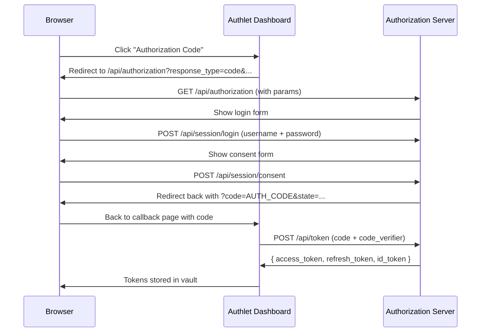
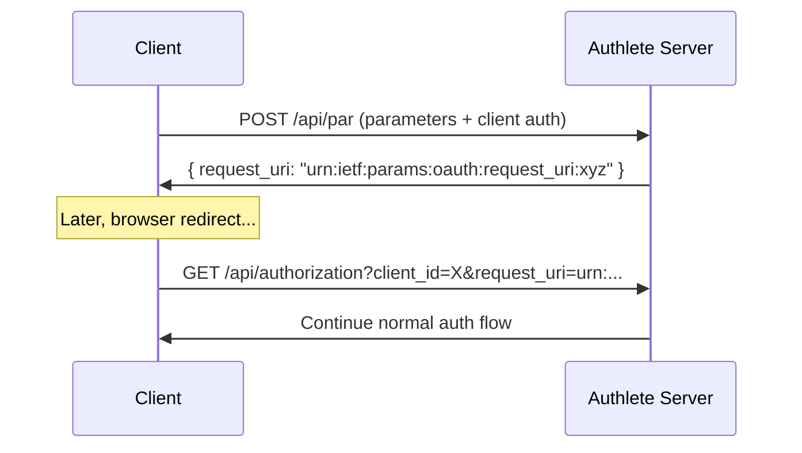

# Authlete OAuth 2.0 / OpenID Connect Debugging Dashboard

A comprehensive interactive debugging dashboard for learning, testing, and debugging **OAuth 2.0** and **OpenID Connect (OIDC)** flows against an Authlete-powered authorization server.

## Table of Contents

- [What is OAuth 2.0?](#what-is-oauth-20)
- [What is OpenID Connect (OIDC)?](#what-is-openid-connect-oidc)
- [Setup](#setup)
- [Dashboard Overview](#dashboard-overview)
- [Sections Explained](#sections-explained)
  - [1. Auth Flows — The Four Standard Grant Types](#1-auth-flows--the-four-standard-grant-types)
  - [2. Token Operations](#2-token-operations)
  - [3. Token Management (Admin)](#3-token-management-admin)
  - [4. Client Management](#4-client-management)
  - [5. Dynamic Client Registration (DCR)](#5-dynamic-client-registration-dcr)
  - [6. Grant Management](#6-grant-management)
  - [7. CIBA — Client-Initiated Backchannel Authentication](#7-ciba--client-initiated-backchannel-authentication)
  - [8. PAR — Pushed Authorization Requests](#8-par--pushed-authorization-requests)
  - [9. RP-Initiated Logout](#9-rp-initiated-logout)
  - [10. Backchannel Logout Issuing](#10-backchannel-logout-issuing)
  - [11. Discovery](#11-discovery)
  - [12. Health Checks](#12-health-checks)
  - [13. Token Vault](#13-token-vault)
- [Server Status Indicator](#server-status-indicator)
- [Key Distinctions](#key-distinctions)
- [Troubleshooting](#troubleshooting)

---

## What is OAuth 2.0?

OAuth 2.0 is an **authorization framework** that lets applications get limited access to a user's resources without knowing their password.

### A Real-World Analogy

Imagine you're at a hotel:

1. **You** (the **end-user**) check in at the front desk.
2. The front desk gives you a **key card** (an **access token**) that opens your room and the gym, but NOT the staff-only areas.
3. You give that key card to the **bellhop** (a **client application**) so they can bring your luggage to your room.
4. The bellhop uses the key card to enter your room, but **cannot** enter other rooms or the staff office.
5. When you check out, the key card **expires** (token expiration).

OAuth 2.0 defines **grant types** — different ways a client can request a key card:

| Grant Type | Real World Analogy | Best For |
|-----------|-------------------|----------|
| **Authorization Code** | Checking in at the front desk, getting a key card | Web apps, mobile apps |
| **Client Credentials** | A staff member swiping their own badge to enter the server room | Server-to-server, APIs |
| **Password (ROPC)** | Giving the bellhop your room key directly (trusted only!) | Legacy apps (avoid if possible) |
| **Refresh Token** | Getting a new key card when yours expires | Long-lived sessions |

### Key Concepts

- **Client**: The application requesting access (e.g., a web app, mobile app, backend service)
- **Resource Owner**: The user who owns the data
- **Authorization Server (AS)**: The server that issues tokens (this project)
- **Resource Server (RS)**: The server that hosts the protected data and validates tokens
- **Access Token**: A credential used to access protected resources. Like a key card — limited scope, expires.
- **Refresh Token**: A credential used to get new access tokens. Like a VIP pass to the front desk — long-lived.
- **Scope**: Permissions the token grants (e.g., `profile` = read name/email; `email` = read email address)
- **Client ID**: A public identifier for your application. Like a username.
- **Client Secret**: A confidential password for your application. Like a password — keep it secret!

---

## What is OpenID Connect (OIDC)?

OpenID Connect is a **simple identity layer on top of OAuth 2.0**. OAuth 2.0 gives you access ("can this app read my profile?"). OIDC adds authentication ("is this user actually Alice?").

### OAuth vs OIDC

| | OAuth 2.0 | OpenID Connect |
|---|---|---|
| **Purpose** | Authorization ("grant access") | Authentication ("prove identity") |
| **Output** | Access token | Access token + ID token |
| **User Info** | Optional (scopes) | Standardized (`sub`, `name`, `email`, etc.) |
| **Standard** | RFC 6749 | OIDC Core 1.0 |
| **Analogy** | Key card to a hotel room | Passport proving who you are |

The **ID token** is a JWT (JSON Web Token) that contains claims about the user — their `sub` (unique identifier), `name`, `email`, etc. You can decode it to see who authenticated.

---

## Setup

### Prerequisites

- The Authlete Node Authorization Server running (see root `README.md`)
- `VITE_API_BASE_URL` set to the server URL (default: `http://localhost:3000`)

### Quick Start

```bash
# 1. Copy the env template
cp client/.env.example client/.env

# 2. Start the dev server
npm --prefix client run dev
```

Open `http://localhost:3001` in your browser. The dashboard loads automatically.

### Configuration

Edit `client/.env`:

| Variable | Default | Purpose |
|----------|---------|---------|
| `VITE_API_BASE_URL` | `http://localhost:3000` | The Authlete Node server URL |
| `VITE_CLIENT_ID` | `your_client_id` | Pre-fills Client ID in forms |
| `VITE_CLIENT_SECRET` | `your_client_secret` | Pre-fills Client Secret in forms |
| `VITE_REDIRECT_URI` | `http://localhost:3001/callback` | OAuth redirect URI for the test dashboard |
| `VITE_SCOPES` | `openid profile email` | Default scopes for flows |
| `VITE_PROD_API_BASE_URL` | (falls back to dev URL) | Override for production deployments |
| `VITE_PROD_REDIRECT_URI` | (falls back to dev URL) | Override for production deployments |

---

## Dashboard Overview

The dashboard is a single-page React application organized into a sidebar with three category groups and 12 interactive sections:

```
┌─────────────────────────────────────────────────────────┐
│ [🔴 Logo] OAuth Debugger        [🟢 Connected] Server   │  ← Sticky header with live status
├──────────────┬──────────────────────────────────────────┤
│  OAuth 2.0   │  ┌─ Section Panel ─────────────────────┐  │
│  ├ Grant Flows│  │                                     │  │
│  ├ Token Ops  │  │  [Tab Bar] Grant Type Selector     │  │
│  └ Logout     │  │                                     │  │
│              │  │  [Flow Diagram] Step-by-step progress│  │
│  OIDC & Ext.  │  │                                     │  │
│  ├ DCR       │  │  [Split Pane]                        │  │
│  ├ CIBA      │  │  ┌─Config──────┐ ┌─Response───────┐ │  │
│  ├ PAR       │  │  │ Form fields  │ │ JSON result    │ │  │
│  ├ Device Flow│  │  │ + cURL      │ │ + copy button  │ │  │
│  ├ BC Logout │  │  │ preview     │ │                │ │  │
│  └ Discovery │  │  └─────────────┘ └────────────────┘ │  │
│              │  └───────────────────────────────────────┘  │
│  Admin       │                                            │
│  ├ Token Mgmt│                                            │
│  ├ Client Mgmt│                                            │
│  ├ Grant Mgmt│                                            │
│  └ Health    │                                            │
│              │                                            │
│  ┌──────────┐│                                            │
│  │Token Vault││  ← Expandable sidebar panel (always shown)│
│  └──────────┘│                                            │
└──────────────┴──────────────────────────────────────────┘
```

Key layout features:
- **Sticky 48px header** with bug-icon logo, navigation menu (mobile), and live server status badge
- **Collapsible mobile nav** (hidden on desktop) with grouped sections
- **Desktop sidebar** (56px wide) with 3 category groups, indigo active-state shadows
- **Main content area** with section panels that include icons, descriptions, tab bars, flow diagrams, and split config/response panes
- **Token Vault** — pinned at the bottom of the sidebar, expandable to show/copy/decode stored tokens

Each section prominently displays:
1. **Operation description** — explains what the operation does, with real-world analogies
2. **Flow diagram** — numbered steps showing the request/response sequence
3. **Request preview** — HTTP method, URL, headers, body with one-click cURL copy
4. **Response panel** — formatted JSON with copy button

### Server Status Indicator

The header badge shows the live connection status to the Authlete server:

| State | Dot | Label | Behavior |
|-------|-----|-------|----------|
| Connected | Green (with glow) | "Connected" | Server responds within 5s, hover shows uptime |
| Disconnected | Red (with glow) | "Offline" | Network error, non-200, or timeout >5s |
| Checking | Yellow (pulsing) | "Checking" | Initial load or retry after failure |

The `useServerStatus` hook (in `hooks/useServerStatus.ts`) polls `GET /api/health`:
- Every 30s when connected
- Every 10s on failure (retry interval)
- 5s request timeout (aborts stale requests)
- Cleans up on unmount (aborts in-flight fetch + clears interval)

---

## Sections Explained

### 1. Auth Flows — The Four Standard Grant Types

This section lets you exercise all four standard OAuth 2.0 grant types. Select a grant type via the tab bar, fill in the parameters, and click the action button. The resulting tokens appear in the **Token Vault** in the sidebar.

#### Authorization Code + PKCE (Most Secure)

**What it does**: Redirects your browser to the authorization server's login page. You enter credentials, then consent. The server redirects back with a **code**, which is exchanged for tokens behind the scenes.

**Real-world example**: When you click "Sign in with Google" on a website — you get redirected to Google, log in, and Google redirects back to the website with a code.



**Try it**:
1. Enter a **Client ID** (public client works best — no secret needed)
2. Enter a **Redirect URI** (default: `http://localhost:3001/callback`)
3. Click **Run** — you'll be redirected to the login page
4. Log in with the demo credentials (`admin` / `password`)
5. Approve consent
6. You'll be redirected back — tokens appear in the vault

#### Client Credentials (Machine-to-Machine)

**What it does**: The client authenticates directly with its ID and secret to get a token. No user involved.

**Real-world example**: A cron job that calls an API to generate daily reports. The job identifies itself as a known client, not as a specific user.

```bash
# What happens behind the scenes:
curl -X POST http://localhost:3000/api/token \
  -u "YOUR_CLIENT_ID:YOUR_CLIENT_SECRET" \
  -d "grant_type=client_credentials&scope=openid"
```

**Try it**: Enter a confidential client's ID and secret, set scopes (e.g., `openid profile`), click **Get Token**.

#### Password Grant (ROPC) — Legacy

**What it does**: You provide your username and password directly to the client, which sends them to the token endpoint.

**Real-world example**: Older mobile banking apps where you type your credentials into the app itself (not recommended today).

**⚠️ Security Warning**: You are giving your password to the client app. Only use this when you absolutely trust the client (first-party apps, legacy systems).

#### Refresh Token

**What it does**: Uses a previously obtained refresh token to get a new access token without re-authenticating.

**Try it**: After running Authorization Code or Password flows, the refresh token is pre-filled. Just click **Refresh Token**.

---

### 2. Token Operations

Once you have tokens, this section lets you use them:

| Operation | What It Does | Why Use It |
|-----------|-------------|------------|
| **UserInfo** | Fetches the authenticated user's profile (name, email, etc.) | Verifies the token works and shows what data you can access |
| **Introspect (Authlete)** | Checks token validity with full Authlete metadata | Debugging token issues — shows ALL token properties |
| **Introspect (RFC 7662)** | Checks token validity with standard properties | If you switch providers, this response format stays the same |
| **Revoke** | Immediately invalidates a token | Logging out, security incidents |

**Example — UserInfo**:
```bash
curl http://localhost:3000/api/userinfo \
  -H "Authorization: Bearer YOUR_ACCESS_TOKEN"
```
Returns: `{"sub": "admin", "name": "Administrator", ...}`

---

### 3. Token Management (Admin)

For system administrators. Lets you create, list, update, revoke, delete, and reissue tokens directly, bypassing normal OAuth flows.

**Requires**: `MGMT_CLIENT_ID`/`MGMT_CLIENT_SECRET` Basic auth (configured on the server).

| Operation | Use Case |
|-----------|----------|
| **Create** | Issue a token for testing without running a full OAuth flow |
| **List** | See ALL tokens issued by the service. Find specific tokens |
| **Update** | Change a token's scopes or expiration |
| **Revoke** | Invalidate a token by its internal ID (not the token value) |
| **Delete** | Permanently remove a token record |
| **Reissue** | Get a new token from an existing token pair |
| **Local JWT** | Sign a JWT locally without calling Authlete (dev testing) |

**Pro tip**: Use **List** first to find the `accessTokenIdentifier` (a numeric ID), then use it in Revoke or Delete. The identifier is NOT the token value itself.

---

### 4. Client Management

Manage OAuth client applications registered with the service. This is the admin-level CRUD for clients.

**Requires**: `MGMT_CLIENT_ID`/`MGMT_CLIENT_SECRET` Basic auth.

| Operation | What It Does |
|-----------|-------------|
| **List** | View all registered clients (paginated) |
| **Get** | View a single client's full configuration |
| **Create** | Register a new client application |
| **Update** | Modify a client's settings (name, redirect URIs, etc.) |
| **Delete** | Remove a client permanently |
| **Lock / Unlock** | Disable/re-enable a client without deleting it |
| **Refresh Secret** | Generate a new client secret (rotation) |
| **Update Secret** | Set a specific secret value |
| **List Authorizations** | See which clients a user has authorized |
| **Update Authorizations** | Change scopes granted to a client for a user |
| **Delete Authorizations** | Revoke a client's access for a user |
| **Manage Scopes** | Control which scopes a client can request |

**Real-world scenario**: A user reports unauthorized access. You can:
1. **List Authorizations** for that user to see which apps have access
2. **Delete Authorizations** for suspicious apps
3. **Lock** the suspicious client to prevent further token issuance
4. **Refresh Secret** for the client if it was compromised

---

### 5. Dynamic Client Registration (DCR)

Implements RFC 7591 / RFC 7592 — allows clients to register themselves dynamically without admin intervention.

**How it differs from Client Management**: DCR is the **self-service** version. A client sends its metadata to the `/register` endpoint and gets back a `client_id` and `registration_access_token`. The `get`/`update`/`delete` operations use the registration access token instead of admin credentials.

| Operation | Auth Method | When To Use |
|-----------|-------------|-------------|
| **Register** | Admin Basic (MGMT credentials) | First-time client registration |
| **Get** | Registration access token | Retrieve your own client config |
| **Update** | Registration access token | Modify your client settings |
| **Delete** | Registration access token | Remove your client |

**Example flow**:
1. Click **Register** → paste client metadata JSON → click Run
2. Copy the returned `registration_access_token`
3. Click **Get** → enter the `client_id` and `registration_access_token` → Get confirms it exists
4. Click **Update** → change the metadata → Update confirms changes
5. Click **Delete** → client is permanently removed

**DCR vs Client Management — which to use?**
- **Client Management** = Admin tool. Full control, no self-service. Good for internal apps.
- **DCR** = Self-service. Client authenticates with a registration token. Good for third-party developers.

---

### 6. Grant Management

Implements [Grant Management for OAuth 2.0](https://openid.net/specs/oauth-v2-grant-management.html). Lets you query and revoke **grants** — the authorization a user gave to a client.

**What is a Grant?** When a user goes through the authorization code flow and approves consent, that creates a **grant**. The grant management API lets you see and revoke these grants.

**Requires**: A Bearer token with the `grant_management_query` scope (to query) or `grant_management_revoke` scope (to revoke).

| Operation | What It Does |
|-----------|-------------|
| **Query** | Get the status and details of a grant by its `grant_id` |
| **Revoke** | Immediately revoke a grant — all tokens issued under it become invalid |

**Real-world scenario**: A user says "I want to disconnect my Google account from this app":
1. The app gets the `grant_id` from the token response
2. Calls **Revoke** with that `grant_id`
3. All access tokens and refresh tokens for that grant are invalidated

---

### 7. CIBA — Client-Initiated Backchannel Authentication

**What is CIBA?** CIBA (pronounced "see-ba") is an OIDC flow where the **client initiates authentication on behalf of the user** — the user does NOT need to be at a browser. Instead, the client sends an authentication request, and the user authenticates on a separate device (like their phone).

**Real-world scenario**: You're at a bank teller. The teller's terminal (the client) sends a CIBA authentication request. Your phone buzzes — you approve the login on your phone. The terminal gets the tokens without you typing anything.

**The CIBA Flow**:

```
Step 1: Client → Server:
  POST /api/ciba/authentication
  { "parameters": "login_hint=admin&scope=openid", "clientId": "...", "clientSecret": "..." }
  → Returns: { "action": "USER_IDENTIFICATION", "ticket": "abc123", "hintType": "...", "deliveryMode": "POLL" }

Step 2 (if you identified the user):
  POST /api/ciba/issue
  { "ticket": "abc123" }
  → Returns: { "authReqId": "def456", "expiresIn": 120, "interval": 5 }

OR (if you cannot identify the user):
  POST /api/ciba/fail
  { "ticket": "abc123", "reason": "UNKNOWN_USER_ID" }

Step 3 (after end-user authenticates on their device):
  POST /api/ciba/complete
  { "ticket": "abc123", "result": "AUTHORIZED", "subject": "admin" }

Finally, the client polls the token endpoint:
  POST /api/token
  grant_type=urn:openid:params:grant-type:ciba
  auth_req_id=def456
```

**Delivery Modes**:
- **POLL**: Client repeatedly calls the token endpoint until tokens are ready
- **PING**: Server notifies the client at `client_notification_token`, then client polls
- **PUSH**: Server sends tokens directly to `client_notification_endpoint`

**Try it**:
1. Set **Parameters** to `login_hint=admin&scope=openid`
2. Enter your **Client ID** and **Client Secret**
3. Click **Authentication** → get a `ticket`
4. Click **Issue** → get an `auth_req_id`
5. Click **Complete** with `result: AUTHORIZED` and `subject: admin`
6. The client polls the token endpoint with the `auth_req_id` to get actual tokens

---

### 8. PAR — Pushed Authorization Requests

**What is PAR?** PAR (RFC 9126) lets a client send the authorization parameters directly to the server as a POST request, rather than including them as query parameters in the browser redirect URL.

**Why use PAR?**
- **Large payloads**: Browser URLs have length limits. PAR uses POST which has no practical limit.
- **Mobile apps**: The `request_uri` is short and easy to handle in native app redirects.
- **Security**: The parameters are never visible in the browser URL bar.

**How it works**:



**Try it**:
1. Set **Parameters** to a URL-encoded authorization request (e.g., `response_type=code&client_id=YOUR_CLIENT_ID&redirect_uri=http://localhost:3001/callback&scope=openid&state=par_state`)
2. Enter **Client ID** and **Client Secret**
3. Click **Run** → get a `request_uri`
4. Open the `request_uri` in the authorization endpoint URL:
   `http://localhost:3000/api/authorization?client_id=YOUR_CLIENT_ID&request_uri=urn:ietf:params:oauth:request_uri:xyz`

---

### 9. RP-Initiated Logout

**What it does**: Implements OpenID Connect RP-Initiated Logout 1.0. When the user clicks logout, the browser redirects to the server's logout endpoint, the server-side session is destroyed, and the user is optionally redirected back to the application.

**What happens step by step**:

```
1. User clicks "Logout" in the app
2. Client clears tokens from browser storage
3. Browser redirects to: GET /api/logout?id_token_hint=...&post_logout_redirect_uri=...&state=...
4. Server identifies the user (from id_token_hint or existing session)
5. Server destroys the session
6. Server validates the post_logout_redirect_uri
7. If valid: Server redirects browser back to post_logout_redirect_uri
8. If invalid: Server shows a logout confirmation page
```

**Parameters**:

| Parameter | Purpose |
|-----------|---------|
| `id_token_hint` | The ID token identifying the session to end. Helps the server find the right session even without a cookie |
| `post_logout_redirect_uri` | Where to send the user after logout. Must be allowed by the server's configuration |
| `state` | A random value for CSRF protection. The server echoes it back in the redirect URL |

**Real-world example**: When you click "Sign out" on a website that uses "Sign in with Google", it redirects you to Google's logout endpoint, logs you out of Google, then redirects you back to the website.

**Try it**:
1. The **ID Token Hint** is pre-filled from your current session (if available)
2. **Post-Logout Redirect URI** defaults to the current page origin (works on any deployment)
3. **State** is a random UUID generated automatically
4. Click **RP-Initiated Logout** — you'll navigate away from the dashboard

**Note**: This redirects the entire browser. Tokens are cleared before the redirect. The server also destroys its session.

---

### 10. Backchannel Logout Issuing

**What it does**: Implements the **issuing side** of OIDC Back-Channel Logout 1.0. This is the server acting as an **OpenID Provider (OP)** that notifies **Relying Parties (RPs)** when a session is terminated.

**What happens step by step**:

```
1. Admin provides MGMT credentials + client identifier
2. Server calls Authlete to issue a logout token JWT
3. (Optional) Server POSTs the token to the client's backchannelLogoutUri
4. The client receives the logout token and destroys the relevant session
```

**The Logout Token** is a special JWT:
- `typ`: `logout+jwt`
- `events`: `{ "http://schemas.openid.net/event/backchannel-logout": {} }`
- `sub` or `sid`: Identifies the session being terminated

**Operations**:

| Operation | What It Does |
|-----------|-------------|
| **Issue Token** | Generate a logout token JWT without delivering it. Lets you inspect the JWT first |
| **Issue & Deliver** | Generate + POST to one client's `backchannelLogoutUri` |
| **Issue & Deliver All** | Generate + POST to ALL clients that have a `backchannelLogoutUri` configured |

**Real-world example**: A company's SSO system. When a user logs out of the central SSO (RP-Initiated Logout), the SSO sends backchannel logout tokens to all connected apps (Salesforce, Slack, Jira, etc.), so each app also logs the user out.

**Try it**:
1. Enter **MGMT Client ID** and **MGMT Client Secret**
2. Enter a **Client Identifier** (the client_id or alias of a registered client that has `backchannelLogoutUri` set)
3. Enter a **Subject** (e.g., `admin`)
4. Click **Issue Token** to see the logout JWT
5. Click **Decoded Logout Token** to inspect its claims
6. Click **Issue & Deliver** to actually deliver it
7. Click **Issue & Deliver All** to notify all registered clients

**Admin auth behavior**: MGMT Client ID and Secret are both required for the button to become active. If either field is empty, buttons remain disabled with a tooltip indicating missing credentials.

---

Backchannel flow requires **MGMT_CLIENT_ID** and **MGMT_CLIENT_SECRET** configured on the server (set in `server/.env`).

The **receiving endpoint** at `POST /api/backchannel_logout` handles incoming logout tokens from other OPs when your server acts as an RP. The client dashboard does not test this — it only tests issuing.

---

### 11. Discovery

Fetches the server's OpenID Connect Discovery document and JSON Web Key Set (JWKS).

| Operation | What It Shows |
|-----------|--------------|
| **OIDC Discovery** | All server endpoints, supported scopes, response types, grant types, algorithms, and capabilities |
| **JWKS** | The server's public keys for verifying JWT signatures |

**Try it**: Click **Fetch Discovery** to see the full OIDC configuration. Click **Fetch JWKS** to see the public keys.

**Real-world use**: OAuth libraries use the Discovery document to auto-configure themselves:
```javascript
// Instead of hardcoding URLs:
const issuer = await Issuer.discover('http://localhost:3000/api/.well-known/openid-configuration');
// Now issuer.token_endpoint, issuer.authorization_endpoint, etc. are all filled in
```

---

### 12. Health Checks

Two health checks for verifying the server and its connection to Authlete:

| Check | What It Verifies |
|-------|-----------------|
| **Server Health** | The Express server is running and responding. Auto-runs on page load |
| **Authlete Health** | The Authlete API is reachable and functioning. Can optionally test DB connectivity |

The server status is also shown live in the header badge (see [Server Status Indicator](#server-status-indicator)).

**Try it**: Click **Refresh** next to the server status. Click **Check Authlete Health** to verify Authlete connectivity. Enable **Extended** to also test the Authlete database.

---

### 13. Token Vault

The always-visible Token Vault is pinned at the bottom of the desktop sidebar (or accessible via the expandable mobile nav footer). It shows:

- **Access Token**: The main token for API calls
- **Refresh Token**: For getting new access tokens
- **ID Token**: The OIDC identity token (decode it to see user claims)

Each token has a **Copy** button and a truncated preview. The **ID Token** has a **Decode** button that displays the full decoded JWT payload in a formatted JSON block.

Tokens persist in `sessionStorage` — they survive page refreshes but are cleared when the browser tab is closed. A green dot on the vault icon indicates active tokens.

---

## Server Status Indicator

The header always shows a live connectivity badge. The `useServerStatus` hook (at `hooks/useServerStatus.ts`) handles the polling:

```typescript
const { status, isOnline, uptime } = useServerStatus();
// status: 'connected' | 'disconnected' | 'checking'
// isOnline: boolean
// uptime: number | null (seconds since last check)
```

- Polls `GET /api/health` (no auth, no external dependencies — pure liveness probe)
- 30s interval when connected, 10s retry on failure
- 5s per-request timeout, aborted on unmount or stale
- Tooltip on hover shows server uptime when connected

---

## Key Distinctions

### RP-Initiated Logout vs Backchannel Logout

These are the two most commonly confused features. They are **complementary**, not alternatives:

| Aspect | RP-Initiated Logout (Section 9) | Backchannel Logout Issuing (Section 10) |
|--------|-------------------------------|----------------------------------------|
| **OIDC Spec** | RP-Initiated Logout 1.0 | Back-Channel Logout 1.0 |
| **Who starts it?** | The **RP** (app) via browser redirect | The **OP** (server) via server-to-server POST |
| **Direction** | Browser → OP (front-channel) | OP → Client RP (back-channel) |
| **Transport** | HTTP redirect in the browser | Direct HTTP POST between servers |
| **Who is involved?** | User, browser, OP | OP, target RP server (no user browser) |
| **Session affected** | The OP's session (user logs out of SSO) | The RP's session (app logs user out) |
| **Auth required** | None (user's session cookie) | Admin Basic (MGMT credentials) |
| **Endpoint** | `GET /api/logout` | `POST /api/backchannel_logout/{issue,deliver,deliver-all}` |
| **The output is...** | A redirect (user goes somewhere else) | A JWT logout token (delivered to RP) |

**Real-world scenario showing both in action:**

1. Alice is logged into **SSO Portal** (this server, acting as OP) and three connected apps: **Mail**, **Docs**, and **CRM** (each acting as RPs).

2. Alice clicks **"Logout"** on the SSO Portal.
   - This is **RP-Initiated Logout**: The SSO Portal redirects Alice to this server's `/api/logout`.
   - The server destroys Alice's SSO session.
   - Alice is redirected back to the SSO Portal's home page.

3. But wait — Alice is still logged into **Mail**, **Docs**, and **CRM**! Unless...
   - The server also triggers **Backchannel Logout**: It issues a logout token JWT and POSTs it to the `/backchannel_logout` endpoint of each app.
   - Each app receives the token, verifies it, finds the matching session, and destroys it.

4. Now Alice is fully logged out of everything.

**In the dashboard**:
- Use **Section 9 (RP-Initiated Logout)** to test step 2 — the browser redirect logout.
- Use **Section 10 (Backchannel Logout Issuing)** to test step 3 — the server-to-server token delivery.

### Authorization Code vs Client Credentials

| Aspect | Authorization Code | Client Credentials |
|--------|-------------------|-------------------|
| **Who is authenticated?** | The end-user | The client application |
| **User interaction?** | Yes (login + consent) | No |
| **Use case** | User-facing apps | Backend services, APIs |
| **Returns a refresh token?** | Usually yes | Usually no |
| **Client secret needed?** | Only for confidential clients | Yes |

### Introspection: Authlete vs RFC 7662

| Aspect | Authlete Introspection | RFC 7662 Introspection |
|--------|----------------------|----------------------|
| **Response richness** | Full Authlete metadata | Standard only |
| **Portability** | Authlete-specific | Works with any OAuth server |
| **Use when** | Debugging, deep inspection | Interoperability, provider-agnostic code |

### Client Management vs DCR

| Aspect | Client Management (Section 4) | DCR (Section 5) |
|--------|------------------------------|-----------------|
| **Who can create clients?** | Admins only (MGMT auth) | Any client with admin auth (for register) |
| **Get/Update/Delete auth** | Basic auth (MGMT credentials) | Registration access token (self-service) |
| **Audience** | Internal admin tool | Third-party developers |
| **Client configuration depth** | Full control (all fields) | Metadata-driven (self-describing JSON) |

### Authorization Code vs PAR

Both use the authorization endpoint, but:

| Aspect | Direct Authorization Code | PAR (Pushed Authorization Request) |
|--------|-------------------------|-----------------------------------|
| **Parameters delivery** | Browser URL query string | Server-to-server POST |
| **URL length limit** | Limited (browser URL limit) | No limit (POST body) |
| **PKCE** | Required for public clients | Supported (add to parameters) |
| **Mobile-friendly** | Less (complex redirects) | More (short request_uri) |
| **Performance** | One round trip | Two round trips (PAR + authorize) |

---

## Troubleshooting

### "Failed to fetch" or CORS errors

- Ensure the server is running on the expected port (default: `localhost:3000`)
- Check `ALLOWED_ORIGINS` on the server includes your client URL (default: `http://localhost:3000,http://localhost:3001`)
- For production, set `VITE_PROD_API_BASE_URL` to the deployed server URL
- The header's server status indicator shows red ("Offline") if the server is unreachable

### "invalid_client" errors

- **Client Credentials flow**: Make sure you're using a **confidential** client (one with a secret)
- **Authorization Code flow**: Public clients work without a secret. Enter just the Client ID
- **DCR Register**: Requires `MGMT_CLIENT_ID`/`MGMT_CLIENT_SECRET` configured on the server (check server's `.env`)
- **Backchannel Logout Issue**: Same — requires MGMT credentials

### "invalid_grant" errors

- The authorization code may have expired (5-minute default window). Run the flow again
- The refresh token may have been revoked. Get a new one
- The code verifier doesn't match the code challenge. Make sure PKCE is generated correctly

### "access_denied" errors

- The user denied the consent request
- The requested scopes are not allowed for this client
- CIBA: The end-user identified via `login_hint` does not match the expected subject

### Button is disabled

- **Auth flows**: Client ID is required
- **Admin sections**: MGMT Client ID and Secret are both required
- **Backchannel logout**: Both MGMT credentials are required (buttons disabled when either field is empty)
- **DCR Get/Update/Delete**: Registration access token and Client ID are required

### The authorization flow doesn't redirect back

- Check that the **Redirect URI** in the form matches exactly what is registered for the client in Authlete
- The callback page must be at the same origin as the redirect URI
- For the dev dashboard, the default redirect is `http://localhost:3001/callback`

### Tokens don't appear in the vault

- The callback page (`/callback`) must be accessible
- Check the browser console for errors — the callback is handled at the page level, not in the dashboard component
- After the redirect back, the callback page extracts tokens and sets them in the context, then redirects to the dashboard

### Backchannel logout "Client has no backchannelLogoutUri"

- The client must be configured in Authlete with a `backchannelLogoutUri`
- Use **Client Management → Get** to check if the client has this field set
- Update the client to add a `backchannelLogoutUri`

### Which client type should I use for testing?

| If you want to... | Use a... | Example |
|-------------------|----------|---------|
| Test browser-based login flows | **Public** client (no secret) | SPA, mobile app |
| Test server-to-server flows | **Confidential** client | Backend API |
| Test CIBA | **Confidential** client (CIBA requires client auth) | Banking app backend |
| Test PAR | **Confidential** or **Public** client | Any app type |
| Test DCR | Register a new one dynamically | Third-party developer |
| Admin operations | No client needed (use MGMT credentials) | Admin dashboard |

---

## Architecture

```
┌─────────────────────────────────────────────────────────────────┐
│                      Browser (localhost:3001)                    │
│                                                                  │
│  ┌───────────────────────────────────────────────────────────┐  │
│  │  Authlete Debugging Dashboard                             │  │
│  │                                                           │  │
│  │  ┌─────── Header (sticky) ─────────────────────────────┐ │  │
│  │  │  [🪲 Logo] OAuth Debugger      [🟢 Connected] Server │ │  │
│  │  └─────────────────────────────────────────────────────┘ │  │
│  │                                                           │  │
│  │  ┌────────────┬────────────────────────────────────────┐ │  │
│  │  │ Sidebar     │ Section Panel                         │ │  │
│  │  │ (desktop)   │  ┌────────────────────────────────┐  │ │  │
│  │  │             │  │ Icon + Title + Actions         │  │ │  │
│  │  │ OAuth 2.0   │  │                                │  │ │  │
│  │  │  ├ Grant    │  │ [TabBar] flow selector         │  │ │  │
│  │  │  │ Flows    │  │                                │  │ │  │
│  │  │  ├ Token    │  │ [FlowDiagram] steps            │  │ │  │
│  │  │  │ Ops      │  │                                │  │ │  │
│  │  │  └ Logout   │  │ [SplitPane]                    │  │ │  │
│  │  │             │  │  ┌─Config──┐ ┌─Response─────┐ │  │ │  │
│  │  │ OIDC/Ext.  │  │  │ Forms   │ │ JSON result  │ │  │ │  │
│  │  │  ├ DCR     │  │  │ + cURL  │ │ + copy       │ │  │ │  │
│  │  │  ├ CIBA    │  │  └─────────┘ └──────────────┘ │  │ │  │
│  │  │  ├ PAR     │  └────────────────────────────────┘  │ │  │
│  │  │  ├ Device  │                                       │ │  │
│  │  │  ├ BC      │                                       │ │  │
│  │  │  │ Logout  │                                       │ │  │
│  │  │  └ Discov. │                                       │ │  │
│  │  │             │                                       │ │  │
│  │  │ Admin       │                                       │ │  │
│  │  │  ├ Token   │                                       │ │  │
│  │  │  ├ Client  │                                       │ │  │
│  │  │  ├ Grant   │                                       │ │  │
│  │  │  └ Health  │                                       │ │  │
│  │  │             │                                       │ │  │
│  │  │ ┌─────────┐│                                       │ │  │
│  │  │ │Token    ││                                       │ │  │
│  │  │ │Vault  ◀─┤├─────── Stored tokens                  │ │  │
│  │  │ └─────────┘│                                       │ │  │
│  │  └────────────┴────────────────────────────────────────┘ │  │
│  │                                                           │  │
│  │              │ HTTP requests (via service modules)        │  │
│  │              ▼                                            │  │
│  │  ┌─────────────────────────────┐                         │  │
│  │  │ Authlete Node Server        │                         │  │
│  │  │ (localhost:3000 or deployed)│                         │  │
│  │  └─────────────────────────────┘                         │  │
│  └───────────────────────────────────────────────────────────┘  │
└─────────────────────────────────────────────────────────────────┘
```

The dashboard is a single-page React application that communicates with the Authlete Node authorization server via HTTP. All OAuth/OIDC logic is handled server-side — the dashboard is purely a testing UI that makes API calls through service modules (`services/token.service.ts`, `services/admin.service.ts`, etc.).
