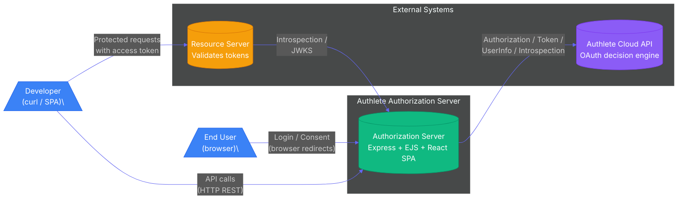
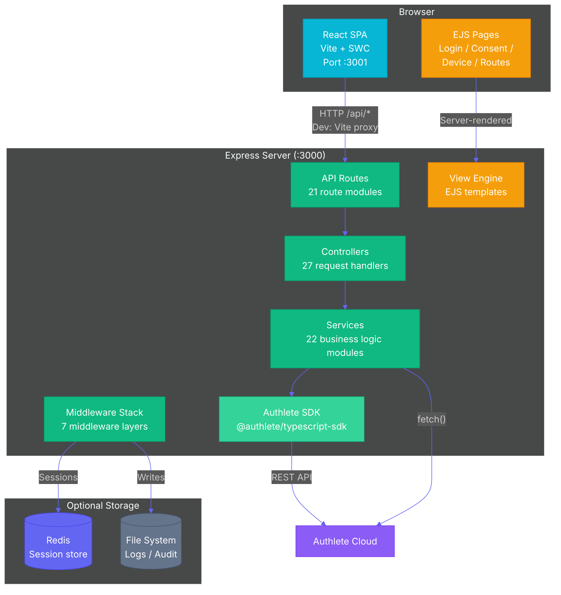
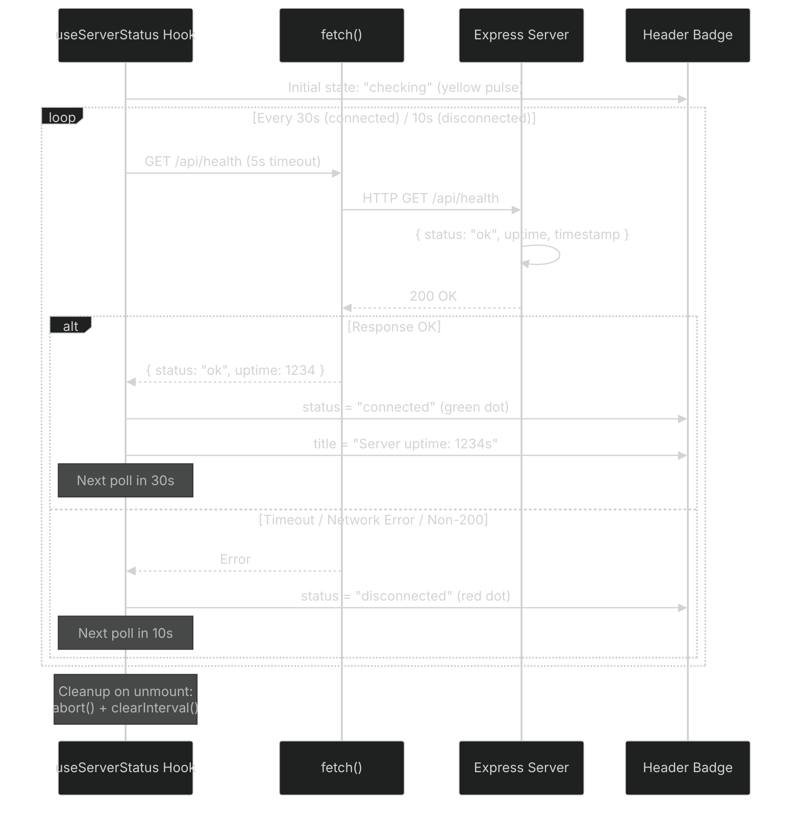
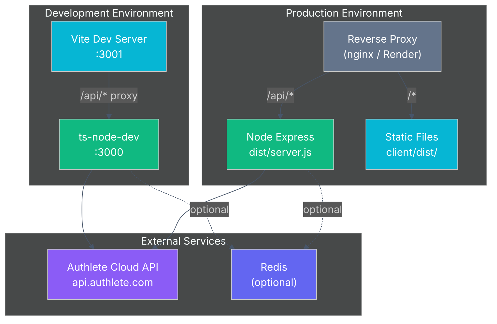

# Architecture

- [System Context](#system-context)
- [Container Diagram](#container-diagram)
- [Middleware Pipeline](#middleware-pipeline)
- [CSRF Token Lifecycle](#csrf-token-lifecycle)
- [Health Polling](#health-polling)
- [Deployment Topology](#deployment-topology)
- [Configuration Flow](#configuration-flow)

---

## System Context



The Authorization Server sits between end users (who authenticate via browser) and Authlete (which makes all OAuth decisions). Developers interact through either the React SPA dashboard or direct curl requests.

**Key property**: The server holds zero OAuth state. Every token, client registration, and authorization grant exists only in Authlete's cloud. The server is a stateless translation layer.

---

## Container Diagram



### Request Lifecycle

1. **HTTP request arrives** → middleware stack processes it (metrics, audit, sessions, CSRF)
2. **Router matches** → one of 18 route modules maps the path to a controller
3. **Controller orchestrates** → calls the appropriate service module(s)
4. **Service calls Authlete** → via the SDK (or raw `fetch()` for 3 services)
5. **Response flows back** → through middleware (audit log, metrics recorded)
6. **SPA requests** → proxied by Vite in dev, served from `dist/` in production

### When Raw `fetch()` is Used

| Service | Reason |
|---------|--------|
| `health.service.ts` | SDK has no health-check method |
| `backchannel-logout.service.ts` | SDK v1.1.6 doesn't expose backchannel logout API |
| `metrics.service.ts` | Uses `prom-client` directly (not Authlete-related) |

---

## Middleware Pipeline


Middleware executes top-to-bottom. Key behaviors:

| # | Middleware | Side Effects | Config |
|--|-----------|--------------|--------|
| 1 | Static | Serves files from `public/` | `NODE_ENV` for path resolution |
| 2 | Security Headers | Sets 4 headers always (X-Content-Type-Options, X-Frame-Options, Referrer-Policy, Permissions-Policy) + HSTS in production |
| 3 | CORS | `Access-Control-*` headers | `ALLOWED_ORIGINS` env var |
| 4 | Request ID | Adds `req.id` (UUID v1) | — |
| 5 | Logger | Creates Winston child with `reqId` | `LOG_LEVEL` env var |
| 6 | Morgan | HTTP access logs via Winston | `MORGAN_FORMAT` |
| 7 | Metrics | Starts timer, increments counter on finish | — |
| 8 | Audit | Writes entry on `res.finish` | Daily rotate, 90-day retention |
| 9 | Body Parsers | `req.body` + `req.rawBody` for form data | — |
| 10 | Cookie Parser | `req.cookies` | — |
| 11 | Trust Proxy | `app.set("trust proxy", 1)` — trusts first proxy (nginx/Render) | `NODE_ENV` |
| 12 | Session | `req.session` (in-memory or Redis) | `SESSION_SECRET`, `REDIS_URL` |
| 13 | Timeout | 30s abort on `/api/*` | — |
| 14 | Routes | Matches path → controller → service → Authlete | See [API Reference](./API.md) |

---

## CSRF Token Lifecycle

```mermaid
%%{init: {'theme': 'dark', 'themeVariables': { 'primaryColor': '#1e293b', 'primaryTextColor': '#e2e8f0', 'primaryBorderColor': '#475569', 'lineColor': '#6366f1', 'secondaryColor': '#0f172a', 'tertiaryColor': '#334155', 'fontFamily': 'Inter'}}}%%
sequenceDiagram
    participant B as Browser
    participant S as Express Server
    participant SS as Session Store
    
    Note over B,SS: Step 1 — GET request (login/consent page)
    B->>S: GET /api/session/login
    S->>SS: req.session (new, no csrfToken)
    S->>S: Generate 32-byte random hex token
    S->>SS: req.session.csrfToken = token
    S->>SS: req.session.save() (force persist)
    S->>B: Render form with &lt;input name="_csrf" value="token"&gt;
    
    Note over B,SS: Step 2 — POST request (form submission)
    B->>S: POST /api/session/login (body: _csrf=token, ...)
    S->>SS: Read req.session.csrfToken
    S->>S: Compare: body._csrf === session.csrfToken?
    
    alt Token matches
        S->>S: Generate new token (one-time use)
        S->>S: Process form (authenticate, redirect)
        S->>B: 302 Redirect (success)
    else Token mismatch or missing
        S->>B: 403 { error: "invalid_request", message: "CSRF token mismatch" }
    end
```

CSRF tokens are:
- **Generated**: On every GET that renders a form (login, consent)
- **Validated**: On POST/PUT/PATCH/DELETE via `_csrf` body field
- **Consumed**: Replaced with a new token after each successful validation
- **32 bytes**: `crypto.randomBytes(32).toString("hex")` → 64-character hex string
- **Force-saved**: `req.session.save()` is called explicitly — required because `express-session` with `resave:false` + `saveUninitialized:false` doesn't autosave new sessions even when mutated

The CSRF token is rendered into EJS templates at `res.locals.csrfToken` and used in forms via `<input type="hidden" name="_csrf" value="<%= csrfToken %>">`.

---

## Health Polling



The `useServerStatus` hook (at `client/src/hooks/useServerStatus.ts`):

- Uses `fetch()` with `AbortController` for timeout handling (5s)
- Sets `status === 'checking'` on mount (initial state)
- Transitions to `'connected'` or `'disconnected'` based on response
- Used by `AppLayout.tsx` to render the header badge
- Requires no auth and no external dependencies — pure liveness probe
- `HEALTH_ENDPOINT` defaults to `/api/health`

---

## Deployment Topology



### Dev vs Production

| Aspect | Development | Production |
|--------|-------------|------------|
| Server runner | `ts-node-dev` (auto-reload) | `node dist/server.js` (compiled) |
| Client serving | Vite dev server (`:3001`) | Static files from `client/dist/` |
| API proxy | Vite proxies `/api/*` to `:3000` | Reverse proxy routes `/api/*` |
| Session store | In-memory | Redis recommended (`REDIS_URL`) |
| HSTS | Disabled | Enabled (1 year) |
| Error stacks | Included in responses | Suppressed |

### Build Output

```bash
npm --prefix server run build    # → server/dist/
npm --prefix client run build    # → client/dist/
```

The client build is served by the Express server in production. The `postbuild` script copies `server/src/views/` and `server/public/` into `server/dist/` — with a destructive `rm -rf` first to prevent nested directories on subsequent rebuilds.

---

## Configuration Flow

```mermaid
%%{init: {'theme': 'dark', 'themeVariables': { 'primaryColor': '#1e293b', 'primaryTextColor': '#e2e8f0', 'primaryBorderColor': '#475569', 'lineColor': '#475569', 'secondaryColor': '#0f172a', 'tertiaryColor': '#334155', 'fontFamily': 'Inter'}}}%%
flowchart LR
    ENV[".env file"] --> DOT[dotenv.config()]
    DOT --> CONF["app.config.ts<br/>Validates required vars"]
    CONF --> AUTH["authlete.config.ts<br/>SDK + JWT config"]
    CONF --> SERVER["server.ts<br/>PORT, NODE_ENV"]
    CONF --> SESSION["session.ts<br/>SECRET, REDIS_URL"]
    
    VITE_ENV["VITE_* vars"] --> VITE["import.meta.env"]
    VITE --> CONF_CLIENT["config.ts<br/>getApiBaseUrl(), etc."]
    
    style ENV fill:#f59e0b,color:#fff
    style DOT fill:#f59e0b,color:#fff
    style CONF fill:#10b981,color:#fff
    style AUTH fill:#8b5cf6,color:#fff
    style SERVER fill:#10b981,color:#fff
    style SESSION fill:#10b981,color:#fff
    style VITE_ENV fill:#06b6d4,color:#fff
    style VITE fill:#06b6d4,color:#fff
    style CONF_CLIENT fill:#06b6d4,color:#fff
```

### Failsafe Validation

`app.config.ts` validates required env vars at startup:

```typescript
// Pseudocode — actual implementation uses required() helper
required("SESSION_SECRET");
required("AUTHLETE_BEARER_TOKEN");
required("AUTHLETE_BASE_URL");
required("AUTHLETE_SERVICE_ID");
```

Missing any of the four required vars throws immediately — the server will not start. This prevents silent misconfiguration in production.
