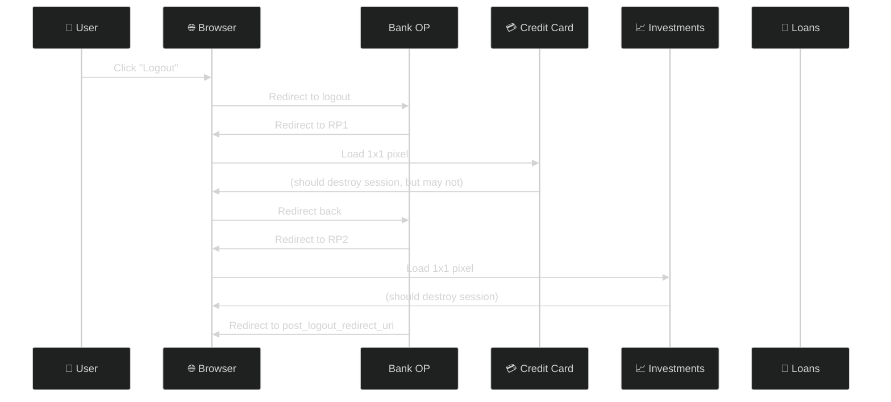
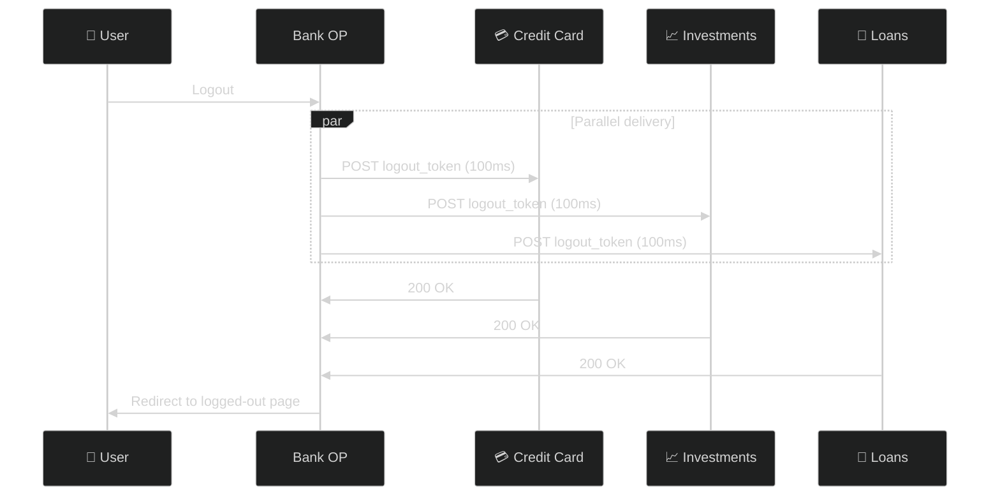
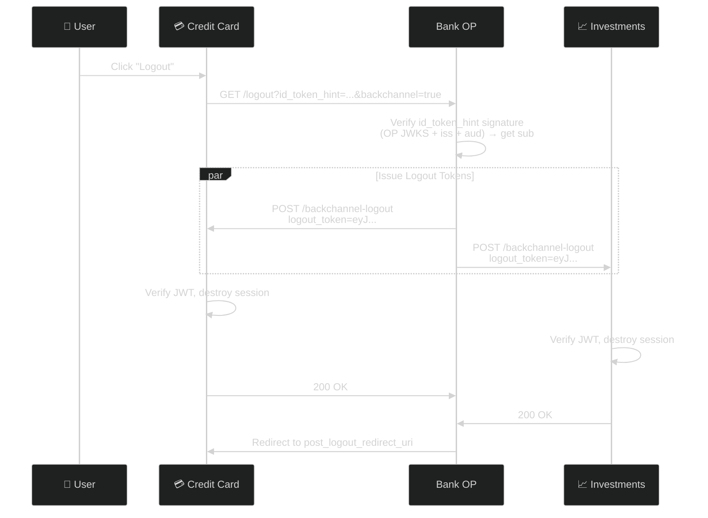
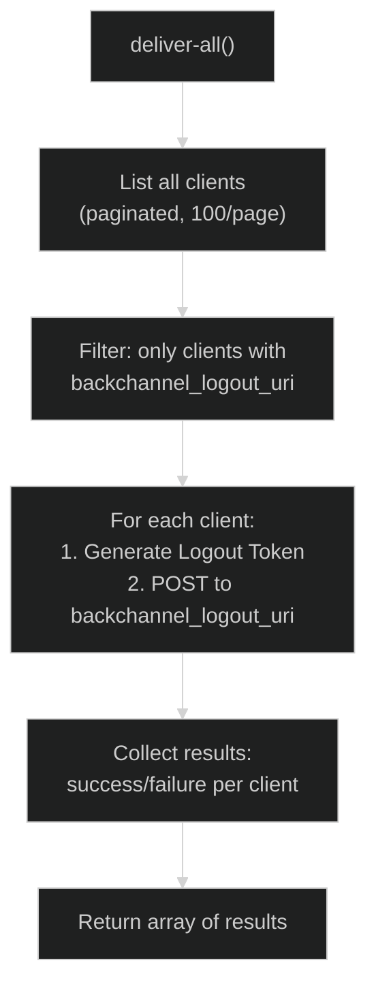
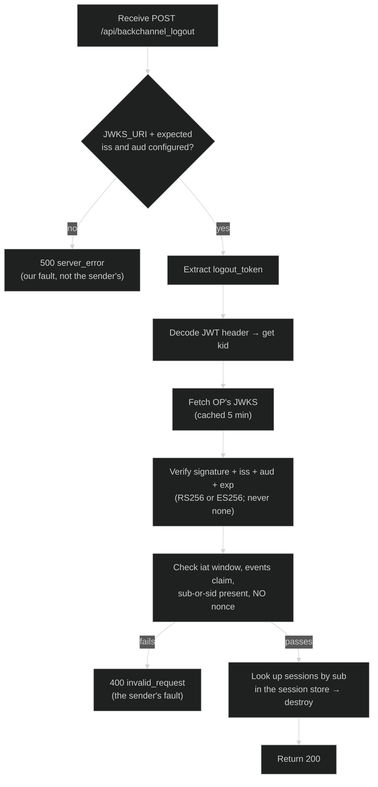
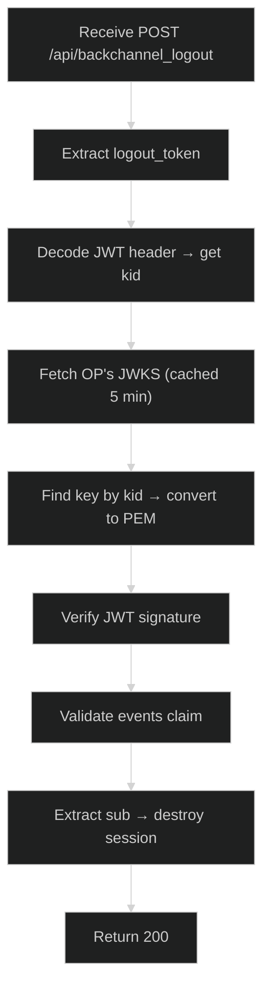

# OpenID Connect Back-Channel Logout 1.0

> **The short version:** Back-Channel Logout lets an OpenID Provider notify all Relying Parties that a user logged out — via direct server-to-server HTTP POST, not browser redirects. Faster, more reliable, and invisible to the user.

---

## Table of Contents

- [Part 1: Why Back-Channel Logout Exists](#part-1-why-back-channel-logout-exists)
- [Part 2: Front-Channel vs. Back-Channel](#part-2-front-channel-vs-back-channel)
- [Part 3: The Logout Token](#part-3-the-logout-token)
- [Part 4: How It Works](#part-4-how-it-works)
- [Part 5: Authlete Setup](#part-5-authlete-setup)
- [Part 6: Server Implementation](#part-6-server-implementation)
- [Part 7: Testing with curl](#part-7-testing-with-curl)
- [Part 8: Receiving Logout Tokens](#part-8-receiving-logout-tokens)
- [Part 9: Security Hardening](#part-9-security-hardening)
- [Part 10: Error Scenarios](#part-10-error-scenarios)
- [Part 11: Troubleshooting](#part-11-troubleshooting)
- [Appendix: Server Architecture](#appendix-server-architecture)

---

## Part 1: Why Back-Channel Logout Exists

### The Problem: Front-Channel Logout is Fragile

Imagine a user logs out from their bank's main app. The bank has 5 other apps (credit card, investments, loans, etc.) that all need to log out too. Front-Channel Logout tries to do this through browser redirects:



| Problem | What Happens |
|---------|-------------|
| **Browser must complete chain** | If user closes tab mid-chain, some RPs never log out |
| **Sequential & slow** | Each redirect takes seconds — 5 RPs = 15+ seconds |
| **Visible to user** | Flickering, loading spinners, blank pages |
| **Blocked by privacy tools** | Ad blockers kill third-party iframes |
| **No confirmation** | RP renders 1x1 pixel — no way to verify delivery |

### The Solution: Server-to-Server

Back-Channel Logout bypasses the browser entirely:



### Before vs. After

| Aspect | Front-Channel | Back-Channel |
|--------|:------------:|:------------:|
| Delivery | Browser redirects | HTTP POST server-to-server |
| Speed | ~5-30 seconds | ~100ms |
| Reliability | Depends on browser | Guaranteed (HTTP retry) |
| User visible | Flickering/loading | Invisible |
| Ad blocker risk | High | None |
| Confirmation | None (1x1 pixel) | HTTP 200 |

---

## Part 2: Front-Channel vs. Back-Channel

### Visual Comparison

```
FRONT-CHANNEL:                          BACK-CHANNEL:
                                         OP ──POST──→ RP 1 ──200──→ OP
OP ──redirect──→ Browser ──→ RP 1       OP ──POST──→ RP 2 ──200──→ OP
  (1x1 pixel) ──→ Browser ──→ OP        OP ──POST──→ RP 3 ──200──→ OP
OP ──redirect──→ Browser ──→ RP 2       (all parallel, no browser)
  (1x1 pixel) ──→ Browser ──→ OP
OP ──redirect──→ Browser ──→ RP 3       Total time: ~100ms
  (1x1 pixel) ──→ Browser ──→ OP
Total time: ~5-30 seconds
```

### When to Use Which

| Scenario | Recommendation |
|----------|:--------------:|
| Multi-RP enterprise SSO | **Back-Channel** |
| Mobile apps (no browser) | **Back-Channel** |
| Simple single-RP setup | Front-Channel |
| Compliance requirement | Either (check spec) |
| Production multi-RP | **Back-Channel** |

---

## Part 3: The Logout Token

### What Is It?

A Logout Token is a JWT that tells an RP: "Please log out this user." It's signed by the OP so the RP can verify it's legitimate.

### Header

```json
{
  "alg": "ES256",
  "typ": "logout+jwt",
  "kid": "3TSs3E8v77qxPrHB5KCzwXctQj8IcAAltn18UafuOTs"
}
```

Key points:
- `typ` is `logout+jwt` (not `at+jwt` or `JWT`)
- `kid` identifies the signing key in the OP's JWKS

### Payload

```json
{
  "iss": "https://bank.example.com",
  "sub": "user123",
  "aud": "credit-card-app",
  "iat": 1778461562,
  "exp": 1778461682,
  "jti": "30a69ce7-144a-4179-b38b-132475d97ca8",
  "sid": "session_abc123",
  "events": {
    "http://schemas.openid.net/event/backchannel-logout": {}
  }
}
```

### Claims Reference

| Claim | Required | Description |
|-------|:--------:|-------------|
| `iss` | ✅ | Issuer — the OP's identifier |
| `sub` | ⚠️ | Subject — user to log out (required if `sid` absent) |
| `aud` | ✅ | Audience — the RP's client ID |
| `iat` | ✅ | Issued At |
| `exp` | ✅ | Expiration |
| `jti` | ✅ | JWT ID — replay protection |
| `sid` | ⚠️ | Session ID (required if `sub` absent) |
| `events` | ✅ | Must contain the backchannel-logout event |

### The `events` Claim

This is what makes it a Logout Token:

```json
{
  "events": {
    "http://schemas.openid.net/event/backchannel-logout": {}
  }
}
```

The empty object `{}` is required as the value.

### `sub` vs. `sid`

| Claim | Use When |
|-------|----------|
| `sub` | RP identifies users by subject |
| `sid` | RP manages sessions by session ID |
| Both | Maximum flexibility |

Rule: At least one of `sub` or `sid` MUST be present.

---

## Part 4: How It Works

### Complete Flow



### What Just Happened?

1. **User** clicked logout in the Credit Card app

2. **RP1** called the OP's logout endpoint with `backchannel=true`

3. **OP** *verified* the `id_token_hint` — signature against its own JWKS, plus `iss` and `aud` — and took
   `sub` from the verified payload to identify the user

4. **OP** issued Logout Tokens for **both** RP1 and RP2 — each with the same `sub` but different `aud`

5. **Each RP** verified the JWT signature, validated claims, and destroyed its local session

6. **OP** redirected the user to the logged-out page

### Key Insight: Parallel, Not Sequential

Unlike Front-Channel (browser redirect chain), Back-Channel sends all Logout Tokens in parallel. The OP doesn't wait for RP1 to finish before notifying RP2.

---

## Part 5: Authlete Setup

> **Version requirement:** Back-Channel Logout support requires Authlete **3.0.32 or later**.

### Service-Level Settings

In the [Authlete Console](https://console.authlete.com/):

| Setting | Location | Value |
|---------|----------|-------|
| Back-Channel Logout Supported | **Service Settings → Endpoints → Logout** | Enabled |
| Back-Channel Logout Session Supported | Same page | Enabled (recommended) |

### Client-Level Settings

For **each RP** that should receive Logout Tokens:

| Setting | Location | Value |
|---------|----------|-------|
| Back-Channel Logout URI | **Client Settings → Endpoints → Logout** | `https://rp.example.com/backchannel-logout` |
| Back-Channel Logout Session Required | Same page | Optional (requires `sid`) |

### Receiving Logout Tokens (as RP)

If your server needs to **receive** Logout Tokens from other OPs:

```bash
# In server/.env
JWKS_URI=https://your-op.example.com/.well-known/jwks.json
```

> **Important:** Authlete's `/api/{service-id}/backchannel/logout/token` API generates the Logout Token but does **not** automatically revoke the user's tokens. If token revocation is needed, call Authlete's revocation endpoint separately after delivering the Logout Token.

---

## Part 6: Server Implementation

### Two Roles

| Role | What It Does | Endpoints |
|------|-------------|-----------|
| **As OP** | Issues and delivers Logout Tokens | `/api/backchannel_logout/{issue,deliver,deliver-all}` |
| **As RP** | Receives and verifies Logout Tokens | `POST /api/backchannel_logout` |

### As OP: Three Operations

| Endpoint | Purpose | Auth Required |
|----------|---------|:-------------:|
| `POST /api/backchannel_logout/issue` | Generate Logout Token (don't deliver) | Admin Basic |
| `POST /api/backchannel_logout/deliver` | Generate + deliver to one RP | Admin Basic |
| `POST /api/backchannel_logout/deliver-all` | Generate + deliver to all RPs | Admin Basic |

### Deliver-All Algorithm



### As RP: Verification Process



**Three things in that diagram are worth pausing on.**

**The configuration gate comes first.** If this server cannot check a signature, it must not render any
verdict on the token — not even a true one about a missing claim. Answering "your token is malformed" while
unable to accept a well-formed one would be an accident of ordering, not an assessment. So unconfigured is a
`500`, and it is `500` before the token is read at all.

**`iss` and `aud` are not free.** `jwt.verify` checks `exp` by default but checks neither `iss` nor `aud`
unless you pass them. A signature answers *who signed this*; it never answers *were they allowed to say it*
or *was this addressed to me*. Until 2026-08-13 this endpoint passed only `algorithms`, so any OP whose key
sat in the configured JWKS could log out any subject.

**Sessions are found by `sub`, not by the request.** A back-channel logout is a server-to-server POST with no
browser cookie, so `req.session` belongs to the *sending OP's* server. Destroying it — which is what this code
did — ends nothing and still returns `200`, so the OP believes the user was logged out. That is the worst
shape a security bug can take: silent success.

### Important: Raw Fetch (Not SDK)

The Authlete TypeScript SDK (pinned to **v1.0.0** — see `AGENTS.md` on why the numerically-higher 1.1.x releases are *older* code) **does not** expose the Back-Channel Logout API. The server uses raw `fetch()`; it is now the **only** service that does, since `health.service.ts` moved to the SDK.

**Two different auth methods are in play:**

| Layer | Auth Method | Credentials |
|-------|-------------|-------------|
| **Our server's endpoints** (`/api/backchannel_logout/*`) | Basic auth | `MGMT_CLIENT_ID` / `MGMT_CLIENT_SECRET` |
| **Authlete API** (`/api/{serviceId}/backchannel/logout/token`) | Bearer token | Service Access Token |

**And the receiving endpoint needs three settings of its own**, because there this server is the RP:

| Variable | Meaning |
|---|---|
| `JWKS_URI` | where the *other* OP publishes the keys its logout tokens are signed with |
| `BACKCHANNEL_LOGOUT_ISSUER` | that OP's issuer identifier — the expected `iss` |
| `BACKCHANNEL_LOGOUT_AUDIENCE` | **this** deployment's `client_id` at that OP — the expected `aud` |

Not `JWT_ISSUER`: that describes tokens this server mints itself, and comparing an incoming token against our
own identity would pass nothing legitimate. None of the three is set in this deployment, so the endpoint
answers `500` — honestly, rather than pretending every token is malformed.

---

## Part 7: Testing with curl

### Prerequisites

- Server running on `http://localhost:3000`
- Admin credentials (`MGMT_CLIENT_ID` / `MGMT_CLIENT_SECRET`)
- Client with `backchannel_logout_uri` configured

### Issue a Logout Token

```bash
curl -X POST http://localhost:3000/api/backchannel_logout/issue \
  -H "Content-Type: application/json" \
  -H "Authorization: Basic $(echo -n 'MGMT_ID:MGMT_SECRET' | base64)" \
  -d '{
    "clientIdentifier": "YOUR_CLIENT_ID",
    "subject": "user123",
    "sessionId": "session_abc123"
  }'
```

**Response:**
```json
{
  "action": "OK",
  "logoutToken": "eyJhbGciOiJFUzI1NiIs...",
  "backchannelLogoutUri": "https://rp.example.com/backchannel-logout"
}
```

### Issue + Deliver to One RP

```bash
curl -X POST http://localhost:3000/api/backchannel_logout/deliver \
  -H "Content-Type: application/json" \
  -H "Authorization: Basic $(echo -n 'MGMT_ID:MGMT_SECRET' | base64)" \
  -d '{
    "clientIdentifier": "YOUR_CLIENT_ID",
    "subject": "user123",
    "sessionId": "session_abc123"
  }'
```

**Response:**
```json
{
  "clientId": "YOUR_CLIENT_ID",
  "success": true,
  "statusCode": 200,
  "backchannelLogoutUri": "https://rp.example.com/backchannel-logout"
}
```

### Deliver to All RPs

```bash
curl -X POST http://localhost:3000/api/backchannel_logout/deliver-all \
  -H "Content-Type: application/json" \
  -H "Authorization: Basic $(echo -n 'MGMT_ID:MGMT_SECRET' | base64)" \
  -d '{"subject": "user123", "sessionId": "session_abc123"}'
```

**Response:**
```json
[
  {
    "clientId": "rp_1",
    "clientName": "Banking App",
    "success": true,
    "statusCode": 200
  },
  {
    "clientId": "rp_2",
    "clientName": "Credit Card App",
    "success": true,
    "statusCode": 200
  },
  {
    "clientId": "rp_3",
    "success": false,
    "error": "connect ECONNREFUSED"
  }
]
```

### RP-Initiated Logout with Backchannel

Logout is **two requests**. The `GET` renders the confirmation page RP-Initiated Logout 1.0 §2 requires;
the `POST` it submits is what delivers the Logout Tokens.

```bash
# Step 1 — get the confirmation page, keeping its cookie, and read the CSRF token out of it.
J=$(mktemp)
CSRF=$(curl -s -c "$J" "http://localhost:3000/api/logout" |
  sed -n 's/.*name="_csrf" value="\([^"]*\)".*/\1/p')

# Step 2 — submit it. This is the request that actually logs anybody out.
curl -s -b "$J" -X POST "http://localhost:3000/api/logout" \
  --data-urlencode "_csrf=${CSRF}" \
  --data-urlencode "id_token_hint=eyJhbGciOiJSUzI1NiIs..." \
  --data-urlencode "post_logout_redirect_uri=http://localhost:3000/logged-out" \
  --data-urlencode "state=xyz123" \
  --data-urlencode "client_id=YOUR_CLIENT_ID" \
  --data-urlencode "backchannel=true"
rm -f "$J"
```

The POST:
1. **Verifies** `id_token_hint` → gets `sub`
2. Delivers Logout Tokens to all RPs
3. Destroys local session
4. Redirects to `post_logout_redirect_uri`

> **Why the extra round trip (changed 2026-08-12).** §2 requires the OP to ask the End-User before ending
> the session, and asking is also what keeps a state-changing operation off a bare `GET` — while the `GET`
> did the work, an `` on any page logged the viewer out, which is a *forced* logout
> rather than an RP-initiated one. The CSRF token is single-use and the logout destroys the session holding
> it, so each POST needs its own preceding GET.

> **Why "verifies" and not "decodes" (changed 2026-08-11).** An `id_token_hint` is an ID Token — a *signed*
> assertion — so it says nothing about who the user is until the signature is checked. The server used to
> `jwt.decode` it and trust `sub`, which meant anyone could hand-craft an unsigned JWT naming any subject and
> use `backchannel=true` to force that user out of every RP. It now verifies against the OP's own JWKS and
> checks `iss`, plus `aud` when you pass `client_id`.
>
> **What you will see if the hint is rejected:** logout still succeeds — the session is destroyed, the
> redirect still happens — but **no Logout Tokens are delivered**, because the server has no subject to
> deliver for. Check the server log for `id_token_hint rejected` and a `reason`.
>
> Two reasons worth knowing about, because they are not your mistake:
>
> | `reason` | What it means |
> |---|---|
> | `unsupported_alg:HS256` | The client that issued the ID token signs with **HS256**, which is symmetric — the OP cannot verify it without that client's secret, so the hint is ignored. Use a client configured for `ES256`, or log out with a session cookie instead |
> | `no_expected_issuer` | The OP could not read its own `issuer` from discovery, so it refuses to check `iss` rather than skip the check |
>
> An **expired** hint is still accepted: a hint is an old token by definition, and the signature is what
> matters. The server logs `hintExpired: true` when that happens.

---

## Part 8: Receiving Logout Tokens

### When This Matters

Your server acts as an RP when it needs to receive Logout Tokens from **other** OpenID Providers. This happens when:
- Your app is a client of an external OP (Google, Azure AD, etc.)
- The external OP supports Back-Channel Logout
- You want to destroy sessions when users log out from the external OP

### Verification Flow



### Security Checks

| Check | Description |
|-------|-------------|
| JWT signature | Verified against OP's JWKS public keys |
| `events` claim | Must contain backchannel-logout event |
| `exp` claim | JWT must not be expired |
| Algorithm | Only RS256 and ES256 accepted |

---

## Part 9: Security Hardening

### 1. Guaranteed Delivery

Front-Channel relies on browser completing redirects. Back-Channel uses HTTP POST with retry — the OP knows exactly which RPs received the Logout Token.

### 2. No Browser Dependency

Ad blockers, tracking protection, and privacy settings can block iframes. Back-Channel is pure server-to-server.

### 3. Invisible to User

No flickering, no loading spinners. Logout happens silently in the background.

### 4. Cryptographic Verification

Each Logout Token is a signed JWT. The RP verifies the signature using the OP's JWKS.

### 5. Replay Protection

The `jti` claim provides uniqueness. The RP should track seen `jti` values and reject duplicates.

### Security Comparison

| Attack Vector | Front-Channel | Back-Channel |
|--------------|:------------:|:------------:|
| Forged logout | Harder (browser) | JWT signature prevents |
| Replay attack | No protection | `jti` + `exp` |
| Token leakage in URL | Possible | Impossible (POST body) |
| Blocked by ad blockers | Yes | No |
| Timing attacks | Slow (sequential) | Fast (parallel) |

---

## Part 10: Error Scenarios

### Missing `logout_token`

```http
HTTP/1.1 400 Bad Request
{"error": "invalid_request", "error_description": "Missing logout_token"}
```

### Invalid Logout Token

```http
HTTP/1.1 400 Bad Request
{"error": "invalid_request", "error_description": "Invalid logout token"}
```

### Missing Events Claim

```http
HTTP/1.1 400 Bad Request
{"error": "invalid_request", "error_description": "Token is not a backchannel logout token"}
```

### Signature Verification Failed

```http
HTTP/1.1 400 Bad Request
{"error": "invalid_request", "error_description": "Invalid logout token"}
```

### Client Has No `backchannel_logout_uri`

```json
{
  "clientId": "client_1",
  "success": false,
  "error": "Client has no backchannelLogoutUri configured"
}
```

### RP Not Reachable

```json
{
  "clientId": "client_1",
  "success": false,
  "error": "connect ECONNREFUSED 127.0.0.1:443"
}
```

---

## Part 11: Troubleshooting

| Problem | Cause | Solution |
|---------|-------|----------|
| Deliver-all returns empty array | No clients with `backchannel_logout_uri` | Configure in Authlete Console |
| Signature verification fails | `JWKS_URI` not set | Set `JWKS_URI` in `server/.env` |
| Backchannel not triggered | Missing `backchannel=true` | Add `&backchannel=true` to logout URL |
| No `sid` in Logout Token | `backchannelLogoutSessionSupported` disabled | Enable in Authlete Console |
| Clients not receiving tokens | `backchannel_logout_uri` misconfigured | Verify in Authlete Console |
| 401 on `/api/backchannel_logout/*` | Missing admin auth header | Include `Authorization: Basic` header |
| Authlete API returns 500 | Authlete version < 3.0.32 | Upgrade Authlete service to 3.0.32+ |
| Logout Token has no `sid` claim | `backchannelLogoutSessionRequired` not enabled on client | Enable in Authlete Console client settings |
| RP rejects Logout Token | RP expects `sid` but OP doesn't include it | Enable `backchannelLogoutSessionSupported` at service level |
| Tokens not revoked after logout | Authlete doesn't auto-revoke | Call Authlete revocation endpoint separately |

---

## Appendix: Server Architecture

### Route Map

```
POST /api/backchannel_logout/issue      → Issue Logout Token
POST /api/backchannel_logout/deliver    → Issue + deliver to one RP
POST /api/backchannel_logout/deliver-all → Issue + deliver to all RPs
POST /api/backchannel_logout            → Receive incoming Logout Token
GET  /api/logout                        → RP-Initiated Logout, confirmation page (§2)
POST /api/logout  (backchannel=true)    → RP-Initiated Logout with backchannel
```

### Files

| File | Role |
|------|------|
| `server/src/services/backchannel-logout.service.ts` | Authlete REST API wrapper (raw fetch) |
| `server/src/controllers/backchannel-logout.controller.ts` | Issue/deliver/deliver-all controllers |
| `server/src/controllers/logout.controller.ts` | Incoming Logout Token handler |
| `server/src/services/logout.service.ts` | RP-Initiated Logout with backchannel |
| `client/src/components/oidc/BackchannelLogoutSection.tsx` | SPA testing UI |

### Dependencies

```
backchannel-logout.service.ts
  └── Authlete REST API (raw fetch — SDK v1.1.6 doesn't expose this)

logout.controller.ts
  ├── jwt.decode() + jwt.verify()
  ├── JwksClient (cached JWKS fetch)
  └── req.session.destroy()

logout.service.ts
  └── backchannel-logout.service.ts (for deliver-all)
```

---

## Summary

Back-Channel Logout is simple but powerful:

1. **User** logs out
2. **OP** issues Logout Tokens for all RPs
3. **OP** sends tokens via HTTP POST (parallel)
4. **Each RP** verifies JWT, destroys session
5. **User** sees clean logout page

**Use Back-Channel when:**
- Multiple RPs need to log out simultaneously
- Speed and reliability matter
- Users are on mobile apps (no browser)
- Compliance requires guaranteed delivery

**Don't use Back-Channel when:**
- Single RP setup (Front-Channel is simpler)
- No server infrastructure (static SPAs)

---

## References

- [OpenID Connect Back-Channel Logout 1.0](https://openid.net/specs/openid-connect-backchannel-1_0.html)
- [OIDC Core §12 (Logout)](https://openid.net/specs/openid-connect-core-1_0.html#Logout)
- [Authlete: Back-Channel Logout API](https://developers.authlete.com/protocols-and-flows/protocol-extensions/openid-connect-back-channel-logout-1-0) — Logout Token generation, metadata, and configuration
- [Authlete: Service Configuration](https://developers.authlete.com/configuration-reference/service-settings/service-management.md) — `backchannelLogoutSupported`, `backchannelLogoutSessionSupported` settings
