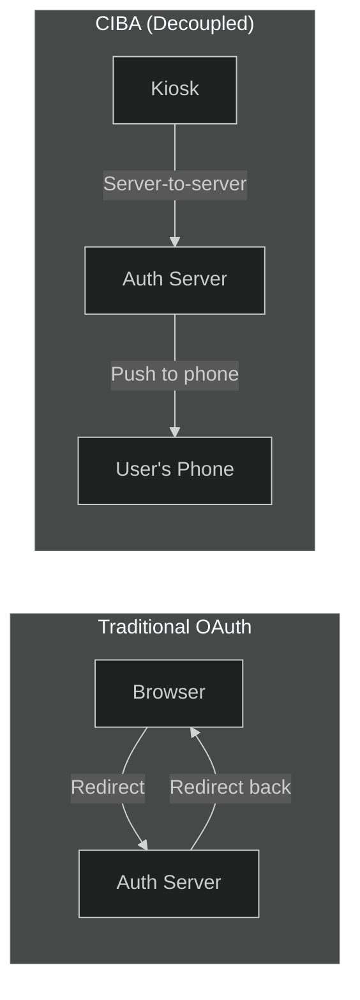
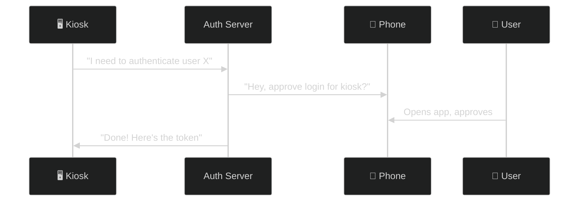
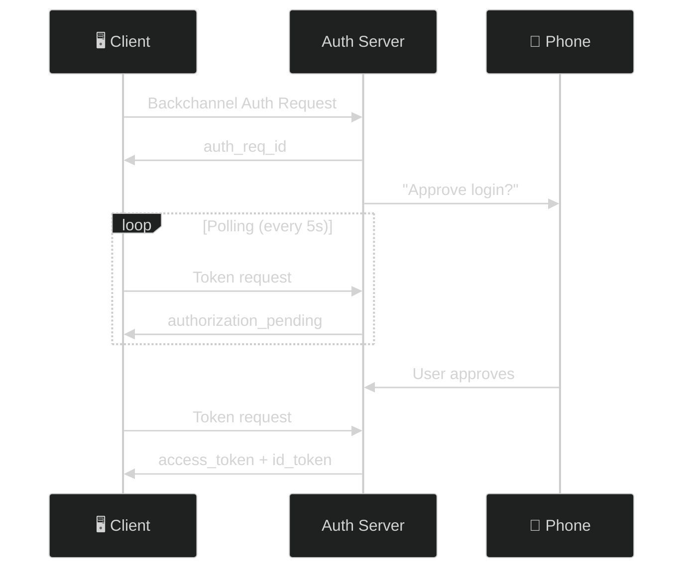
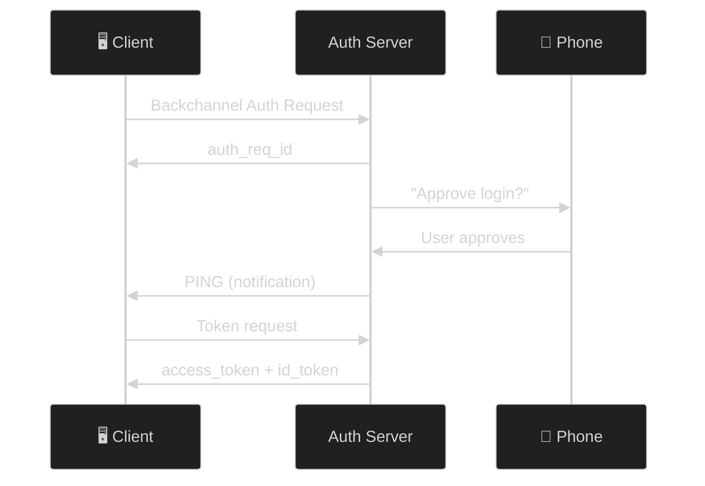
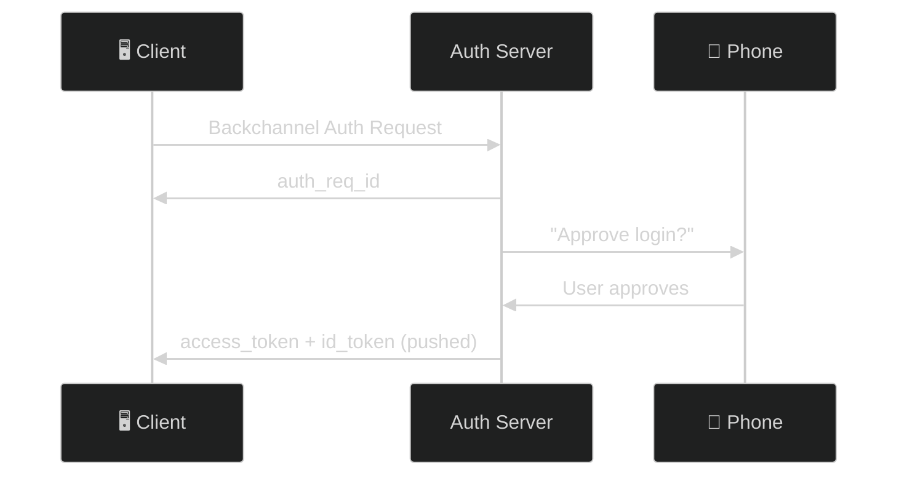
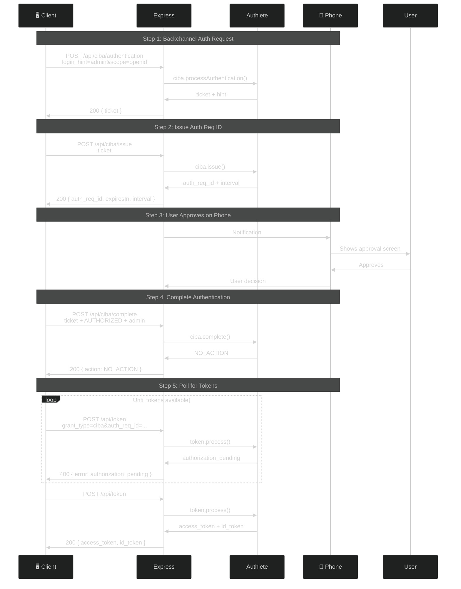

# CIBA (Client-Initiated Backchannel Authentication)

> **The short version:** CIBA lets a device (like a POS terminal or call center screen) initiate authentication without a browser redirect. The user approves on their own phone, and the device gets tokens via server-side polling.

> ### How the transcripts below were verified, and the one thing CIBA Core requires that this server does not do
>
> Labels are **captured** / *illustrative* / **`UNVERIFIED`** — defined once in
> [the tutorial index](README.md#how-to-read-the-transcripts-in-these-tutorials).
>
> **The POLL flow runs here, on one client.** `bcDeliveryMode = POLL` was set on client `1523514379` on
> 2026-08-12 and the full sequence was run end to end that day: `USER_IDENTIFICATION` → `authReqId`
> (`expiresIn 600`, `interval 5`) → `authorization_pending` (**400**) → `complete` → `NO_ACTION` → access
> token + ID token → replay refused with `invalid_grant`. Transcript in
> [`modules/09a…/lab.md` 3d](curriculum/modules/09a-interaction-extensions/lab.md). Re-checked 2026-08-14:
> **the other three clients still have no `bcDeliveryMode`**, and a client without one is refused with
> `[A169301]` no matter how correct the request is. That is the field to check first.
>
> Values in the request/response blocks below are *illustrative* (`ticket-abc123`, `YOUR_CID`); the shapes
> and the numbers are real — `expiresIn: 600` and `interval: 5` are the service's
> `backchannelAuthReqIdDuration` and `backchannelPollingInterval`.
>
> ### ⚠️ These are Authlete-shaped debug endpoints, not a conformant CIBA backchannel endpoint
>
> Two departures from [CIBA Core 1.0](https://openid.net/specs/openid-client-initiated-backchannel-authentication-core-1_0.html),
> both open findings rather than simplifications:
>
> | | CIBA Core requires | This server does |
> |---|---|---|
> | the request | §7.1 — a **form-encoded** POST whose parameters are `login_hint`, `scope`, `binding_message` … at the top level | a **JSON** body with those parameters packed into one URL-encoded `parameters` string, plus `clientId`/`clientSecret` |
> | the response | §7.3 — `auth_req_id`, `expires_in` and `interval` from **the backchannel endpoint itself** | `ticket` — Authlete's internal handle. The `auth_req_id` arrives only after a **second** call, to `/api/ciba/issue` |
>
> **So a conformant CIBA client cannot talk to `/api/ciba/authentication` at all**, and the two-call split is
> this server's shape, not the protocol's. Everything about *why* CIBA exists and how the poll loop behaves
> transfers; the wire format does not. And note `POST /api/ciba/issue` **authenticates nobody** — it takes a
> `ticket` and nothing else — which is only tolerable because it is a lab surface.

---

## Table of Contents

- [Quick Start](#quick-start)
- [Part 1: What is CIBA?](#part-1-what-is-ciba)
- [Part 2: Authlete Setup](#part-2-authlete-setup)
- [Part 3: Delivery Modes](#part-3-delivery-modes)
- [Part 4: Step-by-Step Flow](#part-4-step-by-step-flow)
- [Part 5: SPA Testing Tool](#part-5-spa-testing-tool)
- [Part 6: Failure Demonstrations](#part-6-failure-demonstrations)
- [Part 7: Troubleshooting](#part-7-troubleshooting)
- [Appendix: Server Architecture](#appendix-server-architecture)

---

## Quick Start

Get a working CIBA POLL flow in 5 minutes.

### 1. Enable CIBA in Authlete

| Setting | Path | Value |
|---------|------|-------|
| Supported Backchannel Token Delivery Modes | **Service Settings → Endpoints → CIBA** | Check `POLL` |
| Backchannel Authentication Endpoint | Same page | `http://localhost:3000/api/ciba/authentication` |
| Auth Req ID Duration | Same page | `600` (10 minutes) |
| Polling Interval | Same page | `5` (seconds) |

### 2. Create a Client

1. **Clients → Create** → Client Type: `Confidential`
2. Token Auth Method: `CLIENT_SECRET_BASIC`
3. CIBA tab → Token Delivery Mode: `POLL`
4. Save and note `clientId` and `clientSecret`

### 3. Start Servers

```bash
npm --prefix server run dev
npm --prefix client run dev
```

### 4. Test in SPA

1. Open `http://localhost:3001` → **CIBA** in sidebar
2. **Authentication tab**: `login_hint=admin&scope=openid` + credentials → **Run**
3. **Issue tab**: **Run** (ticket auto-filled)
4. **Complete tab**: **Run** (defaults: `AUTHORIZED`, subject `admin`)
5. **Poll Token tab**: **Poll Token** → tokens

---

## Part 1: What is CIBA?

### The Problem: No Browser Redirect

Imagine you're at a hotel check-in kiosk. You need to sign in, but:
- Typing your password on a shared touchscreen is risky
- The kiosk can't redirect to your bank's login page
- You're holding your phone, which has your banking app



### The Solution: Decouple the Flow

CIBA splits the "consumption device" (kiosk) from the "authentication device" (phone):



### When to Use CIBA

| Scenario | Use CIBA? | Why |
|----------|:---------:|-----|
| Call center authentication | **Yes** | Operator on desktop, user on phone |
| POS terminal | **Yes** | Payment app on user's phone |
| Smart TV | **Yes** | No keyboard for password entry |
| ATM/Banking | **Yes** | Approve transaction on banking app |
| SPA with browser | **No** | Standard OAuth works fine |

### Three Delivery Modes

| Mode | How It Works | Best For |
|------|-------------|----------|
| **POLL** | Device polls server for tokens | Simplest, no push infrastructure |
| **PING** | Server pings device, then device polls | Moderate real-time needs |
| **PUSH** | Server pushes tokens directly to device | Lowest latency |

---

## Part 2: Authlete Setup

### Service-Level Configuration

In the [Authlete Console](https://console.authlete.com/), configure your service:

**Step 1: Enable CIBA grant type**

| Tab | Setting | Value |
|-----|---------|-------|
| Endpoints → Global Settings | Supported Grant Types | Enable `CIBA` |

**Step 2: Configure CIBA endpoint and parameters**

| Tab | Setting | Value |
|-----|---------|-------|
| Endpoints → CIBA | Supported Backchannel Token Delivery Modes | Check `POLL` (and `PING`/`PUSH` if needed) |
| Endpoints → CIBA | Backchannel Authentication Endpoint | `http://localhost:3000/api/ciba/authentication` |
| Endpoints → CIBA | Auth Req ID Duration | `600` (10 minutes) |
| Endpoints → CIBA | Polling Interval | `5` (seconds) |

**Step 3: Enable CLIENT_SECRET_BASIC**

| Tab | Setting | Value |
|-----|---------|-------|
| Endpoints → Token | Supported Client Authentication Methods | Enable `CLIENT_SECRET_BASIC` |

> **Critical Rule:** The client authentication method at the backchannel authentication endpoint **must be the same** as at the token endpoint. Both endpoints must use the same method. See [Authlete CIBA Guide §2.2](https://developers.authlete.com/guides/flows-and-protocols/grant-types-and-token-flows/how-to-implement-ciba-with-authlete).

### Client-Level Configuration

| Tab | Setting | Value | Why |
|-----|---------|-------|-----|
| Basic | Client Type | `Confidential` | CIBA requires confidential clients |
| Endpoints → Token | Client Authentication Method | `CLIENT_SECRET_BASIC` | Must match service's supported methods |
| CIBA | Token Delivery Mode | `POLL` | Start simple (no notification endpoint needed) |
| CIBA | Notification Endpoint | *(leave empty for POLL)* | Required only for PING/PUSH modes |
| CIBA | User Code Required | `Not Required` | Simplify initial testing |

> **Why CLIENT_SECRET_BASIC?** Authlete's own [CIBA implementation guide](https://developers.authlete.com/guides/flows-and-protocols/grant-types-and-token-flows/how-to-implement-ciba-with-authlete) uses `client_secret_basic` exclusively. The client sends credentials via `Authorization: Basic` header, not in the request body. This is also more secure — RFC 6749 states authorization servers SHOULD prefer Basic auth over POST.

### Verify Configuration

```bash
curl http://localhost:3000/api/.well-known/openid-configuration | jq '.backchannel_authentication_endpoint'
```

---

## Part 3: Delivery Modes

### POLL Mode (Simplest)

The client polls the token endpoint until tokens are available.



**Pros:** Simple, no push infrastructure needed
**Cons:** Higher latency (poll interval)

### PING Mode

Server sends a lightweight notification when auth completes.



**Pros:** No unnecessary polling
**Cons:** Requires notification endpoint

### PUSH Mode

Server pushes tokens directly to client.



**Pros:** Lowest latency
**Cons:** Requires notification endpoint + token handling

### Mode Comparison

| Feature | POLL | PING | PUSH |
|---------|:----:|:----:|:----:|
| Notification endpoint | No | Yes | Yes |
| Client polls | Yes | Yes | No |
| Latency | Highest | Medium | Lowest |
| Complexity | Lowest | Medium | Highest |

---

## Part 4: Step-by-Step Flow

### Complete POLL Mode Flow



### What Just Happened?

1. **Client** told the server: "I need to authenticate user X (hint: `admin`)"

2. **Authlete** validated the request and returned a `ticket` — an opaque identifier for this flow

3. **Server** issued an `auth_req_id` — what the client uses to poll for tokens

4. **User** approved on their phone

5. **Client** called `complete` to record the approval

6. **Client** polled the token endpoint until tokens were available

### API Endpoints

| Endpoint | Method | Purpose | Auth Required |
|----------|--------|---------|:-------------:|
| `/api/ciba/authentication` | POST | Start CIBA flow | Client creds |
| `/api/ciba/issue` | POST | Get `auth_req_id` | No |
| `/api/ciba/complete` | POST | Record approval | No |
| `/api/ciba/fail` | POST | Record denial | No |
| `/api/token` | POST | Exchange for tokens | Client creds |

### Request/Response Examples

**Step 1: Authentication Request**

> ### ⚠️ Which channel you put the credentials on decides whether this works
>
> `/api/ciba/authentication` reads client credentials from **three** places, and Authlete checks the channel
> against the client's registered `tokenAuthMethod` — so the channel is not a style choice. The rules are
> identical to `/api/par`'s:
>
> | You send | Serves | Against a `CLIENT_SECRET_BASIC` client |
> |---|---|---|
> | `Authorization: Basic` | `client_secret_basic` | ✅ reaches `USER_IDENTIFICATION` |
> | body `clientId` + `clientSecret` | `client_secret_post` | ❌ **`401 [A157357]`**, even with the *correct* secret |
> | body `clientId` alone | `none` (public client) | ❌ 401 |
>
> **This matters here specifically**: Part 2 recommends `CLIENT_SECRET_BASIC` — following Authlete's own CIBA
> guide, and because the backchannel and token endpoints must use the same method — and the one client on
> this deployment with `bcDeliveryMode` set is exactly that. So the body-credential form below will 401
> against it. Both channels verified live 2026-08-13.

For a `CLIENT_SECRET_BASIC` client — the configuration Part 2 recommends:

```bash
curl -X POST http://localhost:3000/api/ciba/authentication \
  -u "YOUR_CID:YOUR_SEC" \
  -H "Content-Type: application/json" \
  -d '{
    "parameters": "login_hint=admin&scope=openid&binding_message=Approve+kiosk+login"
  }'
```

For a `CLIENT_SECRET_POST` client, the same request with the credentials in the body instead:

```bash
curl -X POST http://localhost:3000/api/ciba/authentication \
  -H "Content-Type: application/json" \
  -d '{
    "parameters": "login_hint=admin&scope=openid&binding_message=Approve+kiosk+login",
    "clientId": "YOUR_CID",
    "clientSecret": "YOUR_SEC"
  }'
```

**Response:**
```json
{
  "action": "USER_IDENTIFICATION",
  "ticket": "ticket-abc123",
  "hintType": "LOGIN_HINT",
  "hint": "admin",
  "deliveryMode": "POLL",
  "scopes": [{"name": "openid"}],
  "clientName": "My Client"
}
```

**Step 2: Issue Auth Req ID**

```bash
curl -X POST http://localhost:3000/api/ciba/issue \
  -H "Content-Type: application/json" \
  -d '{"ticket": "ticket-abc123"}'
```

**Response:**
```json
{
  "action": "OK",
  "authReqId": "auth_req_id_xyz789",
  "expiresIn": 600,
  "interval": 5
}
```

**Step 3: Complete (User Approved)**

```bash
curl -X POST http://localhost:3000/api/ciba/complete \
  -H "Content-Type: application/json" \
  -d '{"ticket": "ticket-abc123", "result": "AUTHORIZED", "subject": "admin"}'
```

**Response:**
```json
{
  "action": "NO_ACTION"
}
```

**Step 4: Poll for Tokens**

```bash
curl -X POST http://localhost:3000/api/token \
  -u "YOUR_CID:YOUR_SEC" \
  -d "grant_type=urn:openid:params:grant-type:ciba&auth_req_id=auth_req_id_xyz789"
```

**While pending** — note the status, which is the part people get wrong:
```
HTTP/1.1 400 Bad Request

{"error": "authorization_pending", "error_description": "[A...] ...", "error_uri": "..."}
```

> **`authorization_pending` is a 400, and that is by design** — CIBA Core §11 makes a pending request an
> *error* response, the same convention RFC 8628's device flow uses. **A polling loop must not treat 400 as
> terminal.** Confirmed by the 2026-08-12 run.
>
> **`UNVERIFIED` — the exact `error_description` text, and deliberately staying so.** The `error` value is
> spec-defined and stable; the description is Authlete's, carries a bracketed `[A...]` code, and changes
> between versions. Run it if you need the string. **Do not parse it** — which is why capturing it here was
> reviewed on 2026-08-17 and declined: a printed vendor string rots silently and invites exactly the parsing
> this line warns against.

**On success** — shape **captured 2026-08-12**:
```json
{
  "access_token": "eyJraWQ...",
  "token_type": "Bearer",
  "expires_in": 86400,
  "id_token": "eyJraWQ..."
}
```

`expires_in` is the service's `accessTokenDuration`, **86400** — not the 3600 this block used to show. A
24-hour token for a kiosk authorization is far too long for production; it is deliberate here so lab tokens
outlive a lab session.

---

## Part 5: SPA Testing Tool

### Accessing CIBA

1. Start servers
2. Open `http://localhost:3001`
3. Click **CIBA** in sidebar

### Five Tabs

| Tab | Purpose | Key Fields |
|-----|---------|------------|
| **Authentication** | Start CIBA flow | Parameters, Client ID, Secret |
| **Issue** | Get `auth_req_id` | Ticket (auto-filled) |
| **Fail** | Record denial | Ticket, Reason |
| **Complete** | Record approval | Ticket, Result, Subject |
| **Poll Token** | Get tokens | `auth_req_id` (auto-filled) |

### Testing Workflow

1. **Authentication**: `login_hint=admin&scope=openid` → **Run** → get `ticket`
2. **Issue**: **Run** → get `auth_req_id`
3. **Complete**: **Run** (defaults: `AUTHORIZED`, `admin`)
4. **Poll Token**: **Poll Token** → get tokens

> **Note:** The SPA doesn't poll automatically. Click **Poll Token** manually after each interval.

---

## Part 6: Failure Demonstrations

> **`UNVERIFIED` bodies, and one demo that proves less than it looks like.** The statuses below are the
> controller's documented mapping (see [the Appendix](#action-to-status-mapping)); the response *bodies* are
> abbreviated rather than captured, so treat `action` as the reliable field.
>
> **"Wrong Client Secret" is ambiguous against a `CLIENT_SECRET_BASIC` client** — which is the only kind
> that can run CIBA on this deployment. Body credentials earn `401 [A157357]` there whether the secret is
> right or wrong, because the *channel* is refused before the secret is examined. To demonstrate a genuinely
> wrong secret, send it on the channel the client is registered for: `-u "YOUR_CID:wrong_secret"`. **A
> negative test that passes for the wrong reason is not a test** — read the bracketed code, not the status.

### No Client Credentials

```bash
curl -X POST http://localhost:3000/api/ciba/authentication \
  -H "Content-Type: application/json" \
  -d '{"parameters": "login_hint=admin&scope=openid"}'
```

**Response:**
```json
HTTP/1.1 401 Unauthorized
{
  "action": "UNAUTHORIZED",
  "responseContent": "..."
}
```

### Wrong Client Secret

```bash
curl -X POST http://localhost:3000/api/ciba/authentication \
  -H "Content-Type: application/json" \
  -d '{
    "parameters": "login_hint=admin&scope=openid",
    "clientId": "YOUR_CID",
    "clientSecret": "wrong_secret"
  }'
```

**Response:**
```json
HTTP/1.1 401 Unauthorized
{
  "action": "UNAUTHORIZED"
}
```

### Unknown User

```bash
curl -X POST http://localhost:3000/api/ciba/authentication \
  -H "Content-Type: application/json" \
  -d '{
    "parameters": "login_hint=nonexistent&scope=openid",
    "clientId": "YOUR_CID",
    "clientSecret": "YOUR_SEC"
  }'
```

Then call fail:
```bash
curl -X POST http://localhost:3000/api/ciba/fail \
  -H "Content-Type: application/json" \
  -d '{"ticket": "YOUR_TICKET", "reason": "UNKNOWN_USER_ID"}'
```

**Response:**
```json
HTTP/1.1 403 Forbidden
{
  "action": "FORBIDDEN"
}
```

### Security Summary

| Attack | Protected By | Result |
|--------|-------------|:------:|
| No client auth | Authlete requires credentials | ❌ Blocked |
| Wrong secret | Authlete validates | ❌ Blocked |
| Unknown user | Hint-based identification fails | ❌ Blocked |
| Public client | Authlete rejects | ❌ Blocked |

---

## Part 7: Troubleshooting

| Problem | Cause | Solution |
|---------|-------|----------|
| "Missing required field: parameters" | `parameters` not in body | Add `"parameters": "login_hint=admin&scope=openid"` |
| 401 on authentication | Wrong credentials | Check `clientId`/`clientSecret` |
| "No user found with given hint" | Unknown `login_hint` | Use valid user (default: `admin`) |
| `auth_req_id` expires | Too slow to poll | Increase `backchannelAuthReqIdDuration` |
| "authorization_pending" forever | `complete` not called | Call `POST /api/ciba/complete` with `AUTHORIZED` |
| "slow_down" | Polling too fast | Wait `interval` seconds between polls |
| "INVALID_TICKET" | Ticket used/expired | Get fresh ticket from authentication |
| "CIBA not enabled" | Service not configured | Enable CIBA in Authlete Service Settings → Global Settings → Supported Grant Types |
| Token endpoint returns 401 for polling | Client auth method mismatch | Client must use the same auth method configured in Authlete. If configured as `CLIENT_SECRET_BASIC`, use `-u "cid:secret"` (Basic auth), not `client_id`/`client_secret` in body |
| Backchannel auth returns 401 | Wrong credentials or auth method | Verify `clientId`/`clientSecret` match Authlete client settings. For `CLIENT_SECRET_BASIC`, credentials go in `Authorization: Basic` header |
| PING/PUSH: `NOTIFICATION` action | Caller must deliver | Send `responseContent` to notification endpoint |

---

## Appendix: Server Architecture

### Files

| File | Role |
|------|------|
| `server/src/services/ciba.service.ts` | Authlete SDK wrapper |
| `server/src/controllers/ciba.controller.ts` | Request handling |
| `server/src/routes/ciba.routes.ts` | Route definitions |
| `client/src/services/ciba.service.ts` | Client API calls |
| `client/src/components/oidc/CibaSection.tsx` | SPA testing UI |

### Authlete SDK Mapping

| Express Endpoint | Authlete Method |
|-----------------|----------------|
| `POST /api/ciba/authentication` | `ciba.processAuthentication()` |
| `POST /api/ciba/issue` | `ciba.issue()` |
| `POST /api/ciba/fail` | `ciba.fail()` |
| `POST /api/ciba/complete` | `ciba.complete()` |

### Action-to-Status Mapping

| Endpoint | Action | HTTP Status |
|----------|--------|:-----------:|
| Authentication | `USER_IDENTIFICATION` | 200 |
| Authentication | `UNAUTHORIZED` | 401 |
| Issue | `OK` | 200 |
| Issue | `INVALID_TICKET` | 400 |
| Fail | `FORBIDDEN` | 403 |
| Complete | `NO_ACTION` | 200 (POLL) |
| Complete | `NOTIFICATION` | 200 (PING/PUSH) |

---

## Summary

CIBA is simple:

1. **Client** sends backchannel auth request → gets `ticket`
2. **Server** issues `auth_req_id` for polling
3. **User** approves on phone
4. **Client** calls `complete` with approval
5. **Client** polls token endpoint → gets tokens

**Use CIBA when:**
- No browser redirect possible
- User has a separate authentication device
- Need server-side authentication (call center, POS)

**Don't use CIBA when:**
- Standard OAuth works (SPA, mobile app)

---

## References

- [CIBA Core 1.0](https://openid.net/specs/openid-client-initiated-backchannel-authentication-core-1_0.html)
- [Authlete: How to Implement CIBA](https://developers.authlete.com/guides/flows-and-protocols/grant-types-and-token-flows/how-to-implement-ciba-with-authlete) — Service and client configuration details
- [Authlete: Configuring Client Authentication](https://developers.authlete.com/configuration-reference/endpoints/configuring-client-authentication.md) — CLIENT_SECRET_BASIC vs CLIENT_SECRET_POST
- [Financial-grade API: Client Initiated Backchannel Authentication Profile](https://openid.net/specs/openid-financial-api-ciba.html)
  — OpenID Foundation **Implementer's Draft** (Draft-02). FAPI-CIBA is a **standalone profile**, not a
  section of FAPI 1.0; the previous link pointed at an anchor inside `fapi-1_0-final.html` that does not
  exist. Note the profile permits only confidential clients and forbids **push** mode.
