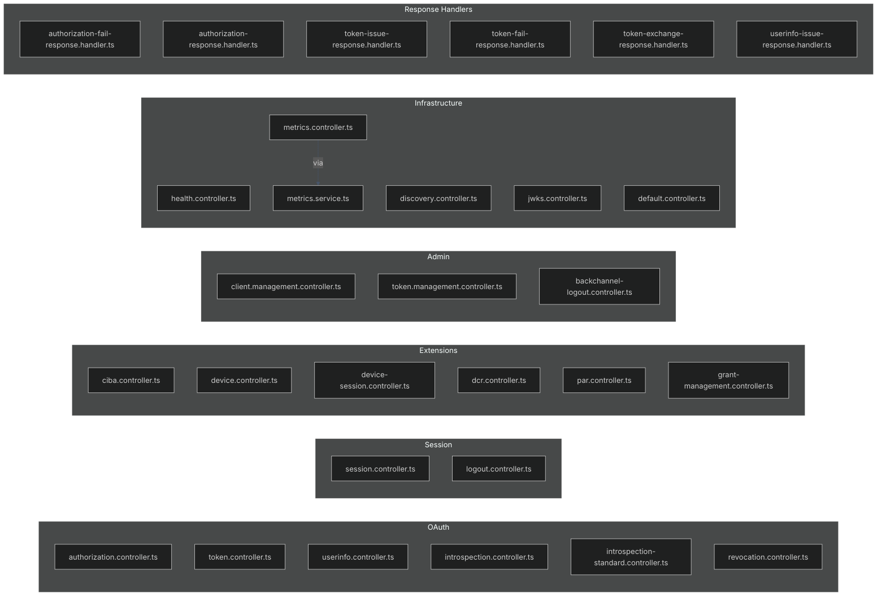
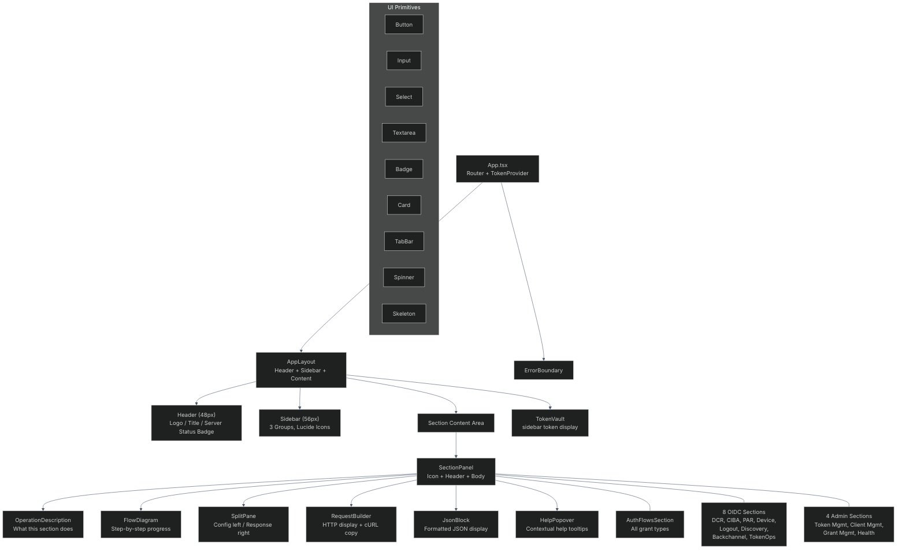

# Component Reference

- [Server Services](#server-services)
- [Server Controllers](#server-controllers)
- [Server Middleware](#server-middleware)
- [React Component Tree](#react-component-tree)
- [React Hooks](#react-hooks)
- [React Services](#react-services)
- [EJS Views](#ejs-views)

---

## Server Services


### Service Relationships

| Service | Depends On | Config |
|---------|-----------|--------|
| `authlete.service.ts` | SDK | `AUTHLETE_BEARER_TOKEN`, `AUTHLETE_BASE_URL`, `AUTHLETE_SERVICE_ID` |
| `login.service.ts` | — | `AUTH_USERS` env var (default: `admin:password`) |
| `consent-store.service.ts` | — | In-memory, no config needed |
| `health.service.ts` | `fetch()` | `authleteConfig` (optional constructor param) |
| `backchannel-logout.service.ts` | `fetch()` | `authleteConfig` (optional constructor param) |
| `metrics.service.ts` | `prom-client` | — |
| All others | `authlete.service.ts` | — |

### Constructor Injection Pattern

16 Authlete-dependent services accept `authleteApi` as an optional constructor parameter (defaults to the real SDK singleton). This enables:

```typescript
// Production — uses real SDK
const service = new TokenService();

// Test — inject mock
const mockApi = createMockAuthleteApi();
const service = new TokenService(mockApi);
```

3 services using raw `fetch()` (`health`, `backchannel-logout`, `metrics`) accept their config as an optional constructor parameter.

---

## Server Controllers



| Controller | Route(s) | Key Logic |
|-----------|----------|-----------|
| `authorization` | `GET/POST /api/authorize` | Action dispatch: LOCATION, FORM, INTERACTION, NO_INTERACTION |
| `token` | `POST /api/token` | Action dispatch: OK, PASSWORD, JWT_BEARER, TOKEN_EXCHANGE, ID_TOKEN_REISSUABLE |
| `session` | `GET/POST /api/session/login`, `GET/POST /api/session/consent` | Login validation, brute-force protection, consent persistence |
| `token.management` | `/api/token/*` | CRUD for tokens via Authlete management API |
| `backchannel-logout` | `/api/backchannel_logout/{issue,deliver,deliver-all}` | Admin Basic auth, raw `fetch()` to Authlete |
| `device` | `/api/device/*` | Device authorization, verification, completion |
| `device-session` | `GET/POST /device` | Browser-based user code entry and consent |
| `health` | `/api/health`, `/api/health/all`, `/api/health/authlete` | Server liveness, aggregate, Authlete-specific |

---

## Server Middleware

| Middleware | File | Purpose |
|-----------|------|---------|
| Security Headers | `app.ts` (inline) | X-Content-Type-Options, X-Frame-Options, Referrer-Policy, Permissions-Policy, HSTS (prod only) |
| CORS | `app.ts` (inline) | Restricts origins to `ALLOWED_ORIGINS` env var |
| Request ID | `app.ts` (inline) | UUID v1 on `req.id` |
| Request Logger | `app.ts` (inline) | Winston child logger on `req.logger` |
| Morgan | `app.ts` (inline) | HTTP access logs via Winston stream |
| Metrics | `src/middleware/metrics.ts` | Prometheus duration histogram + request counter |
| Audit Log | `src/middleware/audit-log.ts` | Winston daily-rotate-file at `logs/audit-*.log`, 90-day retention |
| Body Parsers | `app.ts` (inline) | `urlencoded({ extended: true })` + `json()`, captures `req.rawBody` |
| Cookie Parser | `app.ts` (inline) | `cookie-parser` |
| Session | `src/middleware/session.ts` | `express-session`, 30-min expiry, in-memory or Redis |
| CSRF | `src/middleware/csrf.ts` | 32-byte hex token on GET, validated on POST/PUT/PATCH/DELETE |
| Request Timeout | `src/middleware/request-timeout.ts` | 30s abort on `/api/*` routes |
| Rate Limiting | `src/middleware/rate-limit.ts` | Token (20/min), Auth (60/min), Login (5/min), General (60/min) |
| Error Handler | `src/middleware/errorHandler.ts` | Global catch-all, 500 for unhandled errors |
| `requireBasicAuth` | Inline in controllers | Checks `MGMT_CLIENT_ID`/`MGMT_CLIENT_SECRET` for admin routes |

---

## React Component Tree



### Component Groups

#### Layout Components (`components/layout/`)
| Component | Purpose |
|-----------|---------|
| `AppLayout.tsx` | Header, sidebar, content area layout with backdrop blur |
| `Sidebar.tsx` | 3-group navigation with lucide icons and active-state shadow |
| `SectionPanel.tsx` | Consistent section wrapper with icon slot |
| `ErrorBoundary.tsx` | React error boundary with retry |
| `AdminAuth.tsx` | Admin authentication wrapper |

#### Auth Components (`components/auth/`)
| Component | Purpose |
|-----------|---------|
| `AuthFlowsSection.tsx` | Interactive OAuth grant flow tester with flow diagram, split pane, and request builder |

#### OIDC Components (`components/oidc/`)
| Component | Section |
|-----------|---------|
| `DcrSection.tsx` | Dynamic Client Registration |
| `CibaSection.tsx` | CIBA Backchannel Authentication |
| `ParSection.tsx` | Pushed Authorization Requests |
| `DeviceSection.tsx` | Device Authorization Flow |
| `LogoutSection.tsx` | RP-Initiated Logout |
| `DiscoverySection.tsx` | OIDC Discovery |
| `BackchannelLogoutSection.tsx` | Backchannel Logout |
| `TokenOpsSection.tsx` | Token Operations |

#### Admin Components (`components/admin/`)
| Component | Section |
|-----------|---------|
| `AdminSection.tsx` | Token Management |
| `ClientManagementSection.tsx` | Client Management |
| `GrantManagementSection.tsx` | Grant Management |
| `HealthSection.tsx` | Health Check |

#### UI Components (`components/ui/`)
| Component | Purpose |
|-----------|---------|
| `Button.tsx` | Styled button with variants |
| `Input.tsx` | Themed text input |
| `Select.tsx` | Styled dropdown |
| `Textarea.tsx` | Themed textarea |
| `Badge.tsx` | Status indicator badge |
| `Card.tsx` | Content card container |
| `TabBar.tsx` | Tab navigation |
| `Spinner.tsx` | Loading spinner |
| `Skeleton.tsx` | Skeleton loader |
| `FlowDiagram.tsx` | Step-by-step numbered progress with arrows |
| `SplitPane.tsx` | Responsive 2-column layout |
| `RequestBuilder.tsx` | HTTP request display with cURL copy |
| `TokenVault.tsx` | Token preview/decode/copy/clear |
| `JsonBlock.tsx` | Formatted JSON panel |
| `HelpPopover.tsx` | Contextual help popup |
| `OperationDescription.tsx` | Section description text block |

---

## React Hooks

| Hook | File | Purpose |
|------|------|---------|
| `useApi` | `hooks/useApi.ts` | Generic API call with loading/error/data states |
| `useAsyncCall` | `hooks/useAsyncCall.ts` | Async function wrapper with state |
| `useClipboard` | `hooks/useClipboard.ts` | Copy-to-clipboard with feedback |
| `useLocalStorage` | `hooks/useLocalStorage.ts` | Persistent state in localStorage |
| `useServerStatus` | `hooks/useServerStatus.ts` | Polls `/api/health` every 30s, returns `{ status, uptime, lastCheck }` |

---

## React Services

All exported from `services/index.ts`:

| Service | File | Endpoints |
|---------|------|-----------|
| `tokenService` | `token.service.ts` | Token requests |
| `adminService` | `admin.service.ts` | Token management admin routes |
| `clientService` | `client.service.ts` | Client CRUD |
| `dcrService` | `dcr.service.ts` | Dynamic client registration |
| `cibaService` | `ciba.service.ts` | CIBA operations |
| `parService` | `par.service.ts` | Pushed authorization requests |
| `deviceService` | `device.service.ts` | Device flow |
| `grantService` | `grant.service.ts` | Grant management |
| `backchannelLogoutService` | `backchannel-logout.service.ts` | Backchannel logout |
| `healthService` | `health.service.ts` | Health checks |

Shared HTTP utilities in `services/http.ts`.

---

## EJS Views

Location: `server/src/views/`

```
src/views/
├── consent.ejs              # OAuth consent form (scopes, client name, client logo)
├── device-verification.ejs  # Device flow user code entry page
├── error.ejs                # Generic error page (status, message, description)
├── index.ejs                # Landing / documentation page
├── login.ejs                # Login form (username, password)
├── logout.ejs               # RP-initiated logout confirmation
├── routes.ejs               # Route documentation table
└── partials/
    ├── footer.ejs           # Common page footer
    ├── head.ejs             # HTML <head> with CSRF meta tag, styles
    ├── routes-table.ejs     # Shared route listing partial
    └── scope-list.ejs       # Shared scope display partial
```

Templates receive `res.locals.csrfToken` (set by CSRF middleware) and render it via `<input type="hidden" name="_csrf" value="<%= csrfToken %>">`.
