# Data Flows

- [Authorization Code Flow](#authorization-code-flow)
- [Token Request Variations](#token-request-variations)
- [Logout Flow](#logout-flow)
- [CIBA Flow](#ciba-flow)
- [Device Flow](#device-flow)
- [Backchannel Logout](#backchannel-logout)
- [Grant Management](#grant-management)
- [Dynamic Client Registration](#dynamic-client-registration)
- [Pushed Authorization Requests (PAR)](#pushed-authorization-requests)
- [Token Exchange](#token-exchange)

---

## Authorization Code Flow

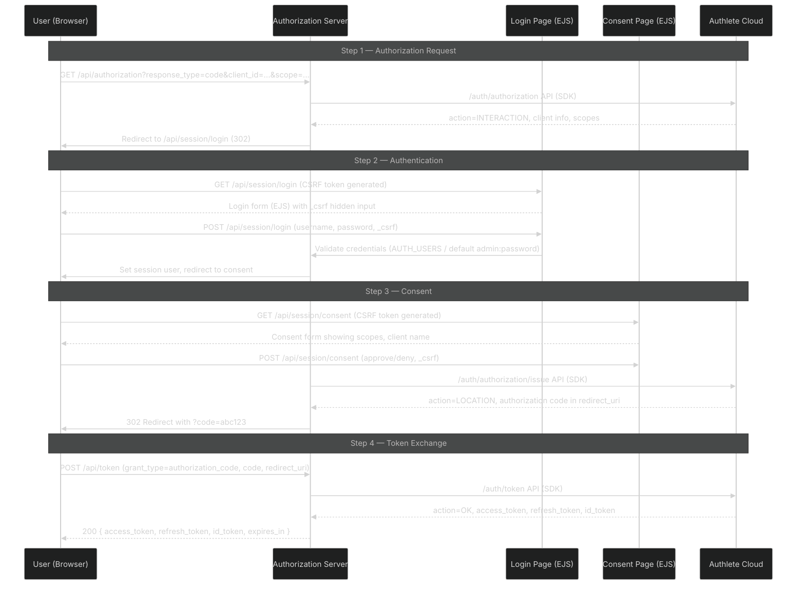

### Key Behaviors

| Aspect | Detail |
|--------|--------|
| Authorization entry | Accepts `GET` with query params |
| Authentication | Server-side form against `AUTH_USERS` env var (defaults to `admin:password`) |
| Session storage | Authorization context saved in `req.session.authorization` between redirects |
| Consent persistence | `consent-store.service.ts` stores `{clientId}:{subject}` → scopes with 24h TTL |
| `prompt=none` | Auto-issues if user has valid session + persistent consent covers requested scopes; otherwise returns `CONSENT_REQUIRED` error |
| `prompt=consent` | Always shows consent form, bypassing stored consent |
| Fail responses | Various error reasons mapped via `sendAuthorizationFailResponse` |

---

## Token Request Variations

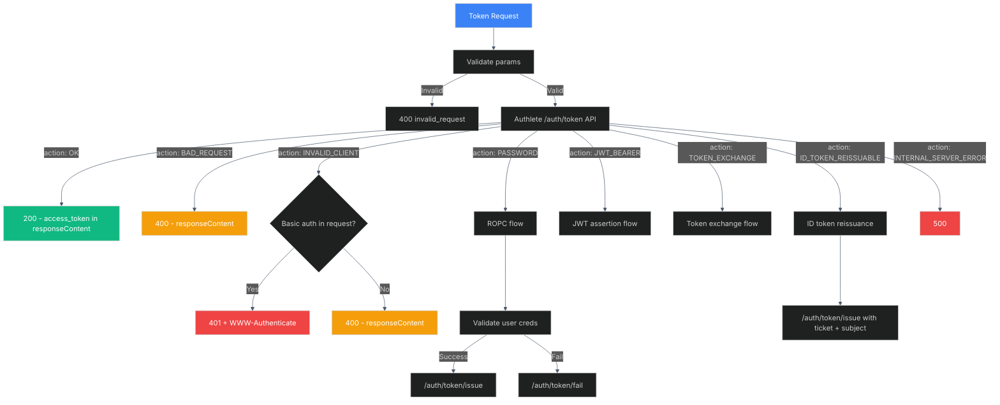

### Supported Grant Types

| Grant Type | Route | Behavior |
|-----------|-------|----------|
| `authorization_code` | `/api/token` | Standard auth code exchange |
| `client_credentials` | `/api/token` | Client auth only, no user |
| `refresh_token` | `/api/token` | Refresh access token (no rotation, idempotent) |
| `password` | `/api/token` | ROPC — validates locally then calls `/issue` or `/fail` |
| `urn:ietf:params:oauth:grant-type:token-exchange` | `/api/token` | Token exchange delegation |
| `urn:openid:params:grant-type:ciba` | `/api/token` | CIBA polling (Authlete native) |
| `urn:ietf:params:oauth:grant-type:device_code` | `/api/token` | Device code polling (Authlete native) |
| `urn:ietf:params:oauth:grant-type:jwt-bearer` | `/api/token` | JWT bearer assertion grant |

### ROPC Flow Detail

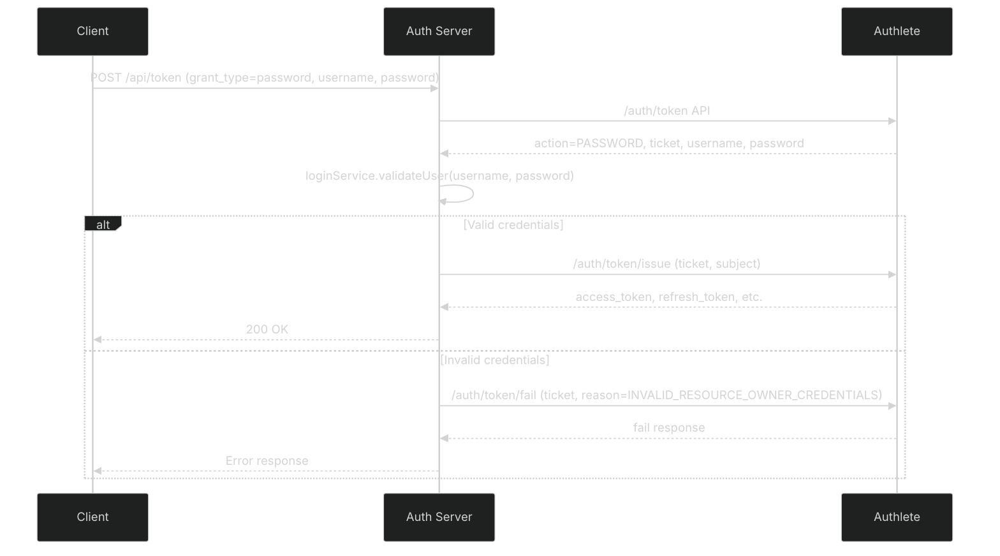

---

## Logout Flow

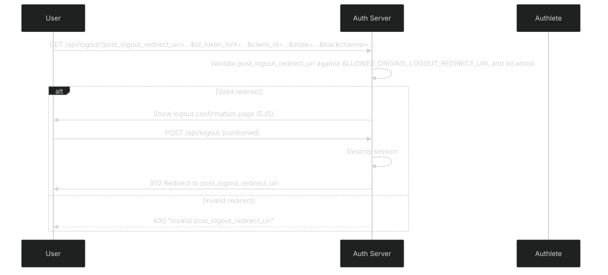

### Backchannel Logout (Receiving)

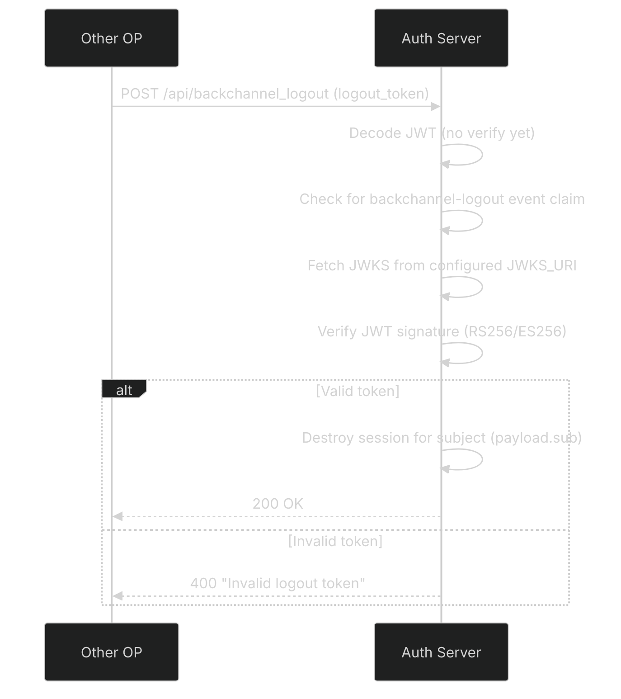

---

## CIBA Flow

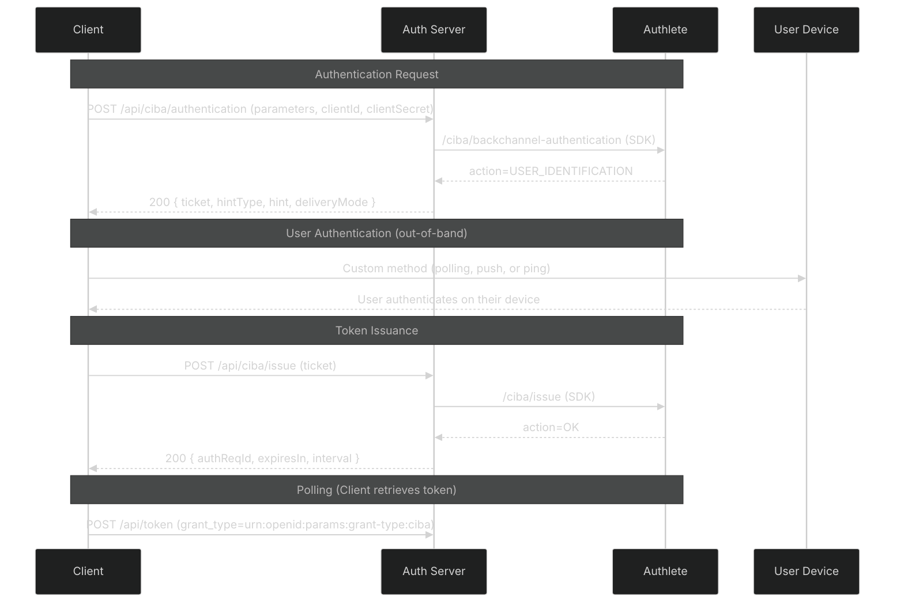

| Endpoint | Purpose |
|----------|---------|
| `POST /api/ciba/authentication` | Initiate CIBA authentication; returns ticket |
| `POST /api/ciba/issue` | Issue token after user authentication |
| `POST /api/ciba/fail` | Fail authentication (ticket + reason) |
| `POST /api/ciba/complete` | Complete auth (ticket + result + subject) |
| `POST /api/token` | Poll for token (Authlete native support) |

---

## Device Flow

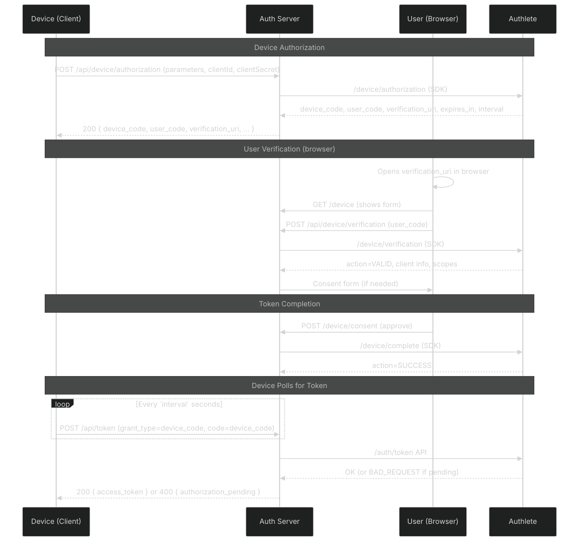

| Endpoint | Purpose |
|----------|---------|
| `POST /api/device/authorization` | Start device flow; returns device_code, user_code |
| `POST /api/device/verification` | Verify user_code entered by user |
| `POST /api/device/complete` | Complete verification (approve/deny) |
| `GET /device` | Browser form for user_code entry |
| `POST /device/consent` | Browser-based consent after code entry |
| `POST /api/token` | Poll for token (Authlete native) |

---

## Backchannel Logout (Server-Initiated)

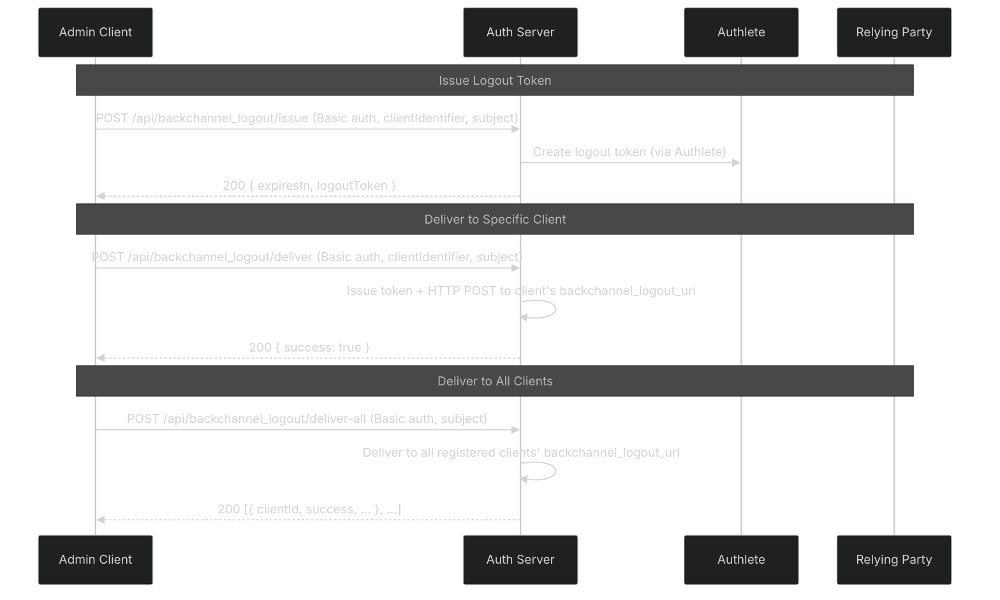

All three endpoints require admin Basic auth (`MGMT_CLIENT_ID` / `MGMT_CLIENT_SECRET`). The `issue` endpoint creates a logout token (calls Authlete's backchannel logout API). The `deliver` endpoint creates and delivers. The `deliver-all` endpoint broadcasts to all clients with a `backchannel_logout_uri` configured.

---

## Grant Management

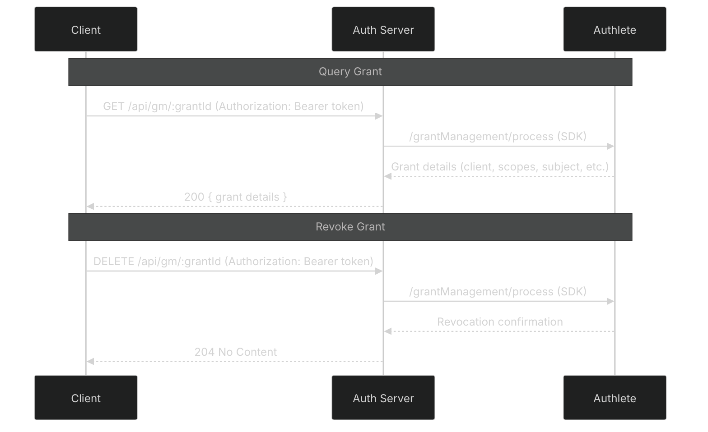

---

## Dynamic Client Registration

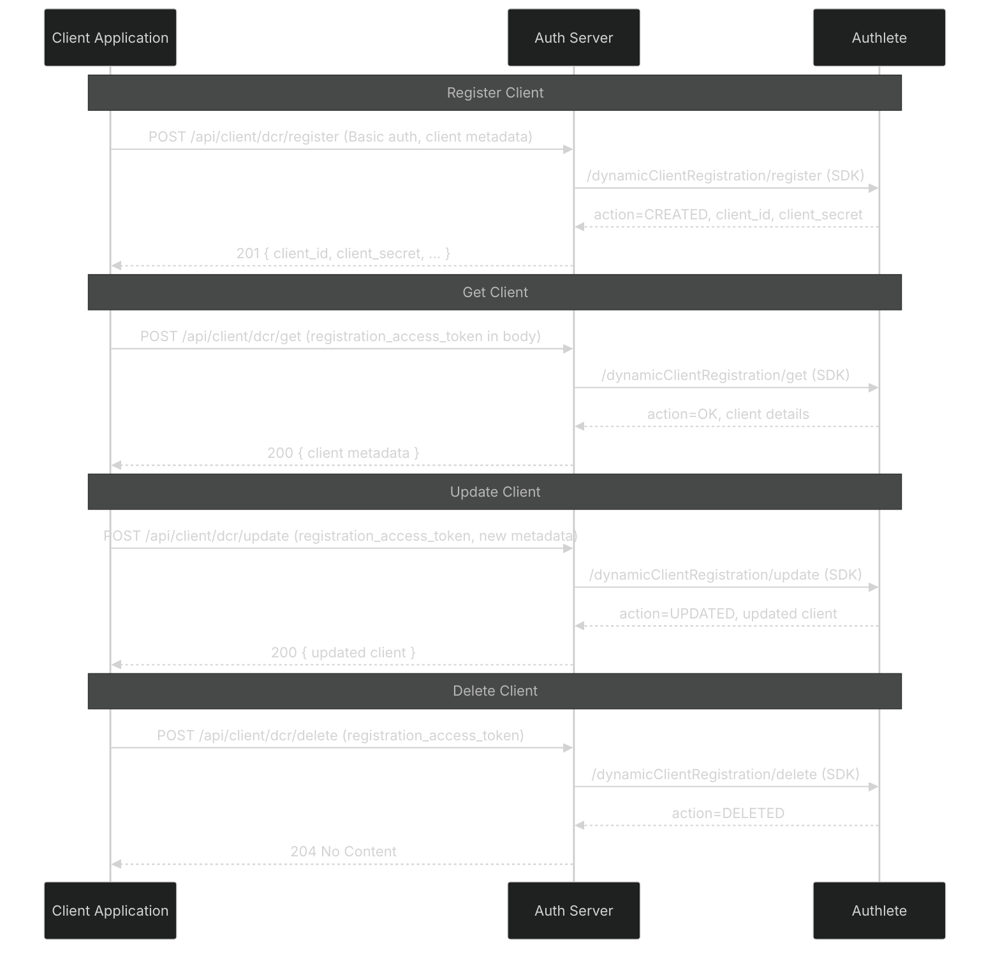

### Action → HTTP Status Mapping

| Authlete Action | HTTP Status |
|----------------|-------------|
| `CREATED` | 201 |
| `OK` / `UPDATED` | 200 |
| `DELETED` | 204 |
| `BAD_REQUEST` | 400 |
| `UNAUTHORIZED` | 401 |
| `INTERNAL_SERVER_ERROR` | 500 |

- `register` requires admin Basic auth (`MGMT_CLIENT_ID` / `MGMT_CLIENT_SECRET`)
- `get` / `update` / `delete` use the registration access token from the request body

---

## Pushed Authorization Requests

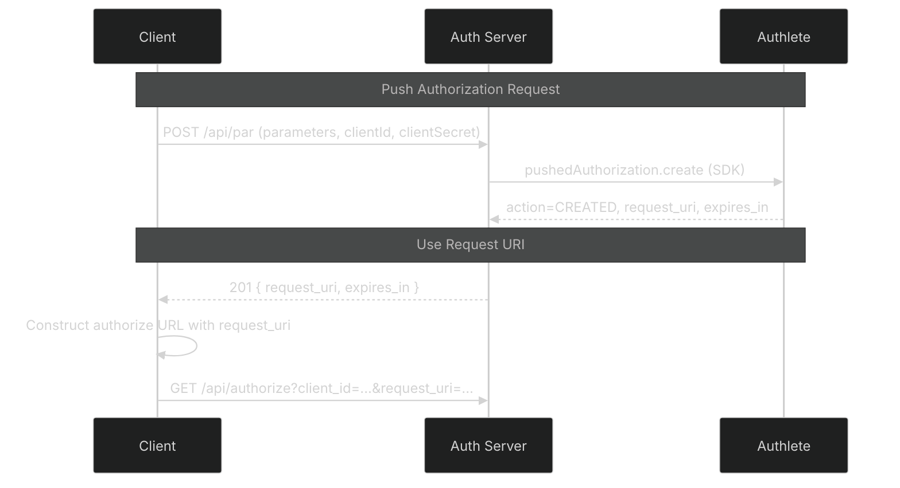

PAR accepts `parameters` (URL-encoded OAuth params), `clientId`, `clientSecret` in JSON body. No admin auth required — client authentication is via the body fields. The `request_uri` is a one-time use reference to the pushed authorization payload stored by Authlete.

---

## Token Exchange

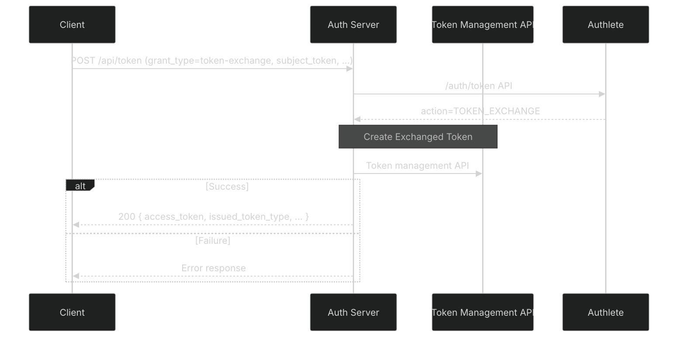
