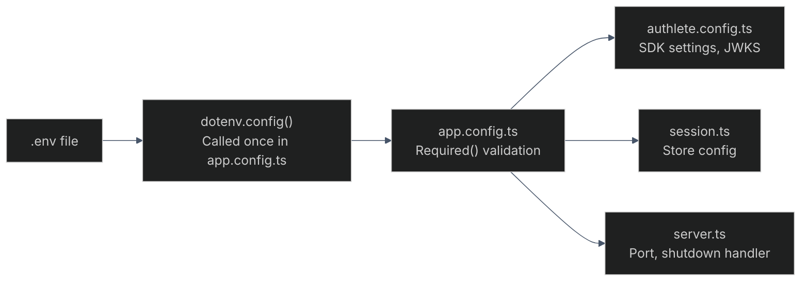
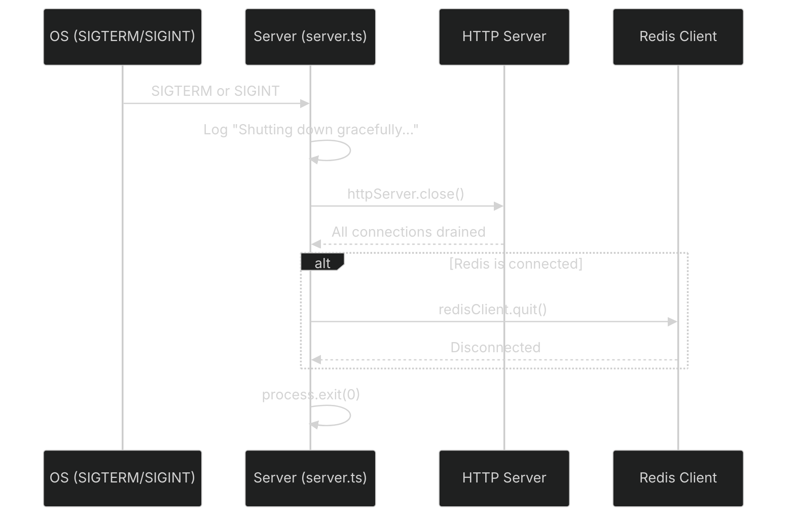

# Development

- [Setup](#setup)
- [Environment Variables](#environment-variables)
- [Config](#config)
- [Service Configuration](#service-configuration)
- [Middleware Stack](#middleware-stack)
- [Rate Limits](#rate-limits)
- [Brute-Force Protection](#brute-force-protection)
- [CSRF Protection](#csrf-protection)
- [Admin Routes](#admin-routes)
- [Session Store](#session-store)
- [Graceful Shutdown](#graceful-shutdown)
- [Build & Deploy](#build--deploy)
- [Quirks & Gotchas](#quirks--gotchas)

---

## Setup

```bash
# 1. Clone and install
git clone <repo>
npm --prefix server install
npm --prefix client install

# 2. Configure environment
cp server/.env.example server/.env
cp client/.env.example client/.env

# 3. Start Redis (optional, for production-like sessions)
docker compose up -d

# 4. Run development servers
npm --prefix server run dev   # Express on :3000
npm --prefix client run dev   # SPA on :3001 (Vite proxies /api → :3000)
```

### Required Authlete Credentials

Get these from [Authlete Console](https://console.authlete.com/):
- `AUTHLETE_BEARER_TOKEN` — API access token
- `AUTHLETE_BASE_URL` — Authlete API base URL
- `AUTHLETE_SERVICE_ID` — Authlete service ID

---

## Environment Variables

### Server (`server/.env`)

| Variable | Required | Default | Description |
|----------|----------|---------|-------------|
| `PORT` | No | `3000` | Express listen port |
| `NODE_ENV` | No | `development` | `development` or `production` |
| `SESSION_SECRET` | **Yes** | — | Session encryption secret (minimum 32 chars) |
| `AUTHLETE_BEARER_TOKEN` | **Yes** | — | Authlete API token |
| `AUTHLETE_BASE_URL` | **Yes** | — | Authlete API base URL |
| `AUTHLETE_SERVICE_ID` | **Yes** | — | Authlete service ID |
| `REDIS_URL` | No | — | Redis connection string (e.g., `redis://localhost:6379`) |
| `ALLOWED_ORIGINS` | No | `http://localhost:3000,http://localhost:3001` | CORS allowed origins |
| `AUTH_USERS` | No | `admin:admin:password:Administrator` | Demo users: `subject:username:password:name;...` |
| `MGMT_CLIENT_ID` | No | — | Admin API Basic auth username |
| `MGMT_CLIENT_SECRET` | No | — | Admin API Basic auth password |
| `JWKS_URI` | No | — | JWKS URI for backchannel logout token verification |
| `LOGOUT_REDIRECT_URI` | No | — | Valid post-logout redirect URI |
| `LOG_LEVEL` | No | `debug` (dev) / `info` (prod) | Winston log level |
| `MORGAN_FORMAT` | No | `combined` | Morgan access log format |

### Client (`client/.env`)

| Variable | Required | Default | Description |
|----------|----------|---------|-------------|
| `VITE_CLIENT_ID` | No | `your_client_id` | OAuth client ID for testing |
| `VITE_CLIENT_SECRET` | No | — | OAuth client secret for testing |
| `VITE_REDIRECT_URI` | No | `http://localhost:3001/callback` | Redirect URI for auth flows |
| `VITE_API_BASE_URL` | No | `http://localhost:3000` | Backend API URL |
| `VITE_PROD_API_BASE_URL` | No | — | Backend API URL in production |
| `VITE_PROD_REDIRECT_URI` | No | — | Redirect URI in production |
| `VITE_SCOPES` | No | `openid profile email` | Default scope list for tests |
| `VITE_DEV_CLIENT_PORT` | No | `3001` | Vite dev server port |
| `VITE_DEV_CLIENT_HOST` | No | `localhost` | Vite dev server host |

---

## Config

### Server Config Loading



- `dotenv` is loaded **only** in `src/config/app.config.ts` (was previously duplicated in `authlete.config.ts`)
- Fails fast: missing `SESSION_SECRET`, `AUTHLETE_BEARER_TOKEN`, `AUTHLETE_BASE_URL`, or `AUTHLETE_SERVICE_ID` throws immediately on startup
- Config validation is import-order-dependent — `app.config.ts` must be imported before other configs

### Client Config

Client env vars are prefixed with `VITE_` and accessed via `import.meta.env` at build time. The `config.ts` module provides `getApiBaseUrl()` and `getRedirectUri()` which respect per-environment overrides defined in `PROD_CONFIG`.

---

## Service Configuration

The Authlete service (configured via the [Authlete web console](https://console.authlete.com/)) controls OAuth/OIDC behavior through boolean flags. These map to common spec implementation mistakes documented in [this article](https://darutk.medium.com/oauth-oidc-mistakes-7f3bb909518b).

### Recommended Flags

| Flag | Value | Rationale |
|------|-------|-----------|
| `scopeRequired` | `true` | Reject requests without `scope` (RFC 6749 §3.3) |
| `claimShortcutRestrictive` | `true` | Only embed scope-requested claims in ID token when no AT issued |
| `refreshTokenKept` | `true` | Disable refresh token rotation (FAPI 2.0 forbids it) |
| `refreshTokenIdempotent` | `true` | Idempotent refresh within 60s window |
| `dcrScopeUsedAsRequestable` | `true` | Honor `scope` metadata in DCR (RFC 7591) |
| `missingClientIdAllowed` | `false` | Require `client_id` in token requests |
| `issSuppressed` | `false` | Include `iss` param for mix-up attack prevention (RFC 9207) |
| `idTokenAudType` | `"string"` | Single string for `aud` claim |
| `loopbackRedirectionUriVariable` | `true` | Variable loopback ports (RFC 8252 §7.3) |
| `traditionalRequestObjectProcessingApplied` | `false` | Use RFC 9101 JAR processing |
| `nbfOptional` | `false` | Enforce request object ≤60s lifespan |
| `unauthorizedOnClientConfigSupported` | `true` | Return 401 for non-existent DCR clients |
| `idTokenReissuable` | `true` | Enable ID token reissuance during refresh |

### Brazil-Specific Flags

Set only if targeting Brazil's API ecosystem:

| Flag | Value |
|------|-------|
| `dcrDuplicateSoftwareIdBlocked` | `true` |
| `frontChannelRequestObjectEncryptionRequired` | `true` |
| `requestObjectEncryptionAlgMatchRequired` | `true` |
| `requestObjectEncryptionEncMatchRequired` | `true` |

---

## Middleware Stack

Ordered as applied in `app.ts`:

1. Static file serving (`public/`)
2. Security headers (X-Content-Type-Options, X-Frame-Options, Referrer-Policy, Permissions-Policy, HSTS in prod)
3. CORS (`ALLOWED_ORIGINS`)
4. Request ID (`req.id` — UUID v1)
5. Per-request logger (`req.logger` — Winston child)
6. Morgan access logs (→ Winston)
7. Metrics (Prometheus histogram + counter)
8. Audit log (Winston daily-rotate at `logs/audit-*.log`, 90-day retention)
9. Body parsers (urlencoded + json; captures `req.rawBody`)
10. Cookie parser
11. Trust proxy (`app.set("trust proxy", 1)`)
12. Session (30-min expiry, in-memory or Redis)
13. Rate limiters (applied per route, not globally)
14. CSRF (applied per route on session/device browser routes)
15. Request timeout (30s on `/api/*`)
16. Routes

---

## Rate Limits

| Limiter | Rate | Applied To | Skip Condition |
|---------|------|------------|----------------|
| `tokenLimiter` | 20/min | `POST /api/token` | Skipped when Basic auth present |
| `authLimiter` | 60/min | `GET /api/authorization` | — |
| `loginLimiter` | 5/min | `POST /api/session/login` | — |
| `generalLimiter` | 60/min | Session, DCR, CIBA, PAR, device browser routes | — |

Rate limiting uses `express-rate-limit` with in-memory store.

---

## Brute-Force Protection

**5 failed login attempts / IP → 60s ban**

- In-memory `Map<string, { count, banUntil }>` in `session.controller.ts`
- Cleared on successful login
- 429 "Too many login attempts" response when banned
- Distinct from rate limiter — this is per-IP, per-brute-force, not per-time-window

---

## CSRF Protection

| Aspect | Detail |
|--------|--------|
| Token length | 32 bytes → 64-character hex string |
| Generation | On every GET that renders a form |
| Validation | POST/PUT/PATCH/DELETE via `_csrf` body field |
| Consumption | Replaced with new token after each successful POST |
| Force-save | `req.session.save()` called explicitly after token generation |
| TTL | Session lifetime (30 min) |
| Error | 403 `{ error: "invalid_request", message: "CSRF token mismatch" }` |

**Why force-save matters**: `express-session` with `resave: false` + `saveUninitialized: false` does not autosave new sessions, even when modified. The CSRF token generated during GET would be lost before POST without explicit `save()`.

---

## Admin Routes

Routes requiring admin Basic auth use `requireBasicAuth` middleware checking `MGMT_CLIENT_ID` / `MGMT_CLIENT_SECRET`:

- `/api/token/*` (list, create, delete, update, revoke, reissue)
- `/api/client/*` (CRUD)
- `/api/backchannel_logout/issue`
- `/api/backchannel_logout/deliver`
- `/api/backchannel_logout/deliver-all`
- `/api/client/dcr/register`

If `MGMT_CLIENT_ID` and `MGMT_CLIENT_SECRET` are **not set**, all admin routes are unprotected (no auth required).

---

## Session Store

| Mode | Store | Config |
|------|-------|--------|
| Default | In-memory | No additional config needed |
| Production | Redis | `REDIS_URL=redis://localhost:6379` |

The session store is configured in `src/middleware/session.ts`. Redis is optional — when `REDIS_URL` is not set, the server uses the default in-memory store.

To enable Redis:
```bash
docker compose up -d
# Add to server/.env:
REDIS_URL=redis://localhost:6379
```

---

## Graceful Shutdown



Implemented in `server/src/server.ts`. Redis logout is conditional — only called if the Redis client was initialized.

---

## Build & Deploy

```bash
# Server build (TypeScript → dist/)
npm --prefix server run build

# Client build (Vite → dist/)
npm --prefix client run build

# Both (Render deploy)
npm --prefix client run build && npm --prefix server run build

# Production start
npm --prefix server run start   # node dist/server.js
```

### Build Output

```
server/dist/
├── server.js          # Compiled entry point
├── config/            # Compiled config
├── controllers/       # Compiled controllers
├── services/          # Compiled services
├── routes/            # Compiled routes
├── middleware/        # Compiled middleware
├── types/             # Compiled type definitions
├── utils/             # Compiled utilities
├── views/             # Copied from src/views/ via postbuild
└── public/            # Copied from public/ via postbuild
```

### Postbuild Script

```json
{
  "postbuild": "rm -rf dist/views dist/public && cp -r src/views dist/views && cp -r public dist/public"
}
```

The destructive `rm -rf` prevents nested `dist/views/views/` on subsequent rebuilds. If you rename/move these directories, update the script.

---

## Quirks & Gotchas

### TypeScript Module Resolution

`server/tsconfig.json` uses `module: "node16"` + `moduleResolution: "node16"`. Dynamic imports need `.js` extension:

```typescript
// Correct
const { redisClient } = await import("../middleware/session.js");

// Wrong — will fail at runtime
const { redisClient } = await import("../middleware/session");
```

### SDK Patch

`@authlete/typescript-sdk@^1.1.6` has a patch at `patches/@authlete+typescript-sdk+1.1.6.patch`:
- `clientCreate.js` accepts `[200, 201]` because Authlete returns 201 for created resources (SDK bug)
- Applied via `patch-package` in `postinstall`

### Audit Log Retention

Winston daily-rotate at `logs/audit-*.log` with 90-day retention. The `logs/` directory is gitignored (except `.gitkeep`).

### Supertest 7.2.2

There's a bug in Supertest 7.2.2: `_attachCookies` throws `Invalid URL` on relative URL redirects with JSON chars. Workaround: avoid browser-flow tests or use `request` (non-agent).

### Coverage Directory

`server/coverage/` is gitignored — generated report directory from `npm run test:coverage`.

### Crypto Utility

`server/src/utils/crypto.ts` was deleted (unused). The client-side `pkce.ts` handles PKCE code generation. Only server-side crypto used is `crypto.randomBytes()` for CSRF tokens.

### Loggers

All logging uses `const log = req.logger || logger;`. `CallableLogger` is both callable (for info-level) and has `.error()`, `.warn()`, `.child()` methods.

### Login Page

Credentials are never hardcoded in source. The login template passes empty strings. `AUTH_USERS` env var provides demo users (defaults to `admin:password`).

### E2E Dependencies

The E2E test (`tests/e2e/e2e.test.ts`) conditionally skips blocks based on env vars:
- `CID`/`SEC` — confidential client credentials
- `PUB_CID` — public client credentials
- `MGMT_CLIENT_ID`/`MGMT_CLIENT_SECRET` — management credentials

### Authlete Rate Limit

~15+ token API calls in a short window triggers Authlete's rate limit (HTTP 429). E2E tests handle this as a valid response.
