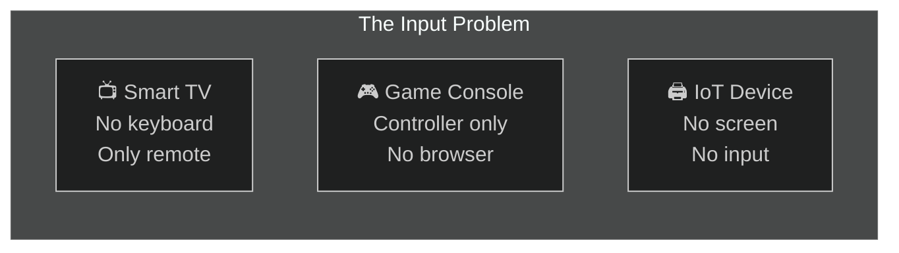
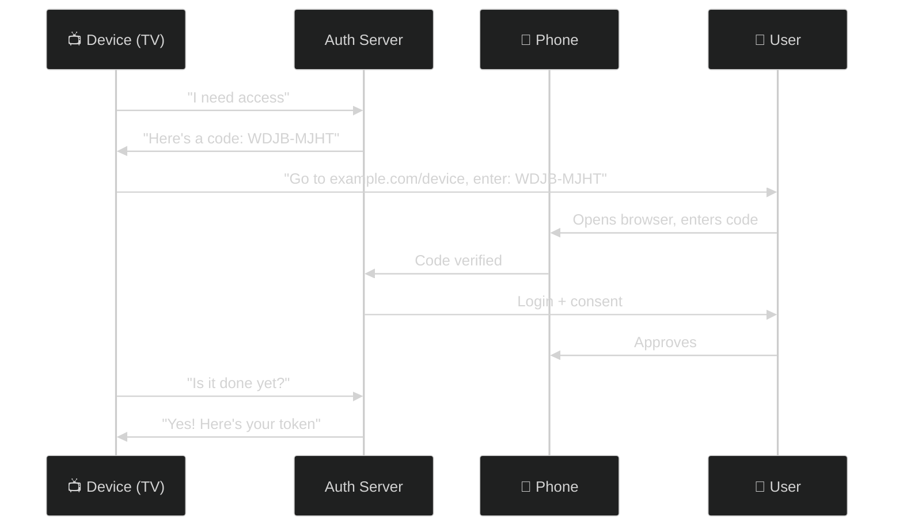
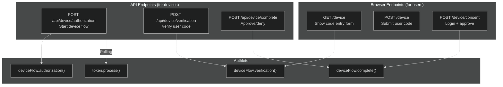
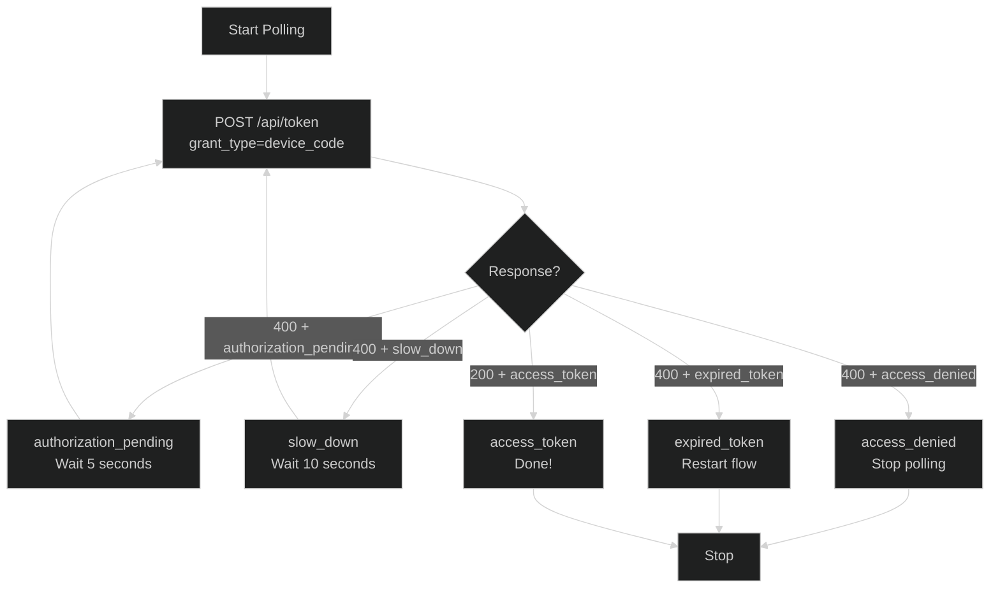

# OAuth 2.0 Device Authorization Grant (Device Flow) — RFC 8628

> **The short version:** Device Flow lets devices without keyboards (smart TVs, game consoles, IoT) get authorization by showing a code on screen while the user completes login on their phone.

---

## Table of Contents

- [Part 1: Why Device Flow Exists](#part-1-why-device-flow-exists)
- [Part 2: How Device Flow Works](#part-2-how-device-flow-works)
- [Part 3: Authlete Configuration](#part-3-authlete-configuration)
- [Part 4: Server Implementation](#part-4-server-implementation)
- [Part 5: Step-by-Step API Flow](#part-5-step-by-step-api-flow)
- [Part 6: Browser-Based Flow](#part-6-browser-based-flow)
- [Part 7: Token Endpoint — Polling](#part-7-token-endpoint--polling)
- [Part 8: SPA Testing Tool](#part-8-spa-testing-tool)
- [Part 9: Complete Test Scenarios](#part-9-complete-test-scenarios)
- [Part 10: Error Scenarios](#part-10-error-scenarios)
- [Part 11: RFC 8628 Compliance](#part-11-rfc-8628-compliance)
- [Part 12: Security Considerations](#part-12-security-considerations)
- [Part 13: Troubleshooting](#part-13-troubleshooting)

---

## Part 1: Why Device Flow Exists

### The Problem: Devices Without Keyboards

Imagine you're watching Netflix on your smart TV. You want to sign in, but the TV remote is terrible for typing. Even worse, some devices like IoT sensors or printers can't display a browser at all.



| Problem | What Happens | Why It Matters |
|---------|-------------|----------------|
| **No keyboard** | Can't type username/password on TV | Users give up |
| **No browser** | Can't redirect to login page | Standard OAuth fails |
| **Limited input** | Remote control navigation is painful | Bad user experience |
| **Security risk** | Typing passwords on shared screen | Shoulder surfing |

### The Solution: Split the Flow

Device Flow splits authorization into two parts:

1. **Device** shows a short code and URL
2. **User** enters the code on their phone
3. **Device** polls the server until approved



### When Should You Use Device Flow?

| Scenario | Use Device Flow? | Why |
|----------|:----------------:|-----|
| Smart TV app | **Yes** | Can't type, no browser |
| Game console | **Yes** | Controller input only |
| CLI tool | **Yes** | `gh` CLI uses this |
| IoT device | **Yes** | No screen or input |
| Mobile app | **No** | Can use standard OAuth |
| SPA | **No** | Can use standard OAuth |

---

## Part 2: How Device Flow Works

### The Complete Flow


### What Just Happened?

1. **Device** told the server: "I'm a TV app, I need access to openid scope."

2. **Authlete** generated two codes:
   - `device_code` — high-entropy, secret, used for polling
   - `user_code` — short, human-readable (`WDJB-MJHT`), shown to user

3. **Device** displayed instructions: "Go to this URL, enter this code."

4. **User** opened their phone, went to the URL, entered the code, logged in, and approved.

5. **Device** kept polling the token endpoint every 5 seconds. While the user was logging in, it got `authorization_pending`.

6. **After approval**, the next poll returned the access token.

### Key Insight: No Redirect URI

Unlike standard OAuth, Device Flow doesn't need a redirect URI. The device **polls** instead of waiting for a callback. This is perfect for devices behind NAT or without a web server.

---

## Part 3: Authlete Configuration

### Service Settings

In the [Authlete Console](https://console.authlete.com/), configure these settings:

| Setting | What to Enter | Why |
|---------|---------------|-----|
| **Device Authorization Endpoint** | `https://your-server.com/api/device/authorization` | Where devices request codes |
| **Device Verification URI** | `https://your-server.com/device` | Where users enter codes |
| **Device Verification URI Complete** | `https://your-server.com/device?user_code=USER_CODE` | For QR codes (optional) |
| **Device Flow Code Duration** | `300` (5 minutes) | How long codes stay valid |
| **Device Flow Polling Interval** | `5` (seconds) | Minimum time between polls |
| **Supported Grant Types** | Include `urn:ietf:params:oauth:grant-type:device_code` | Enable device flow |

### Verify in Discovery Document

```bash
curl http://localhost:3000/api/.well-known/openid-configuration | jq '.device_authorization_endpoint, .grant_types_supported'
```

Expected output:
```
"https://your-server.com/api/device/authorization"
["authorization_code", "client_credentials", "refresh_token", "urn:ietf:params:oauth:grant-type:device_code"]
```

---

## Part 4: Server Implementation

### Architecture



### Why Two Sets of Endpoints?

| Endpoint Set | Who Uses It | Purpose |
|-------------|-------------|---------|
| **API** (`/api/device/*`) | Devices (programmatic) | Start flow, verify code, approve/deny |
| **Browser** (`/device`) | Users (human) | Enter code, login, consent |

The API endpoints are for testing tools and programmatic clients. The browser endpoints are what real users interact with.

---

## Part 5: Step-by-Step API Flow

### Step 1: Device Requests Access

```bash
curl -X POST http://localhost:3000/api/device/authorization \
  -H "Content-Type: application/json" \
  -d '{
    "parameters": "client_id=YOUR_CLIENT_ID&scope=openid+profile",
    "clientId": "YOUR_CLIENT_ID",
    "clientSecret": "YOUR_CLIENT_SECRET"
  }'
```

**Response (200):**
```json
{
  "deviceCode": "GmRhmhcxhwAzkoEqiMEg_DnyEysNkuNhszIySk9eS",
  "userCode": "WDJB-MJHT",
  "verificationUri": "http://localhost:3000/device",
  "verificationUriComplete": "http://localhost:3000/device?user_code=WDJB-MJHT",
  "expiresIn": 300,
  "interval": 5
}
```

### Step 2: Display to User

The device shows:
```
┌─────────────────────────────────────────┐
│                                         │
│  Using a browser on another device,     │
│  visit: http://localhost:3000/device    │
│                                         │
│  And enter the code:                    │
│  WDJB-MJHT                             │
│                                         │
└─────────────────────────────────────────┘
```

### Step 3: User Enters Code on Phone

1. Opens `http://localhost:3000/device`
2. Enters `WDJB-MJHT`
3. Sees consent page with client name and scopes
4. Logs in (default: `admin` / `password`)
5. Clicks **Authorize**

### Step 4: Device Polls for Token

```bash
# While waiting for user
curl -X POST http://localhost:3000/api/token \
  -u "YOUR_CLIENT_ID:YOUR_CLIENT_SECRET" \
  -H "Content-Type: application/x-www-form-urlencoded" \
  -d "grant_type=urn:ietf:params:oauth:grant-type:device_code" \
  -d "device_code=GmRhmhcxhwAzkoEqiMEg_DnyEysNkuNhszIySk9eS"
```

**While pending:**
```json
HTTP/1.1 400 Bad Request
{"error": "authorization_pending"}
```

**After approval:**
```json
{
  "access_token": "FOMxkE5baq...",
  "token_type": "Bearer",
  "expires_in": 86400,
  "scope": "openid profile",
  "id_token": "eyJhbGciOiJSUzI1NiIs..."
}
```

---

## Part 6: Browser-Based Flow

This is what real end users see.

### Step 1: User Visits Device Page

Opens phone browser to `http://localhost:3000/device`:

```
┌─────────────────────────────────────────┐
│                                         │
│  Device Verification                    │
│                                         │
│  Enter the code displayed on your       │
│  device to sign in.                     │
│                                         │
│  User Code                              │
│  ┌─────────────────────────────────┐    │
│  │  WDJB-MJHT                      │    │
│  └─────────────────────────────────┘    │
│                                         │
│  [Verify]                               │
│                                         │
└─────────────────────────────────────────┘
```

### Step 2: User Sees Consent Page

After entering the code:

```
┌─────────────────────────────────────────┐
│                                         │
│  ┌─┐                                   │
│  │T│  Your TV App                       │
│  └─┘  requesting access to your account │
│                                         │
│  This device would like to:             │
│  • openid                               │
│  • profile                              │
│                                         │
│  Username                               │
│  ┌─────────────────────────────────┐    │
│  │  admin                          │    │
│  └─────────────────────────────────┘    │
│  Password                               │
│  ┌─────────────────────────────────┐    │
│  │  ••••••••                       │    │
│  └─────────────────────────────────┘    │
│                                         │
│  [Authorize]  [Deny]                    │
│                                         │
└─────────────────────────────────────────┘
```

### Step 3: Success

After clicking **Authorize**:

```
┌─────────────────────────────────────────┐
│                                         │
│  ✓ Authorization Successful             │
│                                         │
│  You can now close this window.         │
│                                         │
└─────────────────────────────────────────┘
```

---

## Part 7: Token Endpoint — Polling

### The Polling Pattern

The device keeps asking "Is the user done yet?" until approved or timeout.



### Polling Rules

| Rule | Value | Why |
|------|-------|-----|
| Initial interval | 5 seconds | Default from Authlete config |
| Slow down increment | +5 seconds | RFC 8628 §3.5 requirement |
| Maximum interval | Not specified | But be reasonable |
| Timeout | `expires_in` (default 300s) | Device code expires |

### Example Polling Script

```bash
#!/bin/bash
DEVICE_CODE="GmRhmhcxhwAzkoEqiMEg_DnyEysNkuNhszIySk9eS"
CID="YOUR_CLIENT_ID"
SEC="YOUR_CLIENT_SECRET"
INTERVAL=5

while true; do
  RESP=$(curl -s -w "\n%{http_code}" -X POST http://localhost:3000/api/token \
    -u "$CID:$SEC" \
    -d "grant_type=urn:ietf:params:oauth:grant-type:device_code&device_code=$DEVICE_CODE")
  
  HTTP_CODE=$(echo "$RESP" | tail -n1)
  BODY=$(echo "$RESP" | head -n-1)
  
  if [ "$HTTP_CODE" = "200" ]; then
    echo "Success! $BODY"
    break
  elif echo "$BODY" | grep -q '"error":"slow_down"'; then
    INTERVAL=$((INTERVAL + 5))
  elif echo "$BODY" | grep -q '"error":"authorization_pending"'; then
    echo "Waiting... (interval: ${INTERVAL}s)"
  else
    echo "Error: $BODY"
    break
  fi
  
  sleep $INTERVAL
done
```

---

## Part 8: SPA Testing Tool

### Accessing Device Flow

1. Start the server: `npm --prefix server run dev`
2. Start the client: `npm --prefix client run dev`
3. Open `http://localhost:3001`
4. Click **Device Flow** in the sidebar

### Three Tabs

| Tab | Purpose | What You Enter |
|-----|---------|----------------|
| **Authorization** | Start device flow | Client ID, Secret, Scope |
| **Verification** | Verify user code | User Code (auto-filled) |
| **Complete** | Approve/deny | User Code, Result, Subject |

### Testing Workflow

1. **Authorization tab:** Click **Run** → Get `device_code` and `user_code`
2. **Verification tab:** Click **Run** → See client name and scopes
3. **Complete tab:** Select "AUTHORIZED", click **Run** → Approved
4. **Terminal:** Poll `/api/token` with `device_code` to get token

> **Note:** The SPA doesn't poll automatically. Use curl to poll the token endpoint.

---

## Part 9: Complete Test Scenarios

### Scenario 1: Happy Path

```bash
# 1. Start device flow
DEVICE_RESP=$(curl -s -X POST http://localhost:3000/api/device/authorization \
  -H "Content-Type: application/json" \
  -d '{
    "parameters": "client_id=YOUR_CID&scope=openid+profile",
    "clientId": "YOUR_CID",
    "clientSecret": "YOUR_SEC"
  }')

DEVICE_CODE=$(echo $DEVICE_RESP | jq -r '.deviceCode')
USER_CODE=$(echo $DEVICE_RESP | jq -r '.userCode')

echo "User code: $USER_CODE"

# 2. Verify user code
curl -s -X POST http://localhost:3000/api/device/verification \
  -H "Content-Type: application/json" \
  -d "{\"userCode\": \"$USER_CODE\"}" | jq .

# 3. Approve
curl -s -X POST http://localhost:3000/api/device/complete \
  -H "Content-Type: application/json" \
  -d "{\"userCode\": \"$USER_CODE\", \"result\": \"AUTHORIZED\", \"subject\": \"admin\"}" | jq .

# 4. Exchange for token
curl -s -X POST http://localhost:3000/api/token \
  -u "YOUR_CID:YOUR_SEC" \
  -d "grant_type=urn:ietf:params:oauth:grant-type:device_code&device_code=$DEVICE_CODE" | jq .
```

### Scenario 2: User Denies Access

```bash
# Steps 1-2: Same as above

# 3. Deny
curl -s -X POST http://localhost:3000/api/device/complete \
  -H "Content-Type: application/json" \
  -d "{\"userCode\": \"$USER_CODE\", \"result\": \"ACCESS_DENIED\", \"subject\": \"admin\"}" | jq .

# 4. Token exchange fails
# Response: 400 { "error": "access_denied" }
```

### Scenario 3: Expired Code

```bash
# Start flow
DEVICE_RESP=$(curl -s -X POST http://localhost:3000/api/device/authorization \
  -H "Content-Type: application/json" \
  -d '{"parameters": "client_id=YOUR_CID&scope=openid", "clientId": "YOUR_CID", "clientSecret": "YOUR_SEC"}')

USER_CODE=$(echo $DEVICE_RESP | jq -r '.userCode')

# Wait for expiration (default 300 seconds)
sleep 301

# Try to verify — fails
curl -s -X POST http://localhost:3000/api/device/verification \
  -H "Content-Type: application/json" \
  -d "{\"userCode\": \"$USER_CODE\"}" | jq .
# Response: 400 { "action": "EXPIRED" }
```

---

## Part 10: Error Scenarios

### Authorization Errors

| HTTP Status | Error | Cause | Fix |
|:-----------:|-------|-------|-----|
| 400 | `invalid_request` | Missing `parameters` field | Include `"parameters": "client_id=...&scope=..."` |
| 401 | `invalid_client` | Wrong credentials | Check `client_id` and `client_secret` |

### Verification Errors

| HTTP Status | Error | Cause | Fix |
|:-----------:|-------|-------|-----|
| 404 | `NOT_EXIST` | Code doesn't exist | Check for typos (codes are case-insensitive) |
| 400 | `EXPIRED` | Code expired | Restart flow from Step 1 |

### Polling Errors

| HTTP Status | Error | Device Action |
|:-----------:|-------|---------------|
| 400 | `authorization_pending` | Keep polling |
| 400 | `slow_down` | Increase interval by 5s |
| 400 | `access_denied` | Stop polling |
| 400 | `expired_token` | Stop polling, restart |
| 400 | `invalid_grant` | Stop polling, check code |
| 401 | `invalid_client` | Check credentials |

---

## Part 11: RFC 8628 Compliance

| RFC 8628 Section | Requirement | Status |
|------------------|-------------|:------:|
| §3.1 | Device Authorization Endpoint accepts POST | ✅ |
| §3.1 | Accepts `client_id` and `scope` | ✅ |
| §3.2 | Response includes `device_code`, `user_code`, `verification_uri`, `expires_in` | ✅ |
| §3.2 | `verification_uri_complete` is OPTIONAL | ✅ |
| §3.2 | `interval` is OPTIONAL (default 5) | ✅ |
| §3.3 | User navigates to `verification_uri` | ✅ |
| §3.4 | Token request uses `grant_type=device_code` | ✅ |
| §3.5 | `authorization_pending` for continued polling | ✅ |
| §3.5 | `slow_down` with +5s interval | ✅ |
| §3.5 | `access_denied` to stop polling | ✅ |
| §3.5 | `expired_token` when code expires | ✅ |
| §4 | `device_authorization_endpoint` in metadata | ✅ |
| §5.1 | Rate-limit user code attempts | ✅ |
| §5.2 | High-entropy device codes | ✅ |
| §6.1 | Usable user code format | ✅ |

---

## Part 12: Security Considerations

### User Code Brute Force

| Risk | Mitigation |
|------|-----------|
| Short code (`WDJB-MJHT`) has low entropy | Rate limiting on verification endpoint |
| Attacker could guess codes | Finite lifetime (`expires_in`) |
| Code visible on device screen | Consent page shows client name + scopes for verification |

### Device Code Security

| Risk | Mitigation |
|------|-----------|
| Device code could be intercepted | High-entropy string, never displayed |
| Polling could be intercepted | Tied to specific `client_id` |
| Code reuse attempts | Single-use after approval |

### CSRF Protection

All browser routes use CSRF tokens:
- `GET /device` — generates token
- `POST /device` — validates token
- `POST /device/consent` — validates token

---

## Part 13: Troubleshooting

| Problem | Likely Cause | Solution |
|---------|-------------|----------|
| "Missing required body field: parameters" | `parameters` not in body | Add `"parameters": "client_id=...&scope=..."` |
| "authorization_pending" forever | User hasn't completed flow | Verify user entered correct code on phone |
| "expired_token" | Codes expired | Restart flow from beginning |
| 404 "NOT_EXIST" on verification | Wrong code | Check for typos, codes are case-insensitive |
| "Invalid credentials" on browser | Wrong username/password | Default is `admin` / `password` |
| 401 "invalid_client" | Wrong credentials | Check `client_id` / `client_secret` |
| Device flow not in discovery | Not configured in Authlete | Add to `supportedGrantTypes` and set endpoints |
| "slow_down" too often | Polling too fast | Increase polling interval by 5s |

---

## Summary

Device Flow is simple but powerful:

1. **Device** requests codes → gets `device_code` + `user_code`
2. **User** enters `user_code` on phone → logs in + approves
3. **Device** polls until approved → gets access token

**Use Device Flow when:**
- Device can't open a browser
- Device has limited input
- User has a secondary device (phone)

**Don't use Device Flow when:**
- Device can use standard OAuth (smartphones, desktops)

---

## References

- [RFC 8628: OAuth 2.0 Device Authorization Grant](https://datatracker.ietf.org/doc/html/rfc8628)
- [Authlete KB: Device Flow](https://www.authlete.com/kb/oauth-and-openid-connect/authorization-requests/device-flow/)
- [GitHub CLI: Device Flow](https://docs.github.com/en/apps/oauth-apps/building-oauth-apps/authorizing-oauth-apps#device-flow)
