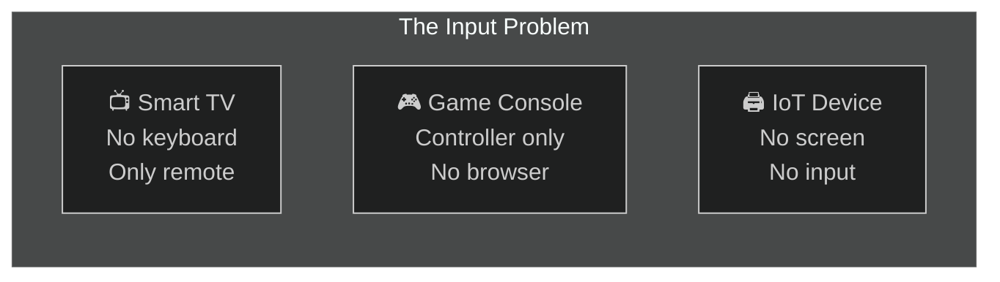
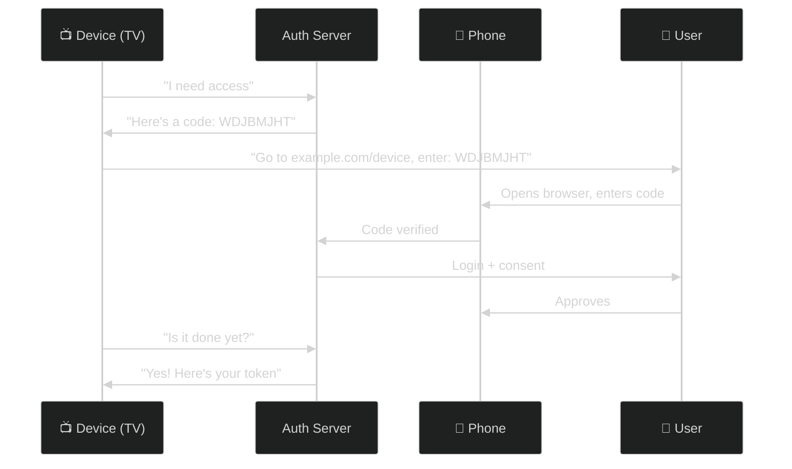
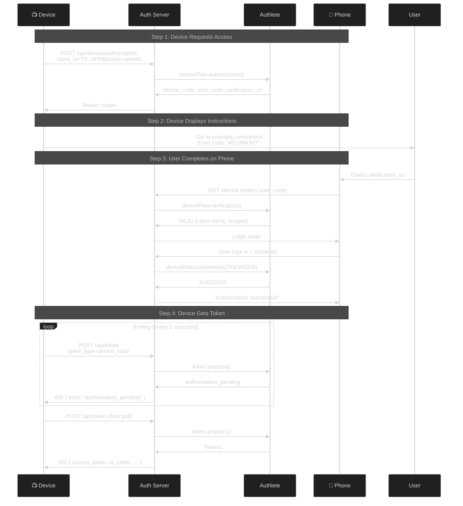
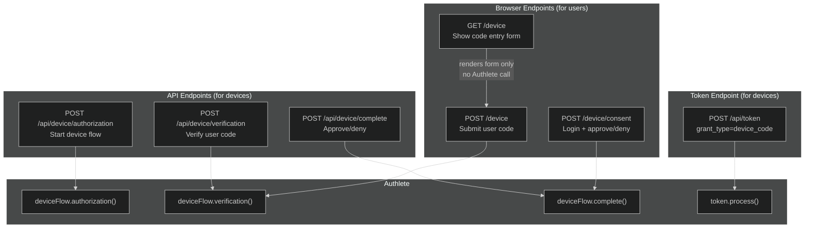
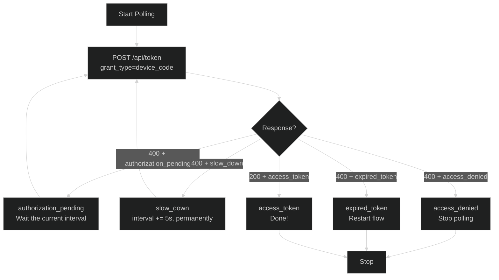

# OAuth 2.0 Device Authorization Grant (Device Flow) — RFC 8628

> **The short version:** Device Flow lets devices without keyboards (smart TVs, game consoles, IoT) get authorization by showing a code on screen while the user completes login on their phone.

---

## Table of Contents

- [Part 1: Why Device Flow Exists](#part-1-why-device-flow-exists)
- [Part 2: How Device Flow Works](#part-2-how-device-flow-works)
- [Part 3: Authlete Configuration](#part-3-authlete-configuration)
- [Part 4: Server Implementation](#part-4-server-implementation)
- [Part 5: Step-by-Step API Flow](#part-5-step-by-step-api-flow)
- [Part 6: Browser-Based Flow](#part-6-browser-based-flow)
- [Part 7: Token Endpoint — Polling](#part-7-token-endpoint--polling)
- [Part 8: SPA Testing Tool](#part-8-spa-testing-tool)
- [Part 9: Complete Test Scenarios](#part-9-complete-test-scenarios)
- [Part 10: Error Scenarios](#part-10-error-scenarios)
- [Part 11: RFC 8628 Compliance](#part-11-rfc-8628-compliance)
- [Part 12: Security Considerations](#part-12-security-considerations)
- [Part 13: Troubleshooting](#part-13-troubleshooting)

---

## Part 1: Why Device Flow Exists

### The Problem: Devices Without Keyboards

Imagine you're watching Netflix on your smart TV. You want to sign in, but the TV remote is terrible for typing. Even worse, some devices like IoT sensors or printers can't display a browser at all.



| Problem | What Happens | Why It Matters |
|---------|-------------|----------------|
| **No keyboard** | Can't type username/password on TV | Users give up |
| **No browser** | Can't redirect to login page | Standard OAuth fails |
| **Limited input** | Remote control navigation is painful | Bad user experience |
| **Security risk** | Typing passwords on shared screen | Shoulder surfing |

### The Solution: Split the Flow

Device Flow splits authorization into two parts:

1. **Device** shows a short code and URL
2. **User** enters the code on their phone
3. **Device** polls the server until approved



### When Should You Use Device Flow?

| Scenario | Use Device Flow? | Why |
|----------|:----------------:|-----|
| Smart TV app | **Yes** | Can't type, no browser |
| Game console | **Yes** | Controller input only |
| CLI tool | **Yes** | `gh` CLI uses this |
| IoT device | **Yes** | No screen or input |
| Mobile app | **No** | Can use standard OAuth |
| SPA | **No** | Can use standard OAuth |

---

## Part 2: How Device Flow Works

### The Complete Flow



### What Just Happened?

1. **Device** told the server: "I'm a TV app, I need access to openid scope."

2. **Authlete** generated two codes:
   - `device_code` — high-entropy, secret, used for polling
   - `user_code` — short, human-readable (`WDJBMJHT`), shown to user

3. **Device** displayed instructions: "Go to this URL, enter this code."

4. **User** opened their phone, went to the URL, entered the code, logged in, and approved.

5. **Device** kept polling the token endpoint every 5 seconds. While the user was logging in, it got `authorization_pending`.

6. **After approval**, the next poll returned the access token.

### Key Insight: No Redirect URI

Unlike standard OAuth, Device Flow doesn't need a redirect URI. The device **polls** instead of waiting for a callback. This is perfect for devices behind NAT or without a web server.

---

## Part 3: Authlete Configuration

### Service Settings

In the [Authlete Console](https://console.authlete.com/), go to **Service Settings → Endpoints → Device Flow**. These are the labels Authlete actually shows, not the raw JSON property names:

| Console label | JSON property | What to Enter | Required? |
|---------------|---------------|---------------|-----------|
| **Device Authorization Endpoint** | `deviceAuthorizationEndpoint` | `https://your-server.com/api/device/authorization` | Yes — advertised as `device_authorization_endpoint` |
| **Verification URI** | `deviceVerificationUri` | `https://your-server.com/device` | **Yes** — Authlete errors on `/device/authorization` if unset |
| **Verification URI with Placeholder** | `deviceVerificationUriComplete` | `https://your-server.com/device?user_code=USER_CODE` | Optional — must contain the literal string `USER_CODE` |
| **Verification Code Duration** | `deviceFlowCodeDuration` | `600` (10 minutes) | **Yes** — must be a positive number or the API errors |
| **Polling Interval** | `deviceFlowPollingInterval` | `5` (seconds) | Optional — range 0–65535 |
| **User Code Character Set** | `userCodeCharset` | `BASE20` or `NUMERIC` | Optional — defaults to `BASE20` |
| **User Code Length** | `userCodeLength` | `0` (use the default) | Optional — range 0–255 |

Under **Service Settings → Authorization → Supported Grant Types**, tick **`DEVICE_CODE`**. That is the console's enum name; the value that appears in the discovery document is the full URN `urn:ietf:params:oauth:grant-type:device_code`.

**Three things that bite people:**

- **Both URI settings must use the `https` scheme** and are capped at 200 ASCII characters. The `http://localhost:3000` values used throughout this tutorial are what *your server* returns locally — they are not necessarily accepted in the Authlete service configuration itself. For local development, point the service at an https tunnel (ngrok, Cloudflare Tunnel) or run the browser step against the URI your server serves regardless of what Authlete advertises.
- **If Polling Interval is `0`, Authlete omits `interval` from the response entirely.** Clients then fall back to the RFC 8628 default of 5 seconds. Set it explicitly if you want the value advertised.
- **`verification_uri_complete` only appears if you set Verification URI with Placeholder.** Authlete substitutes the real code for the `USER_CODE` placeholder. Leave it blank and the field is simply absent from the response.

### What a Generated User Code Looks Like

With the default `BASE20` charset, Authlete builds codes from the 20 non-vowel uppercase letters `BCDFGHJKLMNPQRSTVWXZ` — vowels are excluded so the code can never spell an unfortunate word. Default length is 8, giving 20⁸ ≈ 25.6 billion combinations. With `NUMERIC` the alphabet is `0-9` and the default length is 9 (10⁹).

**Authlete does not insert a hyphen.** A real code looks like `WDJBMJHT`, not `WDJB-MJHT`. The hyphenated form you see in RFC 8628 is the spec's illustrative example; RFC 8628 §6.1 recommends the *server* strip punctuation from user input, so adding a display hyphen is a presentation choice your device UI can make on its own.

> `UNVERIFIED` — whether Authlete's `/device/verification` API lowercases, uppercases, or strips punctuation before matching is not stated in the published Authlete documentation. Do not rely on lenient matching. Uppercase and strip dashes in your own UI before submitting, per RFC 8628 §6.1.

### Verify in Discovery Document

```bash
curl http://localhost:3000/api/.well-known/openid-configuration | jq '.device_authorization_endpoint, .grant_types_supported'
```

Expected output:
```
"https://your-server.com/api/device/authorization"
["authorization_code", "client_credentials", "refresh_token", "urn:ietf:params:oauth:grant-type:device_code"]
```

### Client Settings

The grant type has to be enabled on the **client** too, not just the service. In the Client Developer Console:

| Setting | Value for a typical device | Why |
|---------|---------------------------|-----|
| **Client Type** | `PUBLIC` | A TV or IoT device cannot keep a secret — RFC 8628 §5.6 |
| **Grant Types** | Enable `DEVICE_CODE` | Without this the token request is rejected |
| **[Token Endpoint] Client Authentication Method** | `NONE` | Public clients do not authenticate; `client_id` alone identifies them |

This is the configuration Authlete's own guide recommends, and it is what real devices need.

**The curl examples in this tutorial use a confidential client instead** (`-u "$CID:$SEC"`, plus `clientSecret` in the JSON body) because it is easier to test from a terminal and matches the credentials most people already have on hand. If you follow the public-client configuration above, drop the `-u` flag and the `clientSecret` field and pass `client_id` inside `parameters` instead:

```bash
# Public client — no secret anywhere
curl -X POST http://localhost:3000/api/device/authorization \
  -H "Content-Type: application/json" \
  -d '{"parameters": "client_id=YOUR_CLIENT_ID&scope=openid+profile"}'
```

> If you do use a confidential client, its **Client Authentication Method must match how you send the credentials**. A client set to `CLIENT_SECRET_POST` will reject `-u` (HTTP Basic) with `invalid_client` — send `client_id` and `client_secret` in the body instead.

---

## Part 4: Server Implementation

### Architecture



`GET /device` does **not** call Authlete — it only renders the code-entry form (pre-filling `user_code` from the query string when the user arrived via `verification_uri_complete`). The first Authlete call on the browser path happens on `POST /device`.

### Why Two Sets of Endpoints?

| Endpoint Set | Who Uses It | Purpose |
|-------------|-------------|---------|
| **API** (`/api/device/*`) | Devices (programmatic) | Start flow, verify code, approve/deny |
| **Browser** (`/device`) | Users (human) | Enter code, login, consent |

The API endpoints are for testing tools and programmatic clients. The browser endpoints are what real users interact with.

---

## Part 5: Step-by-Step API Flow

### Step 1: Device Requests Access

```bash
curl -X POST http://localhost:3000/api/device/authorization \
  -H "Content-Type: application/json" \
  -d '{
    "parameters": "client_id=YOUR_CLIENT_ID&scope=openid+profile",
    "clientId": "YOUR_CLIENT_ID",
    "clientSecret": "YOUR_CLIENT_SECRET"
  }'
```

**Response (200):**
```json
{
  "device_code": "GmRhmhcxhwAzkoEqiMEg_DnyEysNkuNhszIySk9eS",
  "user_code": "WDJBMJHT",
  "verification_uri": "http://localhost:3000/device",
  "verification_uri_complete": "http://localhost:3000/device?user_code=WDJBMJHT",
  "expires_in": 600,
  "interval": 5
}
```

**Reading the response:**

| Field | RFC 8628 | Notes |
|-------|----------|-------|
| `device_code` | §3.2 REQUIRED | High entropy, secret. Never show this to the user. |
| `user_code` | §3.2 REQUIRED | What the user types. |
| `verification_uri` | §3.2 REQUIRED | Comes straight from your **Verification URI** service setting. |
| `verification_uri_complete` | §3.3.1 OPTIONAL | **Absent** unless you configured Verification URI with Placeholder. |
| `expires_in` | §3.2 REQUIRED | Mirrors your **Verification Code Duration** setting — there is no built-in default. |
| `interval` | §3.2 OPTIONAL | **Absent** if Polling Interval is `0`; clients then assume 5 seconds. |

> ### The boundary is still there — the server now stands on the right side of it
>
> **Until 2026-08-14 this endpoint returned Authlete's own shape**: `deviceCode`, `userCode`,
> `verificationUri`, `expiresIn`, alongside an `action` and a `resultCode`. This tutorial documented that and
> excused it — *"This server exposes the Authlete shape directly so you can see what the SDK returns; a
> production device authorization endpoint would rename them."* **A device implementing RFC 8628 §3.2 reads
> `device_code`. It would have found nothing.** That was work item **8628-W3**.
>
> **The renaming was never needed.** Authlete's response carries a `responseContent` member which *is* §3.2's
> JSON, snake_case and complete — the server was returning the envelope *around* the answer instead of the
> answer. Forwarding `responseContent` is a one-line change, and `token.controller.ts` had always done it.
>
> **The distinction the old note was reaching for is still worth having**, so here it is properly: Authlete
> speaks camelCase because its API is a *vendor* API, and every endpoint in this repo that faces a client has
> to translate. What changed is which side of that boundary the client sees. You can still watch the vendor
> shape go past — set `LOG_LEVEL=debug` and the service logs the Authlete response — and the two endpoints
> with **no** specification shape (`/api/device/verification`, `/api/device/complete`) still return the
> envelope, because there is no RFC body for them to be. Their Authlete responses have no `responseContent`
> member at all.

### Step 2: Display to User

The device shows:
```
┌─────────────────────────────────────────┐
│                                         │
│  Using a browser on another device,     │
│  visit: http://localhost:3000/device    │
│                                         │
│  And enter the code:                    │
│  WDJBMJHT                              │
│                                         │
└─────────────────────────────────────────┘
```

### Step 3: User Enters Code on Phone

1. Opens `http://localhost:3000/device`
2. Enters `WDJBMJHT`
3. Sees consent page with client name and scopes
4. Logs in (default: `admin` / `password`)
5. Clicks **Authorize**

### Step 4: Device Polls for Token

```bash
# While waiting for user
curl -X POST http://localhost:3000/api/token \
  -u "YOUR_CLIENT_ID:YOUR_CLIENT_SECRET" \
  -H "Content-Type: application/x-www-form-urlencoded" \
  -d "grant_type=urn:ietf:params:oauth:grant-type:device_code" \
  -d "device_code=GmRhmhcxhwAzkoEqiMEg_DnyEysNkuNhszIySk9eS"
```

**While pending:**
```json
HTTP/1.1 400 Bad Request
{"error": "authorization_pending"}
```

**After approval:**
```json
{
  "access_token": "FOMxkE5baq...",
  "token_type": "Bearer",
  "expires_in": 86400,
  "scope": "openid profile",
  "id_token": "eyJhbGciOiJSUzI1NiIs..."
}
```

---

## Part 6: Browser-Based Flow

This is what real end users see.

### Step 1: User Visits Device Page

Opens phone browser to `http://localhost:3000/device`:

```
┌─────────────────────────────────────────┐
│                                         │
│  Device Verification                    │
│                                         │
│  Enter the code displayed on your       │
│  device to sign in.                     │
│                                         │
│  User Code                              │
│  ┌─────────────────────────────────┐    │
│  │  WDJBMJHT                       │    │
│  └─────────────────────────────────┘    │
│                                         │
│  [Verify]                               │
│                                         │
└─────────────────────────────────────────┘
```

### Step 2: User Sees Consent Page

After entering the code:

```
┌─────────────────────────────────────────┐
│                                         │
│  ┌─┐                                   │
│  │T│  Your TV App                       │
│  └─┘  requesting access to your account │
│                                         │
│  This device would like to:             │
│  • openid                               │
│  • profile                              │
│                                         │
│  Username                               │
│  ┌─────────────────────────────────┐    │
│  │  admin                          │    │
│  └─────────────────────────────────┘    │
│  Password                               │
│  ┌─────────────────────────────────┐    │
│  │  ••••••••                       │    │
│  └─────────────────────────────────┘    │
│                                         │
│  [Authorize]  [Deny]                    │
│                                         │
└─────────────────────────────────────────┘
```

### Step 3: Success

After clicking **Authorize**:

```
┌─────────────────────────────────────────┐
│                                         │
│  ✓ Authorization Successful             │
│                                         │
│  You can now close this window.         │
│                                         │
└─────────────────────────────────────────┘
```

---

## Part 7: Token Endpoint — Polling

### The Polling Pattern

The device keeps asking "Is the user done yet?" until approved or timeout.



### Polling Rules

| Rule | Value | Why |
|------|-------|-----|
| Initial interval | The `interval` from the authorization response | Comes from your **Polling Interval** service setting |
| Interval when `interval` is absent | 5 seconds | RFC 8628 §3.2 default, used when Polling Interval is `0` |
| `slow_down` increment | +5 seconds | RFC 8628 §3.5: "the interval MUST be increased by 5 seconds for this and all subsequent requests" |
| Maximum interval | Not specified | Be reasonable — the code expires anyway |
| Timeout | `expires_in` | Whatever **Verification Code Duration** is set to; there is no built-in default |

**The `slow_down` increase is permanent, not a one-off pause.** RFC 8628 §3.5 says "this and all subsequent requests" — once you have been told to slow down, every later poll uses the raised interval. Resetting back to the original interval after one slow poll is the most common client-side bug here.

### Example Polling Script

```bash
#!/bin/bash
DEVICE_CODE="GmRhmhcxhwAzkoEqiMEg_DnyEysNkuNhszIySk9eS"
CID="YOUR_CLIENT_ID"
SEC="YOUR_CLIENT_SECRET"
INTERVAL=5

while true; do
  RESP=$(curl -s -w "\n%{http_code}" -X POST http://localhost:3000/api/token \
    -u "$CID:$SEC" \
    -d "grant_type=urn:ietf:params:oauth:grant-type:device_code&device_code=$DEVICE_CODE")
  
  HTTP_CODE=$(echo "$RESP" | tail -n1)
  BODY=$(echo "$RESP" | head -n-1)
  
  if [ "$HTTP_CODE" = "200" ]; then
    echo "Success! $BODY"
    break
  elif echo "$BODY" | grep -q '"error":"slow_down"'; then
    INTERVAL=$((INTERVAL + 5))
  elif echo "$BODY" | grep -q '"error":"authorization_pending"'; then
    echo "Waiting... (interval: ${INTERVAL}s)"
  else
    echo "Error: $BODY"
    break
  fi
  
  sleep $INTERVAL
done
```

---

## Part 8: SPA Testing Tool

### Accessing Device Flow

1. Start the server: `npm --prefix server run dev`
2. Start the client: `npm --prefix client run dev`
3. Open `http://localhost:3001`
4. Click **Device Flow** in the sidebar

### Four Tabs

| Tab | Purpose | What You Enter |
|-----|---------|----------------|
| **Authorization** | Start device flow | Parameters (URL-encoded), Client ID, Client Secret (leave empty for public clients) |
| **Verification** | Verify user code | User Code — auto-filled from the Authorization response |
| **Complete** | Approve/deny | User Code, Result (`AUTHORIZED` / `ACCESS_DENIED` / `TRANSACTION_FAILED`), Subject |
| **Poll Token** | Poll the token endpoint | Device Code (auto-filled), Client ID, Client Secret, auth method, poll interval |

### Testing Workflow

1. **Authorization tab:** Click **Run** → get `device_code` and `user_code`. Both are auto-filled into the later tabs.
2. **Verification tab:** Click **Run** → see the client name and scopes Authlete has on file.
3. **Complete tab:** Select `AUTHORIZED`, click **Run** → approved.
4. **Poll Token tab:** Click **Start Polling** → the SPA polls `/api/token` on the interval you chose and stops on success.

The poller shows attempts, elapsed time, and the active interval, and it auto-stops on the terminal errors `expired_token`, `access_denied`, `invalid_grant`, `invalid_client` and `invalid_request`. Switching tabs or unmounting the section clears the timer.

> **Two caveats about the built-in poller.** It uses whatever fixed interval you select and does **not** raise that interval when the server returns `slow_down` — RFC 8628 §3.5 requires a real client to add 5 seconds and keep it. And the interval dropdown is a fixed list, not the `interval` value from your authorization response. It is a debugging tool, not a reference client implementation. The bash loop in [Part 7](#part-7-token-endpoint--polling) does handle `slow_down` correctly.

---

## Part 9: Complete Test Scenarios

### Scenario 1: Happy Path

```bash
# 1. Start device flow
DEVICE_RESP=$(curl -s -X POST http://localhost:3000/api/device/authorization \
  -H "Content-Type: application/json" \
  -d '{
    "parameters": "client_id=YOUR_CID&scope=openid+profile",
    "clientId": "YOUR_CID",
    "clientSecret": "YOUR_SEC"
  }')

DEVICE_CODE=$(echo $DEVICE_RESP | jq -r '.device_code')
USER_CODE=$(echo $DEVICE_RESP | jq -r '.user_code')

echo "User code: $USER_CODE"

# 2. Verify user code
curl -s -X POST http://localhost:3000/api/device/verification \
  -H "Content-Type: application/json" \
  -d "{\"userCode\": \"$USER_CODE\"}" | jq .

# 3. Approve
curl -s -X POST http://localhost:3000/api/device/complete \
  -H "Content-Type: application/json" \
  -d "{\"userCode\": \"$USER_CODE\", \"result\": \"AUTHORIZED\", \"subject\": \"admin\"}" | jq .

# 4. Exchange for token
curl -s -X POST http://localhost:3000/api/token \
  -u "YOUR_CID:YOUR_SEC" \
  -d "grant_type=urn:ietf:params:oauth:grant-type:device_code&device_code=$DEVICE_CODE" | jq .
```

> **This shortcut skips the human, and only works in development.** Step 3 above approves the request by calling `/api/device/complete` directly with a `subject` you picked — no password, no session, no consent screen. That is exactly what makes it convenient for testing and exactly why it is **not** a production pattern — so since 2026-08-10 the endpoint answers `404` unless `NODE_ENV=development`. See [Part 12](#part-12-security-considerations) before you copy this anywhere real. The browser flow in [Part 6](#part-6-browser-based-flow) is the one that actually authenticates the user.

### Scenario 2: User Denies Access

```bash
# Steps 1-2: Same as above

# 3. Deny
curl -s -X POST http://localhost:3000/api/device/complete \
  -H "Content-Type: application/json" \
  -d "{\"userCode\": \"$USER_CODE\", \"result\": \"ACCESS_DENIED\", \"subject\": \"admin\"}" | jq .

# 4. Token exchange fails
# Response: 400 { "error": "access_denied" }
```

### Scenario 3: Expired Code

```bash
# Start flow
DEVICE_RESP=$(curl -s -X POST http://localhost:3000/api/device/authorization \
  -H "Content-Type: application/json" \
  -d '{"parameters": "client_id=YOUR_CID&scope=openid", "clientId": "YOUR_CID", "clientSecret": "YOUR_SEC"}')

USER_CODE=$(echo $DEVICE_RESP | jq -r '.user_code')

# Wait for expiration — read the real lifetime off the response, don't hardcode it.
# expires_in mirrors your "Verification Code Duration" service setting.
EXPIRES_IN=$(echo $DEVICE_RESP | jq -r '.expires_in')
sleep $((EXPIRES_IN + 1))

# Try to verify — fails
curl -s -X POST http://localhost:3000/api/device/verification \
  -H "Content-Type: application/json" \
  -d "{\"userCode\": \"$USER_CODE\"}" | jq .
# Response: 400 { "action": "EXPIRED" }
```

> `UNVERIFIED` — whether Authlete returns `EXPIRED` indefinitely or eventually garbage-collects the record and returns `NOT_EXIST` is not documented. Treat **either** as "this code is dead, start over."

---

## Part 10: Error Scenarios

Authlete's device APIs return an `action` string rather than an HTTP status. This server maps each `action` to a status code — the mapping lives in `server/src/controllers/device.controller.ts`.

### Authorization Errors — `POST /api/device/authorization`

| Authlete `action` | HTTP Status | Cause | Fix |
|-------------------|:-----------:|-------|-----|
| *(request never reaches Authlete)* | 400 `invalid_request` | Missing `parameters` field | Include `"parameters": "client_id=...&scope=..."` |
| `BAD_REQUEST` | 400 | Malformed request, or **Verification URI / Verification Code Duration not configured** | Finish the service settings in [Part 3](#part-3-authlete-configuration) |
| `UNAUTHORIZED` | 401 | Client authentication failed | Check `client_id`/`client_secret` and the client's authentication method |
| `INTERNAL_SERVER_ERROR` | 500 | Authlete-side failure | Check server logs |
| `OK` | 200 | Success | — |

### Verification Errors — `POST /api/device/verification`

| Authlete `action` | HTTP Status | Cause | Fix |
|-------------------|:-----------:|-------|-----|
| `VALID` | 200 | Code recognized | Response carries `clientName` and `scopes` |
| `NOT_EXIST` | 404 | No such code | Check for typos — uppercase the input and strip dashes first (RFC 8628 §6.1) |
| `EXPIRED` | 400 | Code expired | Restart flow from Step 1 |
| `INTERNAL_SERVER_ERROR` | 500 | Authlete-side failure | Check server logs |

### Completion Errors — `POST /api/device/complete`

| Authlete `action` | HTTP Status | Cause |
|-------------------|:-----------:|-------|
| `SUCCESS` | 200 | Decision recorded; the device's next poll will reflect it |
| `USER_CODE_NOT_EXIST` | 404 | No such code |
| `USER_CODE_EXPIRED` | 400 | Code expired before the user finished |
| `INVALID_REQUEST` | 400 | Missing or malformed `userCode`/`result`/`subject` |
| `SERVER_ERROR` | 500 | Authlete-side failure |

The `result` field accepts exactly three values — `AUTHORIZED`, `ACCESS_DENIED`, and `TRANSACTION_FAILED` — as defined by `DeviceCompleteRequestResult` in the Authlete TypeScript SDK. Use `TRANSACTION_FAILED` when your own processing broke for a reason that is not the user refusing. `subject` is required by the SDK type on every call, including denials.

### Polling Errors

| HTTP Status | Error | Device Action |
|:-----------:|-------|---------------|
| 400 | `authorization_pending` | Keep polling |
| 400 | `slow_down` | Increase interval by 5s |
| 400 | `access_denied` | Stop polling |
| 400 | `expired_token` | Stop polling, restart |
| 400 | `invalid_grant` | Stop polling, check code |
| 401 | `invalid_client` | Check credentials |

---

## Part 11: RFC 8628 Compliance

RFC 8628 is [published as a Proposed Standard](https://datatracker.ietf.org/doc/html/rfc8628) (August 2019). Section titles below are quoted from it directly.

| RFC 8628 Section | Requirement | Status | Who provides it |
|------------------|-------------|:------:|-----------------|
| §3.1 Device Authorization Request | Endpoint accepts `POST` with `application/x-www-form-urlencoded` | ✅ | Authlete |
| §3.1 | Accepts `client_id` and `scope` | ✅ | Authlete |
| §3.2 Device Authorization Response | Includes REQUIRED `device_code`, `user_code`, `verification_uri`, `expires_in` | ✅ | Authlete |
| §3.2 | `verification_uri_complete` is OPTIONAL — emitted only when configured | ✅ | Authlete |
| §3.2 | `interval` is OPTIONAL; default 5 when absent | ✅ | Authlete |
| §3.3 User Interaction | User navigates to `verification_uri` and authenticates over TLS | ⚠️ | This server — TLS depends on your deployment; local dev is plain HTTP |
| §3.3.1 Non-Textual Verification URI Optimization | When `verification_uri_complete` is used, server SHOULD display the `user_code` back and ask the user to confirm it matches the device | ❌ | **Not implemented** — see [Part 12](#part-12-security-considerations) |
| §3.4 Device Access Token Request | `grant_type` MUST be `urn:ietf:params:oauth:grant-type:device_code`; `device_code` REQUIRED; `client_id` REQUIRED if the client does not authenticate | ✅ | Authlete `/auth/token` |
| §3.5 Device Access Token Response | `authorization_pending` while the user has not finished | ✅ | Authlete |
| §3.5 | `slow_down` — client MUST raise its interval by 5s for this and all later requests | ✅ | Authlete emits it; honoring it is the device's job |
| §3.5 | `access_denied` when the user refuses | ✅ | Authlete |
| §3.5 | `expired_token` once the `device_code` expires | ✅ | Authlete |
| §4 Discovery Metadata | `device_authorization_endpoint` published in AS metadata | ✅ | Authlete discovery document |
| §5.1 User Code Brute Forcing | Rate-limit or otherwise throttle `user_code` attempts | ⚠️ | **Partial** — see the note below |
| §5.2 Device Code Brute Forcing | "a very high entropy code SHOULD be used" for `device_code` | ✅ | Authlete |
| §5.6 Non-Confidential Clients | Public device clients are supported without a secret | ✅ | Authlete, when the client is configured `PUBLIC` / auth method `NONE` |
| §6.1 User Code Recommendations | Case-insensitive letters, no vowels, high enough entropy | ✅ | Authlete `BASE20` (20⁸) or `NUMERIC` (10⁹) |

**About the §5.1 ⚠️:** the two paths are not protected equally in this repo.

| Path | Protection | Source |
|------|-----------|--------|
| `POST /device` (browser code entry) | `deviceCodeLimiter` — **5/min/IP** (since 2026-08-10; was `generalLimiter` at 60/min) | `server/src/routes/device.routes.ts` |
| `POST /device/consent` (login + approve) | `generalLimiter` — 60/min/IP. **Not** the 5/min `loginLimiter` and **not** the brute-force IP ban used by `/api/session/login` | `server/src/routes/device.routes.ts` |
| `POST /api/device/verification` | `deviceCodeLimiter` — **5/min/IP** (since 2026-08-10; previously none) | `server/src/routes/device.routes.ts` |
| `POST /api/device/complete` | **Development-only** since 2026-08-10 — a flat `404` in every other environment — plus `deviceCodeLimiter`. Still unauthenticated *within* development | `server/src/routes/device.routes.ts` |

Do not talk yourself out of this one on entropy grounds. A `BASE20` 8-character code is 20⁸ ≈ 2.6 × 10¹⁰ combinations — about **34.5 bits**, which RFC 8628 §5.1 itself calls out as "typically less than would be used for the device code," precisely because the user has to type it. That is *why* the spec says "it is recommended that the server rate-limit user code attempts." 34.5 bits is comfortable against a throttled attacker and much less comfortable against an unthrottled one. A limiter is now on both verification paths (`deviceCodeLimiter`, 5/min) — sized against the RFC's own worked example, which assumes roughly five attempts.

---

## Part 12: Security Considerations

### User Code Brute Force

| Risk | Mitigation |
|------|-----------|
| Short code (`WDJBMJHT`) has low entropy | Rate limiting on verification endpoint |
| Attacker could guess codes | Finite lifetime (`expires_in`) |
| Code visible on device screen | Consent page shows client name + scopes so the user can sanity-check what they are approving |

### Device Code Security

| Risk | Mitigation |
|------|-----------|
| Device code could be intercepted | High-entropy string, never displayed to the user |
| Polling could be intercepted | Bound to the `client_id` the code was issued to |
| Code reuse attempts | Single-use after approval |

### Known Gaps in This Implementation

This repo is a teaching and debugging server. Three things here are deliberately looser than a production deployment should be, and you should know which is which.

**1. `POST /api/device/complete` is unauthenticated — and is now development-only for that reason (fixed 2026-08-10).** Anyone who could reach it and knew a live `user_code` could approve that session as *any* `subject` they named — no password, no session, no consent — and the device's next token poll returned a token for that subject. It is now gated by `middleware/development-only.ts` and answers a flat `404` unless `NODE_ENV=development`; the gate is asserted in `tests/unit/routes/device.routes.test.ts`. The browser path (`POST /device/consent`) authenticates via `LoginService.validateUser` and is available in every environment, so the two paths always had very different trust properties despite driving the same Authlete API. The lesson stands whether or not the gate is there: **`/device/complete` must run only after you have authenticated the user yourself** — a `subject` parameter supplied by the caller is a claim, not evidence.

**2. The user code is never echoed back on the consent screen — RFC 8628 §3.3.1.** When the user arrives through `verification_uri_complete` (the QR-code path), the code is pre-filled and submitted for them, so they never see what they are confirming. The spec says the server "SHOULD display the `user_code` to the user and ask them to verify that it matches the `user_code` being displayed on the device" — that check is what stops an attacker from getting a victim to approve the *attacker's* session by scanning a code (§5.4 Remote Phishing). The consent view in `server/src/views/device-verification.ejs` carries `user_code` only as a hidden field.

**3. `/device/consent` performs a password login without login-grade throttling.** It uses `generalLimiter` (60/min/IP) rather than the `loginLimiter` (5/min) and IP-ban brute-force protection that `/api/session/login` gets. That is a weaker password endpoint than the main login route.

### CSRF Protection

The browser routes do use CSRF tokens:
- `GET /device` — generates the token
- `POST /device` — validates it
- `POST /device/consent` — validates it

The `/api/device/*` endpoints do **not** use CSRF protection. They are JSON APIs meant for programmatic callers, not browser form posts — but combined with gap 1 above, that means a `/api/device/complete` call needs nothing more than the URL and a live user code.

### Transport

RFC 8628 §3.3 expects the user to authenticate "in a secure TLS-protected session," and Authlete requires `https` on the Verification URI service settings. The `http://localhost` URLs in this tutorial are a local-development convenience. Anything reachable off your machine must be HTTPS.

---

## Part 13: Troubleshooting

| Problem | Likely Cause | Solution |
|---------|-------------|----------|
| "Missing required body field: parameters" | `parameters` not in body | Add `"parameters": "client_id=...&scope=..."` |
| "authorization_pending" forever | User hasn't completed flow | Verify user entered correct code on phone |
| "expired_token" | Codes expired | Restart flow from beginning |
| 404 "NOT_EXIST" on verification | Wrong code | Uppercase the input and strip dashes before submitting (RFC 8628 §6.1). Authlete's `BASE20` alphabet is `BCDFGHJKLMNPQRSTVWXZ` — no vowels, no digits, no hyphen |
| "Invalid credentials" on browser | Wrong username/password | Default is `admin` / `password` (or whatever `AUTH_USERS` sets) |
| 401 "invalid_client" | Wrong credentials, or wrong auth *method* | Check `client_id`/`client_secret`, then check the client's Client Authentication Method — `CLIENT_SECRET_POST` rejects HTTP Basic (`-u`) |
| 400 `BAD_REQUEST` on `/api/device/authorization` with valid credentials | **Verification URI** or **Verification Code Duration** not set on the service | Both are mandatory for device flow — see [Part 3](#part-3-authlete-configuration) |
| No `interval` in the authorization response | **Polling Interval** is `0` | Set it, or have the device fall back to 5 seconds per RFC 8628 §3.2 |
| No `verificationUriComplete` in the response | **Verification URI with Placeholder** not set | Set it to a URL containing the literal `USER_CODE` |
| Device flow not in discovery | Not configured in Authlete | Enable `DEVICE_CODE` in Supported Grant Types (service **and** client) and set the endpoints |
| Token request rejected though the service allows device flow | Client's Grant Types missing `DEVICE_CODE` | Enable it on the client too, not just the service |
| "slow_down" too often | Polling too fast | Add 5s to your interval and **keep** it there for all later polls |

---

## Summary

Device Flow is simple but powerful:

1. **Device** requests codes → gets `device_code` + `user_code`
2. **User** enters `user_code` on phone → logs in + approves
3. **Device** polls until approved → gets access token

**Use Device Flow when:**
- Device can't open a browser
- Device has limited input
- User has a secondary device (phone)

**Don't use Device Flow when:**
- Device can use standard OAuth (smartphones, desktops)

---

## References

**Specification**

- [RFC 8628: OAuth 2.0 Device Authorization Grant](https://datatracker.ietf.org/doc/html/rfc8628) — published RFC, Proposed Standard, August 2019. The normative source for everything in Part 11.

**Authlete documentation** — vendor behavior, not normative spec. Where the two differ, this tutorial says so.

- [Device Flow (OAuth 2.0 Device Authorization Grant)](https://www.authlete.com/developers/device_flow/) — the overview of Authlete's `/device/authorization`, `/device/verification` and `/device/complete` APIs. Device flow is supported from Authlete 2.1 onward.
- [Enabling "device flow"](https://www.authlete.com/kb/oauth-and-openid-connect/device-flow-rfc-8628/enabling-device-flow/) — the service and client console settings, with the exact labels used in [Part 3](#part-3-authlete-configuration).
- [Enabling Device Flow (v2 configuration reference)](https://developers.authlete.com/v2/configuration-reference/endpoints/enabling-device-flow) — the same settings in the v2 configuration reference.
- [OAuth 2.0 Device Authorization Grant (Device Flow)](https://developers.authlete.com/protocols-and-flows/advanced-flows/oauth-2-0-device-authorization-grant-device-flow) — the developer-portal guide.
- [Service Settings](https://www.authlete.com/kb/operations/service-configuration/service-settings/) — authoritative descriptions and value ranges for `deviceFlowCodeDuration`, `deviceFlowPollingInterval`, `userCodeCharset` and `userCodeLength`.

**Working example**

- [GitHub: Device flow](https://docs.github.com/en/apps/oauth-apps/building-oauth-apps/authorizing-oauth-apps#device-flow) — a large, public RFC 8628 deployment, including its own rate-limit and error-code documentation.
