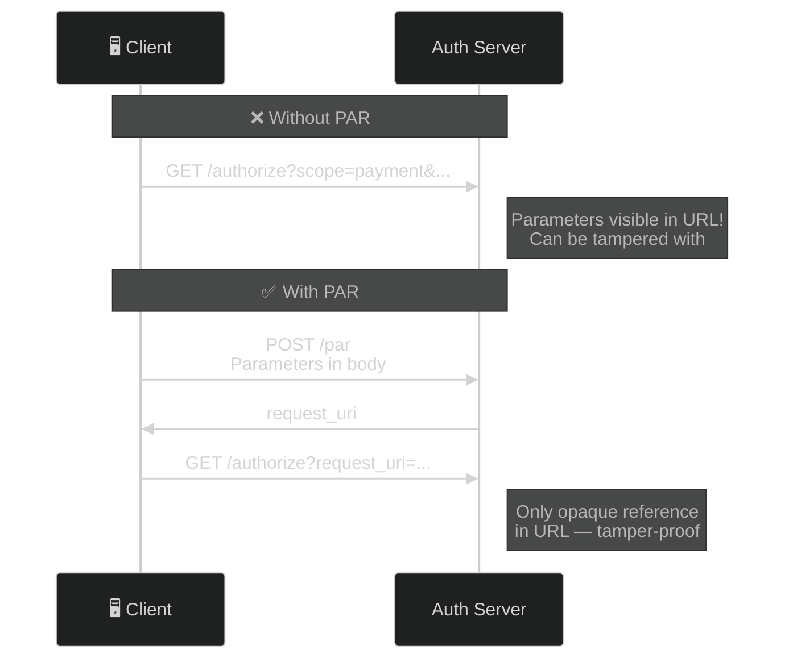
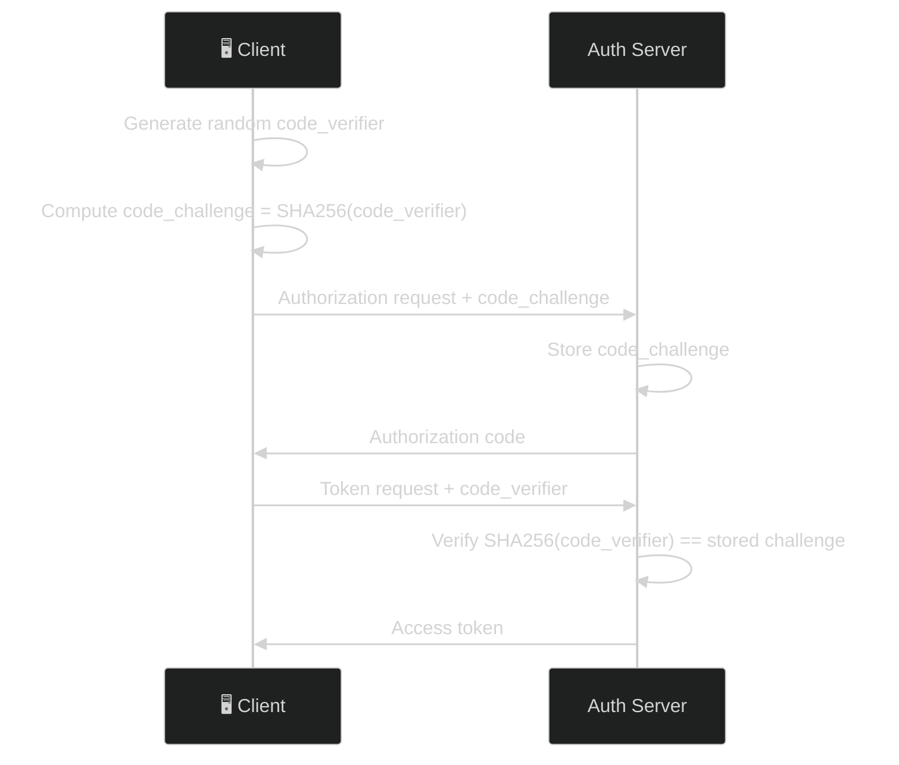
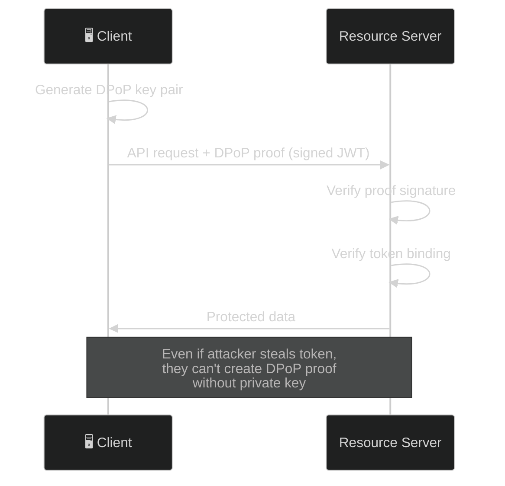
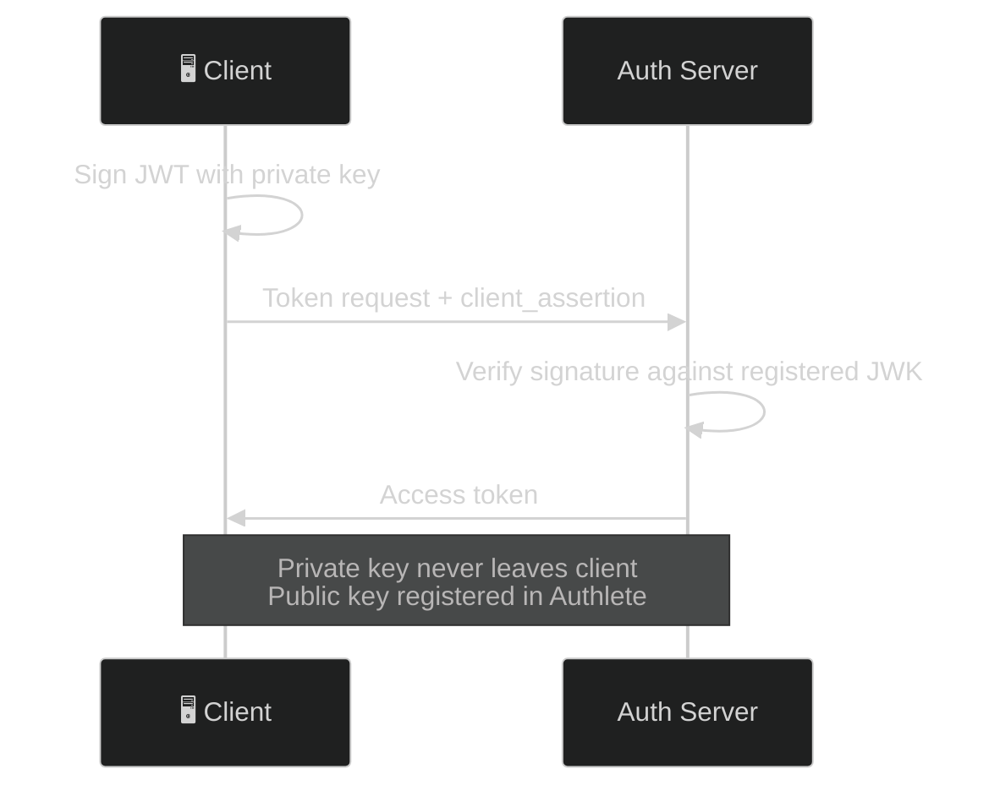
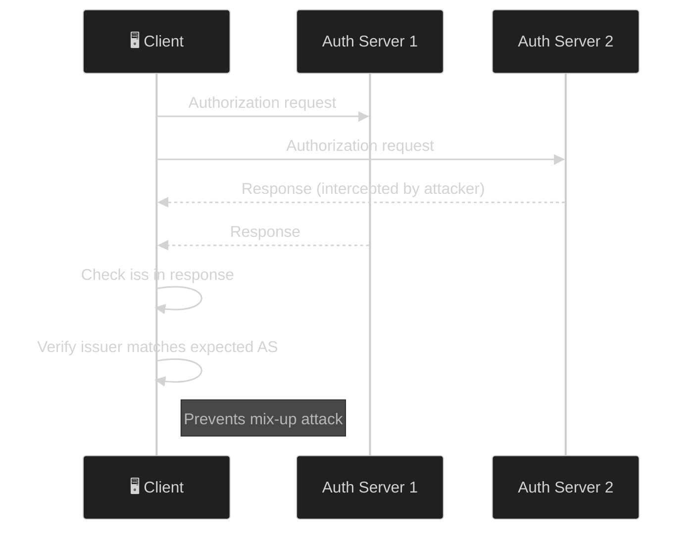
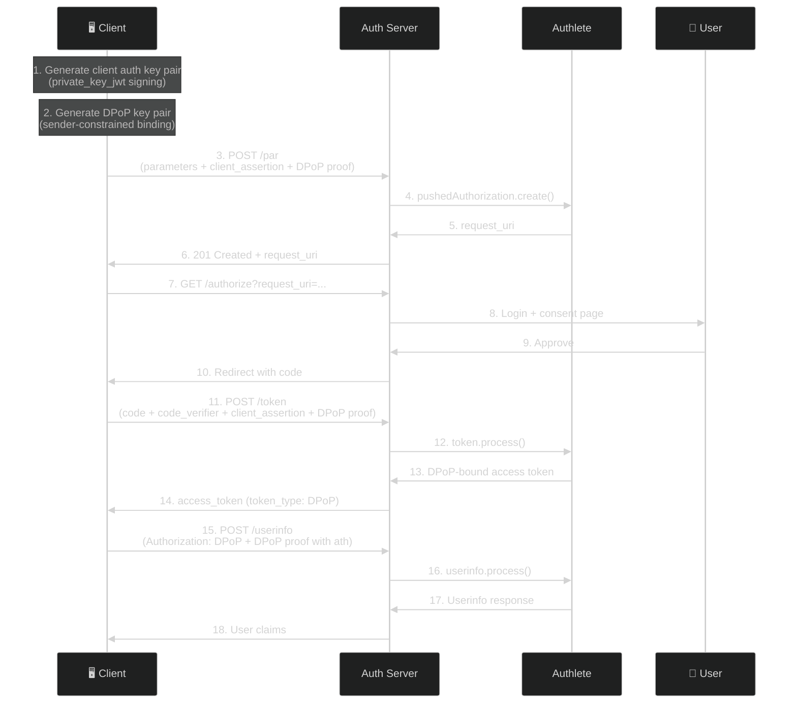

# FAPI 2.0 Security Profile — The Complete Guide

> **The short version:** FAPI 2.0 SP is a security profile that adds PAR, PKCE, DPoP sender-constrained tokens, and `private_key_jwt` client authentication to standard OAuth — making token theft virtually impossible.

> ### ⚠️ This file is two documents, and only one of them was run
>
> Labels are **captured** / *illustrative* / **`UNVERIFIED`** — defined once in
> [the tutorial index](README.md#how-to-read-the-transcripts-in-these-tutorials).
>
> | Part | Status |
> |---|---|
> | [Part 5](#part-5-client-demo-walkthrough) (the reporting endpoints) and [Part 6](#part-6-failure-demonstrations) (the DPoP failure demos) | **captured** — every response in Part 6 was run against this server, and Part 5 identified the hardcoded-literal bug before the audit did |
> | [Part 3](#part-3-authlete-console-setup) (console setup) and [Part 4](#part-4-step-by-step-fapi-flow) (the flow) | **`UNVERIFIED`** — they describe a *correctly configured* FAPI 2.0 service, which this deployment is not |
>
> **Nothing distinguished those two halves for a reader until 2026-08-14.** The precise gaps, live as of that
> date:
>
> | FAPI 2.0 SP requires | Live value here | Effect on Part 4 |
> |---|---|---|
> | `fapiModes` including `FAPI2_SECURITY` | **absent** — `/api/fapi/config` reports `mode: "disabled"` | Authlete enforces no FAPI rule anywhere in the flow |
> | a scope carrying the `fapi2=sp` attribute | **`fapi_scope` is not a registered scope** | unknown scopes are silently dropped (`scopeRequired` is `false`), so the request *succeeds* with no FAPI enforcement and no error |
> | PAR required | `parRequired` **`false`** on the service and on all four clients | PAR works, but nothing obliges a client to use it |
> | `dpopNonceRequired` for the nonce dance | **`false`** (`dpopNonceDuration` 0) — **off by decision** ([DR-20](../audit/05-decision-records.md#dr-20--dpop-nonces-dpopnoncerequired), 2026-08-17), not by oversight | **the `DPoP-Nonce` response headers shown in Part 4 cannot appear here** — though the dance itself is captured, see [Step 3](#step-3-push-authorization-request-par) |
>
> **Two of Part 3's prerequisites *are* satisfied**, and were not when this file was written: client
> `2176571218` has `tokenAuthMethod = PRIVATE_KEY_JWT` with a registered JWK Set (created 2026-08-12), and
> `pkceRequired`/`pkceS256Required` are `true` on it (2026-08-13). So Steps 1, 2, 3 and 5 of Part 4 are
> runnable against that client; what is not runnable is *FAPI enforcement* of them.
>
> **The second row is the trap.** A missing FAPI mode produces an error you can look up. A missing scope
> attribute produces a **200** and a flow that quietly is not FAPI at all. Part 5's closing line applies to
> your own service as much as to this endpoint: *a status page that cannot fail is not reporting anything.*

---

## Table of Contents

- [Part 1: Why FAPI 2.0 Exists](#part-1-why-fapi-20-exists)
- [Part 2: The FAPI Toolkit](#part-2-the-fapi-toolkit)
- [Part 3: Authlete Console Setup](#part-3-authlete-console-setup)
- [Part 4: Step-by-Step FAPI Flow](#part-4-step-by-step-fapi-flow)
- [Part 5: Client Demo Walkthrough](#part-5-client-demo-walkthrough)
- [Part 6: Failure Demonstrations](#part-6-failure-demonstrations)
- [Part 7: Troubleshooting](#part-7-troubleshooting)

---

## Part 1: Why FAPI 2.0 Exists

### The Problem: Standard OAuth Leaves Gaps

Standard OAuth 2.0 has vulnerabilities that work fine for logging into your favorite blog but are unacceptable for banking, healthcare, or any high-security API:

| Vulnerability | What Happens | Impact |
|--------------|--------------|--------|
| **Authorization request tampering** | Attacker modifies redirect parameters | Consent bypass, scope escalation |
| **Authorization code interception** | Attacker captures code in transit | Token theft |
| **Token theft** | Stolen access token used by anyone | Account takeover |
| **Weak client auth** | Client secrets can be leaked | Impersonation |
| **Mix-up attacks** | Multiple AS confusion | Wrong token used |

### The Solution: Defense in Depth

FAPI 2.0 SP layers multiple security mechanisms together:

```mermaid
%%{init: {'theme': 'dark'}}%%
flowchart TD
    subgraph FAPI["FAPI 2.0 Security Profile"]
        PAR["PAR (RFC 9126)<br/>Prevents request tampering"]
        PKCE["PKCE (RFC 7636)<br/>Prevents code interception"]
        DPoP["DPoP (RFC 9449)<br/>Prevents token theft"]
        JWT["private_key_jwt<br/>Strong client auth"]
        ISS["iss parameter (RFC 9207)<br/>Prevents mix-up"]
    end
    
    FAPI --> Protection["Complete Security"]
    
    style FAPI fill:#1e3a5f,stroke:#4a9eff
    style Protection fill:#2d5a2d,stroke:#4aff4a
```



### Real-World Analogy: The Airport

Think of standard OAuth as a basic airport:

- **No PAR**: Passengers can modify their boarding pass before showing it to the gate agent
- **No PKCE**: Boarding passes can be copied and used by others
- **No DPoP**: Once you board, anyone with your boarding pass can access your seat
- **No private_key_jwt**: Anyone claiming to be an airline employee can access the cockpit

FAPI 2.0 SP adds:

- **PAR**: Boarding pass is pushed directly to the airline's system (no tampering)
- **PKCE**: Boarding pass has a unique, one-time verification code
- **DPoP**: Your seat is biometrically locked to you — even if someone steals your boarding pass, they can't sit in your seat
- **private_key_jwt**: Airline employees must prove identity with a hardware security key

### When to Use FAPI 2.0 SP

| Scenario | Use FAPI? | Why |
|----------|:---------:|-----|
| Banking (PSD2) | **Yes** | Regulatory requirement |
| Healthcare APIs | **Yes** | PHI protection |
| Government services | **Yes** | High-security needs |
| Enterprise APIs | **Maybe** | Depends on risk tolerance |
| Personal projects | **No** | Overkill for most use cases |

---

## Part 2: The FAPI Toolkit

FAPI 2.0 SP combines five security mechanisms. Each solves a specific problem:

### 1. PAR (Pushed Authorization Requests) — RFC 9126

**Problem:** Traditional authorization requests pass parameters in the URL redirect, where they can be intercepted or modified.

**Solution:** Client pushes parameters directly to the authorization server via a secure POST request.



**Key benefit:** Authorization parameters are never exposed in browser history, server logs, or referrer headers.

### 2. PKCE (Proof Key for Code Exchange) — RFC 7636

**Problem:** Authorization codes can be intercepted during the redirect.

**Solution:** Client generates a secret (`code_verifier`), sends its hash (`code_challenge`) with the request, and proves possession of the secret during token exchange.



**Key benefit:** Even if an attacker intercepts the authorization code, they can't exchange it without the `code_verifier`.

### 3. DPoP (Demonstration of Proof-of-Possession) — RFC 9449

**Problem:** Access tokens are bearer tokens — anyone with the token can use it.

**Solution:** Client generates a key pair and proves possession of the private key with each API call.



**Key benefit:** Stolen tokens are useless without the corresponding private key.

### 4. private_key_jwt — Client Authentication

**Problem:** Client secrets (`client_secret_basic`, `client_secret_post`) can be leaked.

**Solution:** Client signs a JWT with its private key, proving identity cryptographically.



**Key benefit:** Even if an attacker steals the client ID, they can't authenticate without the private key.

### 5. iss Response Parameter — RFC 9207

**Problem:** When a client uses multiple authorization servers, it can confuse which server issued the authorization code (mix-up attack).

**Solution:** Authorization server includes its issuer (`iss`) in the authorization response.



**Key benefit:** Client always knows which authorization server issued the response.

---

## Part 3: Authlete Console Setup

All FAPI configuration happens in the [Authlete Console](https://console.authlete.com/), not in code or env vars. The server reads these settings at runtime.

### Step 1: Enable FAPI Profile

1. Log into [Authlete Console](https://console.authlete.com/)
2. Select your Service
3. Go to **Service Settings → Endpoints → Advanced → FAPI**
4. Enable the **FAPI Profile** option, and select **FAPI2_SECURITY**
5. Click **Save**

> ### ✅ **Settled 2026-08-17 — they are two separate settings, and both are unset here**
>
> This was `UNVERIFIED`: Authlete's
> [FAPI 2.0 authorization-code-flow guide](https://developers.authlete.com/protocols-and-flows/compliance-profiles/authorization-code-flow-in-fapi-2-0-security-profile)
> states the prerequisite as *"Supported Service Profiles"* including **FAPI**, while this server derives
> `mode` from `service.fapiModes` containing **`FAPI2_SECURITY`**. Both are real properties of `Service` in
> Authlete 3.0.16, and the suspicion that they are distinct was correct:
>
> | Property | Values | Live here |
> |---|---|---|
> | `supportedServiceProfiles` | `FAPI` \| `OPEN_BANKING` | **unset** |
> | `fapiModes` | six FAPI modes incl. `FAPI2_SECURITY` | **unset** |
>
> So set **both**. Authlete's
> [FAPI Basics](https://developers.authlete.com/protocols-and-flows/compliance-profiles/fapi-basics) notes
> the static profile selection is *optional* when you drive compliance dynamically by scope (Step 2).
>
> **⚠️ And `GET /api/fapi/config` cannot see the first one.** `computeFapiMode` reads `fapiModes` **only**,
> so a service with `supportedServiceProfiles: ["FAPI"]` and no `fapiModes` is reported as
> `mode: "disabled"` — a true value for the field it reads and a misleading one about the service. Not fixed:
> [DR-02](../audit/05-decision-records.md#dr-02--fapi-20-security-profile) declines FAPI 2.0, so this is a
> reporting gap on a profile the deployment does not claim. Recorded, not coded around.

### Step 2: Create a Scope with `fapi2=sp` Attribute

**Critical:** Authlete enforces FAPI rules **per-request** based on scope attributes. Without the `fapi2=sp` attribute, Authlete treats the flow as standard OAuth even with FAPI enabled.

1. Go to **Service Settings → Tokens and Claims → Advanced → Supported Scopes**
2. Click **Create**
3. Enter a scope name (e.g., `fapi_scope`)
4. Under **Attributes**, add an entry:
   - **Key**: `fapi2`
   - **Value**: `sp`
5. Click **Save**

### Step 3: Register a Confidential Client with PRIVATE_KEY_JWT

1. Go to **Clients → Create**
2. **Client Type**: `Confidential`
3. **Token Auth Method**: `PRIVATE_KEY_JWT`

> FAPI 2.0 SP §5.3.2.1.6 requires `private_key_jwt` or `tls_client_auth`. Do NOT use `CLIENT_SECRET_POST` or `CLIENT_SECRET_BASIC`.

4. **Grant Types**: `AUTHORIZATION_CODE`, `REFRESH_TOKEN`
5. **Redirect URIs**: `http://localhost:3001/callback`
6. **JWK Set**: Paste the public key generated by the SPA wizard (see Quick Start)
7. **PAR**: Enable **Require Pushed Authorization Requests**
8. **PKCE**: Enable **Require PKCE** (S256)
9. Click **Save** and note the `clientId`

### Step 4: Configure DPoP

1. Go to **Service Settings → Tokens and Claims → Advanced → DPoP Token**
2. **Require Nonce**: `true` (set to `false` for simpler testing)
3. **Nonce Duration**: `3600` (1 hour)
4. Click **Save**

### Summary Checklist

| Setting | Location | Value |
|---------|----------|-------|
| FAPI Profile | Service Settings → Endpoints → Advanced → FAPI | `FAPI2_SECURITY` |
| Scope with `fapi2=sp` | Service Settings → Tokens → Advanced → Scope | Create scope with attribute |
| Client Auth Method | Client Settings | `PRIVATE_KEY_JWT` |
| PAR Required | Client Settings | Enabled |
| PKCE Required | Client Settings | Enabled (S256) |
| DPoP Nonce | Service Settings → Tokens → Advanced → DPoP Token | Enabled |

---

## Part 4: Step-by-Step FAPI Flow

This section walks through a complete FAPI 2.0 authorization code flow.

### Prerequisites

1. Authlete service configured with FAPI 2.0 Security Profile (see Part 3)
2. A scope with `fapi2=sp` attribute (e.g., `fapi_scope`)
3. A confidential client with `PRIVATE_KEY_JWT` auth method and registered JWK Set
4. DPoP enabled at the service level

### Complete Flow



### Step 1: Generate Client Auth Key Pair

The client generates an ES256 key pair for `private_key_jwt` client assertions. The private key stays in the browser; the public key is registered as the client's JWK Set in Authlete Console.

```javascript
const signingKey = await generateSigningKeyPair();
// Register signingKey.publicKey as JWK Set in Authlete Console
```

### Step 2: Generate DPoP Key Pair

Separate from the signing key, the client generates a DPoP key pair for sender-constrained tokens:

```javascript
const dpopKey = await generateKeyPair();
```

**Why two separate keys?** Each key has a specific purpose:
- **Client Auth Key**: Proves the client's identity to the authorization server
- **DPoP Key**: Binds each API call to the access token holder

Compromising one doesn't affect the other.

### Step 3: Push Authorization Request (PAR)

```javascript
// Create client assertion (private_key_jwt)
const clientAssertion = await createClientAssertion(
  signingPrivateKeyJwk,
  clientId,
  "http://localhost:3000/api/token"    // aud = token endpoint
);

// Create DPoP proof for the PAR endpoint
const parProof = await createProof(
  dpopPrivateKeyJwk,
  "POST",
  "http://localhost:3000/api/par",
  undefined,  // no ath yet
  undefined,  // first request, no nonce
);
```

HTTP request:

```http
POST /api/par HTTP/1.1
Content-Type: application/json
DPoP: <parProof>

{
  "parameters": "response_type=code&client_id=<clientId>&redirect_uri=<redirectUri>&scope=fapi_scope%20openid&code_challenge=<pkceChallenge>&code_challenge_method=S256&state=<state>&client_assertion_type=urn%3Aietf%3Aparams%3Aoauth%3Aclient-assertion-type%3Ajwt-bearer&client_assertion=<clientAssertion>"
}
```

Response — RFC 9126 §2.2's body, which is what `/api/par` returns since 2026-08-14 (T1-11):

```http
HTTP/1.1 201 Created

{
  "request_uri": "urn:ietf:params:oauth:request_uri:<id>",
  "expires_in": 600
}
```

> **Two corrections to what this block used to say, and the second one has since been corrected again.** It
> showed `expires_in: 90`; the live value is the service's `pushedAuthReqDuration`, **600**. And it showed a
> `DPoP-Nonce: <serverNonce>` response header, removed on 2026-08-14 as **`UNVERIFIED`, and not producible
> here**.
>
> **That removal was right about this deployment and misleading about the protocol — settled 2026-08-17.**
> `dpopNonceRequired` was switched on and PAR was probed directly: Authlete answers the **`201 Created`** with
> a `DPoP-Nonce` header, exactly as the deleted block showed. **The block was unreachable, not wrong.** So the
> header is real, it belongs on a PAR success response, and you will not see it here because the flag is off —
> now off **by decision** ([DR-20](../audit/05-decision-records.md#dr-20--dpop-nonces-dpopnoncerequired)),
> because enabling it breaks every DPoP flow in this repo's SPA. Note also that a nonce-less PAR request earns
> **`[A350308]`**, *not* the token endpoint's `A254307` — one condition, two vendor codes.
>
> **The rest of the dance is captured too.** A proof with no nonce earns **400 `use_dpop_nonce`** *with* a
> `DPoP-Nonce` header, replaying that nonce succeeds, and a stale one earns `use_dpop_nonce` again rather than
> `invalid_dpop_proof`. **Note the 400** — RFC 9449 §8 gives an *authorization server* 400 and §9 gives a
> *resource server* 401, and getting that backwards stops a client that only retries on 401 from ever starting
> the dance. An **authorization code survives** such a refusal, so the retry costs a round trip rather than a
> re-authorization. Full transcript, including the nonce being **time-based rather than one-time**, in
> [`PAR-TUTORIAL.md`](PAR-TUTORIAL.md#dpop-nonce-handling).

### Step 4: Authorize

Redirect the user:

```
GET /api/authorization?client_id=<clientId>&request_uri=urn:ietf:params:oauth:request_uri:<id>
```

**The path is `/api/authorization`, not `/api/authorize`.** This line read `/api/authorize` until
2026-08-14 — a path that matches no route, so it falls through to the SPA catch-all and returns **HTML with
a 200**, which is the most expensive kind of wrong: nothing in the response says "no such endpoint."

The server shows login → consent → redirects back with authorization code.

### Step 5: Exchange Code for Token

```javascript
// Create fresh client assertion for token exchange
const tokenAssertion = await createClientAssertion(
  signingPrivateKeyJwk,
  clientId,
  "http://localhost:3000/api/token"
);

// Create DPoP proof for the token endpoint
const tokenProof = await createProof(
  dpopPrivateKeyJwk,
  "POST",
  "http://localhost:3000/api/token",
  undefined,  // no ath yet (no access token to bind to)
  latestNonce,
);
```

```http
POST /api/token HTTP/1.1
Content-Type: application/x-www-form-urlencoded
DPoP: <tokenProof>

grant_type=authorization_code&code=<authCode>&redirect_uri=<redirectUri>&code_verifier=<pkceVerifier>&client_id=<clientId>&client_assertion_type=urn%3Aietf%3Aparams%3Aoauth%3Aclient-assertion-type%3Ajwt-bearer&client_assertion=<tokenAssertion>
```

Response:

```http
HTTP/1.1 200 OK
Cache-Control: no-store

{
  "access_token": "DPoP-bound-token",
  "token_type": "DPoP",
  "expires_in": 86400,
  "refresh_token": "refresh-token",
  "scope": "openid"
}
```

The `token_type: "DPoP"` confirms the token is sender-constrained.

> **Three things this block used to get wrong about *this* deployment**, all corrected 2026-08-14:
> `expires_in` was 3600 where the service's `accessTokenDuration` is **86400**; the `DPoP-Nonce` header
> cannot appear while `dpopNonceRequired` is `false`; and `scope` echoed `fapi_scope`, which **is not a
> registered scope here** — so it would be silently dropped from the granted scope rather than returned.
> `token_type: "DPoP"` is the one member to actually assert on, and it is real: it appears whenever the token
> was issued against a valid proof, and it is what makes every request in [Part 6](#part-6-failure-demonstrations)
> fail the way it does.
>
> **86400 is not a FAPI-appropriate lifetime.** FAPI 1.0 Baseline suggests ten minutes; this service uses 24
> hours so lab tokens outlive a lab session. If you copy one number out of this file, do not copy that one.

### Step 6: Call Userinfo with DPoP

```javascript
const ath = await computeAth(accessToken);

const userinfoProof = await createProof(
  dpopPrivateKeyJwk,
  "POST",
  "http://localhost:3000/api/userinfo",
  ath,
  latestNonce,
);
```

```http
POST /api/userinfo HTTP/1.1
Authorization: DPoP <accessToken>
DPoP: <userinfoProof>
```

**The scheme is `DPoP`, not `Bearer`.** RFC 9449 §7.1 says a DPoP-bound access token *"is sent using the
`Authorization` request header field… with an authentication scheme of `DPoP`"*, and §7.2 requires a protected
resource to **reject a DPoP-bound access token received as a bearer token**. Send `Bearer` here and this server
answers `400 invalid_request`; strip the proof as well and Authlete answers
`401 [A089311] Expected a DPoP header but none was provided.`

Since the token was issued with `token_type: "DPoP"`, Authlete requires a valid DPoP proof for every API call using this token. The proof's `ath` claim binds it to the specific access token.

---

## Part 5: Client Demo Walkthrough

The React SPA includes a **FAPI 2.0 Security Profile** section that lets you run a complete FAPI 2.0 SP flow interactively.

### Opening the FAPI Section

1. Start both servers: `npm --prefix server run dev` + `npm --prefix client run dev`
2. Open `http://localhost:3001`
3. Click **FAPI 2.0 Security Profile** in the sidebar

### FAPI Tools

> ### ⚠️ Both reporting endpoints were broken for six days, and the story is worth your time
>
> They work now (**fixed 2026-08-12**), so if you are only here to use the tools, skip ahead. If you are
> here to learn what breaks in real deployments, this endpoint has answered the same request three
> different ways:
>
> | Until | Response |
> |---|---|
> | 2026-08-11 | `HTTP 200` + `{"error":"Bad Request","message":"Response validation failed","stack":…}` |
> | 2026-08-12 | `HTTP 500` + `{"error":"Internal Server Error","message":"Response validation failed"}` |
> | now | `HTTP 200` + the live posture |
>
> **Defect 1 — the status inversion** (fixed 2026-08-11). A success status, carrying an error body, that
> calls itself a Bad Request. The cause was not the SDK: `middleware/errorHandler.ts` derived the HTTP
> status from the thrown error, and the SDK's `AuthleteError` subclasses set `statusCode` from the response
> they were *reading* — which for a `200` whose body fails validation is `200`. A monitor watching status
> codes called this endpoint healthy forever. The handler now trusts an error-supplied status only inside
> 400–599, across all 57 SDK call sites.
>
> **Defect 2 — one unrecognised enum member** (fixed 2026-08-12). `authleteApi.service.get()` threw a
> schema-validation error before either handler could read a single field. Authlete returned 132 fields and
> the SDK rejected all of them over one value:
>
> ```
> Authlete returned: supportedTokenAuthMethods[8] = "SPIFFE_JWT"
> SDK 1.0.0 accepts: NONE, CLIENT_SECRET_BASIC, CLIENT_SECRET_POST, CLIENT_SECRET_JWT,
>                    PRIVATE_KEY_JWT, TLS_CLIENT_AUTH, SELF_SIGNED_TLS_CLIENT_AUTH,
>                    ATTEST_JWT_CLIENT_AUTH        ← SPIFFE_JWT is not a member
> ```
>
> `ClientAuthMethod` is a **closed** Zod enum, so one unknown member fails the whole response. Nothing was
> wrong with the service: `SPIFFE_JWT` is a legitimate Authlete setting — declared in Authlete's own
> OpenAPI document — that this SDK version does not know. **The fix was to withdraw the member at the
> service**, which is the only route that was actually available: an SDK release that knows the member is
> upstream's schedule, and a `patch-package` patch is closed off here (`docs/DEVELOPMENT.md` → SDK Version
> Pin). Note which side had to move — the authorization server stopped advertising a capability it had, so
> that a client library could parse its configuration.
>
> **Two layers, two fixes, and only one was about `SPIFFE_JWT`.** Fixing the status inversion made the
> failure *visible*; it did not make the call succeed. Keeping them separate is the whole lesson.
>
> **If you hit this on your own service**, the check is mechanical: the enum types three fields
> (`supportedTokenAuthMethods`, `supportedRevocationAuthMethods`, `supportedIntrospectionAuthMethods`), so
> read all three, not just the first. Blast radius here was exactly two call sites, both in
> `fapi.controller.ts`; nothing else in the server calls `service.get()`.
> `docs/curriculum/modules/10-fapi-and-grant-management/lab.md` Exercise 4 walks all three states.

**1. Fetch Config** — shows live FAPI mode and the controls the service actually enforces:
- `mode`: derived from `service.fapiModes`, which spans **both** FAPI generations —
  `"sp"` (FAPI 2.0 Security Profile), `"ms"` (FAPI 2.0 Message Signing), `"fapi1-advanced"`,
  `"fapi1-baseline"`, `"disabled"` or `"unknown"`. The last two are **not** the same thing:
  `"disabled"` means the service sets no FAPI mode at all, `"unknown"` means it sets one this server
  does not recognise. Until 2026-08-14 every FAPI 1.0 mode was reported as `"disabled"`, so the
  endpoint whose job is reporting the FAPI posture could not see half of it
- `dpopEnabled`: **this is `service.dpopNonceRequired`, not "is DPoP available"**. DPoP works without
  nonces, so `dpopEnabled: false` does not mean DPoP is off
- `supportedTokenAuthMethods` — the methods the service permits. FAPI 2.0 SP requires `private_key_jwt`
  **or** `tls_client_auth`, and *which* one a given client must use is pinned per client
  (`tokenAuthMethod`), so there is no service-level "required method" to report
- `certificateBoundAccessTokens` — `service.tlsClientCertificateBoundAccessTokens`, i.e. mTLS
  sender-constraining. DPoP binding is a per-client setting and is not reported here
- `parRequired`, `pkceRequired`, `scopeRequired`, `refreshTokenRotation` — all read from the service.
  Note the last one inverts `refreshTokenKept`: a refresh token that is *kept* survives use, so it is
  **not** rotated. The console label ("Enable Token Rotation") is the trap

> **Until 2026-08-11, six of those fields were hardcoded** — `requiredClientAuth: "PRIVATE_KEY_JWT"`,
> `senderConstrainedTokens` derived from the nonce flag, and `parRequired` / `pkceRequired` /
> `scopeRequired` / `refreshTokenRotation` as constants — and every one was the **opposite** of this
> deployment's live configuration. An endpoint whose entire job is to report a security posture was
> answering from constants. Worth keeping in mind as a shape: *a status page that cannot fail is not
> reporting anything.*

**2. Fetch Status** — raw Authlete configuration. Both endpoints now read from the service, so they no
longer disagree; `status` remains the fuller view.

**3. DPoP Key Utilities** — standalone DPoP proof generation for testing against any endpoint. Pure
client-side crypto, so it kept working throughout the outage described above; it calls neither endpoint.

### FAPI 2.0 SP Test Flow Wizard

The wizard walks through the complete FAPI 2.0 SP flow:

**Setup:**
- Enter Client ID, Redirect URI, and scopes (include your `fapi2=sp` scope, e.g., `fapi_scope`)
- Click **Generate Client Auth Key** — creates an ES256 key pair for `private_key_jwt`
- Copy the displayed JWK Set and register it in Authlete Console under the client's JWK Set
- Click **Generate DPoP Key** — creates the DPoP key pair for sender-constrained tokens

**Step 1: Push PAR**
- The wizard generates a fresh `private_key_jwt` assertion and DPoP proof
- Sends the PAR request with both embedded in the `parameters` string
- Displays the PAR response with `request_uri` and `expires_in` — RFC 9126 §2.2's names, since the
  server returns the specification's body rather than Authlete's envelope (T1-11)

**Step 2: Authorize**
- Redirects to the authorization page with the `request_uri` from PAR
- After login + consent, redirects to the callback page
- The callback page automatically generates a new `private_key_jwt` assertion + DPoP proof and exchanges the code for tokens

**Step 3: Call Userinfo**
- Uses the stored DPoP key and access token
- Computes `ath` from the access token
- Calls userinfo with a DPoP proof and displays the response

### Client-Side Architecture

The wizard uses two distinct key pairs:

| Key Pair | Purpose | Registered Where |
|----------|---------|-----------------|
| **Client Auth Key** (ES256) | Signs `private_key_jwt` assertions for client auth | Client's JWK Set in Authlete Console |
| **DPoP Key** (ES256) | Signs DPoP proofs for sender-constrained tokens | Embedded in each DPoP proof's `jwk` header |

Both keys are generated client-side using `crypto.subtle`. Private keys never leave the browser (stored in `sessionStorage` for the duration of the session).

---

## Part 6: Failure Demonstrations

These demos prove that DPoP sender-constrained tokens actually prevent token theft.

Every response below was captured against this server. The `WWW-Authenticate` header carries the reason, so
run these with `-v` (or `-i`) — the body alone will not tell you what went wrong.

### Demo 1: Stolen Token Without a DPoP Proof

A thief who copied the token out of a log has the token and nothing else. Both schemes fail, for two
different reasons:

```bash
# The obvious attempt: present it as a bearer token
curl -i -X POST http://localhost:3000/api/userinfo \
  -H "Authorization: Bearer <YOUR_DPOP_TOKEN>"
```

**Expected:** `401` with
`DPoP error="invalid_token",error_description="[A089311] Expected a DPoP header but none was provided."`

This is RFC 9449 §7.2 doing its job: Authlete sees `cnf.jkt` on the token, finds no proof, and refuses. Note
the challenge comes back with the `DPoP` scheme and an `algs` list — Authlete tells the caller what it should
have sent.

```bash
# The informed attempt: correct scheme, still no key
curl -i -X POST http://localhost:3000/api/userinfo \
  -H "Authorization: DPoP <YOUR_DPOP_TOKEN>"
```

**Expected:** `401` with
`DPoP error="invalid_dpop_proof",error_description="The DPoP authentication scheme was used but no DPoP proof was provided in the DPoP header field."`

This one never reaches Authlete. The DPoP scheme with no proof cannot satisfy §7.1 under any circumstances, so
the server rejects it locally.

### Demo 2: Stolen Token with a Different DPoP Key

The thief now generates their own key pair and mints a perfectly well-formed proof with it — correct `htm`,
correct `htu`, correct `ath`, valid signature. Everything except the key.

```bash
curl -i -X POST http://localhost:3000/api/userinfo \
  -H "Authorization: DPoP <YOUR_DPOP_TOKEN>" \
  -H "DPoP: <THIEF_DPOP_PROOF>"
```

**Expected:** `401` with
`DPoP error="invalid_dpop_proof",error_description="[A089312] Thumbprint of the provided DPoP key does not match the expected DPoP thumbprint."`

**This is the whole point of DPoP.** The token is genuine and the proof is cryptographically valid; they just
do not belong to each other. Stealing the token is no longer enough — you need the private key, and that never
left the legitimate client.

Forget the `ath` claim instead of the key, and you get a different rejection:
`[A089313] There was an error processing the DPoP header: JWT missing required claims: [ath].`

### Demo 3: Bearer Scheme with a DPoP Header

```bash
curl -i -X POST http://localhost:3000/api/userinfo \
  -H "Authorization: Bearer <ANY_TOKEN>" \
  -H "DPoP: <SOME_DPOP_PROOF>"
```

**Expected:** `400` with
`Bearer, DPoP error="invalid_request",error_description="A DPoP proof was provided with the Bearer authentication scheme. RFC 9449 Section 7.1 requires the DPoP scheme when presenting a DPoP proof."`

An ambiguous presentation, refused. If the server honoured the proof here, the `Bearer` scheme would become a
working route for bound tokens — the downgrade §7.2 exists to prevent.

> **One thing DPoP does not do.** Present an ordinary, *unbound* token under the `DPoP` scheme with any
> well-formed proof and you get `200`. Nothing is wrong: the token carries no `cnf`, so there is no binding to
> check and the proof is decorative. The security property lives on **the token's `cnf.jkt`**, not on the
> scheme the caller chose. If you want proof-of-possession enforced, the token has to have been issued
> sender-constrained in the first place — checking that a request "used DPoP" tells you nothing.

### What DPoP Prevents

| Attack Scenario | Result |
|----------------|--------|
| Token stolen from browser storage | ❌ Fails — private key required for DPoP proof |
| Token + attacker's own key pair | ❌ Fails — `jwk` in proof must match token binding |
| Bearer token used with DPoP | ❌ Fails — token_type must be DPoP |

---

## Part 7: Troubleshooting

### `/api/fapi/config` or `/api/fapi/status` returns `Response validation failed`

**Not a mistake in your FAPI setup — it is your SDK refusing to parse your own service.** This deployment
hit it from 2026-08-06 to 2026-08-12 and both endpoints work now; the diagnosis is kept because the failure
is generic to the TypeScript SDK, not to this repo.

`authleteApi.service.get()` fails SDK response-schema validation when the service holds a
client-authentication method the SDK's `ClientAuthMethod` enum does not know — here `SPIFFE_JWT`, which
made Zod reject the entire 132-field response over one value. **`ClientAuthMethod` types three service
fields**, so check all of them:

```bash
# Raw HTTP, because the SDK is the thing that cannot read this response.
curl -s -H "Authorization: Bearer $AUTHLETE_BEARER_TOKEN" \
  "$AUTHLETE_BASE_URL/api/$AUTHLETE_SERVICE_ID/service/get" \
  | python3 -c "import sys,json; d=json.load(sys.stdin)
for k in ['supportedTokenAuthMethods','supportedRevocationAuthMethods','supportedIntrospectionAuthMethods']:
    print(k, d.get(k, 'ABSENT'))"
```

Any member outside the SDK's eight (`NONE`, `CLIENT_SECRET_BASIC`, `CLIENT_SECRET_POST`,
`CLIENT_SECRET_JWT`, `PRIVATE_KEY_JWT`, `TLS_CLIENT_AUTH`, `SELF_SIGNED_TLS_CLIENT_AUTH`,
`ATTEST_JWT_CLIENT_AUTH`) is the culprit. **Remove it if you are not using it**, or read the settings in
the Authlete Console until an SDK release knows the member. Do not patch the SDK. Full detail in
[Part 5](#fapi-tools).

### "FAPI mode shows disabled"

Authlete service does not have FAPI enabled. Go to Authlete Console → **Service Settings → Endpoints →
Advanced → FAPI** → enable the FAPI profile.

`mode` is derived from `service.fapiModes` containing `FAPI2_SECURITY` (see `fapi.controller.ts:5-20`).
**Settled 2026-08-17 — set both.** They are two distinct `Service` properties:
**`supportedServiceProfiles`** (`FAPI` | `OPEN_BANKING`), which is the "Supported Service Profiles" Authlete's
documentation names, and **`fapiModes`** (six modes, incl. `FAPI2_SECURITY`), which is what this server reads.
Both are unset on this deployment. Note `/api/fapi/config` reports only the second, so it would still say
`disabled` with the first one on — see [Part 3](#part-3-authlete-console-setup).

### "dpopEnabled is false"

`dpopEnabled` reports `service.dpopNonceRequired`, which is **not** the same question. DPoP works fine
without nonces — the flag only controls nonce *enforcement*. So `dpopEnabled: false` and
`senderConstrainedTokens: "none"` can both appear on a service that issues DPoP-bound tokens correctly.

**On this deployment it reads `false` deliberately** — see
[DR-20](../audit/05-decision-records.md#dr-20--dpop-nonces-dpopnoncerequired). If you want nonces on in a
deployment of your own, the switch is **Service Settings → Tokens and Claims → Advanced → DPoP Token** →
Require Nonce, plus a non-zero duration. **A client that does not read `DPoP-Nonce` off the *error* response
and retry cannot recover** — and this repo's SPA was such a client until 2026-08-17, because the
`if (!response.ok) throw` ran before the header was read. `client/src/services/dpop-fetch.ts` fixed that:
every DPoP request now caches the nonce from success and failure alike and retries once with a re-signed
proof. So this SPA copes; check that yours does before switching the flag on.

### "FAPI mode shows sp but Authlete doesn't enforce FAPI rules"

Missing scope with `fapi2=sp` attribute. Authlete only enforces FAPI rules when a requested scope carries the attribute. Create a scope with `fapi2=sp` and include it in the request.

### "Invalid DPoP proof" errors

Common causes:
- `htm` does not match the HTTP method
- `htu` does not match the actual URL
- `ath` is wrong or missing
- `nonce` is wrong or missing
- DPoP key does not match the key used in the token request
- **ES256 signature is DER-encoded instead of raw R||S** — use raw IEEE P1363 format (64 bytes for P-256)

### "The DPoP header did not include a public key in JWK format"

The DPoP proof JWT header must include the full `jwk` member with the public key. The `kid` alone is insufficient per RFC 9449.

### "The client authentication method is 'client_secret_post' but..."

Your client is configured for `CLIENT_SECRET_POST` but you are using a different auth method (or vice versa). For FAPI 2.0 SP, the client must use `PRIVATE_KEY_JWT`. Update the client's Token Auth Method in Authlete Console.

### "Invalid_client" on token endpoint with private_key_jwt

Check that:
- The client's JWK Set contains the public key matching the assertion's `kid`
- The `aud` in the assertion matches the token endpoint URL configured in Authlete Console
- The assertion is not expired (> 5 minutes from `iat`)
- The `iss` and `sub` match the `client_id`

### "Not a DPoP bearer token" error

The token was issued without DPoP binding, but you're sending a DPoP proof. Ensure the token endpoint received a valid DPoP proof during the initial token request.

### "HTTP 400: Missing required body field: parameters"

The PAR endpoint requires a JSON body with a `parameters` field. The `parameters` string must contain URL-encoded OAuth parameters including `client_assertion_type` and `client_assertion`.

---

## Summary

FAPI 2.0 SP is a comprehensive security profile that layers multiple protections:

1. **PAR** prevents authorization request tampering
2. **PKCE** prevents authorization code interception
3. **DPoP** prevents token theft (sender-constrained tokens)
4. **private_key_jwt** provides strong client authentication
5. **iss parameter** prevents mix-up attacks

**Use FAPI 2.0 SP when:**
- Regulatory requirements (PSD2, Open Banking)
- High-security APIs (healthcare, government)
- Token theft prevention is critical

**Don't use FAPI 2.0 SP when:**
- Standard OAuth is sufficient
- Simple API access control
- Personal projects

---

## References

- [FAPI 2.0 Security Profile](https://openid.net/specs/fapi-security-profile-2_0-final.html) — OpenID
  Foundation **Final Specification**. (The old `fapi-2_0-03.html` link cited Draft 03 and is now dead;
  the profile reached Final, so cite Final rather than a draft revision.)
- [RFC 9126: PAR](https://www.rfc-editor.org/rfc/rfc9126.html)
- [RFC 7636: PKCE](https://www.rfc-editor.org/rfc/rfc7636.html)
- [RFC 9449: DPoP](https://www.rfc-editor.org/rfc/rfc9449.html)
- [RFC 7523: private_key_jwt](https://www.rfc-editor.org/rfc/rfc7523.html)
- [RFC 9207: iss parameter](https://www.rfc-editor.org/rfc/rfc9207.html)

**Vendor behavior — Authlete.** FAPI enforcement is Authlete's, not this server's, so these are the
authority on what actually gets enforced. All verified 2026-08-06.

- [FAPI Basics](https://developers.authlete.com/protocols-and-flows/compliance-profiles/fapi-basics) —
  where the FAPI profile setting lives, and static versus dynamic (scope-driven) application
- [How to Use the FAPI Feature](https://developers.authlete.com/protocols-and-flows/compliance-profiles/how-to-use-fapi-feature)
  — **the key document.** FAPI is *not* applied service-wide: *"Authlete determines whether the FAPI
  feature is enabled for a request based on these runtime parameters. Even if your service and client
  configurations satisfy the FAPI requirements, the feature will not be activated if the request
  parameters are misconfigured."* For **FAPI 1.0** the scope attribute is `fapi` with value `r` or `rw`
- [Validation in FAPI Mode](https://developers.authlete.com/protocols-and-flows/compliance-profiles/validation-in-fapi-mode)
  — what Authlete rejects once FAPI mode is active
- [FAPI Basics Supplement: integration with reference implementations](https://developers.authlete.com/protocols-and-flows/compliance-profiles/fapi-basics-supplement-integration-with-reference-implementations)
- [FAPI 2.0](https://developers.authlete.com/protocols-and-flows/compliance-profiles/fapi-2-0) — the two
  FAPI 2.0 profiles, Security and Message Signing
- [Authorization Code Flow in FAPI 2.0 Security Profile](https://developers.authlete.com/protocols-and-flows/compliance-profiles/authorization-code-flow-in-fapi-2-0-security-profile)
  — confirms the **`fapi2` = `sp`** scope attribute this tutorial's Part 3 Step 2 relies on, and that
  `PRIVATE_KEY_JWT` is required at *both* the PAR and token endpoints. Sender-constraining may be
  satisfied by **mTLS or DPoP**
- [FAPI 2.0 Message Signing: Signing Authorization Requests](https://developers.authlete.com/protocols-and-flows/compliance-profiles/fapi-2-0-message-signing-profile-signing-authorization-requests)

> **Note on FAPI 1.0 vs 2.0 scope attributes.** They are different keys, and mixing them up silently
> disables enforcement: FAPI 1.0 uses `fapi` = `r` / `rw`; FAPI 2.0 Security Profile uses
> `fapi2` = `sp`. This tutorial covers FAPI 2.0 only.
