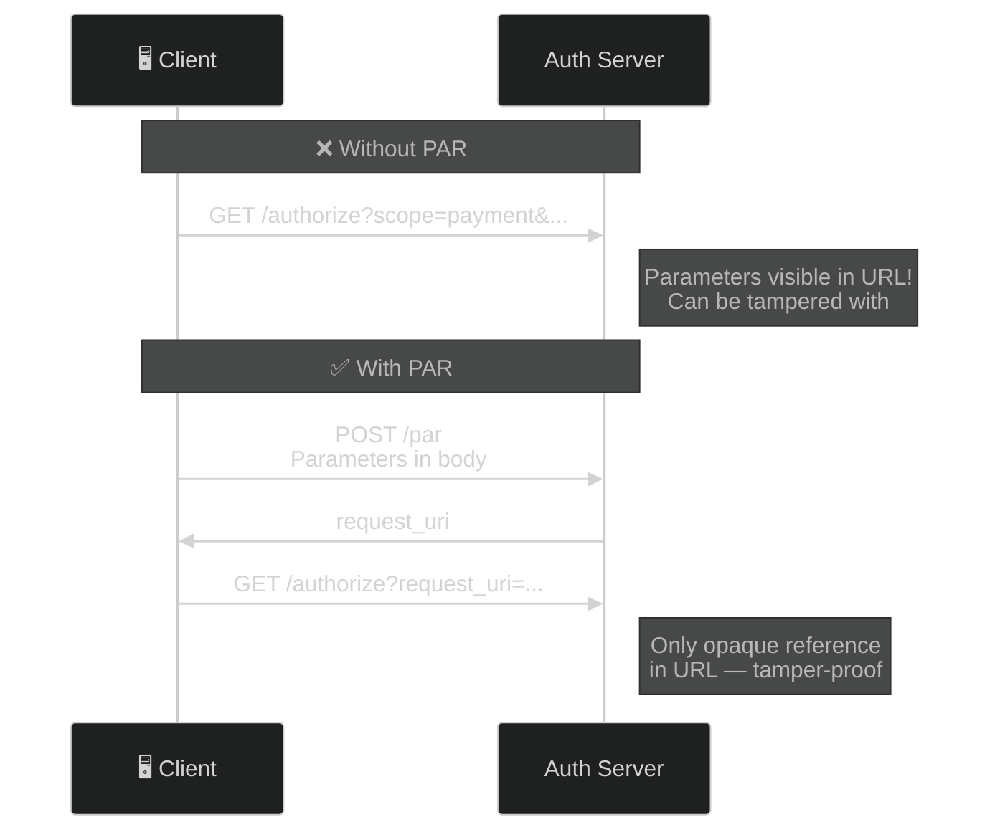
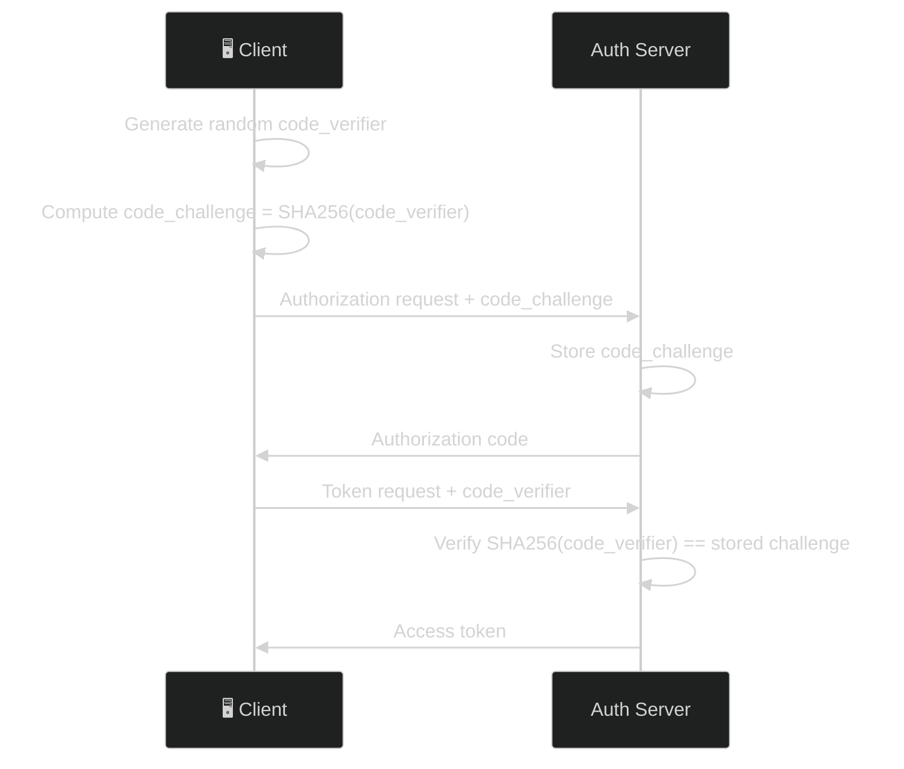
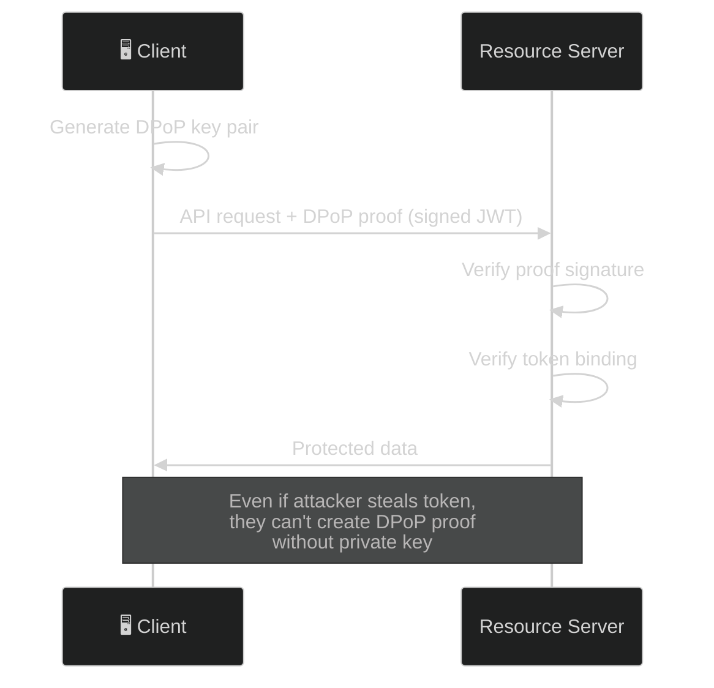
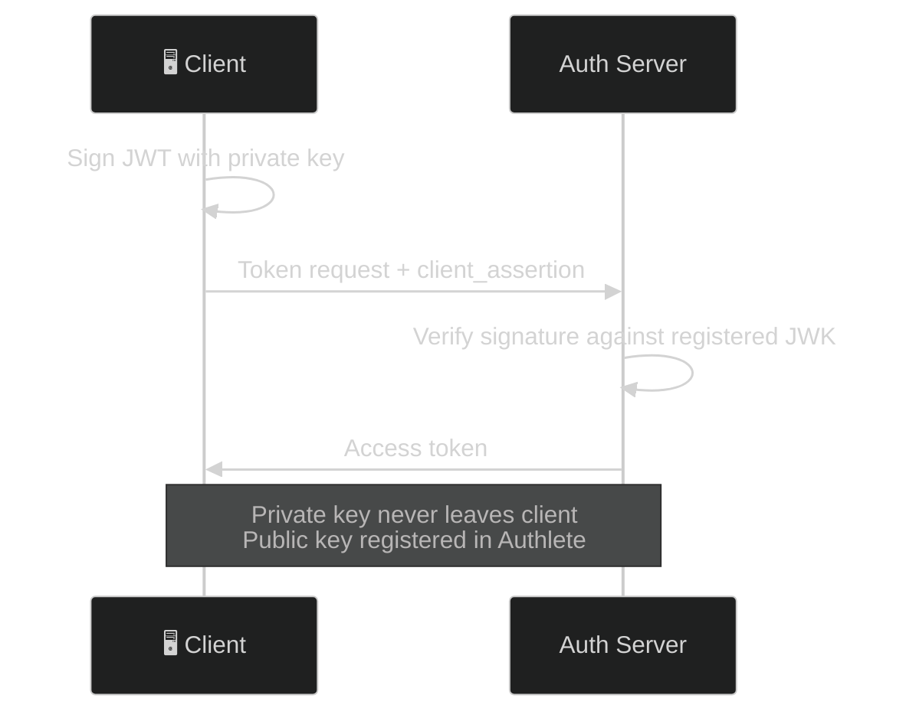
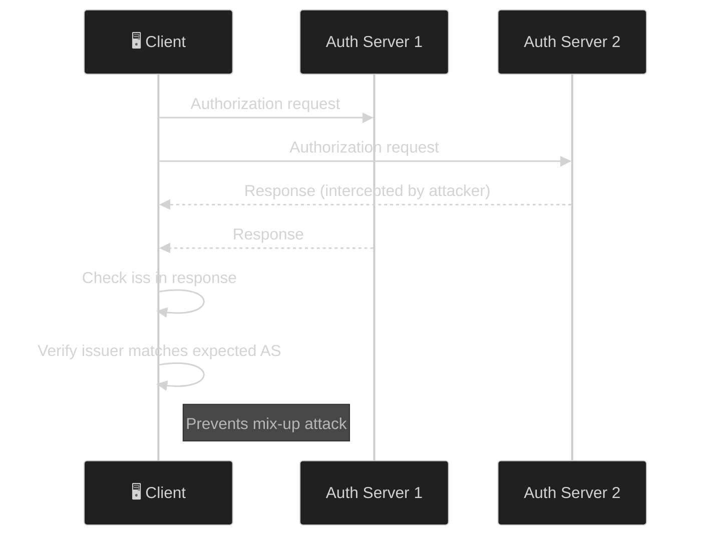

# FAPI 2.0 Security Profile — The Complete Guide

> **The short version:** FAPI 2.0 SP is a security profile that adds PAR, PKCE, DPoP sender-constrained tokens, and `private_key_jwt` client authentication to standard OAuth — making token theft virtually impossible.

---

## Table of Contents

- [Part 1: Why FAPI 2.0 Exists](#part-1-why-fapi-20-exists)
- [Part 2: The FAPI Toolkit](#part-2-the-fapi-toolkit)
- [Part 3: Authlete Console Setup](#part-3-authlete-console-setup)
- [Part 4: Step-by-Step FAPI Flow](#part-4-step-by-step-fapi-flow)
- [Part 5: Client Demo Walkthrough](#part-5-client-demo-walkthrough)
- [Part 6: Failure Demonstrations](#part-6-failure-demonstrations)
- [Part 7: Troubleshooting](#part-7-troubleshooting)

---

## Part 1: Why FAPI 2.0 Exists

### The Problem: Standard OAuth Leaves Gaps

Standard OAuth 2.0 has vulnerabilities that work fine for logging into your favorite blog but are unacceptable for banking, healthcare, or any high-security API:

| Vulnerability | What Happens | Impact |
|--------------|--------------|--------|
| **Authorization request tampering** | Attacker modifies redirect parameters | Consent bypass, scope escalation |
| **Authorization code interception** | Attacker captures code in transit | Token theft |
| **Token theft** | Stolen access token used by anyone | Account takeover |
| **Weak client auth** | Client secrets can be leaked | Impersonation |
| **Mix-up attacks** | Multiple AS confusion | Wrong token used |

### The Solution: Defense in Depth

FAPI 2.0 SP layers multiple security mechanisms together:

```mermaid
%%{init: {'theme': 'dark'}}%%
flowchart TD
    subgraph FAPI["FAPI 2.0 Security Profile"]
        PAR["PAR (RFC 9126)<br/>Prevents request tampering"]
        PKCE["PKCE (RFC 7636)<br/>Prevents code interception"]
        DPoP["DPoP (RFC 9449)<br/>Prevents token theft"]
        JWT["private_key_jwt<br/>Strong client auth"]
        ISS["iss parameter (RFC 9207)<br/>Prevents mix-up"]
    end
    
    FAPI --> Protection["Complete Security"]
    
    style FAPI fill:#1e3a5f,stroke:#4a9eff
    style Protection fill:#2d5a2d,stroke:#4aff4a
```



### Real-World Analogy: The Airport

Think of standard OAuth as a basic airport:

- **No PAR**: Passengers can modify their boarding pass before showing it to the gate agent
- **No PKCE**: Boarding passes can be copied and used by others
- **No DPoP**: Once you board, anyone with your boarding pass can access your seat
- **No private_key_jwt**: Anyone claiming to be an airline employee can access the cockpit

FAPI 2.0 SP adds:

- **PAR**: Boarding pass is pushed directly to the airline's system (no tampering)
- **PKCE**: Boarding pass has a unique, one-time verification code
- **DPoP**: Your seat is biometrically locked to you — even if someone steals your boarding pass, they can't sit in your seat
- **private_key_jwt**: Airline employees must prove identity with a hardware security key

### When to Use FAPI 2.0 SP

| Scenario | Use FAPI? | Why |
|----------|:---------:|-----|
| Banking (PSD2) | **Yes** | Regulatory requirement |
| Healthcare APIs | **Yes** | PHI protection |
| Government services | **Yes** | High-security needs |
| Enterprise APIs | **Maybe** | Depends on risk tolerance |
| Personal projects | **No** | Overkill for most use cases |

---

## Part 2: The FAPI Toolkit

FAPI 2.0 SP combines five security mechanisms. Each solves a specific problem:

### 1. PAR (Pushed Authorization Requests) — RFC 9126

**Problem:** Traditional authorization requests pass parameters in the URL redirect, where they can be intercepted or modified.

**Solution:** Client pushes parameters directly to the authorization server via a secure POST request.



**Key benefit:** Authorization parameters are never exposed in browser history, server logs, or referrer headers.

### 2. PKCE (Proof Key for Code Exchange) — RFC 7636

**Problem:** Authorization codes can be intercepted during the redirect.

**Solution:** Client generates a secret (`code_verifier`), sends its hash (`code_challenge`) with the request, and proves possession of the secret during token exchange.



**Key benefit:** Even if an attacker intercepts the authorization code, they can't exchange it without the `code_verifier`.

### 3. DPoP (Demonstration of Proof-of-Possession) — RFC 9449

**Problem:** Access tokens are bearer tokens — anyone with the token can use it.

**Solution:** Client generates a key pair and proves possession of the private key with each API call.



**Key benefit:** Stolen tokens are useless without the corresponding private key.

### 4. private_key_jwt — Client Authentication

**Problem:** Client secrets (`client_secret_basic`, `client_secret_post`) can be leaked.

**Solution:** Client signs a JWT with its private key, proving identity cryptographically.



**Key benefit:** Even if an attacker steals the client ID, they can't authenticate without the private key.

### 5. iss Response Parameter — RFC 9207

**Problem:** When a client uses multiple authorization servers, it can confuse which server issued the authorization code (mix-up attack).

**Solution:** Authorization server includes its issuer (`iss`) in the authorization response.



**Key benefit:** Client always knows which authorization server issued the response.

---

## Part 3: Authlete Console Setup

All FAPI configuration happens in the [Authlete Console](https://console.authlete.com/), not in code or env vars. The server reads these settings at runtime.

### Step 1: Enable FAPI Profile

1. Log into [Authlete Console](https://console.authlete.com/)
2. Select your Service
3. Go to **Service Settings → Endpoints → Advanced → FAPI**
4. Under **Supported Service Profiles**, check **FAPI2_SECURITY**
5. Click **Save**

### Step 2: Create a Scope with `fapi2=sp` Attribute

**Critical:** Authlete enforces FAPI rules **per-request** based on scope attributes. Without the `fapi2=sp` attribute, Authlete treats the flow as standard OAuth even with FAPI enabled.

1. Go to **Service Settings → Tokens and Claims → Advanced → Supported Scopes**
2. Click **Create**
3. Enter a scope name (e.g., `fapi_scope`)
4. Under **Attributes**, add an entry:
   - **Key**: `fapi2`
   - **Value**: `sp`
5. Click **Save**

### Step 3: Register a Confidential Client with PRIVATE_KEY_JWT

1. Go to **Clients → Create**
2. **Client Type**: `Confidential`
3. **Token Auth Method**: `PRIVATE_KEY_JWT`

> FAPI 2.0 SP §5.3.2.1.6 requires `private_key_jwt` or `tls_client_auth`. Do NOT use `CLIENT_SECRET_POST` or `CLIENT_SECRET_BASIC`.

4. **Grant Types**: `AUTHORIZATION_CODE`, `REFRESH_TOKEN`
5. **Redirect URIs**: `http://localhost:3001/callback`
6. **JWK Set**: Paste the public key generated by the SPA wizard (see Quick Start)
7. **PAR**: Enable **Require Pushed Authorization Requests**
8. **PKCE**: Enable **Require PKCE** (S256)
9. Click **Save** and note the `clientId`

### Step 4: Configure DPoP

1. Go to **Service Settings → Tokens and Claims → Advanced → DPoP Token**
2. **Require Nonce**: `true` (set to `false` for simpler testing)
3. **Nonce Duration**: `3600` (1 hour)
4. Click **Save**

### Summary Checklist

| Setting | Location | Value |
|---------|----------|-------|
| FAPI Profile | Service Settings → Endpoints → Advanced → FAPI | `FAPI2_SECURITY` |
| Scope with `fapi2=sp` | Service Settings → Tokens → Advanced → Scope | Create scope with attribute |
| Client Auth Method | Client Settings | `PRIVATE_KEY_JWT` |
| PAR Required | Client Settings | Enabled |
| PKCE Required | Client Settings | Enabled (S256) |
| DPoP Nonce | Service Settings → Tokens → Advanced → DPoP Token | Enabled |

---

## Part 4: Step-by-Step FAPI Flow

This section walks through a complete FAPI 2.0 authorization code flow.

### Prerequisites

1. Authlete service configured with FAPI 2.0 Security Profile (see Part 3)
2. A scope with `fapi2=sp` attribute (e.g., `fapi_scope`)
3. A confidential client with `PRIVATE_KEY_JWT` auth method and registered JWK Set
4. DPoP enabled at the service level

### Complete Flow


### Step 1: Generate Client Auth Key Pair

The client generates an ES256 key pair for `private_key_jwt` client assertions. The private key stays in the browser; the public key is registered as the client's JWK Set in Authlete Console.

```javascript
const signingKey = await generateSigningKeyPair();
// Register signingKey.publicKey as JWK Set in Authlete Console
```

### Step 2: Generate DPoP Key Pair

Separate from the signing key, the client generates a DPoP key pair for sender-constrained tokens:

```javascript
const dpopKey = await generateKeyPair();
```

**Why two separate keys?** Each key has a specific purpose:
- **Client Auth Key**: Proves the client's identity to the authorization server
- **DPoP Key**: Binds each API call to the access token holder

Compromising one doesn't affect the other.

### Step 3: Push Authorization Request (PAR)

```javascript
// Create client assertion (private_key_jwt)
const clientAssertion = await createClientAssertion(
  signingPrivateKeyJwk,
  clientId,
  "http://localhost:3000/api/token"    // aud = token endpoint
);

// Create DPoP proof for the PAR endpoint
const parProof = await createProof(
  dpopPrivateKeyJwk,
  "POST",
  "http://localhost:3000/api/par",
  undefined,  // no ath yet
  undefined,  // first request, no nonce
);
```

HTTP request:

```http
POST /api/par HTTP/1.1
Content-Type: application/json
DPoP: <parProof>

{
  "parameters": "response_type=code&client_id=<clientId>&redirect_uri=<redirectUri>&scope=fapi_scope%20openid&code_challenge=<pkceChallenge>&code_challenge_method=S256&state=<state>&client_assertion_type=urn%3Aietf%3Aparams%3Aoauth%3Aclient-assertion-type%3Ajwt-bearer&client_assertion=<clientAssertion>"
}
```

Response:

```http
HTTP/1.1 201 Created
DPoP-Nonce: <serverNonce>

{
  "requestUri": "urn:ietf:params:oauth:request_uri:<id>",
  "expires_in": 90
}
```

### Step 4: Authorize

Redirect the user:

```
GET /api/authorize?client_id=<clientId>&request_uri=urn:ietf:params:oauth:request_uri:<id>
```

The server shows login → consent → redirects back with authorization code.

### Step 5: Exchange Code for Token

```javascript
// Create fresh client assertion for token exchange
const tokenAssertion = await createClientAssertion(
  signingPrivateKeyJwk,
  clientId,
  "http://localhost:3000/api/token"
);

// Create DPoP proof for the token endpoint
const tokenProof = await createProof(
  dpopPrivateKeyJwk,
  "POST",
  "http://localhost:3000/api/token",
  undefined,  // no ath yet (no access token to bind to)
  latestNonce,
);
```

```http
POST /api/token HTTP/1.1
Content-Type: application/x-www-form-urlencoded
DPoP: <tokenProof>

grant_type=authorization_code&code=<authCode>&redirect_uri=<redirectUri>&code_verifier=<pkceVerifier>&client_id=<clientId>&client_assertion_type=urn%3Aietf%3Aparams%3Aoauth%3Aclient-assertion-type%3Ajwt-bearer&client_assertion=<tokenAssertion>
```

Response:

```http
HTTP/1.1 200 OK
DPoP-Nonce: <newNonce>
Cache-Control: no-store

{
  "access_token": "DPoP-bound-token",
  "token_type": "DPoP",
  "expires_in": 3600,
  "refresh_token": "refresh-token",
  "scope": "fapi_scope openid"
}
```

The `token_type: "DPoP"` confirms the token is sender-constrained.

### Step 6: Call Userinfo with DPoP

```javascript
const ath = await computeAth(accessToken);

const userinfoProof = await createProof(
  dpopPrivateKeyJwk,
  "POST",
  "http://localhost:3000/api/userinfo",
  ath,
  latestNonce,
);
```

```http
POST /api/userinfo HTTP/1.1
Authorization: DPoP <accessToken>
DPoP: <userinfoProof>
```

**The scheme is `DPoP`, not `Bearer`.** RFC 9449 §7.1 says a DPoP-bound access token *"is sent using the
`Authorization` request header field… with an authentication scheme of `DPoP`"*, and §7.2 requires a protected
resource to **reject a DPoP-bound access token received as a bearer token**. Send `Bearer` here and this server
answers `400 invalid_request`; strip the proof as well and Authlete answers
`401 [A089311] Expected a DPoP header but none was provided.`

Since the token was issued with `token_type: "DPoP"`, Authlete requires a valid DPoP proof for every API call using this token. The proof's `ath` claim binds it to the specific access token.

---

## Part 5: Client Demo Walkthrough

The React SPA includes a **FAPI 2.0 Security Profile** section that lets you run a complete FAPI 2.0 SP flow interactively.

### Opening the FAPI Section

1. Start both servers: `npm --prefix server run dev` + `npm --prefix client run dev`
2. Open `http://localhost:3001`
3. Click **FAPI 2.0 Security Profile** in the sidebar

### FAPI Tools

**1. Fetch Config** — Shows live FAPI mode and DPoP status:
- `mode`: `"sp"`, `"ms"`, or `"disabled"`
- `dpopEnabled`: DPoP nonce is enabled
- `requiredClientAuth`: always `"PRIVATE_KEY_JWT"` for FAPI configurations
- `senderConstrainedTokens`: `"DPoP"` or `"none"`

**2. Fetch Status** — Raw Authlete configuration including all flags

**3. DPoP Key Utilities** — Standalone DPoP proof generation for testing with any endpoint

### FAPI 2.0 SP Test Flow Wizard

The wizard walks through the complete FAPI 2.0 SP flow:

**Setup:**
- Enter Client ID, Redirect URI, and scopes (include your `fapi2=sp` scope, e.g., `fapi_scope`)
- Click **Generate Client Auth Key** — creates an ES256 key pair for `private_key_jwt`
- Copy the displayed JWK Set and register it in Authlete Console under the client's JWK Set
- Click **Generate DPoP Key** — creates the DPoP key pair for sender-constrained tokens

**Step 1: Push PAR**
- The wizard generates a fresh `private_key_jwt` assertion and DPoP proof
- Sends the PAR request with both embedded in the `parameters` string
- Displays the PAR response with `requestUri` and `expiresIn`

**Step 2: Authorize**
- Redirects to the authorization page with the `request_uri` from PAR
- After login + consent, redirects to the callback page
- The callback page automatically generates a new `private_key_jwt` assertion + DPoP proof and exchanges the code for tokens

**Step 3: Call Userinfo**
- Uses the stored DPoP key and access token
- Computes `ath` from the access token
- Calls userinfo with a DPoP proof and displays the response

### Client-Side Architecture

The wizard uses two distinct key pairs:

| Key Pair | Purpose | Registered Where |
|----------|---------|-----------------|
| **Client Auth Key** (ES256) | Signs `private_key_jwt` assertions for client auth | Client's JWK Set in Authlete Console |
| **DPoP Key** (ES256) | Signs DPoP proofs for sender-constrained tokens | Embedded in each DPoP proof's `jwk` header |

Both keys are generated client-side using `crypto.subtle`. Private keys never leave the browser (stored in `sessionStorage` for the duration of the session).

---

## Part 6: Failure Demonstrations

These demos prove that DPoP sender-constrained tokens actually prevent token theft.

Every response below was captured against this server. The `WWW-Authenticate` header carries the reason, so
run these with `-v` (or `-i`) — the body alone will not tell you what went wrong.

### Demo 1: Stolen Token Without a DPoP Proof

A thief who copied the token out of a log has the token and nothing else. Both schemes fail, for two
different reasons:

```bash
# The obvious attempt: present it as a bearer token
curl -i -X POST http://localhost:3000/api/userinfo \
  -H "Authorization: Bearer <YOUR_DPOP_TOKEN>"
```

**Expected:** `401` with
`DPoP error="invalid_token",error_description="[A089311] Expected a DPoP header but none was provided."`

This is RFC 9449 §7.2 doing its job: Authlete sees `cnf.jkt` on the token, finds no proof, and refuses. Note
the challenge comes back with the `DPoP` scheme and an `algs` list — Authlete tells the caller what it should
have sent.

```bash
# The informed attempt: correct scheme, still no key
curl -i -X POST http://localhost:3000/api/userinfo \
  -H "Authorization: DPoP <YOUR_DPOP_TOKEN>"
```

**Expected:** `401` with
`DPoP error="invalid_dpop_proof",error_description="The DPoP authentication scheme was used but no DPoP proof was provided in the DPoP header field."`

This one never reaches Authlete. The DPoP scheme with no proof cannot satisfy §7.1 under any circumstances, so
the server rejects it locally.

### Demo 2: Stolen Token with a Different DPoP Key

The thief now generates their own key pair and mints a perfectly well-formed proof with it — correct `htm`,
correct `htu`, correct `ath`, valid signature. Everything except the key.

```bash
curl -i -X POST http://localhost:3000/api/userinfo \
  -H "Authorization: DPoP <YOUR_DPOP_TOKEN>" \
  -H "DPoP: <THIEF_DPOP_PROOF>"
```

**Expected:** `401` with
`DPoP error="invalid_dpop_proof",error_description="[A089312] Thumbprint of the provided DPoP key does not match the expected DPoP thumbprint."`

**This is the whole point of DPoP.** The token is genuine and the proof is cryptographically valid; they just
do not belong to each other. Stealing the token is no longer enough — you need the private key, and that never
left the legitimate client.

Forget the `ath` claim instead of the key, and you get a different rejection:
`[A089313] There was an error processing the DPoP header: JWT missing required claims: [ath].`

### Demo 3: Bearer Scheme with a DPoP Header

```bash
curl -i -X POST http://localhost:3000/api/userinfo \
  -H "Authorization: Bearer <ANY_TOKEN>" \
  -H "DPoP: <SOME_DPOP_PROOF>"
```

**Expected:** `400` with
`Bearer, DPoP error="invalid_request",error_description="A DPoP proof was provided with the Bearer authentication scheme. RFC 9449 Section 7.1 requires the DPoP scheme when presenting a DPoP proof."`

An ambiguous presentation, refused. If the server honoured the proof here, the `Bearer` scheme would become a
working route for bound tokens — the downgrade §7.2 exists to prevent.

> **One thing DPoP does not do.** Present an ordinary, *unbound* token under the `DPoP` scheme with any
> well-formed proof and you get `200`. Nothing is wrong: the token carries no `cnf`, so there is no binding to
> check and the proof is decorative. The security property lives on **the token's `cnf.jkt`**, not on the
> scheme the caller chose. If you want proof-of-possession enforced, the token has to have been issued
> sender-constrained in the first place — checking that a request "used DPoP" tells you nothing.

### What DPoP Prevents

| Attack Scenario | Result |
|----------------|--------|
| Token stolen from browser storage | ❌ Fails — private key required for DPoP proof |
| Token + attacker's own key pair | ❌ Fails — `jwk` in proof must match token binding |
| Bearer token used with DPoP | ❌ Fails — token_type must be DPoP |

---

## Part 7: Troubleshooting

### "FAPI mode shows disabled"

Authlete service does not have FAPI enabled. Go to Authlete Console → **Service Settings → Endpoints → Advanced → FAPI** → enable `FAPI2_SECURITY`.

### "dpopEnabled is false"

Authlete has `dpopNonceRequired` set to `false`. Go to **Service Settings → Tokens and Claims → Advanced → DPoP Token** → set Require Nonce to `true`. Alternatively, DPoP works without nonces — the flag only controls nonce enforcement, not DPoP itself.

### "FAPI mode shows sp but Authlete doesn't enforce FAPI rules"

Missing scope with `fapi2=sp` attribute. Authlete only enforces FAPI rules when a requested scope carries the attribute. Create a scope with `fapi2=sp` and include it in the request.

### "Invalid DPoP proof" errors

Common causes:
- `htm` does not match the HTTP method
- `htu` does not match the actual URL
- `ath` is wrong or missing
- `nonce` is wrong or missing
- DPoP key does not match the key used in the token request
- **ES256 signature is DER-encoded instead of raw R||S** — use raw IEEE P1363 format (64 bytes for P-256)

### "The DPoP header did not include a public key in JWK format"

The DPoP proof JWT header must include the full `jwk` member with the public key. The `kid` alone is insufficient per RFC 9449.

### "The client authentication method is 'client_secret_post' but..."

Your client is configured for `CLIENT_SECRET_POST` but you are using a different auth method (or vice versa). For FAPI 2.0 SP, the client must use `PRIVATE_KEY_JWT`. Update the client's Token Auth Method in Authlete Console.

### "Invalid_client" on token endpoint with private_key_jwt

Check that:
- The client's JWK Set contains the public key matching the assertion's `kid`
- The `aud` in the assertion matches the token endpoint URL configured in Authlete Console
- The assertion is not expired (> 5 minutes from `iat`)
- The `iss` and `sub` match the `client_id`

### "Not a DPoP bearer token" error

The token was issued without DPoP binding, but you're sending a DPoP proof. Ensure the token endpoint received a valid DPoP proof during the initial token request.

### "HTTP 400: Missing required body field: parameters"

The PAR endpoint requires a JSON body with a `parameters` field. The `parameters` string must contain URL-encoded OAuth parameters including `client_assertion_type` and `client_assertion`.

---

## Summary

FAPI 2.0 SP is a comprehensive security profile that layers multiple protections:

1. **PAR** prevents authorization request tampering
2. **PKCE** prevents authorization code interception
3. **DPoP** prevents token theft (sender-constrained tokens)
4. **private_key_jwt** provides strong client authentication
5. **iss parameter** prevents mix-up attacks

**Use FAPI 2.0 SP when:**
- Regulatory requirements (PSD2, Open Banking)
- High-security APIs (healthcare, government)
- Token theft prevention is critical

**Don't use FAPI 2.0 SP when:**
- Standard OAuth is sufficient
- Simple API access control
- Personal projects

---

## References

- [FAPI 2.0 Security Profile](https://openid.net/specs/fapi-security-profile-2_0-final.html) — OpenID
  Foundation **Final Specification**. (The old `fapi-2_0-03.html` link cited Draft 03 and is now dead;
  the profile reached Final, so cite Final rather than a draft revision.)
- [RFC 9126: PAR](https://www.rfc-editor.org/rfc/rfc9126.html)
- [RFC 7636: PKCE](https://www.rfc-editor.org/rfc/rfc7636.html)
- [RFC 9449: DPoP](https://www.rfc-editor.org/rfc/rfc9449.html)
- [RFC 7523: private_key_jwt](https://www.rfc-editor.org/rfc/rfc7523.html)
- [RFC 9207: iss parameter](https://www.rfc-editor.org/rfc/rfc9207.html)
