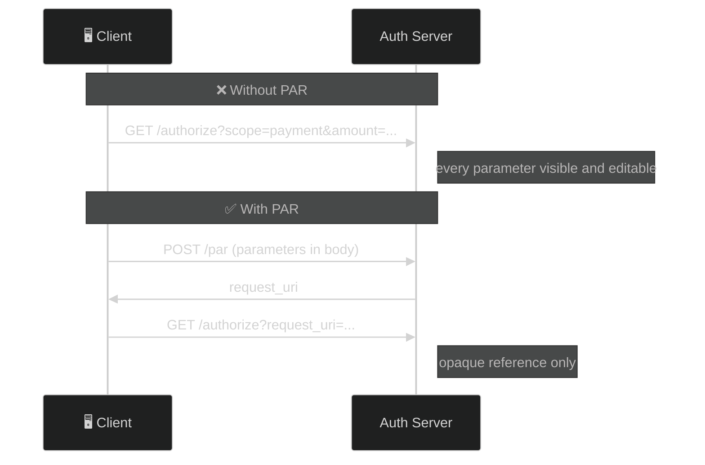
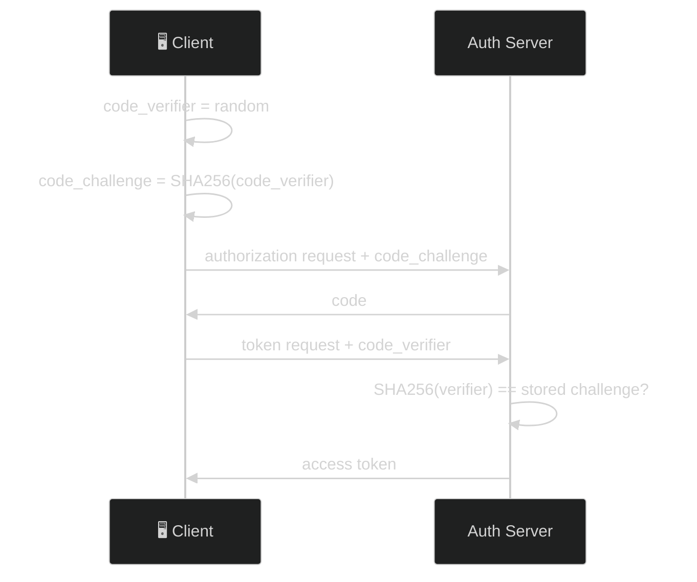
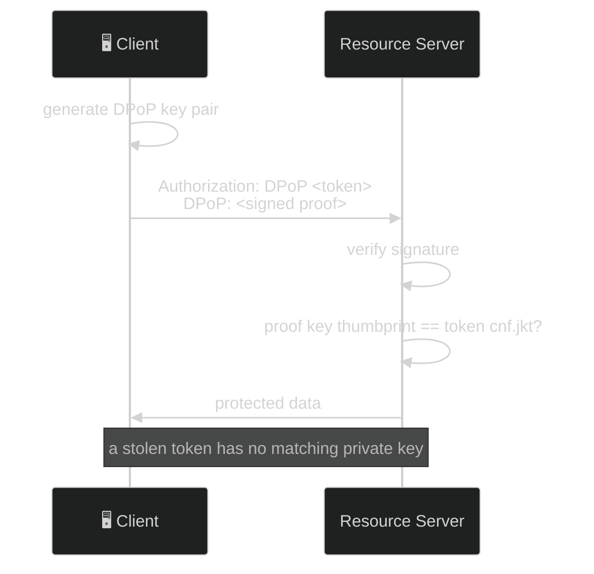
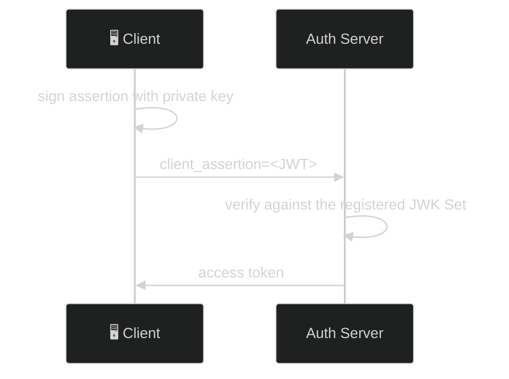
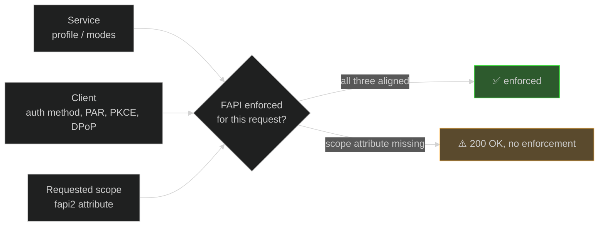
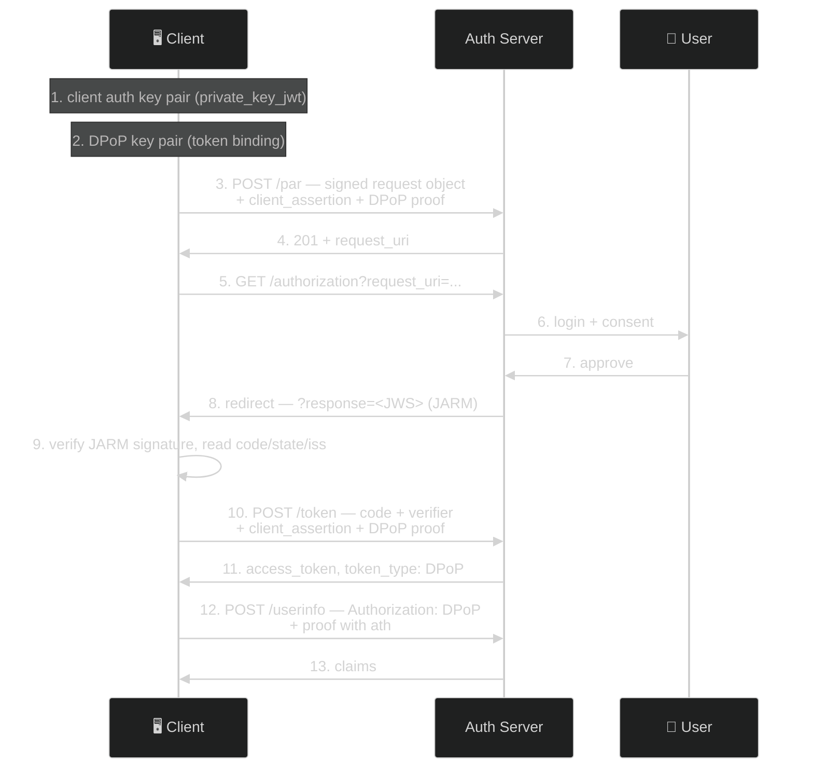

# FAPI 2.0 — The Complete Guide

> **The short version:** FAPI 2.0 is a security profile that makes stolen tokens useless. It requires
> PAR, PKCE S256, sender-constrained tokens (DPoP or mTLS), strong client authentication
> (`private_key_jwt` or mTLS), and the `iss` response parameter. Its *Message Signing* variant adds
> signed requests (JAR) and signed responses (JARM) on top.

> **Before you trust any number in here:** FAPI is enforced **per request**, from three places at once —
> your service configuration, your client configuration, and the scope you ask for. A value that is
> right on one service is wrong on another. Where this file quotes a live value it names the service and
> the date. Transcript labels (**captured** / *illustrative* / **`UNVERIFIED`**) are defined in
> [the tutorial index](README.md#how-to-read-the-transcripts-in-these-tutorials).
>
> **The one trap worth reading twice:** a missing FAPI *mode* gives you an error you can look up. A
> missing scope *attribute* gives you a **200** and a flow that quietly is not FAPI at all.

---

## Table of Contents

- [Part 1: Why FAPI 2.0 Exists](#part-1-why-fapi-20-exists)
- [Part 2: The FAPI Toolkit](#part-2-the-fapi-toolkit)
- [Part 3: Authlete Console Setup](#part-3-authlete-console-setup)
- [Part 4: Step-by-Step FAPI Flow](#part-4-step-by-step-fapi-flow)
- [Part 5: Client Demo Walkthrough](#part-5-client-demo-walkthrough)
- [Part 6: Failure Demonstrations](#part-6-failure-demonstrations)
- [Part 7: Troubleshooting](#part-7-troubleshooting)

---

## Part 1: Why FAPI 2.0 Exists

### The problem: standard OAuth leaves gaps

These are fine for logging into a blog and unacceptable for moving money:

| Vulnerability | What happens | Impact |
|---|---|---|
| **Request tampering** | attacker edits redirect parameters | consent bypass, scope escalation |
| **Code interception** | attacker captures the code in transit | token theft |
| **Token theft** | a stolen access token works for anyone | account takeover |
| **Weak client auth** | client secrets leak | impersonation |
| **Mix-up attacks** | client confuses two authorization servers | token sent to the wrong party |

### The solution: defense in depth

```mermaid
%%{init: {'theme': 'dark'}}%%
flowchart TD
    subgraph FAPI["FAPI 2.0 Security Profile"]
        PAR["PAR (RFC 9126)<br/>request cannot be tampered with"]
        PKCE["PKCE S256 (RFC 7636)<br/>a stolen code cannot be redeemed"]
        DPoP["DPoP (RFC 9449)<br/>a stolen token cannot be used"]
        JWT["private_key_jwt (RFC 7523)<br/>a stolen client id cannot authenticate"]
        ISS["iss (RFC 9207)<br/>responses cannot be swapped between servers"]
    end
    FAPI --> P["Each layer removes one attack, not all of them"]
    style FAPI fill:#1e3a5f,stroke:#4a9eff
    style P fill:#2d5a2d,stroke:#4aff4a
```



### The airport analogy

Standard OAuth is a basic airport: passengers can edit their own boarding pass, passes can be copied and
used by anyone, and anyone in a uniform can reach the cockpit.

FAPI 2.0 changes that:

- **PAR** — the boarding pass is filed with the airline directly, so there is nothing to edit
- **PKCE** — the pass carries a one-time code only the real passenger can produce
- **DPoP** — the seat is biometrically locked to you; a copied pass sits in no seat
- **private_key_jwt** — staff prove identity with a hardware key, not a badge that can be forged

### When to use it

| Scenario | Use FAPI? | Why |
|---|:---:|---|
| Banking, PSD2, Open Banking | **Yes** | regulatory requirement |
| Healthcare APIs | **Yes** | PHI protection |
| Government services | **Yes** | high assurance |
| Enterprise APIs | **Maybe** | depends on risk tolerance |
| Personal projects | **No** | the operational cost is real |

---

## Part 2: The FAPI Toolkit

Five mechanisms make up the Security Profile. Each removes one specific attack.

### 1. PAR — Pushed Authorization Requests (RFC 9126)

**Problem:** authorization parameters travel in a URL, where they land in browser history, server logs
and `Referer` headers — and can be edited on the way.

**Solution:** POST the parameters to the authorization server first; carry only an opaque reference.



### 2. PKCE S256 — Proof Key for Code Exchange (RFC 7636)

**Problem:** an intercepted authorization code can be redeemed by the interceptor.

**Solution:** the client keeps a secret (`code_verifier`), commits to its hash up front
(`code_challenge`), and proves possession at the token endpoint.



FAPI 2.0 requires **S256**. `plain` is not acceptable.

### 3. DPoP — Demonstrating Proof of Possession (RFC 9449)

**Problem:** a bearer token is a password. Whoever holds it, holds the account.

**Solution:** the client holds a key pair and signs a fresh proof for every call. The token is bound to
the key's thumbprint (`cnf.jkt`).



**The binding lives on the token, not on the scheme.** An *unbound* token presented under the `DPoP`
scheme with any well-formed proof succeeds — there is no `cnf` to check. "The request used DPoP" tells
you nothing; "the token was issued sender-constrained" is the property that matters.

### 4. private_key_jwt — client authentication (RFC 7523)

**Problem:** client secrets leak — into repos, CI logs, and screenshots.

**Solution:** the client signs a short-lived JWT assertion with its private key. Only the public key is
registered.



FAPI 2.0 permits `private_key_jwt` **or** `tls_client_auth`, and requires it at **both** the PAR and
token endpoints. `client_secret_basic` and `client_secret_post` are not acceptable.

### 5. iss response parameter (RFC 9207)

**Problem:** a client talking to several authorization servers can be tricked into sending a code from
server A to server B — the mix-up attack.

**Solution:** the authorization response names its issuer, and the client compares it to the server it
expected. Compare **whole strings**, never prefixes.

### Message Signing — the variant that adds signatures

FAPI 2.0 has a second profile, **Message Signing**, which adds non-repudiation on top of everything
above:

| Mechanism | What is signed | Turned on by |
|---|---|---|
| **JAR** (RFC 9101) | the authorization **request** — parameters travel inside a signed JWT | client `requestObjectRequired` + `requestSignAlg`, or scope attribute `fapi2: ms-authreq` |
| **JARM** | the authorization **response** — `code`, `state` and `iss` travel inside a signed JWT | client `authorizationSignAlg` + scope attribute `fapi2: ms-authres` |

Message Signing **implies** the Security Profile: every SP rule is still enforced. Under JARM the
callback receives one parameter:

```
GET /callback?response=eyJraWQiOi...   ← no bare code, no bare state, no bare iss
```

Which means a client that only knows how to read `?code=` sees nothing at all. The request must ask for
it with **`response_mode=jwt`**, and the client must verify the JWS signature against the server's JWKS
before believing a single claim inside it. Permitted algorithms are `PS256`, `ES256` and `EdDSA`.

---

## Part 3: Authlete Console Setup

FAPI configuration lives in the [Authlete Console](https://console.authlete.com/), not in code or env
vars. The server reads it at runtime.

**Enforcement is decided per request from three inputs.** Get any one wrong and FAPI is silently not
applied:



### Step 1 — the service profile

**Service Settings → Endpoints → Advanced → FAPI.**

Two distinct `Service` properties are easy to confuse:

| Property | Values | Notes |
|---|---|---|
| `supportedServiceProfiles` | `FAPI` \| `OPEN_BANKING` | the "Supported Service Profiles" in Authlete's own documentation |
| `fapiModes` | six modes, incl. `FAPI2_SECURITY`, `FAPI2_MESSAGE_SIGNING_AUTH_REQ` | what `GET /api/fapi/config` reads |

Set both if you want a statically-declared profile. `GET /api/fapi/config` reports **only** `fapiModes`,
so a service with `supportedServiceProfiles: ["FAPI"]` and no `fapiModes` is reported as
`mode: "disabled"` — true for the field it reads, misleading about the service.

⚠️ **`fapiModes` are mutually exclusive, and it overrides the scope attribute.** Selecting
`FAPI2_SECURITY` alongside any `FAPI2_MESSAGE_SIGNING_*` mode is refused
(`[A039250]`). And setting `fapiModes` at all takes precedence over the per-scope attribute *and* the
per-client `requestObjectRequired` — measured: with `fapiModes: ["FAPI2_SECURITY"]` every client
accepted an unsigned PAR while its own configuration still said `requestObjectRequired: true`. **Leave
`fapiModes` unset and let the scope attribute select the profile** unless you want that override.

### Step 2 — a scope carrying the `fapi2` attribute

**Service Settings → Tokens and Claims → Advanced → Supported Scopes → Create.**

Add an attribute to the scope. The key differs between FAPI generations, and mixing them up disables
enforcement with no error:

| Profile | Attribute key | Value |
|---|---|---|
| FAPI 2.0 Security Profile | `fapi2` | `sp` |
| FAPI 2.0 Message Signing — signed requests | `fapi2` | `ms-authreq` |
| FAPI 2.0 Message Signing — signed responses | `fapi2` | `ms-authres` |
| FAPI 1.0 | `fapi` | `r` or `rw` |

**The request must actually ask for that scope.** A request omitting it is not a FAPI request, and
unknown scopes are silently dropped when `scopeRequired` is `false` — so the flow succeeds with no
enforcement and no error. This is the trap from the top of the file.

### Step 3 — a confidential client

**Clients → Create.**

| Setting | Value | Why |
|---|---|---|
| Client Type | `CONFIDENTIAL` | FAPI 2.0 supports confidential clients only |
| Token Auth Method | `PRIVATE_KEY_JWT` | or `TLS_CLIENT_AUTH`; never a client secret |
| JWK Set | the client's **public** key | paste it from the SPA wizard, and delete any stale key |
| Grant Types | `AUTHORIZATION_CODE`, `REFRESH_TOKEN` | `code` only — no implicit, no hybrid |
| Redirect URIs | **`https://`** | §5.3.2.2 forbids `http`, except loopback for native clients |
| Require PAR | enabled | |
| Require PKCE | enabled, S256 | |
| DPoP Required | enabled | unless you sender-constrain with mTLS instead |

⚠️ **`http://localhost:3001/callback` will be refused.** FAPI 2.0 §5.3.2.2 rules out the `http` scheme,
so the redirect leg of any FAPI flow **cannot complete against a local dev server** — there is no
`https` origin to come back to. PAR and the request object can be exercised locally; the browser
redirect needs a deployed origin. That is the profile working as specified, not a defect to route
around.

For Message Signing, add `requestObjectRequired` + `requestSignAlg` (signed requests) and
`authorizationSignAlg` (signed responses). Both are **per-client** settings — the service-level
`requestObjectRequired` only drives `require_signed_request_object` in the discovery document, so
leaving it off while the client requires JAR makes your metadata under-advertise.

### Step 4 — DPoP nonces (optional)

**Service Settings → Tokens and Claims → Advanced → DPoP Token → Require Nonce**, plus a non-zero
duration.

**Do not enable this until your client can recover.** A client that does not read `DPoP-Nonce` off the
**error** response and retry with a re-signed proof cannot complete a single call. This repo's SPA was
such a client until its transport was fixed to cache the nonce from success and failure alike
(`client/src/services/dpop-fetch.ts`). Nonces are off on this deployment by decision —
[DR-20](../audit/05-decision-records.md#dr-20--dpop-nonces-dpopnoncerequired).

### Reading your own posture

Do not assume — read it:

```bash
# What the service enforces, as this server understands it
curl -s http://localhost:3000/api/fapi/config | python3 -m json.tool

# What the service advertises to clients
curl -s http://localhost:3000/.well-known/openid-configuration | python3 -m json.tool
```

Two fields in `/api/fapi/config` are routinely misread:

- **`dpopEnabled` is `service.dpopNonceRequired`**, not "is DPoP available". DPoP works fine without
  nonces, so `dpopEnabled: false` says nothing about whether bound tokens are issued.
- **`refreshTokenRotation` inverts `refreshTokenKept`.** A refresh token that is *kept* survives use, so
  it is **not** rotated. The console label ("Enable Token Rotation") is the trap.

`mode` distinguishes `"disabled"` (no FAPI mode set at all) from `"unknown"` (a mode this server does
not recognise). They are not the same answer.

---

## Part 4: Step-by-Step FAPI Flow



### Step 1 & 2 — two key pairs, on purpose

```javascript
const signingKey = await generateSigningKeyPair();  // private_key_jwt — register the public half
const dpopKey    = await generateKeyPair();         // DPoP — binds tokens to this client instance
```

| Key | Proves | Lives where |
|---|---|---|
| Client auth key | *this client* is talking | public half in the client's JWK Set |
| DPoP key | *this token holder* is calling | public half inside each proof's `jwk` header |

Compromising one does not compromise the other. Keeping them separate is the point.

### Step 3 — Push Authorization Request

Under Message Signing the parameters travel as a **signed request object** (JAR), with `client_id`
outside it as well — RFC 9126 §3 needs the outer copy to find the client and its keys before it can
verify the signature.

```javascript
const clientAssertion = await createClientAssertion(signingPrivateKeyJwk, clientId, ISSUER);

const requestObject = await createRequestObject(signingPrivateKeyJwk, clientId, ISSUER, {
  response_type: 'code',
  client_id: clientId,
  redirect_uri: redirectUri,
  scope: 'openid myscope',
  code_challenge: pkce.codeChallenge,
  code_challenge_method: 'S256',
  state,
  response_mode: 'jwt',          // ← required once the scope carries `fapi2: ms-authres`
});
```

⚠️ **`aud` is the issuer identifier, not the token endpoint.** FAPI 2.0 §5.3.2.1 permits only the issuer
there, and a service with `clientAssertionAudRestrictedToIssuer` enforces it — a token-endpoint `aud`
earns `401 [A157356]`.

```http
POST /api/par HTTP/1.1
Content-Type: application/json
DPoP: <proof for POST /api/par>

{ "parameters": "client_id=...&request=<signed JWT>&client_assertion_type=...&client_assertion=..." }
```

```http
HTTP/1.1 201 Created

{ "request_uri": "urn:ietf:params:oauth:request_uri:<id>", "expires_in": 300 }
```

RFC 9126 §2.2's body, not Authlete's envelope. `expires_in` is your service's `pushedAuthReqDuration`
(**300** on the FAPI service used here, 2026-09-03) and FAPI 2.0 requires under 600.

> **If nonces are on**, a proof without one earns `400 use_dpop_nonce` *with* a `DPoP-Nonce` header;
> replay that nonce and it succeeds. **Note the 400** — RFC 9449 §8 gives an authorization server 400
> and §9 gives a resource server 401, so a client that only retries on 401 never starts the dance. A
> nonce-less PAR earns **`[A350308]`**, not the token endpoint's `[A254307]`: one condition, two vendor
> codes. Full transcript in [`PAR-TUTORIAL.md`](PAR-TUTORIAL.md#dpop-nonce-handling).

### Step 4 — Authorize

```
GET /api/authorization?client_id=<clientId>&request_uri=urn:ietf:params:oauth:request_uri:<id>
```

**The path is `/api/authorization`, not `/api/authorize`.** The wrong path matches no route, falls
through to the SPA catch-all and returns **HTML with a 200** — nothing in the response says "no such
endpoint".

⚠️ **`[A309301] The value of 'response_mode' must be 'jwt'`** means the requested scope carries
`fapi2: ms-authres` and your request omitted `response_mode`. Authlete defaults to `query`, the profile
forbids it, and you get an error redirect. This is a **front-channel** refusal: no failed HTTP request,
no console error, nothing in a request trace on the page that sent it.

### Step 5 — read the JARM response

```
GET /callback?response=eyJraWQiOiJkZWZhdWx0LWtleS0wMDEiLCJhbGciOiJFUzI1NiJ9...
```

Verify before you read. The claims are legible, which makes them look authoritative:

1. Fetch the server's JWKS and **verify the JWS signature**.
2. Reject any `alg` outside `PS256` / `ES256` / `EdDSA`, and `none` outright.
3. Check `iss` equals the issuer identifier, `aud` contains your `client_id`, and `exp` is in the future
   (JARM §4.1 requires all three).
4. *Then* read `code`, `state` and `iss` from the claims and continue as normal.

A response that fails any of these is no response at all — do not fall back to reading bare query
parameters, or a forged JWT beside a real `?code=` would hand an attacker the outcome.

### Step 6 — exchange the code

```http
POST /api/token HTTP/1.1
Content-Type: application/x-www-form-urlencoded
DPoP: <proof for POST /api/token>

grant_type=authorization_code&code=<code>&redirect_uri=<uri>&code_verifier=<verifier>
&client_id=<clientId>&client_assertion_type=urn%3Aietf%3Aparams%3Aoauth%3Aclient-assertion-type%3Ajwt-bearer
&client_assertion=<assertion>
```

```http
HTTP/1.1 200 OK
Cache-Control: no-store

{ "access_token": "...", "token_type": "DPoP", "expires_in": 86400, "scope": "myscope openid" }
```

**`token_type: "DPoP"` is the member to assert on** — it appears only when the token was issued against
a valid proof, and it is what makes every failure in [Part 6](#part-6-failure-demonstrations) fail.

⚠️ **86400 is not a FAPI-appropriate lifetime.** This service uses 24 hours so lab tokens outlive a lab
session. If you copy one number out of this file, do not copy that one.

### Step 7 — call a protected resource

```javascript
const ath = await computeAth(accessToken);           // hash of the access token
const proof = await createProof(dpopKey, 'POST', USERINFO_ENDPOINT, ath, nonce);
```

```http
POST /api/userinfo HTTP/1.1
Authorization: DPoP <accessToken>
DPoP: <proof>
```

**The scheme is `DPoP`, not `Bearer`.** RFC 9449 §7.1 requires it, and §7.2 requires a protected
resource to **reject a bound token presented as a bearer token**. `ath` is required whenever a proof
accompanies an access token.

---

## Part 5: Client Demo Walkthrough

The React SPA has a **FAPI 2.0 Security Profile** section that runs the whole flow interactively.

1. Start the servers: `npm --prefix server run dev` and `npm --prefix client run dev`
2. Open the client and choose **FAPI 2.0 Security Profile**

### The reporting tools

- **Fetch Config** / **Fetch Status** — the live posture. Read the two commonly-misread fields in
  [Part 3](#reading-your-own-posture) before drawing conclusions from them.
- **DPoP Key Utilities** — standalone proof generation against any endpoint, pure client-side crypto.

> **`mode: "disabled"` here does not mean the profile is off.** This deployment deliberately leaves
> `fapiModes` unset so the per-scope `fapi2` attribute selects the profile — which is the arrangement
> Step 1 recommends. The panel reads the service field, not the scope attribute. It misled a reader
> once already.

### The test flow wizard

**Setup.** Enter the client ID, redirect URI and scopes — the scope list **must** include your
`fapi2`-tagged scope. Generate the client auth key, copy the JWK Set into the client's JWK Set in the
console (deleting any existing key), then generate the DPoP key.

> The wizard mints a **new** client auth key rather than importing one, so a fresh browser tab means a
> new key and another console registration. Within one tab the keys are restored from `sessionStorage`,
> so one registration covers the whole run. Do the flow in **one tab**: `state`, the PKCE verifier and
> both private keys are per-tab.

**Step 1 — Push PAR.** Builds the `private_key_jwt` assertion and the signed request object, sends them
with a DPoP proof, and shows RFC 9126 §2.2's `request_uri` / `expires_in`.

**Step 2 — Authorize.** Leaves for the authorization endpoint with the `request_uri`. After login and
consent the callback page verifies the JARM response, shows the signed JWT in the JWT inspector, and
exchanges the code using `private_key_jwt` + DPoP. It then offers **Back to `/fapi#fapi-step-3`**, which
returns you to the next step with both key pairs restored.

**Step 3 — Call Userinfo with DPoP.** Uses the stored key and token, computes `ath`, and shows the
claims.

The whole run stays in the request trace — PAR, the outbound authorize hop, the inbound callback and the
back-channel calls — because the trace survives the redirect.

### Two keys, two jobs

| Key pair | Signs | Registered where |
|---|---|---|
| Client auth key (ES256) | `private_key_jwt` assertions | the client's JWK Set in the console |
| DPoP key (ES256) | DPoP proofs | inside each proof's `jwk` header |

Both are generated with `crypto.subtle` and never leave the browser.

---

## Part 6: Failure Demonstrations

These prove that sender-constrained tokens actually prevent token theft. Every response below was
**captured** against this server. Run them with `-i` — the `WWW-Authenticate` header carries the reason
and the body alone will not tell you what went wrong.

### Demo 1 — stolen token, no proof

A thief who copied the token out of a log has the token and nothing else. Both schemes fail, for
different reasons:

```bash
curl -i -X POST http://localhost:3000/api/userinfo \
  -H "Authorization: Bearer <DPOP_BOUND_TOKEN>"
```

`401` — `DPoP error="invalid_token", error_description="[A089311] Expected a DPoP header but none was
provided."` Authlete sees `cnf.jkt` on the token, finds no proof, and refuses. The challenge comes back
with the `DPoP` scheme and an `algs` list: the server is telling the caller what it should have sent.

```bash
curl -i -X POST http://localhost:3000/api/userinfo \
  -H "Authorization: DPoP <DPOP_BOUND_TOKEN>"
```

`401` — `invalid_dpop_proof`, *"the DPoP authentication scheme was used but no DPoP proof was
provided"*. This one never reaches Authlete; the combination cannot satisfy §7.1 under any
circumstances, so the server refuses locally.

### Demo 2 — stolen token, the thief's own key

The thief mints a perfectly well-formed proof with their own key pair: correct `htm`, `htu` and `ath`,
valid signature. Everything except the key.

```bash
curl -i -X POST http://localhost:3000/api/userinfo \
  -H "Authorization: DPoP <DPOP_BOUND_TOKEN>" \
  -H "DPoP: <THIEF_PROOF>"
```

`401` — `[A089312] Thumbprint of the provided DPoP key does not match the expected DPoP thumbprint.`

**This is the whole point of DPoP.** The token is genuine and the proof is cryptographically valid; they
just do not belong to each other. Stealing the token is no longer enough — you need the private key, and
that never left the legitimate client.

Omit `ath` instead of the key and you get `[A089313] JWT missing required claims: [ath]`.

### Demo 3 — ambiguous presentation

```bash
curl -i -X POST http://localhost:3000/api/userinfo \
  -H "Authorization: Bearer <ANY_TOKEN>" \
  -H "DPoP: <ANY_PROOF>"
```

`400 invalid_request` — a proof was supplied with the `Bearer` scheme. If the server honoured it,
`Bearer` would become a working route for bound tokens: exactly the downgrade §7.2 exists to prevent.

### Demo 4 — introspecting a bound token without a proof

The same rule reaches the *introspection* API, and this one surprises people because the caller is the
resource server rather than the client:

```bash
curl -i -X POST http://localhost:3000/api/introspection \
  -u "<admin>:<secret>" -d "token=<DPOP_BOUND_TOKEN>"
```

`401` — `[A065308] Expected a DPoP header but none was provided.`

Authlete's introspection API decides whether a request bearing this token is authorized, so for a bound
token it must check the binding — and cannot, without the proof. Pass it in the `DPoP` header **beside**
the caller's own credential, with `ath` binding it to the token and `htm`/`htu` naming the introspection
endpoint. Note the vendor code differs per API for one condition: `[A089311]` at UserInfo,
`[A065308]` at introspection, `[A281305]` at Grant Management. RFC 7662 standard introspection checks no
binding and needs none of this.

### What DPoP does and does not prevent

| Scenario | Result |
|---|---|
| Token stolen from browser storage | ❌ fails — no private key, no proof |
| Token plus the attacker's own key pair | ❌ fails — thumbprint mismatch against `cnf.jkt` |
| Bound token presented as `Bearer` | ❌ fails — §7.2 refuses the downgrade |
| **Unbound** token presented as `DPoP` | ✅ **succeeds** — no `cnf` to check; the proof is decorative |

That last row is the one to remember. The security property is on the token, not on the scheme.

---

## Part 7: Troubleshooting

| Symptom | Cause | Fix |
|---|---|---|
| `mode` reports `disabled` | `fapiModes` is unset | expected if you drive FAPI by scope attribute — see [Step 1](#step-1--the-service-profile) |
| FAPI mode set, but no rules enforced | the request's scope carries no `fapi2` attribute | add the attribute *and* request that scope |
| `[A309301] response_mode must be 'jwt'` | scope carries `fapi2: ms-authres`, request omitted `response_mode` | send `response_mode=jwt` and verify the JARM response |
| `[A039250]` when saving modes | `FAPI2_SECURITY` combined with a Message Signing mode | the modes are exclusive; Message Signing already implies SP |
| Callback reports no authorization code | the response is JARM; there is no bare `code` | read `?response=` and verify it first |
| `[A156304] does not contain the key for client authentication` | the assertion's `kid` is not in the client's JWK Set | re-register the public key, deleting the stale one |
| `[A157356]` on PAR or token | assertion `aud` is the token endpoint | use the **issuer identifier** |
| `[A157303] data for client authentication although the client type is 'public'` | a secret was sent for a public client | omit `client_secret` entirely |
| `[A089311]` / `[A065308]` / `[A281305]` | bound token presented without a proof | send the `DPoP` scheme plus a proof with `ath` |
| `[A089312]` | proof key does not match `cnf.jkt` | use the key the token was issued against |
| `[A089313]` | proof is missing `ath` | add it whenever a proof accompanies a token |
| `400 Missing required body field: parameters` | PAR body is not the expected JSON | POST `{"parameters": "<url-encoded string>"}` |
| Redirect URI rejected | `http` scheme | FAPI 2.0 §5.3.2.2 requires `https` — see [Step 3](#step-3--a-confidential-client) |

### "Invalid DPoP proof"

Work down this list — the causes are ordered by how often they bite:

- `htm` or `htu` do not match the request being made (`htu` excludes query and fragment)
- `ath` missing or stale
- nonce missing or expired, when nonces are enabled
- the proof is signed with a different key than the token was issued against
- **the ES256 signature is DER-encoded instead of raw R‖S.** JWS requires the raw 64-byte form
  (RFC 7515 Appendix A.3); `openssl` and Node's `createSign` produce DER by default, and the resulting
  error says nothing about encoding
- the header carries only `kid` — RFC 9449 requires the full `jwk` member

### `/api/fapi/config` returns `Response validation failed`

**Not a mistake in your FAPI setup — your SDK is refusing to parse your own service.** The TypeScript
SDK's `ClientAuthMethod` is a **closed** Zod enum, so one unrecognised member fails the entire response.
It happened here with `SPIFFE_JWT`, a legitimate Authlete setting the SDK version does not know: 132
fields rejected over one value.

`ClientAuthMethod` types **three** service fields, so check all of them:

```bash
curl -s -H "Authorization: Bearer $AUTHLETE_BEARER_TOKEN" \
  "$AUTHLETE_BASE_URL/api/$AUTHLETE_SERVICE_ID/service/get" \
  | python3 -c "import sys,json; d=json.load(sys.stdin)
for k in ['supportedTokenAuthMethods','supportedRevocationAuthMethods','supportedIntrospectionAuthMethods']:
    print(k, d.get(k, 'ABSENT'))"
```

Anything outside the SDK's eight members (`NONE`, `CLIENT_SECRET_BASIC`, `CLIENT_SECRET_POST`,
`CLIENT_SECRET_JWT`, `PRIVATE_KEY_JWT`, `TLS_CLIENT_AUTH`, `SELF_SIGNED_TLS_CLIENT_AUTH`,
`ATTEST_JWT_CLIENT_AUTH`) is the culprit. **Withdraw the member at the service** if you are not using
it, or read the settings in the console until an SDK release knows it. Do not patch the SDK
(`DEVELOPMENT.md` → SDK Version Pin).

Worth noticing which side had to move: the authorization server stopped advertising a capability it
had, so that a client library could parse its configuration.

---

## Summary

FAPI 2.0 layers five protections, and each removes one attack rather than all of them:

| Mechanism | Removes |
|---|---|
| PAR | authorization request tampering |
| PKCE S256 | authorization code interception |
| DPoP or mTLS | token theft |
| `private_key_jwt` or mTLS | client impersonation |
| `iss` | mix-up between authorization servers |

Message Signing adds JAR and JARM for non-repudiation, and implies all of the above.

**Three things that cost people the most time:**

1. Enforcement is **per request**. Service, client and requested scope must all line up, and a missing
   scope attribute fails *open* with a 200.
2. `http` redirect URIs are refused, so the browser leg needs a deployed `https` origin.
3. The security property is the token's `cnf.jkt`, not the scheme a caller chose.

---

## References

**Specifications**

- [FAPI 2.0 Security Profile](https://openid.net/specs/fapi-security-profile-2_0-final.html) — OpenID
  Foundation **Final**
- [RFC 9126: PAR](https://www.rfc-editor.org/rfc/rfc9126.html) ·
  [RFC 7636: PKCE](https://www.rfc-editor.org/rfc/rfc7636.html) ·
  [RFC 9449: DPoP](https://www.rfc-editor.org/rfc/rfc9449.html)
- [RFC 7523: private_key_jwt](https://www.rfc-editor.org/rfc/rfc7523.html) ·
  [RFC 9101: JAR](https://www.rfc-editor.org/rfc/rfc9101.html) ·
  [RFC 9207: iss](https://www.rfc-editor.org/rfc/rfc9207.html)

**Vendor behaviour — Authlete.** FAPI enforcement is Authlete's, not this server's, so these are the
authority on what actually gets enforced.

- [How to Use the FAPI Feature](https://developers.authlete.com/protocols-and-flows/compliance-profiles/how-to-use-fapi-feature)
  — **the key document.** FAPI is not applied service-wide: *"the feature will not be activated if the
  request parameters are misconfigured."*
- [FAPI Basics](https://developers.authlete.com/protocols-and-flows/compliance-profiles/fapi-basics) —
  where the profile setting lives, and static versus scope-driven application
- [Validation in FAPI Mode](https://developers.authlete.com/protocols-and-flows/compliance-profiles/validation-in-fapi-mode)
  — what Authlete rejects once FAPI mode is active
- [Authorization Code Flow in FAPI 2.0 Security Profile](https://developers.authlete.com/protocols-and-flows/compliance-profiles/authorization-code-flow-in-fapi-2-0-security-profile)
  — confirms the `fapi2` = `sp` attribute and that `PRIVATE_KEY_JWT` is required at **both** the PAR and
  token endpoints
- [FAPI 2.0 Message Signing: Signing Authorization Requests](https://developers.authlete.com/protocols-and-flows/compliance-profiles/fapi-2-0-message-signing-profile-signing-authorization-requests)

**In this repo**

- [`FAPI2-CONFORMANCE.md`](FAPI2-CONFORMANCE.md) — running the OpenID conformance suite against this
  deployment, and the exact variants to select
- [`PAR-TUTORIAL.md`](PAR-TUTORIAL.md#dpop-nonce-handling) — the full DPoP nonce transcript
