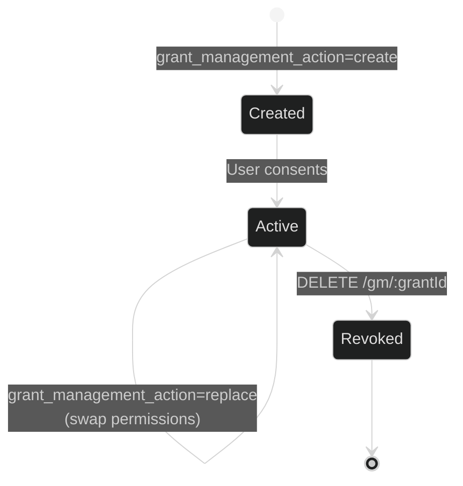
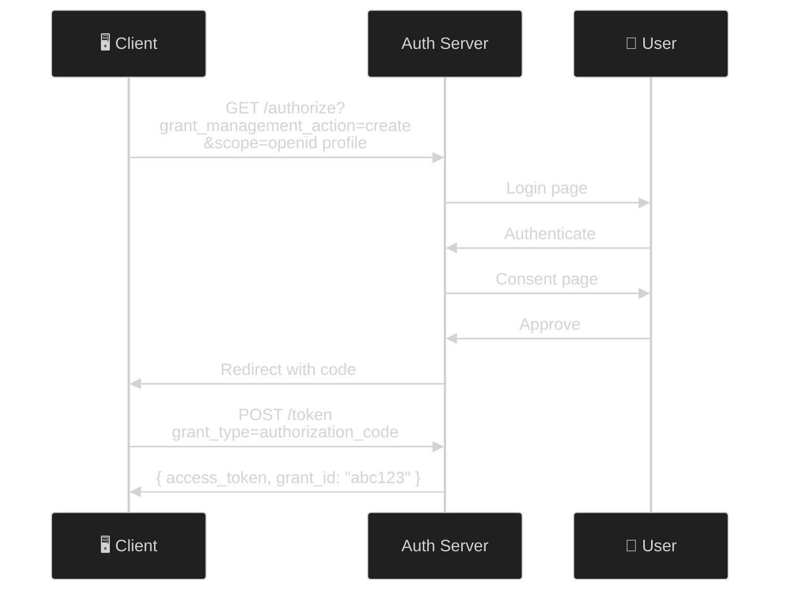
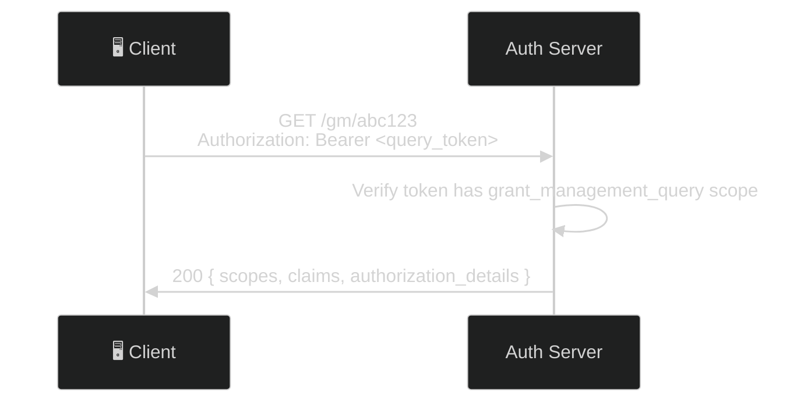
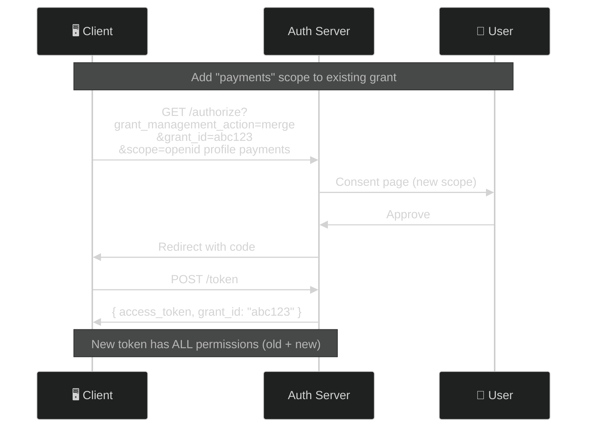
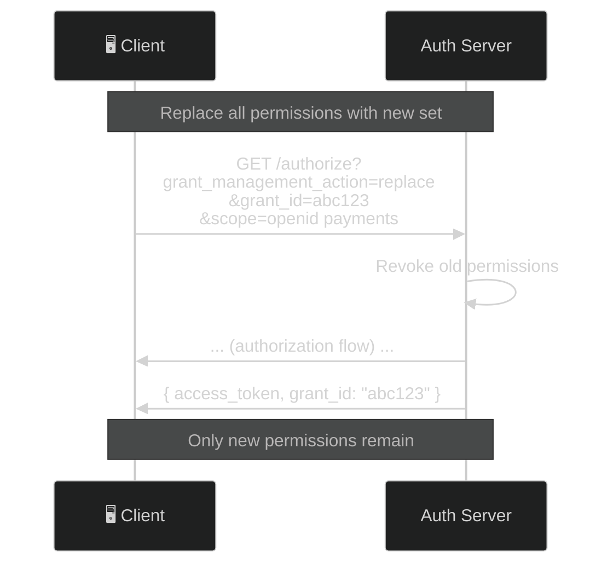
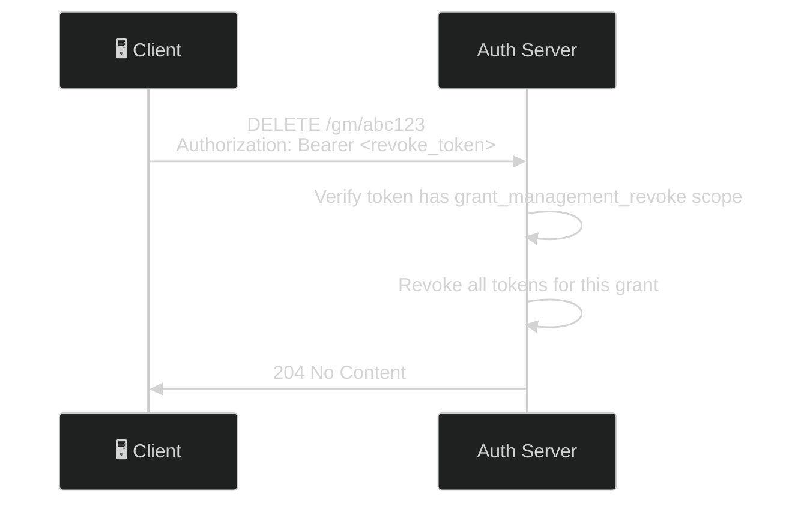
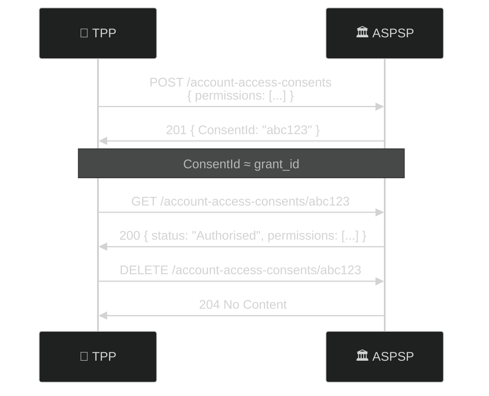
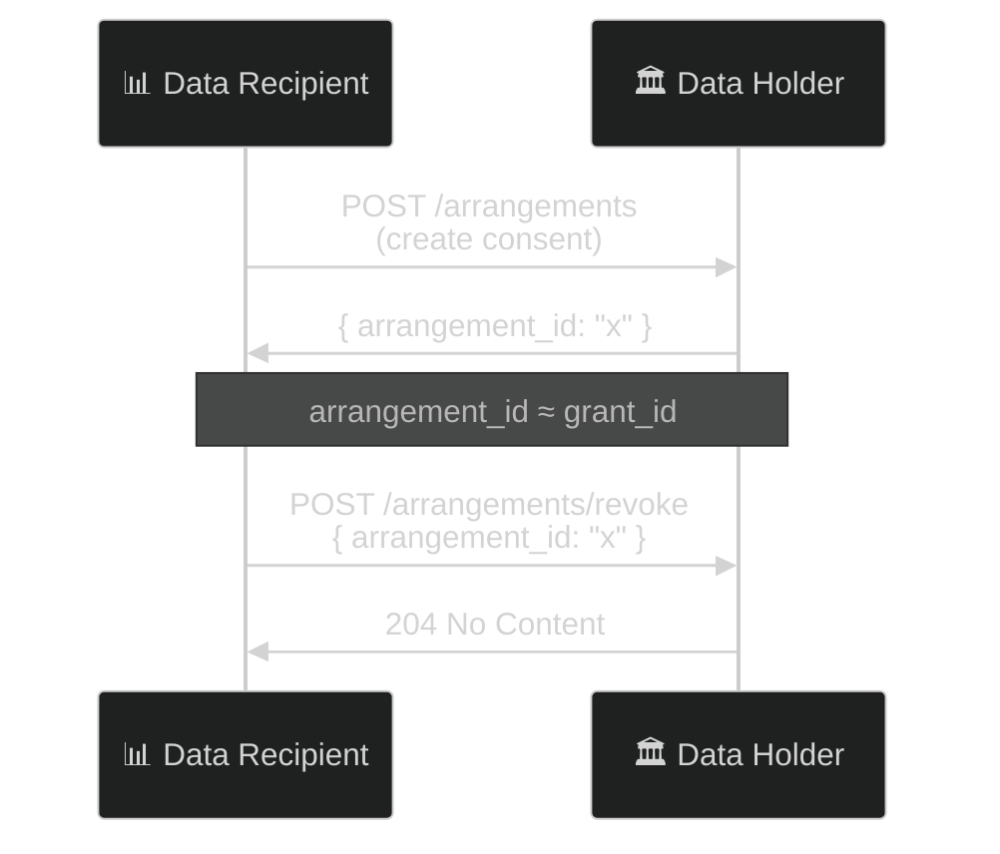

# Grant Management for OAuth 2.0

> **The short version:** Grant Management lets clients explicitly query, merge, replace, and revoke their authorizations — giving them full control over what permissions they have, rather than just having tokens with no visibility.

---

## Table of Contents

- [Part 1: Why Grant Management Exists](#part-1-why-grant-management-exists)
- [Part 2: Core Concepts](#part-2-core-concepts)
- [Part 3: Authlete Setup](#part-3-authlete-setup)
- [Part 4: The Grant Lifecycle](#part-4-the-grant-lifecycle)
- [Part 5: The API](#part-5-the-api)
- [Part 6: Testing with curl](#part-6-testing-with-curl)
- [Part 7: Error Scenarios](#part-7-error-scenarios)
- [Part 8: Use Cases](#part-8-use-cases)
- [Part 9: Troubleshooting](#part-9-troubleshooting)

---

## Part 1: Why Grant Management Exists

### The Problem: No Visibility into Grants

In traditional OAuth, a client has tokens. But what permissions do those tokens represent? How long will they last? Can the client selectively revoke old permissions?

| Problem | What Happens |
|---------|-------------|
| **No visibility** | Client can't see what permissions it has |
| **No selective revocation** | Can only revoke individual tokens, not the underlying authorization |
| **Scope creep** | Adding new scopes requires re-authorizing everything |
| **Regulatory requirements** | UK Open Banking, Australian CDR require explicit consent management |

### The Solution: Explicit Grant Management

Grant Management gives clients:

| Capability | What It Does |
|-----------|-------------|
| **Query** | See exact permissions (scopes, claims, authorization details) |
| **Merge** | Add new permissions without losing existing ones |
| **Replace** | Swap all permissions for new ones |
| **Revoke** | Delete the entire grant and all associated tokens |

### Who Uses Grant Management?

Grant Management is mandatory for **FAPI 2.0 Security Profile**:

| Region | Implementation |
|--------|---------------|
| UK Open Banking | `GET/DELETE /account-access-consents/{ConsentId}` |
| Australian CDR | `cdr_arrangement_id` with revoke endpoints |
| Brazil Open Banking | FAPI 2.0 with Grant Management |
| GAIN | References Grant Management in whitepaper |

---

## Part 2: Core Concepts

### The Grant Lifecycle



### Grant Management Actions

| Action | What It Does | Requires `grant_id` |
|--------|-------------|:-------------------:|
| `create` | Creates a new grant | ❌ (must NOT be present) |
| `merge` | Adds new permissions to existing grant | ✅ |
| `replace` | Replaces all permissions in grant | ✅ |

### The Grant ID

A unique, URL-safe identifier assigned to each grant. It appears in:

- **Authorization request:** `grant_management_action=create` → server generates `grant_id`
- **Token response:** `grant_id` returned with access token
- **API requests:** `GET/DELETE /gm/:grantId` to query or revoke

### API Scopes

| Scope | Access |
|-------|--------|
| `grant_management_query` | Query grant status (GET) |
| `grant_management_revoke` | Revoke grants (DELETE) |

### The scope is not enough — the token must belong to the grant

**A correctly-scoped token is only half the check.** This server additionally requires that the access token
you present was *itself issued under the grant you are addressing*. A token bound to grant `gA` cannot query
or revoke grant `gB`, and gets **403 `access_denied`**.

Without that rule, any holder of a `grant_management_revoke` token could enumerate grant IDs and read or
destroy every other user's grant — verified end to end before it was fixed. Authlete's `/gm` API validates
the token but not who owns the grant, and its response carries no owner information, so the check has to
happen here, before the call. See `server/src/middleware/require-grant-ownership.ts`.

> **Two consequences, and they will bite if you skip them.**
> **(1) A `client_credentials` token can no longer be used.** It has no grant, so it is always denied. This is
> deliberate — it was precisely the hole. Machine-to-machine grant management is not supported.
> **(2) Each grant needs its own token.** With concurrent grants you must keep the token minted alongside
> each one; a token from grant A will not open grant B.
>
> This is stricter than [Grant Management for OAuth 2.0](https://openid.net/specs/oauth-v2-grant-management.html),
> which entitles a *client* to manage grants it owns using any suitably-scoped token.

---

## Part 3: Authlete Setup

### Service-Level Settings

In [Authlete Console](https://console.authlete.com/) → **Service Settings → Grant Management**:

| Setting | Value | Why |
|---------|-------|-----|
| Grant Management Endpoint | `https://your-server.com/api/gm` | Where query/revoke requests go |
| Grant Management Action Required | `false` (default) | Makes `grant_management_action` optional |

### Verify Configuration

```bash
curl http://localhost:3000/api/.well-known/openid-configuration | jq '.grant_management_actions_supported'
```

Expected output:
```json
["create", "query", "merge", "replace", "revoke"]
```

---

## Part 4: The Grant Lifecycle

### Flow 1: Create a Grant



**Key point:** The `grant_id` appears in the token response only when `grant_management_action` was present.

### Flow 2: Query a Grant



### Flow 3: Merge Permissions



**Key point:** The new access token inherits ALL permissions — both original and newly added. The `grant_id` stays the same.

### Flow 4: Replace Grant Permissions



**Key point:** The old permissions (`profile`) are revoked. Only the new permissions (`openid payments`) remain.

### Flow 5: Revoke a Grant



**Key point:** All refresh tokens and access tokens associated with the grant are revoked.

---

## Part 5: The API

### Endpoints

| Method | Path | Purpose | Required Scope |
|--------|------|---------|:--------------:|
| `GET` | `/api/gm/:grantId` | Query grant status | `grant_management_query` |
| `DELETE` | `/api/gm/:grantId` | Revoke grant | `grant_management_revoke` |

### Query Response (200)

```json
{
  "scopes": [
    {
      "scope": "openid profile",
      "resource": ["https://api.example.com"]
    }
  ],
  "claims": ["sub", "name", "email"],
  "authorization_details": [...],
  "created_at": 1700000000,
  "last_updated_at": 1700000000,
  "expires_at": 1700086400,
  "updated_by": "client"
}
```

| Field | Description |
|-------|-------------|
| `scopes` | Scope-resource clusters |
| `claims` | OpenID Connect claims user consented to |
| `authorization_details` | RAR authorization details |
| `created_at` | Unix timestamp when grant was created |
| `last_updated_at` | Unix timestamp of last modification |
| `updated_by` | Who last modified: `"client"` or `"authorization_server"` |

### Revoke Response

`204 No Content` — empty body on success.

### Error Responses

| Status | Error | When |
|:------:|-------|------|
| 401 | `invalid_token` | Missing, expired, or invalid Bearer token |
| 403 | `access_denied` | Token lacks the required scope |
| 403 | `access_denied` | **Token is not associated with the requested grant** — it belongs to a different grant, or to none at all (e.g. `client_credentials`) |
| 404 | `not_found` | Grant ID doesn't exist |

The two 403s return an **identical** body, so a caller cannot use the response to tell "not your grant" from
"your token has no grant" — nor to discover whether a grant exists. The ownership check runs *before* any
Authlete lookup, so a mismatched request looks the same whether or not the grant is real.

---

## Part 6: Testing with curl

### Scenario 1: Create and Query

```bash
# 1. Create a grant via the authorization code flow, requesting the management scopes
#    in the SAME authorization as grant_management_action=create:
#      scope=openid profile grant_management_query grant_management_revoke
#      &grant_management_action=create
#    The token response then carries a sixth member, grant_id.
#
#    KEEP THIS TOKEN. It is the only token that can manage this grant.
QUERY_TOKEN=<access_token from that token response>
GRANT_ID=<grant_id from that token response>

# A client_credentials token will NOT work here — it has no grant, so it gets 403.

# 2. Query the grant
curl -s http://localhost:3000/api/gm/$GRANT_ID \
  -H "Authorization: Bearer $QUERY_TOKEN" | jq .
```

### Scenario 2: Create, Merge, Verify

```bash
# 1. Create initial grant with "openid profile"
# Result: grant_id = "g1"

# 2. Query current state
curl -s http://localhost:3000/api/gm/g1 \
  -H "Authorization: Bearer $QUERY_TOKEN" | jq .scopes
# Expected: [{ "scope": "openid profile" }]

# 3. Merge additional scope "payments"
# (Complete auth flow with grant_management_action=merge, grant_id=g1)
# Result: New token, same grant_id

# 4. Query again
curl -s http://localhost:3000/api/gm/g1 \
  -H "Authorization: Bearer $QUERY_TOKEN" | jq .scopes
# Expected: Both "openid profile" AND "openid profile payments"
```

### Scenario 3: Revoke a Grant

```bash
# 1. Use the token issued alongside grant g1, which must carry grant_management_revoke.
#    Request both management scopes at create time so one token can query AND revoke.
REVOKE_TOKEN=<access_token issued alongside g1>

# 2. Revoke the grant
curl -s -X DELETE http://localhost:3000/api/gm/g1 \
  -H "Authorization: Bearer $REVOKE_TOKEN" -w "%{http_code}"
# Expected: 204

# 3. Try to query (should fail)
curl -s http://localhost:3000/api/gm/g1 \
  -H "Authorization: Bearer $REVOKE_TOKEN"
# Expected: 404 { "error": "not_found" }
# Note the grant is gone but the token still exists, so it passes the ownership
# check and reaches Authlete — which reports the grant as missing.
```

### Scenario 4: Concurrent Grants

```bash
# 1. Create grant A with "openid profile"
# 2. Create grant B with "openid payments" (same user, same client)
# Result: Two different grant_ids: "gA" and "gB"

# 3. Query both — they coexist independently, but each needs ITS OWN token.
#    $TOKEN_A was issued alongside gA, $TOKEN_B alongside gB.
curl -s http://localhost:3000/api/gm/gA -H "Authorization: Bearer $TOKEN_A" | jq .scopes
# Expected: [{ "scope": "openid profile" }]

curl -s http://localhost:3000/api/gm/gB -H "Authorization: Bearer $TOKEN_B" | jq .scopes
# Expected: [{ "scope": "openid payments" }]

# 4. Crossing them over is denied — this is the object-level authorization check.
curl -s http://localhost:3000/api/gm/gB -H "Authorization: Bearer $TOKEN_A"
# Expected: 403 { "error": "access_denied",
#                 "error_description": "The access token is not associated with the requested grant" }
```

---

## Part 7: Error Scenarios

### Missing Bearer Token

```bash
curl http://localhost:3000/api/gm/some-grant
# 401 { "error": "invalid_token" }
```

### Wrong Scope Token

```bash
curl http://localhost:3000/api/gm/some-grant \
  -H "Authorization: Bearer $REVOKE_SCOPED_TOKEN"
# 403 { "error": "access_denied" }
# The ownership pre-check introspects with the required scope, so Authlete returns
# insufficient_scope before the grant-management call is made.
```

### Token Belonging to Another Grant

```bash
# $TOKEN_A was issued alongside grant gA
curl http://localhost:3000/api/gm/gB \
  -H "Authorization: Bearer $TOKEN_A"
# 403 { "error": "access_denied",
#       "error_description": "The access token is not associated with the requested grant" }
```

### client_credentials Token

```bash
CC=$(curl -s -X POST http://localhost:3000/api/token -u "CID:SEC" \
  -d "grant_type=client_credentials&scope=grant_management_query" | jq -r '.access_token')
curl http://localhost:3000/api/gm/any-grant -H "Authorization: Bearer $CC"
# 403 — a client_credentials token has no grant. Identical body to the case above.
```

### Non-Existent Grant

```bash
curl http://localhost:3000/api/gm/non-existent \
  -H "Authorization: Bearer $QUERY_TOKEN"
# 404 { "error": "not_found" }
```

### Missing grant_id with merge

```bash
curl "http://localhost:3000/api/authorization?\
response_type=code&\
client_id=CID&\
scope=openid&\
grant_management_action=merge"
# Error: grant_id required for merge
```

### Grant ID with create

```bash
curl "http://localhost:3000/api/authorization?\
response_type=code&\
client_id=CID&\
scope=openid&\
grant_management_action=create&\
grant_id=some-id"
# Error: grant_id must NOT be present with create
```

### Summary

| Scenario | Result |
|----------|--------|
| No Bearer token | 401 |
| Wrong scope | 403 |
| Token belongs to a different grant | 403 |
| `client_credentials` token (no grant) | 403 |
| Grant not found | 404 |
| merge without grant_id | Error |
| create with grant_id | Error |
| Public client | Rejected (spec requires confidential) |

---

## Part 8: Use Cases

### UK Open Banking (PSD2)



### Australian Consumer Data Right



### FAPI 2.0 Compliance

- [x] Grant Management endpoint configured
- [x] `grant_management_actions_supported` includes all actions
- [x] Server implements GET and DELETE endpoints
- [x] Both endpoints require Bearer token
- [x] Scope validation delegated to Authlete
- [x] Confidential clients only enforced

---

## Part 9: Troubleshooting

| Problem | Cause | Solution |
|---------|-------|----------|
| "Grant not found" | Wrong `grant_id` | Copy from token response |
| 401 "invalid_token" | Wrong scope or expired token | Check scope: query vs. revoke |
| No `grant_id` in response | Missing `grant_management_action` | Include in authorization request |
| Authlete error for action | GM not configured | Enable in Authlete Console |
| Merge doesn't work | Different user | Same user must authenticate |
| Refresh token conflict | Token rotation enabled | Check Authlete settings |

---

## Summary

Grant Management is simple:

1. **Create** grant with `grant_management_action=create`
2. **Query** with `GET /gm/:grantId` (needs `grant_management_query` scope)
3. **Merge** with `grant_management_action=merge` (add permissions)
4. **Replace** with `grant_management_action=replace` (swap permissions)
5. **Revoke** with `DELETE /gm/:grantId` (needs `grant_management_revoke` scope)

**Use Grant Management when:**
- FAPI 2.0 compliance required
- Clients need visibility into their permissions
- Selective revocation needed
- Concurrent grants for same client+user

**Don't use Grant Management when:**
- Simple OAuth deployment (tokens are enough)
- No regulatory requirements

---

## References

- [Grant Management for OAuth 2.0](https://openid.net/specs/oauth-v2-grant-management.html)
- [FAPI 2.0 Security Profile](https://openid.net/specs/openid-financial-api-2_0.html)
- [Authlete KB: Grant Management](https://www.authlete.com/kb/grant-management/)
