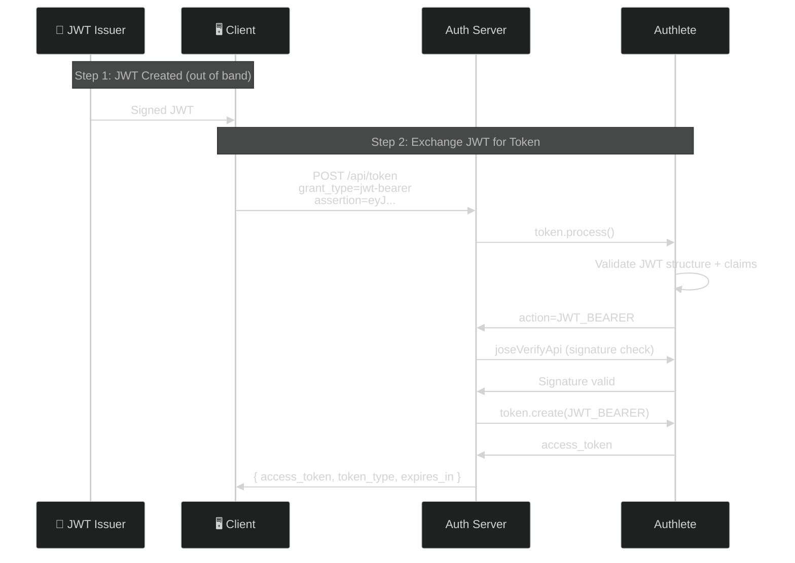
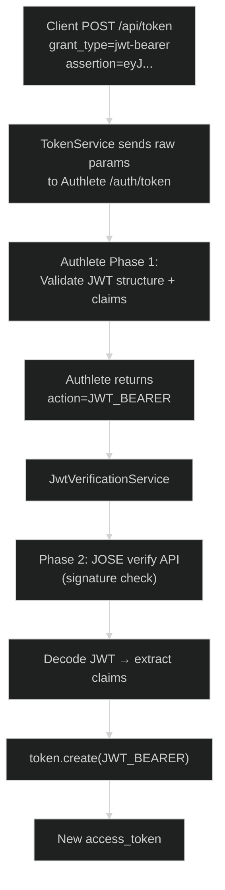
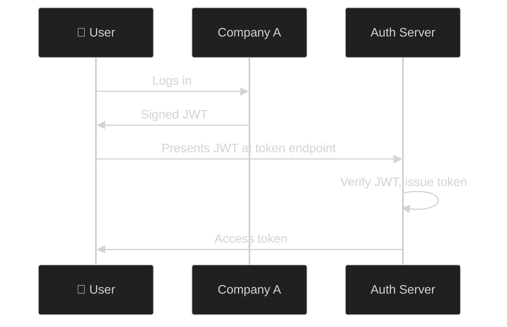
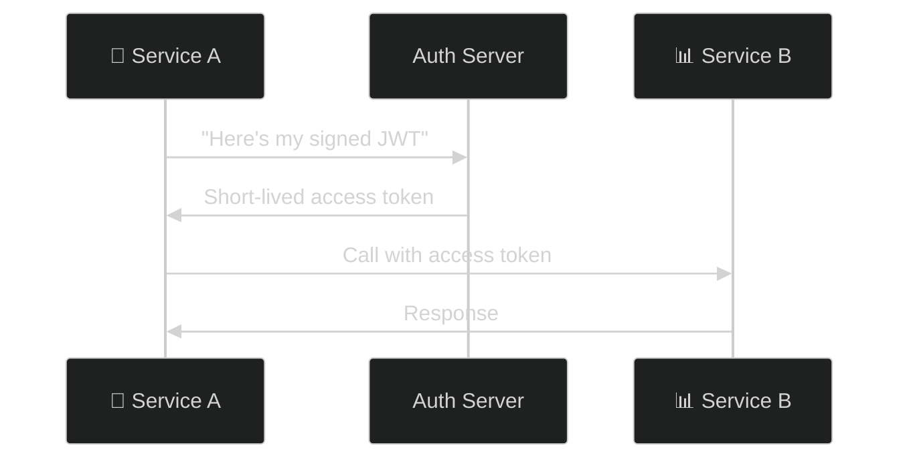
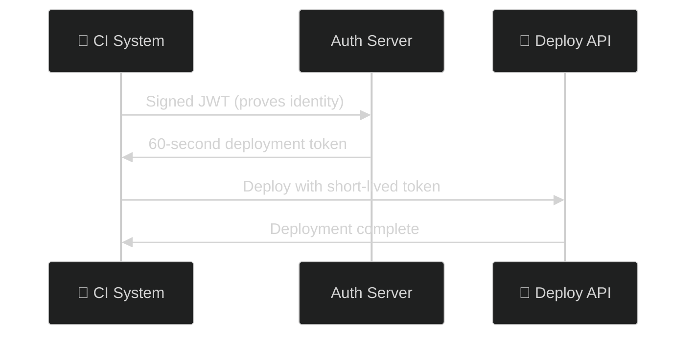

# JWT Authorization Grant (RFC 7523 §2.1)

> **The short version:** JWT Bearer Grant lets you exchange a signed JWT for an access token — no browser redirect, no user interaction. The JWT acts as a "notarized document" proving identity.

---

## Table of Contents

- [Part 1: Why JWT Bearer Grant Exists](#part-1-why-jwt-bearer-grant-exists)
- [Part 2: Core Concept](#part-2-core-concept)
- [Part 3: How It Works](#part-3-how-it-works)
- [Part 4: JWT Claims and Validation](#part-4-jwt-claims-and-validation)
- [Part 5: Authlete Setup](#part-5-authlete-setup)
- [Part 6: Server Implementation](#part-6-server-implementation)
- [Part 7: Testing with curl](#part-7-testing-with-curl)
- [Part 8: Use Cases](#part-8-use-cases)
- [Part 9: Security Hardening](#part-9-security-hardening)
- [Part 10: Error Scenarios](#part-10-error-scenarios)
- [Part 11: Comparison with Other Flows](#part-11-comparison-with-other-flows)
- [Part 12: Troubleshooting](#part-12-troubleshooting)
- [Appendix: Server Architecture](#appendix-server-architecture)

---

## Part 1: Why JWT Bearer Grant Exists

### The Problem: No Browser for Server-to-Server

In standard OAuth, you need a browser redirect. But what about:

- **Server-to-server communication** — No browser, no user, no redirect
- **Cross-domain federation** — Company A has a JWT. Company B needs to trust it
- **CI/CD pipelines** — Deployment systems need short-lived tokens
- **Microservice architectures** — Service A has a signed assertion, needs an access token

### The Solution: JWT as Authorization Grant

RFC 7523 defines using a **signed JWT as an authorization grant**. Instead of an authorization code, you present a signed JWT at the token endpoint.

### Bank Wire Transfer Analogy

| Flow | Analogy |
|------|---------|
| Authorization Code | Walk into bank, show ID, sign form, get cashier's check |
| JWT Bearer Grant | Present notarized document, bank verifies it, give you cash |

The notarized document IS your proof. No need to go through the whole ID verification process.

---

## Part 2: Core Concept

### The Two Roles

| Role | What They Do |
|------|-------------|
| **JWT Issuer** | Creates and signs the JWT (another IdP, trusted party) |
| **Authorization Server** | Receives JWT, verifies it, issues access token |

### The Grant Type

```
grant_type=urn:ietf:params:oauth:grant-type:jwt-bearer
```

### Client Authentication: Optional

Unlike most OAuth flows, JWT bearer grant **does not require client authentication**. The JWT itself IS the proof of identity.

> "JWT authorization grants may be used with or without client authentication or identification." — RFC 7523

However, authorization servers can require client authentication as an additional security layer.

---

## Part 3: How It Works

### Complete Flow



### What Just Happened?

1. **JWT Issuer** created and signed a JWT (out of band — could be any trusted party)

2. **Client** sent the JWT to the token endpoint

3. **Authlete Phase 1** validated JWT structure and claims (format, `iss`, `sub`, `aud`, `exp`)

4. **Authlete Phase 2** verified the JWT signature via JOSE verify API

5. **Authlete** created a new access token

6. **Client** received the access token

### Key Insight: Two-Phase Validation

| Phase | What It Checks | Why Separate? |
|-------|---------------|---------------|
| **Phase 1** | JWT structure + claims | Standard validation |
| **Phase 2** | JWT signature | Requires key discovery (deployment-specific) |

Authlete separates these because signature verification requires knowing which key to use — and that's deployment-specific.

---

## Part 4: JWT Claims and Validation

### Required Claims

| Claim | Required | Description |
|-------|:--------:|-------------|
| `iss` | ✅ | **Issuer** — who created the JWT |
| `sub` | ✅ | **Subject** — who this JWT is about |
| `aud` | ✅ | **Audience** — must include this authorization server |
| `exp` | ✅ | **Expiration** — when the JWT expires |

### Optional Claims

| Claim | Required | Description |
|-------|:--------:|-------------|
| `nbf` | ❌ | **Not Before** — JWT not valid before this time |
| `iat` | ❌ | **Issued At** — when JWT was created |
| `jti` | ❌ | **JWT ID** — replay protection |

### Example JWT

```json
{
  "iss": "https://identity-provider.example.com",
  "sub": "alice@example.com",
  "aud": "https://auth.example.com",
  "exp": 1700000000,
  "nbf": 1699996400,
  "iat": 1699996400,
  "jti": "unique-token-id-123"
}
```

### What Authlete Validates

| Step | Validation | Failure Result |
|:----:|-----------|----------------|
| 1 | `assertion` present | Missing assertion |
| 2 | JWT format valid | Malformed JWT |
| 3 | `iss` claim exists | Missing issuer |
| 4 | `sub` claim exists | Missing subject |
| 5 | `aud` includes this server | Wrong audience |
| 6 | `exp` not expired | Expired JWT |
| 7 | `iat` not in future | JWT from the future |
| 8 | `nbf` not in future | JWT not yet valid |

> **Critical:** Authlete does **NOT** verify the JWT signature in Phase 1. Signature verification happens in Phase 2 via the JOSE verify API.

### Audience Validation

The `aud` claim must include one of:
- The service's **issuer identifier**
- The service's **token endpoint URL**

```bash
# Check your service's issuer
curl http://localhost:3000/api/.well-known/openid-configuration | jq '.issuer'
```

---

## Part 5: Authlete Setup

### Security Settings

In [Authlete Console](https://console.authlete.com/) → **Service Settings → Endpoints → Token → JWT Authz Grant**:

| Setting | Recommended | Why |
|---------|:-----------:|-----|
| Client ID | `Required` | Extra security layer |
| Encrypted JWT | `Rejected` | Authlete can't decrypt |
| Unsigned JWT | `Rejected` | Anyone could forge |

### Verify Configuration

```bash
curl http://localhost:3000/api/.well-known/openid-configuration | jq '.issuer'
```

The JWT you create must have `"aud": "<this_issuer_value>"`.

---

## Part 6: Server Implementation

### How It Works



### Action Mapping

| Action | HTTP Status | Meaning |
|--------|:-----------:|---------|
| `JWT_BEARER` | — | Routed to handler (not final) |
| (success) | 200 | Token created |
| `BAD_REQUEST` | 400 | Invalid JWT |
| `FORBIDDEN` | 403 | Client not authorized |
| `INTERNAL_SERVER_ERROR` | 500 | Server error |

---

## Part 7: Testing with curl

### Scenario 1: Basic JWT Bearer Grant (RS256)

**Step 1: Generate RSA key pair**

```bash
openssl genrsa -out private.pem 2048
openssl rsa -in private.pem -pubout -out public.pem
```

**Step 2: Create signed JWT**

```bash
node -e "
const jwt = require('jsonwebtoken');
const fs = require('fs');
const privateKey = fs.readFileSync('private.pem');
const token = jwt.sign(
  {
    iss: 'https://auth.example.com',
    sub: 'alice@example.com',
    aud: 'https://auth.example.com',
    iat: Math.floor(Date.now() / 1000),
    exp: Math.floor(Date.now() / 1000) + 3600,
  },
  privateKey,
  { algorithm: 'RS256' }
);
console.log(token);
"
```

**Step 3: Exchange for access token**

```bash
curl -X POST http://localhost:3000/api/token \
  -H "Content-Type: application/x-www-form-urlencoded" \
  -d "grant_type=urn:ietf:params:oauth:grant-type:jwt-bearer" \
  -d "assertion=$JWT" \
  -d "client_id=your_client_id"
```

**Response:**
```json
{
  "access_token": "eyJhbGciOiJSUzI1NiIs...",
  "token_type": "Bearer",
  "expires_in": 3600,
  "scope": ""
}
```

### Scenario 2: With Scopes

```bash
curl -X POST http://localhost:3000/api/token \
  -d "grant_type=urn:ietf:params:oauth:grant-type:jwt-bearer" \
  -d "assertion=$JWT" \
  -d "client_id=your_client_id" \
  -d "scope=openid profile email"
```

### Scenario 3: ES256 (ECDSA)

```bash
# Generate EC key
openssl ecparam -genkey -name prime256v1 -noout -out ec-private.pem
openssl ec -in ec-private.pem -pubout -out ec-public.pem

# Sign JWT
node -e "
const jwt = require('jsonwebtoken');
const fs = require('fs');
const privateKey = fs.readFileSync('ec-private.pem');
const token = jwt.sign(
  {
    iss: 'https://auth.example.com',
    sub: 'bob@example.com',
    aud: 'https://auth.example.com',
    iat: Math.floor(Date.now() / 1000),
    exp: Math.floor(Date.now() / 1000) + 3600,
  },
  privateKey,
  { algorithm: 'ES256' }
);
console.log(token);
"
```

### Scenario 4: Without Client Authentication

If the server allows unauthenticated clients:

```bash
curl -X POST http://localhost:3000/api/token \
  -d "grant_type=urn:ietf:params:oauth:grant-type:jwt-bearer" \
  -d "assertion=$JWT"
```

No `client_id` or `client_secret` — the JWT itself is the proof.

---

## Part 8: Use Cases

### 1. Cross-Domain SSO



### 2. Service-to-Service



### 3. CI/CD Pipeline



### 4. IoT Device

Smart device presents device certificate wrapped in JWT → gets 24-hour token.

### 5. Legacy Integration

SAML assertion → converted to JWT → exchanged for OAuth token.

---

## Part 9: Security Hardening

### 1. Stateless Authentication

JWT is self-contained. No database lookup needed.

### 2. Cryptographic Proof

| Check | What It Prevents |
|-------|-----------------|
| Signature verification | Forged JWTs |
| Integrity check | Tampered claims |
| Expiration check | Stale credentials |

### 3. Audience Restriction

The `aud` claim ensures JWT is only valid at the intended server.

### 4. Short-Lived Credentials

JWTs have `exp` claims. Even if stolen, limited validity window.

### 5. No Long-Lived Secrets

Unlike API keys, JWTs are short-lived. Signing keys can be rotated regularly.

### 6. Authlete Security Controls

| Setting | Security Benefit |
|---------|-----------------|
| Client ID Required | Prevents stolen JWTs from unknown clients |
| Reject Encrypted JWT | Can't skip validation |
| Reject Unsigned JWT | Prevents forgery |

---

## Part 10: Error Scenarios

### Missing assertion

```json
{"error": "invalid_request", "error_description": "Missing assertion"}
```

### Expired JWT

```json
{"error": "invalid_grant", "error_description": "The JWT has expired"}
```

### Wrong audience

```json
{"error": "invalid_grant", "error_description": "Audience validation failed"}
```

### Invalid signature

```json
{"error": "invalid_request", "error_description": "Invalid assertion"}
```

### Missing required claims

```json
{"error": "invalid_request", "error_description": "Invalid assertion"}
```

### Unsigned JWT

```json
{"error": "invalid_grant", "error_description": "The JWT is not signed"}
```

### Unauthenticated client

```json
{"error": "invalid_client", "error_description": "Client authentication required"}
```

---

## Part 11: Comparison with Other Flows

| Feature | Auth Code | Client Credentials | JWT Bearer | Token Exchange |
|---------|:---------:|:-----------------:|:----------:|:--------------:|
| Browser redirect | ✅ | ❌ | ❌ | ❌ |
| User interaction | ✅ | ❌ | ❌ | ❌ |
| Client auth required | ✅ | ✅ | Optional | Optional |
| Input credential | Code | Client secret | Signed JWT | Existing token |
| Use case | Web apps | Machine-to-machine | Cross-domain | Token scoping |
| JWT signature check | ❌ | ❌ | ✅ | Depends |

### When to Use JWT Bearer

- You already have a signed JWT from a trusted source
- No browser available (server-to-server)
- Cross-domain identity federation
- Avoid storing long-lived secrets

### When to Use Something Else

- **User present:** Authorization Code (with PKCE)
- **Machine-to-machine, no JWT:** Client Credentials
- **Swap tokens:** Token Exchange

---

## Part 12: Troubleshooting

| Problem | Cause | Solution |
|---------|-------|----------|
| "Missing assertion" | `assertion` not in body | Add `assertion=<your_jwt>` |
| "Invalid assertion" | Signature failed or malformed | Check signing key and algorithm |
| "expired" in description | `exp` in the past | Create fresh JWT |
| "audience" in description | `aud` doesn't match server | Set `aud` to server's issuer |
| 401 Unauthorized | Client auth failed | Include valid `client_id`/`client_secret` |
| "JWT is not signed" | `alg: none` | Always sign with real algorithm |
| Signature fails but JWT looks correct | Can't find signing key | Ensure issuer supports discovery or key is registered |

---

## Appendix: Server Architecture

### Files

| File | Role |
|------|------|
| `server/src/controllers/token.controller.ts:84-99` | Routes `JWT_BEARER` action |
| `server/src/services/jwt-verification.service.ts` | Signature verification + token creation |
| `server/src/services/token.service.ts` | Forwards to Authlete |
| `server/src/services/token.operations.service.ts` | Maps grant type to action |

### Test Coverage

- **Unit:** `jwt-verification.service.test.ts` — 7 tests
- **Unit:** `token.controller.test.ts:136-177` — 2 tests
- **E2E:** `e2e.test.ts:1261-1277` — 1 test

---

## Summary

JWT Bearer Grant is simple:

1. **Issuer** creates and signs a JWT
2. **Client** presents JWT at token endpoint
3. **Auth Server** verifies JWT (structure + signature)
4. **Auth Server** issues access token

**Use JWT Bearer when:**
- Server-to-server communication
- Cross-domain federation
- CI/CD pipelines
- No browser available

**Don't use JWT Bearer when:**
- User is present (use Authorization Code)
- No JWT available (use Client Credentials)

---

## References

- [RFC 7523: JWT Bearer Assertion Grant](https://www.rfc-editor.org/rfc/rfc7523.html)
- [Authlete KB: JWT Bearer Grant](https://www.authlete.com/kb/jwt-bearer-grant/)
- [OpenID Connect Core §12.2](https://openid.net/specs/openid-connect-core-1_0.html#OfflineAccess)
