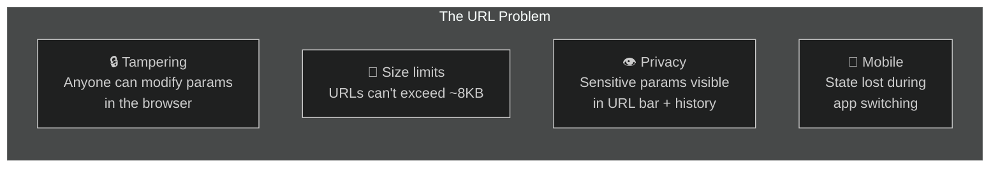
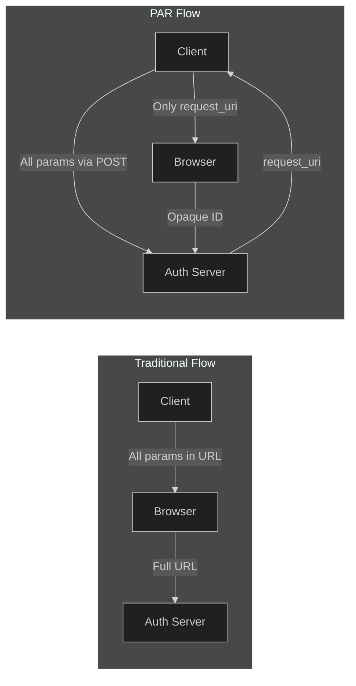
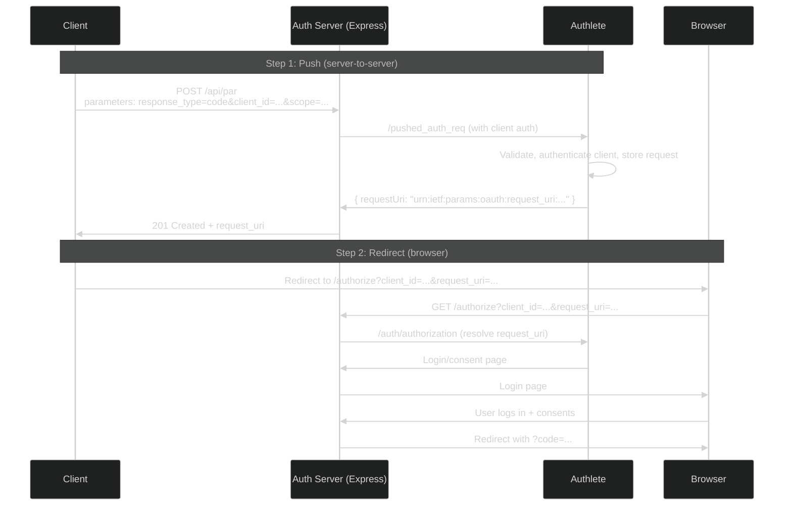
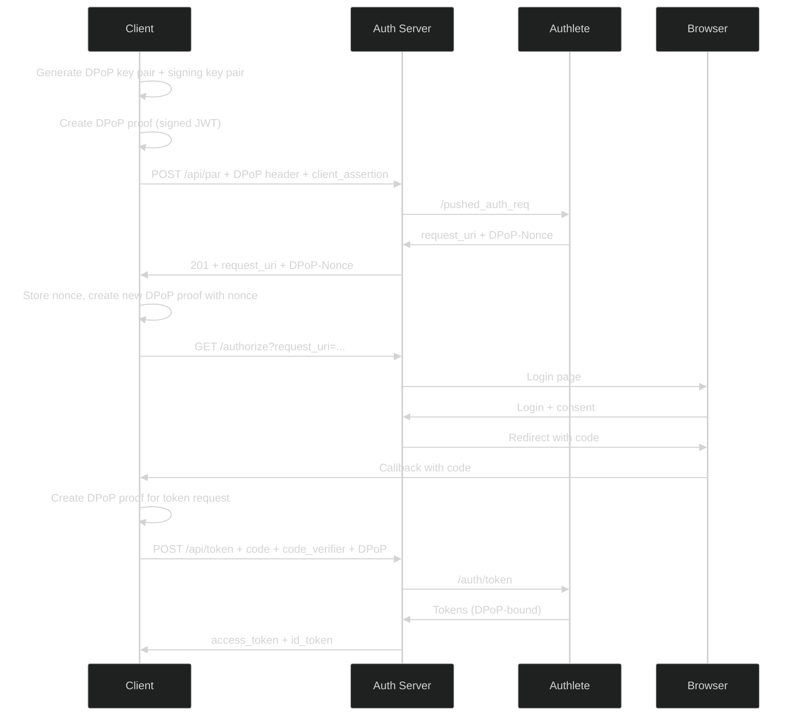

# Pushed Authorization Requests (PAR) — RFC 9126

> **The short version:** PAR lets you send authorization parameters directly to the server (server-to-server) instead of through the browser URL. The browser only gets an opaque `request_uri` — no sensitive data leaks through the URL bar.

---

## Table of Contents

- [Part 1: Why PAR Exists](#part-1-why-par-exists)
- [Part 2: How PAR Works](#part-2-how-par-works)
- [Part 3: Authlete PAR Configuration](#part-3-authlete-par-configuration)
- [Part 4: Step-by-Step PAR Flow](#part-4-step-by-step-par-flow)
- [Part 5: Client Authentication at PAR](#part-5-client-authentication-at-par)
- [Part 6: SPA Testing Tool Walkthrough](#part-6-spa-testing-tool-walkthrough)
- [Part 7: Error Scenarios](#part-7-error-scenarios)
- [Part 8: Industry Use Cases](#part-8-industry-use-cases)
- [Part 9: PAR + DPoP (FAPI 2.0)](#part-9-par--dpop-fapi-20)
- [Part 10: Troubleshooting](#part-10-troubleshooting)

---

## Part 1: Why PAR Exists

### The Problem: Everything in the URL

In the traditional OAuth authorization code flow, you build the authorization URL by stuffing all the parameters into the query string:

```
GET /authorize?
  response_type=code&
  client_id=3280859750204&
  redirect_uri=https://myapp.com/callback&
  scope=openid profile email&
  state=abc123&
  code_challenge=E9Melhoa2OwvFrEMTJguCHaoeK1t8URWbuGJSstw-cM&
  code_challenge_method=S256
```

This URL goes through the browser. And that creates several problems:



| Problem | What Happens | Real Impact |
|---------|-------------|-------------|
| **Request tampering** | Attacker modifies `redirect_uri` or `scope` in the URL | Steals tokens, escalates privileges |
| **URL length limits** | Complex RAR `authorization_details` exceed ~8KB | Request fails silently |
| **Privacy leakage** | `scope`, `claims`, `prompt` visible in URL bar, history, referrer headers | User's permissions exposed |
| **Mobile complexity** | State lost during app switching between browser and app | Authorization fails |

### The Solution: Push Parameters Server-Side

PAR fixes all of this by splitting the authorization request into two steps:

1. **Push** (server-to-server): Send all parameters directly to the authorization server via POST
2. **Redirect** (browser): The browser only sees an opaque `request_uri`



### When Should You Use PAR?

| Scenario | Use PAR? | Why |
|----------|:--------:|-----|
| SPA or mobile app | **Always** | PAR + PKCE is the gold standard for public clients |
| FAPI 2.0 deployment | **Required** | FAPI 2.0 Security Profile mandates PAR |
| Large `authorization_details` (RAR) | **Yes** | URLs can't handle large payloads |
| Sensitive claims in request | **Yes** | Keeps them out of the browser URL |
| Any production deployment | **Recommended** | Defense-in-depth against tampering |

---

## Part 2: How PAR Works

### The Two-Step Flow



### What Just Happened?

1. **Client** sent the full authorization request (with scopes, redirect URI, PKCE challenge, etc.) directly to the server via POST. The browser never saw these parameters.

2. **Authlete** validated the request, authenticated the client, and stored everything. It returned a short-lived `request_uri` — an opaque identifier.

3. **Client** redirected the browser to the authorization endpoint with just `client_id` and `request_uri`.

4. **Authlete** resolved the `request_uri` internally, retrieved the stored request, and processed it as if it had been sent directly.

5. **User** experienced the normal login → consent → code redirect flow.

The `request_uri` expires after a configurable duration (default: 10 minutes). It can only be used once.

### Why Two Steps?

The separation provides three key benefits:

1. **Integrity** — The `request_uri` is bound to the exact parameters that were pushed. Any tampering requires guessing a cryptographically random identifier.

2. **Auditability** — The client is authenticated at the PAR endpoint before any user interaction, providing a clean audit trail.

3. **Flexibility** — Different components can handle each step. An SPA can call PAR from JavaScript, then open the browser via `window.location.href`.

---

## Part 3: Authlete PAR Configuration

### Service-Level Settings

In the [Authlete Console](https://console.authlete.com/), navigate to **Service Settings → Pushed Authorization Request (PAR)**:

| Setting | Recommended | Why |
|---------|:-----------:|-----|
| **Require PAR** | `false` (use per-client) | Allows gradual rollout — new clients use PAR, legacy clients don't |
| **Request URI Duration** | `600` (10 min) | Long enough for user to complete login, short enough to limit exposure |

### Client-Level Settings

Open **Client Settings → Endpoints → General → Pushed Authorization Request**:

| Setting | Description |
|---------|-------------|
| **Require PAR** | Forces this specific client to use PAR |

Client-level enforcement is useful during phased rollouts.

### Verifying Configuration

```bash
# Check if PAR is enabled
curl http://localhost:3000/api/.well-known/openid-configuration | python3 -m json.tool | grep pushed
```

Expected output includes `"pushed_authorization_request_endpoint"` pointing to the PAR endpoint.

---

## Part 4: Step-by-Step PAR Flow

### Prerequisites

- Authlete service with PAR enabled
- A confidential client with `client_id` and `client_secret`
- Servers running on `http://localhost:3000` and `http://localhost:3001`

### Step 1: Push Authorization Request

```bash
curl -X POST http://localhost:3000/api/par \
  -H "Content-Type: application/json" \
  -d '{
    "parameters": "response_type=code&client_id=YOUR_CLIENT_ID&redirect_uri=http://localhost:3001/callback&scope=openid%20profile&state=my_state&code_challenge_method=S256&code_challenge=YOUR_CODE_CHALLENGE",
    "clientId": "YOUR_CLIENT_ID",
    "clientSecret": "YOUR_CLIENT_SECRET"
  }'
```

**Response (201):**
```json
{
  "action": "CREATED",
  "requestUri": "urn:ietf:params:oauth:request_uri:UymBrux4ZEMrBRKx9UyKyIm98zpX1cHmAPGAGNofmm4",
  "responseContent": "{\"expires_in\":600,\"request_uri\":\"urn:ietf:params:oauth:request_uri:UymBrux4ZEMrBRKx9UyKyIm98zpX1cHmAPGAGNofmm4\"}"
}
```

### Step 2: Authorize with request_uri

Open in browser:
```
http://localhost:3000/api/authorization?client_id=YOUR_CLIENT_ID&request_uri=urn:ietf:params:oauth:request_uri:...
```

### Step 3: Complete the Flow

After login and consent, you'll be redirected with an authorization code:
```
http://localhost:3001/callback?code=abc123&state=my_state
```

### Step 4: Exchange Code for Tokens

```bash
curl -X POST http://localhost:3000/api/token \
  -H "Content-Type: application/x-www-form-urlencoded" \
  -d "grant_type=authorization_code" \
  -d "code=abc123" \
  -d "redirect_uri=http://localhost:3001/callback" \
  -d "client_id=YOUR_CLIENT_ID" \
  -d "client_secret=YOUR_CLIENT_SECRET" \
  -d "code_verifier=YOUR_CODE_VERIFIER"
```

### Complete Scripted Flow

```bash
#!/bin/bash
# PAR → Authorize → Code → Token

CID="YOUR_CLIENT_ID"
SEC="YOUR_CLIENT_SECRET"
REDIR="http://localhost:3001/callback"

# 1. Generate PKCE
CODE_VERIFIER=$(openssl rand -base64 48 | tr '+/' '-_' | tr -d '=')
CODE_CHALLENGE=$(echo -n "$CODE_VERIFIER" | openssl dgst -sha256 -binary | openssl base64 -A | tr '+/' '-_' | tr -d '=')
STATE=$(openssl rand -hex 16)

# 2. Push to PAR
PAR_RESP=$(curl -s -X POST http://localhost:3000/api/par \
  -H "Content-Type: application/json" \
  -d "{
    \"parameters\": \"response_type=code&client_id=${CID}&redirect_uri=${REDIR}&scope=openid%20profile&state=${STATE}&code_challenge_method=S256&code_challenge=${CODE_CHALLENGE}\",
    \"clientId\": \"${CID}\",
    \"clientSecret\": \"${SEC}\"
  }")
REQUEST_URI=$(echo "$PAR_RESP" | python3 -c "import sys,json; print(json.load(sys.stdin)['requestUri'])")

# 3. Open in browser
echo "http://localhost:3000/api/authorization?client_id=${CID}&request_uri=${REQUEST_URI}"
```

---

## Part 5: Client Authentication at PAR

Authlete applies the same client authentication methods for the PAR endpoint as for the token endpoint.

### Authentication Methods

| Method | How It Works | When to Use |
|--------|-------------|-------------|
| `client_secret_basic` | HTTP Basic auth header | Server-side apps |
| `client_secret_post` | `client_id` + `client_secret` in body | DCR-created clients (default) |
| `private_key_jwt` | Signed JWT assertion | FAPI 2.0, high-security |
| `none` | No authentication | Public clients (must use PKCE) |

### client_secret_basic

The server sends `clientId` and `clientSecret` in the JSON body. Authlete processes them as Basic auth:

```json
{
  "parameters": "response_type=code&client_id=CID...",
  "clientId": "3280859750204",
  "clientSecret": "qfd0ScLHhD..."
}
```

### private_key_jwt (FAPI 2.0)

The client includes a signed JWT assertion in the `parameters` string:

```json
{
  "parameters": "response_type=code&client_id=CID&client_assertion_type=urn%3Aietf%3Aparams%3Aoauth%3Aclient-assertion-type%3Ajwt-bearer&client_assertion=eyJ...&redirect_uri=...&scope=openid&state=...&code_challenge_method=S256&code_challenge=...",
  "clientId": "YOUR_CLIENT_ID"
}
```

### none (Public Client)

Public clients omit `clientSecret`:

```json
{
  "parameters": "response_type=code&client_id=PUBLIC_CID&redirect_uri=...&scope=openid&state=...&code_challenge_method=S256&code_challenge=...",
  "clientId": "PUBLIC_CID"
}
```

> **Note:** Public clients MUST use PKCE. Authlete enforces this.

---

## Part 6: SPA Testing Tool Walkthrough

The React SPA includes a **PAR** section with a full testing interface.

### Opening the PAR Section

1. Start both servers
2. Open `http://localhost:3001`
3. Click **PAR** in the sidebar (under OIDC & Extensions)

### Testing Scenarios

**Scenario 1: Standard PAR (confidential client + PKCE)**

1. Click **Generate PKCE + State**
2. Enter `Client ID` and `Client Secret`
3. Click **Push Authorization Request** → see `request_uri`
4. Click **Authorize (redirect)** → login → consent → code → tokens

**Scenario 2: PAR with public client**

1. Click **Generate PKCE + State**
2. Enter public `Client ID`, leave Secret empty
3. Click **Push Authorization Request** → succeeds without secret
4. Continue the flow

**Scenario 3: PAR with DPoP**

1. Click **Generate PKCE + State**
2. Enter credentials, check **Use DPoP**
3. Click **Push Authorization Request** → DPoP key generated, proof sent
4. Continue with DPoP-bound tokens

---

## Part 7: Error Scenarios

| HTTP Status | Meaning | Common Causes |
|:-----------:|---------|---------------|
| `400` | Bad request | Missing `response_type`, invalid `redirect_uri`, expired `request_uri` |
| `401` | Client auth failed | Wrong `clientSecret`, unregistered `clientId` |
| `403` | Client not authorized | PAR not enabled for this client |
| `413` | Payload too large | Parameters exceed size limit |
| `500` | Server error | Authlete API failure |

### Common Errors

**"Missing required body field: parameters"**
→ Ensure your JSON body includes `"parameters": "response_type=code&client_id=..."`

**"The redirected URI is not registered"**
→ Use a `redirect_uri` registered in Authlete Console for your client

**"expired_request_uri" at /authorize**
→ The `request_uri` expired. Default lifetime is 10 minutes. Push and redirect within that window.

**401 with correct credentials (DCR clients)**
→ DCR-created confidential clients default to `CLIENT_SECRET_POST`. Send credentials in the body, not as Basic auth.

---

## Part 8: Industry Use Cases

### Open Banking / FAPI

FAPI 2.0 Security Profile **requires** PAR for all authorization requests. Open Banking APIs use PAR with `private_key_jwt` and DPoP to ensure:
- Request integrity (no tampering during browser redirect)
- Strong client authentication (before any user interaction)
- Large payloads (payment consent JWT in `authorization_details`)

### SPAs

SPAs can't keep secrets. PAR adds security:
- Call PAR from JavaScript using `fetch()`
- Browser redirect only contains `client_id` + `request_uri`
- No sensitive parameters in URL bar or history

```javascript
// SPA code
const response = await fetch('/api/par', {
  method: 'POST',
  headers: { 'Content-Type': 'application/json' },
  body: JSON.stringify({
    parameters: 'response_type=code&client_id=...&scope=openid&code_challenge_method=S256&code_challenge=...',
    clientId: '...',
  }),
});
const { requestUri } = await response.json();
window.location.href = `/api/authorization?client_id=...&request_uri=${requestUri}`;
```

### Mobile Apps

Mobile apps face unique challenges with OAuth. PAR simplifies:
1. App calls PAR while still in the foreground
2. Full request captured server-side
3. App opens browser with just `request_uri`
4. After authorization, browser redirects back with code

No need to encode complex parameters into deep link URLs.

### Backend-for-Frontend (BFF)

In a BFF architecture:
1. Frontend asks BFF to authenticate
2. BFF constructs full request, calls PAR
3. BFF returns `request_uri` to frontend
4. Frontend redirects to `/authorize` with `request_uri`
5. Authorization completes, code redirects to BFF
6. BFF exchanges code for tokens

**Security benefit:** The authorization payload never touches the browser.

---

## Part 9: PAR + DPoP (FAPI 2.0)

In FAPI 2.0, PAR is used with DPoP (RFC 9449) and `private_key_jwt`:



### DPoP Nonce Handling

- First request without nonce → server returns `DPoP-Nonce` header
- Client stores nonce, includes it in next DPoP proof
- Expired nonce → server returns 401 with new `DPoP-Nonce`
- SPA stores nonces in `sessionStorage` under `dpop_nonce`

---

## Part 10: Troubleshooting

| Problem | Likely Cause | Solution |
|---------|-------------|----------|
| "Missing required body field: parameters" | `parameters` field not in body | Add `"parameters": "response_type=code&client_id=..."` to JSON body |
| "The redirected URI is not registered" | `redirect_uri` not in Authlete Console | Register the redirect URI for your client |
| "unknown_client" | `client_id` not registered | Verify client exists in Authlete Console |
| "expired_request_uri" | `request_uri` expired (default 10 min) | Push and redirect within the window |
| 401 with correct credentials | DCR client defaults to CLIENT_SECRET_POST | Send credentials in body, not Basic auth |
| "PAR is not enabled for this client" | `requirePar` not enabled | Enable in Authlete Console |
| DPoP "invalid_dpop_proof" | Wrong key or wrong claims | Ensure `htm`=`POST`, `htu`=PAR URL, raw R||S signature for ES256 |
| "payload_too_large" | Parameters too large | Reduce `authorization_details` or claims payload |

---

## Summary

PAR is simple but powerful. Instead of stuffing everything into the browser URL:

1. POST all parameters to `/api/par` (server-to-server)
2. Get back an opaque `request_uri`
3. Redirect the browser with just `client_id` + `request_uri`
4. Authlete resolves the `request_uri` internally

**PAR + PKCE = gold standard for public client security.**
**PAR is required for FAPI 2.0.**
**Use PAR for any production deployment.**

---

## References

- [RFC 9126: OAuth 2.0 Pushed Authorization Requests](https://www.rfc-editor.org/rfc/rfc9126.html)
- [Authlete KB: Pushed Authorization Requests](https://www.authlete.com/kb/oauth-and-openid-connect/authorization-requests/pushed-authorization-requests/)
- [FAPI 2.0 Security Profile](https://openid.net/specs/fapi-2_0-security-profile.html)
- [DPoP: RFC 9449](https://www.rfc-editor.org/rfc/rfc9449.html)
