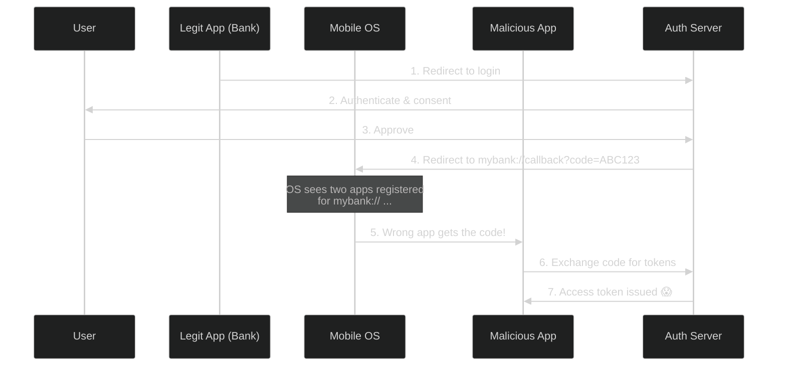
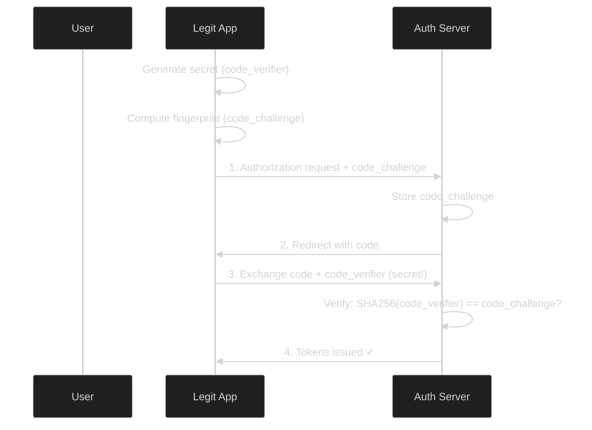
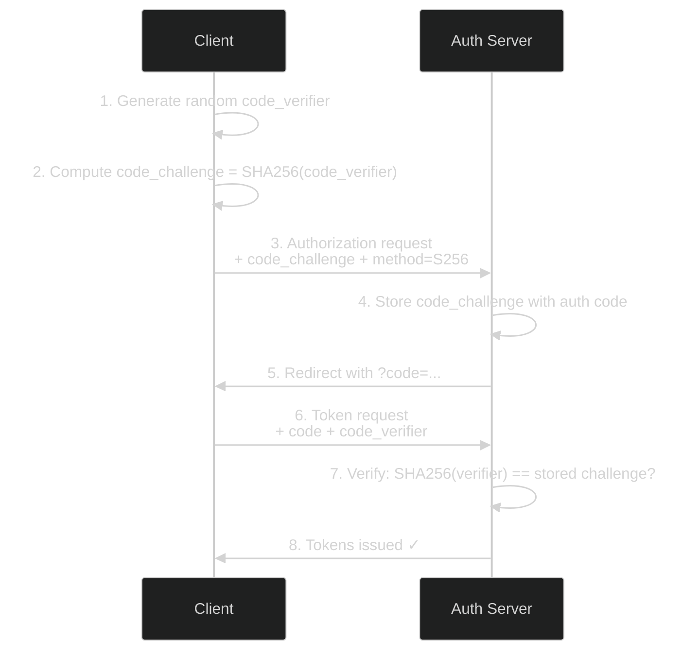
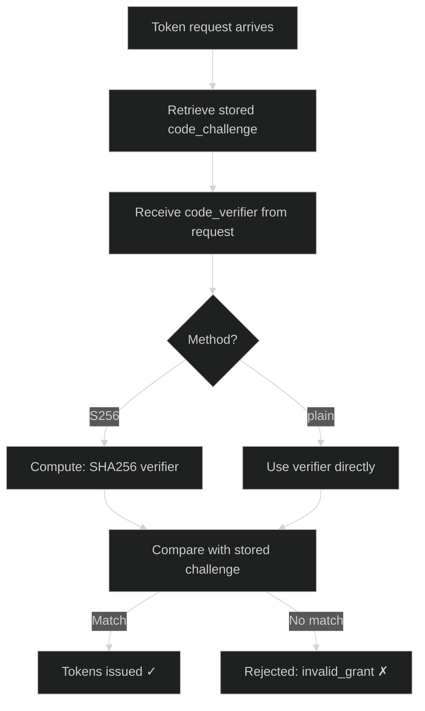
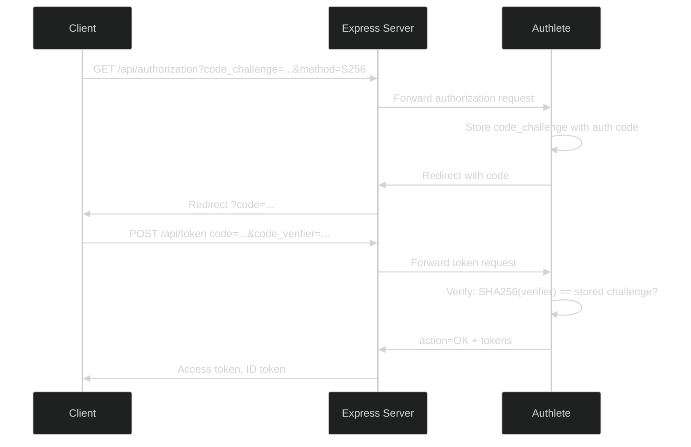
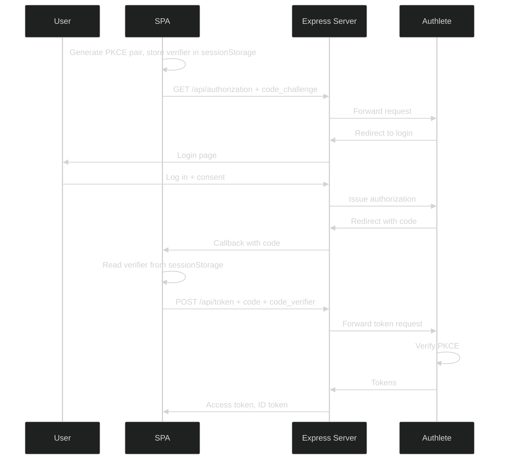

# Proof Key for Code Exchange (PKCE) — RFC 7636

> **The short version:** PKCE prevents someone from stealing your authorization code and using it. It's the single most important security improvement you can make to your OAuth implementation.

---

## Table of Contents

- [Part 1: Why PKCE Exists](#part-1-why-pkce-exists)
- [Part 2: The Core Concept](#part-2-the-core-concept)
- [Part 3: How PKCE Works (Step by Step)](#part-3-how-pkce-works-step-by-step)
- [Part 4: The Math Behind PKCE](#part-4-the-math-behind-pkce)
- [Part 5: Authlete Console Setup](#part-5-authlete-console-setup)
- [Part 6: Client Implementation](#part-6-client-implementation)
- [Part 7: Server Implementation](#part-7-server-implementation)
- [Part 8: Step-by-Step curl Testing](#part-8-step-by-step-curl-testing)
- [Part 9: How PKCE Hardens Security](#part-9-how-pkce-hardens-security)
- [Part 10: PKCE + FAPI 2.0](#part-10-pkce--fapi-20)
- [Part 11: Testing with the Client SPA](#part-11-testing-with-the-client-spa)
- [Part 12: Error Scenarios](#part-12-error-scenarios)
- [Part 13: PKCE Myths and Misconceptions](#part-13-pkce-myths-and-misconceptions)
- [Part 14: Troubleshooting](#part-14-troubleshooting)

---

## Part 1: Why PKCE Exists

### The Problem: Authorization Code Interception

Here's a scenario that should worry you.

You're building a mobile banking app. The user taps "Login," your app opens the browser, the auth server authenticates the user, and redirects back to your app with an authorization code:

```
mybank://callback?code=ABC123
```

But here's the thing — on iOS and Android, **any app can register a custom URL scheme**. A malicious app on the same phone could register `mybank://` and intercept that code. Now the attacker has your authorization code, and they can exchange it for the user's access token.



This isn't theoretical. It's happened in production. The authorization code is a bearer credential — whoever has it can use it.

### The Solution: PKCE

PKCE (pronounced "pixy" — like the fairy) fixes this by adding a **proof** that the app exchanging the code is the same app that started the authorization request.

Here's the key insight: the app generates a secret, shows a "fingerprint" of it to the auth server, and later proves it has the original secret. Even if an attacker steals the code, they can't use it because they don't have the secret.



Even if the attacker intercepts the code at step 2, they can't complete step 3 — they don't have the `code_verifier`.

### Before PKCE vs. After

| Scenario | Without PKCE | With PKCE |
|----------|:-----------:|:---------:|
| Code intercepted on mobile | Attacker gets tokens | Attacker blocked — no code_verifier |
| Code intercepted via malware | Same | Same — attacker blocked |
| Legitimate app exchanges code | Works | Works — has the code_verifier |

**Bottom line:** PKCE turns an authorization code from a "bearer" credential into a "proof of possession" credential.

---

## Part 2: The Core Concept

### The Two Values

PKCE works with two values:

1. **Code Verifier** — A random secret generated by the client. Never sent to the auth server during the authorization request. Kept secret on the client.

2. **Code Challenge** — A "fingerprint" of the code verifier. Sent to the auth server during the authorization request. Stored alongside the authorization code.

### The Analogy

Think of it like a **lock and key**:

- You put a lock on a box (code_challenge) and send the box to the auth server
- The auth server gives you a receipt (authorization code) 
- To claim your tokens, you present the receipt AND the key that fits the lock (code_verifier)
- The auth server checks that the key fits → tokens issued

The key never traveled with the box. An interceptor only has the receipt — useless without the key.

### What Changes (and What Doesn't)

PKCE doesn't change the grant type. It's still:

```
grant_type=authorization_code
```

PKCE adds **two parameters** to the authorization request and **one parameter** to the token request. That's it.

---

## Part 3: How PKCE Works (Step by Step)



### Step by Step

**Step 1:** Client generates a random `code_verifier` (43-128 characters from `[A-Za-z0-9-._~]`)

**Step 2:** Client computes `code_challenge` from the verifier using S256:
```
code_challenge = BASE64URL(SHA256(code_verifier))
```

**Step 3:** Client sends authorization request with `code_challenge` and `code_challenge_method=S256`

**Step 4:** Auth server stores the `code_challenge` alongside the authorization code

**Step 5:** Auth server redirects back with the authorization code

**Step 6:** Client exchanges the code for tokens, including the original `code_verifier`

**Step 7:** Auth server computes the challenge from the presented verifier, compares it with the stored challenge

**Step 8:** If they match → tokens issued. If not → rejected.

---

## Part 4: The Math Behind PKCE

### Code Verifier Generation

A code verifier is a cryptographically random string:

```
Characters: [A-Z] / [a-z] / [0-9] / "-" / "." / "_" / "~"
Length: 43 to 128 characters (this server uses 64)
```

Example:
```
dBjftJeZ4CVP-mB92K27uhbUJU1p1r_wW1gFWFOEjXk
```

### Code Challenge Methods

#### S256 (Recommended)

```
code_challenge = BASE64URL(SHA256(ASCII(code_verifier)))
```

Example:
```
code_verifier:  dBjftJeZ4CVP-mB92K27uhbUJU1p1r_wW1gFWFOEjXk
code_challenge: E9Melhoa2OwvFrEMTJguCHaoeK1t8URWbuGJSstw-cM
```

**Why S256 is better:** The auth server only stores the **hash**, not the original verifier. Even if the auth server's database is compromised, the attacker can't recover the verifier.

#### plain (Not Recommended)

```
code_challenge = code_verifier
```

The challenge IS the verifier. This defeats the purpose — if the auth server is compromised, the attacker gets the verifier directly.

### Verification Process

When the token request arrives:



---

## Part 5: Authlete Console Setup

### Service-Level Settings

1. Log into [Authlete Console](https://console.authlete.com/)
2. Select your Service
3. Go to **Service Settings → Endpoints → Authorization → General**
4. Under **Proof Key for Code Exchange (PKCE)**:

| Setting | Recommended | Why |
|---------|:-----------:|-----|
| **Require PKCE** | `true` | Reject authorization requests without `code_challenge` |
| **Require S256** | `true` | Reject `plain` method — only allow the secure option |

### Client-Level Settings

For each client, go to **Client Settings → Endpoints → Authorization → General**:

| Setting | Recommended | Why |
|---------|:-----------:|-----|
| **Require PKCE** | `true` | This client must use PKCE |
| **Require S256** | `true` | This client must use S256 |

### When to Enforce PKCE

| Client Type | PKCE Required? | Why |
|------------|:--------------:|-----|
| Public clients (SPAs, mobile apps) | **Always** | These apps can't keep secrets. Without PKCE, intercepted codes can be exchanged by anyone. |
| Confidential clients | **Recommended** | Defense-in-depth. Even with client authentication, PKCE prevents code injection attacks. |

---

## Part 6: Client Implementation

### PKCE Utilities

The client includes a complete PKCE implementation using browser-native crypto:

```typescript
// client/src/pkce.ts

// Generate a random code verifier (64 characters)
export async function generateCodeVerifier(length = 64): Promise<string> {
  const chars = 'ABCDEFGHIJKLMNOPQRSTUVWXYZabcdefghijklmnopqrstuvwxyz0123456789-._~';
  const randomValues = new Uint8Array(length);
  crypto.getRandomValues(randomValues);
  let verifier = '';
  for (let i = 0; i < length; i += 1) {
    verifier += chars[randomValues[i] % chars.length];
  }
  return verifier;
}

// Compute S256 code challenge
export async function generateCodeChallenge(verifier: string): Promise<string> {
  const data = new TextEncoder().encode(verifier);
  const digest = await crypto.subtle.digest('SHA-256', data);
  return base64UrlEncode(digest);
}

// Generate a PKCE pair
export async function createPkcePair() {
  const codeVerifier = await generateCodeVerifier();
  const codeChallenge = await generateCodeChallenge(codeVerifier);
  return { codeVerifier, codeChallenge };
}
```

### Where PKCE Is Used

PKCE is used in **every** authorization code flow in the client:

| Component | How It Uses PKCE |
|-----------|-----------------|
| `AuthFlowsSection.tsx` | Generates PKCE pair, stores verifier in `sessionStorage`, sends challenge |
| `CallbackPage.tsx` | Reads verifier from `sessionStorage`, sends with token exchange |
| `ParSection.tsx` | Generates PKCE pair for PAR flows |
| `RarSection.tsx` | Generates PKCE pair for RAR flows |
| `FapiSection.tsx` | Generates PKCE pair for FAPI 2.0 flows |
| `TokenContext.tsx` | Clears `pkce_code_verifier` on logout |

---

## Part 7: Server Implementation

### How It Works

The server **delegates all PKCE handling to Authlete**. There is no custom PKCE code in the server — Authlete validates the challenge/verifier pair automatically.



### What Authlete Validates

| Step | What Authlete Checks |
|:----:|---------------------|
| 1 | `code_challenge` is present (if PKCE required) |
| 2 | `code_challenge_method` is valid (`S256` or `plain`) |
| 3 | `code_verifier` is present in token request |
| 4 | `code_verifier` matches the stored `code_challenge` |
| 5 | `code_verifier` length is 43-128 characters |
| 6 | `code_verifier` contains only allowed characters |

---

## Part 8: Step-by-Step curl Testing

### Prerequisites

1. Authlete service with PKCE enabled
2. A public client with `clientId` (no `clientSecret`)
3. This server running on `http://localhost:3000`

### Scenario 1: Full PKCE Flow

**Step 1:** Generate a code verifier and challenge

```bash
# Generate a random code verifier (64 chars)
CODE_VERIFIER=$(openssl rand -base64 64 | tr -d '=/+' | head -c 64)
echo "Code Verifier: $CODE_VERIFIER"

# Compute the S256 code challenge
CODE_CHALLENGE=$(echo -n "$CODE_VERIFIER" | openssl dgst -sha256 -binary | base64url)
echo "Code Challenge: $CODE_CHALLENGE"
```

**Step 2:** Start the authorization request

```bash
AUTH_URL="http://localhost:3000/api/authorization?response_type=code"
AUTH_URL="${AUTH_URL}&client_id=YOUR_PUBLIC_CLIENT_ID"
AUTH_URL="${AUTH_URL}&redirect_uri=http://localhost:3000"
AUTH_URL="${AUTH_URL}&scope=openid+profile"
AUTH_URL="${AUTH_URL}&state=$(openssl rand -hex 16)"
AUTH_URL="${AUTH_URL}&code_challenge=${CODE_CHALLENGE}"
AUTH_URL="${AUTH_URL}&code_challenge_method=S256"

echo "Open this URL in your browser:"
echo "$AUTH_URL"
```

**Step 3:** Complete login and consent. Open the URL, log in with `admin` / `password`, approve consent.

**Step 4:** Exchange the code for tokens

```bash
curl -X POST http://localhost:3000/api/token \
  -H "Content-Type: application/x-www-form-urlencoded" \
  -d "grant_type=authorization_code" \
  -d "code=AUTHORIZATION_CODE" \
  -d "redirect_uri=http://localhost:3000" \
  -d "client_id=YOUR_PUBLIC_CLIENT_ID" \
  -d "code_verifier=${CODE_VERIFIER}"
```

**Response:**
```json
{
  "access_token": "eyJhbGciOiJSUzI1NiIs...",
  "token_type": "Bearer",
  "expires_in": 3600,
  "scope": "openid profile",
  "id_token": "eyJhbGciOiJSUzI1NiIs..."
}
```

### Scenario 2: Wrong Code Verifier (Attack Simulation)

```bash
# Try with a DIFFERENT code verifier (attacker doesn't have the original)
curl -X POST http://localhost:3000/api/token \
  -H "Content-Type: application/x-www-form-urlencoded" \
  -d "grant_type=authorization_code" \
  -d "code=AUTHORIZATION_CODE" \
  -d "redirect_uri=http://localhost:3000" \
  -d "client_id=YOUR_PUBLIC_CLIENT_ID" \
  -d "code_verifier=WRONG_VERIFIER_123456789012345678901234567890"
```

**Response (400):**
```json
{
  "error": "invalid_grant",
  "error_description": "The code_verifier is not valid."
}
```

This proves PKCE works — even with a valid authorization code, the wrong verifier is rejected.

---

## Part 9: How PKCE Hardens Security

### 1. Prevents Authorization Code Interception

This is the primary purpose. Even if an attacker intercepts the authorization code:
- They don't have the `code_verifier` (it was never sent during the authorization request)
- They can't compute it (they don't know the original random secret)
- The token exchange fails

### 2. Protects Public Clients

Public clients (SPAs, mobile apps) can't keep secrets. Without PKCE, the authorization code is the only credential. If intercepted, the attacker has everything. With PKCE, the code_verifier acts as a "one-time secret" that never travels through the browser.

### 3. Defense-in-Depth for Confidential Clients

Even with client authentication (client_secret), PKCE adds protection against authorization code injection attacks and CSRF-based code reuse. FAPI 2.0 requires PKCE for all clients.

### 4. No Server-Side State Needed

Unlike some security mechanisms, PKCE doesn't require the auth server to store session state. The challenge is stored alongside the authorization code, and verification is a simple hash comparison.

---

## Part 10: PKCE + FAPI 2.0

PKCE is **mandatory** in FAPI 2.0 Security Profile. The FAPI section in the client SPA demonstrates this:

| FAPI Requirement | How PKCE Helps |
|-----------------|---------------|
| Authorization code interception prevention | PKCE is the primary defense |
| Sender-constrained tokens | DPoP + PKCE together |
| No token leakage | PKCE ensures only the legitimate client can exchange codes |

The FAPI wizard in the client SPA automatically generates PKCE:

```typescript
const pkce = await createPkcePair();
sessionStorage.setItem('pkce_code_verifier', pkce.codeVerifier);

const params = new URLSearchParams({
  response_type: 'code',
  client_id: wizClientId,
  redirect_uri: wizRedirectUri,
  scope: wizScopes,
  code_challenge: pkce.codeChallenge,
  code_challenge_method: 'S256',
  state,
  // ... plus client_assertion and DPoP proof
});
```

---

## Part 11: Testing with the Client SPA

1. Start both servers:
   ```bash
   npm --prefix server run dev
   npm --prefix client run dev
   ```

2. Open `http://localhost:3001`

3. Click **Grant Flows** → select **Auth Code (PKCE)**

4. Enter your `Client ID` → click **Start Flow**

5. Log in with `admin` / `password` → approve consent

6. You'll be redirected back with tokens

### What Happens Under the Hood



### Verify in DevTools

Open browser DevTools → Network tab:

1. Look at the `/api/authorization` request → you'll see `code_challenge` and `code_challenge_method=S256`
2. Look at the `/api/token` request → you'll see `code_verifier` in the POST body
3. `sessionStorage` shows `pkce_code_verifier` during the flow (cleared on completion)

---

## Part 12: Error Scenarios

| Error | Cause | Fix |
|-------|-------|-----|
| `code_verifier is not valid` | Presented verifier doesn't match stored challenge | Use the exact same code_verifier that generated the code_challenge |
| `code_verifier is required` | Authorization code has a challenge, but token request lacks verifier | Always include `code_verifier` when the authorization request included `code_challenge` |
| `PKCE is required` | Auth server requires PKCE, but authorization request lacks `code_challenge` | Generate a PKCE pair and include `code_challenge` + `code_challenge_method=S256` |
| Tokens work without PKCE | PKCE not enabled on Authlete service or client | Enable PKCE in both service and client settings in Authlete Console |
| Verifier lost between redirect | `sessionStorage` entry was cleared or page refreshed | Store verifier before redirect, read it in callback before clearing |

---

## Part 13: PKCE Myths and Misconceptions

### Myth 1: "PKCE is only for public clients"

**Reality:** PKCE benefits all clients. FAPI 2.0 requires PKCE for all clients, including confidential ones.

### Myth 2: "PKCE replaces client authentication"

**Reality:** PKCE and client authentication are orthogonal. PKCE proves "I'm the same party that started the request." Client authentication proves "I am the registered client." Use both.

### Myth 3: "plain method is fine for testing"

**Reality:** Even in testing, use S256. The `plain` method stores the raw verifier on the server — if the server is compromised, all verifiers are exposed.

### Myth 4: "PKCE prevents CSRF"

**Reality:** PKCE prevents code interception, not CSRF. You still need the `state` parameter for CSRF protection. PKCE + state together provide comprehensive protection.

### Myth 5: "PKCE adds complexity"

**Reality:** PKCE adds ~20 lines of code to the client. The security benefit far outweighs the implementation cost.

---

## Part 14: Troubleshooting

| Problem | Likely Cause | Solution |
|---------|-------------|----------|
| "code_verifier is not valid" | Wrong verifier or verifier regenerated | Use the exact same code_verifier from step 1 |
| "code_verifier is required" | Missing verifier in token request | Include `code_verifier` in POST body |
| "PKCE is required" | Missing `code_challenge` in auth request | Add `code_challenge` + `method=S256` |
| Tokens work without PKCE | PKCE not enabled | Enable in Authlete Console (Part 5) |
| Verifier lost | sessionStorage cleared | Store before redirect, read in callback |

---

## Summary

PKCE is simple but powerful. It turns an authorization code from a bearer credential into a proof-of-possession credential. Here's what you need to remember:

1. Generate a random `code_verifier`
2. Compute `code_challenge = SHA256(code_verifier)`
3. Send `code_challenge` with the authorization request
4. Send `code_verifier` with the token request
5. Authlete handles the rest

**Always use S256. Never use plain. Always enforce PKCE for public clients.**
