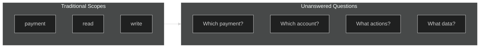
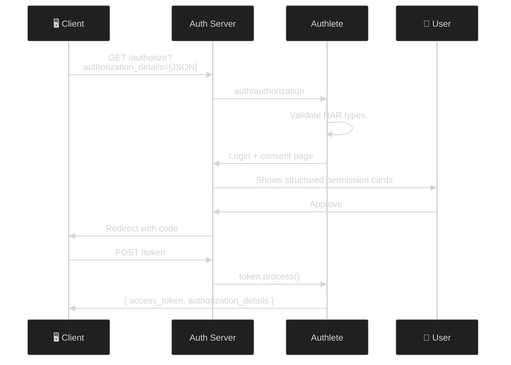

# Rich Authorization Requests (RAR) — RFC 9396

> **The short version:** RAR replaces flat `scope` strings with structured JSON objects that describe exactly what the client wants to do, on which resources, with what data types — giving users and servers precise visibility into authorization requests.

> ### How the transcripts below were verified
>
> Labels are **captured** / *illustrative* / **`UNVERIFIED`** — defined once in
> [the tutorial index](README.md#how-to-read-the-transcripts-in-these-tutorials).
>
> **RAR runs on this deployment, for exactly one `type`.** As of **2026-08-14** the service registers
> `supportedAuthorizationDetailsTypes = ["payment_initiation"]` and client `1523514379` registers
> `authorizationDetailsTypes = ["payment_initiation"]`. Both were added on 2026-08-12, and the full round
> trip — authorization request accepted, granted details on the token response, granted details on
> introspection — was run end to end that day. The transcript lives in
> [`modules/09a…/lab.md` 5b](curriculum/modules/09a-interaction-extensions/lab.md); the response shapes in
> Parts 4, 5 and 6 below are taken from it.
>
> **Every other `type` in this file is refused**, with `invalid_authorization_details` and `[A249302]`.
> That includes `account_information`, `document_access` and `id_card_verification` in
> [Part 7](#part-7-common-rar-types) — those are the specification's examples, not this service's
> configuration. Register the type on the service *and* on the client before expecting any of them to work;
> both halves are required, and the client half is the one people forget.
>
> **Until 2026-08-12 nothing in this file was runnable at all** — no type was registered, so Authlete
> refused *every* RAR request. The three success transcripts that used to be here were unmarked and
> unproducible. They are now derived from a real round trip, which is why they no longer say
> `expires_in: 3600`: the service default is **86400**.

---

## Table of Contents

- [Part 1: Why RAR Exists](#part-1-why-rar-exists)
- [Part 2: How RAR Works](#part-2-how-rar-works)
- [Part 3: Authlete Setup](#part-3-authlete-setup)
- [Part 4: Step-by-Step Flow](#part-4-step-by-step-flow)
- [Part 5: RAR + PAR](#part-5-rar--par)
- [Part 6: Token & Introspection](#part-6-token--introspection)
- [Part 7: Common RAR Types](#part-7-common-rar-types)
- [Part 8: Troubleshooting](#part-8-troubleshooting)

---

## Part 1: Why RAR Exists

### The Problem: Flat Scopes Aren't Enough

Traditional OAuth scopes are flat strings:

```
scope=payment
```

This tells the server very little. Is the client initiating a payment? Reading transaction history? Both?



| Limitation | What Happens |
|-----------|-------------|
| **No structure** | `payment` could mean anything |
| **No granularity** | Either all-or-nothing access |
| **No resource targeting** | Can't specify which account/document |
| **No type safety** | Everyone interprets scope strings differently |
| **Hard to audit** | "scope=payment" tells you nothing |

### The Solution: Structured JSON

RAR replaces flat scopes with typed JSON objects:

```json
[{
  "type": "payment_initiation",
  "actions": ["initiate", "status"],
  "locations": ["https://bank.example.com/payments"],
  "datatypes": ["payment", "transaction"],
  "identifier": "PMT-2026-001"
}]
```

Now the server knows exactly:
- **What type:** Payment initiation
- **What actions:** Initiate and check status (not cancel or refund)
- **Where:** The payments endpoint
- **What data:** Payment and transaction data
- **Which resource:** Specific payment PMT-2026-001

### When to Use RAR

| Scenario | Use RAR? | Why |
|----------|:--------:|-----|
| Payment initiation (PSD2) | **Yes** | Need amount, currency, beneficiary |
| Account information | **Yes** | Need specific data types |
| Document access | **Yes** | Need document type control |
| ID verification (KYC) | **Yes** | Need specific attributes |
| Simple API access | **No** | Standard scopes are enough |

---

## Part 2: How RAR Works

### The authorization_details Structure

```json
[{
  "type": "example_type",
  "locations": ["https://rs.example.com/resource"],
  "actions": ["read", "write"],
  "datatypes": ["data_type_a", "data_type_b"],
  "identifier": "resource-123",
  "privileges": ["admin"]
}]
```

| Field | Required | Description |
|-------|:--------:|-------------|
| `type` | ✅ | Type of authorization (e.g., `payment_initiation`) |
| `locations` | ❌ | URIs of target resource servers |
| `actions` | ❌ | Desired actions (e.g., `read`, `write`, `initiate`) |
| `datatypes` | ❌ | Data types being requested |
| `identifier` | ❌ | Specific resource identifier |
| `privileges` | ❌ | Required privileges |

### Complete Flow



### What the User Sees

The consent page renders authorization_details as structured permission cards:

```
┌─────────────────────────────────────────┐
│                                         │
│  ┌─────────────────────┐                │
│  │ payment_initiation  │                │
│  └─────────────────────┘                │
│                                         │
│  Locations:                             │
│  • https://bank.example.com/payments    │
│                                         │
│  Actions:                               │
│  • initiate                             │
│  • status                               │
│                                         │
│  Data Types:                            │
│  • payment                              │
│  • transaction                          │
│                                         │
│  Identifier: PMT-2026-001               │
│                                         │
│  [Approve]  [Deny]                      │
│                                         │
└─────────────────────────────────────────┘
```

---

## Part 3: Authlete Setup

### No Feature Flag Needed

RAR is **enabled by default** in Authlete. There is no "enable RAR" switch.

**But there is a registration requirement, and it is not optional.** RFC 9396 §3 makes the AS refuse an
unknown `type` with `invalid_authorization_details`, so a service with *no* registered types refuses
*every* RAR request — which looks exactly like RAR being switched off. Register types under **Service
Settings → Tokens and Claims → Advanced → Supported Authorization Details Types**.

```bash
# What this service accepts today (captured 2026-08-14): ["payment_initiation"]
curl -s -H "Authorization: Bearer $AUTHLETE_BEARER_TOKEN" \
  "$AUTHLETE_BASE_URL/api/$AUTHLETE_SERVICE_ID/service/get" \
  | python3 -c "import sys,json; print(json.load(sys.stdin).get('supportedAuthorizationDetailsTypes','ABSENT'))"
```

The generated discovery document echoes it as `authorization_details_types_supported`, which is §10's
metadata member — so a client can discover which types are worth asking for instead of guessing.

### Client-Level Configuration

Set `authorizationDetailsTypes` on your client to restrict which RAR types are accepted:

**Via Authlete Console:**
1. Navigate to client settings
2. Find `authorizationDetailsTypes` field
3. Enter allowed types (e.g., `payment_initiation account_information`)

**Via DCR:**
```json
{
  "client_name": "My Payment App",
  "grant_types": ["authorization_code"],
  "redirect_uris": ["http://localhost:3001/callback"],
  "authorization_details_types": ["payment_initiation", "account_information"]
}
```

### Validation Rules

| Scenario | Result |
|----------|--------|
| Client has `authorizationDetailsTypes` set | Only those types allowed |
| Client has no `authorizationDetailsTypes` | All service-supported types allowed |
| Requested type not in allowed list | Authlete rejects request |

---

## Part 4: Step-by-Step Flow

### Payment Initiation Example

**Step 1: Construct authorization_details**

```json
[{
  "type": "payment_initiation",
  "actions": ["initiate", "status"],
  "locations": ["https://bank.example.com/payments"],
  "datatypes": ["payment", "transaction"],
  "identifier": "PMT-2026-001"
}]
```

**Step 2: Send authorization request**

```bash
# URL-encode the JSON
AUTH_DETAILS=$(python3 -c "import urllib.parse, json; print(urllib.parse.quote(json.dumps([{'type':'payment_initiation','actions':['initiate','status'],'locations':['https://bank.example.com/payments'],'datatypes':['payment','transaction']}])))")

# Build the URL
AUTH_URL="http://localhost:3000/api/authorization?response_type=code&client_id=YOUR_CID&redirect_uri=http://localhost:3001/callback&scope=openid&state=test&authorization_details=${AUTH_DETAILS}"
```

**Step 3: Open in browser**

The consent page shows the structured permission card.

**Step 4: Approve and get tokens**

```bash
curl -X POST http://localhost:3000/api/token \
  -u "YOUR_CID:YOUR_SEC" \
  -d "grant_type=authorization_code&code=THE_CODE&redirect_uri=http://localhost:3001/callback"
```

**Response** — shape **captured 2026-08-12**, token values elided:
```json
{
  "access_token": "at-...",
  "token_type": "Bearer",
  "expires_in": 86400,
  "authorization_details": [{
    "type": "payment_initiation",
    "actions": ["initiate", "status"],
    "locations": ["https://bank.example.com/payments"],
    "datatypes": ["payment", "transaction"]
  }]
}
```

**`expires_in` is 86400 because that is this service's `accessTokenDuration`** — 24 hours, which is far
longer than a payment-initiation token should live. It is deliberate here (the curriculum needs tokens that
outlive a lab session) and it is one of the audit's open findings, not a value to copy into production.

**The granted details are not necessarily the requested details.** RFC 9396 §7 requires the AS to return
what it *granted*, and a user who unticks something on the consent screen gets a narrower array back. Compare
the two rather than assuming the echo.

---

## Part 5: RAR + PAR

### The Size Problem

RAR JSON payloads can be large. Browser URLs have ~8KB limits.

| Approach | Max Payload | Issue |
|----------|-------------|-------|
| Direct redirect | ~8KB | Large RAR truncated |
| PAR | No limit | Full payload stored server-side |

### Using PAR with RAR

```bash
# Push large RAR payload via POST
curl -X POST http://localhost:3000/api/par \
  -H "Content-Type: application/json" \
  -d '{
    "parameters": "response_type=code&client_id=YOUR_CID&redirect_uri=http://localhost:3001/callback&scope=openid&authorization_details=[{\"type\":\"payment_initiation\",\"actions\":[\"initiate\",\"status\"]}]",
    "clientId": "YOUR_CID",
    "clientSecret": "YOUR_SEC"
  }'
```

**Response (201)** — RFC 9126 §2.2's body, *illustrative* values:
```json
{
  "expires_in": 600,
  "request_uri": "urn:ietf:params:oauth:request_uri:abc123..."
}
```

> **This block used to carry an `action: "CREATED"` field beside `request_uri`, and that shape never
> existed.** It was half of Authlete's envelope and half of the RFC's body. Since **2026-08-14** (T1-11)
> `/api/par` returns §2.2's body and nothing else — two members, both snake_case. `expires_in` is the
> service's `pushedAuthReqDuration`, live value **600**. The *request* is still an Authlete-shaped JSON
> body rather than §2's form-encoded one; see [the PAR tutorial](PAR-TUTORIAL.md) for what that costs.

**Then redirect with just `request_uri`:**
```
http://localhost:3000/api/authorization?client_id=YOUR_CID&request_uri=urn:ietf:params:oauth:request_uri:abc123...
```

---

## Part 6: Token & Introspection

### Token Response

When you exchange the code, Authlete includes `authorization_details` — **RFC 9396-shaped**, your fields at
the top level of each element. Captured **2026-08-12**, using §2.2's common data fields:

```json
{
  "access_token": "at-abc123",
  "token_type": "Bearer",
  "expires_in": 86400,
  "authorization_details": [{
    "instructedAmount": { "currency": "EUR", "amount": "123.50" },
    "creditorAccount": { "iban": "DE02100100109307118603" },
    "type": "payment_initiation",
    "locations": ["https://api.example.com/payments"],
    "actions": ["initiate", "status"]
  }]
}
```

### Introspection

Introspecting the token also returns the granted details — **but not in the same shape.**

```bash
curl -X POST http://localhost:3000/api/introspection \
  -u "$MGMT_CLIENT_ID:$MGMT_CLIENT_SECRET" \
  -H "Authorization: Bearer YOUR_ACCESS_TOKEN" \
  -d "token=YOUR_ACCESS_TOKEN"
```

Captured **2026-08-12**, from the same token as the block above:

```json
{
  "authorizationDetails": {
    "elements": [{
      "type": "payment_initiation",
      "locations": ["https://api.example.com/payments"],
      "actions": ["initiate", "status"],
      "otherFields": "{\"instructedAmount\":{...},\"creditorAccount\":{...}}"
    }]
  }
}
```

> ### ⚠️ Read those two blocks side by side — they are not the same document
>
> | | Token response | Introspection response |
> |---|---|---|
> | member name | `authorization_details` (snake_case, RFC 9396 §7) | `authorizationDetails` (camelCase, Authlete's) |
> | container | a JSON **array** | an **object** with an `elements` array |
> | common data fields | at the top level of each element | flattened into **`otherFields`, a string** |
>
> So a resource server that parses the token response and reuses that parser on introspection **fails** —
> and the fields it most needs for a payment decision (`instructedAmount`, `creditorAccount`) are inside a
> string it has to know to parse twice. This is the vendor's envelope crossing a boundary the specification
> defines, on **one of two responses for the same feature**. It is a live gap, not a simplification: nothing
> in `server/src` reshapes it. Verified 2026-08-12; discussed at length in
> [`modules/09a…/lab.md` 5b](curriculum/modules/09a-interaction-extensions/lab.md).

Resource servers can enforce fine-grained authorization based on RAR details — provided they parse whichever
of the two shapes they are actually reading.

---

## Part 7: Common RAR Types

> **`UNVERIFIED` on this deployment — only the first one runs (2026-08-14).**
> `supportedAuthorizationDetailsTypes` is `["payment_initiation"]`, so the four type names below —
> `account_information`, `document_access`, `id_card_verification`, and the combined request that pairs
> `account_information` with `payment_initiation` — are all refused with `invalid_authorization_details`
> and **`[A249302]`**. They are examples of how a type is *designed*, drawn from the specification and from
> Open Banking practice, not transcripts from this service. To run one, register the name on the service
> and on the client, then re-send.
>
> Note `[A249302]` (*unsupported* type) is a different code from `[A249301]` (*absent* type) — the first
> means "not registered here", the second "you sent an element with no `type` at all". Different fixes.

### Payment Initiation (PSD2)

```json
[{
  "type": "payment_initiation",
  "actions": ["initiate", "status", "cancel"],
  "locations": ["https://bank.example.com/payments"],
  "datatypes": ["payment", "transaction"],
  "identifier": "PMT-2026-001"
}]
```

### Account Information (PSD2)

```json
[{
  "type": "account_information",
  "actions": ["read", "list"],
  "locations": ["https://bank.example.com/accounts"],
  "datatypes": ["balance", "transactions", "standing_orders"],
  "identifier": "ACC-12345"
}]
```

### Document Access (Healthcare)

```json
[{
  "type": "document_access",
  "actions": ["read", "download"],
  "locations": ["https://health.example.com/records"],
  "datatypes": ["lab_results", "medication_history"],
  "identifier": "PAT-67890"
}]
```

### ID Verification (KYC)

```json
[{
  "type": "id_card_verification",
  "actions": ["verify"],
  "datatypes": ["given_name", "family_name", "birthdate", "nationality"]
}]
```

### Combined RAR

You can request multiple types in one request:

```json
[
  {
    "type": "account_information",
    "actions": ["read"],
    "locations": ["https://bank.example.com/accounts"],
    "datatypes": ["balance"]
  },
  {
    "type": "payment_initiation",
    "actions": ["initiate"],
    "locations": ["https://bank.example.com/payments"],
    "datatypes": ["payment"]
  }
]
```

---

## Part 8: Troubleshooting

| Problem | Cause | Solution |
|---------|-------|----------|
| "Authorization details type not allowed" | Type not in client's `authorizationDetailsTypes` | Update client config in Authlete Console |
| "Missing required parameter: authorization_details" | Invalid JSON or encoding | Ensure valid JSON array, properly URL-encoded |
| RAR not showing on consent page | Session not passing `authorizationDetails` | Check session controller passes to template |
| Token response missing `authorization_details` | Original request didn't include it | Verify `authorization_details` was in authorization request |
| URL too large | RAR payload exceeds ~8KB | Use PAR to push via POST |
| DPoP header missing JWK | DPoP proof missing `jwk` in header | Include full JWK in JOSE header, not just `kid` |

---

## Summary

RAR is simple but powerful:

1. **Client** sends `authorization_details` JSON array
2. **Server** validates types against client config
3. **User** sees structured permission cards on consent page
4. **Tokens** include `authorization_details` for fine-grained access control

**Use RAR when:**
- Payment initiation (PSD2/Open Banking)
- Account information access
- Document access control
- Any fine-grained permission model

**Don't use RAR when:**
- Standard scopes are sufficient
- Simple API access control

---

## References

- [RFC 9396: Rich Authorization Requests](https://www.rfc-editor.org/rfc/rfc9396.html)
- [Authlete KB: RAR](https://kb.authlete.com/en/s/oauth-and-openid-connect/a/rich-authorization-requests)
- [OAuth.net: RAR](https://oauth.net/2/rich-authorization-requests/)
