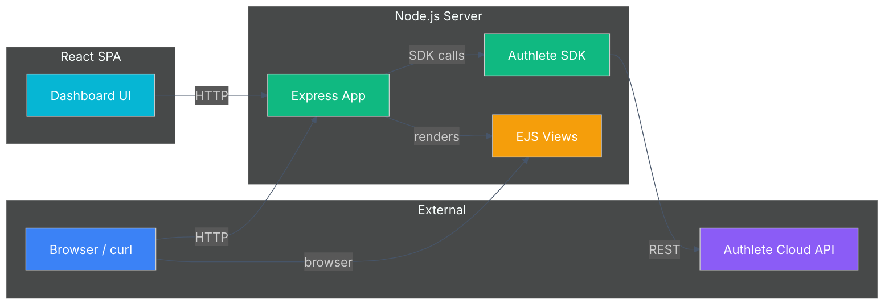

# Authlete Node Authorization Server — Documentation



A production-grade OAuth 2.0 / OpenID Connect authorization server that delegates all OAuth logic to [Authlete](https://www.authlete.com/)'s cloud API. The server is stateless and DB-less — it never stores tokens, clients, or user data locally.

## Quick Links

| Document | Purpose |
|----------|---------|
| [Architecture](./ARCHITECTURE.md) | System design, middleware pipeline, deployment topology |
| [Data Flows](./DATA-FLOWS.md) | OAuth grant sequences, CSRF lifecycle, health polling |
| [API Reference](./API.md) | Complete endpoint catalog with request/response formats |
| [Component Reference](./COMPONENT-REFERENCE.md) | Server services/controllers + React component tree |
| [Testing](./TESTING.md) | Unit, integration, E2E, and client test architecture |
| [FAPI 2.0 Tutorial](./FAPI-TUTORIAL.md) | FAPI 2.0 Security Profile with private_key_jwt client auth and DPoP sender-constrained tokens |
| [Development](./DEVELOPMENT.md) | Setup, env vars, middleware stack, quirks |

## Quick Start

```bash
# Install dependencies
npm --prefix server install && npm --prefix client install

# Configure environment
cp server/.env.example server/.env
cp client/.env.example client/.env

# Edit server/.env with your Authlete credentials, then:
npm --prefix server run dev    # Express on :3000
npm --prefix client run dev    # SPA on :3001
```

## Project Map

```
.
├── server/                    # Express authorization server
│   ├── src/
│   │   ├── server.ts          # Entry point
│   │   ├── app.ts             # Express factory (createApp)
│   │   ├── config/            # Env loading, Authlete SDK config
│   │   ├── controllers/       # 27 request handlers
│   │   ├── services/          # 22 business logic modules
│   │   ├── routes/            # 21 Express Router modules
│   │   ├── middleware/        # 7 middleware (CSRF, audit, metrics, etc.)
│   │   ├── types/             # TypeScript augmentations
│   │   ├── utils/             # Logger, JWT, validation
│   │   └── views/             # 7 EJS templates + 4 partials
│   ├── tests/                 # 39 test files
│   └── package.json
├── client/                    # React debugging SPA
│   ├── src/
│   │   ├── components/        # 4 groups (layout/auth/oidc/admin/ui) — 30+ components
│   │   ├── hooks/             # 5 custom hooks
│   │   ├── services/          # 10 API client modules
│   │   ├── context/           # TokenContext (sessionStorage)
│   │   ├── types/             # TypeScript interfaces
│   │   ├── data/              # Operation documentation content
│   │   ├── pages/             # CallbackPage
│   │   └── styles/            # Tailwind v4 globals.css
│   └── src/test/              # 16 test files + setup
│   └── package.json
├── docs/                      # You are here
├── AGENTS.md                  # AI agent instructions
├── CURL-TEST.md               # Interactive curl test suite
└── docker-compose.yml         # Redis for local dev (optional)
```

## Key Architecture Decisions

| Decision | Choice | Rationale |
|----------|--------|-----------|
| OAuth delegation | Authlete SDK | No token/client/user DB needed; stateless server |
| Session store | In-memory (Redis optional) | Simplicity; Redis via `REDIS_URL` for production |
| Frontend framework | React + Vite + SWC | Fast HMR, lightweight build |
| Styling | Tailwind CSS v4 | Zero-runtime CSS, dark-first palette |
| Form security | Server-side CSRF tokens | 32-byte hex tokens on GET, validated on POST |
| API design | REST under `/api/` | Clean separation from browser routes |
| Client auth | HTTP Basic (MGMT credentials) | Simple, standard, optional per endpoint group |
| Monitoring | Prometheus + Winston audit | Built-in metrics + structured audit trail |
