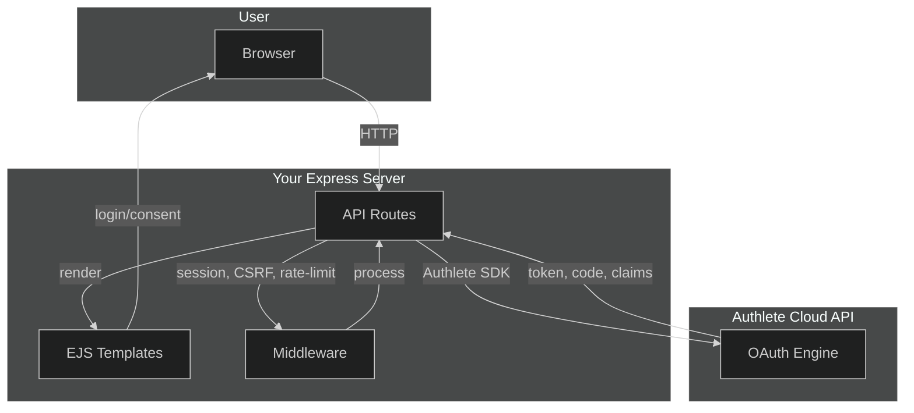
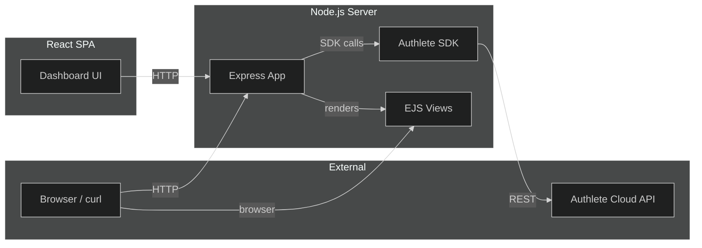

# Documentation

> **New to OAuth 2.0?** Start with the [PKCE Tutorial](./PKCE-TUTORIAL.md) — it explains the most important security concept in modern OAuth, with diagrams and step-by-step examples.

## How This Project Works


```mermaid
%%{init: {'theme': 'dark'}}%%
flowchart TB
    subgraph User["User"]
        Browser[Browser]
    end
    subgraph YourServer["Your Express Server"]
        Routes[API Routes]
        Views[EJS Templates]
        MW[Middleware]
    end
    subgraph Authlete["Authlete Cloud API"]
        OAuth[OAuth Engine]
    end

    Browser -->|HTTP| Routes
    Routes -->|session, CSRF, rate-limit| MW
    MW -->|process| Routes
    Routes -->|Authlete SDK| OAuth
    OAuth -->|token, code, claims| Routes
    Routes -->|render| Views
    Views -->|login/consent| Browser
```

**The short version:** This server handles HTTP. Authlete handles OAuth. Together, they give you a complete, spec-compliant authorization server.

## Where to Start

### I want to understand the architecture
- [Architecture](./ARCHITECTURE.md) — System design, middleware pipeline, deployment
- [Data Flows](./DATA-FLOWS.md) — OAuth flow sequences with diagrams

### I want to understand a specific OAuth feature
Each tutorial explains **why** the feature was created, **how** it works, and **how to test it**.

| Tutorial | The Problem It Solves |
|----------|----------------------|
| [PKCE](./PKCE-TUTORIAL.md) | "What stops someone from stealing my authorization code?" |
| [PAR](./PAR-TUTORIAL.md) | "Why are my authorization parameters visible in the URL?" |
| [RAR](./RAR-TUTORIAL.md) | "How do I request fine-grained access beyond simple scopes?" |
| [Device Flow](./DEVICE-FLOW-TUTORIAL.md) | "How do I authorize on a device with no browser?" |
| [CIBA](./CIBA-TUTORIAL.md) | "How do I authorize without redirecting the user?" |
| [JWT Bearer](./JWT-BEARER-TUTORIAL.md) | "Can I use a JWT instead of a client secret?" |
| [Token Exchange](./TOKEN-EXCHANGE-TUTORIAL.md) | "How do I let one service act on behalf of another?" |
| [Native SSO](./NATIVE-SSO-TUTORIAL.md) | "How do I share login state across my mobile apps?" |
| [Backchannel Logout](./BACKCHANNEL-LOGOUT-TUTORIAL.md) | "How do I log out the user from all my services?" |
| [Grant Management](./GRANT-MANAGEMENT.md) | "How do I let users see and revoke what they've authorized?" |
| [FAPI 2.0](./FAPI-TUTORIAL.md) | "How do I meet financial-grade security requirements?" |

### I want to build or test something
- [API Reference](./API.md) — Every endpoint, every parameter, every response
- [Component Reference](./COMPONENT-REFERENCE.md) — Server services + React components
- [Testing](./TESTING.md) — How the test suite works, how to add tests
- [Development](./DEVELOPMENT.md) — Setup, env vars, middleware, quirks
- [Monitoring](./MONITORING.md) — Prometheus metrics and Grafana dashboards

### I want to test with curl
- [CURL-TEST.md](../CURL-TEST.md) — Copy-paste curl commands for every endpoint

## Architecture Overview


```mermaid
%%{init: {'theme': 'dark'}}%%
flowchart LR
    subgraph External["External"]
        B[Browser / curl]
        A[Authlete Cloud API]
    end
    subgraph Server["Node.js Server"]
        E[Express App]
        S[Authlete SDK]
        V[EJS Views]
    end
    subgraph Client["React SPA"]
        D[Dashboard UI]
    end

    B -->|HTTP| E
    D -->|HTTP| E
    E -->|SDK calls| S
    S -->|REST| A
    E -->|renders| V
    B -->|browser| V
```

| Layer | Tech | Purpose |
|-------|------|---------|
| **HTTP** | Express | Routing, sessions, CORS, security headers |
| **Auth** | Authlete SDK | Delegates all OAuth/OIDC logic to Authlete cloud |
| **Views** | EJS | Server-rendered login and consent pages |
| **Dashboard** | React + Vite | Interactive OAuth debugging tools |
| **Monitoring** | Prometheus + Winston | Metrics and structured audit logs |

## Quick Start

```bash
npm --prefix server install && npm --prefix client install
cp server/.env.example server/.env && cp client/.env.example client/.env
# Edit server/.env with your Authlete credentials:
#   AUTHLETE_BEARER_TOKEN, AUTHLETE_BASE_URL, AUTHLETE_SERVICE_ID, SESSION_SECRET
npm --prefix server run dev    # Express on :3000
npm --prefix client run dev    # SPA on :3001
```
