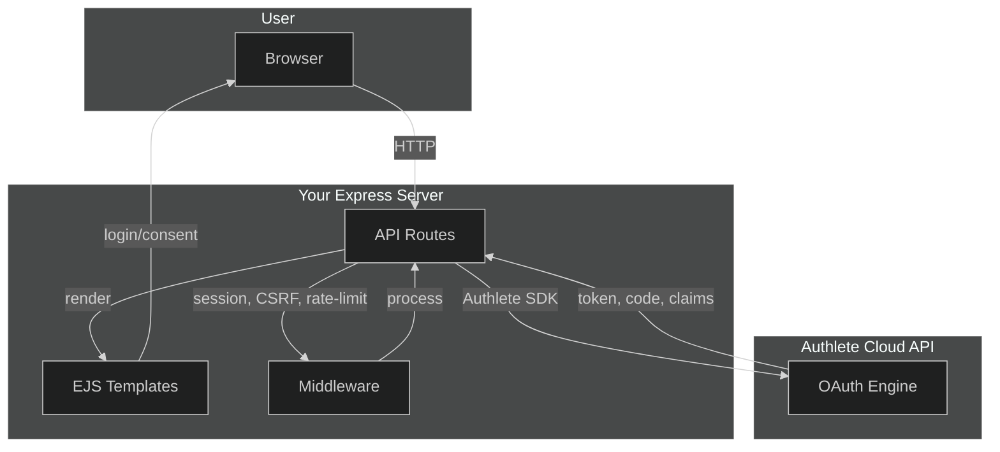
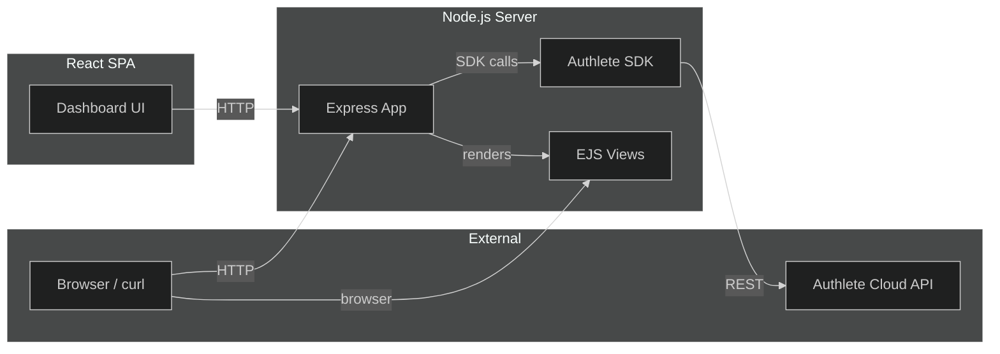

# Documentation

> **New to OAuth 2.0?** Start with the [PKCE Tutorial](./PKCE-TUTORIAL.md) — it explains the most important security concept in modern OAuth, with diagrams and step-by-step examples.

## How This Project Works


```mermaid
%%{init: {'theme': 'dark'}}%%
flowchart TB
    subgraph User["User"]
        Browser[Browser]
    end
    subgraph YourServer["Your Express Server"]
        Routes[API Routes]
        Views[EJS Templates]
        MW[Middleware]
    end
    subgraph Authlete["Authlete Cloud API"]
        OAuth[OAuth Engine]
    end

    Browser -->|HTTP| Routes
    Routes -->|session, CSRF, rate-limit| MW
    MW -->|process| Routes
    Routes -->|Authlete SDK| OAuth
    OAuth -->|token, code, claims| Routes
    Routes -->|render| Views
    Views -->|login/consent| Browser
```

**The short version:** This server handles HTTP. Authlete handles OAuth. Together, they give you a complete, spec-compliant authorization server.

## Where to Start

### I'm new to OAuth and don't know what to read first
- **[Learning Path](./curriculum/README.md)** — a structured, assessed curriculum that sequences everything
  below into dependency order: 14 modules, hands-on labs against this repo's own server, quizzes, four
  cumulative exams and a capstone. Start here if the tutorial list looks like a wall of RFCs.

### I want to understand the architecture
- [Architecture](./ARCHITECTURE.md) — System design, middleware pipeline, deployment
- [Data Flows](./DATA-FLOWS.md) — OAuth flow sequences with diagrams

### I want to understand a specific OAuth feature
Each tutorial explains **why** the feature was created, **how** it works, and **how to test it**.

| Tutorial | The Problem It Solves |
|----------|----------------------|
| [PKCE](./PKCE-TUTORIAL.md) | "What stops someone from stealing my authorization code?" |
| [PAR](./PAR-TUTORIAL.md) | "Why are my authorization parameters visible in the URL?" |
| [RAR](./RAR-TUTORIAL.md) | "How do I request fine-grained access beyond simple scopes?" |
| [Device Flow](./DEVICE-FLOW-TUTORIAL.md) | "How do I authorize on a device with no browser?" |
| [CIBA](./CIBA-TUTORIAL.md) | "How do I authorize without redirecting the user?" |
| [JWT Bearer](./JWT-BEARER-TUTORIAL.md) | "Can I use a JWT instead of a client secret?" |
| [Token Exchange](./TOKEN-EXCHANGE-TUTORIAL.md) | "How do I let one service act on behalf of another?" |
| [Step-Up Auth](./STEP-UP-AUTH-TUTORIAL.md) | "How does a resource say 'your token isn't strong enough'?" |
| [Native SSO](./NATIVE-SSO-TUTORIAL.md) | "How do I share login state across my mobile apps?" |
| [Backchannel Logout](./BACKCHANNEL-LOGOUT-TUTORIAL.md) | "How do I log out the user from all my services?" |
| [Grant Management](./GRANT-MANAGEMENT.md) | "How do I let users see and revoke what they've authorized?" |
| [FAPI 2.0](./FAPI-TUTORIAL.md) | "How do I meet financial-grade security requirements?" |
| [MCP OAuth 2.1](./MCP-OAUTH-TUTORIAL.md) | "How does an AI client get authorized to call my tools?" |

### Reference and internal documents

Not tutorials — these answer a narrower question or record how the repo is maintained. They are listed because
an unindexed document is one nobody finds and nobody updates.

| Document | What it is |
|---|---|
| [Authlete tickets](./TICKET-PARAMETER.md) | **Reference.** What a `ticket` is, why it is a credential rather than a correlation id, and why `/api/jar/process` no longer returns one to anonymous callers. Read this before touching any endpoint that handles Authlete's authorization response |
| [API reference](./API.md) · [Architecture](./ARCHITECTURE.md) · [Development](./DEVELOPMENT.md) · [Monitoring](./MONITORING.md) | **Reference.** Endpoints, request lifecycle, SDK version pin, Prometheus/Grafana |
| [Curriculum audit pass A](./curriculum/AUDIT-PASS-A.md) · [pass B](./curriculum/AUDIT-PASS-B.md) | **Internal.** Working records of two curriculum review passes. Kept for their method and their misses — pass A recorded `sd-jwt.mjs` as *"CLEAN, 0 defects"* and it had three, one of them a security defect. Not a description of current state; read the module itself for that |
| [CHANGELOG](../CHANGELOG.md) | **Internal.** Release-level history. Day-to-day build history lives in [`curriculum/PROGRESS.md`](./curriculum/PROGRESS.md), which is the fuller record |

### How to read the transcripts in these tutorials

**A request or response printed in a tutorial is evidence of one of three different things, and confusing
them costs you an afternoon.** Every transcript in the nine tutorials audited below is labelled as one of:

| Label | What it means | What you can rely on |
|---|---|---|
| **captured** | Run against this deployment on the date given, and reproduced as it came back | The values. If the configuration has changed since the date, the shape still holds |
| *illustrative* | The shape is right; the values are placeholders and **nothing was run** | The field names and their arrangement — not the numbers, ids or tokens |
| **`UNVERIFIED`** | This deployment **cannot** produce it, and the marker names the setting responsible | The specification. Change the named setting and the block becomes runnable |

The third label is the one that matters, and it is borrowed from the curriculum, where it has been in use
for longer — see [`modules/09a…/lab.md`](./curriculum/modules/09a-interaction-extensions/lab.md) for the
rule and four worked examples. **A marker always names the field, and always carries a date**, because a
marker whose premise has silently changed is worse than no marker at all.

> **Scope, so the label list is not itself an overclaim.** The convention was applied on **2026-08-14** to
> the nine tutorials the RFC audit examined line by line: PAR, RAR, Device Flow, CIBA, Token Exchange,
> Step-Up Auth, Native SSO, FAPI 2.0 and MCP. **PKCE, JWT Bearer, Backchannel Logout and Grant Management
> have not been swept** — treat their transcripts as unlabelled until they are.

### I want to build or test something
- [API Reference](./API.md) — Every endpoint, every parameter, every response
- [Component Reference](./COMPONENT-REFERENCE.md) — Server services + React components
- [Testing](./TESTING.md) — How the test suite works, how to add tests
- [Development](./DEVELOPMENT.md) — Setup, env vars, middleware, quirks
- [Monitoring](./MONITORING.md) — Prometheus metrics and Grafana dashboards

### I want to test with curl
- [CURL-TEST.md](../CURL-TEST.md) — Copy-paste curl commands for every endpoint

## Architecture Overview


```mermaid
%%{init: {'theme': 'dark'}}%%
flowchart LR
    subgraph External["External"]
        B[Browser / curl]
        A[Authlete Cloud API]
    end
    subgraph Server["Node.js Server"]
        E[Express App]
        S[Authlete SDK]
        V[EJS Views]
    end
    subgraph Client["React SPA"]
        D[Dashboard UI]
    end

    B -->|HTTP| E
    D -->|HTTP| E
    E -->|SDK calls| S
    S -->|REST| A
    E -->|renders| V
    B -->|browser| V
```

| Layer | Tech | Purpose |
|-------|------|---------|
| **HTTP** | Express | Routing, sessions, CORS, security headers |
| **Auth** | Authlete SDK | Delegates all OAuth/OIDC logic to Authlete cloud |
| **Views** | EJS | Server-rendered login and consent pages |
| **Dashboard** | React + Vite | Interactive OAuth debugging tools |
| **Monitoring** | Prometheus + Winston | Metrics and structured audit logs |

## Quick Start

```bash
npm --prefix server install && npm --prefix client install
cp server/.env.example server/.env && cp client/.env.example client/.env
# Edit server/.env with your Authlete credentials:
#   AUTHLETE_BEARER_TOKEN, AUTHLETE_BASE_URL, AUTHLETE_SERVICE_ID, SESSION_SECRET
npm --prefix server run dev    # Express on :3000
npm --prefix client run dev    # SPA on :3001
```
