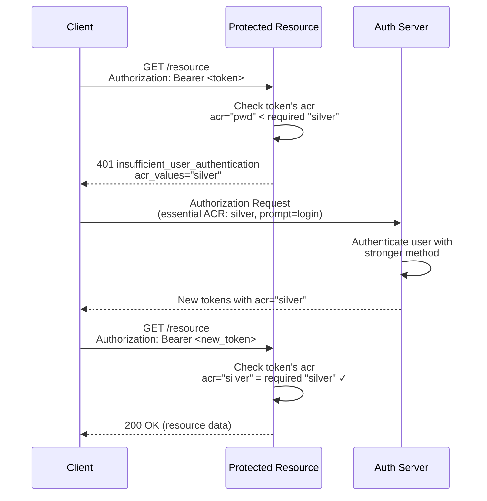
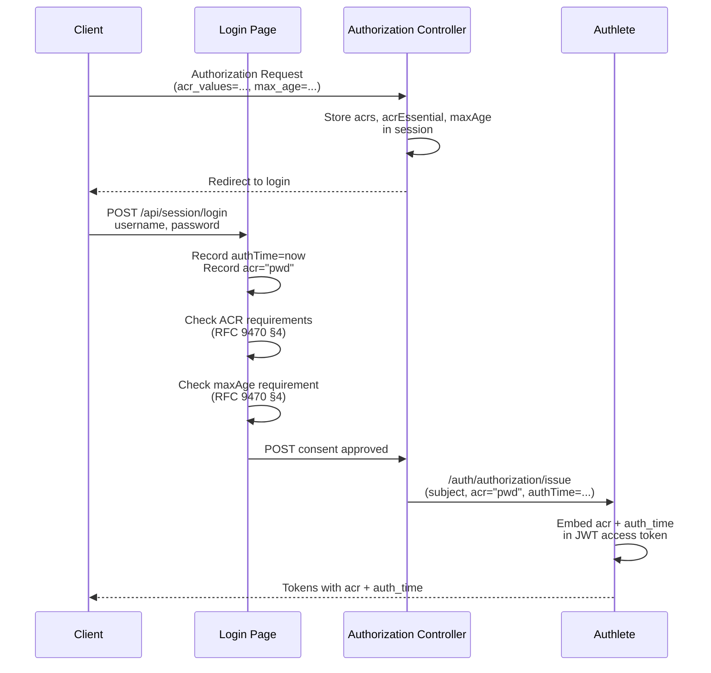
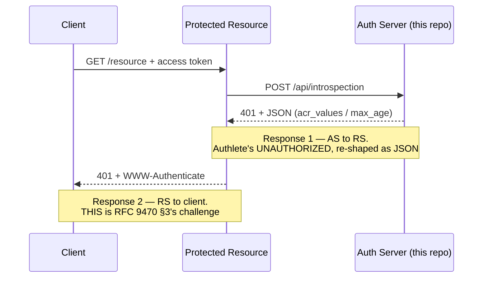

# Step-Up Authentication — RFC 9470

> How a protected resource tells the client "your token isn't strong enough" and how the client re-authorizes with a higher authentication level.

**The short version:** A resource server checks the `acr` and `auth_time` bound to an access token. If they don't meet the resource's requirements, it returns an `insufficient_user_authentication` error telling the client exactly what's needed. The client then makes a new authorization request with those stronger requirements.

> ### How the transcripts below were verified
>
> Labels are **captured** / *illustrative* / **`UNVERIFIED`** — defined once in
> [the tutorial index](README.md#how-to-read-the-transcripts-in-these-tutorials). Live values re-checked
> **2026-08-14**.
>
> **The ACR machinery runs here. The JWT access token does not.**
>
> | What the file shows | Live status | What to do about it |
> |---|---|---|
> | [Part 4](#part-4-binding-auth-info-to-access-tokens)'s **JWT access-token payload** | **Not reproducible here, and now checked against a real specimen** — `accessTokenSignAlg` is **unset** by decision ([DR-09](../audit/05-decision-records.md#dr-09--jwt-access-tokens-rfc-9068), re-ruled 2026-08-17), so this deployment issues opaque access tokens (43 characters, no dots) and there is no JWT to decode | The claims are still recorded against the token: the SDK's `IntrospectionResponse` models `acr` and `authTime`, which is RFC 9470 §6.2's other route. **Setting `accessTokenSignAlg` really would make Part 4 literal** — verified 2026-08-17 by setting it, minting one token and unsetting it — **but do not**: the resulting token carries **no `aud`**, which RFC 9068 §2.2 makes REQUIRED. See Part 4 |
> | `urn:mace:incommon:iap:silver`, used as the strong ACR throughout | **not a registered ACR here.** `supportedAcrs` is `["pwd", "mfa"]` | Use **`mfa`** to reproduce anything in this file. An *unregistered* value fails earlier and for a different reason than an unsatisfiable one — see [`modules/09a…/lab.md` 4b](curriculum/modules/09a-interaction-extensions/lab.md) |
> | the essential-ACR refusal | **runnable** — `mfa` is registered and deliberately unsatisfiable, which is exactly what makes the refusal path reachable | Request `mfa` as an essential `acr` and watch `ACR_NOT_SATISFIED` |
> | [Part 5](#part-5-the-step-up-challenge-response)'s **max-age challenge** | **reachable, but only on one path** | See the note directly below |
>
> **`max_age` cannot fail on the login path, and that is not a bug.** On a login POST the End-User has just
> actively authenticated, so *any* maximum age is satisfied by construction. `EXCEEDS_MAX_AGE` is genuinely
> reachable only where authentication is **not** re-performed — the `prompt=none` silent-renewal path. Both
> paths share one check, `checkStepUpRequirements` in `server/src/utils/step-up.ts`, since 2026-08-12; before
> that the `prompt=none` path **invented** an authentication event (`acr: "pwd"`, `auth_time: now`) when the
> session had recorded none, which would have let a resource server accept fabricated freshness. The rule now
> is that **absence is answered as "no"**: an unknown `acr` does not satisfy an essential request, and an
> unknown `auth_time` does not satisfy a `max_age`.
>
> **The `error_description` strings in Part 5 are *illustrative*.** The bracketed `[A34xxxx]` codes and the
> `error` values are the stable, spec-defined part; the surrounding prose is Authlete's and changes between
> versions. Do not parse it.

---

## Table of Contents

- [Part 1: Why Step-Up Authentication Exists](#part-1-why-step-up-authentication-exists)
- [Part 2: Authentication Context Class References (ACR)](#part-2-authentication-context-class-references-acr)
- [Part 3: Maximum Authentication Age (Max Age)](#part-3-maximum-authentication-age-max-age)
- [Part 4: Binding Auth Info to Access Tokens](#part-4-binding-auth-info-to-access-tokens)
- [Part 5: The Step-Up Challenge Response](#part-5-the-step-up-challenge-response)
- [Part 6: The Re-Authorization Flow](#part-6-the-re-authorization-flow)
- [Part 7: Testing with the Client UI](#part-7-testing-with-the-client-ui)
- [Part 8: How Authlete Handles It](#part-8-how-authlete-handles-it)
- [Appendix: Files Involved](#appendix-files-involved)

---

## Part 1: Why Step-Up Authentication Exists

Not all resources need the same authentication strength.

Think of a **bank**:

| Action | Authentication Level |
|--------|---------------------|
| View balance | Password login (basic) |
| Transfer $100 | Password + SMS code (step-up) |
| Transfer $10,000 | Password + SMS + biometric (step-up) |

The user already logged in once. But some operations need a **stronger** authentication event. RFC 9470 gives the resource server a way to say: "This token was issued with ACR `pwd`, but I need ACR `urn:mace:incommon:iap:silver`."



**That arrow is a `401`, and it is the single most important number in this tutorial.** RFC 9470 §3's two
examples are both `401 Unauthorized`; 403 appears nowhere in the section. It read `403` here until
2026-08-14 — see [Part 5](#part-5-the-step-up-challenge-response) for the full story, including a second
correction on 2026-09-08: this server's own `/api/introspection` was *also* believed to answer with a `403`
for this scenario, and live testing proved that wrong too. Every step-up response in this repo is a `401`
now; there is no 403 case left for this scenario at all.

---

## Part 2: Authentication Context Class References (ACR)

An **ACR** is a string that identifies an authentication method or strength. It's not defined by OAuth or OIDC — each deployment chooses its own values.

### How clients request ACRs

There are three ways, in order of increasing strictness:

#### 1. `acr_values` request parameter (voluntary)

```text
GET /api/authorization?acr_values=urn:mace:incommon:iap:silver
```

The server tries to satisfy one of the listed ACRs but **won't error** if it can't.

#### 2. `claims` request parameter with essential ACR (mandatory)

```json
{
  "id_token": {
    "acr": {
      "essential": true,
      "values": ["urn:mace:incommon:iap:silver"]
    }
  }
}
```

The server **MUST** return `unmet_authentication_requirements` if none of the ACRs can be satisfied.

#### 3. `default_acr_values` client metadata (fallback)

Set in the client's DCR registration. Used when the authorization request doesn't specify ACRs.

### ACR values by ecosystem

| Ecosystem | Example ACRs |
|-----------|-------------|
| UK Open Banking | `urn:openbanking:psd2:ca`, `urn:openbanking:psd2:sca` |
| AU CDR | `urn:cds:au:cdr:2`, `urn:cds:au:cdr:3` |
| Open Banking Brasil | `urn:brasil:openbanking:loa2`, `urn:brasil:openbanking:loa3` |
| This demo server | `pwd` (password authentication) and `mfa` (registered, deliberately unsatisfiable) |

### Authlete configuration

The `acr_values_supported` metadata advertises which ACRs the server supports. **Captured 2026-08-14 from
this deployment** — note it is not the `silver` value used as the illustration elsewhere in this file:

```json
{
  "acr_values_supported": ["pwd", "mfa"]
}
```

`mfa` is registered here **deliberately and is deliberately unsatisfiable**: this server can only perform
password authentication, so `mfa` is what makes the *refusal* path reachable. Registering an ACR you cannot
satisfy sounds wrong and is the only way to exercise an essential-ACR failure — see
[`modules/09a…/lab.md` 4b](curriculum/modules/09a-interaction-extensions/lab.md).

---

## Part 3: Maximum Authentication Age (Max Age)

Even if the ACR matches, the **age** of the authentication matters. A token issued 2 hours ago might need a fresh login.

### The `max_age` request parameter

```text
GET /api/authorization?max_age=600
```

This tells the server: "If the user was authenticated more than 600 seconds ago, force a fresh login."

### The `prompt=login` parameter

```text
GET /api/authorization?prompt=login
```

This forces re-authentication regardless of `max_age`.

### The `default_max_age` client metadata

Set in DCR. Used as a fallback when the authorization request doesn't include `max_age`.

---

## Part 4: Binding Auth Info to Access Tokens

For step-up to work, the access token must carry the authentication context. Authlete embeds two claims in JWT access tokens:

### JWT access token payload

> ### Not reproducible here — but **verified against a real specimen** (2026-08-17)
>
> `accessTokenSignAlg` is unset on this deployment, so access tokens here are **opaque** — 43 characters, no
> dots — and no payload like the one below can be decoded from anything you obtain. That is a **decision**
> ([DR-09](../audit/05-decision-records.md#dr-09--jwt-access-tokens-rfc-9068)), not an oversight.
>
> **The flag was set to `ES256` for exactly one token and unset again.** The payload below is now confirmed
> rather than asserted:
>
> | | |
> |---|---|
> | header | `{"alg":"ES256","typ":"at+jwt","kid":"1"}` — `typ` is RFC 9068 §2.1's value, not `JWT` |
> | **every claim shown below** | present — `sub`, `acr`, `auth_time`, `scope`, `iss`, `exp`, `iat`, `client_id` |
> | `acr` / `auth_time` | `"pwd"` and the exact epoch passed to `/auth/authorization/issue`. **Part 4's central claim is true** |
> | also present, not shown below | `jti`, and a **`grant_type`** claim that RFC 9068 does not define |
> | ⚠️ **absent** | **`aud`** — see below |
>
> ### ⚠️ Why the flag is *still* off, and it is not inertia
>
> RFC 9068 **§2.2 makes `aud` REQUIRED**, and **§3** says that when a request carries no `resource` parameter
> *"the authorization server MUST use a default resource indicator in the `aud` claim."* This service has no
> default configured, and the specimen confirms the consequence: **no `aud` at all**. So switching
> `accessTokenSignAlg` on would make **every access token this deployment issues** violate a MUST — silently,
> because nothing in this repo validates `aud`, and every token would keep working. Recorded as
> [`RFC9068-jwt-access-tokens.md`](../audit/02-findings/RFC9068-jwt-access-tokens.md) F-3, which was written as
> a *prediction* and is now an observation.
>
> **The one JWT you can obtain and decode here** is the dev-only fixture from
> `GET /api/token/createLocalToken` (admin auth, non-production) — and it is deliberately §2-shaped, so it is a
> better specimen to study than the block below is to imagine.


```json
{
  "sub": "user-123",
  "acr": "pwd",
  "auth_time": 1700000000,
  "scope": "openid profile",
  "iss": "https://as.example.com",
  "exp": 1700003600,
  "iat": 1700000000,
  "client_id": "s6BhdRkqt3"
}
```

| Claim | Type | Description |
|-------|------|-------------|
| `acr` | string | The ACR satisfied during authentication |
| `auth_time` | integer | Epoch seconds when authentication occurred |

### How this server binds them

During the authorization flow:

1. **Login** — `session.controller.ts` records `authTime` (current epoch) and `acr` ("pwd" for password auth)
2. **Issue** — `authorization.service.ts` passes `acr` and `authTime` to Authlete's `/auth/authorization/issue` API
3. **Authlete** — embeds these claims in the JWT access token (when `accessTokenSignAlg` is configured)



> **The two "Check …" steps cite §4, and they used to cite §2 and §3.** RFC 9470 §2 is *Protocol Overview* —
> narrative, nothing normative to check against — and **§3 is the challenge**, which this server does not emit
> (see [Part 5](#part-5-the-step-up-challenge-response)). The rule an AS applies when *handling a request that
> carries `acr_values` or `max_age`* is **§4**, and the rule for conveying the resulting claims to a resource
> server is **§6** (§6.1 in a JWT access token, §6.2 on introspection — and on this deployment only §6.2 is
> available). Corrected 2026-08-14. **Citing §3 for a check rather than for a challenge is the same conflation
> Part 5 fixes**, one layer down: §3 governs a message this code never sends.

---

## Part 5: The Step-Up Challenge Response

**There are two different responses here, and — corrected 2026-09-08 — they now carry the *same* status
code, for the same reason.** This Part used to document Response 1 as a `403`, on the assumption that
Authlete's action for an ACR/`max_age`-insufficient token is `FORBIDDEN`. **Live testing proved that
assumption wrong**: Authlete answers with `action: "UNAUTHORIZED"`, and the code had a real, unreachable
`FORBIDDEN`-shaped branch that four unit tests locked in by mocking the scenario that never happens live.
Both are now `401`.



| | Response 1 | Response 2 |
|---|---|---|
| who → who | **AS → resource server** | **resource server → client** |
| what it is | this repo's introspection API answering "is this token strong enough?" | RFC 9470 §3's **challenge** |
| status | **401** — Authlete's action is `UNAUTHORIZED` (live-verified 2026-09-08), and `insufficient_user_authentication` is 401-class per RFC 6750 §3.1 regardless | **401**, and §3 gives no alternative |
| governed by | RFC 9470 §3, RFC 6750 §3 (same as Response 2 — there is no separate "vendor contract" carve-out) | RFC 9470 §3, RFC 6750 §3 |
| where it lives | `server/src/controllers/introspection.controller.ts` | **your resource server — this repo does not implement one** |

### Response 1 — what `/api/introspection` returns to a resource server

The AS re-shapes Authlete's `WWW-Authenticate` string into JSON, so a browser-based resource server can read
the requirement without parsing an HTTP header. **Captured live 2026-09-08**, against a real token issued by
the interactive login flow (`acr: "pwd"`):

**ACR mismatch** (`acrValues: ["mfa"]`):

```text
HTTP/1.1 401 Unauthorized
WWW-Authenticate: Bearer error="insufficient_user_authentication",
  error_description="[A341302] The authentication context class 'pwd' of the user authentication that the
  authorization server performed during the course of issuing the access token is insufficient. User
  authentication of an access token must satisfy one of [mfa] to access the protected resource.",
  acr_values="mfa"
Content-Type: application/json

{
  "error": "insufficient_user_authentication",
  "error_description": "[A341302] The authentication context class 'pwd' of the user authentication that the authorization server performed during the course of issuing the access token is insufficient. User authentication of an access token must satisfy one of [mfa] to access the protected resource.",
  "error_uri": "https://docs.authlete.com/#A341302",
  "acr_values": "mfa",
  "acr": "pwd",
  "auth_time": 1788812534
}
```

**Max age exceeded** (`maxAge: 1`):

```text
HTTP/1.1 401 Unauthorized
WWW-Authenticate: Bearer error="insufficient_user_authentication",
  error_description="[A340301] The time of the user authentication that the authorization server performed
  during the course of issuing the access token is too old, so re-authentication is needed. The maximum
  authentication age (max_age) required by the protected resource is 1.",
  max_age="1"
Content-Type: application/json

{
  "error": "insufficient_user_authentication",
  "error_description": "[A340301] The time of the user authentication that the authorization server performed during the course of issuing the access token is too old, so re-authentication is needed. The maximum authentication age (max_age) required by the protected resource is 1.",
  "error_uri": "https://docs.authlete.com/#A340301",
  "max_age": "1",
  "acr": "pwd",
  "auth_time": 1788812534
}
```

A plain invalid/unrecognized token is unaffected by this fix and still answers `401` with the raw
`Bearer error="invalid_token"` text, unreshaped — the JSON reshaping applies only when the content actually
contains `insufficient_user_authentication`.

### Response 2 — the 401 challenge your resource server must send

**This is the one RFC 9470 §3 specifies, and it is a `401`.** Both of §3's worked examples are
`HTTP/1.1 401 Unauthorized`; the section never mentions 403. Having read Response 1, your resource server
copies the `acr_values` or `max_age` into a challenge of its own:

```text
HTTP/1.1 401 Unauthorized
WWW-Authenticate: Bearer error="insufficient_user_authentication",
  error_description="A different authentication level is required",
  acr_values="urn:mace:incommon:iap:silver"
```

> ### ⚠️ Why 401 and not 403, and what breaks if you get it wrong
>
> **The split is deliberate in the specifications, not a stylistic preference.** RFC 6750 §3.1 assigns **403**
> to `insufficient_scope` — *"the token is valid, you are simply not allowed this"*. RFC 9470's
> `insufficient_user_authentication` says something different: *"the **authentication** behind this token is
> not strong or recent enough"*, which is 401 territory, because the remedy is a new authentication event
> rather than a different grant. That reasoning is exactly why Response 1 turned out to be 401 too, once
> checked — it was never a "vendor API can defensibly pick 403" situation, that framing was the mistake.
>
> **The failure is silent and total.** Most client libraries only inspect `WWW-Authenticate` on a **401**. Send
> 403 and a conformant client never parses the header, never learns `acr_values`, and never re-authorizes — so
> the step-up loop *never starts*. The user sees an unexplained failure where they should have seen a
> re-authentication prompt. **Step-up is a challenge/response protocol, and the challenge status is what makes
> the response happen.**
>
> **Until 2026-08-14 this Part printed Response 1 twice, under the heading *"an error conforming to RFC
> 9470"*, with the client-action table hanging off it** — and the sequence diagram in Part 1 drew the 403 as
> an explicit `RS-->>C` arrow, which is exactly the relationship §3 governs. A learner following either would
> have built a step-up loop that cannot start. **A second, deeper instance of the same mistake was found and
> fixed 2026-09-08**: even after that correction, this repo's own `/api/introspection` (Response 1) was still
> coded and documented as answering `403` — reachable-looking code, `403`-asserting unit tests, all of it
> exercising a scenario Authlete never actually produces. Live testing (a real login → consent → token
> exchange → introspection round trip, not a mock) is what caught it; the mocked unit tests could not, because
> they mocked the very assumption that was wrong. The client's own step-up UI (`StepUpSection.tsx`) had a
> second, independent bug on top of this — it parsed the *entire* displayed error string as JSON instead of
> the actual response body, which could never succeed regardless of what the server returned. Both are fixed
> together; see `server/src/controllers/introspection.controller.ts`'s `buildStepUpChallenge` and
> `client/src/components/oidc/StepUpSection.tsx`'s `handleIntrospect`.

### What the client learns — from Response 2

These are the fields your client reads off the **401** challenge:

| Error field | Meaning | Client action |
|-------------|---------|---------------|
| `acr_values` | Required ACR values (space-separated) | Re-authorize with `claims` requesting these ACRs as essential |
| `max_age` | Maximum auth age in seconds | Re-authorize with `max_age` parameter and `prompt=login` |

And these two are **not** part of §3's challenge. They appear in Response 1 because this AS adds them, and
they are for the resource server's logs — a client that acts on them is trusting the AS's view of a token it
already holds:

| Extra field (Response 1 only) | Meaning |
|---|---|
| `acr` | The ACR the current token was issued with |
| `auth_time` | When that authentication happened |

---

## Part 6: The Re-Authorization Flow

After receiving the step-up challenge, the client makes a new authorization request with the required parameters:

### Re-authorize with required ACR

```text
GET /api/authorization?
  response_type=code
  &client_id=your_client_id
  &redirect_uri=https://your-app.com/callback
  &scope=openid profile
  &state=<random>
  &claims={"id_token":{"acr":{"essential":true,"values":["urn:mace:incommon:iap:silver"]}}}
  &prompt=login
```

### Re-authorize with max_age

```text
GET /api/authorization?
  response_type=code
  &client_id=your_client_id
  &redirect_uri=https://your-app.com/callback
  &scope=openid profile
  &state=<random>
  &max_age=600
  &prompt=login
```

The `prompt=login` forces fresh authentication even if the user has an active session.

---

## Part 7: Testing with the Client UI

The React client includes a **Step-Up Auth** section that demonstrates the full flow:

### Step 1: Get a token

1. Go to **Grant Flows** and obtain an access token (any grant type)
2. The token will have `acr: "pwd"` (the default demo ACR)

### Step 2: Test step-up challenge

1. Go to **Step-Up Auth** in the sidebar
2. Enter required ACR values (e.g. `urn:mace:incommon:iap:silver`)
3. Click **Introspect with Requirements**
4. The server returns `insufficient_user_authentication` because `pwd` ≠ `silver`

### Step 3: See the challenge details

The UI shows:
- Error type: `insufficient_user_authentication`
- Current ACR: `pwd`
- Required ACRs: `urn:mace:incommon:iap:silver`
- Re-authorize button

### Step 4: Re-authorize (optional)

Clicking **Re-Authenticate with Required ACR** opens the authorization endpoint with:
- `claims` requesting the required ACR as essential
- `prompt=login` to force fresh authentication

> **Note:** This demo server always satisfies ACR `pwd`. Requesting other ACRs will always trigger a step-up challenge. In a real deployment, you'd configure multiple ACR values in Authlete.

### Testing max_age

1. Enter a max age value (e.g. `1` second)
2. Click **Introspect with Requirements**
3. If the token was issued more than 1 second ago, you'll get a max_age step-up challenge

---

## Part 8: How Authlete Handles It

Authlete manages the heavy lifting for step-up authentication:

### During token issuance

1. The server passes `acr` and `authTime` in the `/auth/authorization/issue` API call
2. Authlete embeds these claims in the JWT access token payload
3. The access token now carries the authentication context

### During token introspection

The `/auth/introspection` API accepts two validation parameters:

| Parameter | Authlete behavior |
|-----------|-------------------|
| `acrValues` | Checks if the token's ACR is in the list. Returns `UNAUTHORIZED` with `insufficient_user_authentication` + `acr_values` if not (live-verified 2026-09-08 — not `FORBIDDEN`, which this table said until then) |
| `maxAge` | Checks if `auth_time` + `maxAge` < now. Returns `UNAUTHORIZED` with `insufficient_user_authentication` + `max_age` if exceeded |

The `responseContent` from Authlete contains a pre-formatted `WWW-Authenticate` header value that the server relays to the client.

### During authorization

Authlete parses `acr_values`, `claims` (with essential ACR), and `max_age` from the authorization request and returns:
- `acrs` — list of requested ACR values
- `acrEssential` — whether ACR was requested as essential
- `maxAge` — the maximum authentication age

These are available to the server for ACR/maxAge enforcement during the login flow.

### Authorization failure

When ACR can't be satisfied, the server calls `/auth/authorization/fail` with `reason=ACR_NOT_SATISFIED`. Authlete prepares an `unmet_authentication_requirements` error response.

---

## Appendix: Files Involved

### Server

| File | What it does |
|------|-------------|
| `src/utils/createLocalJWT.ts` | Creates JWTs with optional `acr` + `auth_time` claims |
| `src/services/authorization.service.ts:59` | Passes `acr`/`authTime` from `session.stepUp` to Authlete |
| `src/controllers/authorization.controller.ts:55` | Stores `acrs`, `acrEssential`, `maxAge` from Authlete in session |
| `src/controllers/session.controller.ts:59` | Checks ACR/maxAge requirements on login; sets `stepUp` in session |
| `src/controllers/introspection.controller.ts` | `buildStepUpChallenge` (a shared helper, since 2026-09-08) parses `insufficient_user_authentication` into structured JSON, called from **both** the `UNAUTHORIZED` case (the real, live path) and the `FORBIDDEN` case (defensive — Authlete has never been observed to send it that way). `parseBearerError` (unchanged) does the actual `WWW-Authenticate` parsing. This row previously named only the `FORBIDDEN` branch, before live testing found that branch is never reached |
| `src/services/introspection.service.ts:38` | Passes `acrValues`/`maxAge` to Authlete introspection API |
| `src/controllers/device.controller.ts:87` | Passes `acr`/`authTime` to device flow complete |
| `src/controllers/ciba.controller.ts:106` | Passes `acr`/`authTime` to CIBA complete |
| `src/types/express-session.d.ts` | Session type with `stepUp`, `acrs`, `acrEssential`, `maxAge`, `authTime` |

### Client

| File | What it does |
|------|-------------|
| `src/services/token.service.ts:127` | `introspection()` accepts `acrValues`/`maxAge` options — and, since 2026-08-12, the admin credentials the endpoint requires |
| `src/components/oidc/TokenOpsSection.tsx` | ACR/maxAge inputs for Authlete introspection |
| `src/components/oidc/StepUpSection.tsx` | Dedicated step-up auth testing UI |
| `src/App.tsx` | Registers Step-Up Auth section in sidebar |

### Tests

| File | Tests |
|------|-------|
| `tests/unit/utils/createLocalJWT.test.ts` | JWT with `acr`/`auth_time` claims (8 tests) |
| `tests/unit/services/introspection.service.test.ts` | `acrValues`/`maxAge` pass-through, plus unrelated introspection-service cases in the same file (8 tests total) |
| `tests/unit/controllers/introspection.controller.test.ts` | Step-up challenge parsing (both the `UNAUTHORIZED` and defensive `FORBIDDEN` paths), plus the §2.1 auth gate and the other action cases (10 tests total) |

### Standards

| Standard | Title |
|----------|-------|
| [RFC 9470](https://www.rfc-editor.org/rfc/rfc9470.html) | OAuth 2.0 Step Up Authentication Challenge Protocol |
| [OIDC Core §5.5](https://openid.net/specs/openid-connect-core-1_0.html#ClaimsParameter) | Claims Request Parameter (essential ACR) |
| [OIDC Core §3.1.2.1](https://openid.net/specs/openid-connect-core-1_0.html#AuthRequest) | `acr_values` and `max_age` parameters |
| [OIDC Unmet Auth Requirements](https://openid.net/specs/openid-connect-unmet-authentication-requirements-1_0.html) | `unmet_authentication_requirements` error code |
| [RFC 7662](https://www.rfc-editor.org/rfc/rfc7662.html) | Token Introspection |

---

## Common Mistakes

### 1. Not binding `acr`/`auth_time` to access tokens

**Wrong:** Only embedding ACR in ID tokens, not access tokens.

**Right:** Authlete embeds `acr` and `auth_time` in JWT access tokens automatically when the server passes them in `/auth/authorization/issue`. Make sure your `issue()` call includes these fields.

### 2. Checking ACR without essential flag

**Wrong:** Requesting `acr_values=urn:mace:incommon:iap:silver` but not making it essential — the server won't error if it can't satisfy the ACR.

**Right:** Use `claims` with `"essential": true` to make ACR mandatory:

```json
{
  "id_token": {
    "acr": {
      "essential": true,
      "values": ["urn:mace:incommon:iap:silver"]
    }
  }
}
```

### 3. Not returning structured error responses

**Wrong:** Returning a generic `401`/`403` without `acr_values` or `max_age` — the client doesn't know what to
re-authorize with. Also wrong, and the mistake this repo actually made until 2026-09-08: parsing
`responseContent` only under a `FORBIDDEN` action, on the assumption that's what Authlete sends for this —
it isn't; it sends `UNAUTHORIZED`, so a check written only for `FORBIDDEN` silently never fires.

**Right:** Parse Authlete's `responseContent` for `insufficient_user_authentication` **regardless of which
action carries it**, and include `acr_values`/`max_age` in a `401` JSON response body — see
`buildStepUpChallenge` in `introspection.controller.ts`.

### 4. Forgetting `prompt=login` on re-authorization

**Wrong:** Re-authorizing without `prompt=login` — the server may use the existing session and not re-authenticate.

**Right:** Always include `prompt=login` when responding to a step-up challenge.
