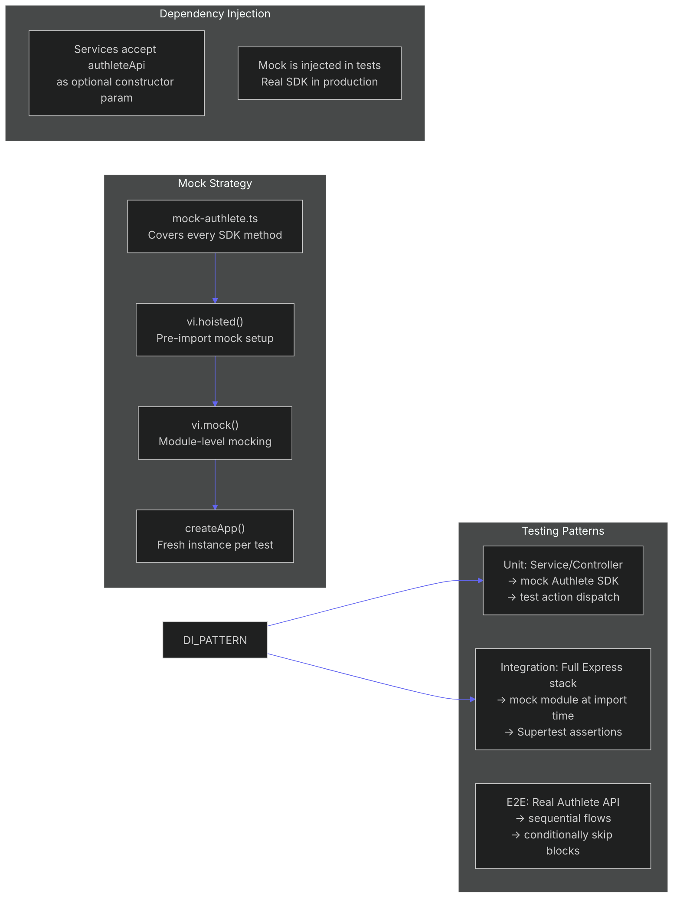

# Testing

- [Server Tests (Vitest)](#server-tests)
- [Client Tests (Vitest)](#client-tests)
- [Testing Architecture](#testing-architecture)
- [Mock Strategy](#mock-strategy)
- [Running Tests](#running-tests)
- [Writing Tests](#writing-tests)

---

## Server Tests

```mermaid
%%{init: {'theme': 'dark', 'themeVariables': { 'primaryColor': '#1e293b', 'primaryTextColor': '#e2e8f0', 'primaryBorderColor': '#475569', 'lineColor': '#475569', 'secondaryColor': '#0f172a', 'tertiaryColor': '#334155', 'fontFamily': 'Inter'}}}%%
flowchart TB
    subgraph ServerTests["Server — 38 files, 246 tests, ~2s"]
        UNIT["Unit Tests<br/>37 files, 223 tests"]
        INTEGRATION["Integration Tests<br/>1 file, 23 tests"]
        E2E["E2E Tests<br/>1 file, 100 tests"]
    end
    
    subgraph Unit["Unit (223 tests)"]
        SERVICES["Services<br/>20 files, 78 tests"]
        CONTROLLERS["Controllers<br/>6 files, 60 tests"]
        MIDDLEWARE["Middleware<br/>4 files, 28 tests"]
        UTILS["Utils<br/>4 files, 22 tests"]
        ROUTES["Routes<br/>2 files, 24 tests"]
    end
    
    subgraph Controllers["Controller Tests (60)"]
        TOKEN_CT["token.controller.test.ts"]
        AUTH_CT["authorization.controller.test.ts"]
        AUTH_FAIL["authorization-fail-response.handler.test.ts"]
        DCR_CT["dcr.controller.test.ts"]
        BACKCH_CT["backchannel-logout.controller.test.ts"]
        DEVICE_CT["device.controller.test.ts"]
    end
    
    subgraph Middleware["Middleware Tests (28)"]
        CSRF["csrf.test.ts<br/>6 tests"]
        SESSION["session.test.ts"]
        AUDIT["audit-log.test.ts"]
        ERROR["errorHandler.test.ts"]
    end
    
    UNIT --> SERVICES
    UNIT --> CONTROLLERS
    UNIT --> MIDDLEWARE
    UNIT --> UTILS
    UNIT --> ROUTES
    CONTROLLERS --> TOKEN_CT
    CONTROLLERS --> AUTH_CT
    CONTROLLERS --> AUTH_FAIL
    CONTROLLERS --> DCR_CT
    CONTROLLERS --> BACKCH_CT
    CONTROLLERS --> DEVICE_CT
    MIDDLEWARE --> CSRF
    MIDDLEWARE --> SESSION
    MIDDLEWARE --> AUDIT
    MIDDLEWARE --> ERROR
    INTEGRATION --> ROUTES_INT["routes.test.ts"]
    E2E --> E2E_FILE["e2e.test.ts<br/>26 section blocks"]
```



### Categories

| Category | Files | Tests | What's tested |
|----------|-------|-------|---------------|
| **Services** | 20 | 78 | Each service in isolation with mocked `authleteApi`. Includes `consent-store`, `device`, `metrics`, `par` |
| **Controllers** | 6 | 60 | Token, authorization, fail-response, DCR, backchannel-logout, device. Uses `vi.hoisted()` for mutable mocks |
| **Middleware** | 4 | 28 | Error handler, session, audit-log, CSRF (6 tests: template renders token, missing/wrong → 403, valid passes, consumed token reused → 403) |
| **Utils** | 4 | 22 | `createLocalJWT`, `jwksClient`, `validate`, `validation` |
| **Routes** | 2 | 24 | Metrics routes + OpenAPI routes |

### Integration Tests

- **File:** `tests/integration/routes.test.ts` (23 tests)
- Full Express stack with mocked SDK via `vi.hoisted()` + `vi.mock()`
- Uses `createApp()` factory — tests build fresh app instances without `listen()`
- Supertest for HTTP assertions

### E2E Tests

- **File:** `tests/e2e/e2e.test.ts` (100 tests)
- Requires real Authlete credentials (skips conditionally based on env vars)
- 26 sequentially-numbered section blocks
- Tests: authorization code, PKCE, DCR, CIBA, PAR, device flow, token management, backchannel logout, discovery, introspection, revocation
- Guards: `CID`/`SEC` (confidential client), `PUB_CID` (public client), `MGMT_CLIENT_ID`/`MGMT_CLIENT_SECRET` (management)
- Authlete rate limit (~15+ token calls in short window → 429) handled as valid response
- Request object E2E test creates ephemeral DCR client (deleted in `afterAll`), guarded by `hasManagement`

---

## Client Tests

**17 test files** across 5 groups:

| Group | Directory | Content |
|-------|-----------|---------|
| UI Components | `test/components/ui/` | `Badge`, `Button`, `JsonBlock` |
| Hooks | `test/hooks/` | `useClipboard` |
| Services | `test/services/` | `admin`, `backchannel-logout`, `ciba`, `client`, `dcr`, `device`, `grant`, `health`, `http`, `par`, `token` |
| Utils | `test/utils/` | `cn` (Tailwind class merging) |

Run with `npm --prefix client run test`.

---

## Testing Architecture



### Key Patterns

1. **Dependency Injection**: 16 services accept `authleteApi` as optional constructor param (defaults to real SDK). Tests inject the mock.
2. **`vi.hoisted()` + `vi.mock()`**: Integration tests replace `authlete.service` module at import time using Vitest's hoisted mocking.
3. **`createApp()` factory**: `app.ts` exports `createApp()` — tests build fresh app instances without `listen()`, avoiding port conflicts.
4. **Mutable mocks**: Controller tests use `vi.hoisted()` to set up mutable mocks for config-dependent behavior (e.g., `MGMT_CLIENT_ID` presence).
5. **Config-dependent skipping**: E2E tests check env vars at runtime to skip blocks requiring credentials not present in the environment.

---

## Mock Strategy

### Mock API (`tests/helpers/mock-authlete.ts`)

A comprehensive mock covering every SDK method used by the server:

```typescript
// Key mocked methods — pseudocode
createMockAuthleteApi() => {
  authorization: { process(), issue(), fail() },
  token:           { process(), issue(), fail() },
  revocation:      { revoke() },
  userInfo:        { issue() },
  introspection:   { introspect() },
  ciba:            { authentication(), issue(), fail(), complete() },
  device:          { authorization(), verification(), complete() },
  backchannelAuthentication: { authentication() },
  dynamicClientRegistration: { register(), get(), update(), delete() },
  pushedAuthorization: { register() },
  grantManagement: { process() },
  client:          { create(), get(), update(), delete(), secretRefresh(), secretUpdate() },
  tokenManagement: { list(), create(), delete(), update() },
}
```

### Mock Injection

```typescript
// Service test example
const mockApi = createMockAuthleteApi();
const service = new TokenService(mockApi);

// Integration test example — module-level mock
vi.mock("../services/authlete.service.js", () => ({
  authleteClient: createMockAuthleteApi(),
}));
```

---

## Running Tests

```bash
# Full server suite (unit + integration)
npm --prefix server run test             # 246 tests, 38 files, ~2s

# Watch mode
npm --prefix server run test:watch

# Coverage report
npm --prefix server run test:coverage

# Unit only
npm --prefix server run test:unit        # 223 tests, 37 files

# Integration only
npm --prefix server run test:integration # 23 tests

# E2E (requires real Authlete credentials)
npm --prefix server run test:e2e         # 100 tests

# Client tests
npm --prefix client run test             # 17 test files

# Lint & typecheck (server)
npm --prefix server run lint             # ESLint flat config, 0 errors
npm --prefix server run typecheck        # tsc --noEmit, 0 errors
```

---

## Writing Tests

### Service Test Template

```typescript
import { describe, it, expect } from "vitest";
import { createMockAuthleteApi } from "../../helpers/mock-authlete";
import { TokenService } from "../../../src/services/token.service";

const mockApi = createMockAuthleteApi();

describe("TokenService", () => {
  it("should process token request", async () => {
    const service = new TokenService(mockApi);
    const result = await service.process(mockRequest);
    expect(result.action).toBe("OK");
  });
});
```

### Controller Test Template

```typescript
import { describe, it, expect, vi } from "vitest";
// vi.hoisted() for mutable mocks
const { mockService } = vi.hoisted(() => ({
  mockService: { process: vi.fn() },
}));

vi.mock("../../../src/services/token.service", () => ({
  TokenService: class {
    process = mockService.process;
  },
}));
```

### Integration Test Template

```typescript
import { describe, it, expect } from "vitest";
import request from "supertest";
import { createApp } from "../../../src/app";

const app = createApp();

describe("POST /api/token", () => {
  it("returns 200 for valid request", async () => {
    const res = await request(app)
      .post("/api/token")
      .send({ grant_type: "client_credentials" });
    expect(res.status).toBe(200);
  });
});
```
