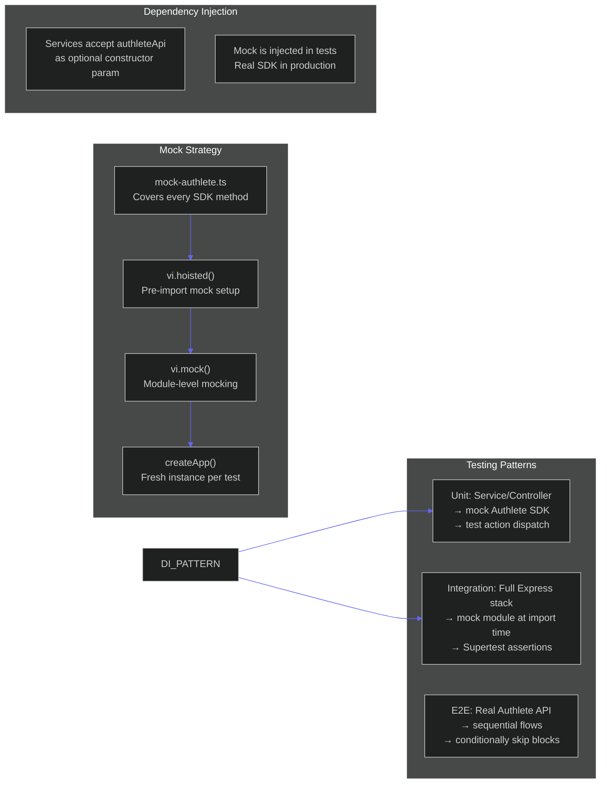

# Testing

- [Server Tests (Vitest)](#server-tests)
- [Client Tests (Vitest)](#client-tests)
- [Testing Architecture](#testing-architecture)
- [Mock Strategy](#mock-strategy)
- [Running Tests](#running-tests)
- [Writing Tests](#writing-tests)

---

## Server Tests

> **The per-category breakdown lives in
> [`docs/agents/testing-and-checks.md`](agents/testing-and-checks.md), and only there.** This section
> carried a second copy for months and every number in it was wrong by roughly 5x — it read *38 files,
> 246 tests* against an actual 77 and 1130, and named six controller tests out of fourteen. A hand-kept
> inventory in two places is one that drifts in at least one of them. What is left here is the shape and
> the totals; re-measure before quoting either.

**Measured 2026-08-31** — `npm --prefix server run test`:

| Layer | Files | Tests | What it can see |
|-------|-------|-------|-----------------|
| Unit | 70 | 826 | One module with its collaborators mocked. **A controller test calls the handler directly and never touches the middleware chain**, so it cannot see an auth gate at all |
| Integration | 7 | 304 | The full Express stack via `createApp()` + Supertest, mocked SDK. This is the layer that sees gates, status mappings and route parameters |
| **Total** | **77** | **1130** | ~3s |

Unit tests are split across `services/` (27 files), `controllers/` (14), `utils/` (12), `middleware/` (7),
`routes/` (7), `views/` (2) and `config/` (1).

**Prefer adding to an integration test over a new controller test** when the thing under test is a gate,
a status mapping or a route parameter.

### E2E Tests

- **File:** `tests/e2e/e2e.test.ts` — **101 tests: 99 exercised, 2 permanently skipped.** The two are the
  device-flow completion pair behind `itInDevelopment`; Vitest sets `NODE_ENV=test` and the suite also
  asserts the other side of that gate, so they cannot both run in one pass. See `AGENTS.md`.
- **Never run this without being asked.** It spends real Authlete API quota and trips the ~15-call rate
  limit. It is deliberately absent from `ci.yml`, which means *nothing* runs it and a green `npm test`
  says nothing about it. `node scripts/check-e2e-staleness.mjs` reports which behaviour-deciding server
  files have changed since the suite was last revised.
- Requires real Authlete credentials; skips conditionally on env vars.
- Guards: `CID`/`SEC` (confidential client), `PUB_CID` (public client),
  `MGMT_CLIENT_ID`/`MGMT_CLIENT_SECRET` (management)
- Authlete rate limit (~15+ token calls in a short window → 429) is handled as a valid response
- The request-object test creates an ephemeral DCR client, deleted in `afterAll`, guarded by
  `hasManagement`

---

## Client Tests

**Measured 2026-08-31**: **1215 tests across 87 files**, plus a Playwright pass (`npm --prefix client
run test:visual`) that runs Chromium and Firefox against the real build.

| Group | Directory | Files |
|-------|-----------|-------|
| Components | `test/components/` | 42 — includes a **driven** test per section (`sections/*.driven.test.tsx`) that presses the control and asserts what reached the service |
| Services | `test/services/` | 26 |
| Utils | `test/utils/` | 9 |
| Hooks | `test/hooks/` | 7 |
| Context | `test/context/` | 1 |
| Routing / smoke | `test/*.test.tsx` | 2 |

`test/helpers/drive-section.tsx` holds the driving harness; read its header for the layer boundary and
the four dead flows that motivated it.

Run with `npm --prefix client run test`.

---

## Testing Architecture


```mermaid
%%{init: {'theme': 'dark', 'themeVariables': { 'primaryColor': '#1e293b', 'primaryTextColor': '#e2e8f0', 'primaryBorderColor': '#475569', 'lineColor': '#6366f1', 'secondaryColor': '#0f172a', 'tertiaryColor': '#334155', 'fontFamily': 'Inter'}}}%%
flowchart LR
    subgraph Mock_Strategy["Mock Strategy"]
        SDK_MOCK["mock-authlete.ts<br/>Covers every SDK method"]
        VI_HOISTED["vi.hoisted()<br/>Pre-import mock setup"]
        VI_MOCK["vi.mock()<br/>Module-level mocking"]
        FACTORY["createApp()<br/>Fresh instance per test"]
    end
    
    subgraph DI_Pattern["Dependency Injection"]
        CTOR["Services accept authleteApi<br/>as optional constructor param"]
        MOCK_INJECT["Mock is injected in tests<br/>Real SDK in production"]
    end
    
    subgraph Patterns["Testing Patterns"]
        UNIT_PATTERN["Unit: Service/Controller<br/>→ mock Authlete SDK<br/>→ test action dispatch"]
        INTEG_PATTERN["Integration: Full Express stack<br/>→ mock module at import time<br/>→ Supertest assertions"]
        E2E_PATTERN["E2E: Real Authlete API<br/>→ sequential flows<br/>→ conditionally skip blocks"]
    end
    
    SDK_MOCK --> VI_HOISTED
    VI_HOISTED --> VI_MOCK
    VI_MOCK --> FACTORY
    DI_PATTERN --> UNIT_PATTERN
    DI_PATTERN --> INTEG_PATTERN
```

### Key Patterns

1. **Dependency Injection**: 16 services accept `authleteApi` as optional constructor param (defaults to real SDK). Tests inject the mock.
2. **`vi.hoisted()` + `vi.mock()`**: Integration tests replace `authlete.service` module at import time using Vitest's hoisted mocking.
3. **`createApp()` factory**: `app.ts` exports `createApp()` — tests build fresh app instances without `listen()`, avoiding port conflicts.
4. **Mutable mocks**: Controller tests use `vi.hoisted()` to set up mutable mocks for config-dependent behavior (e.g., `MGMT_CLIENT_ID` presence).
5. **Config-dependent skipping**: E2E tests check env vars at runtime to skip blocks requiring credentials not present in the environment.

---

## Mock Strategy

### Mock API (`tests/helpers/mock-authlete.ts`)

A comprehensive mock covering every SDK method used by the server:

```typescript
// Key mocked methods — pseudocode
createMockAuthleteApi() => {
  authorization: { process(), issue(), fail() },
  token:           { process(), issue(), fail() },
  revocation:      { revoke() },
  userInfo:        { issue() },
  introspection:   { introspect() },
  ciba:            { authentication(), issue(), fail(), complete() },
  device:          { authorization(), verification(), complete() },
  backchannelAuthentication: { authentication() },
  dynamicClientRegistration: { register(), get(), update(), delete() },
  pushedAuthorization: { register() },
  grantManagement: { process() },
  client:          { create(), get(), update(), delete(), secretRefresh(), secretUpdate() },
  tokenManagement: { list(), create(), delete(), update() },
}
```

### Mock Injection

```typescript
// Service test example
const mockApi = createMockAuthleteApi();
const service = new TokenService(mockApi);

// Integration test example — module-level mock
vi.mock("../services/authlete.service.js", () => ({
  authleteClient: createMockAuthleteApi(),
}));
```

---

## Running Tests

```bash
# Full server suite (unit + integration)
npm --prefix server run test             # 246 tests, 38 files, ~2s

# Watch mode
npm --prefix server run test:watch

# Coverage report
npm --prefix server run test:coverage

# Unit only
npm --prefix server run test:unit        # 223 tests, 37 files

# Integration only
npm --prefix server run test:integration # 23 tests

# E2E (requires real Authlete credentials)
npm --prefix server run test:e2e         # 100 tests

# Client tests
npm --prefix client run test             # 16 test files

# Lint & typecheck (server)
npm --prefix server run lint             # ESLint flat config, 0 errors
npm --prefix server run typecheck        # tsc --noEmit, 0 errors
```

---

## Writing Tests

### Service Test Template

```typescript
import { describe, it, expect } from "vitest";
import { createMockAuthleteApi } from "../../helpers/mock-authlete";
import { TokenService } from "../../../src/services/token.service";

const mockApi = createMockAuthleteApi();

describe("TokenService", () => {
  it("should process token request", async () => {
    const service = new TokenService(mockApi);
    const result = await service.process(mockRequest);
    expect(result.action).toBe("OK");
  });
});
```

### Controller Test Template

```typescript
import { describe, it, expect, vi } from "vitest";
// vi.hoisted() for mutable mocks
const { mockService } = vi.hoisted(() => ({
  mockService: { process: vi.fn() },
}));

vi.mock("../../../src/services/token.service", () => ({
  TokenService: class {
    process = mockService.process;
  },
}));
```

### Integration Test Template

```typescript
import { describe, it, expect } from "vitest";
import request from "supertest";
import { createApp } from "../../../src/app";

const app = createApp();

describe("POST /api/token", () => {
  it("returns 200 for valid request", async () => {
    const res = await request(app)
      .post("/api/token")
      .send({ grant_type: "client_credentials" });
    expect(res.status).toBe(200);
  });
});
```
