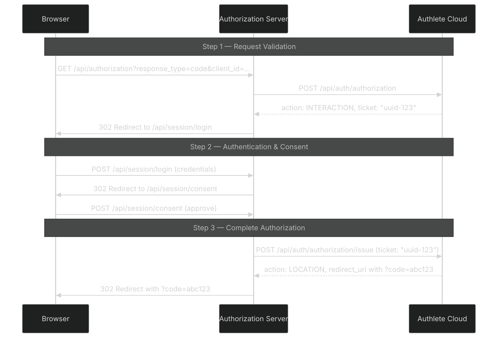

# The Authlete `ticket` Parameter

- [What is the ticket?](#what-is-the-ticket)
- [Why does Authlete create it?](#why-does-authlete-create-it)
- [Authorization Flow with Tickets](#authorization-flow-with-tickets)
- [Code Walkthrough](#code-walkthrough)
- [Ticket Lifecycle](#ticket-lifecycle)
- [Error Scenarios](#error-scenarios)
- [Security Considerations](#security-considerations)

---

## What is the ticket?

The `ticket` is a UUID string returned by Authlete's `/api/auth/authorization` API. It acts as a server-side reference handle for an in-progress authorization transaction. The authorization server stores it in the user's session and uses it to complete or abort the transaction later via `/api/auth/authorization/issue` or `/api/auth/authorization/fail`.

The ticket is **not** a security token — it is an opaque reference identifier. It must never be exposed to the browser or client.

---

## Why does Authlete create it?

Authlete creates the ticket to **decouple authorization request processing from user authentication and consent**. The authorization endpoint must:

1. Validate the incoming OAuth 2.0 / OIDC authorization request (parameters, client, redirect URI, scopes, etc.)
2. Wait for the user to authenticate and grant consent (which can take minutes)

Steps 1 and 2 are fundamentally different operations. Authlete handles step 1 synchronously via `/api/auth/authorization`, which returns a ticket. The authorization server then performs step 2 locally (login form, consent page). Once the user decides, the server calls `/api/auth/authorization/issue` (approve) or `/api/auth/authorization/fail` (deny) with the ticket to complete the flow.



---

## Authorization Flow with Tickets

### 1. Authorization Request (`GET /api/authorization`)

The client redirects the browser to the authorization endpoint. The server delegates to Authlete:

```
GET /api/authorization?response_type=code&client_id=my-client&redirect_uri=https://client.example/cb&scope=openid+profile
```

The server calls `authleteApi.authorization.processRequest()` (see `server/src/services/authorization.service.ts:35-38`).

### 2. Authlete Returns `action: INTERACTION` with a Ticket

Authlete validates the request and returns:

```json
{
  "action": "INTERACTION",
  "ticket": "0192a3b4-5c6d-7e8f-9a0b-1c2d3e4f5a6b",
  "client": { "clientId": 42, "clientName": "My App" },
  "scopes": [ { "name": "openid" }, { "name": "profile" } ],
  "idTokenClaims": null,
  "authorizationDetails": null
}
```

The `INTERACTION` action tells the server it must interact with the user (authenticate, get consent) before proceeding.

### 3. Server Stores Ticket in Session

The controller stores the entire authorization context (including the ticket) in the user's session (`server/src/controllers/authorization.controller.ts:72-88`):

```typescript
req.session.authorization = {
  resultMessage: result.resultMessage ?? "",
  clientId: result.client?.clientId ?? 0,
  clientName: result.client?.clientName ?? "",
  prompt,
  redirectUri,
  authorizationIssueRequest: {
    ticket: result.ticket ?? "",
    scopes: result.scopes?.map((scope: Scope) => scope.name) ?? [],
    subject: req.session.user ?? "",
    authorizationDetails: result.authorizationDetails,
    claims: result.idTokenClaims,
  },
};
```

The ticket lives at `req.session.authorization.authorizationIssueRequest.ticket`.

### 4. User Authenticates

The user is redirected to the login page. After successful login (`server/src/controllers/session.controller.ts:59-142`), the server:
- Validates credentials
- Stores `req.session.user = user.subject`
- Redirects to the consent page (or auto-issues if persistent consent covers the scopes)

### 5. User Grants Consent

The user approves or denies on the consent page (`session/controller.ts:showConsent` + `handleConsent`).

### 6. Server Issues or Fails

- **Approve**: `authorizationService.issue(req)` reads the ticket from `req.session.authorization.authorizationIssueRequest.ticket`, adds `subject = req.session.user`, and calls `/api/auth/authorization/issue`
- **Deny**: `authorizationService.fail(ticket, "CONSENT_REQUIRED")` calls `/api/auth/authorization/fail`

After either operation, `req.session.authorization` is deleted to prevent replay.

### 7. Authlete Returns the Final Response

The `issue` API returns `action: LOCATION` with the redirect URI containing the authorization code. The `fail` API returns `action: LOCATION` with the error redirect (or `action: FORM` for some error modes). The response handlers (`authorization-response.handler.ts`, `authorization-fail-response.handler.ts`) map the action to the appropriate HTTP response.

---

## Code Walkthrough

### Authorization Service (`server/src/services/authorization.service.ts`)

| Method | Lines | Purpose |
|--------|-------|---------|
| `process()` | 18-41 | Calls `/api/auth/authorization` with the incoming request parameters. Returns Authlete's response including `action` and potentially `ticket`. |
| `fail()` | 43-56 | Calls `/api/auth/authorization/fail` with a `ticket` and `reason`. Used when the user denies consent or when `prompt=none` has no consent. |
| `issue()` | 58-95 | Calls `/api/auth/authorization/issue` with the ticket from `req.session.authorization.authorizationIssueRequest.ticket`. Injects `subject` from `req.session.user`. |

### Authorization Controller (`server/src/controllers/authorization.controller.ts`)

| Action | Lines | Behavior |
|--------|-------|----------|
| `INTERACTION` | 55-126 | Stores ticket + scopes + client info in `req.session.authorization`, then redirects to login. If `prompt=none` and consent exists, auto-issues instead. |
| `BAD_REQUEST` | 33-34 | Returns 400 with `responseContent`. |
| `LOCATION` | 39-43 | Redirects to the URL in `responseContent` (authorization code or error). |
| `FORM` | 44-49 | Renders the HTML form from `responseContent`. |
| `NO_INTERACTION` | 50-53 | Redirects to the URL in `responseContent` (same as LOCATION). |

### Session Controller (`server/src/controllers/session.controller.ts`)

| Handler | Lines | Ticket Interaction |
|---------|-------|--------------------|
| `handleLogin` | 59-142 | Checks for ticket in session (line 70-72). Calls `fail()` with `NOT_LOGGED_IN` if canceled (line 80-83). Calls `issue()` if persistent consent found (line 122-124). |
| `handleConsent` | 158-217 | Reads ticket from session (line 169-170). Calls `issue()` if approved (line 182) or `fail()` with `CONSENT_REQUIRED` if denied (line 202-205). Deletes `req.session.authorization` after (lines 194, 210). |

### Response Handlers

| Handler | File | Purpose |
|---------|------|---------|
| `sendAuthorizationIssueResponse` | `authorization-response.handler.ts` | Maps Authlete's `issue` response actions (`LOCATION`, `FORM`, `BAD_REQUEST`, `INTERNAL_SERVER_ERROR`) to HTTP responses. |
| `sendAuthorizationFailResponse` | `authorization-fail-response.handler.ts` | Maps Authlete's `fail` response actions (`LOCATION`, `FORM`, `BAD_REQUEST`, `INTERNAL_SERVER_ERROR`) to HTTP responses. |

---

## Ticket Lifecycle

```
                 +-----------------------+
                 | Authlete creates       |
                 | ticket UUID            |
                 +-----------+-----------+
                             |
                             v
                 +-----------+-----------+
                 | Stored in session     |
                 | req.session.authorization|
                 | .authorizationIssueRequest|
                 | .ticket               |
                 +-----------+-----------+
                             |
                +------------+------------+
                |                         |
                v                         v
     +----------+-----------+   +---------+----------+
     | issue() called with  |   | fail() called with  |
     | ticket                |   | ticket              |
     +----------+-----------+   +---------+----------+
                |                         |
                v                         v
     +----------+-----------+   +---------+----------+
     | Authlete returns      |   | Authlete returns   |
     | response (LOCATION    |   | response (LOCATION |
     | with code or FORM)    |   | with error or FORM)|
     +----------+-----------+   +---------+----------+
                |                         |
                v                         v
     +----------+-----------+   +---------+----------+
     | Authorization deleted  |   | Authorization     |
     | from session           |   | deleted from      |
     | (one-time use)         |   | session           |
     +------------------------+   +-------------------+
```

Key properties:
- **Expiry**: Authlete deletes the ticket after 24 hours. Our sessions expire after 30 minutes, so tickets are typically cleaned up by session expiry.
- **One-time use**: After `issue()` or `fail()`, Authlete invalidates the ticket. A second call returns "There is no entity having the ticket specified."
- **Scope**: The ticket is scoped to the service API key that created it. Using a different service's API key to process the same ticket fails.

### prompt=none Short-Circuit

When `prompt=none` is sent by the client, the authorization controller checks for persistent consent immediately (`authorization.controller.ts:91-117`):

```typescript
if (prompt === "none" && req.session.user) {
  const clientId = result.client?.clientId
  const subject = req.session.user
  const requiredScopes = result.scopes?.map((s: Scope) => s.name) || []

  if (clientId && consentStore.isConsentGranted(clientId, subject, requiredScopes)) {
    // Auto-issue — ticket consumed immediately
    const issueResponse = await authorizationService.issue(req)
    delete req.session.authorization
    return res.redirect(issueResponse.responseContent ?? "")
  }

  // No consent — fail immediately
  const failResponse = await authorizationService.fail(
    result.ticket ?? "",
    "CONSENT_REQUIRED"
  )
  delete req.session.authorization
  return sendAuthorizationFailResponse(res, failResponse)
}
```

In this path, the ticket is created and consumed in the same request — the user never sees a login or consent page. The ticket is used immediately because `prompt=none` explicitly requests no user interaction.

---

## Error Scenarios

### "There is no entity having the ticket specified."

Authlete returns this error when a ticket is:
- **Expired** — 24 hours after creation (or less if the Authlete service has a shorter timeout configured)
- **Already used** — `issue()` or `fail()` was already called for this ticket
- **Scoped to a different service** — the API key belongs to a different Authlete service than the one that created the ticket
- **Invalid/wrong value** — the ticket string is not a valid UUID or does not match any known ticket

In our codebase, this error surfaces as an exception from the Authlete SDK (in `authorization.service.ts:issue()` or `fail()`). The controller's catch block passes it to the error handler middleware (`server/src/middleware/errorHandler.ts`), which returns a 500 with `"Internal Server Error"` in production or a detailed error in development.

### "Missing ticket in session — authorization context lost"

Returned by `authorization.service.ts:issue()` (line 64-69) when `req.session.authorization.authorizationIssueRequest.ticket` is falsy. This happens when:
- The session expired before the user completed consent
- The session was lost due to a cookie issue
- The user directly accesses the consent URL without an authorization session

### "Unauthorized — no ticket in session"

Returned by `session.controller.ts:showConsent` (line 150-152) and `handleConsent` (line 164-166) when `req.session.authorization` is missing. This is the same underlying condition as above, surfaced with a 403 status since the user attempted to access a protected endpoint without a valid authorization context.

### "Missing authorization context — session not found"

Returned by `session.controller.ts:handleLogin` (line 70-72) when there is no authorization ticket in the session when the login form is submitted. This typically means:
- The user directly navigated to the login URL without going through the authorization endpoint
- The session expired between the authorization redirect and the login submission

### What happens in each scenario

| Scenario | Where detected | User-facing behavior |
|----------|---------------|---------------------|
| Ticket expired | Authlete API returns error | 500 error page (production) or error detail (development) |
| Ticket already used | Authlete API returns error | 500 error page |
| Session expired | Our null check in `issue()` | 400 `"Missing ticket in session"` |
| No session at consent | Our null check in `showConsent()` | 403 `"Unauthorized"` |
| No session at login | Our null check in `handleLogin()` | 401 `"Missing authorization context"` |

---

## Security Considerations

- **The ticket must never be exposed to the browser.** It is stored in `req.session.authorization`, which is server-side. The browser only sees the session cookie.
- **The ticket is one-time use.** After calling `issue()` or `fail()`, `req.session.authorization` is deleted (see `authorization.controller.ts:104,115`, `session.controller.ts:123,194,210`).
- **The ticket is not a bearer token.** It is an opaque reference handle for the authorization transaction. Even if leaked (which should not happen), it only allows completing or aborting the authorization request — it does not grant access to resources.
- **Session security is critical.** The ticket's security depends entirely on the session infrastructure (`express-session` with secure cookie settings, HTTP-only, SameSite, and HTTPS in production).
- **Ticket validation is server-side only.** The server must ensure the ticket exists before calling `issue()` or `fail()`. Our code validates at multiple points: `authorization.service.ts:64-69` (in issue), `session.controller.ts:70-72` (in login), `session.controller.ts:164-166` (in consent).
