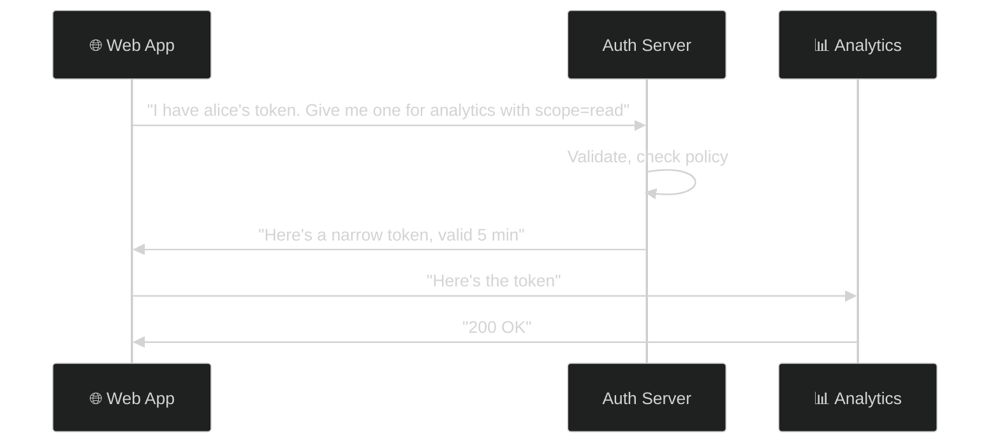
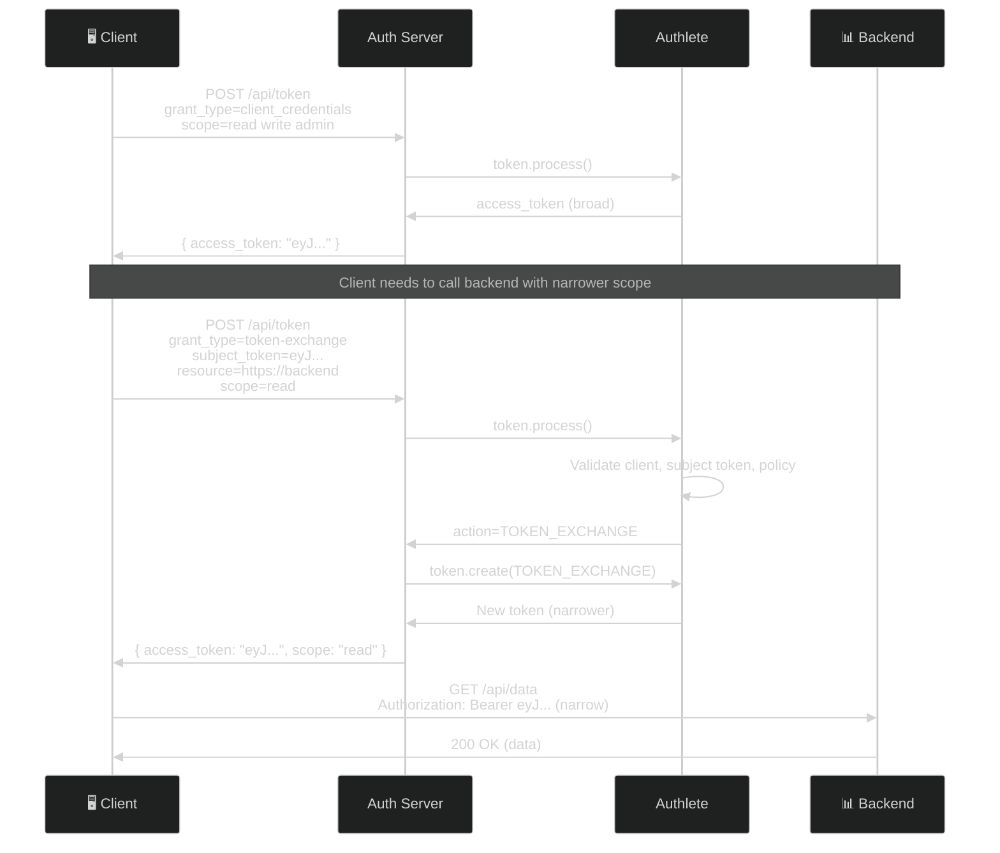
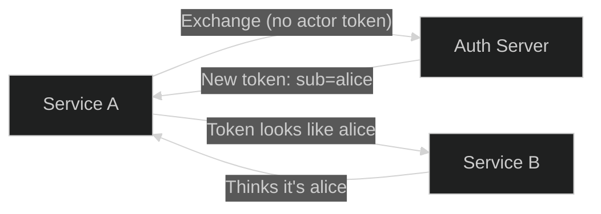
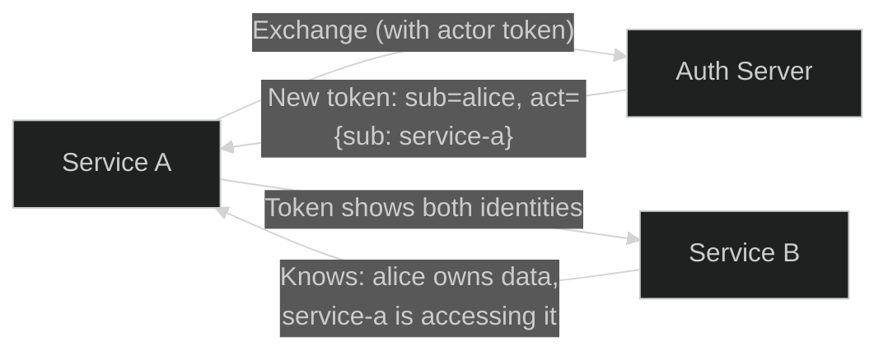
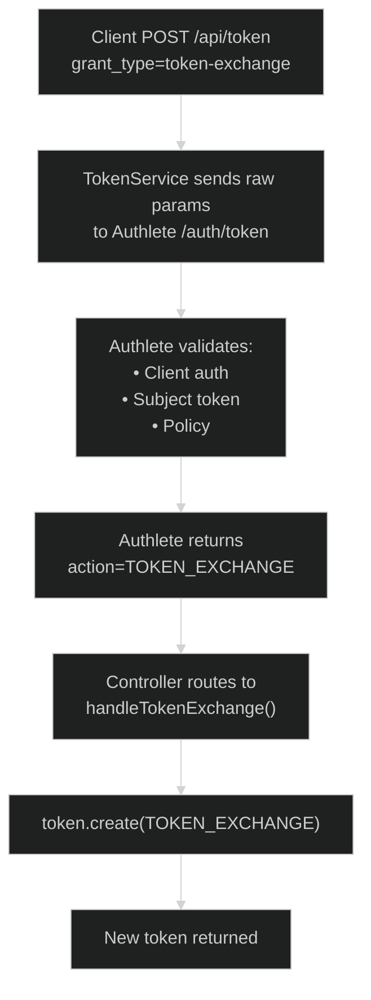
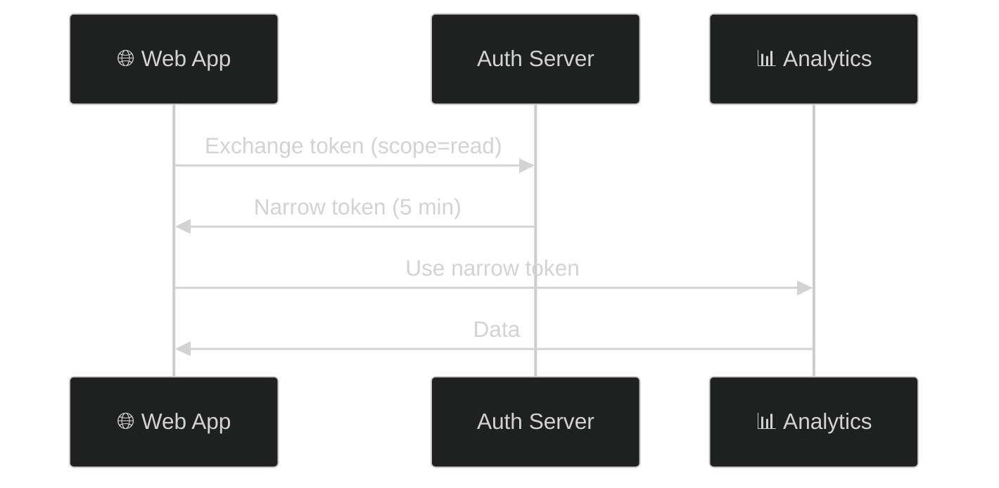
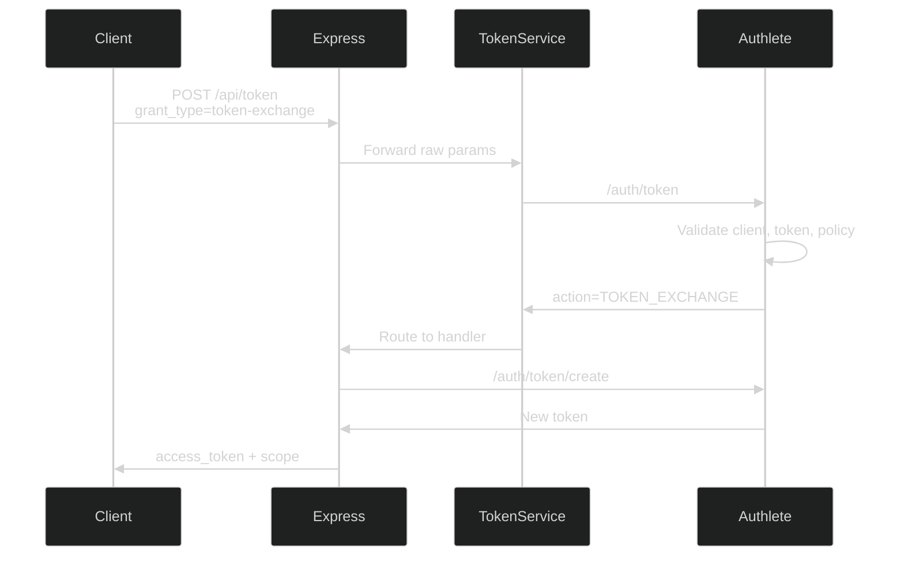

# OAuth 2.0 Token Exchange (RFC 8693)

> **The short version:** Token Exchange lets you swap one token for another at the token endpoint — narrower scope, different audience, different lifetime — without redirecting the user through a new authorization flow.

> ### ⚠️ Read this before you trust an example below
>
> There are **three** layers here, and they do not agree:
>
> | Layer | What it is |
> |---|---|
> | **RFC 8693** | what the spec requires |
> | **Authlete** | what the AS backend validates — deliberately less than the whole job |
> | **This server** | what `server/src/` actually does with Authlete's answer |
>
> **This server implements token exchange incompletely.** Four request parameters are accepted and
> silently discarded, and one REQUIRED response parameter is never emitted. So the parts of this
> tutorial about audience restriction, delegation, and short lifetimes describe *the spec*, not what you
> will observe if you run the curl commands here.
>
> Every gap is listed in [Part 12: What This Server Does Not Implement](#part-12-what-this-server-does-not-implement),
> and each affected section below points there. Verified against the running server on 2026-08-06.
> `docs/curriculum/modules/06-machine-and-delegated-grants/lab.md` Exercise 6 walks you through
> reproducing all of them.
>
> **Labels: captured / *illustrative* / `UNVERIFIED`** — defined once in
> [the tutorial index](README.md#how-to-read-the-transcripts-in-these-tutorials). This file was the repo's
> first tutorial to distinguish them, and it is the model the other eight were brought up to on 2026-08-14:
> a dated *"what this server actually returns"* transcript in
> [Part 7](#part-7-testing-with-curl), and a marker in
> [Part 10](#part-10-error-scenarios) saying which half of an error response you may rely on. Two facts behind
> those labels were re-checked on **2026-08-14** and still hold: `accessTokenDuration` is **86400**, so the
> 24-hour `expires_in` in Part 7 is current, and `TOKEN_EXCHANGE` is still in `supportedGrantTypes`.

---

## Table of Contents

- [Part 1: Why Token Exchange Exists](#part-1-why-token-exchange-exists)
- [Part 2: Core Concepts](#part-2-core-concepts)
- [Part 3: How It Works](#part-3-how-it-works)
- [Part 4: Delegation vs. Impersonation](#part-4-delegation-vs-impersonation)
- [Part 5: Authlete Setup](#part-5-authlete-setup)
- [Part 6: Server Implementation](#part-6-server-implementation)
- [Part 7: Testing with curl](#part-7-testing-with-curl)
- [Part 8: Use Cases](#part-8-use-cases)
- [Part 9: Security Hardening](#part-9-security-hardening)
- [Part 10: Error Scenarios](#part-10-error-scenarios)
- [Part 11: Troubleshooting](#part-11-troubleshooting)
- [Part 12: What This Server Does Not Implement](#part-12-what-this-server-does-not-implement)
- [Appendix: Server Architecture](#appendix-server-architecture)

---

## Part 1: Why Token Exchange Exists

### The Problem: Token Forwarding

Imagine you're building a web app. The user logs in, gets an access token with `read write admin` scopes. Now your app needs to call a read-only analytics service.

**Bad option 1: Forward the full token**


If the analytics service is compromised, the attacker gets **all** your user's tokens — including `admin`.

**Bad option 2: Start a new OAuth flow**


Terrible UX. The user just logged in. Why make them log in again?

### The Solution: Token Swap

Token Exchange gives you a third option — swap the token at the server:



### Airport Analogy

Think of it like an airport:

| Token | Analogy |
|-------|---------|
| Access Token (broad) | **Boarding pass** — gets you through security, into the lounge |
| Exchanged Token (narrow) | **Crew badge** — gets you into the cockpit, but nowhere else |
| Token Exchange | Going to a special desk to swap your boarding pass for a crew badge |

The cockpit doesn't accept boarding passes. It only accepts crew badges. Token Exchange is how you get one.

---

## Part 2: Core Concepts

### The Two Input Tokens

| Token | RFC 8693 §2.1 | What It Is | Analogy |
|-------|:-------------:|------------|---------|
| **Subject Token** | REQUIRED | The user's identity | "Who are we acting for?" |
| **Actor Token** | OPTIONAL | The acting service's identity | "Who is doing the acting?" |

Each has a companion type parameter, and their rules differ:

- `subject_token_type` — **REQUIRED**, always.
- `actor_token_type` — **REQUIRED when `actor_token` is present**, and §2.1 says it **MUST NOT** be
  included otherwise. Sending a type with no token is a malformed request, not a harmless extra.

The type parameters exist so the AS never has to guess a token's format by inspecting it.

### Without Actor Token (Impersonation)

```
New token: { "sub": "alice" }
```

Service B thinks it's talking directly to Alice. Service A is invisible.

### With Actor Token (Delegation)

```json
{
  "sub": "alice",
  "act": { "sub": "service-a" }
}
```

Service B knows both: Alice owns the data, but Service A is accessing it.

### The Grant Type

```
grant_type=urn:ietf:params:oauth:grant-type:token-exchange
```

This tells the server: "I'm not doing a login flow. I'm swapping tokens."

### Token Types

| Type | Identifier |
|------|-----------|
| Access Token | `urn:ietf:params:oauth:token-type:access_token` |
| Refresh Token | `urn:ietf:params:oauth:token-type:refresh_token` |
| ID Token | `urn:ietf:params:oauth:token-type:id_token` |
| JWT | `urn:ietf:params:oauth:token-type:jwt` |
| SAML 1.1 | `urn:ietf:params:oauth:token-type:saml1` |
| SAML 2.0 | `urn:ietf:params:oauth:token-type:saml2` |

---

## Part 3: How It Works

### Complete Flow



### What Just Happened?

1. **Client** got a broad token with `read write admin` scopes

2. **Client** needed to call a backend service that only needs `read`

3. **Client** sent a token exchange request with:
   - `subject_token` + `subject_token_type` — the original broad token, and what kind it is
   - `resource` — where the new token is intended to be used
   - `scope` — what the new token needs (just `read`)

4. **Authlete** validated the client, the subject token and the policy, then returned
   `action=TOKEN_EXCHANGE` along with everything it resolved. It did **not** issue a token — that is not
   what this API does

5. **This server** called `/auth/token/create` with `grantType=TOKEN_EXCHANGE` and got back a token
   carrying only `read`

6. **Client** used the narrow token to call the backend

Even if the backend is compromised, the attacker only gets `read` access — not `write` or `admin`. **Scope
narrowing is the one guarantee that genuinely holds on this server.** The `resource` in step 3 was
accepted and thrown away at step 5, so the new token is not bound to that backend — see
[Part 12](#part-12-what-this-server-does-not-implement).

---

## Part 4: Delegation vs. Impersonation

### Impersonation: "A pretends to be B"



**Result:** Service B thinks it's talking to Alice directly. Service A is invisible.

**Use when:** Downstream service doesn't need to know about the intermediary.

### Delegation: "A acts on behalf of B"



**Result:** Service B knows both the user (alice) and the acting service (service-a).

**Use when:** Downstream service needs to know both identities.

### The `act` Claim

The `act` (actor) claim carries delegation information:

```json
{
  "sub": "alice",
  "act": {
    "sub": "service-a"
  }
}
```

Delegation chains are supported:

```json
{
  "sub": "alice",
  "act": {
    "sub": "service-a",
    "act": {
      "sub": "service-b"
    }
  }
}
```

This means: Alice → Service A → Service B.

### The `may_act` Claim

`may_act` (RFC 8693 **§4.4**, "Authorized Actor") is the permission slip — it states that one party is
authorized to become the actor and act on behalf of another. It travels on the **subject token**, so when
that token is presented for exchange the AS can decide whether this client is allowed to delegate or
impersonate at all:

```json
{
  "sub": "alice",
  "may_act": {
    "sub": "service-a"
  }
}
```

Read the direction carefully: `act` is a statement about what *did* happen, written into the issued
token; `may_act` is a statement about what *is permitted*, read from the incoming one.

> Neither claim is produced or consulted by this server. `may_act` enforcement is a policy decision RFC
> 8693 leaves to the AS, and this deployment makes no such decision.

---

## Part 5: Authlete Setup

### Enable Token Exchange

1. In [Authlete Console](https://console.authlete.com/), go to **Service Settings → Endpoints → Global Settings → Supported Grant Types**
2. Enable `TOKEN_EXCHANGE`
3. Click **Save**

### Security Settings

Go to **Tokens and Claims → Advanced → Token Exchange**:

| Setting | Recommended | Why |
|---------|:-----------:|-----|
| Identifiable Clients Only | `true` | Reject anonymous clients |
| Confidential Clients Only | `true` | Prevent public clients (SPAs) |
| Permitted Clients Only | `true` | Whitelist approach |
| Reject Encrypted JWT | `true` | Can't decrypt them |
| Reject Unsigned JWT | `true` | Anyone could forge |

### Grant Permission to Clients

For each client that needs token exchange:

1. **Client Settings → Tokens and Claims → Advanced → Token Exchange**
2. Enable **Explicit Permission for Token Exchange**
3. Click **Save**

### Verify

```bash
curl http://localhost:3000/api/.well-known/openid-configuration | jq '.grant_types_supported' | grep token-exchange
```

---

## Part 6: Server Implementation

### How It Works

Token Exchange uses the **standard `/api/token` endpoint** — no separate route needed.



### Action Mapping

| Action | HTTP Status | Meaning |
|--------|:-----------:|---------|
| `OK` | 200 | Token created |
| `BAD_REQUEST` | 400 | Invalid request |
| `FORBIDDEN` | 403 | Client not permitted |
| `INTERNAL_SERVER_ERROR` | 500 | Server error |

### What Authlete Validates

| Check | Description |
|-------|-------------|
| Client authentication | If `Confidential Clients Only` enabled |
| Client permission | If `Permitted Clients Only` enabled |
| Subject token type | Must be recognized type identifier |
| Subject token validity | Depends on type (see below) |

| Input Token Type | What Authlete validates | What it leaves to you |
|-----------------|------------------------|----------------------|
| Access Token | Issued by this Authlete instance, belongs to this service, not expired | — |
| Refresh Token | Same as access token | — |
| JWT | Format (RFC 7519), `exp` / `iat` / `nbf`. Optionally rejects encrypted or unsigned JWTs per the service flags | **The signature.** Authlete does not verify it — it cannot know which key applies in an exchange context. Also decryption of encrypted JWTs |
| ID Token | Format, `exp` / `iat` (both required), `iss` (HTTPS, no query/fragment), `aud`, **and the signature** | Encrypted ID tokens — not validated. Symmetric algorithms (`HS256/384/512`) are **rejected outright**, since the client whose secret would be the key is ambiguous here |
| SAML 1.1 / 2.0 | Nothing at all | Everything |

> **Two limitations worth internalising.**
>
> 1. **Tokens from other authorization servers cannot be used** as access or refresh tokens — Authlete
>    only recognises what it issued, and its documentation says cross-system support is not planned. A
>    foreign token has to arrive as a JWT, which brings you to point 2.
> 2. **A JWT subject token's signature is nobody's job by default.** Authlete declines it explicitly and
>    this server does not pick it up. See the note in
>    [Part 9 §5](#5-authlete-security-controls).

---

## Part 7: Testing with curl

### Scenario 1: Exchange for Narrower Token

```bash
# Step 1: Get initial token (client credentials)
TOKEN=$(curl -s -X POST http://localhost:3000/api/token \
  -u "CID:SEC" \
  -d "grant_type=client_credentials&scope=read write admin" | jq -r '.access_token')

# Step 2: Exchange for narrower token
curl -X POST http://localhost:3000/api/token \
  -u "CID:SEC" \
  -d "grant_type=urn:ietf:params:oauth:grant-type:token-exchange" \
  -d "subject_token=$TOKEN" \
  -d "subject_token_type=urn:ietf:params:oauth:token-type:access_token" \
  -d "resource=https://backend.example.com" \
  -d "scope=read"
```

**Response — what this server actually returns** (captured 2026-08-06):

```json
{
  "access_token": "EXAMPLE-exchanged-token",
  "token_type": "Bearer",
  "expires_in": 86400,
  "scope": "read",
  "client_id": 1523514379,
  "subject": "EXAMPLE-subject-value"
}
```

Three things to notice, all covered in [Part 12](#part-12-what-this-server-does-not-implement):
`issued_token_type` is **absent** though RFC 8693 §2.2.1 makes it REQUIRED; `client_id` and `subject`
are present though the spec defines neither; and `expires_in` is the service default of 24 hours, not a
short downstream lifetime. The `resource` you sent had no effect — introspect the token and there is no
`aud`.

### Scenario 2: Exchange ID Token for Access Token

```bash
curl -X POST http://localhost:3000/api/token \
  -u "CID:SEC" \
  -d "grant_type=urn:ietf:params:oauth:grant-type:token-exchange" \
  -d "subject_token=$ID_TOKEN" \
  -d "subject_token_type=urn:ietf:params:oauth:token-type:id_token" \
  -d "audience=https://api.example.com" \
  -d "scope=profile email"
```

### Scenario 3: Delegation with Actor Token

```bash
curl -X POST http://localhost:3000/api/token \
  -u "SERVICE_A_CID:SERVICE_A_SEC" \
  -d "grant_type=urn:ietf:params:oauth:grant-type:token-exchange" \
  -d "subject_token=$USER_TOKEN" \
  -d "subject_token_type=urn:ietf:params:oauth:token-type:access_token" \
  -d "actor_token=$SERVICE_A_TOKEN" \
  -d "actor_token_type=urn:ietf:params:oauth:token-type:access_token" \
  -d "resource=https://service-b.example.com" \
  -d "scope=read"
```

**Issued token should contain** — per RFC 8693 §4.1:
```json
{
  "sub": "alice",
  "act": { "sub": "service-a" }
}
```

> **On this server it does not.** `actor_token` is accepted and discarded, so no `act` claim is produced
> and the response is byte-identical to Scenario 1's. You asked for delegation and received
> impersonation, with HTTP 200 and no warning. See
> [Part 12](#part-12-what-this-server-does-not-implement).

---

## Part 8: Use Cases

### 1. Microservice Token Scoping

**Problem:** User's token has `read write admin`. Analytics service only needs `read`.

**Solution:** Exchange for narrow token.



### 2. Cross-Domain Federation

**Problem:** Company A has user. Company B needs to issue its own token.

**Solution:** Exchange Company A's JWT for Company B's token.

### 3. Legacy System Integration

**Problem:** Modern OAuth app needs to call legacy SAML system.

**Solution:** Exchange access token for SAML assertion.

### 4. IoT Device Access

**Problem:** Smart device needs limited, short-lived access.

**Solution:** Exchange user's token for device-specific token with 1-hour expiry.

---

## Part 9: Security Hardening

### 1. Principle of Least Privilege

| Without Token Exchange | With Token Exchange |
|----------------------|-------------------|
| One token with all scopes | Each service gets only what it needs |
| Compromised service = full access | Compromised service = limited access |

### 2. Token Lifetime Control

Each exchanged token *can* have a shorter lifetime:

```
Original token: 1 hour (user session)
Exchanged token: 5 minutes (backend call)
```

> **Not on this server.** The handler passes no lifetime, so exchanged tokens inherit the service's
> `accessTokenDuration` — 24 hours here. A 24-hour token for a single downstream call is the opposite of
> this control.

### 3. Audience Restriction

The `resource` parameter is *meant* to ensure the token is **only** valid for the intended service:

```bash
resource=https://backend.example.com
```

> **Not on this server.** `resource` and `audience` are both discarded, and the issued token carries no
> `aud` at all — so a token minted "for the orders API" is accepted everywhere that trusts this issuer.
> Do not rely on this as a containment boundary here. The same `resource` parameter *does* work on the
> authorization-code path (see `docs/API.md`), which is what makes the gap easy to miss.

### 4. Audit Trail

With delegation (`act` claim), every hop is recorded:

```json
{
  "sub": "alice",
  "act": {
    "sub": "service-a",
    "act": {
      "sub": "service-b"
    }
  }
}
```

> **Not on this server.** No `act` claim is produced, so an exchanged token records only the subject.
> The intermediary is invisible to the downstream service and to the incident responder six months later.

### 5. Authlete Security Controls

These are real and do take effect — they are enforced by Authlete before your code runs:

| Setting | What it actually buys you |
|---------|--------------------------|
| `Confidential Clients Only` | Only clients that can authenticate may exchange |
| `Identifiable Clients Only` | Rejects requests with no identifiable client |
| `Permitted Clients Only` | Allowlist — a client must be explicitly granted `tokenExchangePermitted` |
| `Reject Encrypted JWT` | Refuses encrypted JWT input tokens, which Authlete cannot decrypt and therefore cannot check |
| `Reject Unsigned JWT` | Refuses `alg:none` input tokens |

> **`Reject Unsigned JWT` is not forgery protection.** It rejects *unsigned* JWTs. For a JWT that *is*
> signed, **Authlete does not verify the signature** — its documentation states this explicitly, because
> in a token-exchange context it cannot know which key to use. Verification is the implementation's job,
> and **this server does not do it either**: nothing in `token-exchange-response.handler.ts` inspects a
> JWT subject token. If you enable `jwt` as an accepted `subject_token_type` here, treat the contents as
> unverified input.
>
> This only affects `subject_token_type=…:jwt`. Access and refresh tokens are looked up in Authlete's own
> store, and ID tokens *do* get their signatures verified by Authlete (asymmetric algorithms only).

---

## Part 10: Error Scenarios

> **UNVERIFIED — read the `error` codes, not the prose.** The `error_description` strings below are
> paraphrases written to show the shape of each failure. Authlete's real descriptions carry a bracketed
> code (`[A1234xx]`) and different wording. The `error` values are the part that matters, because those
> are spec-defined and stable; the descriptions are vendor text and change between versions. Run the
> failures yourself if you need the exact strings.

**Codes RFC 8693 §2.2.2 defines for this grant:** `invalid_request` (malformed request, or an input token
that is invalid/expired/unsupported) and `invalid_target` (the AS is unwilling or unable to issue a token
for the requested `resource` / `audience`). Everything else inherits from RFC 6749 §5.2.

| Situation | `error` | Notes |
|---|---|---|
| `subject_token` missing | `invalid_request` | Also `subject_token_type` missing, or `actor_token_type` sent without `actor_token` |
| `subject_token` expired or not found | `invalid_request` | §2.2.2 groups invalid input tokens here, not under `invalid_grant` |
| Unrecognised `subject_token_type` | `invalid_request` | Must be one of the §3 URIs |
| Client not authenticated, where the service requires it | `invalid_client` | From `Confidential Clients Only` / `Identifiable Clients Only` |
| Client lacks token-exchange permission | `invalid_client` / `unauthorized_client` | From `Permitted Clients Only`. **Not** `invalid_target` — that code is about the requested target service, not about who is asking |
| `resource` / `audience` the AS will not issue for | `invalid_target` | The one code RFC 8693 adds |
| Subject token issued by a different AS | `invalid_request` | Authlete recognises only tokens it issued; see Part 6 |

> **Key point:** Authlete only accepts access and refresh tokens it issued itself. A token from an
> external provider has to arrive as a JWT — and then nothing verifies its signature unless you write
> that check. See [Part 6](#what-authlete-validates) and [Part 9 §5](#5-authlete-security-controls).

---

## Part 11: Troubleshooting

| Problem | Cause | Solution |
|---------|-------|----------|
| `invalid_target` | The AS will not issue for the requested `resource` / `audience` | Check the service's resource configuration, or drop the parameter. **On this server you will not see this** — `resource` and `audience` are discarded before Authlete could object |
| Subject token rejected as not issued here | External token used as `access_token` / `refresh_token` type | Only tokens from this Authlete service work; a foreign token must arrive as `…:jwt` |
| `invalid_client` / 403 | Client lacks token-exchange permission | Enable **Explicit Permission for Token Exchange** on the client (Authlete Console → Client → Tokens and Claims → Advanced) |
| Grant type not supported | `TOKEN_EXCHANGE` not enabled | Service Settings → Endpoints → Global Settings → Supported Grant Types |
| Granted scope narrower than requested | Policy or client scope limits | Correct behavior — RFC 6749 §3.3 requires `scope` in the response when it differs. Always compare what you asked for with what you got |
| **Exchanged token accepted by the *wrong* backend** | This server issues no `aud` | Not fixable by configuration — `resource` is discarded. Do not use the exchanged token's audience as a trust boundary. See [Part 12](#part-12-what-this-server-does-not-implement) |
| Delegation appears to work but no `act` claim | `actor_token` discarded | Same root cause; see [Part 12](#part-12-what-this-server-does-not-implement) |
| Exchanged token lives 24 hours | No lifetime passed on create | Same root cause; pass `accessTokenDuration` to `/auth/token/create` |

---

## Part 12: What This Server Does Not Implement

All of this was reproduced against the running server on **2026-08-06**. None of it is Authlete's doing —
Authlete resolves these values correctly and hands them over; `token-exchange-response.handler.ts` throws
them away.

### The root cause, in six lines

`server/src/controllers/token-exchange-response.handler.ts:29-34` builds its `/auth/token/create` request
from exactly four fields:

```ts
const tokenCreateRequest: TokenCreateRequest = {
  grantType: "TOKEN_EXCHANGE",
  clientId,
  scopes,
  subject,
} as TokenCreateRequest;
```

Authlete's `TOKEN_EXCHANGE` response also carries `resources`, `audiences`, `requestedTokenType`,
`actorToken` and `actorTokenInfo`. Nothing reads them.

### Four parameters accepted and silently discarded

Each returns **HTTP 200** with a byte-identical response shape, so a client cannot tell it was ignored:

| Parameter sent | RFC 8693 says | This server | Consequence |
|---|---|---|---|
| `actor_token` (+ `actor_token_type`) | §2.1 — requests **delegation**; result should carry `act` (§4.1) | discarded | **Delegation is silently downgraded to impersonation.** No `act` claim is ever produced |
| `resource` | §2.1 — audience-restrict the issued token | discarded | A token minted "for the orders API" is valid **everywhere**. Introspection shows **no `aud`** |
| `audience` | §2.1 — same, by logical name | discarded | Same |
| `requested_token_type` | §2.1 — choose the returned token type | discarded | You always get an access token, and because `issued_token_type` is missing you cannot even detect it |

### A REQUIRED response parameter is missing

RFC 8693 §2.2.1 lists `issued_token_type` as **REQUIRED**. Authlete's own documentation tells
implementations to return it. This server does not:

```json
{"access_token":"…","token_type":"Bearer","expires_in":86400,
 "scope":"","client_id":…,"subject":"…"}
```

Two non-standard members (`client_id`, `subject`) are added; the one required member is dropped.

### `expires_in` is the service default, not a short lifetime

The handler passes no lifetime to `/auth/token/create`, so exchanged tokens inherit the service's
`accessTokenDuration` — **86400 seconds (24 hours)** on this deployment. Part 9's "exchanged token: 5
minutes" is the goal, not the behavior. Shortening it requires passing `accessTokenDuration` on the
create call.

### The `subject` field can contain a live credential

`handler.ts:27` reads:

```ts
const subject = result.subject || subjectToken;
```

When Authlete resolves no subject — correct for a client-credentials subject token, which has no user —
this falls back to **the subject token itself**. The value is then returned in the response body, stored
as the new token's subject, and handed out by introspection. Confirmed live: the returned `subject` is
byte-identical to the `subject_token` sent, and still `active`.

A subject identifier is a non-secret by convention, so it flows into logs, traces, metrics labels and
downstream `sub` claims. `||` on a missing identity substitutes whatever is to hand instead of failing;
a client-credentials token has no subject, and the correct behavior is to refuse the exchange.

### Not covered by tests

There is no unit or integration test for `token-exchange-response.handler.ts`. The only automated
coverage is one E2E case, and its assertion is `expect([200, 400, 429]).toContain(res.status)` — which
passes whether or not any of the above is fixed.

---

## Appendix: Server Architecture

### Data Flow



### Files

| File | Role |
|------|------|
| `server/src/services/token.service.ts` | Forwards the raw request to Authlete's `/auth/token` |
| `server/src/controllers/token.controller.ts:147` | `case "TOKEN_EXCHANGE"` → `handleTokenExchange()` |
| `server/src/controllers/token-exchange-response.handler.ts:29-34` | Builds the `/auth/token/create` request — and where the four parameters are lost |
| `server/src/services/token.operations.service.ts` | Token management wrapper (`/auth/token/create`) |

### Test Coverage

- **E2E:** one case in the `Token Exchange (RFC 8693)` block of `tests/e2e/e2e.test.ts` — exchanges an
  access token for a new one. Its assertion is `expect([200, 400, 429]).toContain(res.status)`, so it
  verifies that the endpoint answers, **not** that the response is correct. It passes with every gap in
  Part 12 present.
- **Unit:** none. There is no test file for `token-exchange-response.handler.ts`.
- **Integration:** none. No test under `tests/integration/` exercises the `TOKEN_EXCHANGE` action.

> Line numbers above were checked on 2026-08-06. The E2E block is deliberately named rather than cited by
> line, because line numbers in that file move.

---

## Summary

Token Exchange is simple but powerful:

1. **Client** has a token with broad scope
2. **Client** sends an exchange request with `subject_token` (+ its type), and optionally `resource`,
   `audience`, `scope`, `requested_token_type`, `actor_token`
3. **Authlete** validates the request and the input token, then returns `action=TOKEN_EXCHANGE` with
   everything it resolved — it does **not** mint the token
4. **Your implementation** decides what to issue and calls `/auth/token/create` with
   `grantType=TOKEN_EXCHANGE`
5. **Client** uses the narrow token for the specific service

Step 4 is where the real work lives, and where this deployment falls short: it forwards only
`clientId`, `scopes` and `subject`, dropping the audience and delegation information Authlete handed it.
Scope narrowing works; audience restriction, delegation and short lifetimes do not. See
[Part 12](#part-12-what-this-server-does-not-implement).

**Use Token Exchange when:**
- Calling backend services with different scope needs
- Cross-domain federation
- Legacy system integration
- IoT device access

**Don't use Token Exchange when:**
- Standard OAuth works (no scope reduction needed)
- Simple single-service architecture

---

## References

Each entry is labelled by what kind of source it is, because the three layers disagree in places and
you need to know which one you are reading.

**Normative spec — published RFC**

- [RFC 8693: OAuth 2.0 Token Exchange](https://www.rfc-editor.org/rfc/rfc8693.html) — Standards Track,
  January 2020. Verified 2026-08-06.
  - [§2.1 Request](https://www.rfc-editor.org/rfc/rfc8693.html#section-2.1) — parameters and their status
  - [§2.2.1 Successful Response](https://www.rfc-editor.org/rfc/rfc8693.html#section-2.2.1) — the response
    parameters, including `issued_token_type` as **REQUIRED**
  - [§2.2.2 Error Response](https://www.rfc-editor.org/rfc/rfc8693.html#section-2.2.2) — `invalid_request`,
    `invalid_target`
  - [§3 Token Type Identifiers](https://www.rfc-editor.org/rfc/rfc8693.html#section-3)
  - [§4.1 `act` (Actor) Claim](https://www.rfc-editor.org/rfc/rfc8693.html#section-4.1)
  - [§4.4 `may_act` (Authorized Actor) Claim](https://www.rfc-editor.org/rfc/rfc8693.html#section-4.4)

**Vendor behavior — Authlete**

- [Authlete: OAuth 2.0 Token Exchange (RFC 8693)](https://developers.authlete.com/protocols-and-flows/advanced-flows/oauth-2-0-token-exchange-rfc-8693)
  — the current developer documentation. What Authlete validates, what it deliberately leaves to you.
- [Authlete v2 API: Token Exchange](https://www.authlete.com/developers/v2/token_exchange/) — the
  `/auth/token` → `TOKEN_EXCHANGE` → `/auth/token/create` sequence and the service/client flag names
  (`tokenExchangeByConfidentialClientsOnly`, `tokenExchangePermitted`, …).
- [Authlete KB: Service Settings](https://www.authlete.com/kb/operations/service-configuration/service-settings/)
  — console navigation for the settings in Part 5.

> **Removed:** this page previously cited `authlete.com/kb/token-exchange/` (scheme omitted deliberately
> so the link checker does not re-flag it), which returns **HTTP 404**. The two Authlete links above are
> the live documentation.
