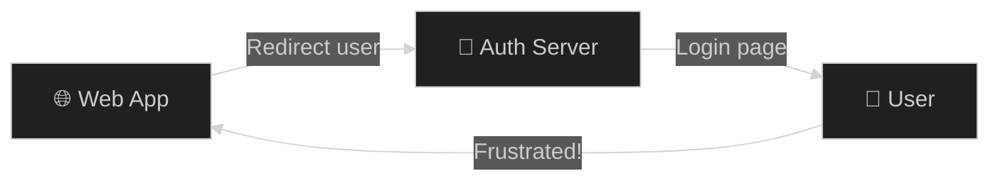
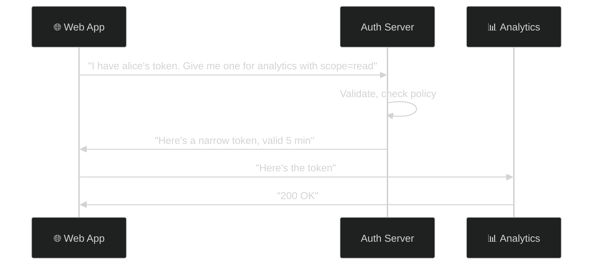
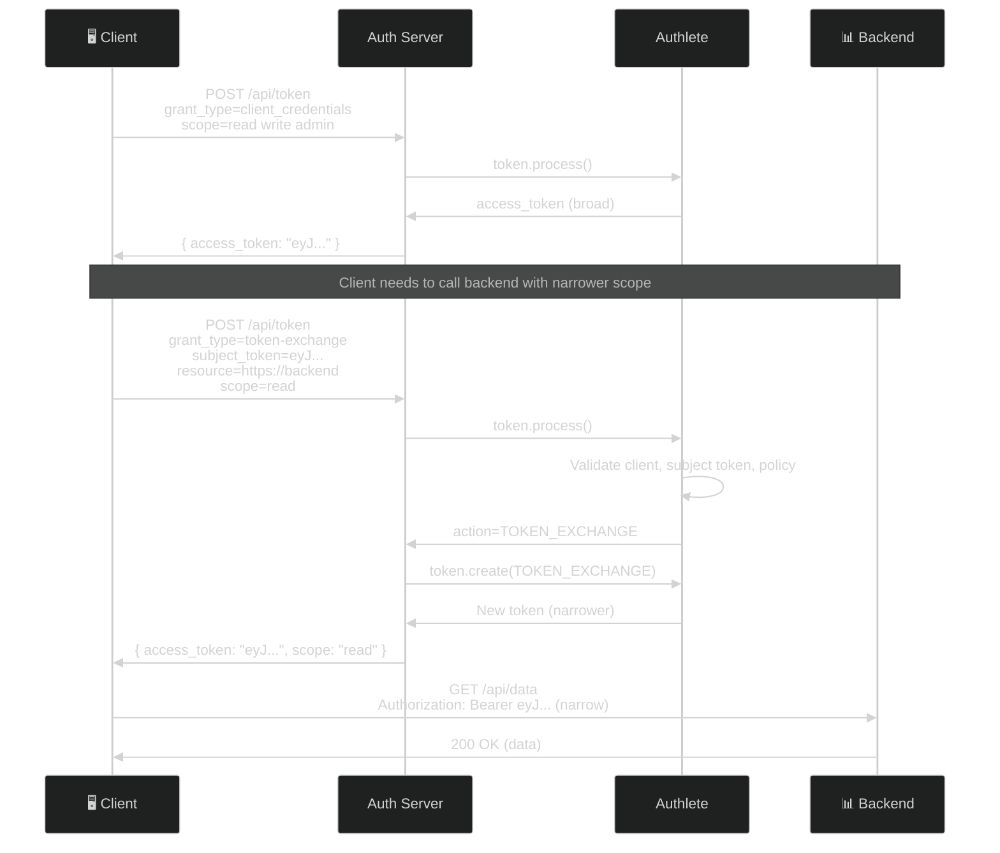
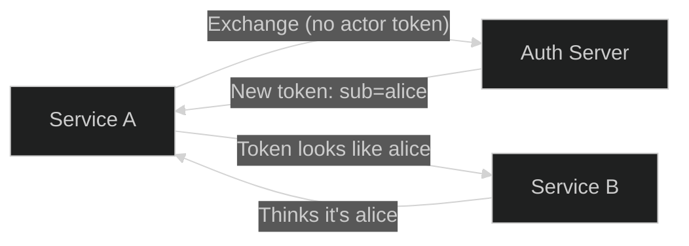
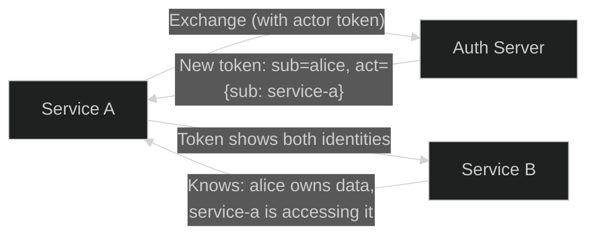
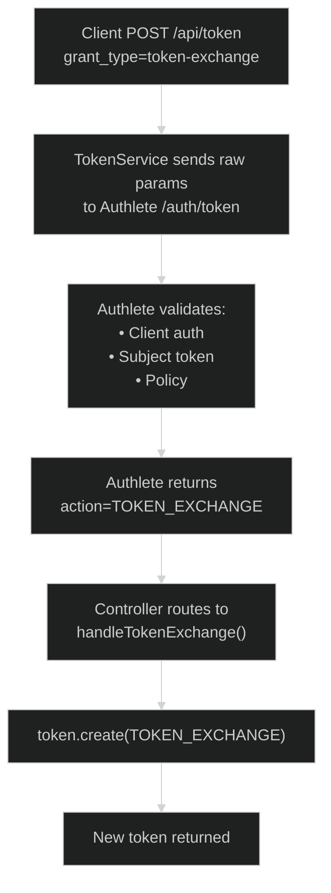
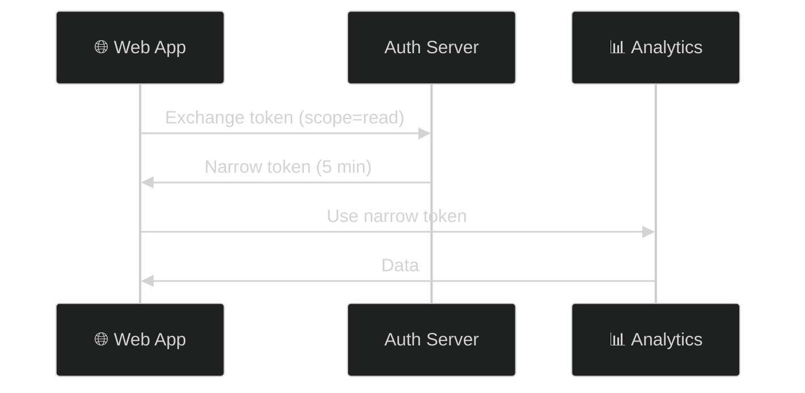
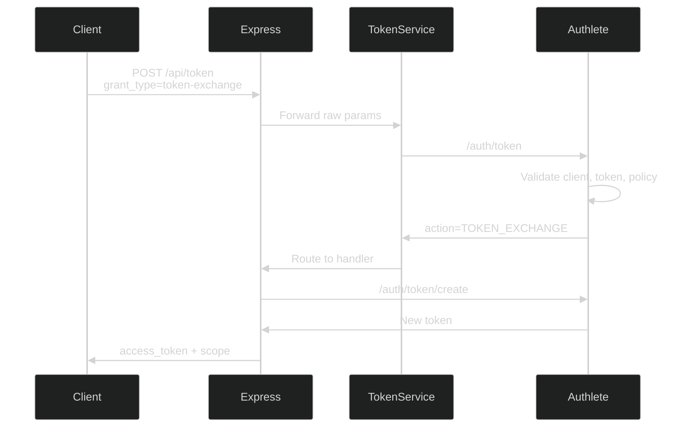

# OAuth 2.0 Token Exchange (RFC 8693)

> **The short version:** Token Exchange lets you swap one token for another at the token endpoint — narrower scope, different audience, different lifetime — without redirecting the user through a new authorization flow.

---

## Table of Contents

- [Part 1: Why Token Exchange Exists](#part-1-why-token-exchange-exists)
- [Part 2: Core Concepts](#part-2-core-concepts)
- [Part 3: How It Works](#part-3-how-it-works)
- [Part 4: Delegation vs. Impersonation](#part-4-delegation-vs-impersonation)
- [Part 5: Authlete Setup](#part-5-authlete-setup)
- [Part 6: Server Implementation](#part-6-server-implementation)
- [Part 7: Testing with curl](#part-7-testing-with-curl)
- [Part 8: Use Cases](#part-8-use-cases)
- [Part 9: Security Hardening](#part-9-security-hardening)
- [Part 10: Error Scenarios](#part-10-error-scenarios)
- [Part 11: Troubleshooting](#part-11-troubleshooting)
- [Appendix: Server Architecture](#appendix-server-architecture)

---

## Part 1: Why Token Exchange Exists

### The Problem: Token Forwarding

Imagine you're building a web app. The user logs in, gets an access token with `read write admin` scopes. Now your app needs to call a read-only analytics service.

**Bad option 1: Forward the full token**


If the analytics service is compromised, the attacker gets **all** your user's tokens — including `admin`.

**Bad option 2: Start a new OAuth flow**



Terrible UX. The user just logged in. Why make them log in again?

### The Solution: Token Swap

Token Exchange gives you a third option — swap the token at the server:



### Airport Analogy

Think of it like an airport:

| Token | Analogy |
|-------|---------|
| Access Token (broad) | **Boarding pass** — gets you through security, into the lounge |
| Exchanged Token (narrow) | **Crew badge** — gets you into the cockpit, but nowhere else |
| Token Exchange | Going to a special desk to swap your boarding pass for a crew badge |

The cockpit doesn't accept boarding passes. It only accepts crew badges. Token Exchange is how you get one.

---

## Part 2: Core Concepts

### The Two Input Tokens

| Token | Required | What It Is | Analogy |
|-------|:--------:|------------|---------|
| **Subject Token** | ✅ | The user's identity | "Who are we acting for?" |
| **Actor Token** | ❌ | The acting service's identity | "Who is doing the acting?" |

### Without Actor Token (Impersonation)

```
New token: { "sub": "alice" }
```

Service B thinks it's talking directly to Alice. Service A is invisible.

### With Actor Token (Delegation)

```json
{
  "sub": "alice",
  "act": { "sub": "service-a" }
}
```

Service B knows both: Alice owns the data, but Service A is accessing it.

### The Grant Type

```
grant_type=urn:ietf:params:oauth:grant-type:token-exchange
```

This tells the server: "I'm not doing a login flow. I'm swapping tokens."

### Token Types

| Type | Identifier |
|------|-----------|
| Access Token | `urn:ietf:params:oauth:token-type:access_token` |
| Refresh Token | `urn:ietf:params:oauth:token-type:refresh_token` |
| ID Token | `urn:ietf:params:oauth:token-type:id_token` |
| JWT | `urn:ietf:params:oauth:token-type:jwt` |
| SAML 1.1 | `urn:ietf:params:oauth:token-type:saml1` |
| SAML 2.0 | `urn:ietf:params:oauth:token-type:saml2` |

---

## Part 3: How It Works

### Complete Flow



### What Just Happened?

1. **Client** got a broad token with `read write admin` scopes

2. **Client** needed to call a backend service that only needs `read`

3. **Client** sent a token exchange request with:
   - `subject_token` — the original broad token
   - `resource` — where the new token will be used
   - `scope` — what the new token needs (just `read`)

4. **Authlete** validated everything and created a new token with only `read` scope

5. **Client** used the narrow token to call the backend

Even if the backend is compromised, the attacker only gets `read` access — not `write` or `admin`.

---

## Part 4: Delegation vs. Impersonation

### Impersonation: "A pretends to be B"



**Result:** Service B thinks it's talking to Alice directly. Service A is invisible.

**Use when:** Downstream service doesn't need to know about the intermediary.

### Delegation: "A acts on behalf of B"



**Result:** Service B knows both the user (alice) and the acting service (service-a).

**Use when:** Downstream service needs to know both identities.

### The `act` Claim

The `act` (actor) claim carries delegation information:

```json
{
  "sub": "alice",
  "act": {
    "sub": "service-a"
  }
}
```

Delegation chains are supported:

```json
{
  "sub": "alice",
  "act": {
    "sub": "service-a",
    "act": {
      "sub": "service-b"
    }
  }
}
```

This means: Alice → Service A → Service B.

### The `may_act` Claim

The `may_act` claim is the "permission slip" — who is allowed to act on behalf of the subject:

```json
{
  "sub": "alice",
  "may_act": {
    "sub": "service-a"
  }
}
```

---

## Part 5: Authlete Setup

### Enable Token Exchange

1. In [Authlete Console](https://console.authlete.com/), go to **Service Settings → Endpoints → Global Settings → Supported Grant Types**
2. Enable `TOKEN_EXCHANGE`
3. Click **Save**

### Security Settings

Go to **Tokens and Claims → Advanced → Token Exchange**:

| Setting | Recommended | Why |
|---------|:-----------:|-----|
| Identifiable Clients Only | `true` | Reject anonymous clients |
| Confidential Clients Only | `true` | Prevent public clients (SPAs) |
| Permitted Clients Only | `true` | Whitelist approach |
| Reject Encrypted JWT | `true` | Can't decrypt them |
| Reject Unsigned JWT | `true` | Anyone could forge |

### Grant Permission to Clients

For each client that needs token exchange:

1. **Client Settings → Tokens and Claims → Advanced → Token Exchange**
2. Enable **Explicit Permission for Token Exchange**
3. Click **Save**

### Verify

```bash
curl http://localhost:3000/api/.well-known/openid-configuration | jq '.grant_types_supported' | grep token-exchange
```

---

## Part 6: Server Implementation

### How It Works

Token Exchange uses the **standard `/api/token` endpoint** — no separate route needed.



### Action Mapping

| Action | HTTP Status | Meaning |
|--------|:-----------:|---------|
| `OK` | 200 | Token created |
| `BAD_REQUEST` | 400 | Invalid request |
| `FORBIDDEN` | 403 | Client not permitted |
| `INTERNAL_SERVER_ERROR` | 500 | Server error |

### What Authlete Validates

| Check | Description |
|-------|-------------|
| Client authentication | If `Confidential Clients Only` enabled |
| Client permission | If `Permitted Clients Only` enabled |
| Subject token type | Must be recognized type identifier |
| Subject token validity | Depends on type (see below) |

| Input Token Type | Validation |
|-----------------|------------|
| Access Token | Issued by this service, not expired |
| Refresh Token | Issued by this service, not expired |
| JWT | Valid format, `exp`/`iat`/`nbf` claims |
| ID Token | Full validation + signature verification |
| SAML | No validation |

> **Key limitation:** Access tokens from **other** authorization servers cannot be used. Authlete only recognizes tokens it issued.

---

## Part 7: Testing with curl

### Scenario 1: Exchange for Narrower Token

```bash
# Step 1: Get initial token (client credentials)
TOKEN=$(curl -s -X POST http://localhost:3000/api/token \
  -u "CID:SEC" \
  -d "grant_type=client_credentials&scope=read write admin" | jq -r '.access_token')

# Step 2: Exchange for narrower token
curl -X POST http://localhost:3000/api/token \
  -u "CID:SEC" \
  -d "grant_type=urn:ietf:params:oauth:grant-type:token-exchange" \
  -d "subject_token=$TOKEN" \
  -d "subject_token_type=urn:ietf:params:oauth:token-type:access_token" \
  -d "resource=https://backend.example.com" \
  -d "scope=read"
```

**Response:**
```json
{
  "access_token": "NEdL-q9EfOI4S5XzaMeimXAXVqS139Jm9DTYeLUAd5o",
  "token_type": "Bearer",
  "expires_in": 600,
  "scope": "read"
}
```

### Scenario 2: Exchange ID Token for Access Token

```bash
curl -X POST http://localhost:3000/api/token \
  -u "CID:SEC" \
  -d "grant_type=urn:ietf:params:oauth:grant-type:token-exchange" \
  -d "subject_token=$ID_TOKEN" \
  -d "subject_token_type=urn:ietf:params:oauth:token-type:id_token" \
  -d "audience=https://api.example.com" \
  -d "scope=profile email"
```

### Scenario 3: Delegation with Actor Token

```bash
curl -X POST http://localhost:3000/api/token \
  -u "SERVICE_A_CID:SERVICE_A_SEC" \
  -d "grant_type=urn:ietf:params:oauth:grant-type:token-exchange" \
  -d "subject_token=$USER_TOKEN" \
  -d "subject_token_type=urn:ietf:params:oauth:token-type:access_token" \
  -d "actor_token=$SERVICE_A_TOKEN" \
  -d "actor_token_type=urn:ietf:params:oauth:token-type:access_token" \
  -d "resource=https://service-b.example.com" \
  -d "scope=read"
```

**Issued token contains:**
```json
{
  "sub": "alice",
  "act": { "sub": "service-a" }
}
```

---

## Part 8: Use Cases

### 1. Microservice Token Scoping

**Problem:** User's token has `read write admin`. Analytics service only needs `read`.

**Solution:** Exchange for narrow token.



### 2. Cross-Domain Federation

**Problem:** Company A has user. Company B needs to issue its own token.

**Solution:** Exchange Company A's JWT for Company B's token.

### 3. Legacy System Integration

**Problem:** Modern OAuth app needs to call legacy SAML system.

**Solution:** Exchange access token for SAML assertion.

### 4. IoT Device Access

**Problem:** Smart device needs limited, short-lived access.

**Solution:** Exchange user's token for device-specific token with 1-hour expiry.

---

## Part 9: Security Hardening

### 1. Principle of Least Privilege

| Without Token Exchange | With Token Exchange |
|----------------------|-------------------|
| One token with all scopes | Each service gets only what it needs |
| Compromised service = full access | Compromised service = limited access |

### 2. Token Lifetime Control

Each exchanged token can have a shorter lifetime:

```
Original token: 1 hour (user session)
Exchanged token: 5 minutes (backend call)
```

### 3. Audience Restriction

The `resource` parameter ensures the token is **only** valid for the intended service:

```bash
resource=https://backend.example.com
```

Even if stolen, it can't be used elsewhere.

### 4. Audit Trail

With delegation (`act` claim), every hop is recorded:

```json
{
  "sub": "alice",
  "act": {
    "sub": "service-a",
    "act": {
      "sub": "service-b"
    }
  }
}
```

### 5. Authlete Security Controls

| Setting | Security Benefit |
|---------|-----------------|
| `Confidential Clients Only` | Only server-side apps can exchange |
| `Identifiable Clients Only` | No anonymous clients |
| `Permitted Clients Only` | Whitelist approach |
| `Reject Encrypted JWT` | Reduces attack surface |
| `Reject Unsigned JWT` | Prevents forgery |

---

## Part 10: Error Scenarios

### Missing subject_token

```json
{"error": "invalid_request", "error_description": "Missing required parameters"}
```

### Expired subject_token

```json
{"error": "invalid_request", "error_description": "The subject token has expired"}
```

### Client not permitted

```json
{"error": "invalid_target", "error_description": "Client not permitted for token exchange"}
```

### Unauthenticated client

```json
{"error": "invalid_client", "error_description": "Client authentication required"}
```

### Token from different service

```json
{"error": "invalid_request", "error_description": "Subject token not issued by this service"}
```

> **Key point:** Authlete only accepts tokens it issued. You can't exchange tokens from external providers unless they're JWTs with the right format.

---

## Part 11: Troubleshooting

| Problem | Cause | Solution |
|---------|-------|----------|
| `invalid_target` error | `resource` not recognized | Check Authlete service config or remove `resource` |
| "Subject token not issued by this service" | External token used | Only tokens from this Authlete service work |
| 403 Forbidden | Client not permitted | Enable in Authlete Console → Client Settings → Token Exchange |
| "Token exchange not supported" | Grant type not enabled | Enable `TOKEN_EXCHANGE` in Service Settings |
| Unexpected scope in response | Policy limited scope | Check response — it reflects actual granted scope |
| Exchanged token rejected by backend | `aud` mismatch | Ensure `resource` matches backend's expected audience |

---

## Appendix: Server Architecture

### Data Flow



### Files

| File | Role |
|------|------|
| `server/src/services/token.service.ts` | Forwards to Authlete |
| `server/src/controllers/token.controller.ts:156` | Routes `TOKEN_EXCHANGE` action |
| `server/src/controllers/token-exchange-response.handler.ts` | Creates new token |
| `server/src/services/token.operations.service.ts` | Token management wrapper |

### Test Coverage

- **E2E:** `tests/e2e/e2e.test.ts:1282-1304` — Exchange access token for new token
- **Unit:** Covered through `TokenService` unit tests
- **Integration:** Token endpoint tests cover `TOKEN_EXCHANGE` action routing

---

## Summary

Token Exchange is simple but powerful:

1. **Client** has a token with broad scope
2. **Client** sends exchange request with `subject_token`, `resource`, `scope`
3. **Authlete** validates and creates new token
4. **Client** uses narrow token for specific service

**Use Token Exchange when:**
- Calling backend services with different scope needs
- Cross-domain federation
- Legacy system integration
- IoT device access

**Don't use Token Exchange when:**
- Standard OAuth works (no scope reduction needed)
- Simple single-service architecture

---

## References

- [RFC 8693: OAuth 2.0 Token Exchange](https://www.rfc-editor.org/rfc/rfc8693.html)
- [Authlete KB: Token Exchange](https://www.authlete.com/kb/token-exchange/)
- [JWT `act` Claim](https://www.rfc-editor.org/rfc/rfc8693.html#section-4.1)
