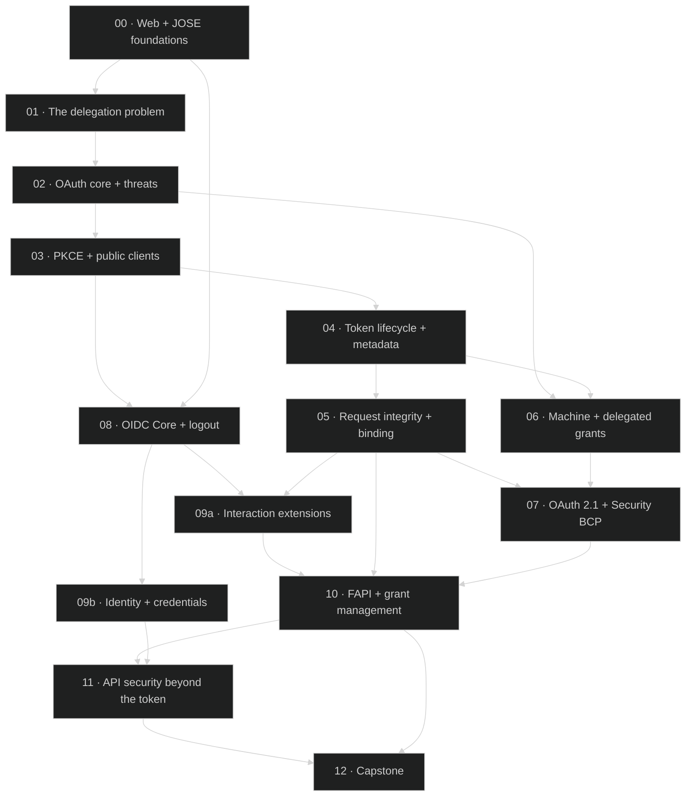

# OAuth & OIDC Security Curriculum

**The short version:** this is a structured, assessed learning path that turns the feature tutorials in
`docs/` into a *sequence* — one that builds an API-security practitioner who can design, review, and attack an
OAuth deployment. It uses this repo's own server (`:3000`) and dashboard (`:3001`) as the lab. Nothing here
appears before the problem that motivates it.

## Why this exists (why before how)

The `docs/` tutorials are excellent, but they are organized **by feature**. A newcomer opening them sees a
wall of RFCs with no dependency order: no reason PKCE comes before PAR, no sense of how FAPI 2.0 relates to
anything else, no line from "what the spec says" to "what goes wrong in production." This curriculum adds the
missing layer on top of those tutorials — **motivation, spec delta, threat model, dependency placement, and
assessment** — and links to each tutorial as assigned reading instead of repeating it.

Think of the tutorials as reference manuals for individual machines, and this curriculum as the apprenticeship
that teaches you the whole factory, in the order a working system was actually built.

## What you'll be able to do at the end

Without reference material, a finisher can: draw the authorization-code flow with PKCE at wire level and name
every parameter's purpose; explain why an access token does **not** authenticate a user; choose grants,
client-authentication methods, and token-binding mechanisms for an arbitrary architecture and defend each
against a *named* attacker model; place an unfamiliar OAuth extension correctly in the dependency graph; find
the authorization flaw in a code review; and pass the adversarial (Tier 4) questions in every quiz.

## The learning path



## Modules

| # | Module | You'll learn | Assigned reading (in `docs/`) | Est. time |
|---|--------|--------------|-------------------------------|-----------|
| 00 | [Web + JOSE foundations](modules/00-web-and-jose-foundations/) | HTTP/TLS trust boundaries, the browser as an untrusted intermediary, JWS/JWE/JWK/JWA/JWT, JWT failure modes | *(none — foundational)* | 3–4 h |
| 01 | [The delegation problem](modules/01-the-delegation-problem/) | Why OAuth exists; the password anti-pattern; the full role/endpoint vocabulary | root `README.md`, `ARCHITECTURE.md`, `DATA-FLOWS.md` | 2 h |
| 02 | [OAuth core + threats](modules/02-oauth-core-and-threats/) | RFC 6749/6750, every grant (incl. deprecated), device grant, RFC 6819 + RFC 9700 threats | `API.md`, `DATA-FLOWS.md`, `DEVICE-FLOW-TUTORIAL.md` | 4–5 h |
| 03 | [PKCE + public clients](modules/03-pkce-and-public-clients/) | Code interception, PKCE S256, native-app hardening, refresh-token handling | `PKCE-TUTORIAL.md` | 3 h |
| 04 | [Token lifecycle + metadata](modules/04-token-lifecycle-and-metadata/) | Introspection, revocation, AS + protected-resource metadata, DCR, JWT ATs, resource indicators | `API.md` | 4 h |
| 05 | [Request integrity + binding](modules/05-request-integrity-and-binding/) | PAR, JAR, `iss`/mix-up, mTLS + cert-bound tokens, DPoP | `PAR-TUTORIAL.md`, `FAPI-TUTORIAL.md` | 5 h |
| 06 | [Machine + delegated grants](modules/06-machine-and-delegated-grants/) | Client credentials, JWT/SAML assertions, token exchange, impersonation vs. delegation | `JWT-BEARER-TUTORIAL.md`, `TOKEN-EXCHANGE-TUTORIAL.md` | 4 h |
| 07 | [OAuth 2.1 + Security BCP](modules/07-oauth-2-1-and-security-bcp/) | RFC 9700 as a consolidated attack catalogue; what OAuth 2.1 changes and why | *(none — synthesis of 02–06)* | 3 h |
| 08 | [OIDC Core + logout](modules/08-oidc-core-and-logout/) | AuthN vs. authZ, ID-token validation, `nonce` vs. `state`, hybrid, UserInfo, the logout family | `BACKCHANNEL-LOGOUT-TUTORIAL.md` | 4–5 h |
| 09a | [Interaction extensions](modules/09a-interaction-extensions/) | JARM, CIBA, Native SSO, step-up (RFC 9470), RAR | `CIBA-`, `NATIVE-SSO-`, `STEP-UP-AUTH-`, `RAR-TUTORIAL.md` | 5 h |
| 09b | [Identity + credentials](modules/09b-identity-and-credentials/) | Identity assurance, federation, SD-JWT, OID4VCI/VP | *(none — VCI section in dashboard)* | 4 h |
| 10 | [FAPI + grant management](modules/10-fapi-and-grant-management/) | FAPI 1.0 Baseline/Advanced, FAPI 2.0 Security Profile + Message Signing, attacker model, grant management | `FAPI-TUTORIAL.md`, `GRANT-MANAGEMENT.md` | 5–6 h |
| 11 | [API security beyond the token](modules/11-api-security-beyond-the-token/) | OWASP API Top 10, BOLA, scopes vs. claims vs. RAR, audience/lifetimes, RBAC/ABAC/ReBAC, gateways, key rotation, conformance | `MONITORING.md` | 4 h |
| 12 | [Capstone](modules/12-capstone/) | Design a high-assurance multi-tenant authZ architecture; then review a vulnerable variant | whole repo | 6–8 h |

**Total:** roughly 60–70 hours of focused work. It is a course, not an afternoon.

## How to use this

1. **Set up the lab once.** Follow the root `README.md` "Getting Started" to run the server (`:3000`) and
   dashboard (`:3001`). Then set up the curriculum env:
   ```bash
   cd docs/curriculum/scripts
   cp curriculum.env.example curriculum.env   # fill in your client IDs/secrets
   set -a; source curriculum.env; set +a       # every lab command reads these variables
   ```
2. **Go in order.** Each module's `README.md` is the lesson; `lab.md` is hands-on; `quiz.md` is the gate.
   The dependency graph above is enforced — later modules assume earlier ones.
3. **Do the labs with `curl`, cross-check in the dashboard.** Every token you obtain gets decoded *locally*:
   ```bash
   node docs/curriculum/scripts/decode-jwt.mjs "$ACCESS_TOKEN"
   ```
   Never paste a token into an online decoder — you would be leaking a live credential.
4. **Break things on purpose.** Every lab ends with a *break it* section: make a change, write down what you
   predict, then run it and explain the gap. This is where the learning is.
5. **Gate yourself with the quizzes.** Don't advance until you can pass Tier 4 (adversarial/design). Answers
   are in `quiz-answers.md` and explain *why the wrong answers are wrong*.
6. **Track progress** in [`PROGRESS.md`](PROGRESS.md). Cumulative exams follow Modules 03, 07, and 11; a final
   exam precedes the capstone.

## Companion documents

- **[SPEC-INVENTORY.md](SPEC-INVENTORY.md)** — every spec: exact title, verified status/date, what it adds,
  what it fixes, where it lives in this repo.
- **[GLOSSARY.md](GLOSSARY.md)** — every role, endpoint, parameter, claim, and acronym, with its defining spec
  and where it appears in the code.
- **[PROGRESS.md](PROGRESS.md)** — a checklist with self-assessment gates.
- **[scripts/](scripts/)** — `decode-jwt.mjs` (offline token decoder), `sd-jwt.mjs` (offline SD-JWT
  issuer/holder/verifier for Module 09b) and `curriculum.env.example`.

## A note on accuracy

This repo is public and teaches OAuth, so a wrong citation propagates into other people's mental models. Every
spec identifier here is verified against its primary source, labeled by type (published RFC / OpenID Final /
Implementer's Draft / active Internet-Draft / vendor behavior), and drafts are never presented as normative.
Where this deployment diverges from a spec — or where a behavior is Authlete's implementation choice rather
than a spec requirement — the modules say so explicitly. If you find an error, treat it as a bug and report it.
