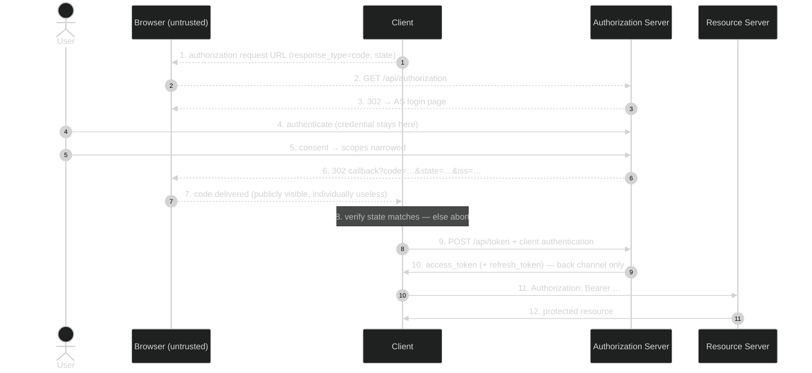

# Module 02 — OAuth Core + Threats

**The short version:** Module 01 said the client must never hold the credential. This module is the machinery
that makes that work — the authorization-code flow at wire level, every other grant type and when each one is
the right answer, the two grants the ecosystem has since killed, and the systematic catalogue of attacks
(RFC 6819, superseded in practice by RFC 9700) that Modules 03–07 spend their time defending against. One
idea holds it together: **the authorization endpoint hands out a claim ticket, not the goods.**

## Prerequisites

- **[Module 00](../00-web-and-jose-foundations/)** — front channel vs. back channel, and decode ≠ verify.
- **[Module 01](../01-the-delegation-problem/)** — the six actors, the credential boundary, and why the roles
  are separate at all.

## Why this module exists

You can now say *why* OAuth splits the roles apart. You cannot yet say *how* a client actually ends up holding
a token, and that gap hides the single most important design decision in the protocol.

Here it is. The user finishes consenting at the authorization server. The AS now needs to get something back
to the client — and the only route available is a redirect through the browser, because that is where the user
is. Module 00 established what that means: **whatever the AS puts in that redirect is visible and editable by
the user agent, sits in the URL bar, lands in browser history, and leaks in `Referer` headers and server
logs.** So the AS has two options. Put the access token there — that is the **implicit grant**, and it means
the credential you worked so hard to protect is replaced by a token you just published. Or put a short-lived,
single-use *reference* there — an **authorization code** — which is worthless to anyone who cannot also
authenticate as the client on the back channel. That second choice is the authorization-code grant, and
essentially everything else in OAuth security follows from it.

Notice the shape of the argument: the code is not "more secure" by magic. It is worthless-by-itself, and the
value is only unlocked on a channel the attacker is not on. That is a pattern you will see repeatedly —
**split the secret across two channels so that compromising one is not enough.** PKCE (Module 03) exists
because that split is *incomplete* for public clients. DPoP and mTLS (Module 05) exist because it is
incomplete for the token, too.

The second half of the module is the grant catalogue, and it exists because "which grant?" is the first
question a real design has to answer, and the answer is usually determined by two facts: *is there a human
present at a browser, and can the client keep a secret?* Get those two right and the choice makes itself. Get
them wrong and you end up with a native app holding a client secret extracted from its own binary, or a
backend service pretending to be a user.

The third part is the threat model, and it belongs *here* rather than at the end. If you learn the flow first
and the attacks later, the mitigations look like arbitrary extra parameters. Learned together, `state`,
exact redirect-URI matching, and one-time codes are obviously *responses to specific attacks*, and you can
reconstruct them from first principles instead of memorizing them.

## Learning objectives

After this module you can:

1. Draw the authorization-code flow at wire level and name every parameter in the request and the response,
   including which are mandatory.
2. Explain why the authorization endpoint returns a **code** rather than a token, in terms of which channel
   each artifact travels on and who can read it.
3. Choose the right grant for an arbitrary scenario using two questions (human present? secret-keeping
   client?) and defend the choice.
4. State what the **implicit** and **ROPC** grants were for, and cite the specific RFC 9700 sections that
   retire them.
5. Describe the **device authorization grant** (RFC 8628), including its polling error codes, and say why it
   needs no redirect URI.
6. Distinguish the two error channels — redirect-borne errors (RFC 6749 §4.1.2.1) from token-endpoint JSON
   errors (§5.2) — and name the codes each defines.
7. Name at least eight attacks from RFC 9700 §4 and, for each, the module in this curriculum that defends it.
8. Explain what `state` does, what it does **not** do, and why that distinction matters for Module 03.

## Plain-language pass (no spec vocabulary)

Back to the hotel, but now watch the paperwork.

- You authorize the cleaning service at the **front desk**. The desk does not hand the cleaner a key card
  right there in the lobby, in front of everyone. It hands over a **claim ticket** — a scrap of paper, good
  for the next thirty seconds, good exactly once.
- The cleaner walks to the **staff door round the back**, shows the claim ticket **and their own company ID**,
  and *there* receives the key card.
- Why bother? Because the lobby is public. Someone could photograph the ticket over the cleaner's shoulder.
  But a photographed ticket is useless: the thief cannot produce the cleaning company's ID at the back door,
  and by the time they try, the ticket has been used and voided. **The ticket is worthless without something
  the thief does not have.**
- The bad old way was to hand the key card out in the lobby directly. Anyone who saw it, had it. That is the
  implicit grant, and it is why nobody does that anymore.
- Some collectors cannot walk to a back door at all — a vending machine, a TV. For those, the desk posts a
  **short code on the machine's screen** and the guest types it into a kiosk elsewhere. The machine keeps
  politely asking the desk "ready yet?" until the guest finishes. That is the device grant.
- And some collectors are not acting for a guest at all — the laundry contractor has its own standing
  agreement with the hotel. No guest, no consent screen, just the contractor's own ID. That is client
  credentials.

The one line to carry forward: **the thing that travels through the public lobby must be useless on its own.**

## Specification pass (exact terminology) + the bridge

| Plain-language element | Formal concept | Defining reference |
|---|---|---|
| The claim ticket | **Authorization code** — short-lived, single-use | RFC 6749 §4.1.2 |
| Redeeming it at the back door | **Access token request** at the token endpoint | RFC 6749 §4.1.3 |
| The cleaner's company ID | **Client authentication** | RFC 6749 §2.3 |
| Handing the key card out in the lobby | **Implicit grant** | RFC 6749 §4.2 — retired, RFC 9700 §2.1.2 |
| Handing over your own key | **Resource owner password credentials** | RFC 6749 §4.3 — **MUST NOT**, RFC 9700 §2.4 |
| The laundry contractor's standing deal | **Client credentials grant** | RFC 6749 §4.4 |
| Code on a screen + kiosk elsewhere | **Device authorization grant** | RFC 8628 |
| "Ready yet?" | **Polling** with `authorization_pending` / `slow_down` | RFC 8628 §3.5 |
| Renewing without going back to the desk | **Refreshing an access token** | RFC 6749 §6 |
| The stub proving *you* started this errand | **`state`** | RFC 6749 §10.12 (Cross-Site Request Forgery) |

### The authorization-code flow, parameter by parameter

**Request** — RFC 6749 §4.1.1, sent by the **user agent** to the authorization endpoint:

| Parameter | Required? | What it does | What breaks without it |
|---|---|---|---|
| `response_type=code` | REQUIRED | Selects the code grant (§3.1.1) | Wrong grant, or an error |
| `client_id` | REQUIRED | Which client is asking | AS cannot look up policy or redirect URIs |
| `redirect_uri` | OPTIONAL in §4.1.1, effectively required in practice | Where the response goes | Ambiguity when a client registered several — and ambiguity is the bug in RFC 9700 §4.1 |
| `scope` | OPTIONAL | Requested permissions (§3.3) | Unbounded or default grant; this deployment can set `scopeRequired` to reject it |
| `state` | RECOMMENDED | Binds the response to *this* browser session (§10.12) | CSRF on the redirect: RFC 9700 §4.7 |
| `code_challenge` / `code_challenge_method` | (RFC 7636) | Binds the code to this client instance | Code interception — **Module 03** |

**Response** — RFC 6749 §4.1.2, a redirect **through the browser**:

```http
HTTP/1.1 302 Found
Location: https://client.example.com/callback?code=SplxlOBeZQQYbYS6WxSbIA&state=xyz&iss=https://as.example.com
```

`code` is single-use and short-lived. `state` must be echoed unchanged. `iss` (RFC 9207) identifies which AS
answered — the mix-up defense, Module 05.

**Token request** — RFC 6749 §4.1.3, sent by the **client** on the back channel, with client authentication:

```http
POST /api/token HTTP/1.1
Content-Type: application/x-www-form-urlencoded
Authorization: Basic czZCaGRSa3F0Mzo...

grant_type=authorization_code&code=SplxlOBeZQQYbYS6WxSbIA&redirect_uri=https://client.example.com/callback&client_id=s6BhdRkqt3
```

The `redirect_uri` is repeated here **for verification, not for routing** — the AS checks it matches the one
used in §4.1.1. `client_id` must be present; letting the AS infer it from the code is the mistake
`missingClientIdAllowed=false` in `AGENTS.md` guards against.

**Token response** — RFC 6749 §5.1:

```json
{ "access_token": "...", "token_type": "Bearer", "expires_in": 3600,
  "refresh_token": "...", "scope": "openid profile" }
```

### Why a code, and not just the token

| | Code (§4.1) | Token in the redirect (implicit, §4.2) |
|---|---|---|
| Travels through the browser | Yes | Yes |
| Useful to whoever reads it there | **No** — needs client auth + one-time redemption | **Yes** — it *is* the credential |
| Lands in history / `Referer` / logs | Yes, but worthless afterwards | Yes, and still live (RFC 9700 §4.2, §4.3) |
| Can the AS bind it to the requester | Yes — PKCE, Module 03 | No |
| Requires a back-channel leg | Yes | No |

The whole benefit is in row 2. Everything else is cost.

### The grant catalogue — choose by two questions

**Is a human present at a browser? Can the client keep a secret?**

| Grant | Spec | Human present? | Client type | Status in 2026 | Use when |
|---|---|---|---|---|---|
| `authorization_code` (+ PKCE) | RFC 6749 §4.1, RFC 7636 | Yes | either | **The default.** PKCE MUST for public clients (RFC 9700 §2.1.1) | Almost always |
| `refresh_token` | RFC 6749 §6 | No (renewal) | either | Current | Long-lived access without re-prompting |
| `client_credentials` | RFC 6749 §4.4 | **No** | confidential only | Current | Service-to-service, acting as *itself* — Module 06 |
| `urn:ietf:params:oauth:grant-type:device_code` | RFC 8628 | Yes, on another device | usually public | Current | TVs, CLIs, anything with no browser or keyboard |
| `urn:ietf:params:oauth:grant-type:jwt-bearer` | RFC 7523 | No | confidential | Current | Assertion-based trust — Module 06 |
| `urn:ietf:params:oauth:grant-type:token-exchange` | RFC 8693 | No | confidential | Current | Delegation/impersonation between services — Module 06 |
| `implicit` (`response_type=token`) | RFC 6749 §4.2 | Yes | public | **Retired** — RFC 9700 §2.1.2 says clients SHOULD NOT use it; removed in OAuth 2.1 | Never in new work |
| `password` (ROPC) | RFC 6749 §4.3 | Yes | either | **Forbidden** — RFC 9700 §2.4: "MUST NOT be used" | Never |

A note on how the two dead grants died, because the reasoning generalizes. **Implicit** existed because
browsers could not make cross-origin back-channel calls when OAuth 2.0 was written; CORS fixed that, and once
a browser-based app *can* do the code exchange, publishing the token in a URL has no upside. **ROPC** existed
as a migration path off password sharing; it never stopped being password sharing (Module 01), and it is
structurally incompatible with MFA, federation, and step-up.

### The device grant in one paragraph

The device has no browser and possibly no keyboard, so it cannot receive a redirect — which means the whole
redirect-based design is unavailable. RFC 8628 breaks the flow across two devices instead: the device POSTs to
the **device authorization endpoint** (§3.1) and gets back a `device_code`, a human-typable `user_code`, a
`verification_uri`, `expires_in`, and a polling `interval` (§3.2). The user goes to that URI on their phone,
types the code, and consents. Meanwhile the device polls the token endpoint (§3.4) with
`grant_type=urn:ietf:params:oauth:grant-type:device_code`, receiving these errors until it doesn't (§3.5):

| Error | Meaning (verbatim, RFC 8628 §3.5) | What the device does |
|---|---|---|
| `authorization_pending` | "The authorization request is still pending as the end user hasn't yet completed the user-interaction steps." | Keep polling at `interval` |
| `slow_down` | "A variant of 'authorization_pending', the authorization request is still pending and polling should continue, but the interval MUST be increased by 5 seconds." | Add 5s, keep polling |
| `access_denied` | "The authorization request was denied." | Stop |
| `expired_token` | "The 'device_code' has expired, and the device authorization session has concluded." | Stop, restart the flow |

**There is no `redirect_uri` anywhere in this grant.** That is the point: it is the one interactive grant that
does not use the front channel at all, so a whole family of redirect attacks simply does not apply. In
exchange it inherits a different problem — the user is authorizing something they can only identify by a short
code, which makes social-engineering the `user_code` the attack of choice.

### Two error channels, and why the difference matters

| | Redirect errors (RFC 6749 §4.1.2.1) | Token-endpoint errors (RFC 6749 §5.2) |
|---|---|---|
| Delivered via | 302 to `redirect_uri`, params in the query | HTTP 400/401 with a JSON body |
| Who sees it | the **user agent** — and anything reading the URL | only the client |
| Codes | `invalid_request`, `unauthorized_client`, `access_denied`, `unsupported_response_type`, `invalid_scope`, `server_error`, `temporarily_unavailable` | `invalid_request`, `invalid_client`, `invalid_grant`, `unauthorized_client`, `unsupported_grant_type`, `invalid_scope` |
| Bearer-token errors | — | `invalid_token` etc. via `WWW-Authenticate` (RFC 6750 §3.1) |

The security-relevant rule: **an error may only be redirected to a `redirect_uri` the AS has already
validated.** If the AS cannot trust the redirect URI (unregistered, malformed, missing), it MUST NOT redirect
— it has to render the error locally. Redirecting an error to an attacker-supplied URI is how an AS becomes an
open redirector (RFC 9700 §4.11).

## Assigned reading

| Read | For |
|---|---|
| [`docs/API.md`](../../../API.md) — "OAuth Core" | The exact request/response shape of `/api/authorize`, `/api/token`, `/api/userinfo` as *this* server implements them |
| [`docs/DATA-FLOWS.md`](../../../DATA-FLOWS.md) — "Authorization Code Flow" and "Token Request Variations" | The Authlete `action` dispatch behind the token endpoint. Read the flowchart: one endpoint, nine outcomes. |
| [`docs/DEVICE-FLOW-TUTORIAL.md`](../../../DEVICE-FLOW-TUTORIAL.md) | The device grant end to end, including the polling script |

**The delta this module adds:** those documents tell you what each endpoint accepts and returns. None of them
answers *why the authorization endpoint returns a code instead of a token*, *which grant to pick and how to
defend the choice*, or *which attack each parameter exists to stop*. That reasoning is here.

## Where this lives in the code

- **`server/src/controllers/authorization.controller.ts`** — receives the authorization request, hands it to
  Authlete, and dispatches on the returned `action`. This is the front-channel entry point.
- **`server/src/controllers/authorization-fail-response.handler.ts`** — the error path. Read it alongside the
  "two error channels" table above: this is where the decision to redirect or not gets made.
- **`server/src/controllers/token.controller.ts`** — the back-channel endpoint. It handles **every** Authlete
  action (`OK`, `BAD_REQUEST`, `INVALID_CLIENT`, `PASSWORD`, `JWT_BEARER`, `TOKEN_EXCHANGE`,
  `ID_TOKEN_REISSUABLE`, `INTERNAL_SERVER_ERROR`) — the table in `AGENTS.md` maps each to its HTTP status.
  Note that a *single* endpoint implements most of the grant catalogue; `grant_type` is what selects among
  them.
- **`server/src/routes/device.routes.ts`** + **`device.service.ts`** — RFC 8628, plus the browser-facing
  `/device` pages where the user types the `user_code`.
- **`server/src/services/consent-store.service.ts`** — persisted consent, 24h TTL, keyed `{clientId}:{subject}`.
  This is what makes `prompt=none` able to succeed silently, and what `prompt=consent` deliberately bypasses.
- **Dashboard:** **Grant Flows** runs the code flow interactively; **Device Flow** runs RFC 8628.

## Wire-level walkthrough

The complete code flow against this server, annotated with who can see what.

```http
# 1. FRONT CHANNEL. The client builds this URL; the BROWSER requests it.
GET /api/authorization?response_type=code
    &client_id=1234567890
    &redirect_uri=http%3A%2F%2Flocalhost%3A3001%2Fcallback
    &scope=openid%20profile
    &state=Zx9qP2rLk7 HTTP/1.1
Host: localhost:3000
# Visible to: the user, the browser, extensions, history. No secret is present — by design.

# 2. The AS has no session yet, so it redirects the user to ITS OWN login page.
HTTP/1.1 302 Found
Location: /api/session/login
# (Module 01: the credential boundary. The client is not in this conversation.)

# 3. The user authenticates and consents on the AS's pages.
POST /api/session/login    username=admin&password=password&_csrf=...
POST /api/session/consent  approved=true&_csrf=...

# 4. FRONT CHANNEL. The AS redirects back with the CODE — not a token.
HTTP/1.1 302 Found
Location: http://localhost:3001/callback?code=8k2Jd...&state=Zx9qP2rLk7&iss=https%3A%2F%2Fas.example.com
# Visible to: the user, the browser, history, Referer, any proxy log.
# Useless to them: redeeming it needs client authentication on the back channel, and it is single-use.

# 5. The client MUST check that `state` equals what it stored in step 1. If not: abort.

# 6. BACK CHANNEL. The client redeems the code. The browser is not involved.
POST /api/token HTTP/1.1
Host: localhost:3000
Content-Type: application/x-www-form-urlencoded
Authorization: Basic <client_id:client_secret>

grant_type=authorization_code&code=8k2Jd...&redirect_uri=http%3A%2F%2Flocalhost%3A3001%2Fcallback&client_id=1234567890

# 7. The token response. This JSON never touches the browser.
HTTP/1.1 200 OK
{"access_token":"...","token_type":"Bearer","expires_in":3600,"scope":"openid profile","refresh_token":"..."}

# 8. The token is spent at the resource server (RFC 6750 §2.1).
GET /api/userinfo HTTP/1.1
Authorization: Bearer <access_token>
```

**What just happened?** Two artifacts crossed two different channels. The code went through the untrusted one
and was useless there; the token came back on the trusted one and never left it. Step 5 is the client's only
CSRF defense, and step 6's client authentication is what makes step 4 safe to publish. Remove either and you
have a live vulnerability — which is exactly what Module 03 explores when the client is *public* and therefore
has no secret to authenticate with in step 6.

## Diagram



Dashed = front channel (browser-visible). Solid = back channel. The code is the only thing that crosses the
dashed boundary, and it cannot be redeemed without step 9's client authentication.

## Threat model — RFC 6819 → RFC 9700

**RFC 6819** (*OAuth 2.0 Threat Model and Security Considerations*, Informational, January 2013) was the first
systematic catalogue. It is still useful as a taxonomy, but it predates PKCE, PAR, DPoP, mix-up, and a decade
of field experience. **RFC 9700** (*Best Current Practice for OAuth 2.0 Security*, BCP 240, January 2025) is
what you actually design against today; treat it as superseding RFC 6819 in practice.

RFC 9700 §4 is the attack catalogue. Here is the whole thing, mapped to where this curriculum defends each —
use this table as your index for the next five modules:

| RFC 9700 §4 | Attack | Defended in |
|---|---|---|
| 4.1 | Insufficient Redirection URI Validation | **02** (exact matching) |
| 4.2 | Credential Leakage via Referer Headers | **02** (why a code, not a token) |
| 4.3 | Credential Leakage via Browser History | **02** / **03** |
| 4.4 | Mix-Up Attacks | **05** (`iss`, RFC 9207) |
| 4.5 | Authorization Code Injection | **03** (PKCE) |
| 4.6 | Access Token Injection | **08** (ID token validation), **05** |
| 4.7 | Cross-Site Request Forgery | **02** (`state`) |
| 4.8 | PKCE Downgrade Attack | **03** |
| 4.9 | Access Token Leakage at the Resource Server | **04** (audience), **05** (binding) |
| 4.10 | Misuse of Stolen Access Tokens | **05** (DPoP/mTLS) |
| 4.11 | Open Redirection | **02** (error-channel rule above) |
| 4.12 | 307 Redirect | **02** |
| 4.13 | TLS Terminating Reverse Proxies | **11** |
| 4.14 | Refresh Token Protection | **03**, **10** |
| 4.15 | Client Impersonating Resource Owner | **06** |
| 4.16 | Clickjacking | **11** |
| 4.17 | Attacks on In-Browser Communication Flows | **03** |

Two normative requirements from RFC 9700 to hold onto now, because they constrain everything downstream:

- On the code: *"Public clients MUST use PKCE [RFC7636] to this end… For confidential clients, the use of
  PKCE [RFC7636] is RECOMMENDED"* (§2.1.1). Module 03.
- On redirect URIs: *"When comparing client redirection URIs against pre-registered URIs, authorization
  servers MUST utilize exact string matching except for port numbers in localhost redirection URIs of native
  apps."* (**§2.1** — the requirement; §4.1.3 is where the same rule is argued out as a countermeasure to the
  §4.1 attack). No wildcards, no prefix matching, no "starts with our domain."

### `state` — what it does and, more importantly, what it doesn't

`state` (RFC 6749 §10.12, "Cross-Site Request Forgery") is a value the client generates, stores against the
user's session, sends in the authorization request, and compares on the way back. It proves **this response
belongs to a flow this browser session started.** It stops an attacker from feeding *their* authorization
response into *your* session (RFC 9700 §4.7).

It does **not** prove the code was issued to this client, it does **not** stop someone who *stole* the code
from redeeming it, and it does **not** bind the code to the client instance that requested it. Those are
different problems, and `state` solves none of them. The gap is exactly the size of PKCE — which is Module 03,
and why it comes next.

## Lab

See **[lab.md](lab.md)**. You will drive all four legs of the code flow with `curl` and a cookie jar, decode
the tokens locally, then break it five ways: replay the code, lie about the `redirect_uri` at the token
endpoint, request an unregistered `redirect_uri` and watch the AS refuse to redirect the error, run the
retired implicit grant and watch a live access token land in a URL fragment, and start a device flow that has
no redirect at all.

> **Configuration prerequisite:** the lab needs `fapiModes` **empty** on your Authlete service — the FAPI 2.0
> profile mandates PAR (Module 05) and rejects `client_secret_basic`, so the plain code flow cannot run while
> it is set. Re-enable it at Module 10, where FAPI is the subject. The lab's setup section lists the full set
> of settings it depends on.

## Threat notes — what breaks if you get this wrong

- **Loose redirect-URI matching.** Prefix or wildcard matching turns the AS into a code-delivery service for
  attacker-controlled URLs. Exact matching is mandatory (RFC 9700 §2.1, argued in §4.1.3); the only permitted flex is the port
  on native-app loopback URIs (`loopbackRedirectionUriVariable` in `AGENTS.md`).
- **Missing or unchecked `state`.** The client accepts an authorization response it never asked for
  (RFC 9700 §4.7). Generating `state` and forgetting to *compare* it is the more common bug.
- **Reusable authorization codes.** A code must be single-use; on reuse the AS should revoke the tokens
  already issued from it, because reuse means someone else has it too.
- **Errors redirected to unvalidated URIs.** Turns the AS into an open redirector (RFC 9700 §4.11) — useful
  for phishing and for laundering the AS's reputation.
- **Implicit anywhere.** Access tokens in URL fragments end up in history, `Referer`, and logs
  (RFC 9700 §4.2, §4.3), cannot be bound to the client, and cannot be refreshed safely.
- **Inferring `client_id` from the code.** If the AS lets the token request omit `client_id` and derives it
  from the code, it loses a cross-check. Keep `missingClientIdAllowed=false` (`AGENTS.md`).
- **Public client with a "secret."** A secret shipped inside a mobile binary or an SPA bundle is not a secret.
  It authenticates nothing, and treating that client as confidential is a design error — Module 03.
- **`user_code` social engineering (device grant).** "Read out the code on your screen and I'll fix your TV."
  There is no redirect to inspect and no origin to check, so user-facing wording and short expiry are the
  whole defense.

## Spec delta

| Question | Answer |
|---|---|
| **What came before** | Module 01 established *that* delegation is needed and named the actors, but not how a token is obtained. |
| **What this adds** | RFC 6749's grant machinery: the code flow (§4.1) and its parameters, `scope` (§3.3), `state` (§10.12), the two error channels (§4.1.2.1, §5.2), refresh (§6), client credentials (§4.4); RFC 6750's bearer usage; RFC 8628's device grant for browserless clients; and a systematic threat catalogue (RFC 6819 → RFC 9700 §4). |
| **What it deprecates** | Implicit (RFC 9700 §2.1.2, removed in OAuth 2.1) and ROPC (RFC 9700 §2.4, "MUST NOT be used"). |
| **What remains unsolved (and where it's addressed)** | A stolen code is still redeemable by anyone who can authenticate as the client — and public clients cannot authenticate at all → **Module 03 (PKCE)**. What the token *means*, and how to check or revoke it → **Module 04**. Protecting the request itself and binding the token to its sender → **Module 05**. Grants with no user at all → **Module 06**. Proving *who the user is* → **Module 08**. |

## What to study next and why

You now have a flow whose front-channel artifact is useless without client authentication — which is a
complete answer for a server-side web app, and **no answer at all** for a mobile app or an SPA. Those clients
cannot keep a secret, so step 9 of the diagram authenticates nobody, and a code stolen from the redirect is
fully redeemable by whoever stole it. That is not a hypothetical: it is authorization-code interception, the
attack that PKCE was written for. **Module 03 — PKCE + Public Clients** closes it, and shows precisely why
`state` does not.
