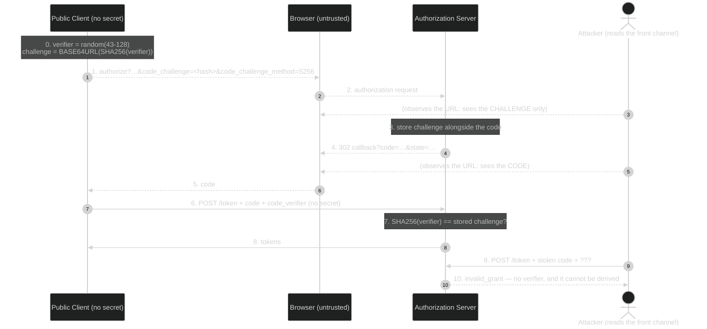

# Module 03 — PKCE + Public Clients

**The short version:** Module 02's code flow is safe because redeeming the code requires client
authentication. Public clients — SPAs, mobile apps, CLIs — have no secret, so that step authenticates nobody
and a stolen code is fully redeemable by whoever stole it. **PKCE** fixes this by replacing the long-lived
shared secret with a fresh per-request one: the client commits to a secret on the front channel by sending
only its hash, then proves it on the back channel. This module also covers the two things that always travel
with public clients — native-app redirect hardening (RFC 8252) and what to do about refresh tokens.

## Prerequisites

- **[Module 02](../02-oauth-core-and-threats/)** — the code flow leg by leg, and specifically the
  understanding that the token endpoint's client authentication is what makes the front-channel code safe.
- **[Module 00](../00-web-and-jose-foundations/)** — SHA-256 and base64url; you compute an S256 challenge by
  hand in the lab.

## Why this module exists

Module 02 ended with a hole, and it is worth stating precisely because the fix is *derivable* from it.

The authorization-code flow's safety argument has two halves: the code is single-use, and redeeming it
requires the client to authenticate. Take away the second half and the argument collapses — a code observed
in the browser (history on a shared machine, a malicious extension, a `Referer` header, a proxy log, or on
mobile a rogue app that registered the same custom URL scheme) can be replayed by the observer, because
`client_id` is public by definition and there is nothing else to prove.

That is not hypothetical. In the lab you will run exactly this: obtain a code for a public client with no
PKCE, then redeem it from a completely separate process using nothing but the public `client_id`. You get a
working access token. That is **authorization code interception** (RFC 9700 §4.5).

So the requirement is: the client must prove *"I am the same party that started this authorization request"*
**without a pre-shared secret.** Reason through what such a proof must satisfy:

1. **Fresh per request.** A value baked into the app binary is extractable, so it is not a secret. It has to
   be generated anew each time.
2. **The front-channel value must not reveal the back-channel value.** The authorization request travels
   through the browser, so whatever is sent there must be useless to a reader — meaning a *one-way transform*
   of the real secret.
3. **Bound to the code at the server.** The AS must remember the commitment and refuse to redeem the code
   without the matching proof.
4. **Not downgradable.** If an attacker can strip the commitment from the request, or swap a strong transform
   for a weak one, the whole thing evaporates.

Those four requirements *are* PKCE. The client generates a random `code_verifier`, sends
`code_challenge = BASE64URL(SHA256(verifier))` on the front channel, and presents the raw verifier on the back
channel. An attacker who sees the authorization request learns the hash — from which the verifier cannot be
recovered — and an attacker who steals the code has nothing to present.

Notice this is the same pattern as Module 02's code-vs-token split, applied one level deeper: **split a secret
across two channels so that compromising the observable one is not enough.** This is its second appearance of
five; you will see it a third time in Module 05, where the *token* gets the same treatment via DPoP, then in
Modules 08 and 09b.

One more thing this module has to do: kill the idea that `state` is "basically the same." `state` is sent in
the clear on the front channel, so it fails requirement 2 outright. It defends the client against accepting a
response it did not initiate; it does nothing to stop someone who *stole* a legitimate response. Two different
attacks, two different parameters, and confusing them is one of the most common OAuth misconceptions.

## Learning objectives

After this module you can:

1. Explain what makes a client **public**, and why a secret shipped in an SPA bundle or a mobile binary is
   not a secret.
2. Describe **authorization code interception** end to end and name the RFC 9700 section that catalogues it.
3. Compute an `S256` `code_challenge` from a `code_verifier` by hand and state the RFC 7636 character set and
   length bounds.
4. Explain precisely why `state` does not substitute for PKCE, in terms of which channel each value travels
   on.
5. State the **PKCE downgrade** attack and the exact rule RFC 9700 §4.8 requires the AS to enforce — in both
   directions.
6. Say why `plain` is a weak `code_challenge_method` and what RFC 9700 §2.1.1 recommends instead.
7. Choose a redirect-URI strategy for a native app among RFC 8252's three options, and say why an embedded
   webview is forbidden.
8. State the rule for refresh tokens issued to public clients (RFC 9700 §2.2.2) and explain the tension
   between refresh-token **rotation** and the FAPI 2.0 profile.

## Plain-language pass (no spec vocabulary)

Back to the hotel, one more time — and this time the collector is a temp worker with no company ID.

- In Module 02 the cleaner could redeem the claim ticket at the back door because they had **company ID**. A
  temp worker has none. Anyone who picks up their dropped ticket can walk to the back door and collect the key
  card. That is the public-client problem: the ticket alone *is* the authorization.
- The fix is a trick you can do with no ID at all. Before the temp worker goes to the front desk, they think
  of a random passphrase and write down only its **fingerprint** — say, a wax impression that is easy to make
  from the phrase but impossible to reverse into it. They hand the desk the impression, and the desk staples
  it to the ticket.
- At the back door the temp worker says the **actual passphrase**. Staff make the impression themselves,
  compare, and hand over the key card.
- Now a stolen ticket is worthless. The thief has the ticket and the impression, but cannot say the
  passphrase — you cannot un-press a seal back into the words that made it.
- Two ways to get this wrong. If the worker writes the **passphrase itself** on the front-desk slip instead of
  its impression, the thief just reads it — that is `plain`. And if the thief can persuade the desk to accept
  a ticket with **no impression stapled to it**, the whole scheme is bypassed — that is the downgrade attack,
  which is why the desk must refuse tickets whose paperwork does not match.

The rule: **commit to a secret in public by publishing something you cannot run backwards, then prove it in
private.**

## Specification pass (exact terminology) + the bridge

| Plain-language element | Formal concept | Defining reference |
|---|---|---|
| The random passphrase | **`code_verifier`** — 43–128 unreserved characters | RFC 7636 §4.1 |
| The wax impression | **`code_challenge`** | RFC 7636 §4.2 |
| Pressing the seal | `code_challenge = BASE64URL-ENCODE(SHA256(ASCII(code_verifier)))` | RFC 7636 §4.2 (`S256`) |
| Writing the passphrase in the open | **`code_challenge_method=plain`** — the default if omitted | RFC 7636 §4.3 |
| Stapling it to the ticket | AS binds the challenge to the authorization code | RFC 7636 §4.4 |
| Saying the passphrase at the back door | `code_verifier` in the token request | RFC 7636 §4.5 |
| Staff compare | AS verifies; on mismatch it MUST return `invalid_grant` | RFC 7636 §4.6 |
| Temp worker with no ID | **Public client** | RFC 6749 §2.1 |
| Refusing unstapled tickets | PKCE downgrade mitigation | RFC 9700 §4.8 |

**RFC 7636's exact definitions, verbatim:**

- The `code_verifier` is a *"high-entropy cryptographic random STRING using the unreserved characters
  `[A-Z] / [a-z] / [0-9] / "-" / "." / "_" / "~"` from Section 2.3 of [RFC3986], with a minimum length of 43
  characters and a maximum length of 128 characters"* (§4.1). ABNF:
  ```
  code-verifier = 43*128unreserved
  unreserved    = ALPHA / DIGIT / "-" / "." / "_" / "~"
  ```
- `S256`: `code_challenge = BASE64URL-ENCODE(SHA256(ASCII(code_verifier)))` (§4.2).
- Two methods are registered — `plain` and `S256` — and `code_challenge_method` *"defaults to 'plain' if not
  present"* (§4.3). **Always send it explicitly.**
- On verification failure, *"an error response indicating `invalid_grant` as described in Section 5.2 of
  [RFC6749] MUST be returned"* (§4.6).

### Public vs. confidential — the only question that matters

RFC 6749 §2.1 splits clients by whether they can keep a secret. In practice:

| | Confidential | Public |
|---|---|---|
| Examples | server-side web app, backend service | SPA, mobile/native app, desktop app, CLI |
| Holds a secret? | Yes — on a server the user cannot read | **No** — the code is on the user's device |
| Token-endpoint auth | `client_secret_basic`, `private_key_jwt`, mTLS | **none** |
| PKCE | RECOMMENDED (RFC 9700 §2.1.1) | **MUST** (RFC 9700 §2.1.1) |

The trap is registering a mobile app or SPA as *confidential* and shipping the secret inside it. Anyone can
extract it from the bundle or decompile the binary, so it authenticates nothing while creating the illusion
that it does — and it also means the same "secret" is shared by every installation on earth. RFC 9700 §2.1.1:
*"Public clients MUST use PKCE [RFC7636] to this end… For confidential clients, the use of PKCE [RFC7636] is
RECOMMENDED."*

### `state` vs. PKCE — settle this now

| | `state` (RFC 6749 §10.12) | PKCE (RFC 7636) |
|---|---|---|
| Generated by | the client | the client |
| Sent on | front channel, **in the clear** | front channel as a **hash**; verifier on the back channel |
| Checked by | the **client**, on the callback | the **authorization server**, at redemption |
| Answers | "did *this browser session* start this flow?" | "is the redeemer the party that started this flow?" |
| Attack stopped | CSRF / response injection (RFC 9700 §4.7) | code interception / injection (RFC 9700 §4.5) |
| Helps if the code is stolen? | **No** | **Yes** |

They are complementary, not alternatives. Send both.

### The downgrade attack, in both directions

An attacker who can modify the authorization request would simply **strip** `code_challenge`, then redeem the
stolen code with no verifier. RFC 9700 §4.8 requires the AS to make both directions impossible:

- Code created **with** a challenge, token request **without** a verifier → reject. (Otherwise stripping the
  proof at redemption works.)
- Code created **without** a challenge, token request **with** a verifier → reject. RFC 9700 §4.8: *"The
  authorization server MUST ensure that if there was no `code_challenge` in the authorization request, a
  request to the token endpoint containing a `code_verifier` is rejected."*

You will test **both** directions against this deployment in the lab; it enforces them.

The durable fix is to stop making it optional: set `pkceRequired` (and ideally `pkceS256Required`) on the
service or the client, so a request without a challenge is refused at the authorization endpoint rather than
tolerated. On the service backing this repo both currently read `false`, which is exactly why the lab's
no-PKCE attack succeeds.

### Native apps — RFC 8252 (BCP 212)

*OAuth 2.0 for Native Apps*, BCP 212, October 2017. Two rules dominate.

**Use an external user-agent.** §8.12: *"This best current practice requires that native apps MUST NOT use
embedded user-agents to perform authorization requests."* An embedded webview is controlled by the app, so it
can read the credential straight out of the DOM — which destroys Module 01's credential boundary — and the
user cannot inspect the address bar to tell a real login page from a fake one. Use the platform's in-app
browser tab (`ASWebAuthenticationSession`, Custom Tabs), which the app cannot read into.

**Pick a redirect strategy** (§7):

| Option | §  | Trade-off |
|---|---|---|
| Private-use URI scheme (`com.example.app:/oauth`) | 7.1 | Simple, but another app can register the same scheme → interception. PKCE is what saves you. |
| Claimed `https` scheme (universal / app links) | 7.2 | **Strongest** — ownership is verified against the domain, so a rogue app cannot claim it. |
| Loopback (`http://127.0.0.1:<port>/cb`) | 7.3 | For desktop/CLI. §7.3: *"The authorization server MUST allow any port to be specified at the time of the request for loopback IP redirect URIs, to accommodate clients that obtain an available ephemeral port."* This is the one sanctioned exception to exact matching — `loopbackRedirectionUriVariable` in `AGENTS.md`. |

### Refresh tokens for public clients

A refresh token issued to a public client is a long-lived credential sitting on a user's device with no client
authentication protecting its use. RFC 9700 §2.2.2 is explicit: *"Refresh tokens for public clients MUST be
sender-constrained or use refresh token rotation as described in Section 4.14."*

Two acceptable answers, then:

- **Sender-constrained** — bind the refresh token to a key the client holds (DPoP or mTLS). Module 05.
- **Rotation** — issue a new refresh token on every use and invalidate the old one. Reuse of a rotated token
  means someone has a copy, so the AS should revoke the whole grant.

**A real tension you must be able to explain.** Rotation is one of the two sanctioned answers here, but
`AGENTS.md` recommends `refreshTokenKept = true` (rotation **off**) citing FAPI 2.0 §5.3.2.1. Both are
defensible because they target different client populations: FAPI 2.0 requires sender-constrained tokens
throughout, and once a token is bound to a key, rotation adds churn without adding security. Rotation is the
fallback for deployments that *cannot* sender-constrain. The rule to carry: **a public client's refresh token
needs one of the two — never neither.** On the service backing this repo `refreshTokenKept` is currently
`false`, so rotation is on; you will observe it in the lab.

### The limit of all of this: XSS

Everything above protects a token or a code **in transit**. None of it survives an attacker running script
inside your own origin, and that limit is load-bearing for the rest of the curriculum, so it needs stating
once, properly.

> **Cross-site scripting (XSS)** is any defect that lets an attacker execute JavaScript in *your* origin —
> a comment field rendered as HTML, a URL parameter reflected into the page, a compromised dependency in your
> bundle, a malicious browser extension with access to the tab. The browser cannot tell that script apart
> from yours: **same origin, same permissions**. It reads `localStorage`, `sessionStorage`, and any variable
> in memory; it makes requests carrying your cookies; it rewrites the DOM.

Now apply that to PKCE. The verifier lives in the client's process between the two legs — in this repo,
`sessionStorage` (`FapiSection.tsx:134`). An attacker with script in your origin **reads it**, and they do
not even need to: they can start a *fresh* authorization flow, generate their own verifier, and complete it
silently against the AS session the user already has. To the authorization server that is the legitimate
client doing legitimate things, because in every checkable sense it is.

So: **PKCE closes a protocol gap; it does nothing about a compromised client.** The same will be true of
DPoP (Module 05) and of every other mechanism in this curriculum. There is no OAuth extension that survives
script execution in your own origin — which is why the honest form of every browser recommendation ends
"…and eliminate XSS", and why the next section exists.

### Keeping tokens out of the browser: the backend-for-frontend

If no browser-side mechanism survives XSS, one response is to stop putting tokens in the browser.

> A **backend-for-frontend (BFF)** is a small server component owned by the same team as the SPA, deployed
> at the same origin. It performs the authorization-code flow **server-side, as a confidential client**, and
> keeps the access and refresh tokens. The browser never receives a token at all — it gets an ordinary
> `HttpOnly`, `Secure`, `SameSite` session cookie, and the BFF attaches the real token when it proxies calls
> onward. It is not an OAuth mechanism and no RFC defines it; it is a deployment pattern.

What it buys, in exactly the terms of the section above: under XSS the attacker can still **make requests as
the victim while the session lives**, because the cookie rides along automatically. What they can no longer
do is **steal a long-lived credential and use it from their own machine, later, elsewhere**. The blast radius
collapses from "exfiltrate a refresh token, retain access for its lifetime" to "abuse an active session that
one logout ends."

What it costs: a stateful server component to build, deploy and secure; CSRF handling that a token-in-header
design did not need; an extra hop; and the BFF itself becomes a high-value target holding many users' refresh
tokens. It is the right default for a **first-party** SPA against a **first-party** API, and often the wrong
answer for a third-party integration with no natural home for the server half.

You will argue this trade-off properly in Tier 4 (Q17), and it returns in Module 05's DPoP discussion and in
the capstone.

## Assigned reading

| Read | For |
|---|---|
| [`docs/PKCE-TUTORIAL.md`](../../../PKCE-TUTORIAL.md) | The whole thing. Part 4 ("The Math Behind PKCE") for the transform, Part 5 for the Authlete service/client settings that enforce it, Part 6 for the client-side implementation. |

**The delta this module adds:** the tutorial explains how PKCE works and how to switch it on. This module
*derives* it from the four requirements above so you could reinvent it, settles `state`-vs-PKCE, adds the
downgrade rule in both directions, and attaches the two things that always ship alongside a public client —
RFC 8252 redirect hardening and the refresh-token rule — neither of which the tutorial covers.

## Where this lives in the code

- **`client/src/pkce.ts`** — the whole implementation, 33 lines. `generateCodeVerifier()` (line 12) builds a
  64-character verifier from RFC 7636's unreserved set using `crypto.getRandomValues`;
  `generateCodeChallenge()` (line 23) is the S256 transform: `crypto.subtle.digest('SHA-256', …)` then
  base64url. Compare it line by line with §4.1 and §4.2.
  > *A calibrated observation for your code-review muscle:* the verifier uses `randomValues[i] % chars.length`
  > with a 66-character alphabet, and 256 is not a multiple of 66 — so 58 characters are marginally more
  > likely than the other 8. That is genuine modulo bias. Now judge its severity honestly: it costs about
  > 0.005 bits per character, so a 64-character verifier carries ~386 bits of entropy instead of ~387. Not
  > exploitable, not worth a CVE — but you should be able to *spot* it and then correctly decline to panic.
  > (Note also that `AGENTS.md` and the spec inventory previously listed this file under
  > `client/src/services/`; it is at `client/src/pkce.ts`.)
- **`client/src/components/fapi/FapiSection.tsx:134`** and **`components/oidc/ParSection.tsx:38`** — the
  verifier is stashed in `sessionStorage` across the redirect. Note *where* it lives and ask yourself what an
  XSS bug would do to it; that question is the heart of Tier 4.
- **Authlete** performs the §4.6 verification. This server never sees a `code_verifier` except to forward it.

## Wire-level walkthrough

The same flow as Module 02, with the three PKCE additions marked.

```http
# 0. LOCAL, before anything is sent. Generate and keep the verifier.
#    code_verifier  = <43-128 unreserved chars, cryptographically random>
#    code_challenge = BASE64URL(SHA256(ASCII(code_verifier)))

# 1. FRONT CHANNEL — carries only the HASH.
GET /api/authorization?response_type=code
    &client_id=<public client_id>
    &redirect_uri=http%3A%2F%2Flocalhost%3A3001%2Fcallback
    &scope=profile
    &state=P1
    &code_challenge=<43-char base64url of the SHA-256>      # ← PKCE addition
    &code_challenge_method=S256                              # ← PKCE addition (never omit)
# An observer learns the challenge. SHA-256 is one-way, so they cannot derive the verifier.

# 2-3. The user authenticates and consents on the AS's own pages (Module 01).

# 4. FRONT CHANNEL — the code comes back, now bound to the challenge.
HTTP/1.1 302 Found
Location: http://localhost:3001/callback?code=EXAMPLE-code…&state=P1&iss=…

# 5. BACK CHANNEL — NO client secret. The verifier is the proof.
POST /api/token HTTP/1.1
Content-Type: application/x-www-form-urlencoded

grant_type=authorization_code&code=EXAMPLE-code…&redirect_uri=http%3A%2F%2Flocalhost%3A3001%2Fcallback
&client_id=<public client_id>
&code_verifier=<the raw verifier from step 0>                # ← PKCE addition

# 6. The AS recomputes BASE64URL(SHA256(verifier)) and compares with the stored challenge.
#    Match → tokens. Mismatch or missing → invalid_grant (RFC 7636 §4.6).
```

**What just happened?** Nothing in the front channel became secret — the challenge is still fully visible.
What changed is that the visible value is no longer *sufficient*. An attacker holding the code and the
challenge is missing the one input that cannot be computed from either, and it never left the client's
process.

## Diagram



The attacker sees both front-channel values and still cannot complete step 9. Without PKCE, step 9 succeeds —
that is Break 3 in the lab.

## Lab

See **[lab.md](lab.md)**. You will compute an S256 challenge by hand, run a full PKCE flow against a **public**
client with no client secret at all, then break it five ways: replay a stolen code with no verifier, replay
with a wrong verifier, run the same flow **without PKCE** and watch a stolen code turn into a working access
token, use `plain` and see the verifier sitting in the authorization URL, and probe both directions of the
RFC 9700 §4.8 downgrade rule. You will finish by observing refresh-token rotation.

## Threat notes — what breaks if you get this wrong

- **Public client without PKCE.** Any observer of the callback URL gets a token. This is the module's headline
  and you will reproduce it (RFC 9700 §4.5).
- **`plain` instead of `S256`.** The verifier is sent in the clear on the front channel, so an observer of the
  authorization request can replay the whole thing. RFC 9700 §2.1.1: *"clients SHOULD use PKCE code challenge
  methods that do not expose the PKCE verifier in the authorization request… Currently, S256 is the only such
  method."*
- **Omitting `code_challenge_method`.** It defaults to `plain` (RFC 7636 §4.3). Silence is the weak option.
- **Downgrade tolerated.** An AS that accepts a verifier for a code created without a challenge — or accepts
  no verifier for a code created with one — has an unenforced control (RFC 9700 §4.8).
- **PKCE treated as optional per client.** If `pkceRequired` is off, a bug or a downgrade that drops the
  parameter fails open and silently.
- **A "secret" in a public client.** Extractable from the bundle or binary, shared by every install,
  authenticates nothing, and gives false confidence.
- **Embedded webviews in native apps.** RFC 8252 §8.12 forbids them: the app can read the credential and the
  user cannot verify the origin.
- **Private-use URI schemes without PKCE.** Another app can claim the same scheme and receive the redirect.
  Prefer claimed `https` (§7.2).
- **A refresh token for a public client that is neither rotated nor sender-constrained.** A long-lived
  credential on a user's device with nothing protecting its use (RFC 9700 §2.2.2).
- **The verifier in `sessionStorage`, and XSS.** PKCE protects the code in transit; it does nothing once an
  attacker runs script in your origin — they can read the verifier, or simply drive a fresh authorization
  flow as the legitimate client. No OAuth mechanism survives XSS in your own origin.

## Spec delta

| Question | Answer |
|---|---|
| **What came before** | RFC 6749 §4.1's code flow, safe only because the token endpoint authenticates the client — which public clients cannot do. |
| **What this adds** | RFC 7636: a per-request, one-way commitment (`code_challenge`) that binds the code to the client instance and is verified at redemption. RFC 8252 (BCP 212): external user-agents and three vetted redirect strategies for native apps. RFC 9700 §4.8: the two-directional downgrade rule. RFC 9700 §2.2.2: the refresh-token requirement for public clients. |
| **What it deprecates** | Registering public clients as confidential with an embedded "secret"; `plain` as a challenge method; embedded webviews for native authorization; unprotected refresh tokens for public clients. |
| **What remains unsolved (and where it's addressed)** | PKCE protects the **code**, not the **token** — a stolen access token is still fully usable by the thief → **Module 05 (DPoP/mTLS)**. Nothing here tells the RS what the token means or lets you revoke it → **Module 04**. Nothing binds the *request* against tampering before it reaches the AS → **Module 05 (PAR/JAR)**. And nothing here identifies the **user** → **Module 08**. |

## What to study next and why

You can now get a token safely into a client that has no secret at all. What you still cannot do is say what
that token *means*: how a resource server decides whether it is valid, what it is good for, and who it was
issued to — remember that the token you obtained in Module 02 was **opaque**, so the RS cannot simply read it.
Nor can you revoke one, or discover any of this automatically. **Module 04 — Token Lifecycle + Metadata**
covers introspection (RFC 7662), revocation (RFC 7009), JWT access tokens (RFC 9068), audience restriction
(RFC 8707), and the metadata documents that let clients and resource servers configure themselves.
