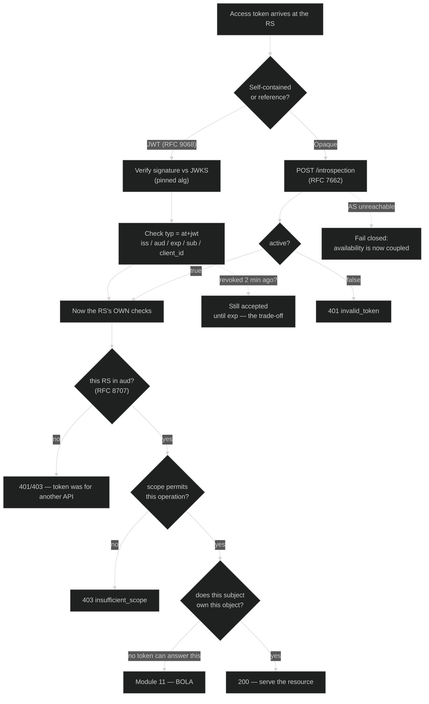

# Module 04 — Token Lifecycle + Metadata

**The short version:** you can now get a token safely into any kind of client. This module is about
everything that happens *after*: what the token means to the resource server that receives it, how the RS
decides whether to honour it, how anyone kills it early, how a token gets restricted to one API instead of
all of them, and how clients and resource servers discover all of this without a human wiring up config.
The organising question is the one Module 02 left hanging when your access token turned out to be **opaque**:
*given this string, what is a resource server supposed to do?*

## Prerequisites

- **[Module 02](../02-oauth-core-and-threats/)** — you obtained an opaque access token and could not read it.
- **[Module 03](../03-pkce-and-public-clients/)** — public clients, since several endpoints here behave
  differently depending on whether the caller can authenticate.
- **[Module 00](../00-web-and-jose-foundations/)** — decode ≠ verify, which is the whole of the JWT
  access-token section.

## Why this module exists

Two designs, one decision, and almost every operational property of your deployment follows from it.

A resource server holds a string and must answer: *is this valid, who is it for, and what may it do?* There
are exactly two ways to find out. Either the token **carries** the answer — a signed JWT the RS validates
locally — or the token is a **reference** and the RS asks the authorization server. That is the
self-contained-versus-reference choice, and it is a genuine trade-off rather than a best practice with one
right answer.

A **JWT access token** (RFC 9068) is fast: the RS verifies a signature against the AS's JWKS and reads the
claims, with no network call, so it scales horizontally and survives the AS being briefly unreachable. The
price is that it is *stale by construction*. Between issuance and expiry, the RS's view of the token is
frozen. Revoke it and the RS will not notice until it expires. That is the whole reason short lifetimes are
the standard companion to JWT access tokens — you are choosing how long a revoked token stays useful.

An **opaque token** with **introspection** (RFC 7662) is the mirror image: the RS asks the AS on every
request, so revocation is instant and the answer is always current, at the cost of a network round trip in
the hot path and a hard dependency on the AS being up. The server in this repo issues opaque tokens, which is
why the token you decoded in Module 02 had no structure. It was not a broken JWT; it was a database key.

Then there is a question people skip: **what is this token good for?** By default, a token is often accepted
by every API that trusts the issuer, which means a token you obtained for a low-value service can be replayed
against a high-value one — the confused-deputy problem from Module 01, at token scale. `resource` (RFC 8707)
is the fix: the client says which API it intends to call, and the AS audience-restricts the token to it. You
will do this in the lab and watch `aud` appear.

Revocation (RFC 7009) is what turns "the user withdrew consent" or "we were breached" from a statement into
an action. And it has a subtlety worth internalising early: the revocation endpoint returns **200 for a token
it has never seen**. That looks wrong until you see why — a non-200 would turn the endpoint into an oracle
that tells an attacker which of a pile of stolen strings are real tokens.

Finally, **metadata**. Everything above involves endpoint URLs, supported algorithms, and capabilities that
would otherwise be hand-copied into config files and go stale. RFC 8414 lets a client discover the
authorization server; RFC 9728 lets a client discover the *resource server* — which matters more than it
sounds, because it is how a client learns *which* AS protects an API it has never seen before. RFC 7591/7592
let a client register itself without a human in the loop.

The thread through all of it: **a token is not a fact about the world, it is a statement by an issuer, and
every party downstream needs a way to check that statement, bound it, and cancel it.**

## Learning objectives

After this module you can:

1. Choose between JWT and opaque access tokens for a given architecture and defend the choice on latency,
   revocation lag, and availability.
2. Introspect a token (RFC 7662), read every response member, and explain what `active: true` actually
   asserts.
3. Explain why introspection returns `200 {"active": false}` rather than a 4xx for garbage input, and why the
   introspection endpoint **must** be protected.
4. Revoke a token (RFC 7009) and explain why revoking an unknown token also returns 200.
5. State the required claims and the `typ` header value of an RFC 9068 JWT access token.
6. Audience-restrict a token with `resource` (RFC 8707), state the two constraints on its value, and name the
   error returned when it is bad.
7. Distinguish the three metadata documents — AS metadata (RFC 8414), OP discovery (OIDC Discovery), and
   protected-resource metadata (RFC 9728) — and say who consumes each.
8. Detect a metadata endpoint that *appears* to exist but does not, without trusting the status code.
9. Describe the DCR lifecycle (RFC 7591/7592) and what the registration access token is for.

## Plain-language pass (no spec vocabulary)

The hotel again, but now think about the **door**, not the desk.

- A **smart card with the details printed on it and the manager's signature across the front** — room 412,
  valid until Tuesday. The door reads it, checks the signature, and opens. Fast, works even if the front desk
  phone is down. But if you cancel the card on Monday, the door has no way to know: it just sees a valid
  signature and a date that has not passed. *That is a JWT access token.*
- A **plain numbered fob**. The door reads the number and phones the desk: "is 4471 still good, and for
  what?" Always current — cancel it and the very next tap fails — but every entry now depends on the phone
  line. *That is an opaque token plus introspection.*
- **"Room 412 only."** A card that opens every door in the building is a liability, and a card that opens one
  is not. Saying which door up front is *audience restriction*.
- **Cancelling a card.** You call the desk and it is dead. Notice what the desk says if you read out a number
  that was never issued: *"Done."* Not "that card doesn't exist" — because a desk that distinguishes the two
  is a free card-number-checking service for anyone with a list of guesses.
- **The directory in the lobby** lists which desk handles what, and the plaque beside each door says which
  desk issues cards for it. Without the plaque, a card-holder standing at an unfamiliar door has no idea who
  to ask. *That is metadata — and the plaque beside the door is the piece most deployments forget.*

## Specification pass (exact terminology) + the bridge

| Plain-language element | Formal concept | Defining reference |
|---|---|---|
| Signed card the door reads itself | **JWT access token**, `typ: at+jwt` | RFC 9068 |
| Numbered fob + phone call | **Opaque token + introspection** | RFC 7662 |
| "Is 4471 still good?" | `POST /introspect` → `{"active": …}` | RFC 7662 §2.1, §2.2 |
| Cancelling a card | **Revocation** | RFC 7009 §2.1, §2.2 |
| "Done" for a number never issued | 200 for an unknown token | RFC 7009 §2.2 |
| "Room 412 only" | **`resource` parameter** → `aud` | RFC 8707 §2 |
| Lobby directory | **AS metadata** `/.well-known/oauth-authorization-server` | RFC 8414 |
| Plaque beside the door | **Protected resource metadata** `/.well-known/oauth-protected-resource` | RFC 9728 §3 |
| Issuing a card to a new contractor, no paperwork | **Dynamic Client Registration** | RFC 7591 / RFC 7592 |

### Introspection — RFC 7662 (Standards Track, October 2015)

The RS POSTs `token` (and optionally `token_type_hint`) form-encoded, and gets JSON back. The only required
member is `active`; the optional ones are `scope`, `client_id`, `username`, `token_type`, `exp`, `iat`, `nbf`,
`sub`, `aud`, `iss`, `jti`.

What `active: true` means, verbatim: *"a 'true' value return for the 'active' property will generally
indicate that a given token has been issued by this authorization server, has not been revoked by the resource
owner, and is within its given time window of validity."*

Two rules that look odd until you understand them:

- **Not-active is not an error.** §2.2: *"If the introspection call is properly authorized but the token is
  not active, does not exist on this server, or the protected resource is not allowed to introspect this
  particular token, then the authorization server MUST return an introspection response with the 'active'
  field set to 'false'."* You get `200 {"active": false}` — the same shape for expired, revoked, and
  never-existed. Deliberately indistinguishable.
- **The endpoint must be protected.** §2.1: *"To prevent token scanning attacks, the endpoint MUST also
  require some form of authorization to access this endpoint, such as client authentication as described in
  OAuth 2.0 [RFC6749] or a separate OAuth 2.0 access token."* An open introspection endpoint lets anyone test
  stolen or guessed strings for free. **The endpoint in this repo does not enforce this** — you will confirm
  that in the lab, and it is the module's Tier-3 finding.

### Revocation — RFC 7009 (Standards Track, August 2013)

The client POSTs `token` and optionally `token_type_hint`, with client authentication. §2.2: *"The
authorization server responds with HTTP status code 200 if the token has been revoked successfully **or if
the client submitted an invalid token**"* — because *"invalid tokens do not cause an error response since the
client cannot handle such an error in a reasonable way."* Same anti-oracle reasoning as introspection.

Cascade: when a refresh token is revoked, *"the authorization server SHOULD also invalidate all access tokens
based on the same authorization grant"* — SHOULD, not MUST, so verify it rather than assume it.

### JWT access tokens — RFC 9068 (Standards Track, October 2021)

The `typ` header must be `at+jwt`: *"JWT access tokens MUST include this media type in the 'typ' header
parameter to explicitly declare that the JWT represents an access token complying with this profile."* (§2.1)

Required claims (§2.2): **`iss`, `exp`, `aud`, `sub`, `client_id`, `iat`, `jti`**. Note `client_id` — an RS can
attribute the call to an application, not just a user, which is the audit property from Module 01 made
concrete. And note `jti`, which is what lets you build a revocation list if you need one.

Why `typ: at+jwt` matters beyond tidiness: it stops **token confusion**, where an RS is handed an *ID token*
(also a signed JWT from the same issuer, also containing `sub` and `aud`) and accepts it as an access token.
Checking `typ` is a cheap, decisive defence — and Module 08 will show you why an ID token in that position is
a real bug rather than a curiosity.

> **This deployment issues opaque access tokens**, so you cannot produce an `at+jwt` here without changing the
> Authlete service's access-token signing configuration. That is why introspection carries the lab.

### Audience restriction — `resource`, RFC 8707 (Standards Track, February 2020)

*"Indicates the target service or resource to which access is being requested."* Two hard constraints (§2):
*"Its value MUST be an absolute URI… The URI MUST NOT include a fragment component."* It *"MAY"* appear
multiple times for multi-resource tokens. The AS *"SHOULD audience-restrict issued access tokens to the
resource(s) indicated by the 'resource' parameter,"* communicated via the `aud` claim. A bad value gets
`invalid_target`: *"The requested resource is invalid, missing, unknown, or malformed."*

Both constraints are enforced here, with distinct errors — you will trip each one deliberately.

### The three metadata documents — who consumes what

This is the part people conflate, so hold the distinction:

| Document | Path | Spec | Answers | Consumed by |
|---|---|---|---|---|
| **AS metadata** | `/.well-known/oauth-authorization-server` | RFC 8414 | "Where are this AS's endpoints and what does it support?" | **clients** |
| **OP discovery** | `/.well-known/openid-configuration` | OIDC Discovery 1.0 | the same, plus OIDC-specific fields | **clients / RPs** |
| **Protected resource metadata** | `/.well-known/oauth-protected-resource` | RFC 9728 (April 2025) | "Which AS protects *this API*, and what is its resource identifier?" | **clients**, before they know where to get a token |

RFC 9728's only REQUIRED field is `resource` — *"The protected resource's resource identifier."* It closes a
real gap: without it, a client that discovers an API has no standard way to learn which authorization server
to ask, so the answer gets hardcoded. A resource server *"MAY use the WWW-Authenticate HTTP response header
field… to return a URL to its protected resource metadata to the client,"* which makes discovery work from a
bare 401.

> **Served here since 2026-07-28.** `GET /.well-known/oauth-protected-resource` at true root returns a real
> RFC 9728 document (`Content-Type: application/json`), built from the live discovery document so its
> `authorization_servers` and `scopes_supported` cannot drift. See
> `server/src/routes/protected-resource-metadata.routes.ts`.
>
> This module originally recorded it as a gap and used it to teach a detection skill — *never conclude an
> endpoint exists from a status code alone*, because the SPA's catch-all answers **HTTP 200 with HTML** for
> any unmatched path. **That skill is still the point, and the lab still teaches it** — using a path that is
> genuinely absent. Keep the habit; the example moved.

### Dynamic Client Registration — RFC 7591 / RFC 7592 (July 2015)

> **These two RFCs do not have the same status, and it matters.** RFC 7591 (registration) is **Standards
> Track**. RFC 7592 (the management lifecycle) is **Experimental** — its own header says *"not an Internet
> Standards Track specification."* That is the reason an authorization server may implement `register` and
> not `get`/`update`/`delete`, and why the registration access token is the least portable artefact in the
> DCR story. In a review, cite them separately and do not assume a server that does one does the other.

RFC 7591 is registration; RFC 7592 is the management lifecycle. A client POSTs metadata and receives a
`client_id`, optionally a `client_secret`, a **`registration_access_token`**, and a
`registration_client_uri`. That token is the credential for reading, updating, and deleting *its own*
registration — a neat example of a capability scoped to exactly one object.

Why it matters for security review: DCR turns client registration into an API, so the interesting questions
become *who may call it*, *what metadata is honoured*, and *what happens on conflict*. This repo requires
admin Basic auth on `register` — a deliberate choice, since open registration is only appropriate in
ecosystems built for it. `AGENTS.md` flags two related settings: `dcrScopeUsedAsRequestable` (honour the
`scope` metadata to restrict the client, per RFC 7591) and `unauthorizedOnClientConfigSupported` (return a
proper 401 for a non-existent registration, per RFC 7592).

> **Not enabled on this service.** Registration currently returns *"[A206201] Service does not support dynamic
> client registration."* Enable dynamic client registration in the Authlete console to run the DCR exercise;
> the rest of the lab does not depend on it.

## Assigned reading

| Read | For |
|---|---|
| [`docs/API.md`](../../../API.md) — "OAuth Core" and "OIDC & Discovery" | The exact bodies for `/api/introspection`, `/api/introspection/standard`, and `/api/revocation`, and the `/api`-prefix quirk on discovery |
| [`docs/API.md`](../../../API.md) — "Dynamic Client Registration" | The four DCR endpoints and which of them need admin auth |

**The delta this module adds:** `API.md` is a reference — it tells you the shape of each call. It does not
tell you *when to choose introspection over a JWT*, why a "not found" answer is deliberately
indistinguishable from "expired", what audience restriction is defending against, or which of the three
metadata documents a given consumer needs. That reasoning is here.

## Where this lives in the code

- **`server/src/routes/introspection.routes.ts`** — two endpoints. `/api/introspection` returns Authlete's
  rich object (`existent`, `usable`, `sufficient`, `refreshable`, `scopes`, `grantType`, `consentedClaims`);
  `/api/introspection/standard` returns the RFC 7662 shape. Compare the two responses in the lab — the split
  between "what the spec standardises" and "what a real AS actually knows" is instructive.
- **`server/src/controllers/introspection.controller.ts`** — around line 47 it parses Authlete's
  `WWW-Authenticate` for `insufficient_user_authentication` and returns the RFC 9470 step-up challenge. That
  is Module 09a; note it and move on.
- **`server/src/routes/revocation.routes.ts`** / **`revocation.service.ts`** — RFC 7009.
- **`server/src/routes/oauth-as-metadata.routes.ts`** — RFC 8414 at **true root**.
  **`server/src/routes/discovery.routes.ts`** — OIDC discovery under **`/api`**. Two different paths, and
  copy-pasting the wrong one is a classic time sink.
- **`server/src/routes/dcr.routes.ts`** / **`dcr.service.ts`** — the four DCR operations.
- **`server/src/routes/protected-resource-metadata.routes.ts`** + its controller — RFC 9728 at **true root**,
  mounted in `app.ts` beside `oauthAsMetadataRoutes`. Confirm with
  `grep -rn "oauth-protected-resource" server/src/` (three hits). Read the controller: it derives `resource`,
  `authorization_servers`, `scopes_supported` and `dpop_signing_alg_values_supported` from the live discovery
  document rather than from static config, and returns **500 rather than a document missing the sole REQUIRED
  member** — a small, worth-copying example of failing closed on a metadata endpoint.
- **Dashboard:** **Token Operations** (introspect/revoke), **Discovery**, **Dynamic Client Registration**.

## Wire-level walkthrough

The resource server's side of the story, which you have not seen yet.

```http
# 1. The client calls the API with the token it obtained in Module 02/03.
GET /orders/42 HTTP/1.1
Authorization: Bearer <43-character opaque string>

# 2. The RS cannot read it, so it asks the AS. (RFC 7662 §2.1)
POST /api/introspection/standard HTTP/1.1
Content-Type: application/x-www-form-urlencoded
Authorization: Basic <the RS's OWN credentials — see the note below>

token=<43-character opaque string>&token_type_hint=access_token

# 3. The AS answers. (RFC 7662 §2.2)
HTTP/1.1 200 OK
{"active":true,"scope":"profile","client_id":"…","token_type":"Bearer",
 "exp":1785242182,"sub":"admin","aud":["https://api.example.com/orders"],
 "iss":"https://…","auth_time":1785155781,"acr":"pwd"}

# 4. The RS now makes THREE decisions, and skipping any of them is a bug:
#    a. active === true?                      → else 401 invalid_token
#    b. is THIS server in `aud`?              → else 401/403; the token was for someone else
#    c. does `scope` permit THIS operation?   → else 403 insufficient_scope
#    …and then, separately, does this SUBJECT own object 42? (Module 11 — no token answers that.)

# 5. Later: the user disconnects the app. The client revokes. (RFC 7009 §2.1)
POST /api/revocation HTTP/1.1
Content-Type: application/x-www-form-urlencoded

token=<the same string>&client_id=…
→ HTTP/1.1 200

# 6. The very next introspection reflects it — no waiting for expiry.
{"active":false}
```

**What just happened?** Step 4 is the part worth memorising: `active: true` is necessary and nowhere near
sufficient. A valid token issued for a different audience, or carrying a different scope, is still `active`.
Every one of those checks is the RS's job, and RFC 7662 does not perform them for you — it hands you the facts
and leaves the policy to you.

Contrast with a JWT access token, where steps 2–3 are replaced by local signature verification against the
JWKS and step 6 does not work at all until the token expires.

## Diagram



Both branches converge on the same three checks. The choice of token format changes *how* you learn the facts
and *how fast revocation propagates* — it does not reduce the authorization work.

## Lab

See **[lab.md](lab.md)**. You will introspect a live token through both endpoints and compare what each
returns; revoke it and watch `active` flip; probe the two anti-oracle behaviours; audience-restrict a token
with `resource` and watch `aud` appear; trip both RFC 8707 validation rules; compare the AS-metadata and
OIDC-discovery documents; and prove that a `/.well-known/` path you invented **does not exist despite
returning HTTP 200**, using three signals that are not the status code.

## Source change — serving RFC 9728 (done)

> **Status: implemented on 2026-07-28**, and the rest of this module has been updated to match. This was a
> gated proposal; it was approved and built. Kept here as a worked example of scoping a source change: what
> to add, where to mount it, what it must fail closed on, and how it was verified.

**What:** add `server/src/routes/protected-resource-metadata.routes.ts` plus a small controller, mounted at
true root in `app.ts` next to `oauthAsMetadataRoutes`, serving:

```json
{
  "resource": "<the resource identifier, from config>",
  "authorization_servers": ["<issuer>"],
  "scopes_supported": ["…"],
  "bearer_methods_supported": ["header"]
}
```

**Why:** RFC 9728 became a published RFC in April 2025 and is how a client discovers which AS protects an API.
The client side already consumes PRM for the Model Context Protocol's OAuth profile
(`client/src/services/mcp.service.ts` — MCP is not taught in this curriculum; it is the unfamiliar extension
you are handed in [Module 09a's Q20](../09a-interaction-extensions/quiz.md)), so the repo teaches a
document it cannot serve. It is also the smallest possible fix for the 200-OK-HTML trap: a real route makes
the endpoint honest.

**Cost and risk:** one route, one controller, one config value, one unit test; no change to any existing
endpoint; additive only. The main decision is what `resource` should be for this deployment, since this server
is primarily an AS and only stands in for an RS via UserInfo and introspection.

**The decision taken:** approved and built. The lab's detection exercise now uses an invented path as its
negative control, which teaches the same skill against a target that cannot silently stop being absent — a
better exercise, arrived at by accident. Nothing else in the curriculum depends on PRM being served.

## Threat notes — what breaks if you get this wrong

- **Unprotected introspection endpoint.** RFC 7662 §2.1 requires authorization. Without it, anyone can test
  arbitrary strings and learn which are live tokens, plus harvest `sub`, `scope`, and `client_id` for the ones
  that are. **This repo's endpoint is currently open** — the lab confirms it.
- **Distinguishable "unknown token" responses.** If revocation 404s on unknown tokens while 200-ing on real
  ones, it becomes a token-validity oracle. Both specs return the same answer on purpose.
- **Ignoring `aud`.** An RS that checks only `active` accepts tokens minted for any other API on the same
  issuer. That is cross-service replay, and it is the single most common introspection bug.
- **Treating `active: true` as authorization.** It is a validity statement, not a permission. Scope and
  ownership checks are separate and are still your job.
- **JWT access tokens with long lifetimes.** Revocation lag equals token lifetime. A one-hour JWT means a
  compromised token works for up to an hour after you revoke it.
- **Not checking `typ: at+jwt`.** Opens the door to accepting an ID token — or any other JWT from the same
  issuer — as an access token.
- **Trusting a metadata document fetched over a channel you did not verify**, or caching it forever. Endpoint
  URLs and keys rotate; a poisoned or stale document redirects your token requests.
- **Assuming an endpoint exists because it returned 200.** A SPA catch-all returns 200 with HTML for
  *anything*. Check the content type and the body.
- **Open DCR.** If anyone can register a client, anyone can pick their own `redirect_uris` and client
  metadata. Require authentication, or a software statement, unless you are deliberately building an open
  ecosystem.

## Spec delta

| Question | Answer |
|---|---|
| **What came before** | Modules 02–03 got a token into a client's hands. Nothing said what the token means to the receiver, how to cancel it, or what it is scoped to. |
| **What this adds** | RFC 7662 introspection (the reference-token answer, with its two anti-oracle rules); RFC 7009 revocation and its cascade SHOULD; RFC 9068's `at+jwt` profile and required claims (the self-contained answer); RFC 8707 `resource` → `aud` audience restriction; RFC 8414 AS metadata, OIDC Discovery, and RFC 9728 protected-resource metadata; RFC 7591/7592 programmatic client lifecycle. |
| **What it deprecates** | Hand-configured endpoint URLs; unbounded-audience tokens; treating `active: true` as an authorization decision. |
| **What remains unsolved (and where it's addressed)** | Every token here is still a **bearer** token — whoever holds it may spend it, and introspection cannot tell a thief from the rightful client → **Module 05 (DPoP/mTLS)**. Nothing protects the authorization *request* itself → **Module 05 (PAR/JAR)**. Grants with no user at all → **Module 06**. Whether this subject may touch *this object* → **Module 11**. |

## What to study next and why

Everything so far shares one assumption: possession is entitlement. A token is a bearer instrument, and every
mechanism in this module — introspection, revocation, audience restriction — takes that for granted. It shows
in the lab: introspection happily returns `active: true` no matter *who* is asking, because there is nothing
in the token tying it to a holder. **Module 05 — Request Integrity + Binding** attacks that assumption from
both ends: PAR and JAR protect the authorization request from tampering before it reaches the AS, and DPoP and
mTLS bind the token to a key its holder must prove possession of, so a stolen token stops being worth stealing.
