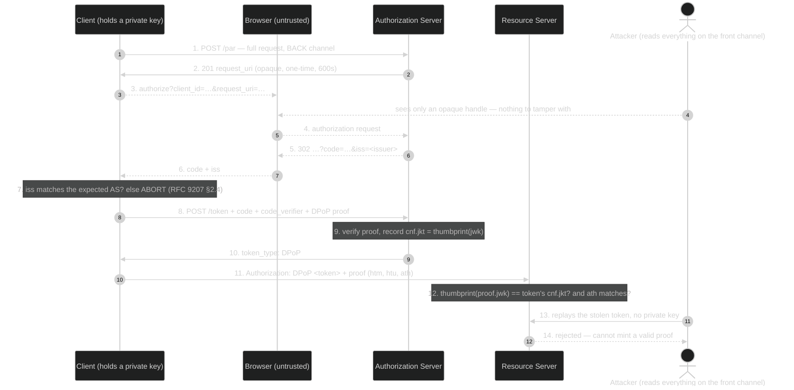

# Module 05 — Request Integrity + Binding

**The short version:** everything so far has left two assumptions unexamined. First, that the authorization
**request** arrives at the AS the way the client wrote it — it travels through the browser, so it does not
have to. Second, that whoever presents a **token** is entitled to it — bearer tokens make possession
sufficient, so a stolen token is as good as an earned one. This module closes both. PAR and JAR move the
request off the front channel or sign it; `iss` tells the client which AS actually answered; and DPoP and
mTLS bind the token to a key, so theft stops paying.

## Prerequisites

- **[Module 04](../04-token-lifecycle-and-metadata/)** — introspection, and the observation that it happily
  says `active: true` no matter who is asking.
- **[Module 03](../03-pkce-and-public-clients/)** — PKCE, which is the same commit-then-prove pattern applied
  to the code. DPoP is that pattern applied to the token.
- **[Module 00](../00-web-and-jose-foundations/)** — you build and break a JWS by hand in this lab.

## Why this module exists

Two unexamined assumptions, two families of defence.

**The request is not trustworthy.** A classic authorization request is a URL the client hands to the browser.
Module 00 established what that means: the user agent can read every parameter and rewrite any of them. So
`scope`, `redirect_uri`, `resource`, `claims` — everything the client asked for — is attacker-influenceable
before it reaches the AS. The AS's registered-redirect-URI check catches the crudest tampering, but not a
downgraded `scope`, a stripped `code_challenge` (Module 03's downgrade attack), or a swapped `resource`. And
as requests grow — rich authorization details, multiple resources, signed claims — they stop fitting
comfortably in a URL at all.

There are two ways to fix this and they compose. **PAR** (RFC 9126) moves the request itself to the back
channel: the client POSTs the parameters directly to the AS, gets a one-time opaque handle, and sends only
that handle through the browser. Nothing the user agent can read, nothing it can change. **JAR** (RFC 9101)
signs the request: the parameters travel inside a JWS, so tampering is detectable even when the object goes
through the front channel. PAR gives you confidentiality and integrity by removing the browser from the
conversation; JAR gives you integrity and non-repudiation while keeping it. FAPI 2.0 wants both.

**The response's origin is not obvious.** If a client talks to more than one authorization server — an
aggregator, a multi-tenant SaaS, anything with "log in with…" choices — then a code arriving at
`/callback` does not announce which AS issued it. That gap is the **mix-up attack**: an attacker induces the
client to send a code issued by an honest AS to the attacker's AS, or vice versa. `iss` (RFC 9207) closes it
by having the AS name itself in the response, and requiring the client to check.

**Possession is not entitlement.** This is the deeper one. Every token so far is a **bearer** token: the RS
checks that the string is valid, never that the presenter is the party it was issued to. Module 04 made this
visible — introspection returns the same `active: true` to the legitimate client and to a thief with the same
string. So every leak path becomes a full compromise: a log, a proxy, an XSS payload, a compromised RS
replaying tokens to another RS.

The fix is **sender-constraining**: bind the token to a key the legitimate holder controls, and require proof
of possession on every use. **DPoP** (RFC 9449) does it at the application layer with a per-request signed
JWT, which works for public clients and browsers. **mTLS** (RFC 8705) does it at the transport layer with a
client certificate, which is stronger and standard in high-assurance ecosystems but needs PKI. Notice the
pattern: this is PKCE's commit-then-prove idea again, moved from the code to the token — third time in this
curriculum, which is why it is worth naming as a pattern rather than memorising three mechanisms.

## Learning objectives

After this module you can:

1. Explain what PAR protects that a plain authorization request does not, and why the `request_uri` is safe
   to send through the browser.
2. Explain what JAR adds that PAR does not, and when you would want both.
3. Describe the **mix-up attack** and state exactly what `iss` requires of the AS and of the client.
4. Build a DPoP proof by hand — the three required header parameters, the four required claims, and the
   signature encoding — and explain what each element defends against.
5. Explain how a DPoP-bound token is tied to a key via `cnf.jkt`, and compute the thumbprint yourself.
6. State when the `ath` claim is required and which authentication scheme carries a DPoP-bound token.
7. Compare DPoP and mTLS on threat coverage, deployment cost, and where each is mandated.
8. Diagnose the three classic DPoP implementation bugs from their error messages.

## Plain-language pass (no spec vocabulary)

The hotel, last time — and now we fix the paperwork and the keys.

- **The order form goes through the guest.** Until now you wrote your request on a slip and handed it to the
  guest to carry to the desk. The guest can read it and edit it. **PAR** is phoning the order through
  directly and being given a numbered ticket: "order 4471." The guest carries only the number. Nothing to read,
  nothing to alter, and the number works exactly once.
- **JAR** is the alternative: still hand the slip to the guest, but seal it with your signet first. The guest
  can see it but any edit breaks the seal. Sometimes you want both — phone it through *and* seal it — because
  the seal also proves later that it was really you who ordered.
- **Which desk answered?** In a building with several front desks, a key card handed back to you says nothing
  about who issued it. **`iss`** is the desk stamping its own name on the envelope, and you checking it before
  you act.
- **The key card problem.** A key card is a bearer instrument: whoever holds it, the door opens. Drop it and
  the finder is you, as far as the building is concerned.
- **The fix** is a card that only works when the holder also produces a matching signature at the door, fresh
  each time. The desk records your signet's fingerprint on the card. The door checks the card, then checks
  that the signature you just made matches that fingerprint, and that you signed *this door, right now, for
  this card*. A dropped card is now worthless. *That is DPoP.* **mTLS** is the same idea using the building's
  own ID-card reader instead of a handwritten signature — harder to set up, harder to fake.

The rule: **stop asking "is this token real?" and start asking "is this token real *and* held by the party it
was issued to?"**

## Specification pass (exact terminology) + the bridge

| Plain-language element | Formal concept | Defining reference |
|---|---|---|
| Phoning the order through | **Pushed Authorization Request** | RFC 9126 §2 |
| The numbered ticket | **`request_uri`**, one-time, short-lived | RFC 9126 §2.2, §4 |
| Sealing the slip | **JWT-Secured Authorization Request** | RFC 9101 |
| The seal itself | Request object signed as a JWS | RFC 9101 §10.1 |
| The desk stamping its name | **`iss` authorization response parameter** | RFC 9207 §2 |
| Card + fresh signature | **DPoP proof** (`typ: dpop+jwt`) | RFC 9449 §4.2 |
| The signet fingerprint on the card | **`cnf.jkt`** — JWK SHA-256 thumbprint | RFC 9449 §6.1, thumbprint per RFC 7638 |
| "This door, right now, this card" | `htm`, `htu`, `iat`, `jti`, `ath` | RFC 9449 §4.2, §7 |
| The building's ID-card reader | **mTLS client certificate** | RFC 8705 §2.1, §2.2 |
| Fingerprint of that ID card | **`cnf["x5t#S256"]`** | RFC 8705 §3 |

### PAR — RFC 9126 (Standards Track, September 2021)

The client POSTs the authorization parameters to the PAR endpoint, authenticating exactly as it would at the
token endpoint: *"The rules for client authentication as defined in [RFC6749] for token endpoint requests,
including the applicable authentication methods, apply for the PAR endpoint as well."* On success the AS
*"MUST generate a request URI and provide it in the response with a '201' HTTP status code"* (§2.2). The
handle must be unguessable — *"The 'request_uri' value MUST contain some part generated using a
cryptographically strong pseudorandom algorithm such that it is computationally infeasible to predict or guess
a valid value"* — and bound to its client: *"The 'request_uri' value MUST be bound to the client that posted
the authorization request."* Lifetimes are short, *"typically… between 5 and 600 seconds."*

It is single-use, and §4 says why: *"Since parts of the authorization request content, e.g., the
'code_challenge' parameter value, are unique to a particular authorization request, the client MUST only use a
'request_uri' value once."* You will confirm this deployment enforces it.

What PAR buys you, concretely: the browser never sees `scope`, `redirect_uri`, `code_challenge`,
`resource`, or `claims`, so none of them can be read or downgraded in transit. It also authenticates the
client *before* the user is ever prompted, which means a bogus client cannot even render a consent screen.

### JAR — RFC 9101 (Standards Track, August 2021)

The parameters move inside a JWT passed as `request` (or referenced by `request_uri`). §10.1: the request
object *"MUST be either signed using JWS [RFC7515] or signed and then encrypted using JWS [RFC7515] and JWE
[RFC7516]."* §4: *"If signed, the Authorization Request Object SHOULD contain the Claims 'iss' (issuer) and
'aud' (audience)… The value of 'aud' should be the value of the authorization server (AS) 'issuer'."*

The rule that surprises people, §5: *"The authorization server supporting this specification MUST only use the
parameters included in the Request Object"* — even when the same parameter also appears in the query string.
The signed object wins outright; there is no merge. Get that wrong in a client and you will spend an afternoon
wondering why your query parameter is ignored.

On typing, §10.8 notes that existing deployments use untyped request objects but that *"requiring explicit
typing would be a good idea for new OAuth deployment profiles"* using `"typ": "oauth-authz-req+jwt"`.

**PAR or JAR?** PAR hides the request; JAR proves who wrote it. PAR needs no client signing key; JAR does. PAR
protects confidentiality *and* integrity by removing the browser; JAR protects integrity and adds
non-repudiation, which matters when a regulator may later ask what was requested. FAPI 2.0 uses PAR as the
baseline and adds JAR when message signing is required (Module 10).

### `iss` and mix-up — RFC 9207 (Standards Track, March 2022)

§2: *"The iss parameter value is the issuer identifier of the authorization server that created the
authorization response, as defined in [RFC8414]."* The AS side is unconditional: *"In authorization responses
to the client, including error responses, an authorization server supporting this specification MUST indicate
its identity by including the iss parameter in the response."* Note **including error responses** — you have
already seen that on every error redirect in Modules 02 and 04.

The client side, §2.4: *"Clients that support this specification MUST extract the value of the iss parameter
from authorization responses they receive if the parameter is present,"* and *"If the value does not match the
expected issuer identifier, clients MUST reject the authorization response and MUST NOT proceed with the
authorization grant."* Support is advertised as `authorization_response_iss_parameter_supported` (§3).

**The mix-up attack** (RFC 9700 §4.4) needs a client that talks to two or more authorization servers. The
attacker gets the client to start a flow with an honest AS while believing it is talking to the attacker's AS
(or the reverse), so the code or token ends up redeemed at the wrong place — leaking it to the attacker or
letting the attacker inject one. Without `iss`, the callback simply does not say who answered, and the client
has no way to notice. This is why the parameter is boring to implement and vital to check: `AGENTS.md`
recommends `issSuppressed = false` precisely so it is always emitted.

### DPoP — RFC 9449 (Standards Track, September 2023)

A **DPoP proof** is a JWS the client mints fresh for each request. §4.2 requires the JOSE header to carry
*"at least the following parameters: typ, alg, and jwk"*, where `typ` is `dpop+jwt` and the `jwk` *"MUST NOT
contain a private key."* The payload carries `jti` (unique id, for replay detection), `htm` (the HTTP method),
`htu` (the target URI without query or fragment), and `iat`.

Read those four claims as answers to "what is this proof *for*": `htm`+`htu` bind it to one endpoint so a
proof captured at one endpoint cannot be replayed at another; `iat` bounds its age; `jti` lets the server
detect replay within that window.

The AS records the key's thumbprint on the token. §6.1: *"jkt: JWK SHA-256 Thumbprint confirmation method.
The value of the jkt member MUST be the base64url encoding… of the JWK SHA-256 Thumbprint… of the DPoP public
key (in JWK format) to which the access token is bound."* The thumbprint algorithm is RFC 7638 — Module 00's
last JOSE row, finally used. In the lab you compute it yourself and match it against what introspection
reports.

At the resource server, two more requirements. §7: *"Requests to DPoP-protected resources MUST include both a
DPoP proof as per Section 4 and the access token as described in Section 7.1. The DPoP proof MUST include the
ath claim with a valid hash of the associated access token."* And §7.1: the token *"is sent using the
Authorization request header field… with an authentication scheme of DPoP"* — *"The scheme name is DPoP."*
Not `Bearer`.

`ath` is defined in §4.2: *"Hash of the access token. The value MUST be the result of a base64url encoding
(as defined in Section 2 of [RFC7515]) the SHA-256 [SHS] hash of the ASCII encoding of the associated access
token's value."* It is what stops a proof made for one token being reused with another.

**Three implementation bugs, all documented in `AGENTS.md`, all reproducible in the lab:**

| Bug | Symptom | Rule |
|---|---|---|
| ES256 signature DER-encoded instead of raw `R‖S` | `Signed JWT rejected: Invalid signature` | JWS ES256 is a 64-byte raw P1363 concatenation, not DER |
| `sub` in the proof instead of `ath` | binding ignored or rejected | RFC 9449 §4.2/§7 — the claim is `ath` |
| `kid` in the header but no `jwk` | *"The DPoP header did not include a public key in JWK format."* | §4.2 requires `jwk`; the server has never seen this ephemeral key |

### mTLS — RFC 8705 (Standards Track, February 2020)

Two client-authentication methods: **`tls_client_auth`** (§2.1, PKI — the certificate chains to a CA the AS
trusts and a registered subject matches) and **`self_signed_tls_client_auth`** (§2.2 — the AS holds the
client's certificate or its JWKS). Both authenticate the client at the token endpoint using the TLS handshake
rather than a shared secret.

§3 defines **certificate-bound access tokens**. The confirmation member is `x5t#S256`: *"The value of the
'x5t#S256' member is a base64url-encoded SHA-256 hash of the DER encoding of the X.509 certificate."* The
resource server's obligation is blunt: *"The protected resource MUST obtain, from its TLS implementation
layer, the client certificate used for mutual TLS and MUST verify that the certificate matches the certificate
associated with the access token."*

**DPoP vs mTLS:**

| | DPoP (RFC 9449) | mTLS (RFC 8705) |
|---|---|---|
| Layer | application | transport |
| Key management | ephemeral, client-generated, no registration | X.509 certificates, PKI or registered self-signed |
| Works for browsers / public clients | **Yes** | Rarely — browsers make client certs painful |
| Survives a TLS-terminating proxy | Yes, if the proxy forwards headers | Only if the proxy forwards the cert correctly (RFC 9700 §4.13) |
| Confirmation claim | `cnf.jkt` | `cnf["x5t#S256"]` |
| Typical mandate | FAPI 2.0 accepts either | FAPI 2.0 accepts either; open banking often requires mTLS |
| Cost | a signature per request | PKI, certificate lifecycle, infrastructure |

Both satisfy the same requirement — the sender-constraining branch of RFC 9700 §2.2.2 from Module 03. Choose
on ecosystem and infrastructure, not on strength alone.

> **mTLS is not implemented in this repo** — only client-registration flags and passthrough certificate
> fields. A proposal to add it is at the end of this module. Nothing in the lab depends on it.

## Assigned reading

| Read | For |
|---|---|
| [`docs/PAR-TUTORIAL.md`](../../../PAR-TUTORIAL.md) | The PAR endpoint end to end as this server implements it, including the `client_secret`-inside-`parameters` quirk |
| [`docs/FAPI-TUTORIAL.md`](../../../FAPI-TUTORIAL.md) — the DPoP sections | DPoP proof construction, the nonce flow, and the repo's DPoP key tools |

**The delta this module adds:** both tutorials show you how to *use* the mechanisms. Neither explains why the
authorization request needed protecting in the first place, what distinguishes PAR from JAR when you already
have one, what mix-up is, or why sender-constraining is the same idea as PKCE one level up. And neither
compares DPoP with mTLS as a design decision. That is what is here.

## Where this lives in the code

- **`client/src/services/dpop.service.ts`** — the reference implementation, and the best file in the repo for
  reading a JWS being built by hand. Line ~89 sets the `jwk` header member; ~81–83 computes `ath`; ~95–101
  handles the raw P1363 signature. Every one of the three bugs above is a comment away.
- **`server/src/services/par.service.ts`** — note lines ~29–34: for `client_secret_post` clients the secret is
  merged **into the `parameters` string**, not sent as a separate field. That is Authlete's PAR API contract,
  not RFC 9126, and it is exactly the kind of vendor detail worth labelling.
- **`server/src/services/token.service.ts`** (~line 74) and **`par.service.ts`** — both read the `DPoP` header
  and pass `dpop`, `htm`, `htu` to Authlete. Note the server computes `htu` from its own `Host` header.
- **`server/src/utils/dpop.ts`** — relays Authlete's `DPoP-Nonce` to the client.
- **`server/src/routes/jar.routes.ts`** → `POST /api/jar/process`.
- **`server/src/services/userinfo.service.ts:21`** — `authHeader.replace("Bearer ", "")`. Read that line
  carefully against RFC 9449 §7.1 and predict what happens with `Authorization: DPoP <token>`. The lab
  confirms it; it is this module's Tier-3 finding.

## Wire-level walkthrough

A hardened flow: PAR + PKCE + DPoP, with `iss` checked on the way back.

```http
# 1. BACK CHANNEL. The client pushes the whole request. The browser is not involved.
POST /api/par HTTP/1.1
Content-Type: application/json
{"parameters":"response_type=code&client_id=…&redirect_uri=…&scope=profile&state=PAR1
               &code_challenge=…&code_challenge_method=S256","clientId":"…"}

HTTP/1.1 201 Created
{"expires_in":600,"request_uri":"urn:ietf:params:oauth:request_uri:-4PVrsTAHrY…"}

# 2. FRONT CHANNEL. Only two parameters cross the browser. Nothing to read, nothing to tamper with.
GET /api/authorization?client_id=…&request_uri=urn%3Aietf%3Aparams%3Aoauth%3Arequest_uri%3A… HTTP/1.1

# 3-4. The user authenticates and consents on the AS's pages.

# 5. FRONT CHANNEL. The response names its issuer.
HTTP/1.1 302 Found
Location: http://localhost:3001/callback?state=PAR1&code=…&iss=https%3A%2F%2Fblackadi.dev
#                                                            ^^^ RFC 9207 — the client MUST check this

# 6. BACK CHANNEL. A DPoP proof accompanies the exchange, binding the token to a fresh key.
POST /api/token HTTP/1.1
DPoP: eyJ0eXAiOiJkcG9wK2p3dCIsImFsZyI6IkVTMjU2IiwiandrIjp7Imt0eSI6IkVDIiwiY3J2IjoiUC0yNTYiLCJ4IjoiLi4uIn19.
      eyJqdGkiOiIuLi4iLCJodG0iOiJQT1NUIiwiaHR1IjoiaHR0cDovL2xvY2FsaG9zdDozMDAwL2FwaS90b2tlbiIsImlhdCI6MTc4NX0.
      <64-byte raw R‖S signature, base64url>
Content-Type: application/x-www-form-urlencoded

grant_type=authorization_code&code=…&redirect_uri=…&client_id=…&code_verifier=…

# 7. The token type changes, and the token is now bound to that key.
HTTP/1.1 200 OK
{"access_token":"…","token_type":"DPoP","expires_in":86400,"scope":"profile","refresh_token":"…"}

# 8. Introspection shows the binding.
{"active":true,…,"token_type":"DPoP","cnf":{"jkt":"2epgSlEy6ySL2qJgiS4uKUXwQ6tebcZkaP5umYm4u5w"}}

# 9. At the resource server the scheme changes too, and the proof must carry `ath`. (§7, §7.1)
GET /orders/42 HTTP/1.1
Authorization: DPoP <access token>          # NOT Bearer
DPoP: <fresh proof: htm=GET, htu=…/orders/42, ath=base64url(SHA-256(access token))>
```

**What just happened?** Compare with Module 02's flow. Step 2 now carries two opaque values instead of a
readable request. Step 5 identifies its author. Steps 6–9 mean that copying the token out of a log gets you
nothing: without the private key you cannot mint a proof for step 9, and the `cnf.jkt` on the token says which
key that must be.

## Diagram



Step 13 is the point of the whole module. In Modules 02–04 that arrow succeeds.

## Lab

See **[lab.md](lab.md)**. You will run a full PAR flow and prove the `request_uri` is single-use; watch the AS
reject an unsigned JAR request object; find `iss` in every response including errors; build a DPoP proof by
hand and obtain a `token_type: DPoP` token; **compute the RFC 7638 thumbprint yourself and match it against
`cnf.jkt`**; then break the proof four ways — DER signature, missing `jwk`, wrong `htu`, and correct — and
finally discover why a DPoP-bound token cannot be spent at this server's resource endpoint.

## Decision record — mTLS was considered and declined (2026-07-28)

> **Status: declined, with reasons.** This was a gated proposal. It was investigated properly and turned
> down — not deferred. If the conditions below change it should be revisited, and the analysis is kept here
> so nobody has to redo it.

**Why not, in one line: TLS is terminated before the request reaches this server, in every deployment of
this repo, so a client certificate can never arrive.**

The evidence, checked rather than assumed:

- `server/src/server.ts` does a plain `app.listen` — the process speaks **HTTP only** and has no TLS
  context to read a peer certificate from.
- `render.yaml` declares a `type: web` service, so the platform fronts it and terminates TLS. The dev
  issuer sits behind a tunnel that does the same.
- What is *not* the obstacle: the SDK is fine. `clientCertificate` is supported on `tokenrequest`,
  `pushedauthorizationrequest` and `introspectionrequest` alike, and the Authlete service already lists
  `TLS_CLIENT_AUTH` and `SELF_SIGNED_TLS_CLIENT_AUTH` in `supportedTokenAuthMethods`. The pass-through
  would have been mechanical. An earlier draft of this proposal implied the plumbing was the hard part;
  that was wrong.

So the honest options were a **dev-only, flag-gated** capability that could never run in production, or
nothing. A capability that only works on one machine, exercises one module, and must be maintained forever
lost on cost/benefit — particularly since **Module 10 already teaches mTLS against the specification and
the Authlete configuration surface**, clearly labelled as not-run-here, and DPoP (which *is* implemented
and verified end to end here) demonstrates the same sender-constraining idea.

**Revisit if any of these becomes true:** the deployment moves behind something that forwards the client
certificate (an ALB or nginx passing `x-amzn-mtls-clientcert` / `X-Client-Cert`, or Render gaining the
feature); an ecosystem this repo targets mandates FAPI 1.0 Advanced, which requires mTLS; or the teaching
goal changes to needing a hands-on mTLS lab specifically, in which case scope it as roughly a day —
local-CA script, second HTTPS listener behind an env flag, certificate pass-through on three service calls,
`cnf["x5t#S256"]` in introspection output, `mtls_endpoint_aliases` in discovery, plus flipping
`tlsClientCertificateBoundAccessTokens` on the service.

<details>
<summary>The original proposal, kept for reference</summary>


**What:** (1) a dev TLS listener that requests but does not require a client certificate, behind a
self-signed CA generated by a script under `docs/curriculum/scripts/`; (2) extraction of the presented
certificate and pass-through to Authlete's `clientCertificate` / `clientCertificatePath` parameters on the
token, PAR, and introspection calls; (3) surfacing `cnf["x5t#S256"]` in introspection output; (4) client
registration examples for `tls_client_auth` and `self_signed_tls_client_auth`.

**Why:** RFC 8705 is one of the two sender-constraining mechanisms and the one open-banking ecosystems
actually mandate. The repo currently has registration flags and passthrough fields but no working path, so
Module 10's FAPI material has to hand-wave exactly where it should be concrete.

**Cost and risk:** meaningfully larger than the RFC 9728 proposal. It touches the server bootstrap (a second
listener or a TLS-terminating config), adds certificate handling to three service calls, and needs a
documented local-CA workflow that works on Linux and macOS. It also introduces a second way to authenticate
clients, which means test coverage across both paths. My recommendation is to treat it as its own piece of
work rather than a curriculum side effect — and if you would rather not, Module 10 can teach mTLS against the
spec and the Authlete configuration surface, clearly labelled as not-run-here.

**Also outstanding from Module 04:** the RFC 9728 protected-resource-metadata route, still awaiting a
decision.

</details>

### And a bug worth fixing independently

`server/src/services/userinfo.service.ts:21` strips only the `Bearer ` prefix:

```ts
reqBody.token = authHeader.replace("Bearer ", "");
```

RFC 9449 §7.1 requires DPoP-bound tokens to be presented with the **`DPoP`** scheme. With
`Authorization: DPoP <token>` this code passes the literal string `"DPoP <token>"` to Authlete, which reports
`[A088302] The access token does not exist.` The effect is that **a DPoP-bound access token cannot be used at
this server's resource endpoint at all** — the token endpoint issues it, and the RS cannot accept it. The fix
is a one-line change to strip either scheme case-insensitively. I have not made it; it is server source, and
it makes an honest Tier-3 exercise. It is recorded in `PROGRESS.md`.

## Threat notes — what breaks if you get this wrong

- **Unprotected authorization request.** Scope downgrade, `resource` swapping, and PKCE stripping are all
  available to anything that can rewrite the URL. PAR removes the opportunity; JAR makes it detectable.
- **Reusable `request_uri`.** RFC 9126 §4 requires single use; a replayable handle reintroduces the
  request-fixation problems PAR was meant to remove.
- **Ignoring `iss`.** The client cannot tell which AS answered, which is the precondition for mix-up
  (RFC 9700 §4.4). The AS emitting it is not the control — the client *checking* it is.
- **Merging request-object and query parameters.** RFC 9101 §5 says the object wins outright. An AS that
  merges lets an attacker add parameters the signature never covered.
- **Bearer tokens everywhere.** Any leak is a full compromise. This is the baseline you are leaving behind.
- **DPoP proof not bound to the request.** Missing or unchecked `htm`/`htu` lets a proof captured at one
  endpoint be replayed at another; missing `ath` lets a proof be reused with a *different* token.
- **DPoP proof replay.** Without `jti` tracking and an `iat` window, a captured proof is reusable until it
  ages out.
- **Accepting `Bearer` for a DPoP-bound token.** Silently discards the binding — you have paid for
  sender-constraining and left the bearer path open. (The inverse of this repo's bug: here the DPoP scheme is
  rejected; the more dangerous production version accepts `Bearer` and never checks `cnf`.)
- **mTLS behind a terminating proxy.** If the proxy does not forward the client certificate faithfully, the
  binding silently degrades to nothing (RFC 9700 §4.13).

## Spec delta

| Question | Answer |
|---|---|
| **What came before** | Module 03 bound the *code* to the client instance; Module 04 gave the RS ways to validate and cancel a token. The request itself was still readable and rewritable, and the token was still bearer. |
| **What this adds** | RFC 9126 (PAR) — the request moves to the back channel behind a one-time handle. RFC 9101 (JAR) — the request is signed, and the object wins over query parameters. RFC 9207 — the response names its issuer, closing mix-up. RFC 9449 (DPoP) — per-request proof of possession, `cnf.jkt`, `ath`, and the `DPoP` scheme. RFC 8705 (mTLS) — transport-layer client authentication and `cnf["x5t#S256"]`. |
| **What it deprecates** | Unprotected authorization requests in any high-value deployment; bearer-only tokens where sender-constraining is available; clients that ignore `iss`. |
| **What remains unsolved (and where it's addressed)** | Grants where there is no user and no browser at all → **Module 06**. Consolidating every attack in Modules 02–06 into one catalogue → **Module 07**. Proving *who the user is* → **Module 08**. Profiles that make these mechanisms mandatory rather than optional → **Module 10**. And none of this answers whether the subject may touch a given object → **Module 11**. |

## What to study next and why

You have now hardened the interactive flow about as far as the specs go: the request is confidential and
integrity-protected, the response is attributable, and the token is useless to anyone but its holder. Every
one of those mechanisms assumed a human at a browser. **Module 06 — Machine + Delegated Grants** removes the
human: client credentials for services acting as themselves, JWT and SAML assertions for federated trust, and
token exchange for one service acting on behalf of another — where the central question stops being "did the
user consent?" and becomes "on whose authority is this service acting, and can the next service downstream
tell the difference between delegation and impersonation?"
