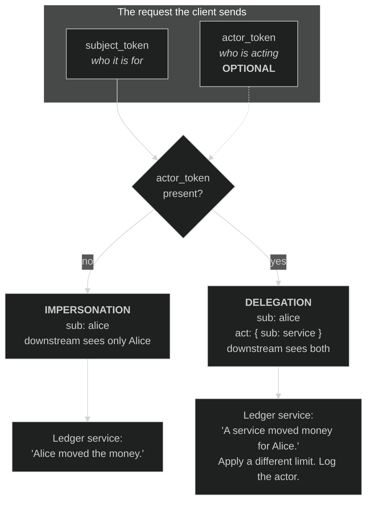

# Module 06 — Machine + Delegated Grants

**The short version:** every flow so far had a human in it. Remove the human and the central question
changes. It stops being *"did the user consent?"* and becomes *"on whose authority is this software acting,
and can the next service downstream tell the difference between a service acting **as itself**, a service
acting **as you**, and a service acting **for you**?"* Client credentials answers the first. Assertion grants
(RFC 7521/7522/7523) answer the second. Token exchange (RFC 8693) is supposed to answer the third — and this
is the module where you find out what happens when it doesn't.

## Prerequisites

- **[Module 02](../02-oauth-core-and-threats/)** — the grant catalogue, and the two axes it turns on:
  *is a human present?* and *can the client keep a secret?* This module lives entirely in the "no human"
  half of that table.
- **[Module 04](../04-token-lifecycle-and-metadata/)** — introspection is how you will read the identity out
  of every token in this lab, and `resource` → `aud` is the audience restriction you will watch fail to
  happen.

## Why this module exists

Take the user out of the picture and three different things can be meant by "this service is authorized."
They look similar on the wire and they are not remotely the same thing.

**A service acting as itself.** A nightly billing job calls the invoice API. There is no resource owner. There
is nothing to consent to, no browser, no redirect. The client *is* the principal. RFC 6749 §4.4's client
credentials grant covers exactly this case and nothing else — and note the constraint in the spec, which
matters more than it looks: *"The client credentials grant type MUST only be used by confidential clients."*
A public client has no secret to authenticate with, so there is no principal to authenticate.

The tell is in the token. A client-credentials access token **has no subject**. You will introspect one in the
lab and find `sub` simply absent. That absence is the whole semantics: nobody's data is being accessed on
anybody's behalf.

**A service asserting who someone is.** Now a trusted party wants to say "this is Alice" without Alice being
present — an enterprise IdP bridging into your AS, a CI system proving which pipeline it is, a partner
federating its users into your platform. RFC 7521 gives the general shape and RFC 7523 gives the JWT binding:
the client presents a **signed assertion** at the token endpoint and gets an access token. The assertion *is*
the authorization grant.

This is where the trust model quietly moves. In the authorization-code flow the AS establishes who the user is
by authenticating them. In an assertion grant the AS **takes someone's word for it**. RFC 7521 names the
parties precisely — the **Issuer** creates and signs the assertion, and *"the authorization server acts as a
relying party."* Relying. The security of every token minted this way rests on one question the spec pushes
onto the deployment: *which subjects is this issuer allowed to speak for?* Get that wrong and an assertion
grant is an identity-provider licence. You will demonstrate exactly that in the lab, in three commands.

**A service acting on behalf of someone else.** The user is long gone but their request is still travelling:
the API gateway calls the orders service, which calls the pricing service, which calls the ledger. Each hop
needs a token, each hop should get *less* authority than the last, and the ledger should be able to see who
actually initiated this. RFC 8693 token exchange is the mechanism — and its §1.1 draws the line the rest of
this module hangs on:

> **Impersonation:** *"When principal A impersonates principal B, A is given all the rights that B has within
> some defined rights context and is indistinguishable from B in that context."*
>
> **Delegation:** *"Principal A still has its own identity separate from B, and it is explicitly understood
> that while B may have delegated some of its rights to A, any actions taken are being taken by A representing
> B."*

Read the impersonation definition again and notice it is a *statement about what the downstream service can
see*: **indistinguishable**. Impersonation is not a weaker form of delegation. It is delegation with the audit
trail deleted. When the ledger service is asked to move money and the token says `sub: alice`, impersonation
means the ledger cannot know — not "does not bother to check", cannot know — whether Alice clicked a button or
a compromised pricing service made it up.

That is why this module is here. The first two grants are easy to get right and easy to over-trust. The third
is easy to get *subtly* wrong, and the failure mode is silent: a request that asked for delegation, answered
with impersonation, HTTP 200, no error.

## Plain-language pass (no spec vocabulary)

Three ways to sign something on someone else's behalf.

- **Client credentials** is a **company cheque**. The company is the account holder. It is not acting for
  anyone; it is spending its own money. Nobody asks whose behalf it is on, because the answer is "its own."
  Only a company that can keep its chequebook locked up gets one.
- **An assertion grant** is a **notarised letter**. A notary you already trust writes "the bearer is Alice"
  and stamps it. You accept it because you trust the notary, not because you checked Alice's face. The whole
  arrangement rests on the notary being honest *and* on it being clear which people this particular notary is
  entitled to vouch for. A notary licensed to certify the staff of one company should not be able to notarise
  a letter naming the head of a different one — but nothing about the stamp itself says so. That restriction
  lives in your agreement with the notary, and if you never wrote it down, it does not exist.
- **Token exchange** is **power of attorney**. Alice signs a document letting her solicitor act for her. Now
  there are two ways to write it, and they read almost the same:
  - **Impersonation** — the solicitor signs *"Alice"*. The bank sees Alice's signature. The file says Alice
    did it. If it later turns out the solicitor went rogue, the paperwork cannot tell you.
  - **Delegation** — the solicitor signs *"J. Smith, attorney for Alice"*. The bank sees both names. It can
    apply a different limit to attorney-signed instructions than to Alice's own, and the file records who
    actually held the pen.

The second is almost always what you wanted. The first is what you get by default when nobody insists.

## Learning objectives

After this module you can:

1. Choose the right grant for a machine caller — daemon, federated partner, or mid-chain service — and defend
   the choice.
2. Explain why a client-credentials token has no `sub`, and what it means when one appears to have one anyway.
3. Distinguish RFC 7523's **two** uses of a JWT — as an authorization grant (§2.1) and as a client
   authentication method (§2.2) — and say which parameter carries which.
4. State the four claims RFC 7523 §3 requires in an assertion and what each one defends against.
5. Explain why an assertion grant makes the AS a *relying party*, and identify the deployment control that
   stops an issuer asserting arbitrary subjects.
6. Define impersonation and delegation in RFC 8693's terms and read which one you got out of a real token.
7. Name the RFC 8693 response parameter that tells a client what it actually received, and explain what breaks
   when it is missing.
8. Trace a delegation chain through nested `act` claims, and explain what `may_act` is for.

## The three machine grants, keyed on one question

Not "what does the client have?" but **where does the authority come from?**

| Grant | Authority comes from | Subject of the issued token | Client auth | Use it when |
|---|---|---|---|---|
| **Client credentials** (RFC 6749 §4.4) | The client's own registration | **none** — there is no resource owner | REQUIRED, confidential only | A service acts purely as itself |
| **JWT assertion grant** (RFC 7523 §2.1) | A signed statement from a trusted issuer | Whatever the assertion's `sub` says | *"may be used with or without client authentication or identification"* | A trusted party vouches for a subject who is not present |
| **Token exchange** (RFC 8693) | An existing token, plus policy | Carried over from the subject token | Deployment policy (commonly required) | A service continues someone else's request downstream |

The column that should make you uncomfortable is the third one. Two of these three let a machine present a
token whose `sub` is a human being who did nothing.

### Client credentials: the honest one

There is very little to it, which is the point. `grant_type=client_credentials`, client authentication, an
optional `scope`. RFC 6749 §4.4.3 adds one thing worth knowing: *"A refresh token SHOULD NOT be included."*
There is nothing to refresh — the client can always authenticate again, so a refresh token would be a second,
longer-lived credential with no benefit.

Two traps, both of which you will trigger in the lab:

- **A public client cannot use it.** Not "should not" — the spec says MUST NOT, and this deployment enforces
  it. The demonstration is one command.
- **`openid` is silently dropped.** Ask for `scope=openid profile` and you get back `scope=profile`, HTTP 200,
  no warning. Which is *correct* — `openid` requests an ID token, an ID token is a statement about an
  authenticated user, and there is no user. But nothing tells you, and a client that assumed it would get an
  ID token gets `undefined` at runtime instead of an error at request time.

### Assertion grants: RFC 7523 does two different jobs

This is the single most common confusion in this area, and it is worth being blunt about, because the two uses
share a specification, a URN suffix, and a JWT format — and share nothing else.

| | **§2.1 — assertion as authorization grant** | **§2.2 — assertion as client authentication** |
|---|---|---|
| Question answered | *Who is this token for?* | *Which client is calling?* |
| Parameter | `assertion` | `client_assertion` |
| URN | `urn:ietf:params:oauth:grant-type:jwt-bearer` (in `grant_type`) | `urn:ietf:params:oauth:client-assertion-type:jwt-bearer` (in `client_assertion_type`) |
| Combines with | is itself the grant | **any** grant — authorization code, client credentials, refresh |
| Registered as | a grant type on the client | `private_key_jwt` / `client_secret_jwt` token auth method |
| Replaces | the authorization code | the client secret |

`private_key_jwt` — §2.2 with an asymmetric key — is the strongest widely-deployed client authentication
method and is what FAPI expects (Module 10). It is a straight upgrade over a shared secret: the AS holds only
a public key, so an AS compromise does not yield a credential that can impersonate the client. Nothing in this
module's headline warning applies to §2.2. The warning is entirely about §2.1.

#### What RFC 7523 §3 requires in the assertion

Four MUSTs and three MAYs, quoted from the spec:

| Claim | Requirement | What it defends |
|---|---|---|
| `iss` | *"MUST contain an 'iss' (issuer) claim that contains a unique identifier for the entity that issued the JWT"* | Tells the AS **whose trust** is being invoked — which is the hinge the next section is about |
| `sub` | *"MUST contain a 'sub' (subject) claim identifying the principal that is the subject of the JWT"* | The identity being asserted |
| `aud` | *"MUST contain an 'aud' (audience) claim containing a value that identifies the authorization server"* | Stops an assertion minted for AS-1 being replayed at AS-2 |
| `exp` | *"MUST contain an 'exp' (expiration time) claim that limits the time window during which the JWT can be used"* | Bounds the replay window |
| `nbf` | MAY | Not-yet-valid assertions |
| `iat` | MAY | Age checks |
| `jti` | MAY | Replay detection — RFC 7521 §8.2 pairs it with `exp`/`iat` as the anti-replay mechanism |

RFC 7521 §5.2 adds the one that is easiest to skip and worst to skip: *"The assertion MUST contain an Audience
that identifies the authorization server as the intended audience. The authorization server MUST reject any
assertion that does not contain its own identity."* An assertion without a hard audience check is a bearer
credential that works at every AS that trusts the issuer.

#### The part that should worry you

RFC 7521 §5.2 also says *"The Subject typically identifies an authorized accessor for which the access token is
being requested."* Note what is **not** there: any requirement that the issuer be constrained in which
subjects it may name. RFC 7521 §8 covers forged assertions (*"the entities must assure that proper mechanisms
for protecting the integrity of the assertion are employed"*) and stolen ones — the threats where the attacker
does not have the key. It does not, because it cannot, protect you against an issuer that legitimately holds
the key and names a subject it should not have named.

So the security of an assertion grant reduces to two deployment-level questions, neither of which the
signature answers:

1. **Is this `iss` a trusted issuer at all**, with a key the AS resolves from the registration rather than
   from the token?
2. **Which subjects may this issuer assert?**

Question 2 has no standard mechanism. It is service configuration, and it is routinely left wide open. In this
repo's deployment it is wide open, the trust anchor is the *client's own credential*, and the consequence is
three commands long — Lab Exercise 3. The client secret is not just a client credential there. It is a
user-minting key.

> **Do not generalise the specific behaviour to the spec.** "An assertion grant lets the issuer name any
> subject unless the deployment restricts it" is a property of the design. "*This* deployment restricts
> nothing, and verifies the assertion against the calling client's own key" is a property of this
> installation, which you will verify rather than assume.

### Token exchange: the one with a wrong answer that looks right

RFC 8693 §2.1 defines the request. Two parameters are REQUIRED beyond the grant type, and the interesting ones
are optional:

| Parameter | Status | What it means |
|---|---|---|
| `grant_type` | REQUIRED | `urn:ietf:params:oauth:grant-type:token-exchange` |
| `subject_token` | REQUIRED | The token representing **who the request is for** |
| `subject_token_type` | REQUIRED | Type URN for the above — no sniffing |
| `actor_token` | OPTIONAL | The token representing **who is doing the acting**. *Its presence is what asks for delegation instead of impersonation.* |
| `actor_token_type` | REQUIRED if `actor_token` present | Type URN for the actor token |
| `resource` | OPTIONAL | Where the new token will be used (RFC 8707, Module 04) |
| `audience` | OPTIONAL | Logical name for the same |
| `scope` | OPTIONAL | Narrower authority for the new token |
| `requested_token_type` | OPTIONAL | What kind of token you want back |

**One optional parameter changes the meaning of the whole request.** Send `subject_token` alone and you are
asking to impersonate. Add `actor_token` and you are asking for delegation. There is no
`i_want_delegation=true`; the presence of the second token is the request.

#### The response, and the parameter everyone forgets

RFC 8693 §2.2.1 requires three things in a success response — `access_token`, `token_type`, and:

> **`issued_token_type`**: *"An identifier, as described in Section 3, for the representation of the issued
> security token."*

REQUIRED. Not recommended. And it is the one implementations skip, because "obviously it's an access token."
It is required precisely because the request has `requested_token_type` and the AS is free to ignore it. If
you asked for an ID token and got an access token, `issued_token_type` is the only thing in the response that
says so. Drop it and the client is guessing.

`scope` has a subtler rule worth internalising: *"OPTIONAL if the scope of the issued security token is
identical to the scope requested by the client; otherwise, it is REQUIRED."* Same principle. Silence must mean
"you got what you asked for," so any divergence must be stated.

#### Reading the answer: `act`, and chains

The delegation evidence lands in the token as the `act` claim — RFC 8693 §4.1: *"The `act` (actor) claim
provides a means within a JWT to express that delegation has occurred and identify the acting party to whom
authority has been delegated."*

```json
{ "sub": "alice", "act": { "sub": "orders-service" } }
```

Alice's data; the orders service holding the pen. And because `act` nests, a chain records every hop, most
recent outermost:

```json
{
  "sub": "alice",
  "act": { "sub": "pricing-service",
           "act": { "sub": "orders-service" } }
}
```

Read outward-in: the orders service was called on Alice's behalf, then handed to the pricing service. A ledger
service receiving this can apply policy to the *current* actor and still audit the whole path. With
impersonation, all of that reduces to `{"sub": "alice"}` and the chain is gone.

`may_act` (§4.4) is the permission slip, placed in the *subject's* token in advance: *"The `may_act` claim
makes a statement that one party is authorized to become the actor and act on behalf of another party."* It is
what lets the AS answer "is this service allowed to act for this user?" without a bespoke policy table.



#### The failure this module is really about

An AS that accepts `actor_token`, ignores it, and returns an impersonation token with HTTP 200 has answered a
question you did not ask, in a way you cannot detect from the response — because the one field that would have
told you (`issued_token_type`, and the absent `act`) is either missing or something you have to go
introspect for.

This is not hypothetical. It is what this repo does, and you will confirm it in Lab Exercise 6. Four request
parameters are accepted and silently discarded. Hold that thought until the lab; predict the outcome before
you run it.

## Threat model for this module

| Threat | What goes wrong | Defence | Where |
|---|---|---|---|
| Over-broad machine token | A daemon's token carries `admin` for 24 h and is used by everything | Scope per job; short lifetimes; separate clients per workload | Config; Ex 1 |
| Client secret becomes a user-minting key | Whoever holds the client credential mints tokens for arbitrary subjects via §2.1 | Restrict assertable subjects per issuer; do not enable the grant on general-purpose clients | **Ex 3 — verified here** |
| Assertion replay across ASes | Assertion minted for AS-1 accepted by AS-2 | RFC 7521 §5.2 mandatory audience check | Ex 4 |
| Assertion replay at the same AS | Captured assertion reused inside its `exp` window | `jti` + `exp` (RFC 7521 §8.2) | Ex 4 |
| Unsigned / weakly-signed assertion | `alg: none`, or a key the AS should not trust | Reject unsigned; resolve the key from registration, never from the token | Ex 4 |
| **Delegation silently downgraded to impersonation** | Audit trail deleted; downstream cannot tell a service from a user | Require `act`; verify at the RS, not just request it | **Ex 6 — verified here** |
| Exchanged token not audience-restricted | A token minted for one API works at every API | `resource`/`audience` → `aud`; RS checks `aud` | **Ex 6 — verified here** |
| Client cannot tell what it got | `requested_token_type` ignored, `issued_token_type` absent | Emit `issued_token_type`; treat its absence as a bug | **Ex 6 — verified here** |
| Credential written into an identity field | A live token ends up as `sub`, then in logs and audit trails | Never derive a subject from a credential string | **Ex 6 — verified here** |

## Spec delta — what each document adds

| Spec | Status | Adds | Would break without it |
|---|---|---|---|
| RFC 6749 §4.4 | Published RFC, Oct 2012 | Client credentials grant | No standard way for a service to act as itself |
| RFC 7521 | Published RFC (Standards Track), May 2015 | The **framework**: Issuer / Relying Party / Subject, validation rules, threat model | Every assertion format would reinvent validation |
| RFC 7522 | Published RFC (Standards Track), May 2015 | SAML 2.0 binding of that framework | No bridge from enterprise SAML into OAuth |
| RFC 7523 | Published RFC (Standards Track), May 2015 | JWT binding — **grant** (§2.1) **and** client auth (§2.2) | No `private_key_jwt`; no JWT federation |
| RFC 8693 | Published RFC (Standards Track), Jan 2020 | Token exchange; `act` / `may_act`; impersonation vs delegation | Service chains would forward the user's original token |

> RFC 7522 (SAML) is **not wired up in this repo** and no lab exercise claims to run it. It is here because
> the framework/binding split only makes sense once you see two bindings, and because SAML bridging is the
> single most common real-world reason to reach for an assertion grant.

## Where this sits in the dependency graph

This module is the last one that is purely about **OAuth authorization**. Everything before it built the
human-present path and hardened it; this branch handles callers with no human at all.

- It **consumes** Module 04's introspection (how you read a subject out of a token) and `resource` → `aud`.
- It **feeds** Module 07, which consolidates the whole attack surface against RFC 9700 and OAuth 2.1.
- It **contrasts with** Module 08: an assertion grant and an ID token both carry a `sub` signed by someone,
  and they mean completely different things. Module 08 is where "an access token does not authenticate a user"
  gets nailed down — this module is where you first see why the confusion is tempting.
- Module 10's `private_key_jwt` requirement is RFC 7523 §2.2, met here.

## Common mistakes

**❌ Treating the client-credentials `sub` as a user**

```js
// The token has no sub. This is undefined, and `undefined` is a fine object key.
const record = await db.orders.findOne({ owner: claims.sub });
```

**✅ Branch on the grant, not on the presence of a claim**

```js
if (!claims.sub) throw new Error("client-credentials token cannot access user-scoped data");
```

---

**❌ Enabling the JWT assertion grant on a general-purpose client "so the batch job can run as users"**

The client secret now mints tokens for any subject. Every service that holds it is an identity provider.

**✅ A dedicated client, restricted to the subjects that issuer may assert, with its own key**

Separate registration, `private_key_jwt` rather than a shared secret, and an explicit allowlist of assertable
subjects — or a prefix rule if the issuer owns a namespace.

---

**❌ Verifying an assertion with the key the assertion names**

```js
const { kid, jku } = decodeHeader(assertion);       // attacker-controlled
const key = await fetch(jku).then(r => r.json());   // attacker's key
```

**✅ Resolve the key from the registration, keyed on `iss`**

```js
const issuer = trustedIssuers.get(claims.iss);      // fails closed if unknown
if (!issuer) throw new Error("unknown assertion issuer");
const key = await issuer.jwks.get(kid);
```

---

**❌ Requesting delegation and assuming you got it**

```js
const r = await exchange({ subject_token, actor_token });   // asked for delegation
return r.access_token;                                       // never checked
```

**✅ Verify the token you received actually carries the actor**

```js
const claims = await introspect(r.access_token);
if (!claims.act) throw new Error("delegation requested but impersonation returned");
```

---

**❌ Forwarding the user's original token to the next service**

The downstream service now holds a credential it can replay anywhere the original was valid, with the
original's full scope and lifetime. This is the problem token exchange exists to solve.

**✅ Exchange for a narrower, audience-restricted, short-lived token per hop**

---

**❌ Deriving a subject from whatever string is to hand**

```js
const subject = result.subject || subjectToken;   // falls back to a live credential
```

**✅ Fail closed. A missing subject is a missing subject.**

```js
if (!result.subject) throw new Error("no subject resolved from subject_token");
```

## What just happened?

Three grants, one question — *whose authority?*

1. **Client credentials** — the client's own. No `sub`, no consent, confidential clients only. The simplest
   thing here and the one most often over-scoped.
2. **Assertion grants** — someone else's, invoked by signature. The AS becomes a *relying party*. Two distinct
   jobs share the RFC: §2.1 replaces the grant, §2.2 replaces the client secret. §2.2 is a security upgrade.
   §2.1 is a trust decision, and its blast radius is set by a control the spec does not standardise: which
   subjects an issuer may assert.
3. **Token exchange** — an existing token's, narrowed and forwarded. `actor_token` present means delegation
   (`act` in the result); absent means impersonation. `issued_token_type` is REQUIRED so the client can tell
   what it actually received.

And the thing to carry forward: **in this family, the dangerous failures are silent.** A dropped `openid`, a
discarded `actor_token`, an ignored `resource`, an absent `issued_token_type` — every one of them is HTTP 200.
Module 05 taught you to distrust the request. This module teaches you to distrust the *success response*: read
the token you were given, not the one you asked for.

## Assigned reading

Read these **after** the lesson, before the lab:

- [`docs/JWT-BEARER-TUTORIAL.md`](../../../JWT-BEARER-TUTORIAL.md) — the §2.1 grant end to end, including this
  server's two-phase validation (Authlete checks claims; the repo checks the signature). Knowing which phase
  rejected you is a real diagnostic shortcut, and Lab Exercise 4 leans on it.
- [`docs/TOKEN-EXCHANGE-TUTORIAL.md`](../../../TOKEN-EXCHANGE-TUTORIAL.md) — RFC 8693 and the Authlete
  configuration surface.

> **Read the token-exchange tutorial critically.** Its Part 7 shows a response shape this server does not
> actually produce, and its `act`-claim examples describe RFC 8693 rather than this implementation. The lab
> has you check the tutorial's claims against the running server — one of the more useful habits this
> curriculum can leave you with, and the reason Exercise 6 is written the way it is.

## Then do the lab

**[lab.md](lab.md)** — six exercises. You will mint a token for a user who never logged in, watch four request
parameters get silently discarded, and find a live access token sitting in a `sub` claim.

Then **[quiz.md](quiz.md)** — 18 items. Tier 4 is the gate.

---

## Onward

**Module 07 — OAuth 2.1 + the Security BCP** stops adding mechanisms and starts consolidating. Everything from
Modules 02–06 gets mapped against RFC 9700's attack catalogue and against what OAuth 2.1 removes outright —
and you will find that several of the defects surfaced in this module are not novel at all, but named entries
in a best-current-practice document published in January 2025.
