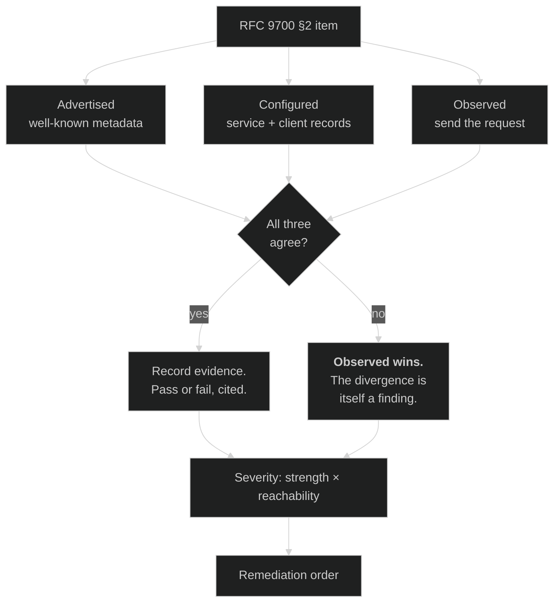

# Module 07 — OAuth 2.1 + the Security BCP

**The short version:** this module adds no new mechanism. Every part is already in Modules 02–06. What it adds
is the thing that turns knowledge into competence: a **procedure for assessing a deployment you did not
build**. Two documents do the consolidating — RFC 9700 (BCP 240) tells you what to require, and OAuth 2.1
folds those requirements into the baseline. You will use them to write an actual conformance report on the
server you have been attacking for six modules, and you will find that it fails in ways the earlier modules
individually implied but never added up.

## Prerequisites

**Modules 02–06, all of them.** This module is the seam where they join. If any of those gates is shaky, the
audit will feel like filling in a form rather than making judgements.

## Why this module exists

There is a gap between *"I know what PKCE does"* and *"I can tell you whether this deployment is safe to
ship."* Six modules closed the first. This one closes the second, and the difference is not more knowledge —
it is method.

Consider what you already know about this server, scattered across five modules:

- Module 02: the implicit grant returned a live access token in a URL fragment.
- Module 03: a public client got a token with no PKCE at all.
- Module 04: the introspection endpoint answers anyone.
- Module 05: DPoP works, but nothing requires it.
- Module 06: token exchange silently discards `resource`.

Individually, each is an observation in a lab. Together they are a **posture**, and the posture is worse than
the sum — because an attacker who has a code without PKCE and an unauthenticated introspection endpoint and
no audience restriction can chain them. Nobody in the earlier modules asked "so what is this deployment's
overall exposure?", because each module was busy teaching a mechanism. That question is this module.

**Two documents exist precisely so you do not have to hold all of it in your head.**

**RFC 9700** — *Best Current Practice for OAuth 2.0 Security*, BCP 240, January 2025 — has two halves and
Module 02 only gave you one. §4 is the **attack catalogue** (17 attacks; the full table is in
[Module 02](../02-oauth-core-and-threats/README.md#threat-model--rfc-6819--rfc-9700), and this module does not
repeat it). §2 is the **requirements**: what to do, in normative language, independent of any particular
attack. §4 is for understanding. **§2 is what you audit against**, and it is short enough to work through in
an afternoon.

**OAuth 2.1** is the same content arriving by a different route: instead of a companion BCP that a deployment
may or may not have read, the requirements become the baseline spec. It is an **active Internet-Draft** and
you must not cite it as normative — but you should know what it says, because it tells you where the floor is
moving.

## Plain-language pass (no spec vocabulary)

Six modules taught you to build. This one teaches you to **inspect**.

A building inspector does not rediscover structural engineering at every site. They carry a checklist derived
from everything the profession has learned the hard way, and their skill is in three things the checklist
cannot do for them:

- **Knowing which items are load-bearing.** "Fire door missing" and "handrail two centimetres low" are both
  failures. One of them stops the handover.
- **Not trusting the paperwork.** The plans say there is a firebreak. The plans are not the building. You go
  and look.
- **Writing findings someone can act on.** "Non-compliant" is useless. "This wall is non-load-bearing but the
  drawings show it carrying the second floor; here is the photograph; do not cut into it until surveyed" is a
  finding.

RFC 9700 §2 is the checklist. The rest of this module is the other three things.

## Learning objectives

After this module you can:

1. State what RFC 9700 §2 requires, section by section, and distinguish MUST from SHOULD from RECOMMENDED in
   a way that changes what you do.
2. Explain what OAuth 2.1 changes relative to OAuth 2.0, and correct the common overstatement of it.
3. Cite a draft correctly — revision, date consulted, and never as a normative requirement.
4. **Triangulate a deployment's posture from three independent sources** — advertised metadata, stored
   configuration, and observed behaviour — and explain why any one of them alone will mislead you.
5. Produce a conformance report with per-item evidence, severity, and a remediation order you can defend.
6. Recognise conformance theatre: a deployment that satisfies the letter of a checklist while remaining
   exploitable.

## RFC 9700 §2 — the checklist, in full

Every requirement below is quoted from the RFC. The right-hand column is where you learned the mechanism, so
you can go back rather than re-derive.

| § | Exact requirement (quoted) | Strength | Learned in |
|---|---|---|---|
| 2.1 | *"When comparing client redirection URIs against pre-registered URIs, authorization servers MUST utilize exact string matching except for port numbers in `localhost` redirection URIs of native apps."* | **MUST** | 02 |
| 2.1 | *"Clients and authorization servers MUST NOT expose URLs that forward the user's browser to arbitrary URIs obtained from a query parameter."* | **MUST NOT** | 02 (open redirection) |
| 2.1.1 | *"Public clients MUST use PKCE [RFC7636] to this end."* — and for confidential clients its use is RECOMMENDED | **MUST** / RECOMMENDED | 03 |
| 2.1.1 | *"Authorization servers MUST support PKCE."* | **MUST** | 03 |
| 2.1.1 | If a client sends a valid PKCE `code_challenge`, the AS **MUST** enforce its correct use; and authorization servers **MUST** mitigate PKCE downgrade attacks | **MUST** | 03 (§4.8, both directions) |
| 2.1.2 | *"clients SHOULD NOT use the implicit grant (response type `token`) or other response types issuing access tokens in the authorization response"* | SHOULD NOT | 02 |
| 2.2.1 | *"Authorization and resource servers SHOULD use mechanisms for sender-constraining access tokens, such as mutual TLS for OAuth 2.0 [RFC8705] or OAuth 2.0 Demonstrating Proof of Possession (DPoP) [RFC9449]."* | SHOULD | 05 |
| 2.2.2 | *"Refresh tokens for public clients MUST be sender-constrained or use refresh token rotation as described in Section 4.14."* | **MUST** | 03 |
| 2.3 | *"The privileges associated with an access token SHOULD be restricted to the minimum required for the particular application or use case."* | SHOULD | 04, 06 |
| 2.3 | *"Access tokens SHOULD be audience-restricted to a specific resource server or, if that is not feasible, to a small set of resource servers."* | SHOULD | 04 (RFC 8707) |
| 2.4 | *"The resource owner password credentials grant MUST NOT be used."* | **MUST NOT** | 01 |
| 2.5 | *"Authorization servers SHOULD enforce client authentication if it is feasible, in the particular deployment, to establish a process for issuance/registration of credentials for clients and ensuring the confidentiality of those credentials."* | SHOULD | 02, 06 |
| 2.5 | *"It is RECOMMENDED to use asymmetric cryptography for client authentication, such as mutual TLS for OAuth 2.0 [RFC8705] or signed JWTs."* | RECOMMENDED | 06 (`private_key_jwt`), 05 (mTLS) |
| 2.6 | *"It is therefore RECOMMENDED that authorization servers publish OAuth Authorization Server Metadata according to [RFC8414] and that clients make use of this Authorization Server Metadata (when available) to configure themselves."* | RECOMMENDED | 04 |
| 2.6 | *"It is RECOMMENDED to use end-to-end TLS according to [BCP195] between the client and the resource server."* | RECOMMENDED | 00 |
| 2.6 | *"Authorization responses MUST NOT be transmitted over unencrypted network connections."* | **MUST NOT** | 00 |

That is the whole of §2 — sixteen requirements across six subsections. **It is genuinely short.** Most of the
perceived difficulty of OAuth security is that this list is spread across a dozen specs; the BCP's real
contribution is putting it on one page.

### Reading normative strength like a reviewer

The keywords are not decoration, and treating them as a single "should probably" is how reviews become
useless.

| Keyword | What it means in a report | What you write |
|---|---|---|
| **MUST** / **MUST NOT** | Non-conformance. Not a matter of taste. | "Does not conform to RFC 9700 §2.4." State it flatly. |
| **SHOULD** / **SHOULD NOT** | There may be valid reasons to deviate in particular circumstances — but you must have the reason, and it must be written down | "Deviates from §2.2.1. No documented rationale found." A SHOULD you cannot justify is a finding. |
| **RECOMMENDED** | Synonymous with SHOULD | Same treatment |
| **MAY** | Genuinely optional | Not a finding. Do not pad reports with these. |

The practical rule: **a SHOULD without a written rationale is a finding; a SHOULD with one is a decision.**
The failure mode in real reviews is treating every SHOULD as either mandatory (report becomes noise nobody
reads) or optional (report misses the thing that gets exploited).

And the asymmetry worth internalising: a single MUST violation can be worth more than ten SHOULD deviations,
or it can be worth nothing, depending on reachability. §2.4's ROPC prohibition is a MUST NOT — but a service
that *permits* ROPC while no client is registered to use it is exposed only if someone registers one. You
have to say which situation you are in. That judgement is the difference between a report and a checklist.

## What OAuth 2.1 actually changes

Here is the correction most people need. OAuth 2.1 is widely described as a sweeping revision. It is not. Its
own §1.8 puts it plainly:

> *"OAuth 2.1 is compatible with OAuth 2.0 with the extensions and restrictions from known best current
> practices applied. Specifically, features not specified in OAuth 2.0 core, such as PKCE, are required in
> OAuth 2.1. Additionally, some features available in OAuth 2.0, such as the Implicit or Resource Owner
> Credentials grant types, are not specified in OAuth 2.1. Furthermore, some behaviors allowed in OAuth 2.0
> are restricted in OAuth 2.1, such as the strict string matching of redirect URIs required by OAuth 2.1."*

Three verbs, and they are the whole thing:

| Verb | What it does | Examples from §1.8 |
|---|---|---|
| **Requires** | Pulls in extensions that were optional | PKCE |
| **Omits** | Simply does not specify the insecure features | Implicit; ROPC |
| **Restricts** | Narrows behaviour OAuth 2.0 permitted | Exact string matching of redirect URIs |

Note the precision of *"are not specified in"*. The implicit grant is not banned by OAuth 2.1; it is **absent
from** it. A spec cannot forbid what it does not define. RFC 9700 §2.1.2 is where the SHOULD NOT lives. If you
say "OAuth 2.1 prohibits the implicit grant" in a review, you will be corrected by anyone who has read it, and
correctly.

And the structural tell: the draft's §10, *"Differences from OAuth 2.0"*, has exactly **two** subsections —
10.1 "Removal of the OAuth 2.0 Implicit grant" and 10.2 "Redirect URI Parameter in Token Request". Everything
else is not listed as a difference because it is not bolted on; it is written into the body. **OAuth 2.1 is
mostly RFC 9700 made normative**, and if you have internalised the BCP you already know OAuth 2.1.

> **Draft discipline — this is a project rule and a professional one.** OAuth 2.1 is an **active
> Internet-Draft**: `draft-ietf-oauth-v2-1-15`, dated **2 March 2026**, expiring 3 September 2026, consulted
> **2026-07-28**. Never write "OAuth 2.1 requires X" in a security review as though it were binding. Write
> "RFC 9700 §2.1.1 requires X (BCP 240, published January 2025); OAuth 2.1, currently draft-15, folds this
> into the baseline." The first is a claim a vendor can dispute. The second is a citation. When you quote a
> draft, always give the revision and the date you read it — the text can change under you, and a reader six
> months later needs to know which version you saw.

## The audit method — three sources, and why one is never enough

This is the transferable part, and it is worth more than the checklist.

Every OAuth deployment tells you about itself in three independent ways. **They routinely disagree, and every
disagreement is either a finding or a misunderstanding on your part.**

| Source | What it is | What it is good for | How it lies |
|---|---|---|---|
| **Advertised** | `/.well-known/…` metadata | Fast, remote, no credentials | Lists what the *service* supports, not what any *client* is permitted to do, and not what is *enforced* |
| **Configured** | The AS's stored settings (here: the Authlete service and client records) | Ground truth for policy | Requires admin access; a flag's name rarely matches its exact effect |
| **Observed** | What actually happens when you send the request | The only source that cannot be wrong | Slow; you only see what you thought to try; absence of evidence is not evidence |

You have already been bitten by every one of these:

- **Advertised ≠ permitted** — Module 02: metadata advertised `client_secret_basic` while `fapiModes` refused
  it, and Module 06: metadata advertises `private_key_jwt` while the client is pinned to
  `client_secret_basic`.
- **Configured ≠ observed** — Module 06: the client had `TOKEN_EXCHANGE` in its grant types and the service
  had the grant enabled, and exchange still failed, because the defect was in an SDK schema below both.
- **Observed ≠ complete** — Module 04: `resource` produced `aud` on the authorization-code path, so it was
  reasonable to assume it worked. Module 06 showed it silently does nothing on the exchange path. One
  observation, generalised, was wrong.

**The method:** for every §2 item, get all three. Where they agree, record the evidence and move on. Where
they disagree, **the observed behaviour wins**, and the disagreement itself goes in the report — because a
deployment whose metadata does not describe its behaviour will break integrators regardless of which side is
"right."



### Severity: strength × reachability

Normative strength alone does not rank findings. The other axis is **reachability** — can an attacker actually
get there, with what access, and what do they gain?

| | Reachable by an unauthenticated remote attacker | Needs a registered client | Needs admin access |
|---|---|---|---|
| **MUST violation** | Fix now | Fix this sprint | Fix, but it is a hardening item |
| **SHOULD deviation** | Fix this sprint | Document or fix | Document the rationale |

A MUST NOT violation nobody can reach outranks nothing. A SHOULD deviation an anonymous attacker can drive
outranks almost everything. You will apply this table in the lab, to real findings, and defend the ordering.

## The meta-threat: conformance theatre

Worth naming, because you will meet it.

A deployment can satisfy every item on a checklist and remain exploitable, because checklists test
**mechanisms present**, not **mechanisms enforced**, and not **mechanisms composed**. Three shapes:

- **Supported but not required.** The AS supports PKCE (§2.1.1 satisfied — "authorization servers MUST support
  PKCE"), and requires it of nobody. Module 03's headline. The checklist item is genuinely met. The attack is
  genuinely open.
- **Enforced in one path.** `resource` produces an audience restriction on the authorization-code path and is
  discarded on the exchange path. Module 06. Any audit that tests one path and generalises passes it.
- **Correct components, unsafe composition.** Every mechanism works, and no one asked what an attacker
  holding a PKCE-less code plus an unauthenticated introspection endpoint plus an unrestricted audience can
  reach. This is the one checklists structurally cannot catch, and it is what Module 12's capstone is for.

The defence is to write findings about **enforcement and reachability**, never about presence. "PKCE
supported: yes" is not a finding. "PKCE supported but `pkceRequired=false`; verified by obtaining a token for
a public client with no `code_verifier`" is.

## Threat model for this module

| Threat | What goes wrong | Defence | Where |
|---|---|---|---|
| Retired grant left enabled | ROPC or implicit reachable years after the code that used them was deleted | Audit §2.1.2 / §2.4 against **observed** behaviour, not the client list | **Ex 3 — verified here** |
| Supported-but-not-required | Every mechanism exists; none is enforced | Audit enforcement flags, not capability metadata | **Ex 2 — verified here** |
| Metadata that lies | Integrators build against advertised capability and fail in production | Triangulate; report divergences as findings | **Ex 1 — verified here** |
| Long-lived, unrestricted tokens | One leak is a long, broad compromise | §2.3 minimum privilege + audience restriction | **Ex 4 — verified here** |
| Unauthenticated management surfaces | Token scanning, enumeration | §2.5 client authentication; RFC 7662 §2.1 | **Ex 5 — verified here** |
| Draft cited as normative | A review's central claim collapses under challenge | Cite the BCP; cite drafts with revision + date | Throughout |
| Conformance theatre | Passing report, exploitable system | Findings about enforcement and reachability | Ex 6 |

## Spec delta — what each document adds

| Spec | Status | Adds | Would break without it |
|---|---|---|---|
| RFC 6819 | Published RFC (Informational), Jan 2013 | The first systematic OAuth threat taxonomy | No shared attack vocabulary |
| RFC 9700 | Published RFC, **BCP 240**, Jan 2025 | §2 requirements + §4 attack catalogue, consolidated and current | Every deployment re-derives the same lessons from incidents |
| draft-ietf-oauth-v2-1 | **Active Internet-Draft**, draft-15, 2 Mar 2026, consulted 2026-07-28 | Folds the BCP into the baseline spec; omits implicit and ROPC; requires PKCE; restricts redirect matching | Security depends on implementers having read a second document |

## Where this sits in the dependency graph

This is the **hinge**. Modules 00–06 are OAuth-the-authorization-protocol; 08 onward is identity, extensions,
profiles, and everything a token cannot do by itself.

- It **consumes** all of 02–06 and produces the review method used from here on.
- It **feeds Module 10** directly: FAPI 2.0 is what happens when you take RFC 9700's SHOULDs and make them
  MUSTs for a specific risk class. Having audited a permissive deployment here makes the profile's severity
  legible rather than arbitrary.
- It **feeds Module 12**: the capstone's adversarial review is this method at full scale.
- It **does not** cover authentication. "The user is who they say they are" is Module 08, and conflating it
  with authorization is the single most common architectural error in this space.

## Common mistakes

**❌ Auditing capability instead of enforcement**

```
✓ code_challenge_methods_supported: ["plain","S256"]   → "PKCE: PASS"
```

**✅ Audit what is required, and prove it**

```
PKCE supported (metadata) but not required (pkceRequired=false).
Evidence: obtained an access token for a public client with no code_verifier.
Also advertises "plain", contrary to §2.1.1's S256 guidance.
→ §2.1.1 FAIL for public clients.
```

---

**❌ "OAuth 2.1 prohibits the implicit grant"**

It does not define it. RFC 9700 §2.1.2 is where the SHOULD NOT lives, and it addresses *clients*.

**✅ "RFC 9700 §2.1.2 says clients SHOULD NOT use the implicit grant; OAuth 2.1 (draft-15) does not specify it at all."**

---

**❌ Trusting the grant list on the client record**

A client with `PASSWORD` in its grant types tells you the client *may*. It does not tell you whether the AS
will honour it, and the absence of a grant does not tell you no other client has it.

**✅ Send the request. Twice — once per client type.**

---

**❌ Ranking findings by normative strength alone**

Nine MUST violations reachable only with admin credentials, listed above one SHOULD deviation that lets an
anonymous attacker take over accounts.

**✅ Rank by strength × reachability, and say what an attacker gains**

---

**❌ A report of pass/fail rows**

Nobody can act on it, and nobody can check it.

**✅ Every row carries: the quoted requirement, the evidence (the exact command and its output), the
divergence between sources if any, severity with reasoning, and a specific remediation.**

## What just happened?

No new protocol. A method, and two documents that let you stop carrying the whole field in your head.

1. **RFC 9700 has two halves.** §4 is the attack catalogue (Module 02). **§2 is the sixteen requirements you
   audit against**, and it fits on one page.
2. **Normative strength is a tool, not decoration.** MUST is non-conformance; a SHOULD without a written
   rationale is a finding; a SHOULD with one is a decision.
3. **OAuth 2.1 requires, omits, and restricts** — it does not prohibit, because a spec cannot forbid what it
   does not define. It is mostly the BCP made normative, and it is a **draft**: cite the revision and the date.
4. **Triangulate.** Advertised, configured, observed. They disagree constantly. Observed wins, and the
   disagreement is itself a finding.
5. **Severity is strength × reachability.** Neither axis alone produces a defensible order.
6. **Beware conformance theatre.** Supported is not required; one path is not all paths; correct components
   compose into unsafe systems.

The habit this module is really trying to install: **when someone hands you an OAuth deployment, you now have
somewhere to start and a shape for the answer.** That is a different skill from anything in Modules 02–06, and
it is the one people actually get hired for.

## Assigned reading

None new — this module is a synthesis of 02–06. Before the lab, re-read your own notes and each module's
"what to carry" section. You are about to be asked to assemble them.

If you want the primary sources open while you work:
[RFC 9700 §2](https://www.rfc-editor.org/rfc/rfc9700.html#section-2) and
[draft-ietf-oauth-v2-1-15 §1.8](https://www.ietf.org/archive/id/draft-ietf-oauth-v2-1-15.html).

## Then do the lab

**[lab.md](lab.md)** — six exercises. You will build a three-source evidence base and write a real conformance
report on this deployment. One of the findings contradicts something an earlier module told you, which is the
most useful thing that can happen to a reviewer.

Then **[quiz.md](quiz.md)** — 18 items. Tier 4 is the gate.

> **Cumulative Exam B is due after this module** and has not been written yet — see the Build Log in
> `PROGRESS.md`. The Module 07 quiz's Tier 4 covers the same ground in the meantime.

---

## Onward

**Module 08 — OIDC Core + logout** changes the question from *"what may this software do?"* to *"who is this
person?"* — and the first thing it establishes is that an access token cannot answer the second one, no matter
how carefully you validated it. Everything you have audited so far is authorization. Authentication is a
different problem with a different token, a different set of validation steps, and its own family of
failures.
