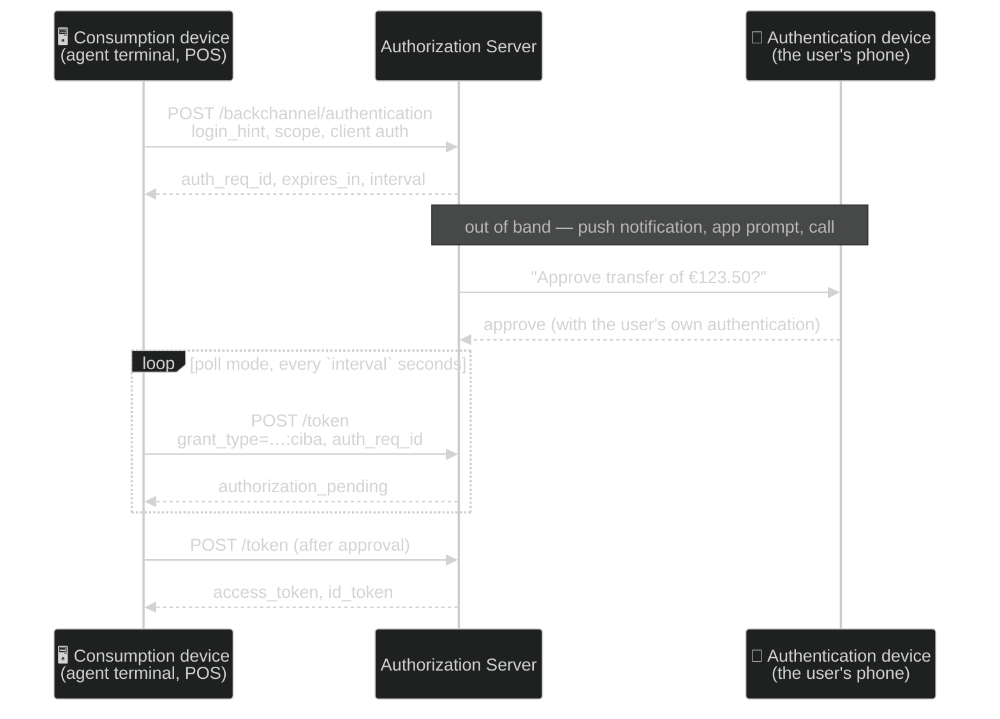

# Module 09a — Interaction Extensions

**The short version:** every module so far assumed one shape for the interaction — a browser redirect, one
authentication that lasts the whole session, and coarse scopes to describe what was authorized. Four
extensions lift four of those assumptions, and each one turns on with a single configuration field on this
deployment — all four of which are now set, so the lab shows you both states side by side. **JARM** signs the response. **CIBA** removes the browser. **RFC 9470** lets a resource server
demand *stronger* authentication mid-session. **RAR** replaces "read write" with a structured description of
what you are actually asking for.

## Prerequisites

- **[Module 05](../05-request-integrity-and-binding/)** — PAR and JAR protected the *request*. JARM is the
  third leg of that triangle, and the module makes more sense read as its completion.
- **[Module 08](../08-oidc-core-and-logout/)** — `acr` and `auth_time` were claims you learned to read.
  Here they become claims that decide whether a request is allowed to proceed.

## Why this module exists

Because the assumptions built into Modules 02–08 are not universal, and the places where they fail are exactly
the high-value places: payments, healthcare, call centres, embedded devices.

**Four unexamined assumptions.**

**1. The response is trustworthy.** Module 05 went to considerable trouble over the *request* — PAR to move it
off the front channel, JAR to sign it. The **response** got `state` (unprotected, in the clear) and, in the
hybrid flow, a hash inside the ID token. But there is no equivalent of JAR for the response: no signature over
`code`, `state`, `iss`, and the errors. A client cannot prove which AS produced a given authorization
response, or that its parameters arrived unmodified. **JARM** closes that: the whole response becomes a signed
JWT.

**2. There is a browser.** The authorization-code flow needs a user agent that can be redirected. That is
false for a call-centre agent taking a payment over the phone, a smart-meter, a point-of-sale terminal, or any
flow where the *device initiating* and the *device authenticating* are different. Module 02's device grant
solved one version of this (the device shows a code, the user types it elsewhere). **CIBA** solves the harder
one: the initiating device knows who the user is and asks the AS to go and authenticate them out-of-band, on
their own phone, with no redirect anywhere.

**3. One authentication covers the whole session.** You logged in with a password at 09:00. At 14:00 you ask
to transfer £40,000. Nothing in OAuth as taught so far lets the *resource server* say "not with that
authentication." It can reject the request, but it cannot tell the client *what would be sufficient*, so the
client cannot fix it. **RFC 9470** adds that conversation.

**4. Scopes describe authority well enough.** `scope=payments` cannot express "transfer €123.50 to IBAN
X, once." So deployments smuggle structure into scope strings (`payment:123.50:EUR:DE89...`), which is
unparseable, unbounded, and appears in URLs and logs. **RAR** replaces it with a JSON structure the AS can
validate and the user can be shown.

A fifth, briefly: **one app per device.** **Native SSO** lets several native apps from one vendor share an
authentication without each running its own browser flow.

**Everything in this module is optional, and that is the point.** These are not defaults. Each adds cost, and
each exists because a specific deployment class could not work without it. The skill this module builds is
knowing which one a given problem calls for — and recognising when the answer is "none of them."

## Plain-language pass (no spec vocabulary)

The bank, for this one.

- **JARM is the bank replying on letterhead, sealed.** Until now the bank's answer came back as a note the
  courier could have written: it said "here is your reference number, and by the way I am your bank." You had
  no way to tell. Now the reply is a sealed, signed document naming the bank, naming *you* as the addressee,
  and stamped with a time after which it is void. You verify the seal before believing a word of it.
- **CIBA is the bank phoning you back.** You are on the phone to an agent, arranging a transfer. There is no
  form for you to fill in. So the agent tells the bank "I am acting for account holder Alice," and the bank
  **rings Alice's own phone** and asks her there. The agent's terminal waits until the bank says yes. The
  agent never sees Alice's credentials, and Alice approves on a device the agent cannot touch.
- **Step-up is the cashier asking for more ID.** You are already through the door — a card got you in. Now you
  want to move a large sum, and the cashier says: *"not with that. Come back with photo ID, and it must have
  been checked within the last five minutes."* Note the crucial part — the cashier says **what would be
  enough**. A cashier who only says "no" leaves you stuck.
- **RAR is an itemised instruction instead of "access my account."** Rather than granting a blanket power, you
  write: *transfer €123.50, to this IBAN, once, from this account.* The bank can check it, show it back to
  you word for word, and refuse anything outside it.
- **Native SSO is one visit to the front desk for a group.** Several apps from the same vendor on your phone
  share one authentication instead of each sending you round the loop again.

## Specification pass (exact terminology) + the bridge

| Plain-language element | Formal concept | Defining reference |
|---|---|---|
| The bank's reply on sealed letterhead | **JARM** — the whole authorization response as one signed JWT | JARM (OpenID Final, errata set 1) |
| Delivered as one item instead of four | `response=<JWT>` in place of `code`/`state`/`iss` | JARM §2.3 |
| The letterhead naming the bank | `iss` — *"the issuer URL of the authorization server that created the response"* | JARM §2.1 |
| "Addressed to you" | `aud` — *"the client_id of the client the response is intended for"* | JARM §2.1 |
| A stamp saying when it becomes void | `exp` — *"a maximum JWT lifetime of 10 minutes is RECOMMENDED"* | JARM §2.1 |
| Which of four envelopes it arrives in | `response_mode`: `jwt`, `query.jwt`, `fragment.jwt`, `form_post.jwt` | JARM §2.3 (§2.3.1–2.3.4) |
| Agreeing to seal replies at all | `authorization_signed_response_alg` (client metadata) | JARM §3 |
| The bank ringing Alice's own phone | **CIBA** — decoupled authentication | CIBA Core 1.0 |
| The agent's terminal vs. Alice's phone | **Consumption device** vs. **authentication device** | CIBA Core 1.0 (terminology) |
| Naming who to call | `login_hint` | CIBA Core 1.0 §7.1 |
| A code the agent reads aloud for Alice to match | `binding_message` | CIBA Core 1.0 §7.1 |
| A secret only Alice knows, so strangers cannot make her phone ring | `user_code` | CIBA Core 1.0 §7.1 |
| The terminal's ticket to keep asking | `auth_req_id`, polled at the token endpoint | CIBA Core 1.0 §7.3, §10.1 |
| The cashier saying *"not with that"* | `insufficient_user_authentication` | RFC 9470 §3 |
| **The cashier saying what *would* be enough** | `acr_values` and/or `max_age` in the challenge | RFC 9470 §3 — the half people omit |
| Producing stronger ID and coming back | A new authorization request carrying `acr_values`; fresh `acr`/`auth_time` | OIDC Core §3.1.2.1; Module 08's claims |
| An itemised instruction, not a blanket power | **RAR** — `authorization_details` | RFC 9396 §2 |
| Which kind of instruction this is | `type` — the only REQUIRED field; it selects the schema | RFC 9396 §2 |
| The standard boxes on the form | `locations`, `actions`, `datatypes`, `identifier`, `privileges` | RFC 9396 §2.2 |
| The bank refusing a malformed instruction | `invalid_authorization_details` | RFC 9396 §5 |
| One visit to the desk for a group | **Native SSO** — `device_secret` | Native SSO 1.0, **2nd Implementer's Draft** |

Two rows are worth pausing on. **`iss` inside the JARM signature** is the same claim as Module 05's `iss`
query parameter and a categorically stronger thing: tampering goes from *detectable* to *impossible*. And the
row in bold — `acr_values` in the challenge — is the difference between RFC 9470 and a plain 403; omit it and
you have implemented the error code without the mechanism.

## Learning objectives

After this module you can:

1. Explain what JARM protects that `state`, PAR, and JAR do not, and name the three claims a JARM response
   JWT must carry.
2. Choose between JARM's four `response_mode` values and say which client metadata field enables it.
3. Describe the CIBA flow end to end, choose between **poll**, **ping**, and **push**, and state the threat
   that makes CIBA's consent model harder than a redirect's.
4. Read and construct an RFC 9470 `WWW-Authenticate` challenge, and explain why returning
   `insufficient_user_authentication` *without* `acr_values` is nearly useless.
5. Write an `authorization_details` object with the RFC 9396 common fields, and say when RAR beats scopes and
   when it is over-engineering.
6. Place all five extensions on the "which assumption does this lift?" table without notes.
7. **Place an extension you were never taught** — take an unfamiliar specification's abstract and say which
   assumption it lifts, which modules it presupposes, what breaks without it, what its status is, and where
   it sits relative to the mechanisms you know. That is quiz **Q20**, and it is the transferable form of
   objective 6.

## JARM — signing the response

Module 05's triangle, completed:

| Concern | Mechanism | Spec |
|---|---|---|
| Request confidentiality (keep it off the front channel) | **PAR** | RFC 9126 |
| Request integrity + non-repudiation | **JAR** | RFC 9101 |
| **Response integrity + non-repudiation** | **JARM** | JARM (OpenID Final) |

JARM turns the entire authorization response into a single JWT delivered as one `response` parameter. Instead
of `?code=…&state=…&iss=…` you get `?response=eyJ…`.

**Three claims are mandatory** (quoted from the spec):

| Claim | Spec text |
|---|---|
| `iss` | *"the issuer URL of the authorization server that created the response"* |
| `aud` | *"the client_id of the client the response is intended for"* |
| `exp` | *"expiration of the JWT. A maximum JWT lifetime of 10 minutes is RECOMMENDED"* |

Look at what those three do, because it is more than "integrity."

- **`iss` makes mix-up structurally impossible**, not merely detectable. RFC 9207's `iss` parameter (Module 05)
  was an unsigned query parameter — an attacker who could rewrite the response could rewrite `iss` too. Inside
  a signed JWT, they cannot.
- **`aud` audience-restricts the response itself.** A JARM response minted for another client cannot be
  replayed at yours. This is the same `aud` reasoning as Module 08's ID token, applied to the authorization
  response.
- **`exp` bounds replay.** An authorization response is now a short-lived, expiring artefact rather than a URL
  that works whenever it is replayed.

**Four response modes:**

| `response_mode` | Where the JWT goes |
|---|---|
| `query.jwt` | Query component of the redirect |
| `fragment.jwt` | Fragment component |
| `form_post.jwt` | An auto-submitting HTML form (POST) |
| `jwt` | Shorthand: the default encoding for the response type — query for `code`, fragment for token types |

**Three client metadata parameters** enable it: `authorization_signed_response_alg`,
`authorization_encrypted_response_alg`, and `authorization_encrypted_response_enc`. The first is the one that
matters; the other two add JWE on top, which also removes the code from browser history and `Referer`.

> **On this deployment, JARM needs no server code — only that one client metadata field.** Requesting
> `response_mode=jwt` today returns `[A012305] … the 'authorization_signed_response_alg' metadata of the client
> … is not set.` The authorization server already builds and signs the response object; nothing in
> `server/src` has to change. This corrects
> [SPEC-INVENTORY](../../SPEC-INVENTORY.md)'s earlier framing of JARM as an implementation gap: on the **AS
> side** it is a configuration gap. A *client* consuming JARM does need code — parse the `response`
> parameter, verify the signature against the AS's JWKS, check `iss`/`aud`/`exp`, then read `code` and `state`
> from the payload — and the dashboard SPA does not have it.

### On the wire

The only new wire format in this module. Compare it against Module 02's redirect, which is the same
information unprotected.

```http
# Module 02's authorization response — four parameters, none of them signed.
HTTP/1.1 302 Found
Location: http://localhost:3001/callback?code=8k2Jd…&state=Zx9qP2rLk7&iss=https%3A%2F%2Fas.example.com

# The same response with response_mode=jwt. One parameter.
HTTP/1.1 302 Found
Location: http://localhost:3001/callback?response=eyJhbGciOiJFUzI1NiIsImtpZCI6IjEifQ.eyJpc3MiOi…
```

```json
// …and the payload of that JWT, once the client has VERIFIED the signature against the AS's JWKS:
{
  "iss":   "https://as.example.com",   // MUST — mix-up becomes impossible, not merely detectable
  "aud":   "1234567890",               // MUST — a response minted for another client is inert here
  "exp":   1785156382,                 // MUST — ≤10 min RECOMMENDED; replay is now bounded
  "code":  "8k2Jd…",                   // the parameters you used to read from the query string
  "state": "Zx9qP2rLk7"
}
```

**What just happened?** Nothing was hidden — the JWT is still in a URL the browser can read, and an attacker
still sees the code. What changed is that the code now arrives **inside a structure that names its author,
its intended recipient, and its expiry**, none of which can be altered. `state` is still your job: JARM stops
it being *tampered with*, and does not do its job of binding the response to this browser session.

And the failure mode worth predicting before Exercise 2: a client that reads that payload with a base64
decode and never checks the signature is **worse off than one not using JARM at all** — same protections as
before, plus a new assurance claim in the architecture document that nothing earns.

FAPI 2.0 Message Signing (Module 10) requires JAR **and** JARM together, precisely so that both halves of the
exchange are non-repudiable.

## CIBA — authentication without a browser

**Client-Initiated Backchannel Authentication.** The client starts the flow; the AS authenticates the user on
a device of their own; the client never redirects anybody.



**The two devices are the whole idea.** The *consumption device* wants the token; the *authentication device*
is where the user proves who they are. They are different machines, possibly in different countries, with no
shared browser session. Nothing is redirected because there is nothing to redirect.

**Three delivery modes**, and choosing between them is a real design decision:

| Mode | How the client learns the result | Needs the client to be reachable? | Use when |
|---|---|---|---|
| **poll** | Polls the token endpoint with `auth_req_id` | No | The default. Simplest; works behind NAT, in a browser, on a terminal |
| **ping** | AS POSTs a notification saying "ready"; client then calls the token endpoint | **Yes** — needs a public notification endpoint | You want to avoid polling latency and cost but still fetch tokens yourself |
| **push** | AS POSTs the **tokens** directly to the client's notification endpoint | **Yes** | Lowest latency; but tokens now arrive at an endpoint you must protect as carefully as the token endpoint |

Poll mode reuses the device grant's error vocabulary (Module 02): `authorization_pending`, `slow_down`,
`expired_token`, `access_denied`. If you learned those there, you already know CIBA's polling loop.

**The threat model is genuinely harder than a redirect's, and this is the part worth dwelling on.**

In a redirect flow the user *initiated* the interaction — they clicked something, then a page appeared. The
context is self-evident. In CIBA, an unsolicited prompt appears on the user's phone, generated by a request
they did not make, containing a description they did not write. That is a phishing surface with the
authorization server's own branding on it. The mitigations are real but partial: `binding_message` (a short
human-readable string the client supplies and the AS displays, so the user can match it against what the agent
just read out), `user_code` (a secret the user provides so an attacker who knows only a `login_hint` cannot
trigger prompts), and above all restricting which clients may use CIBA at all — because **any client permitted
to use CIBA can make any user's phone buzz** simply by knowing a `login_hint`. On this deployment
`backchannelUserCodeParameterSupported` is `true`, so `user_code` is available.

## RFC 9470 — step-up authentication

*OAuth 2.0 Step Up Authentication Challenge Protocol*, Standards Track, September 2023. Small, and it closes a
real gap.

The problem: a resource server can tell that the authentication behind a token is too weak, and has no
standard way to say what would be strong enough. So it returns 403, the client shows "something went wrong,"
and the user is stuck — the client cannot fix a problem it was not told the shape of.

RFC 9470 adds one error code and two challenge parameters:

| Element | Spec text |
|---|---|
| `insufficient_user_authentication` | *"The authentication event associated with the access token presented with the request does not meet the authentication requirements of the protected resource."* |
| `acr_values` | *"A space-separated string listing the authentication context class reference values in order of preference."* |
| `max_age` | *"This value indicates the allowable elapsed time in seconds since the last active authentication event associated with the access token."* |

The exchange, in full:

```
GET /transfer  Authorization: Bearer <token from a password login at 09:00>

HTTP/1.1 401 Unauthorized
WWW-Authenticate: Bearer error="insufficient_user_authentication",
  error_description="A different authentication level is required",
  acr_values="myACR"
```

The client reads `acr_values`, starts a **new authorization request** carrying `acr_values=myACR` (or
`max_age`), the AS authenticates the user more strongly, and the resulting token carries the stronger `acr`
and a fresh `auth_time`. The client retries. **Note it is 401, not 403** — this is an authentication problem,
and the `WWW-Authenticate` header is how HTTP says "here is what would work."

Where do `acr` and `auth_time` come from? Module 08. For a JWT access token they are claims in the token; for
an opaque one, RFC 9470 §3 has them returned in the **introspection** response — which is how this repo does
it (`introspection.controller.ts` parses Authlete's `WWW-Authenticate` and re-shapes it as JSON for the
client).

Two things that make this fail in practice:

- **Returning the error without `acr_values` or `max_age`.** Then the client knows only that its token is
  insufficient, not what to request, and cannot recover. This is the single most common implementation mistake
  in RFC 9470, and it converts a recoverable state into a dead end.
- **Requesting an ACR the AS does not support.** The authorization request is rejected outright. ACR values
  are deployment-specific strings — there is no universal registry of "mfa" — so the RS's requirement and the
  AS's capability must be agreed out of band. On this deployment, requesting *any* ACR while the service
  supports none returns `[A021303] ACR values cannot be specified … because this service supports no ACR
  value.`

Whether an ACR requirement is **essential** matters too: `acr_values` is a *preference*, while an `acr` claim
requested as `"essential": true` in the `claims` parameter (OIDC Core §5.5.1) is a *requirement* the AS must
fail rather than downgrade.

## RAR — structured authorization

*OAuth 2.0 Rich Authorization Requests*, RFC 9396, Standards Track, May 2023. One new parameter,
`authorization_details`:

> *"The request parameter `authorization_details` contains, in JSON notation, an array of objects. Each JSON
> object contains the data to specify the authorization requirements for a certain type of resource."*

`type` is the only REQUIRED field, and it is the schema selector:

> *"An identifier for the authorization details type as a string. The value of the `type` field determines the
> allowable contents of the object that contains it. The value is unique for the described API in the context
> of the AS. This field is REQUIRED."*

RFC 9396 defines five reusable **common data fields** so that every API does not invent its own:

| Field | Spec text |
|---|---|
| `locations` | *"An array of strings representing the location of the resource or RS. These strings are typically URIs identifying the location of the RS."* |
| `actions` | *"An array of strings representing the kinds of actions to be taken at the resource."* |
| `datatypes` | *"An array of strings representing the kinds of data being requested from the resource."* |
| `identifier` | *"A string identifier indicating a specific resource available at the API."* |
| `privileges` | *"An array of strings representing the types or levels of privilege being requested at the resource."* |

A payment, expressed properly:

```json
[{
  "type": "payment_initiation",
  "actions": ["initiate", "status"],
  "locations": ["https://api.example.com/payments"],
  "instructedAmount": { "currency": "EUR", "amount": "123.50" },
  "creditorAccount": { "iban": "DE02100100109307118603" }
}]
```

Compare with `scope=payment_initiation`, which cannot say the amount, or with
`scope=payment:123.50:EUR:DE02100100109307118603`, which can — badly. The scope-string version is unparseable
by anything generic, unbounded in length, and travels in a URL.

**Three properties you get that scopes cannot give you:**

1. **The AS can validate it.** `invalid_authorization_details` is returned for *"unknown types, unknown
   fields, incorrect field types, invalid values, or missing required fields."* A malformed scope string is
   just a scope string.
2. **The consent screen can show it.** "Transfer €123.50 to DE02…" is meaningful to a user;
   "payment_initiation" is not.
3. **The RS can enforce it exactly.** The granted `authorization_details` come back in the token/introspection
   response, so the RS compares structure to structure rather than parsing a string.

On coexistence with scopes, the RFC is explicit: *"`authorization_details` and `scope` can be used in the same
authorization request for carrying independent authorization requirements,"* while recommending *"a given API
use only one form of requirement specification."* Both, but not for the same thing.

**When not to use RAR.** If your authority genuinely is coarse — "read this user's profile" — RAR adds a
schema to design, register, validate, and version, in exchange for nothing. Reach for it when the authorization
has *parameters*, when the user must see them, or when the RS must enforce them exactly.

## Native SSO — briefly, and with a caveat

**OpenID Connect Native SSO for Mobile Apps 1.0** lets several native apps from one vendor share an
authentication: the first app's token response includes a `device_secret`, which a sibling app exchanges
(together with the first app's ID token) via
`grant_type=urn:openid:params:grant-type:device_secret` for its own tokens.

> **This runs on the deployment now — enabled and verified 2026-09-03**, reversing
> [DR-04](../../../../audit/05-decision-records.md#dr-04--native-sso). `scripts/native-sso-verify.mjs`
> drives both phases and passes 13 of 13: App 2's ID token carries the *same* `sid` and `ds_hash` as App
> 1's, which is the shared-session property the whole feature exists for.
>
> **What verifying it found is the part worth your time.** Phase 2 never checked the device secret — it
> recomputed `ds_hash` from whatever secret was presented, so any secret "matched" and holding an ID
> token was enough. The two phases arrive as the *same* vendor action and need opposite handling: Phase 1
> mints and hashes, Phase 2 compares and must compute nothing. And omitting the `actor_token` turns the
> request into a plain RFC 8693 impersonation exchange, which needs no device secret at all — so the
> binding is only as strong as the deployment's token-exchange policy.

> **Status caveat, and it matters.** This is an **OpenID 2nd Implementer's Draft** — **draft 07, whose own
> header is dated 16 January 2025, approved as the 2nd Implementer's Draft on 2025-10-17** — and **not** a Final
> specification. Do not cite it as normative. **Give both dates, because they answer different questions:** the
> header date tells you which text you read, the approval date tells you what standing it has. Citing only one
> is how a reader ends up unable to tell whether they have the revision you meant. `SPEC-INVENTORY.md` states
> the rule generally. On this deployment
> `nativeSsoSupported` is `false`, so this module teaches it from the spec and from
> [`docs/NATIVE-SSO-TUTORIAL.md`](../../../NATIVE-SSO-TUTORIAL.md) and runs nothing.

The security question worth holding onto: `device_secret` is a credential shared across app sandboxes on one
device, so its security rests on platform-level isolation (keychain access groups, shared entitlements) — a
guarantee outside OAuth's model entirely.

## The table to internalise

| Extension | Assumption it lifts | Status | Cost |
|---|---|---|---|
| **JARM** | The response is trustworthy | OpenID Final (errata set 1, Aug 2025) | Client must verify a JWT; one client metadata field |
| **CIBA** | There is a browser | OpenID Final (Sep 2021) | New endpoint, polling or a notification endpoint, and a harder consent story |
| **RFC 9470** | One authentication covers the session | Published RFC (Sep 2023) | RS must challenge; AS must support named ACRs; client must handle re-authorization |
| **RAR** | Scopes describe authority well enough | Published RFC (May 2023) | A schema per type, registered and versioned |
| **Native SSO** | One app per device | **2nd Implementer's Draft** — not Final | Platform-dependent secret sharing |

## Threat model for this module

| Threat | What goes wrong | Defence | Where |
|---|---|---|---|
| Response tampering / mix-up | Client cannot prove which AS answered or that parameters are intact | JARM `iss` **inside** the signature | **Ex 2 — verified here** |
| JARM response replayed at another client | A real signed response accepted by the wrong RP | JARM `aud` | Ex 2 |
| JARM response replayed later | An old response reused | JARM `exp` (≤10 min RECOMMENDED) | Ex 2 |
| Accepting a JARM response without verifying it | Signature present, never checked — worse than no JARM, because it looks safe | Verify against the AS's JWKS before reading any parameter | Ex 2 |
| Unsolicited CIBA prompt (push phishing) | Any permitted client can make a user's phone buzz from a `login_hint` | `binding_message`, `user_code`, strict client permissioning | **Ex 3 — verified here** |
| CIBA push to a weak endpoint | Tokens delivered to an endpoint protected less carefully than the token endpoint | Prefer poll; if push, authenticate the AS and use TLS | Ex 3 |
| Step-up dead end | RS returns `insufficient_user_authentication` with no `acr_values` | Always include `acr_values` or `max_age` | **Ex 4 — verified here** |
| ACR theatre | An `acr` value the AS emits without performing stronger authentication | Treat ACR as a contract; verify what the AS actually does | Ex 4 |
| RAR type confusion | An RS accepts an `authorization_details` object of a type it does not understand | Reject unknown types; `invalid_authorization_details` | **Ex 5 — verified here** |
| Structure smuggled into scope strings | Unparseable, unbounded authority in a URL | Use RAR | Ex 5 |
| Draft cited as normative | Native SSO treated as Final | Cite the implementer's draft and revision | Throughout |

## Spec delta — what each document adds

| Spec | Status | Adds | Would break without it |
|---|---|---|---|
| JARM | OpenID **Final**, *incorporating errata set 1*, 17 Aug 2025 | `response_mode=jwt` family; signed/encrypted authorization response with `iss`/`aud`/`exp` | No integrity or non-repudiation for the response half of the exchange |
| CIBA Core 1.0 | OpenID Final, Sep 2021 | Backchannel authentication endpoint, `auth_req_id`, poll/ping/push | No standard decoupled authentication |
| RFC 9470 | Published RFC, Sep 2023 | `insufficient_user_authentication` + `acr_values`/`max_age` challenge | RS can refuse but cannot say what would suffice |
| RFC 9396 | Published RFC, May 2023 | `authorization_details`; five common data fields; `invalid_authorization_details` | Structured authority smuggled into scope strings |
| Native SSO 1.0 | OpenID **2nd Implementer's Draft** (draft 07, text dated 16 Jan 2025; approved 2025-10-17) | `device_secret`, the device-secret grant | Every sibling app runs its own browser flow |

## Where this sits in the dependency graph

- It **completes Module 05**: PAR, JAR, JARM — request confidentiality, request integrity, response integrity.
- It **operationalises Module 08**: `acr` and `auth_time` stop being claims you read and become claims that
  gate requests.
- It **feeds Module 10** directly. FAPI 2.0 Message Signing requires JAR + JARM; FAPI profiles constrain ACR
  handling; and open-banking ecosystems are the reason RAR exists.
- It **feeds Module 11**: RAR is the bridge from "scopes" to real authorization models, which is where
  Module 11 starts.
- It is **parallel to Module 09b** — that one is about *what* is asserted about a person (verified claims,
  credentials); this one about *how* the interaction is shaped.

## Common mistakes

**❌ Reading the JARM payload without verifying the signature**

```js
const { code, state } = decodeJwtPayload(params.get("response"));   // decode ≠ verify
```

This is strictly worse than not using JARM: the signature's presence makes the code look validated when
nothing was checked. Module 00's rule, ninth appearance.

**✅ Verify, then check all three claims, then read the parameters**

```js
const claims = await verifyJws(params.get("response"), await asJwks());
if (claims.iss !== EXPECTED_ISS) throw new Error("wrong issuer");
if (claims.aud !== CLIENT_ID)    throw new Error("not addressed to us");
if (claims.exp < now())          throw new Error("expired response");
if (claims.state !== session.state) throw new Error("state mismatch");
```

---

**❌ Treating `state` as unnecessary because JARM signs everything**

`state` is still how you bind the response to *this browser session*. JARM protects it from tampering; it does
not do its job.

---

**❌ Sending `insufficient_user_authentication` with no `acr_values`**

```
WWW-Authenticate: Bearer error="insufficient_user_authentication"
```

The client now knows only that it failed. It cannot construct a request that would succeed.

**✅ Say what would work**

```
WWW-Authenticate: Bearer error="insufficient_user_authentication",
  error_description="A stronger authentication is required for transfers",
  acr_values="urn:example:mfa", max_age="300"
```

---

**❌ 403 for a step-up requirement**

It is an *authentication* problem, so 401 with `WWW-Authenticate` — the header is the whole mechanism, and 403
has no place to put it.

> **And this deployment is an instance of it, which is worth knowing before you run anything.**
> `server/src/controllers/introspection.controller.ts` answers the `insufficient_user_authentication` case
> with **403**. Be precise about what that is, because the reading matters: it is the **AS → resource server**
> introspection response, where Authlete's action is `FORBIDDEN` and 403 is a defensible mapping for a vendor
> API. It is **not** RFC 9470 §3's challenge, which is the **resource server → client** response and must be
> 401. The two are separate messages with separate status codes, and this repo only implements the first —
> **you write the second.** `docs/STEP-UP-AUTH-TUTORIAL.md` Part 5 conflated them until 2026-08-14, printing
> the 403 under the heading *"an error conforming to RFC 9470"* with the client-action table hanging off it;
> it now prints both, side by side, with the boundary drawn. So `curl` returning 403 here does not contradict
> the ❌ above — but you cannot see that from the status code alone, which is the more general lesson.

---

**❌ Encoding structure into scope strings**

```
scope=payment:123.50:EUR:DE02100100109307118603
```

**✅ `authorization_details` with a registered `type`**

---

**❌ Allowing CIBA on every client**

Any client permitted to use CIBA can trigger a prompt on any user's device from a `login_hint` alone. Restrict
it to clients that need it, and use `binding_message` so the user can tell a real request from a fabricated
one.

## What just happened?

Four assumptions lifted, and one theme: **the interaction is itself a thing you can design.**

1. **JARM** completes PAR and JAR. Three mandatory claims — `iss` (mix-up becomes impossible, not merely
   detectable), `aud` (the response is audience-restricted), `exp` (replay is bounded). One client metadata
   field enables it on this deployment; the AS needs no code.
2. **CIBA** removes the browser by splitting the consumption device from the authentication device. Poll, ping,
   or push — and its consent story is harder than a redirect's, because the prompt is unsolicited.
3. **RFC 9470** turns "no" into "not with that — bring this." 401, `WWW-Authenticate`,
   `insufficient_user_authentication`, and `acr_values`/`max_age`. Without those parameters it is a dead end.
4. **RAR** replaces coarse scopes with a validatable, displayable, enforceable structure — when the authority
   has parameters. Not otherwise.
5. **Native SSO** is a 2nd Implementer's Draft. Cite it as one.

And the meta-lesson, which is really about how to read this whole area: **each of these four was one
configuration field away from working**, and each has since been switched on. Not one required a code change
to the authorization server. The distance between "this deployment does not support X" and "this deployment
supports X" is very often a console field — which cuts both ways, because it is equally the distance between
a control being enforced and not, and because **it can be crossed without anybody updating the documentation
that described the old state.** The lab carries a preflight for exactly that reason.

## Assigned reading

Read after the lesson, before the lab:

- [`docs/CIBA-TUTORIAL.md`](../../../CIBA-TUTORIAL.md) — the four endpoints and Authlete's configuration
  surface.
- [`docs/STEP-UP-AUTH-TUTORIAL.md`](../../../STEP-UP-AUTH-TUTORIAL.md) — how `acr`/`auth_time` are bound in
  this server and how the introspection controller re-shapes the challenge.
- [`docs/RAR-TUTORIAL.md`](../../../RAR-TUTORIAL.md) — `authorization_details` in this deployment.
- [`docs/NATIVE-SSO-TUTORIAL.md`](../../../NATIVE-SSO-TUTORIAL.md) — read for shape only; nothing here runs it.

## Then do the lab

**[lab.md](lab.md)** — five exercises. Each pairs a precise refusal with the same request succeeding
elsewhere, traces the difference to the single field responsible, and then runs the mechanism for real. Start
with its preflight: what you see depends on how your service and clients are configured.

Then **[quiz.md](quiz.md)** — 19 items. Tier 4 is the gate.

---

## Onward

**Module 09b — Identity + credentials** changes the subject from *how the interaction is shaped* to *what is
being asserted about a person, and by whom*: verified claims and identity assurance, selective disclosure with
SD-JWT so a holder can prove one fact without revealing the rest, verifiable credential issuance and
presentation, and federation — trust at a scale where no two parties have a direct relationship.
