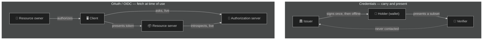
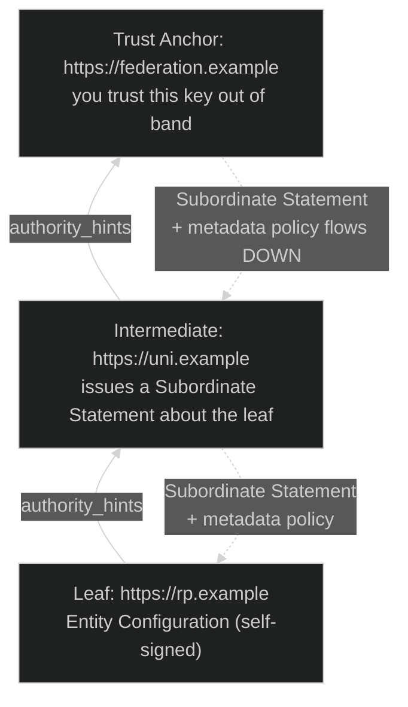
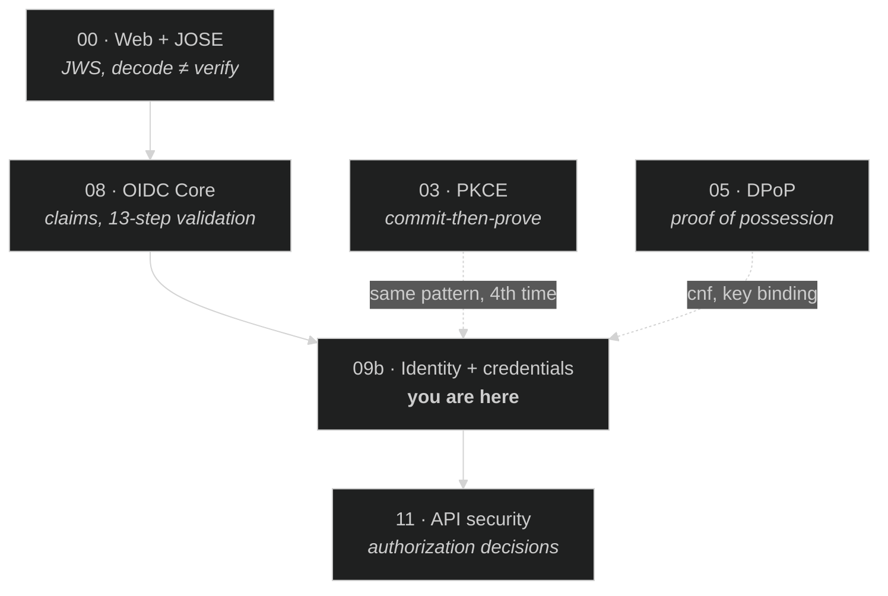

# Module 09b — Identity + Credentials

> **The short version:** every module so far assumed the relying party can ask the authorization server,
> live, at the moment it needs an answer. This module removes that assumption four different ways — and the
> most important consequence is that the thing carrying the identity is now in the hands of the person it
> describes. That changes who can lie, who can correlate, and what "verify" means.

## Prerequisites

- **[Module 08 — OIDC Core + Logout](../08-oidc-core-and-logout/README.md)** — you need ID tokens, claims,
  and the thirteen-step validation before any of this makes sense.
- **[Module 00 — Web + JOSE Foundations](../00-web-and-jose-foundations/README.md)** — this module is mostly
  JOSE. If `decode ≠ verify` is not reflex yet, go back.

---

## Why this module exists

Look at what Modules 01 through 09a have in common. Authorization code, PKCE, introspection, PAR, DPoP,
CIBA, RAR — every one of them is a conversation between a client and an authorization server that is
**online, known in advance, and asked directly**. The client redirects to it, or posts to it, or introspects
against it. The identity never travels on its own; it is always fetched.

That shape carries four assumptions that nobody has examined yet:

| # | Unexamined assumption | What breaks it | Lifted by |
|---|---|---|---|
| 1 | **The issuer is reachable when the identity is needed.** | A border kiosk with no network. A pharmacy verifying an age. | OID4VCI / OID4VP |
| 2 | **You already have a relationship with the issuer.** Registration, a client secret, a discovery URL somebody typed in. | 3,000 universities and 400 services. Bilateral registration is O(n²). | OpenID Federation |
| 3 | **The issuer's word is good enough** — that `"email_verified": true` needs no further account. | A regulator asks *how* you established that, *when*, and *against what evidence*. | OIDC Identity Assurance |
| 4 | **Claims travel all or nothing.** A signature covers the whole payload; remove a claim and it breaks. | A bar needs `over_18`. It does not need your name, address, or date of birth. | SD-JWT |

This module is those four answers. They are usually taught as one undifferentiated pile labelled "wallets"
or "SSI." They are not one thing. Assumption 4 is a cryptography problem, 3 is a governance problem, 2 is a
topology problem, and 1 is an architecture problem. Keep them apart and each is tractable.

---

## Learning objectives

By the end you can:

1. Map OAuth's four roles onto the **issuer / holder / verifier** model and say precisely which trust
   relationship disappears.
2. Explain why `verified_claims` adds **accountability, not cryptography**, and why that distinction decides
   whether it is worth the cost.
3. Explain what an **entity statement** and a **trust chain** are, and name the failure mode of a
   too-permissive trust anchor.
4. Derive SD-JWT's **salted-digest** construction from four requirements, and compute a digest by hand that
   matches RFC 9901's own published test vector.
5. Name the three checks a verifier performs that people skip, and demonstrate the attack each one stops.
6. State the **one unlinkability property SD-JWT cannot provide**, and why.
7. Place OID4VCI and OID4VP in the dependency graph — including which one is plain OAuth wearing a hat.

---

## The role shift, precisely

OAuth has four roles (RFC 6749 §1.1). The credential world has three. They do not line up the way people
assume.

| Credential role | Definition (verbatim) | Closest OAuth role | What is different |
|---|---|---|---|
| **Issuer** | "An entity that creates SD-JWTs." (RFC 9901 §1.2) | Authorization server | Signs **once**, then goes away. Not consulted at presentation time. |
| **Holder** | "An entity that received SD-JWTs from the Issuer and has control over them." (RFC 9901 §1.2) | Resource owner **+ client** | This is the fusion. The subject now *carries* the credential and *chooses* what to release. |
| **Verifier** | "An entity that requests, checks, and extracts the claims from an SD-JWT with its respective Disclosures." (RFC 9901 §1.2) | Resource server | Must validate a signature from a party it may never contact. |

The collapse of resource owner and client into **holder** is the whole story. In OAuth the user authorizes
a client to fetch something on their behalf; the user never touches the token. Here the user holds the
credential. Two consequences follow immediately, and both are load-bearing:

- **The holder is now a plausible attacker.** They possess the credential and want to disclose as little as
  possible — sometimes less than the truth. Every check in RFC 9901 §7.1 exists because the holder controls
  the input.
- **The issuer loses visibility.** It cannot revoke by refusing an introspection call, because nobody calls
  it. Revocation becomes a genuinely hard, separate problem — and one this module does not solve.



Note the dotted line. That absence is what forces everything else in this module.

---

## Identity assurance — provenance, not cryptography

**Verified against the primary source.** *OpenID Connect for Identity Assurance 1.0*, **OpenID Final**,
**1 October 2024**; the errata set 1 revision is dated **1 July 2026**.

Here is the problem it solves, and it is not a cryptographic one. Consider two ID tokens. Both are correctly
signed by an issuer you trust. Both contain:

```json
{ "given_name": "Alice", "family_name": "Almasi", "birthdate": "1987-03-14" }
```

In the first, the user typed those values into a signup form. In the second, a trained agent inspected a
passport in person, in 2023, under a national trust framework. **The cryptography is identical. The
assurance is not, and nothing in the token tells you which one you have.**

Identity Assurance adds a container. Per §5.1: *"The basic idea is to use a container element, called
`verified_claims`, to provide the RP with a set of claims along with the respective metadata and
verification evidence."* It has exactly two sub-elements:

| Sub-element | Carries |
|---|---|
| `verification` | *How* the claims were established: `trust_framework`, `time`, `verification_process`, `evidence`, `assurance_level` |
| `claims` | The actual end-user claims that were verified — ordinary OIDC claims, now with provenance attached |

```json
{
  "verified_claims": {
    "verification": {
      "trust_framework": "eidas",
      "time": "2023-02-16T09:14Z",
      "evidence": [ { "type": "document", "...": "..." } ]
    },
    "claims": { "given_name": "Alice", "birthdate": "1987-03-14" }
  }
}
```

> **Scope note, honestly stated.** The detailed schema — which members of `verification` are REQUIRED versus
> OPTIONAL, and the full enumeration of `evidence` types — is **normatively defined in a separate referenced
> schema document**, not in the specification body. The specification body shows `document`,
> `electronic_record`, `vouch`, and `electronic_signature` in examples. Treat the four as illustrative and
> the schema document as authoritative; this curriculum does not claim a verbatim required/optional list it
> has not read. Marked `UNVERIFIED` where it matters.

**The judgement to carry away.** `verified_claims` costs real money — you are buying an identity-proofing
process, not a library. Adopt it when someone can *ask you to justify* an identity decision: regulated
onboarding, age gating with legal consequence, cross-border recognition. Do not adopt it because it sounds
stronger. A `verified_claims` block from an issuer with a weak process is worse than a plain claim, because
it launders a weak process through official-looking structure.

---

## OpenID Federation — trust that scales past bilateral

**Verified against the primary source.** *OpenID Federation **1.1***, **OpenID Final**, published
**5 May 2026** — this is the current version and what you should cite. *OpenID Federation 1.0* (Final,
**17 February 2026**) is its predecessor; 1.1 consolidates the protocol-independent half of it. The section
numbering used below is unchanged between the two — §9 is *"Obtaining Federation Entity Configuration
Information"* in both.

> **Two versions, eleven weeks apart, both Final.** Confirm which one an ecosystem targets before citing —
> and note the trap this module fell into: an earlier draft of this page said 1.1 was *"of the same date"* as
> 1.0. It is not. When two revisions of a spec land close together, check the date on **each**, not on the
> one you happen to have open.

Everything so far assumed you configured the other party by hand. That works to maybe a few dozen
relationships. A national research federation has thousands of identity providers and services, joining and
leaving continuously. Manual registration is not slow — it is structurally impossible.

Federation replaces "I registered with you" with "we can both reach the same **trust anchor**."

| Term | Definition (verbatim, §1.2) |
|---|---|
| **Entity Statement** | "A signed JWT that contains the information needed for an Entity to participate in federation(s), including metadata about itself and policies that apply to other Entities for which it is authoritative." |
| **Entity Configuration** | "An Entity Statement issued by an Entity about itself." |
| **Subordinate Statement** | "An Entity Statement issued by a Superior Entity about an Entity that is its Immediate Subordinate." |
| **Trust Anchor** | "An Entity that represents a trusted third party." |
| **Trust Chain** | "A sequence of Entity Statements that represents a chain starting at an Entity Configuration that is the subject of the chain (typically of a Leaf Entity) and ending in a Trust Anchor." |

An entity publishes its **Entity Configuration** at a well-known path. §9 is exact about how that path is
built: *"Its location is determined by concatenating the string `/.well-known/openid-federation` to the
Entity Identifier"*, and *"If the Entity Identifier contains a trailing `/` character, it MUST be removed
before concatenating."* So `https://entity.example` →
`https://entity.example/.well-known/openid-federation`. It is served as
`application/entity-statement+jwt`.

The configuration carries `authority_hints` — §3.1.2: *"An array of strings representing the Entity
Identifiers of Intermediate Entities or Trust Anchors that are Immediate Superiors of the Entity."* That is
the upward pointer. A verifier walks it until it reaches an anchor it already trusts, checking each signed
statement on the way.



Two things flow in opposite directions, and this is the part people get wrong. **Discovery walks up**
(`authority_hints`). **Authority and policy flow down** (subordinate statements). A superior can *constrain*
what its subordinates are allowed to claim about themselves — `metadata_policy` with operators such as
`value`, `add`, `one_of`, `subset_of`. So a trust anchor can mandate that every RP beneath it uses
`code` response type only, or a minimum signing algorithm, and a leaf cannot self-declare its way out.

**The threat.** A trust anchor is a single key that vouches for an entire ecosystem. Trusting one that is
too broad is the federation equivalent of installing a root CA — every entity under it becomes acceptable to
you, including ones you have never heard of and would reject on sight. The mitigations are the same in
spirit: pick anchors narrowly, pin them, and use metadata policy to constrain rather than to enable.

---

## SD-JWT — deriving selective disclosure

**Verified against the primary source.** RFC 9901, *"Selective Disclosure for JSON Web Tokens"*,
**Standards Track**, **November 2025**.

Do not start from the syntax. Start from what you need, exactly as Module 03 did with PKCE.

A signed JWT is atomic. Remove one claim and the signature fails. So the holder's only options are "show
everything" or "show nothing." We need a construction where:

1. The **issuer signs once**, without knowing which claims will be shown later.
2. The **holder removes claims** without invalidating that signature.
3. The **verifier cannot learn** the values of the removed claims.
4. The verifier **cannot guess** them either — even though claim values come from small, predictable sets
   (`"nationality"` has ~200 plausible values; `"over_18"` has two).

Requirements 1–3 point straight at hashing: sign over *digests* of claims rather than the claims themselves,
and reveal a claim by handing over the preimage. Requirement 4 is the one that kills a naïve implementation.
`SHA-256("true")` is a constant. If a digest were just the hash of the value, any verifier could brute-force
the entire claim space in microseconds.

Hence the **salt**. Each claim is digested together with fresh random data, so identical values produce
different digests and the preimage cannot be enumerated. §9.3 is unambiguous:

> "each salt MUST be created in such a manner that it is cryptographically random, sufficiently long, and
> has high enough entropy that it is infeasible to guess. A new salt MUST be chosen for each claim
> independently of other salts."

and

> "The RECOMMENDED minimum length of the randomly generated portion of the salt is 128 bits."

### The construction

A **Disclosure** is, per §1.2, *"A base64url-encoded string of a JSON array that contains a salt, a claim
name (present when the claim is a name/value pair and absent when the claim is an array element), and a
claim value."* For an object property, §4.2.1 requires exactly three elements in order — salt, claim name,
claim value — then base64url encoding of the UTF-8 bytes.

The digest goes in the JWT. §4.2.3, and this sentence is the source of more bugs than any other in the spec:

> "The digest MUST be computed over the US-ASCII bytes of the base64url-encoded value that is the
> Disclosure."

Over the **encoded string**, not over the bytes it encodes. You may never decode a Disclosure, re-serialize
it, and hash the result — `["a","b"]` and `["a", "b"]` are the same JSON and different strings, and only one
of them has the right digest. You will prove this to yourself in the lab.

Digests for object properties go into an `_sd` array (§4.2.4.1), and the issuer *"MUST hide the original
order of the claims in the array."* Digests for array elements are placed positionally as `{"...": "<digest>"}`
(§4.2.4.2) — *"The key MUST always be the string `...` (three dots)."* The hash algorithm is named by
`_sd_alg`; §4.1.1: *"If the `_sd_alg` claim is not present at the top level, a default value of `sha-256`
MUST be used."*

The whole thing serializes with tildes (§4):

```
<Issuer-signed JWT>~<Disclosure 1>~<Disclosure 2>~...~<Disclosure N>~<optional KB-JWT>
```

with a detail worth memorising: *"In the case that there is no Key Binding JWT, the last element MUST be an
empty string and the last separating tilde character MUST NOT be omitted."* The two formats *"can be
distinguished by the final `~` character."*

### Key binding — commit-then-prove, for the fourth time

Without key binding, an SD-JWT is a bearer credential, with everything Module 04 taught you that implies.
§9.5 states the consequence plainly:

> "Without Key Binding, a Verifier only gets the proof that the credential was issued by a particular Issuer,
> but the credential itself can be replayed by anyone who gets access to it."

So the issuer embeds the holder's public key in a `cnf` claim (§4.1.2, using RFC 7800), and at presentation
time the holder signs a **KB-JWT**. Its header MUST use `typ: kb+jwt`, and §4.3 requires four payload claims:

| Claim | Purpose |
|---|---|
| `iat` | when the proof was made |
| `aud` | "MUST be a single string that identifies the intended receiver" — stops cross-verifier replay |
| `nonce` | "Ensures the freshness of the signature or its binding to the given transaction" |
| `sd_hash` | binds the proof to **exactly these disclosures** |

Recognise the shape. Module 03: commit to a secret in the front channel, prove it at the token endpoint.
Module 05: commit to a key at the token endpoint, prove it per request with DPoP. Here: the issuer commits
to a key at issuance, the holder proves it per presentation. **Fourth occurrence of the same pattern in this
curriculum.** If you can see it here without being told, the pattern has landed.

`sd_hash` deserves a second look. §4.3.1 requires it to be computed over the issuer-signed JWT plus *"zero or
more Disclosures selected for presentation to the Verifier, each followed by a tilde character."* So the
proof covers precisely the subset being shown. Withhold one more disclosure and the hash changes — an
attacker who intercepts a presentation cannot strip a claim from it and reuse the proof.

### The three checks people skip

RFC 9901 §7.1's numbered steps contain three requirements that a naïve verifier — one that decodes the
disclosures and reads the values — will not implement. Each maps to a real attack:

| Check | Requirement (verbatim) | What it stops |
|---|---|---|
| §7.1/4 | "If any digest value is encountered more than once in the Issuer-signed JWT payload … the SD-JWT MUST be rejected." | Digest-reuse tricks that make one disclosure populate two fields |
| §7.1/5 | "If any Disclosure was not referenced by digest value in the Issuer-signed JWT … the SD-JWT MUST be rejected." | **Forged and injected disclosures** — the big one |
| §7.1/3.c.ii.3 | "If the claim name already exists at the level of the `_sd` key, the SD-JWT MUST be rejected." | A disclosed claim silently overwriting a plaintext one |

§7.1/5 is the check that matters most, and it is the one a "just read the values" implementation omits
entirely. Without it, an attacker appends any disclosure they like and the verifier believes it.

### The unlinkability you cannot have

§10.1 distinguishes four kinds of unlinkability. SD-JWT gives you some and, structurally, cannot give you
one:

> "Issuer/Verifier unlinkability with a careless, colluding, compromised, or coerced Verifier cannot be
> achieved in salted hash-based selective disclosure approaches, such as SD-JWT, as the issued credential
> with the Issuer's signature is directly presented to the Verifier, who can forward it to the Issuer."

And verifier-to-verifier linkage is worse than people expect, for a reason you will observe directly in the
lab: **the issuer-signed JWT is byte-identical across every presentation of the same credential.** Two
verifiers who saw completely disjoint claims can still compare that one string and know it was the same
person. Disclosing different things does not make you two people.

The mitigation is batch issuance — many single-use credentials, each with its own holder key and salts — and
it is an operational cost, not a free property. §10.1 also makes a point rarely found in an RFC: an
asymmetric power dynamic *"can compel an otherwise Honest Verifier into collusion"*, for instance when a
government issuer can require reporting. Unlinkability is partly a governance property.

---

## SD-JWT VC — the credential format

**Verified against the primary source.** *SD-JWT-based Verifiable Digital Credentials (SD-JWT VC)*,
**draft-ietf-oauth-sd-jwt-vc-17**, dated **6 July 2026**, an **Active Internet-Draft** of the IETF OAuth
working group (intended status: Proposed Standard; expires 7 January 2027).

> **This is a draft. Do not cite it as normative.** Revision ‑17 is what this module read; the media type has
> already changed once during its life.

RFC 9901 gives you a mechanism with no opinion about meaning. SD-JWT VC adds the missing piece: **what kind
of credential is this?** It defines the `vct` claim — *"Its value MUST be a case-sensitive string serving as
an identifier for the type of the SD-JWT VC"* — and the media type `application/dc+sd-jwt` (which replaced
an earlier `vc+sd-jwt` designation).

Why `vct` matters more than it looks: without a type, a verifier asking "are you over 18?" has no way to
distinguish a government identity credential from a loyalty card that happens to carry an `over_18` claim.
`vct` is what lets a verifier's policy say *which issuers, for which credential types, are acceptable for
this decision* — and that policy, not the signature check, is where most real-world security lives.

---

## OID4VCI and OID4VP — getting the credential in and out

These two answer assumption 1. They are also the part of this module that is **most familiar**, because one
of them is essentially OAuth with different nouns.

### OID4VCI — issuance

**Verified.** *OpenID for Verifiable Credential Issuance 1.0*, **OpenID Final**, **16 September 2025**.

The framing is the giveaway: the credential issuer *"acts as an OAuth 2.0 Resource Server"* (§2) and the
wallet *"acts as an OAuth 2.0 Client."* So issuance is: get an access token by ordinary OAuth means, then
`POST` it to a **credential endpoint** and receive a credential. Metadata lives at
`/.well-known/openid-credential-issuer`.

The one genuinely new idea is the **credential offer** and its pre-authorized flow. A credential offer names
grants; two are defined — `authorization_code`, and the pre-authorized code grant whose URN is
`urn:ietf:params:oauth:grant-type:pre-authorized_code`. The pre-authorized variant lets an issuer that has
*already* identified you out of band (you are standing at the counter with your passport) hand you a code
directly, with no authorization request at all.

Which creates an obvious hole, and the spec closes it with `tx_code`. §3.5:

> "The Transaction Code is intended to bind the Pre-Authorized Code to a certain transaction to prevent
> replay of this code by an attacker that, for example, scanned the QR code while standing behind the
> legitimate End-User."

Read that threat model again — it is a shoulder-surfing attack on a QR code, and it is the clearest example
in this whole curriculum of a spec designed against a *physical* adversary rather than a network one.

### OID4VP — presentation

**Verified.** *OpenID for Verifiable Presentations 1.0*, **OpenID Final**, **9 July 2025**.

The verifier *"is a specific case of an OAuth 2.0 Client"* (§2) and issues something shaped like an
authorization request, but asking for credentials rather than scopes: a `dcql_query` describing what it
wants, a `client_id`, and a `nonce` that is **REQUIRED** — §5.2 defines it as *"a value to securely bind
Verifiable Presentation(s) provided by the Wallet to the particular transaction"*, and requires the verifier
to *"create a fresh, cryptographically random number with sufficient entropy for every Authorization
Request."* The response carries a `vp_token`.

That `nonce` is the same value that ends up inside the KB-JWT. This is the join: **OID4VP supplies the
`nonce` and `aud` that RFC 9901's key binding consumes.** Neither spec is replay-safe alone; together they
are. The spec also defines `direct_post` and `direct_post.jwt` response modes so a wallet can post the
response back directly rather than routing it through a browser redirect — the same motivation as CIBA in
Module 09a.

---

## The table to internalise

| Spec | Question it answers | Status |
|---|---|---|
| OIDC Identity Assurance 1.0 | *How do you know that claim is true, and can you show your work?* | OpenID Final (1 Oct 2024; errata set 1, 1 Jul 2026) |
| OpenID Federation **1.1** | *How do I trust a party I have never registered with?* | OpenID Final (5 May 2026; supersedes 1.0 of 17 Feb 2026) |
| RFC 9901 (SD-JWT) | *How do I show two claims out of six without breaking the signature?* | Published RFC (Nov 2025) |
| SD-JWT VC | *What kind of credential is this?* | **Active Internet-Draft** (‑17, 6 Jul 2026) |
| OID4VCI 1.0 | *How does the credential get into the wallet?* | OpenID Final (16 Sep 2025) |
| OID4VP 1.0 | *How does it get from the wallet to a verifier?* | OpenID Final (9 Jul 2025) |

---

## Threat model for this module

| Threat | Mechanism | Defence | Fails when |
|---|---|---|---|
| Credential replay by anyone who obtains it | It is a bearer credential without key binding | KB-JWT (`cnf` + signature) | The verifier decides whether to require KB **by looking at whether one was sent** |
| Cross-verifier replay of a presentation | Reuse a captured SD-JWT+KB elsewhere | `aud` in the KB-JWT | Verifier does not check `aud` |
| Replay at the same verifier | Resend a previous presentation | `nonce` + fresh per request | Verifier reuses or omits `nonce` |
| **Forged disclosure injection** | Append a self-made disclosure | §7.1/5 — reject unreferenced disclosures | Verifier reads values instead of recomputing digests |
| Claim value brute-force | Enumerate a small value space against the digest | 128-bit unique salt per claim (§9.3) | Salt reused, short, or non-random |
| Presenting an expired credential | Issuer made `exp` selectively disclosable; holder withholds it | §9.7 — verifier requires its validity claims explicitly | Verifier treats "absent" as "fine" |
| Verifier-to-verifier correlation | Compare the issuer-signed JWT | Batch issuance of single-use credentials | Single long-lived credential (the default) |
| Issuer surveillance of usage | Verifier forwards the presentation to the issuer | **Structurally unachievable** in SD-JWT (§10.1) | Always |
| Over-broad trust anchor | Anchor vouches for entities you would reject | Narrow anchors; `metadata_policy` constraints | Anchor chosen for convenience |

---

## Common mistakes

**❌ Deciding whether to require key binding by checking whether a KB-JWT arrived**

```js
if (parts.at(-1) !== '') verifyKeyBinding(...);   // attacker just strips it
```

**✅ Decide from policy, before parsing.** §7.3/1: *"This decision MUST NOT be based on whether or not a Key
Binding JWT is provided by the Holder."* §9.5 spells out why: *"otherwise, an attacker could strip the KB-JWT
from an SD-JWT+KB and present the resultant SD-JWT."*

```js
const requireKb = policy.forUseCase(useCase).keyBinding;  // decided first
```

---

**❌ Reading disclosure values without recomputing digests**

```js
const claims = disclosures.map(d => JSON.parse(b64uDecode(d)))
                          .reduce((o, [, k, v]) => ({ ...o, [k]: v }), {});
```

This accepts **any** disclosure an attacker appends. It is the single most common SD-JWT implementation bug.

**✅ Digest each disclosure, match it against `_sd`, and reject unreferenced ones** (§7.1/5).

---

**❌ Re-serializing a disclosure before hashing it**

```js
const digest = sha256(JSON.stringify(JSON.parse(b64uDecode(disclosure))));
```

**✅ Hash the string exactly as received** (§4.2.3) — the digest is over the base64url-encoded value.
Whitespace differences that leave the JSON semantically identical produce a different digest.

---

**❌ Checking `exp` on the issuer-signed JWT payload**

**✅ Check it on the **processed** payload, after disclosures are merged — and state which validity claims
you require.** §9.7: verifiers *"MUST ensure that all claims they deem necessary for checking the validity of
an SD-JWT in the given context are present (or disclosed, respectively)"*, because they *"cannot reliably
depend on"* the issuer putting them in the clear.

---

**❌ "SD-JWT makes presentations unlinkable"**

**✅ It does not, in the case that matters most.** The issuer-signed JWT is identical across presentations,
so colluding verifiers link trivially, and issuer/verifier unlinkability against a coerced verifier is
unachievable by construction (§10.1).

---

**❌ Treating `verified_claims` as a stronger signature**

**✅ It is a provenance record.** The cryptography is unchanged. What you gain is the ability to answer
*how* and *when* — and only if the issuer's process is actually good.

---

## What just happened?

You removed the authorization server from the moment of use, and four things that OAuth got for free stopped
being free:

1. **Freshness** was free when you called introspection; now it needs `nonce` and `exp`, and someone has to
   *choose* to require them.
2. **Binding to a presenter** was free when the client authenticated; now it needs key binding, and the
   verifier must demand it from policy rather than infer it from input.
3. **Trust establishment** was free when you registered; now it needs a trust chain to a shared anchor.
4. **Minimal disclosure** was impossible; now it is available, at the cost of salts, digests, and a verifier
   that does real work.

And one thing got structurally worse: **revocation**. Nothing in this module tells you how a verifier learns
that a credential was cancelled yesterday, because the issuer is not in the loop. That is a live area of
work, and if a vendor tells you it is solved, ask precisely which unlinkability property their revocation
check destroys.

---

## What actually runs in this repo

Be clear-eyed about this — the lab is built around it, not in spite of it.

| Capability | State here |
|---|---|
| **SD-JWT (RFC 9901)** | **Not in the repo — and does not need to be.** Pure JOSE. The lab ships `scripts/sd-jwt.mjs` and you run all of it locally. This is the module's core. |
| **OID4VCI** | Nine endpoints exist (`vci.routes.ts`) and delegate to Authlete, but **verifiable credentials are disabled on this service**. Every endpoint answers with a specific refusal you will read. |
| **OpenID Federation** | Endpoints exist (`federation.routes.ts`). The entity-configuration endpoint is **broken** — you will diagnose it. Registration works and rejects malformed input properly. |
| **Identity Assurance** | Not wired. Taught from the specification. |
| **OID4VP** | No verifier implementation. Taught from the specification; the KB-JWT half is exercised locally. |

The lab does not pretend otherwise. Where something cannot be observed, it says so and marks the claim
`UNVERIFIED` rather than describing an output nobody saw.

---

## Where this sits in the dependency graph



Module 11 is where the credential stops being a cryptographic object and becomes an input to an
authorization decision — which is a different problem, and one a perfect signature does not solve.

---

## Spec delta — what each document adds

| Document | Adds over what you already knew |
|---|---|
| OIDC Identity Assurance | Metadata *about the claims*: who verified them, when, how, under what framework |
| OpenID Federation | Multilateral trust via signed statements and chains, replacing bilateral registration |
| RFC 9901 | A signature that survives the removal of claims |
| SD-JWT VC | Type semantics (`vct`) on top of RFC 9901's mechanism |
| OID4VCI | An OAuth-protected API for putting a credential into a wallet |
| OID4VP | A request/response protocol for getting one back out, supplying `nonce` and `aud` to key binding |

---

## Assigned reading

- **RFC 9901 §4 and §7** — the data formats and the verification steps. Read §7.1 as a checklist; you will
  implement against it.
- **RFC 9901 §9.3, §9.5, §9.7 and §10.1** — salts, key binding, selectively disclosable validity claims,
  unlinkability. These four are where the judgement lives.
- **[`docs/API.md`](../../../API.md)** — the VCI endpoint surface as this repo exposes it.
- **The dashboard's Verifiable Credentials and OIDC Federation sections** (`:3001`) — cross-check your `curl`
  output against the UI, as in every previous module.
- *Optional:* OpenID Federation **1.1** §3 and §9 if you will ever operate inside a federation.

---

## Then do the lab

**[→ lab.md](lab.md)** — you issue a six-claim credential, present two of them, verify it step by step
against RFC 9901 §7.1, and then run six attacks against your own verifier, including the one that gets
accepted.

Then **[→ quiz.md](quiz.md)** (18 items, four tiers). Do not move on until Tier 4 is comfortable.

---

## Onward

**[Module 10 — FAPI + Grant Management](../10-fapi-and-grant-management/README.md)** goes back to the
authorization server and turns the dial to maximum: an explicit, published attacker model, and a profile
that is formally verified against it. After nine modules of "here is a mechanism and the attack it stops,"
FAPI asks the harder question — *how do you know your set of mechanisms is complete?* It is also where the
mTLS thread from Module 05 and the `fapiModes` setting that has been switched off since Module 02 both come
back.
