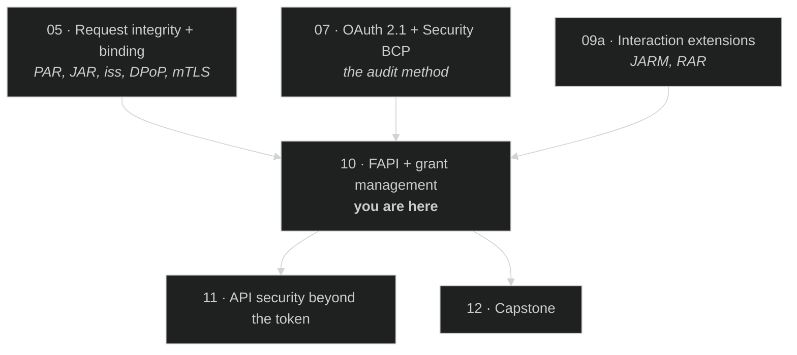

# Module 10 — FAPI + Grant Management

> **The short version:** Module 07 taught you to audit a deployment against a checklist. This module asks the
> question that checklist could not answer — *how do you know the checklist is complete?* FAPI 2.0's answer
> inverts the method: start from an explicit attacker model, state the security goals, then prove the profile
> achieves them. It is the only specification in this curriculum that makes a falsifiable security claim.

## Prerequisites

- **[Module 05 — Request Integrity + Binding](../05-request-integrity-and-binding/README.md)** — PAR, JAR,
  `iss`, DPoP, mTLS. FAPI 2.0 is largely a rule about which of these are mandatory.
- **[Module 07 — OAuth 2.1 + the Security BCP](../07-oauth-2-1-and-security-bcp/README.md)** — the audit
  method and the MUST/SHOULD reading discipline. You will use both, hard.
- **[Module 09a — Interaction Extensions](../09a-interaction-extensions/README.md)** — JARM, which FAPI 1.0
  required and FAPI 2.0 deliberately dropped.

---

## Why this module exists

Every module so far has had the same shape: *here is a mechanism, and here is the attack it stops.* PKCE
stops code interception. DPoP stops token replay. `iss` stops mix-up. Module 07 collected sixteen of those
into a checklist and taught you to audit against it.

That method has a hole in it, and it is the hole that matters most in a security review: **a checklist tells
you whether you did the listed things. It cannot tell you whether the list is the right list.** If an attack
is not on the list, no amount of diligent auditing will find it. Every module up to now has been implicitly
asking you to trust that the specification authors thought of everything.

FAPI 2.0 refuses to make that request. It does three things no other document in this curriculum does:

1. **It publishes its attacker model as a separate normative document** — six named attackers with explicitly
   enumerated capabilities.
2. **It states its security goals** in falsifiable terms: no attacker can obtain an access token for
   resources other than their own; no attacker can log in as another user; no attacker can force a user into
   the attacker's session.
3. **It submits to formal analysis.** The profile is machine-checked against the model.

So the claim is not "we implemented good practices." The claim is: *given these attackers and these goals,
here is a proof.* That is a completely different kind of assertion, and learning to read it is the point of
this module.

The practical payoff is a question you can ask any vendor, forever after: **"What is your attacker model, and
what is explicitly out of scope?"** A vendor who cannot answer has not finished thinking. A vendor who
answers precisely has told you exactly where to look.

---

> **No analogy in this module, deliberately.** Every module from 00 to 09a opened with a plain-language
> pass — a hotel, a bank, a notary — because a mechanism is easier to hold once you have something concrete
> to hang it on. This module has no mechanism. An **attacker model is already the plain-language version**:
> six people, described by what they can do. Wrapping it in a metaphor would add a layer to see through
> rather than remove one. Module 11 makes the same choice for the same reason.

## Learning objectives

By the end you can:

1. Recite the FAPI 2.0 attacker model — all six attackers — and state each one's capability in your own words.
2. Name what the attacker model **excludes**, and explain why an honest exclusion strengthens rather than
   weakens the claim.
3. Explain why FAPI 2.0 replaced JAR with PAR, JARM with plain `code`, and `s_hash` with PKCE.
4. Explain why FAPI 2.0 says AS *shall not* use refresh-token rotation "except in extraordinary
   circumstances", resolving the tension Module 03 left open — and say what those circumstances are.
5. Audit a deployment against §5.3.2 and distinguish "supports" from "requires" for every item.
6. Run the grant lifecycle, and say precisely what a grant revocation is required to destroy.

---

## Part 1 — The attacker model

**Verified against the primary source.** *FAPI 2.0 Attacker Model*, **OpenID Final**, published
**22 February 2025**.

> **A citation warning, and it is a live one.** The URL `openid.net/specs/fapi-2_0-attacker-model.html` still
> serves a **December 2022 Internet-Draft** whose attacker numbering is *different*: what the Final calls
> **A4** and **A5** were **A5** and **A7** in that draft. The Final lives at
> `fapi-attacker-model-2_0.html`. If you cite A7 for the resource-server attacker, you are quoting a
> superseded draft. This is not a hypothetical — it is the exact trap this curriculum's accuracy rules exist
> to catch, and it caught this author mid-build.

### The security goals (§5)

Read these first; the attackers only make sense as things that must not defeat these goals.

| Goal | The specification's words |
|---|---|
| **Authorization** (§5.2) | *"no attacker can access protected resources other than their own"* — fulfilled *"if no attacker can successfully obtain and use an access token for access to protected resources other than their own"* |
| **Authentication** (§5.3) | *"no attacker is able to log in at a client under the identity of another user"* |
| **Session integrity** (§5.4) | *"no attacker is able to force a user to be logged in under the identity of the attacker"* and *"no attacker is able to force a user to use resources of the attacker"* |

Session integrity is the one people forget. It is not about protecting the user's data from the attacker; it
is about protecting the user from *silently operating inside the attacker's account* — uploading documents
to the attacker's storage, or having their purchases charged to a card that is not theirs.

### The six attackers (§7)

| ID | Name | Capability (verbatim, condensed) |
|---|---|---|
| **A1** | Web attacker | *"can send and receive messages just like any other party controlling one or more endpoints on the internet"*, participate as a normal user, tamper with messages on their own endpoints, and *"send links to honest users that are then visited by these users."* Cannot intercept messages between other parties. |
| **A1a** | Web attacker as AS | *"a variant of the web attacker A1, but this attacker can also participate as an authorization server in the ecosystem"* — and can replay messages received from honest ASes. |
| **A2** | Network attacker | *"controls the whole network (like a rogue WiFi access point …). This attacker can intercept, block, and tamper with messages intended for other people"*, but cannot break cryptography. |
| **A3a** | Read authorization request | A1's capabilities *"but it can also read the authorization request sent in the front channel"* — via mobile URL registration, browser history, XSS on the AS, or TLS-intercepting anti-virus. |
| **A4** | Read/tamper token requests | *"makes the client use a token endpoint that is not the one of the honest authorization server."* |
| **A5** | Read resource requests | A1's capabilities *"but it can also read requests sent to the resource server after they have been processed"* — e.g. TLS-intercepting proxy logs. |

Two observations that repay attention.

**First, A1a exists as a separate attacker because "a legitimate AS in the ecosystem might be malicious" is a
distinct capability.** That is the mix-up attacker from Module 05, promoted to a first-class citizen of the
model rather than treated as one attack among many.

**Second — and this is the most instructive thing in the document — A4 is defined and then declared
irrelevant:**

> "This attacker is a model for misconfigured token endpoint URLs that were considered in FAPI 1.0. Since the
> FAPI 2.0 Security Profile mandates that the token endpoint address is obtained from an authoritative source
> and via a protected channel, i.e., through OAuth metadata obtained from the honest authorization server,
> this attacker is not relevant in FAPI 2.0. The description here is kept for informative purposes only."

A design decision *eliminated an entire attacker*, and the model records the fact rather than quietly
dropping it. That is what a mature threat model looks like: it keeps the history of what it defeated.

### What is out of scope (§6, §8)

An honest attacker model is defined as much by its exclusions. FAPI 2.0 assumes:

- **TLS is not broken** — *"data integrity and confidentiality are ensured."*
- **JWKS distribution works** — keys of uncompromised parties come from the correct endpoints.
- **Browsers and endpoints are not compromised.**
- **Identity and session management is out of scope** — *"End user's identity proofing, authentication,
  identity and access management on a client or authorization server are out of scope."*

And §8 adds: weak randomness (§8.3), anything outside the profile's boundaries such as firewall setup or
software development practice (§8.4), **implementation errors** (§8.5), and new vulnerabilities emerging over
time (§8.6).

Read §8.5 twice:

> "Real-world implementations, of course, sometimes deviate from the specified and formally analyzed behavior
> and contain security vulnerabilties on various levels."

**A formal proof about a specification says nothing about your code.** Every finding this curriculum has
surfaced in this repo — the open redirect, the empty `Location`, the token-exchange handler, the federation
endpoint — lives in §8.5's territory. The proof is real and the bugs are also real, and both facts are
compatible. Anyone who cites formal verification as though it covered their deployment has misread the
document.

---

## Part 2 — FAPI 1.0 → 2.0: what changed and why

**Verified.** *FAPI 1.0 Part 1: Baseline* and *Part 2: Advanced*, both **OpenID Final, 12 March 2021**.
*FAPI 2.0 Security Profile*, **OpenID Final, 22 February 2025**.

FAPI 1.0 was built the pre-BCP way: identify threats, add a countermeasure for each. FAPI 2.0 was built from
the attacker model. The result is *simpler*, which surprises people who assume newer means more. Here is the
specification's own comparison (§5.5, Table 1), with the reasons quoted:

| FAPI 1.0 Advanced | FAPI 2.0 | The reason (verbatim) |
|---|---|---|
| JAR | PAR | *"integrity protection and compatibility improvements for authorization requests"* |
| JARM | only `code` in response | *"the authorization response is reduced to only contain the authorization code, obsoleting the need for integrity protection"* |
| threat-based defences | attacker model + BCP | *"clearer design guideline, suitability for formal analysis"* |
| `s_hash` | PKCE | *"protection provided by state (in particular against CSRF) is now provided by PKCE; state integrity is partially protected by PAR"* |
| pre-registered redirect URIs | redirect URIs in PAR | *"pre-registration is not required with client authentication and PAR"* |
| `code id_token` or `code` | `code` | *"no ID token in front-channel (privacy improvement); nonce/signature check can be skipped by clients, PKCE cannot (security improvement)"* |
| ID token as detached signature | PKCE | *"ID token does not need to serve as a detached signature"* |
| MTLS only | MTLS **or** DPoP | *"DPoP can be easier to deploy in some scenarios"* |

Three of these are worth dwelling on.

**The hybrid flow is gone, and the reason is behavioural, not cryptographic.** *"nonce/signature check can be
skipped by clients, PKCE cannot."* A client that forgets to validate `c_hash` still appears to work — the
flow completes, users log in, nobody notices for years. A client that omits the `code_verifier` gets an
immediate, loud `invalid_grant`. **FAPI 2.0 preferred the mechanism that fails visibly over the mechanism
that fails silently.** That is a design principle worth stealing, and it is the same reasoning that made
Module 09b's `--require-claims` the right answer.

**JARM was dropped by removing the problem rather than solving it.** Module 09a taught JARM as the completion
of a triangle: PAR protects the request, JAR its integrity, JARM the response. FAPI 2.0 observes that if the
response contains *only* an authorization code — which PKCE already makes useless to a thief — then there is
nothing left in it worth protecting. Fewer moving parts, same goal. (JARM is not obsolete: FAPI 2.0 Message
Signing brings it back where non-repudiation is genuinely required.)

**`state` is no longer a security parameter.** §5.3.2.2 NOTE 4 says it plainly: *"In this document the state
parameter is not used for CSRF protection, but may be used to by the client for application state."* Module
03's table said `state` and PKCE do different jobs. FAPI 2.0 goes further and reassigns `state`'s security
job entirely to PKCE.

---

## Part 3 — What FAPI 2.0 actually requires

**§5.3.2.1 — general requirements on the authorization server.** These are `shall`, quoted:

| Requirement | Ties back to |
|---|---|
| *"shall distribute discovery metadata … as specified in [OIDD] and [RFC8414]"* | Module 04 — and it is what eliminates attacker A4 |
| *"shall reject requests using the resource owner password credentials grant"* | Module 01/07 |
| *"shall only support confidential clients"* | Module 03 |
| *"shall only issue sender-constrained access tokens"* | Module 05 |
| *"shall use one of the following methods for sender-constrained access tokens: MTLS …, DPoP"* | Module 05 |
| *"shall authenticate clients using one of the following methods: MTLS … or private_key_jwt"* | Module 06 |
| *"shall not expose open redirectors"* | Module 07 — **and this repo's logout endpoint fails it** |
| *"shall not use refresh token rotation except in extraordinary circumstances"* | Module 03 — see below |
| *"shall issue authorization codes with a maximum lifetime of 60 seconds"* | Module 02 |

**§5.3.2.2 — authorization endpoint flows.** Also `shall`:

- *"shall require the value of `response_type` … to be `code`"*
- *"shall support client-authenticated pushed authorization requests"* and *"shall reject authorization
  requests sent without [RFC9126]"*
- *"shall reject pushed authorization requests without client authentication"*
- *"shall require PKCE [RFC7636] with S256 as the code challenge method"*
- *"shall return an `iss` parameter in the authorization response according to [RFC9207]"*
- *"shall reject an authorization code … if it has been previously used"*
- *"shall issue pushed authorization requests `request_uri` with `expires_in` values of less than 600
  seconds"*
- *"shall not use the HTTP 307 status code when redirecting a request that contains user credentials"*

Note the precision of that `request_uri` bound: **less than** 600. A deployment issuing exactly 600 is
non-conformant. You will measure that number in the lab, and the deployment you are measuring issues exactly
600.

### Why refresh-token rotation is ruled out

Module 03 flagged this tension and deferred it. Here is the resolution, quoted from §5.3.2.1 NOTE 1:

> "The use of refresh token rotation does not provide security benefits when used with confidential clients
> and sender-constrained access tokens. This specification prohibits the use of refresh token rotation for
> security reasons as it causes user experience degradation and operational issues whenever the client fails
> to store or receive the new refresh token and has no option to retry."

Unpack the argument, because it is a model of how to reason about a control:

1. Rotation exists to **detect** refresh-token theft — a replayed old token reveals a compromise.
2. But FAPI 2.0 already requires **confidential clients** and **sender-constrained tokens**. A stolen refresh
   token is useless without the client's key. The threat rotation detects has already been eliminated.
3. So rotation now contributes **zero** security benefit and **non-zero** operational harm: a client that
   crashes between receiving and persisting a new refresh token is permanently locked out.
4. A control with no benefit and real cost is not neutral. It is a **defect**.

**And now the caveat the flat reading loses.** The normative text is *"shall not use refresh token rotation
**except in extraordinary circumstances**"*, and the exception is real rather than decorative: it exists for
things like infrastructure migration, and where it is invoked the profile expects the AS to give the client a
**time-limited window to retry with the old refresh token** so the failure mode in step 3 does not reappear.
So the accurate sentence is not "FAPI 2.0 bans rotation" but *"FAPI 2.0 rules out rotation as a matter of
course, and requires you to justify and cushion it if you ever switch it on."* NOTE 1 does use the word
*prohibits* — which is why the flat reading is tempting — but NOTE 1 is non-normative and the `shall not` it
is explaining carries the carve-out. When those two disagree, the requirement wins.

Note the phrase *"for security reasons."* Lockouts push operators toward long-lived access tokens and
retry-everything clients, which are worse than the thing rotation was guarding against. **A security control
that is not free must justify its cost against the specific threat it addresses in the specific architecture
you have.** Cargo-culting rotation into a FAPI 2.0 deployment makes it less secure.

### FAPI 2.0 Message Signing

**Verified.** *FAPI 2.0 Message Signing*, **OpenID Final, 25 September 2025.**

The Security Profile gets you authorization, authentication and session integrity. It does **not** get you
**non-repudiation** — the ability to prove later, to a third party, that a particular party sent a particular
message. That is a distinct property, it costs real complexity, and most deployments do not need it.

Message Signing layers JAR, JARM and signed introspection responses back on for the cases that do: a payment
instruction where the bank must later prove to a regulator exactly what the client asked for. **Do not adopt
it because it sounds stronger.** Adopt it when you can name the dispute you are trying to settle and the
party you would have to convince.

---

## Part 4 — Grant management

**Verified.** *"Grant Management for OAuth 2.0 (Draft)"* — Internet-Draft **`oauth-v2-grant-management-03`**,
published **9 May 2023**, intended status Standards Track, FAPI working group.

> **Note the status carefully.** The document's own title ends in *"(Draft)"* and its header identifies it as
> an Internet-Draft. This curriculum previously labelled it an "OpenID 2nd Implementer's Draft"; that label is
> **not supported by the document header**, and SPEC-INVENTORY has been corrected. Do not cite it as
> normative.

### The problem

OAuth gives the user a consent screen and then loses the thread. There is no standard way to ask *"what has
this client been granted?"*, no way to modify a grant without starting over, and — the one that bites in
regulated markets — no way to have **two independent grants** from the same user to the same client. A
banking client with consent to view accounts and a separate, differently-scoped consent to initiate a payment
has two grants, not one, and OAuth core cannot express that.

### The mechanism

Two authorization-request parameters (§5.2):

| Parameter | Meaning |
|---|---|
| `grant_id` | *"String value identifying an individual grant managed by a particular authorization server for a certain client and a certain resource owner."* |
| `grant_management_action` | `create`, `merge`, or `replace` |

- **`create`** — *"The AS will create a fresh grant."*
- **`merge`** — *"the AS will merge the permissions consented … in the actual request with those which
  already exist within the grant and shall invalidate existing refresh tokens associated with the updated
  grant."*
- **`replace`** — *"the AS will change the grant to be ONLY the permissions requested … and shall invalidate
  existing refresh tokens associated with the replaced grant."*

Both `merge` and `replace` invalidate existing refresh tokens. That is deliberate: a refresh token is a
frozen snapshot of a grant's authority, so changing the grant must invalidate it or the old authority
survives.

The API itself is two operations on a grant resource URL — `GET` to query, `DELETE` to revoke — authorized by
an access token carrying one of two scopes (§6.1): **`grant_management_query`** and
**`grant_management_revoke`**.

### The revocation rule — read the modal verbs

§6.5, and this single sentence is the whole exercise in the lab:

> "The AS MUST revoke the grant and all refresh tokens issued based on that particular grant, it should
> revoke all access tokens issued based on that particular grant."

**MUST** for refresh tokens. **should** for access tokens. That asymmetry is not sloppiness — it reflects
that access tokens are short-lived by assumption, so letting them expire naturally is tolerable. Which means
the rule is only safe **if your access tokens really are short-lived.** On a deployment with 24-hour access
tokens, "should" quietly becomes "the user's revocation does nothing for a day."

You will measure exactly that in the lab. It is the clearest demonstration in this curriculum of why
Module 07's rule — *a SHOULD without a written rationale is a finding* — has teeth.

§6.5 also draws a distinction worth keeping:

> "token revocation is not required to cause the revocation of the underlying grant. It is at the discretion
> of the AS to retain a grant in case of token revocation."

**Revoking a token is not revoking consent.** RFC 7009 (Module 04) discards a credential; grant revocation
withdraws authority. A "disconnect this app" button wired to RFC 7009 has not disconnected anything — the
next authorization request will sail through with no prompt.

---

## The table to internalise

| Document | Status | Date | What it contributes |
|---|---|---|---|
| FAPI 1.0 Part 1: Baseline | OpenID Final | 12 Mar 2021 | Read-access hardening floor |
| FAPI 1.0 Part 2: Advanced | OpenID Final | 12 Mar 2021 | JAR + JARM + MTLS; superseded in practice by 2.0 |
| FAPI 2.0 Security Profile | OpenID Final | 22 Feb 2025 | The `shall` list; simpler than 1.0 |
| FAPI 2.0 Attacker Model | OpenID Final | 22 Feb 2025 | Six attackers, three goals, explicit exclusions |
| FAPI 2.0 Message Signing | OpenID Final | 25 Sep 2025 | Non-repudiation, when you can name the dispute |
| Grant Management for OAuth 2.0 (Draft) | **Internet-Draft ‑03** | 9 May 2023 | `grant_id`, lifecycle actions, query/revoke API |

---

## Threat model for this module

| Threat | FAPI 2.0's answer | Fails when |
|---|---|---|
| Stolen access token replayed (A1, A5) | Sender-constraining: MTLS or DPoP, **mandatory** | Bearer tokens are still accepted anywhere |
| Authorization request read (A3a) | PAR — the request never traverses the front channel | PAR supported but not required |
| Code interception (A3a) | PKCE with S256, **mandatory** | PKCE optional, or `plain` permitted |
| Mix-up via a malicious AS (A1a) | `iss` in the authorization response, **mandatory** | `issSuppressed`, or the client ignores `iss` |
| Misconfigured token endpoint (A4) | Metadata from an authoritative source — **attacker eliminated** | Endpoints hand-configured per client |
| Client-secret theft | MTLS or `private_key_jwt` only | `client_secret_basic` accepted |
| Lockout from rotation failures | Rotation ruled out (`shall not`, narrow exception) | Rotation enabled "because it is more secure" |
| Consent withdrawn but access continues | Grant revocation kills refresh tokens (MUST) | Access tokens outlive the grant — 24 h here |
| Anything in §8 | **Nothing.** Explicitly out of scope | You believed the proof covered your code |

---

## Common mistakes

**❌ "We're FAPI 2.0 because we support PAR, PKCE, and DPoP."**

**✅ Supporting is not requiring.** Every `shall` in §5.3.2 is about what the AS *rejects*. An AS that
supports PAR and also accepts non-PAR requests has satisfied nothing — the attacker simply does not use PAR.
This is the single most common false claim in the field, and the lab makes you demonstrate it on a deployment
that supports all three and requires none.

---

**❌ "It's formally verified, so it's secure."**

**✅ The proof is about the specification, not your implementation.** §8.5 says so directly. Formal
verification eliminates *design* flaws; it has nothing to say about your open redirect.

---

**❌ Enabling refresh-token rotation in a FAPI 2.0 deployment "for defence in depth."**

**✅ It is ruled out (`shall not`, bar extraordinary circumstances), because it has no benefit here and real cost.** §5.3.2.1 + NOTE 1. Defence
in depth means independent layers against a live threat, not repeating a control whose threat you already
eliminated.

---

**❌ Treating FAPI 1.0 Advanced as "FAPI 2.0 minus some things."**

**✅ They are different methods.** 1.0 accreted countermeasures per threat; 2.0 derives requirements from an
attacker model. That is why 2.0 is *smaller*.

---

**❌ Wiring a "disconnect this app" button to RFC 7009 token revocation.**

**✅ That discards a credential; it does not withdraw consent.** The grant survives and the next authorization
request is silently approved. Use grant revocation — and check that your access-token lifetime makes the
`should` clause meaningful.

---

## What just happened?

You met the first specification in this curriculum that can be **wrong**.

Every other document says "do this." FAPI 2.0 says "given these six attackers, these three goals are
achieved" — a claim with a truth value, checkable by anyone. And it pays for that precision by having to
enumerate what it does *not* cover, which is why §8 is the most useful section in it.

That reframes the reviewer's job. Instead of "did they implement the mechanisms?", the questions become:

1. **What is the attacker model?** If nobody can state it, the security claim has no content.
2. **What is out of scope?** That is where the next incident comes from.
3. **Is each mechanism required, or merely supported?** Only the first has any effect on an attacker.
4. **Does the deployment's numbers match the profile's numbers?** 600 is not less than 600.

Question 3 is the one that will earn its keep most often, and question 4 is the one people find pedantic
until it appears in a conformance report.

---

## What actually runs in this repo

| Capability | State here |
|---|---|
| **Every FAPI 2.0 mechanism** | PAR, PKCE S256, `iss`, DPoP all **work** — verified in Module 05 and again here |
| **FAPI enforcement** | **Off.** `fapiModes` and `supportedServiceProfiles` are absent; nothing is required |
| **`/api/fapi/config`, `/api/fapi/status`** | **Working since 2026-08-12** — `mode: "disabled"`, read from the live service. They were broken for the whole of this module's history: HTTP **200** with an error body until 2026-08-11, then an honest **500** until the `SPIFFE_JWT` enum gap was closed at the service. Exercise 4 takes all three states apart, and names what they still under-report |
| **mTLS** | Not implemented, and **no longer advertised** — `tls_client_auth` and `self_signed_tls_client_auth` were withdrawn from `token_endpoint_auth_methods_supported` on 2026-08-12; `tlsClientCertificateBoundAccessTokens: false` |
| **`private_key_jwt`** | **Usable since 2026-08-12** — one of the four clients is registered `PRIVATE_KEY_JWT` with a JWKS and authenticates with a real client assertion. Still not *required* of anyone, which is the FAPI gap; before that date no client had a key and it could not be exercised at all |
| **Grant management** | **Fully working** — create, query, revoke all verified end to end. The one thing in this module that is complete |

The lab is built around that gap. A deployment where every mechanism is available and none is mandatory is
not a broken lab — it is the single most common real-world FAPI posture, and learning to describe it
precisely is the skill.

---

## Where this sits in the dependency graph

Module 11 is where the last assumption goes: FAPI guarantees the token reaching your API is genuine and
belongs to the presenter. It says nothing about whether *that* user should see *this* object. A perfect FAPI
2.0 deployment can still hand every customer record to anyone who increments an ID.

---

## Assigned reading

- **[`docs/FAPI-TUTORIAL.md`](../../../FAPI-TUTORIAL.md)** — this repo's FAPI 2.0 walkthrough, including the
  console setup and the DPoP failure demonstrations. It covers the *how*; this module supplies the *why*.
- **[`docs/GRANT-MANAGEMENT.md`](../../../GRANT-MANAGEMENT.md)** — the grant lifecycle with worked `curl`
  scenarios.
- **FAPI 2.0 Attacker Model §5–§8** — short, and the most valuable reading in this module. Note the URL
  warning above.
- **FAPI 2.0 Security Profile §5.3.2 and §5.5** — the `shall` list and the 1.0-vs-2.0 table.

---

## Then do the lab

**[→ lab.md](lab.md)** — you run a flow that violates every FAPI 2.0 requirement simultaneously and still
gets a 24-hour Bearer token, measure the deployment's numbers against the profile's, run the grant lifecycle
end to end, and discover what a revoked grant does *not* revoke. The deliverable is a conformance report.

Then **[→ quiz.md](quiz.md)** (18 items, four tiers). Tier 4 is the last checkpoint before the capstone
material begins.

---

## Onward

**[Module 11 — API Security Beyond the Token](../11-api-security-beyond-the-token/README.md)** leaves the
authorization server behind entirely. Everything from Module 00 to here has been about *getting a
trustworthy token to the resource server*. Module 11 starts from the moment the token arrives, valid and
sender-constrained, and asks the question no OAuth specification answers: **should this subject be allowed to
touch this object?** That is BOLA, and it is the most common serious API vulnerability in the world.
