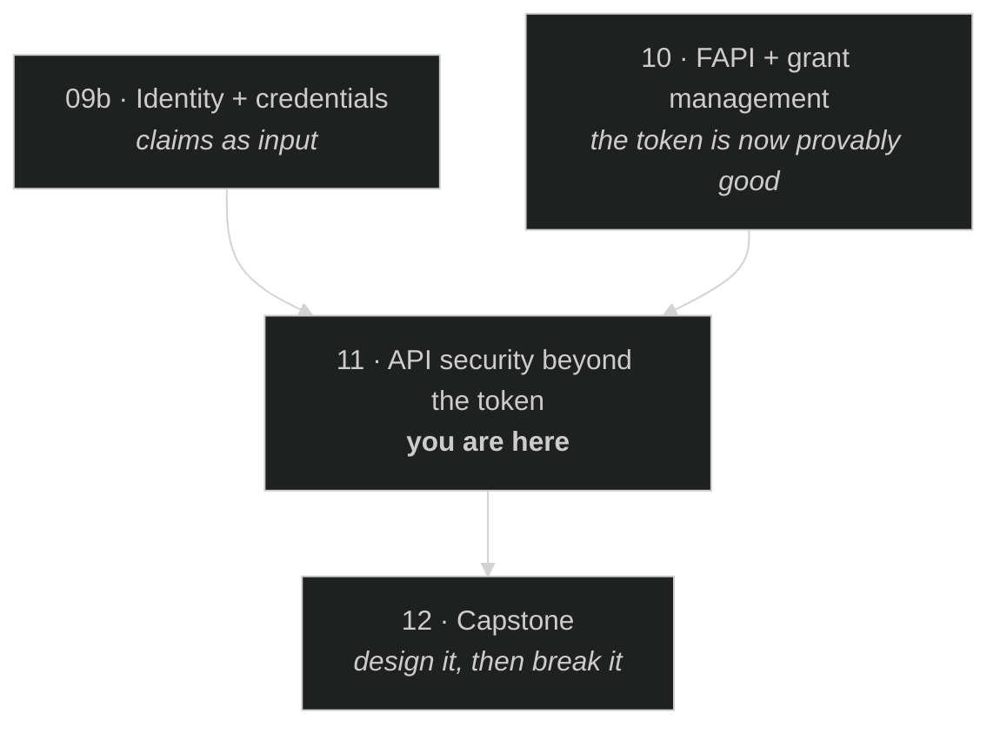

# Module 11 — API Security Beyond the Token

> **The short version:** eleven modules of work have made the token trustworthy — unforgeable, audience-
> restricted, sender-constrained, issued under a formally verified profile. None of that answers the only
> question your API actually has to answer: **may *this* subject touch *this* object?** OAuth has no opinion
> on that, and the gap is where the most common serious API vulnerability in the world lives.

## Prerequisites

- **[Module 10 — FAPI + Grant Management](../10-fapi-and-grant-management/README.md)** — you need the
  attacker-model habit and the audit method.
- **[Module 09b — Identity + Credentials](../09b-identity-and-credentials/README.md)** — claims as
  authorization input.

---

## Why this module exists

Assume everything went right. Mandatory PAR. PKCE with S256. `private_key_jwt`. A DPoP-bound access token
with a 60-second authorization code behind it, `aud` restricted to your API, issued by an authorization
server conforming to a profile with a machine-checked security proof.

A request arrives:

```http
GET /api/accounts/91847/transactions
Authorization: DPoP eyJhbGciOiJFUzI1NiIs...
DPoP: eyJ0eXAiOiJkcG9wK2p3dCIs...
```

Every check passes. The signature verifies, the audience matches, the proof binds the token to the key, the
scope `accounts:read` is present. **Should this request be allowed?**

You cannot tell. Nothing in the token says whether account `91847` belongs to the subject presenting it. The
token says *who* is calling and *what kind of thing* they may do. It says nothing about *which instances*.
And the caller controls `91847` — it is just a number in a URL that they can change to `91848`.

That is **Broken Object Level Authorization**, OWASP's **API1:2023**, ranked first because it is both the
most common and the most damaging API vulnerability there is. Every OAuth control in this curriculum is
orthogonal to it. A perfect FAPI 2.0 deployment is exactly as vulnerable as a bad one.

Here is the shape of the gap, and it is worth stating precisely:

| OAuth answers | OAuth does not answer |
|---|---|
| Is the caller who they claim to be? | Does the object they named belong to them? |
| May they perform *a* transfer? | May they transfer from *this* account? |
| Is the token bound to their key? | Is the record they requested in their tenant? |
| Has consent been granted? | Which rows does that consent cover? |

The left column is a **protocol** problem, and eleven modules have solved it. The right column is an
**application** problem, and no protocol can solve it — because only your application knows what "belongs
to" means for your data.

---

> **No analogy here either**, and for the same reason as Module 10: there is nothing to make concrete.
> `GET /accounts/91848` **is** the plain-language version. Every metaphor available — a hotel key that opens
> the wrong room, a filing cabinet with no locks — is further from the attack than the request above, and the
> whole point of this module is that the attack is *already* as simple as it looks.

## Learning objectives

By the end you can:

1. Name the OWASP API Security Top 10 (2023) and identify the **three** that are authorization failures.
2. Explain structurally why a valid token cannot prevent BOLA, and why scope checks are not object checks.
3. Distinguish BOLA, BFLA and BOPLA by what the attacker changes in the request.
4. Choose between RBAC, ABAC and ReBAC for a given data model, and defend it.
5. Decide where the authorization check belongs — gateway or service — and say what each cannot do.
6. Find a BOLA in a code review, and write a test that would have caught it.

---

## The OWASP API Security Top 10 (2023)

**Verified against the primary source** (`owasp.org/API-Security/editions/2023/`). The 2023 edition is
current; the identifiers carry the year for a reason — the 2019 list differs and citing it dates you.

| ID | Title (verbatim) | Authorization failure? |
|---|---|---|
| **API1:2023** | Broken Object Level Authorization | **Yes** |
| API2:2023 | Broken Authentication | no — this is the part OAuth solves |
| **API3:2023** | Broken Object Property Level Authorization | **Yes** |
| API4:2023 | Unrestricted Resource Consumption | no |
| **API5:2023** | Broken Function Level Authorization | **Yes** |
| API6:2023 | Unrestricted Access to Sensitive Business Flows | partly |
| API7:2023 | Server Side Request Forgery | no |
| API8:2023 | Security Misconfiguration | no — but it *causes* the others |
| API9:2023 | Improper Inventory Management | no |
| API10:2023 | Unsafe Consumption of APIs | no |

**Three of the top five are authorization failures, and OAuth addresses none of them.** API2 — broken
authentication — is the one this curriculum has spent eleven modules on. It is one item out of ten, and it
is not the first.

### The three, distinguished by what the attacker changes

This is the distinction people blur, and it matters because the fixes live in different places:

| | Attacker changes | Example | Fix belongs in |
|---|---|---|---|
| **BOLA** (API1) | The **object identifier** | `/accounts/91847` → `/accounts/91848` | The data query: filter by owner |
| **BOPLA** (API3) | Nothing — reads **extra fields** in the response, or writes fields they shouldn't | Response leaks `internal_risk_score`; a `PATCH` sets `is_admin: true` | Explicit input/output schemas |
| **BFLA** (API5) | The **endpoint or method** | `GET /users/me` → `DELETE /admin/users/7` | Route-level authorization |

A single mental test that separates them: **BOLA is "wrong row", BOPLA is "wrong column", BFLA is "wrong
verb".**

BOPLA is the sneakiest of the three, because both halves are invisible in a passing test suite. Mass
assignment — binding a request body straight onto a model — turns any writable field into an attack surface,
and returning a whole database row because it was convenient leaks fields nobody audited.

---

## Why a valid token cannot stop BOLA

Not "usually doesn't". *Cannot*. The argument is worth being able to reconstruct:

1. An access token is issued **before** the request exists. At issuance time the AS knows the subject, the
   client, and the scopes. It does not and cannot know which object IDs the caller will name later.
2. Scopes are **type-level**, not instance-level. `accounts:read` means "may read accounts", never "may read
   account 91847". Making scopes instance-level does not work: you would need one scope per object, and
   scope is a space-delimited string in a URL.
3. Object ownership is **application data**. The AS does not have your database. Only your service knows that
   account 91847 belongs to customer 4412.
4. Therefore the check **must** happen in the application, at the moment of the request, against the data.

There is no configuration that outsources this. This is also why RAR (Module 09a) is only a partial answer:
`authorization_details` can carry a specific account number, which genuinely narrows the token — but it
narrows it to *what the client asked for and the user consented to*, and your service must **still** verify
that the object in the URL matches the object in the token. RAR moves the goalposts; it does not remove the
check.

### The check that actually works

The reliable fix is not a check at all — it is making the unsafe query unrepresentable:

```js
// ❌ Check-then-use. The check can be forgotten, and often is.
const account = await db.accounts.findById(req.params.id);
if (account.ownerId !== req.user.sub) return res.sendStatus(403);

// ✅ Scope the query. There is no way to read someone else's row.
const account = await db.accounts.findOne({ id: req.params.id, ownerId: req.user.sub });
if (!account) return res.sendStatus(404);
```

Both are correct. The second is *durably* correct, because the next developer who adds an endpoint copies a
query that already carries the constraint. **Prefer designs where the insecure version is hard to write over
designs that rely on remembering.** The same instinct decided FAPI 2.0's choice of PKCE over `c_hash`
(Module 10) — prefer the mechanism whose absence is loud.

Note the `404`, not `403`. Returning `403` confirms the object exists, which turns your error handling into
an enumeration oracle — the same anti-oracle reasoning as RFC 7662 in Module 04.

---

## Scopes, claims, and RAR as authorization inputs

Three things a token can carry, at three different granularities. Choosing the wrong one is a common design
error.

| Input | Granularity | Good for | Fails at |
|---|---|---|---|
| **Scope** | Type / action | "may read accounts", coarse API surface | Instances. `accounts:read:91847` does not scale |
| **Claims** | Attributes of the subject | `department`, `tenant_id`, `acr` — inputs to a policy | Anything the AS does not know about your data |
| **RAR** (`authorization_details`) | Structured, instance-capable | "transfer €50 from IBAN X to IBAN Y" — consent to a *specific* act | Still requires the service to match it against the request |

**The rule:** scopes gate the *endpoint*; claims feed the *policy*; the *data layer* enforces the object.
Anyone using scope for object-level access has an exploding scope string and a BOLA anyway.

A `tenant_id` claim deserves a special warning. It is genuinely useful — but only if every query is scoped by
it and the value can never be influenced by the caller. A tenant ID read from a request header or body rather
than the validated token is one of the most reliable ways to build a cross-tenant breach.

---

## RBAC, ABAC, ReBAC

| Model | Decides on | Natural fit | Weakness |
|---|---|---|---|
| **RBAC** | The subject's **role** | Small, stable, org-shaped permission sets | Role explosion; cannot express "their own" |
| **ABAC** | **Attributes** of subject, resource, action, environment | Policy that depends on data (clearance ≥ classification; office hours) | Hard to answer "who can see X?"; policies drift |
| **ReBAC** | **Relationships** in a graph | Sharing, hierarchies, "documents in folders I own" | Needs a real relationship store; harder to operate |

The decisive question is not which is fashionable but: **can your rule be expressed without reference to the
specific object?**

- "Admins may delete users" → **RBAC**.
- "Doctors may read records of patients in their own ward, during their shift" → **ABAC**.
- "You may read a document if you own the folder it is in, or someone shared it with you, transitively" →
  **ReBAC**, and nothing else will do it without pain.

Notice that pure RBAC cannot express BOLA's fix at all. "Customers may read accounts" is a role check that
passes for every account in the database. **A deployment that only does RBAC has a BOLA by construction** —
which is a large part of why API1 tops the list.

Most real systems are hybrids: RBAC for the endpoint (BFLA), and an ownership or relationship check at the
data layer (BOLA). That is a perfectly good design; the failure mode is doing only the first half and
believing you are done.

---

## Where to enforce: gateway or service?

| | Gateway can | Gateway cannot |
|---|---|---|
| Validate the token, signature, `aud`, `exp` | ✅ | |
| Enforce scope per route (BFLA) | ✅ | |
| Rate limit, quota (API4) | ✅ | |
| Check object ownership (BOLA) | | ❌ — it does not have your data |
| Filter response fields (BOPLA) | | ❌ — it does not know which fields are sensitive |

So the split is not a matter of taste: **the gateway does the token and the verb; the service does the row and
the column.** Anything else is either duplicated or missing.

The failure mode to watch for is the one this creates socially rather than technically: a gateway that
handles "auth" gives every service team the impression that auth is handled. It is handled — the half of it
that is not the half that gets you breached. If you operate a gateway, say explicitly and often what it does
*not* do.

Two corollaries:

- **Never trust an internal network boundary.** If services call each other with a header like
  `X-User-Id: 4412` and no token, any service (or anyone who reaches the network) can impersonate any user.
  Propagate the token, or use token exchange (Module 06) to get a properly scoped one.
- **Every entry point needs the check.** A GraphQL resolver, a batch job, an admin console and a gRPC method
  reading the same table all need the same constraint. This is the strongest practical argument for putting
  it in the data layer.

---

## Two operational controls that are not authorization

Brief, because they matter and neither is glamorous.

**Key rotation.** Every signature check in this curriculum resolves to a key. Publish a JWKS, put `kid` in
every token header, verifiers select by `kid` and re-fetch on an unknown one, and **overlap old and new keys**
across the longest token lifetime you issue. The most common rotation outage is removing the old key before
the last token signed with it expires — which is a good reason to keep token lifetimes short beyond the
security argument. (This deployment's JWKS holds **two** keys since 2026-08-12 — EC P-256 `kid: "1"` and RSA
`kid: "rsa-1"` — so Module 00's exercise selects by `kty` and Module 08's by `kid`. Note that publishing two
keys is not itself a rotation: nothing here has been retired, and a real rotation is defined by the
*overlap window* you leave, not by the key count.)

**Conformance testing.** The OpenID Foundation runs conformance suites for FAPI, OIDC and CIBA. They test
*protocol* behaviour and they are genuinely worth running. They will never find a BOLA, because they do not
know what your objects are. Module 10 §8.5 already made this point about formal proofs; it applies here too.
**Certification is evidence about your protocol layer and silence about your application layer.**

---

## Spec delta — 2019 → 2023, and what drove it

The identifiers carry a year because the list moved, and citing the wrong one dates you. Here is what
actually changed.

> **What is verified here, and what is mine.** The two lists and the mapping between them are checked
> against `owasp.org/API-Security/editions/2019/` and `/2023/` (consulted 2026-08-02) — every title below is
> verbatim. The **merge in row 3 is OWASP's own statement**: the 2023 page for API3 says it *"combines
> API3:2019 Excessive Data Exposure and API6:2019 - Mass Assignment."* The **"what drove the change" column
> is otherwise my reading**, not the project's. Treat the left two columns as citable and the right one as
> commentary — a distinction worth making in your own reports, too.

| 2019 | 2023 | What drove the change |
|---|---|---|
| API1 Broken Object Level Authorization | **API1** — unchanged, still first | Nothing dislodged it. It remained the most reported and most damaging class across the four years between editions |
| API2 Broken User Authentication | **API2 Broken Authentication** | Renamed: "user" was misleading once machine-to-machine and service identities became the majority of API traffic |
| API3 Excessive Data Exposure **+** API6 Mass Assignment | **API3 Broken Object Property Level Authorization** | **The most instructive merge, and the one change OWASP states outright.** Reading fields you should not see and writing fields you should not set were listed as two problems; they are one — *authorization at the property level*, failing in the read and write directions. Splitting them hid the shared fix (explicit schemas both ways) |
| API4 Lack of Resources & Rate Limiting | **API4 Unrestricted Resource Consumption** | Broadened past rate limits to the thing that actually costs you: CPU, memory, storage, and third-party spend per request |
| API5 Broken Function Level Authorization | **API5** — unchanged | |
| *(new)* | **API6 Unrestricted Access to Sensitive Business Flows** | **The genuinely new entry.** Recognises attacks where every individual request is authorized and the *aggregate* is the abuse — scalping, scraping, mass account creation. No per-request authorization check can see it |
| API7 Security Misconfiguration | **API7 Server Side Request Forgery** | SSRF promoted to its own entry as APIs increasingly fetch attacker-supplied URLs; misconfiguration moved to API8 |
| API8 Injection | *(dropped from the list)* | Not solved — reclassified. Injection is a general application-security problem rather than an API-specific one, and it is covered by the main OWASP Top 10 |
| API9 Improper Assets Management | **API9 Improper Inventory Management** | Renamed to say what it means: undocumented, forgotten and unretired endpoints |
| API10 Insufficient Logging & Monitoring | **API10 Unsafe Consumption of APIs** | **The most interesting substitution.** Logging left the list; *being a client of someone else's API* joined it. The observation is that teams apply less scrutiny to data they consume from a third party than to data from their users — and third-party responses are attacker-influenceable too |

**Three things to take from the diff**, all of which generalise past OWASP:

1. **The merge (API3) is a lesson about taxonomy.** Two entries became one because they shared a *fix*.
   A threat catalogue is only useful if its categories map onto remediations; when two rows always get
   patched together, they were one row.
2. **The addition (API6) is a lesson about scope.** It is the only entry that cannot be evaluated on a single
   request, which is why it is the only one your authorization layer cannot enforce and `docs/MONITORING.md`
   is assigned reading.
3. **The removal (Injection) is a lesson about boundaries.** It left not because it stopped happening but
   because it was never *API-specific*. A list that grows to cover everything stops directing attention.

Note what did **not** move: **API1 is still first, and the three authorization failures are still three of the
top five.** Four years of industry effort, and the untouched conclusion is that authorization is where APIs
break.

## Threat model for this module

| Threat | OWASP | Why OAuth misses it | Control |
|---|---|---|---|
| Read another user's record by ID | API1 | Token is issued before the ID exists | Owner-scoped queries; 404 not 403 |
| Enumerate records to size the breach | API1 | Valid token on every request | Owner-scoped queries + rate limits + alerting on 404 spikes |
| Response leaks internal fields | API3 | Token says nothing about fields | Explicit output schemas |
| Mass assignment sets `is_admin` | API3 | Token says nothing about fields | Explicit input allow-lists |
| Call an admin endpoint as a normal user | API5 | Scope may be absent, or the check fails open | Deny-by-default routing; **fail closed** |
| Cross-tenant access via a header | API1 | Header is not the token | Tenant from validated token only |
| Unauthenticated management API | API5 + API8 | No token is involved at all | Fail-closed auth middleware |
| Scraping a business flow at scale | API6 | Every request is individually legitimate | Behavioural limits, not per-request checks |

That last row is worth a moment. API6 is the one where **every single request is authorized and the aggregate
is the attack** — buying all the concert tickets, scraping every profile you are technically allowed to view.
No per-request authorization check can see it. It is a rate, pattern and business-logic problem, and it is
why `docs/MONITORING.md` is assigned reading for this module rather than an afterthought.

---

## Common mistakes

**❌ "We validate the JWT on every request, so we're secure."**

**✅ You have solved API2 and nothing else.** Validation proves who is calling. BOLA is about what they named.

---

**❌ Checking scope and calling it authorization**

```js
if (!token.scope.includes('accounts:read')) return res.sendStatus(403);
return db.accounts.findById(req.params.id);          // any account, for anyone
```

**✅ Scope gates the endpoint; the query enforces the object.** Both, always.

---

**❌ `403` when the object belongs to someone else**

**✅ `404`.** `403` confirms existence and turns the endpoint into an enumeration oracle.

That is the default, and it is the answer to give when the identifier is guessable. This repo's own fix chose
`403` instead, on a specific argument about high-entropy grant IDs and defender diagnostics — see lab
Exercise 4, and decide whether you buy it.

---

**❌ Trusting `X-User-Id` or `tenant_id` from a header, body, or query parameter**

**✅ Take the subject and tenant from the validated token, every time.** If an internal service needs to act
for a user, propagate the token or exchange it (Module 06) — do not invent a header.

---

**❌ Auth middleware that allows the request when its configuration is missing**

```js
if (!process.env.MGMT_CLIENT_ID || !process.env.MGMT_CLIENT_SECRET) return true;   // allow
```

**✅ Fail closed.** An unset variable should refuse service, loudly, at startup — *loudly* being half the
requirement, since a fail-closed check with no diagnostics trades a silent breach for a silent outage. This
exact pattern was in this repo. The lab has you put it back, exploit it, and then read the patch that removed
it.

---

## What just happened?

You reached the end of what protocols can do for you.

Modules 00–10 were about a single question — *can I trust this token?* — and the answer got progressively
stronger until it was provable. Module 11 points out that the question was never sufficient. The token tells
you **who**. Your application has to decide **what, on which**, and that decision cannot be delegated to an
authorization server, a gateway, a specification, or a certification.

The practical consequence for a reviewer: when you audit an API, **the OAuth configuration is the easy half
and it is not where the breach will come from.** Spend proportionate time on the resource server, and start
by asking for a single endpoint that returns an object by ID.

---

## What actually runs in this repo

The lab is unusually direct because this repo has real object-level endpoints, and because two genuine
vulnerabilities were found in it while this module was being built. **Both are now fixed** — in commit
`0229daa` — so the lab has you re-introduce each defect with a one-line, `git`-revertible edit, exploit it for
real, and then read the patch that closed it.

| Surface | The defect that was there | What is there now |
|---|---|---|
| `/api/gm/:grantId` | Valid, correctly scoped token accepted — with **no check of who owns the grant** | `requireGrantOwnership` introspects the token and requires the grant to match; **403** otherwise |
| `/api/client/*` (16 routes) | Auth middleware correctly wired, but **failed open** when unconfigured | Fails closed, with an error log per rejection and a startup warning |
| `/api/token/list` | Same; listed every access token on the service | Same fix — the middleware is shared |
| `/api/hsk/*`, `/api/vci/offer/*` | Same middleware, same behaviour | Same fix |
| `docs/MONITORING.md`, `audit-log.ts`, `rate-limit.ts` | — | The detection half — Prometheus metrics and a 90-day audit log |

You will exploit both against a live server, determine which layer owns each defect, and then argue with the
fix — the shipped denial for the BOLA is a **403**, and the model answer in this module says it should be a
**404**. Lab Exercise 4 makes you settle it.

---

## Where this sits in the dependency graph



---

## Assigned reading

- **[`docs/MONITORING.md`](../../../MONITORING.md)** — the Prometheus/Grafana setup. Read it as *detection*:
  which of this module's threats would show up, and which would not.
- **`server/src/middleware/audit-log.ts`** and **`rate-limit.ts`** — what this repo records and throttles.
- **OWASP API Security Top 10 (2023)**, at minimum API1, API3 and API5.
- **`server/src/routes/client.routes.ts`** — 41 lines. Read it before the lab and predict what happens.

---

## Then do the lab

**[→ lab.md](lab.md)** — you retrieve a confidential client's secret without credentials, then run a
cross-user BOLA that lets one user **destroy another user's grant**, then prove which layer is responsible.

Then **[→ quiz.md](quiz.md)** (18 items, four tiers). Tier 4 is the last gate before the capstone.

---

## Onward

**[Module 12 — Capstone](../12-capstone/README.md)** puts all of it together: design a high-assurance
multi-tenant authorization architecture, defend each choice against a named attacker model, and then review a
deliberately vulnerable variant and find what is wrong with it. Everything from the delegation problem to
BOLA is in scope, and the grading rubric is the definition of done at the bottom of the
[curriculum README](../../README.md).
